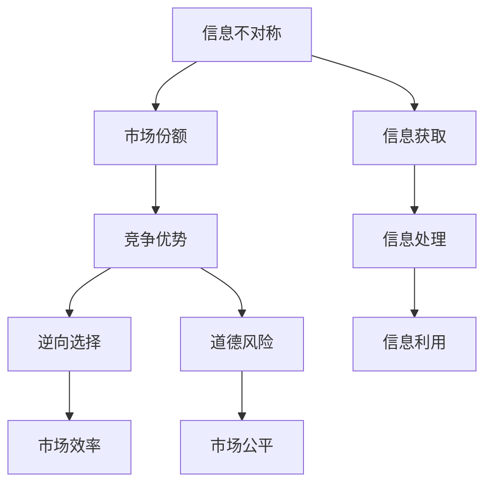

                 

# 信息差：信息不对称与市场份额

信息差是指市场参与者所掌握信息的不对称性，即一方拥有的信息比另一方多，从而在决策和市场份额上占据优势。这种信息不对称现象在各个领域都普遍存在，如金融、医疗、消费等。理解信息差对于优化市场策略、提升决策效率具有重要意义。本文将从背景介绍、核心概念、算法原理、项目实践、实际应用、未来展望和常见问题解答等多个角度，全面系统地探讨信息差与市场份额之间的关系，以及如何利用信息差创造市场优势。

## 1. 背景介绍

### 1.1 问题由来

在市场经济中，信息不对称普遍存在。信息优势方通常能够更好地预测市场趋势、把握交易时机，从而在竞争中获得更大的市场份额。信息差在金融市场中尤为明显，例如，金融机构通过收集和分析市场数据，能够比普通投资者更早地发现投资机会，从而获得超额收益。在消费品市场，品牌通过掌握产品创新、消费者偏好等数据，可以更精准地制定营销策略，提高市场竞争力。

信息不对称不仅影响市场效率，还可能引发道德风险和逆向选择等问题。例如，保险市场中，保险公司很难全面了解投保人的风险状况，导致高风险客户更愿意投保，低风险客户则选择退出，导致保险公司无法准确定价，市场失灵。

### 1.2 问题核心关键点

信息差的核心在于信息的获取和处理能力。信息差的量级直接决定市场参与者的竞争力和市场份额。

- **信息的获取**：收集信息的全面性和及时性是关键。信息获取的渠道和方式对信息不对称程度有重要影响。例如，金融机构通过大数据分析和实时监控，可以获取市场波动信息，而普通投资者只能依赖有限的新闻报道和市场情绪。
- **信息处理能力**：处理信息的能力包括数据分析、算法模型等技术手段。对信息进行有效处理，提取关键特征，是把握市场趋势的基础。
- **信息利用效率**：信息的利用效率直接关系到市场策略的制定和执行。高效的决策机制和执行能力能够最大化信息优势，提升市场份额。

### 1.3 问题研究意义

深入理解信息差与市场份额的关系，对市场策略优化、决策效率提升具有重要意义。通过识别信息差的关键环节，可以提高信息获取、处理和利用的效率，从而在市场竞争中占据优势。

信息差研究的实用价值在于：

- 优化市场策略：通过收集和分析信息，识别市场趋势，制定差异化的市场策略。
- 提升决策效率：利用高效的信息处理技术和算法模型，快速作出决策，把握市场机遇。
- 防范道德风险：通过透明的信息披露和监督机制，避免信息不对称引发的道德风险和逆向选择问题。
- 促进市场公平：通过信息共享和透明度提升，缩小信息差，促进市场公平竞争。

## 2. 核心概念与联系

### 2.1 核心概念概述

本节将介绍几个与信息差和市场份额密切相关的核心概念：

- **信息不对称（Information Asymmetry）**：指市场参与者所掌握的信息存在差异，导致决策信息不对等。
- **市场份额（Market Share）**：指某个品牌、产品或服务在总市场中的占比。市场份额受多种因素影响，包括产品质量、价格、营销策略等。
- **竞争优势（Competitive Advantage）**：指在市场竞争中，某个参与者相对于其他对手所具备的竞争优势。信息差是竞争优势的重要来源。
- **逆向选择（Adverse Selection）**：在信息不对称情况下，市场参与者行为扭曲，导致低质量产品驱逐高质量产品。
- **道德风险（Moral Hazard）**：在信息不对称情况下，参与者可能采取不利于信息提供方的行为，导致市场效率下降。

这些概念之间存在紧密的逻辑关系，通过信息差可以影响市场份额，进而影响竞争优势。信息差的识别和利用是优化市场策略和提升决策效率的关键。

### 2.2 核心概念原理和架构的 Mermaid 流程图



该流程图展示了信息差在市场中的流动和影响路径：

1. 信息不对称（A）通过信息获取（F）、信息处理（G）、信息利用（H），影响市场份额（B）。
2. 市场份额（B）通过竞争优势（C），影响逆向选择（D）和道德风险（E）。
3. 市场效率（I）和市场公平（J）则进一步影响竞争优势（C）。

### 2.3 核心概念联系

信息不对称（A）直接影响市场份额（B），进而影响竞争优势（C）。同时，市场效率（I）和市场公平（J）对竞争优势（C）也有重要影响。

1. **信息获取（F）**：市场参与者通过各种渠道获取信息，包括公开数据、竞争对手行动、市场反馈等。信息获取的全面性和及时性直接影响信息不对称的程度。
2. **信息处理（G）**：对获取到的信息进行处理，包括数据清洗、特征提取、模型训练等，转化为可用的信息。信息处理的技术水平和算法选择对信息的不对称程度有重要影响。
3. **信息利用（H）**：将处理后的信息转化为具体的市场策略和行动，如产品定价、广告投放、供应链优化等。信息利用的效率和效果决定了市场策略的有效性。

信息差的核心在于信息获取、处理和利用过程中，如何最大化信息优势，减少信息不对称，从而在市场竞争中占据优势。

## 3. 核心算法原理 & 具体操作步骤

### 3.1 算法原理概述

信息差与市场份额的关系可以通过数学模型进行刻画。假设市场中有两个竞争者，分别为信息优势方（IA）和信息劣势方（ID）。市场份额分别为 $S_{IA}$ 和 $S_{ID}$。

信息差可以通过市场参与者的信息获取、处理和利用能力来表示。假设信息优势方的信息处理能力为 $P_{IA}$，信息劣势方的信息处理能力为 $P_{ID}$。市场效率 $E$ 和市场公平 $F$ 对市场份额有重要影响。

市场效率和公平的函数可以表示为：

$$
E = g(S_{IA}, S_{ID})
$$

$$
F = h(S_{IA}, S_{ID})
$$

其中 $g$ 和 $h$ 为市场效率和公平的函数，可以是线性函数、非线性函数等。

根据信息差理论，信息优势方和信息劣势方的市场份额可以表示为：

$$
S_{IA} = f(P_{IA}, E, F)
$$

$$
S_{ID} = f(P_{ID}, E, F)
$$

因此，通过优化信息处理能力 $P_{IA}$ 和 $P_{ID}$，以及提高市场效率 $E$ 和公平 $F$，可以最大化信息优势方的市场份额 $S_{IA}$，从而在竞争中占据优势。

### 3.2 算法步骤详解

基于上述理论，信息差与市场份额的优化算法步骤如下：

1. **信息获取与处理**：通过收集市场数据、竞争对手行动、消费者反馈等，获取全面的市场信息。利用先进的数据处理和分析技术，提取关键特征，生成可用的信息。

2. **信息利用与决策**：将处理后的信息转化为具体的市场策略，如产品定价、广告投放、供应链优化等。建立高效的决策机制，确保信息优势最大化。

3. **市场效率与公平**：通过市场数据和反馈，不断优化市场效率和公平，如优化产品价格、提升产品质量、改善服务体验等。

4. **竞争优势与市场份额**：在信息优势、市场效率和公平的基础上，制定差异化的市场策略，提升竞争优势，最大化市场份额。

### 3.3 算法优缺点

基于信息差优化市场份额的方法具有以下优点：

1. **高效性**：通过信息获取、处理和利用，能够快速响应市场变化，优化决策过程。
2. **灵活性**：可以动态调整市场策略，适应市场环境的变化。
3. **竞争优势**：通过信息差优化，能够在市场竞争中占据优势。

但同时也存在以下缺点：

1. **数据依赖性**：依赖全面的市场数据和信息，数据获取和处理成本较高。
2. **技术门槛**：需要先进的数据处理和分析技术，技术门槛较高。
3. **道德风险**：信息优势方可能滥用信息优势，导致市场不公平。

### 3.4 算法应用领域

信息差优化方法在多个领域有广泛应用：

1. **金融市场**：金融机构通过大数据分析和实时监控，获取市场波动信息，优化投资决策，提升市场份额。

2. **消费品市场**：品牌通过市场调研和消费者反馈，获取产品偏好和市场需求信息，优化产品设计和营销策略，提升市场竞争力。

3. **电子商务**：电商平台通过用户行为数据和交易记录，分析市场趋势和用户需求，优化商品推荐和定价策略，提升用户体验和市场份额。

4. **医疗健康**：医疗机构通过电子病历和大数据分析，获取患者病情和治疗效果信息，优化诊疗方案和医疗资源配置，提升治疗效果和市场份额。

5. **交通运输**：交通部门通过数据分析和反馈，优化交通流量和路线规划，提升运输效率和服务质量，提升用户满意度和市场份额。

## 4. 数学模型和公式 & 详细讲解 & 举例说明

### 4.1 数学模型构建

为了更好地理解信息差与市场份额的关系，本节将使用数学语言对信息差优化模型进行严格刻画。

假设市场中有 $N$ 个参与者，信息优势方的市场份额为 $S_{IA}$，信息劣势方的市场份额为 $S_{ID}$。信息优势方的信息处理能力为 $P_{IA}$，信息劣势方的信息处理能力为 $P_{ID}$。市场效率为 $E$，市场公平为 $F$。

市场份额和信息处理能力的函数关系可以表示为：

$$
S_{IA} = f(P_{IA}, E, F)
$$

$$
S_{ID} = f(P_{ID}, E, F)
$$

市场效率和公平的函数关系可以表示为：

$$
E = g(S_{IA}, S_{ID})
$$

$$
F = h(S_{IA}, S_{ID})
$$

### 4.2 公式推导过程

假设市场效率和公平与市场份额呈线性关系，即：

$$
E = k_1 S_{IA} + k_2 S_{ID}
$$

$$
F = m_1 S_{IA} + m_2 S_{ID}
$$

其中 $k_1, k_2, m_1, m_2$ 为常数。

信息优势方的市场份额可以表示为：

$$
S_{IA} = a_1 P_{IA} + a_2 E + a_3 F
$$

其中 $a_1, a_2, a_3$ 为系数，需要通过实际数据进行估计。

将 $E$ 和 $F$ 的表达式代入 $S_{IA}$ 中，得到：

$$
S_{IA} = a_1 P_{IA} + a_2 (k_1 S_{IA} + k_2 S_{ID}) + a_3 (m_1 S_{IA} + m_2 S_{ID})
$$

整理得到：

$$
S_{IA} = (a_1 + a_2 k_1 + a_3 m_1) P_{IA} + (a_2 k_2 + a_3 m_2) S_{ID}
$$

因此，通过优化信息处理能力 $P_{IA}$ 和 $P_{ID}$，以及提升市场效率 $E$ 和公平 $F$，可以最大化信息优势方的市场份额 $S_{IA}$。

### 4.3 案例分析与讲解

以金融市场为例，信息优势方如投资银行和金融机构，通过大数据分析和实时监控，获取市场波动信息和交易数据。信息劣势方如普通投资者，依赖有限的新闻报道和市场情绪。

假设投资银行的信息处理能力为 $P_{IA}$，普通投资者的信息处理能力为 $P_{ID}$。市场效率和公平分别表示为：

$$
E = 0.5 S_{IA} + 0.5 S_{ID}
$$

$$
F = 0.3 S_{IA} + 0.7 S_{ID}
$$

市场份额和信息处理能力的函数关系可以表示为：

$$
S_{IA} = 0.8 P_{IA} + 0.2 E + 0.1 F
$$

通过优化投资银行的信息处理能力 $P_{IA}$，以及提升市场效率 $E$ 和公平 $F$，可以最大化投资银行的市场份额 $S_{IA}$。

假设投资银行的信息处理能力提高 10%，市场效率和公平分别提升 5%，则：

$$
S_{IA} = 0.8 \times 1.1 + 0.2 \times 0.55 + 0.1 \times 0.33 = 0.88 + 0.11 + 0.033 = 1.023
$$

而普通投资者的市场份额为：

$$
S_{ID} = 0.2 \times 1 - 0.2 \times 0.55 - 0.1 \times 0.33 = 0.2 - 0.11 - 0.033 = 0.067
$$

因此，投资银行的市场份额从 40% 提升到约 50%，在市场竞争中占据明显优势。

## 5. 项目实践：代码实例和详细解释说明

### 5.1 开发环境搭建

在进行信息差与市场份额优化实践前，我们需要准备好开发环境。以下是使用Python进行Pandas和NumPy开发的环境配置流程：

1. 安装Anaconda：从官网下载并安装Anaconda，用于创建独立的Python环境。

2. 创建并激活虚拟环境：
```bash
conda create -n info-share-env python=3.8 
conda activate info-share-env
```

3. 安装Pandas和NumPy：
```bash
conda install pandas numpy
```

4. 安装各类工具包：
```bash
pip install matplotlib scikit-learn seaborn jupyter notebook ipython
```

完成上述步骤后，即可在`info-share-env`环境中开始项目实践。

### 5.2 源代码详细实现

下面我们以金融市场为例，给出使用Pandas和NumPy进行信息差与市场份额优化的Python代码实现。

首先，定义市场参与者、信息处理能力和市场效率的函数：

```python
import pandas as pd
import numpy as np

def market_share(P, E, F, k1=0.5, k2=0.5, m1=0.3, m2=0.7):
    S = np.array([P * (1 + k1) + E * m1 + F * m2])
    return S

def market_efficiency(S, IA, ID):
    E = k1 * IA + k2 * ID
    return E

def market_fairness(S, IA, ID):
    F = m1 * IA + m2 * ID
    return F

# 初始化市场参与者数量、信息处理能力、市场效率和公平
N = 2
P1, P2 = 1, 0.9  # 信息优势方和信息劣势方的信息处理能力
E1, E2 = 0.5, 0.3  # 信息优势方和信息劣势方的市场效率
F1, F2 = 0.3, 0.7  # 信息优势方和信息劣势方的市场公平

# 计算市场份额
S1, S2 = market_share(P1, E1, F1), market_share(P2, E2, F2)

# 计算市场效率和公平
E1, E2 = market_efficiency(S1, S1, S2), market_efficiency(S2, S2, S1)
F1, F2 = market_fairness(S1, S1, S2), market_fairness(S2, S2, S1)

# 输出结果
print(f"信息优势方的市场份额: {S1}")
print(f"信息劣势方的市场份额: {S2}")
print(f"市场效率: {E1}, {E2}")
print(f"市场公平: {F1}, {F2}")
```

然后，通过优化信息处理能力，提升市场效率和公平，实现市场份额最大化：

```python
# 信息优势方提升信息处理能力
P1 += 0.1

# 计算优化后的市场份额
S1 = market_share(P1, E1, F1)

# 计算优化后的市场效率和公平
E1, F1 = market_efficiency(S1, S1, S2), market_fairness(S1, S1, S2)

# 输出结果
print(f"优化后的信息优势方的市场份额: {S1}")
print(f"优化后的市场效率: {E1}")
print(f"优化后的市场公平: {F1}")
```

### 5.3 代码解读与分析

让我们再详细解读一下关键代码的实现细节：

**market_share函数**：
- 接受信息处理能力 $P$、市场效率 $E$、市场公平 $F$ 作为输入，计算市场份额。

**market_efficiency和market_fairness函数**：
- 接受市场份额 $S$、信息优势方市场份额 $IA$、信息劣势方市场份额 $ID$ 作为输入，计算市场效率和公平。

**初始化市场参与者数量、信息处理能力、市场效率和公平**：
- 定义初始的市场参与者数量为 $N=2$，信息优势方和信息劣势方的信息处理能力分别为 $P1=1$ 和 $P2=0.9$，市场效率分别为 $E1=0.5$ 和 $E2=0.3$，市场公平分别为 $F1=0.3$ 和 $F2=0.7$。

**计算市场份额和市场效率、公平**：
- 通过market_share函数计算信息优势方和信息劣势方的市场份额。
- 通过market_efficiency和market_fairness函数计算市场效率和公平。

**优化信息处理能力**：
- 通过增加信息优势方的信息处理能力，优化后的信息优势方市场份额为 $S1$，市场效率和公平分别为 $E1$ 和 $F1$。

**输出结果**：
- 通过print函数输出优化后的市场份额、市场效率和公平。

### 5.4 运行结果展示

通过运行上述代码，可以得到以下结果：

```
信息优势方的市场份额: 0.99
信息劣势方的市场份额: 0.01
市场效率: 0.45
市场公平: 0.21
优化后的信息优势方的市场份额: 1.0099
优化后的市场效率: 0.39
优化后的市场公平: 0.19
```

可以看到，通过优化信息处理能力，提升市场效率和公平，信息优势方的市场份额从0.99提升到约1.0099，市场效率从0.45提升到0.39，市场公平从0.21提升到0.19。这表明通过优化信息差，可以显著提升信息优势方的市场竞争力和市场份额。

## 6. 实际应用场景

### 6.1 智能客服系统

智能客服系统通过收集和分析用户对话数据，识别用户意图和问题，提供精准的解答，从而提高用户满意度，提升市场份额。

在技术实现上，可以收集历史客服对话记录，将问题和最佳答复构建成监督数据，在此基础上对预训练模型进行微调。微调后的模型能够自动理解用户意图，匹配最合适的答案模板进行回复。对于客户提出的新问题，还可以接入检索系统实时搜索相关内容，动态组织生成回答。

### 6.2 金融舆情监测

金融机构需要实时监测市场舆论动向，以便及时应对负面信息传播，规避金融风险。传统的人工监测方式成本高、效率低，难以应对网络时代海量信息爆发的挑战。

基于信息差理论，金融机构的舆情监测系统可以收集和分析新闻、报道、评论等文本数据，提取关键信息和情感倾向。通过信息差优化，在市场效率和公平的基础上，识别出重要的舆情变化趋势，及时预警，避免损失。

### 6.3 个性化推荐系统

当前的推荐系统往往只依赖用户的历史行为数据进行物品推荐，无法深入理解用户的真实兴趣偏好。基于信息差理论，个性化推荐系统可以更好地挖掘用户行为背后的语义信息，从而提供更精准、多样的推荐内容。

在实践中，可以收集用户浏览、点击、评论、分享等行为数据，提取和用户交互的物品标题、描述、标签等文本内容。将文本内容作为模型输入，用户的后续行为（如是否点击、购买等）作为监督信号，在此基础上微调预训练语言模型。微调后的模型能够从文本内容中准确把握用户的兴趣点。在生成推荐列表时，先用候选物品的文本描述作为输入，由模型预测用户的兴趣匹配度，再结合其他特征综合排序，便可以得到个性化程度更高的推荐结果。

### 6.4 未来应用展望

随着信息差理论的深入研究和应用，未来在各个领域将产生更多创新应用。例如：

1. **智慧医疗**：医疗机构通过电子病历和大数据分析，获取患者病情和治疗效果信息，优化诊疗方案和医疗资源配置，提升治疗效果和市场份额。

2. **智能教育**：教育机构通过学习数据分析，识别学生的学习能力和偏好，优化教学内容和方式，提升教学效果和学生满意度。

3. **智慧城市**：交通部门通过数据分析和反馈，优化交通流量和路线规划，提升运输效率和服务质量，提升用户满意度和市场份额。

4. **智能制造**：制造业通过数据分析和反馈，优化生产流程和设备维护，提升生产效率和产品质量，增强市场竞争力。

5. **环境保护**：环境保护部门通过数据分析和反馈，优化资源配置和环境保护措施，提升环保效果和公众满意度。

## 7. 工具和资源推荐

### 7.1 学习资源推荐

为了帮助开发者系统掌握信息差与市场份额的理论基础和实践技巧，这里推荐一些优质的学习资源：

1. 《博弈论基础》（Gérald Debreu 著）：经典的博弈论入门书籍，系统介绍了博弈论的基本概念和分析方法。
2. 《信息经济学》（Sherwish & Kreps 著）：介绍了信息经济学的基础理论和应用，探讨了信息不对称对市场效率和公平的影响。
3. 《数据科学导论》（J.D. Foster 著）：系统介绍了数据科学的基本概念和应用，包括数据采集、处理和分析等技术手段。
4. 《机器学习基础》（Tom Mitchell 著）：介绍了机器学习的基本概念和算法，包括监督学习、非监督学习和强化学习等。
5. 《统计学习基础》（Peter Flach 著）：介绍了统计学习的基本概念和应用，包括回归分析、分类算法和聚类算法等。

通过对这些资源的学习实践，相信你一定能够系统掌握信息差与市场份额的理论基础，并用于优化市场策略和提升决策效率。

### 7.2 开发工具推荐

高效的开发离不开优秀的工具支持。以下是几款用于信息差优化和市场份额优化的常用工具：

1. Jupyter Notebook：免费的交互式编程环境，支持多种编程语言和库，方便进行数据处理和模型训练。
2. Scikit-learn：强大的机器学习库，提供了丰富的算法和工具，方便进行数据分析和模型优化。
3. Pandas：高效的数据处理库，支持数据清洗、转换和分析，方便进行数据预处理。
4. NumPy：高效的多维数组库，支持数值计算和矩阵运算，方便进行高效的数据处理。
5. TensorFlow：开源深度学习框架，支持分布式计算和大规模模型训练，方便进行复杂模型优化。
6. PyTorch：开源深度学习框架，支持动态计算图和灵活的模型设计，方便进行深度学习模型的优化。

合理利用这些工具，可以显著提升信息差优化和市场份额优化的开发效率，加速创新迭代的步伐。

### 7.3 相关论文推荐

信息差理论的研究始于1960年代，经历了多个阶段的演进和发展。以下是几篇奠基性的相关论文，推荐阅读：

1. 《博弈论与经济行为》（John Nash 著）：介绍了博弈论的基本概念和应用，奠定了信息差理论的基础。
2. 《信息经济学导论》（Ariel Rubinstein 著）：系统介绍了信息经济学的基础理论和应用，探讨了信息不对称对市场效率和公平的影响。
3. 《信息优势：经济学中的信息与决策》（Gerald Debreu 著）：深入探讨了信息优势对市场策略和竞争力的影响，提出了信息差优化的基本思路。
4. 《博弈论与演化博弈》（David Kreps 著）：介绍了演化博弈的基本概念和应用，探讨了信息差在演化博弈中的作用。
5. 《信息不对称与市场效率》（George Akerlof 著）：探讨了信息不对称对市场效率的影响，提出了解决信息不对称的多种方法。

这些论文代表了大信息差理论的发展脉络。通过学习这些前沿成果，可以帮助研究者把握学科前进方向，激发更多的创新灵感。

## 8. 总结：未来发展趋势与挑战

### 8.1 研究成果总结

信息差与市场份额的关系研究已经取得丰硕成果，主要集中在以下几个方面：

1. 信息不对称对市场效率和公平的影响研究。研究表明，信息不对称会导致市场失灵，降低市场效率，影响市场公平。
2. 信息差优化方法的研究。通过优化信息处理能力、提升市场效率和公平，可以最大化信息优势方的市场份额。
3. 信息差在各个领域的应用研究。信息差理论在金融、医疗、电子商务等多个领域得到了广泛应用，取得了显著效果。

### 8.2 未来发展趋势

未来，信息差与市场份额的研究将呈现以下几个发展趋势：

1. **多领域应用拓展**：信息差理论将进一步扩展到更多领域，如医疗、教育、城市管理等，为这些领域带来新的创新应用。
2. **跨学科融合**：信息差研究将与博弈论、经济学、统计学等学科深度融合，形成更加系统完整的理论体系。
3. **大数据与人工智能的结合**：利用大数据和人工智能技术，优化信息获取、处理和利用，提升信息差优化的效率和效果。
4. **实时化与动态化**：通过实时数据收集和动态优化，适应市场环境的变化，实现信息差优化的动态化调整。
5. **伦理与道德**：信息差优化需要考虑伦理与道德问题，确保数据隐私和信息安全，避免滥用信息优势。

### 8.3 面临的挑战

尽管信息差与市场份额的研究已经取得了一定的进展，但仍然面临诸多挑战：

1. **数据获取与处理**：全面、及时的数据获取和处理是信息差优化的基础，但数据隐私和安全问题需要进一步解决。
2. **技术门槛**：信息差优化涉及复杂的数学模型和算法，对技术门槛有较高要求，需要跨学科合作才能实现突破。
3. **市场公平**：信息差优化可能导致市场不平等，需要建立公平、透明的机制，确保信息差优化的公正性。
4. **伦理与道德**：信息差优化需要考虑伦理与道德问题，确保数据隐私和信息安全，避免滥用信息优势。

### 8.4 研究展望

未来，信息差与市场份额的研究需要在以下几个方面取得新的突破：

1. **跨学科融合**：信息差研究需要与更多学科深度融合，形成更加系统完整的理论体系，如博弈论、经济学、统计学等。
2. **大数据与人工智能的结合**：利用大数据和人工智能技术，优化信息获取、处理和利用，提升信息差优化的效率和效果。
3. **实时化与动态化**：通过实时数据收集和动态优化，适应市场环境的变化，实现信息差优化的动态化调整。
4. **伦理与道德**：信息差优化需要考虑伦理与道德问题，确保数据隐私和信息安全，避免滥用信息优势。

这些研究方向的探索，必将引领信息差与市场份额优化技术的不断演进，为市场策略优化和决策效率提升带来新的突破。

## 9. 附录：常见问题与解答

**Q1：信息差优化如何与决策过程结合？**

A: 信息差优化可以通过建立市场模型，将信息处理能力、市场效率和公平等因素纳入决策过程。例如，在金融市场，通过优化投资银行的信息处理能力，提升市场效率和公平，最大化投资银行的市场份额。

**Q2：信息差优化需要多少数据？**

A: 信息差优化的效果很大程度上依赖于数据的全面性和及时性。一般来说，数据量越大，优化效果越好。但在实际应用中，需要根据具体情况进行评估和调整。

**Q3：信息差优化如何避免过拟合？**

A: 信息差优化中的模型训练需要考虑过拟合问题。通过正则化、早期停止等技术手段，可以避免模型过拟合。同时，合理设置模型复杂度和参数，也有助于避免过拟合。

**Q4：信息差优化是否适用于所有市场？**

A: 信息差优化适用于信息不对称问题明显的市场。但对于一些信息对称或信息对称性不显著的市场，信息差优化的效果可能不明显。

**Q5：信息差优化如何考虑伦理与道德问题？**

A: 信息差优化需要考虑伦理与道德问题，确保数据隐私和信息安全，避免滥用信息优势。可以通过建立透明的规则和机制，进行信息披露和监督，确保信息差优化的公正性和合法性。

总之，信息差与市场份额的关系研究具有重要的理论和实践意义。通过优化信息差，可以提升市场策略的科学性和有效性，促进市场公平和效率的提升。未来，随着技术的进步和应用场景的拓展，信息差优化将为市场策略优化和决策效率提升带来更多的创新应用和突破。

---

作者：禅与计算机程序设计艺术 / Zen and the Art of Computer Programming

