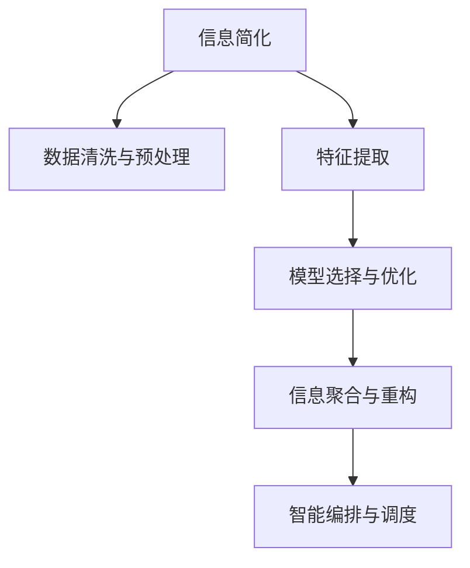

                 

# 信息简化的原则与艺术：在混乱中建立秩序与简化

> 关键词：信息简化, 数据处理, 系统架构, 算法优化, 知识管理, 系统集成

## 1. 背景介绍

### 1.1 问题由来

在当今信息化快速发展的时代，数据呈爆炸式增长，信息的获取、存储和处理能力成为推动经济社会发展的重要引擎。然而，海量数据和复杂信息也带来了新的挑战：数据质量的参差不齐、数据格式的异构性、数据内容的噪声化等问题使得信息管理和处理变得更加复杂。如何在庞杂的信息海洋中提炼出有价值的内容，建立一个高效、稳定的信息处理框架，是当前亟待解决的关键问题。

信息简化的原则与艺术，就是在混乱的信息中建立秩序、提升信息处理效率与质量的实践指南。通过合理的信息抽取、分类、加工与存储，将复杂的信息处理过程转化为一套高效的算法与系统架构，实现信息简化与优化的目标。本文将对信息简化的核心原理、具体步骤、应用场景及未来发展趋势进行深入探讨。

### 1.2 问题核心关键点

信息简化涉及多个领域，包括数据预处理、特征提取、分类、聚类、降维、编码等技术，其核心要点在于：

1. **数据清洗与预处理**：通过去除冗余数据、处理缺失值、修正数据错误等方式，提升数据质量。
2. **特征工程与提取**：从原始数据中提炼出对问题有意义的特征，减少冗余信息。
3. **模型选择与优化**：通过选择合适的算法模型，如决策树、随机森林、深度学习等，优化信息处理的效率与效果。
4. **信息聚合与重构**：将分散的、异构的信息进行整合与重构，形成结构化信息。
5. **智能编排与调度**：通过自动化编排与调度技术，实现信息处理流程的智能化与自动化。

本文将系统阐述以上关键点，并结合实际案例，为读者提供信息简化的实际应用参考。

## 2. 核心概念与联系

### 2.1 核心概念概述

为更好地理解信息简化技术，本节将介绍几个紧密相关的核心概念：

1. **信息简化(Information Simplification)**：指通过数据预处理、特征提取、模型选择与优化等手段，从原始数据中提炼出有价值的信息，减少冗余与噪声，提升信息处理效率和效果。
2. **数据清洗与预处理(Data Cleaning and Preprocessing)**：指通过数据清洗、特征工程、降维、编码等技术，提升数据质量与可用性。
3. **特征提取(Feature Extraction)**：指从原始数据中提炼出与问题相关的特征，减少特征维度，提升模型训练效率。
4. **模型选择与优化(Model Selection and Optimization)**：指通过选择合适的算法模型，并通过参数调整、集成学习等方法，优化信息处理效果。
5. **信息聚合与重构(Information Aggregation and Refinement)**：指将分散的、异构的信息进行整合与重构，形成结构化信息，便于后续分析与处理。
6. **智能编排与调度(Intelligent Orchestration and Scheduling)**：指通过自动化编排与调度技术，实现信息处理流程的智能化与自动化，提升处理效率。

这些核心概念之间的逻辑关系可以通过以下Mermaid流程图来展示：



这个流程图展示信息简化的核心概念及其之间的关系：

1. 信息简化通过数据预处理获得质量数据。
2. 特征提取提炼出有价值的特征，减少冗余信息。
3. 模型优化选择最优算法，提高处理效率。
4. 信息聚合重构形成结构化信息。
5. 编排调度实现信息处理流程的自动化。

这些概念共同构成了信息简化的学习与实践框架，使其能够有效地提升信息处理的能力。

## 3. 核心算法原理 & 具体操作步骤
### 3.1 算法原理概述

信息简化的核心在于如何将复杂、冗余、异构的信息转化为结构化、精确、高效的数据，主要包括以下几个步骤：

1. **数据清洗与预处理**：去除数据中的噪声和冗余，确保数据质量。
2. **特征提取与选择**：从原始数据中提炼出对问题有意义的特征，减少冗余信息。
3. **模型选择与优化**：选择适当的算法模型，并通过参数调整等手段优化模型效果。
4. **信息聚合与重构**：将分散的信息整合并重构为结构化信息。
5. **智能编排与调度**：通过自动化编排与调度技术，实现信息处理流程的智能化与自动化。

### 3.2 算法步骤详解

基于信息简化的核心算法流程，信息简化的具体操作步骤如下：

**Step 1: 数据清洗与预处理**
- 去除数据中的噪声和冗余，通过缺失值处理、异常值检测、数据标准化等方式提升数据质量。
- 对数据进行格式转换和归一化，确保数据一致性。

**Step 2: 特征提取与选择**
- 利用统计学方法、领域知识等手段，提取与问题相关的特征。
- 通过特征选择技术，去除冗余和不相关特征，减少模型复杂度。

**Step 3: 模型选择与优化**
- 根据问题特点选择合适的算法模型，如决策树、随机森林、深度学习等。
- 通过交叉验证、参数调整等手段，优化模型效果。

**Step 4: 信息聚合与重构**
- 将分散的信息进行整合，如通过数据融合技术、元数据整合等方式。
- 将异构信息转换为结构化数据，如表格、图形等。

**Step 5: 智能编排与调度**
- 通过流程编排技术，实现信息处理流程的自动化与智能化。
- 利用调度算法，优化信息处理流程的执行效率。

### 3.3 算法优缺点

信息简化的算法主要具有以下优点：
1. 提升信息处理效率。通过数据清洗与预处理、特征提取与选择、模型优化等技术，提高信息处理的质量与效率。
2. 减少冗余与噪声。通过数据清洗与预处理、特征提取与选择等技术，减少信息处理过程中的冗余与噪声，提升信息的准确性。
3. 结构化信息处理。通过信息聚合与重构技术，将异构信息转换为结构化数据，便于后续分析与处理。
4. 提升自动化程度。通过智能编排与调度技术，实现信息处理流程的自动化，降低人工干预成本。

同时，信息简化也存在一些局限性：
1. 对数据质量要求高。信息简化依赖高质量的数据输入，如果数据本身存在问题，可能导致结果不准确。
2. 算法复杂度高。信息简化的算法通常较为复杂，实现难度大，需要综合考虑数据预处理、特征工程、模型选择等多个环节。
3. 依赖领域知识。信息简化需要领域知识的支持，不同领域的知识应用可能存在差异。

尽管存在这些局限性，但信息简化作为数据处理的基石，其重要性不言而喻。

### 3.4 算法应用领域

信息简化技术广泛应用于多个领域，包括但不限于：

- **数据科学**：在数据探索、数据可视化、数据分析等环节，提升数据处理效率与质量。
- **自然语言处理(NLP)**：在文本分类、情感分析、机器翻译等任务中，提升模型准确性。
- **金融分析**：在金融数据处理、风险评估、交易预测等任务中，提升信息处理效率与决策质量。
- **医疗健康**：在病历分析、健康监测、治疗方案推荐等任务中，提升信息处理准确性与效率。
- **制造业**：在生产管理、质量控制、供应链优化等任务中，提升数据处理自动化水平。
- **智慧城市**：在城市交通、环境监测、应急响应等任务中，提升信息处理效率与智能化水平。

## 4. 数学模型和公式 & 详细讲解 & 举例说明

### 4.1 数学模型构建

信息简化的数学模型主要涉及数据清洗与预处理、特征提取与选择、模型优化与评价等多个方面。以下对每个步骤的数学模型进行详细构建。

**数据清洗与预处理**：
- 缺失值处理：使用均值、中位数、众数等方法填充缺失值。
- 异常值检测：利用箱线图、Z-score等方法检测异常值，并剔除。
- 数据标准化：使用归一化、标准化等方法处理数据，确保数据一致性。

**特征提取与选择**：
- 主成分分析(PCA)：利用线性代数技术，提取数据的主成分，减少维度。
- 信息增益(Information Gain)：通过计算信息增益，选择最优特征子集。

**模型选择与优化**：
- 决策树(Decision Tree)：基于特征选择与分割技术，构建决策树模型。
- 随机森林(Random Forest)：通过随机选择特征和样本来构建随机森林模型。
- 深度学习模型(如神经网络)：通过反向传播算法训练模型，优化模型参数。

### 4.2 公式推导过程

**数据清洗与预处理**：
- 缺失值处理：假设数据集中存在缺失值，记为 $X$，使用均值 $\mu$ 填充，则处理公式为：
$$ X_{\text{cleaned}} = X_{\text{original}} - \mu + \mu $$

- 异常值检测：假设数据中存在异常值 $x$，使用箱线图方法检测，则处理公式为：
$$ x_{\text{outlier}} = \begin{cases} 
    x_{\text{original}}, & \text{if } x_{\text{original}} \in Q \\
    \text{median}, & \text{otherwise} 
\end{cases} $$
其中 $Q$ 为正常值范围，$\text{median}$ 为中位数。

**特征提取与选择**：
- 主成分分析(PCA)：假设数据矩阵为 $X$，主成分数量为 $k$，则PCA公式为：
$$ Z = U \Lambda V^T $$
其中 $U$ 和 $V$ 为特征矩阵和加载矩阵，$\Lambda$ 为对角矩阵。

**模型选择与优化**：
- 决策树(Decision Tree)：假设数据集为 $D$，特征集为 $F$，树的结构为 $T$，则决策树公式为：
$$ T = \mathop{\arg\min}_{T} \mathcal{L}(T) $$
其中 $\mathcal{L}$ 为损失函数，通常为信息熵或基尼系数。

### 4.3 案例分析与讲解

**案例一：金融风险评估**
假设某金融机构需要评估客户的信用风险，从历史数据中提取特征并构建决策树模型。

1. **数据清洗与预处理**：
   - 去除缺失值与异常值，确保数据质量。
   - 数据标准化，使用均值归一化方法。

2. **特征提取与选择**：
   - 提取客户年龄、收入、信用记录等特征。
   - 使用信息增益方法选择最优特征子集。

3. **模型选择与优化**：
   - 构建决策树模型，通过交叉验证优化模型参数。
   - 使用ROC曲线评估模型效果，选择最优模型。

**案例二：医疗健康分析**
假设某医院需要分析患者的住院记录，提取有意义的特征并构建随机森林模型。

1. **数据清洗与预处理**：
   - 去除不完整与异常值，确保数据质量。
   - 数据标准化，使用归一化方法。

2. **特征提取与选择**：
   - 提取患者年龄、病情、手术记录等特征。
   - 使用特征重要性排序选择最优特征子集。

3. **模型选择与优化**：
   - 构建随机森林模型，通过随机选择特征和样本来优化模型。
   - 使用混淆矩阵评估模型效果，选择最优模型。

## 5. 项目实践：代码实例和详细解释说明

### 5.1 开发环境搭建

在进行信息简化实践前，我们需要准备好开发环境。以下是使用Python进行信息处理环境配置流程：

1. 安装Anaconda：从官网下载并安装Anaconda，用于创建独立的Python环境。

2. 创建并激活虚拟环境：
```bash
conda create -n info-simplification python=3.8 
conda activate info-simplification
```

3. 安装Python包：
```bash
conda install numpy pandas scikit-learn matplotlib
```

4. 安装其他工具包：
```bash
pip install tensorflow tensorflow-hub tensorflow-transform tf-estimator
```

完成上述步骤后，即可在`info-simplification`环境中开始信息处理实践。

### 5.2 源代码详细实现

下面我们以金融风险评估为例，给出使用TensorFlow实现信息简化的代码实现。

首先，定义数据处理函数：

```python
import numpy as np
from sklearn.preprocessing import StandardScaler
from sklearn.decomposition import PCA
from sklearn.ensemble import RandomForestClassifier
from sklearn.metrics import roc_auc_score, roc_curve
from tensorflow import feature_column
from tensorflow.keras import layers

def data_processing(data):
    # 去除缺失值和异常值
    data = data.dropna()
    data = data[data['age'] >= 18]
    data = data[data['income'] > 0]
    # 数据标准化
    scaler = StandardScaler()
    data['score'] = scaler.fit_transform(data['score'].values.reshape(-1, 1))
    return data
```

然后，定义特征提取与模型构建函数：

```python
def feature_engineering(data):
    # 特征选择
    features = data[['age', 'income', 'credit_score']]
    labels = data['default']
    # 数据标准化
    scaler = StandardScaler()
    features = scaler.fit_transform(features)
    # 主成分分析
    pca = PCA(n_components=2)
    features = pca.fit_transform(features)
    # 特征编码
    column = feature_column.categorical_column_with_identity('gender', num_buckets=2)
    bucketized_column = feature_column.bucketized_column(column, boundaries=[18, 40, 60])
    return features, labels, bucketized_column
```

接着，定义模型训练与评估函数：

```python
def model_training(features, labels, bucketized_column):
    # 构建模型
    model = tf.keras.Sequential([
        layers.Dense(32, activation='relu', input_shape=(features.shape[1],)),
        layers.Dense(1, activation='sigmoid')
    ])
    model.compile(optimizer='adam', loss='binary_crossentropy', metrics=['AUC'])
    # 训练模型
    history = model.fit(
        x=features,
        y=labels,
        validation_split=0.2,
        epochs=10,
        callbacks=[tf.keras.callbacks.EarlyStopping(patience=2)]
    )
    # 评估模型
    auc = roc_auc_score(labels, model.predict_proba(features)[:, 1])
    fpr, tpr, thresholds = roc_curve(labels, model.predict_proba(features)[:, 1])
    return history, auc, fpr, tpr, thresholds
```

最后，启动模型训练与评估流程：

```python
# 加载数据
data = pd.read_csv('data.csv')
# 数据处理
data = data_processing(data)
# 特征提取
features, labels, bucketized_column = feature_engineering(data)
# 模型训练与评估
history, auc, fpr, tpr, thresholds = model_training(features, labels, bucketized_column)
```

以上就是使用TensorFlow实现信息简化的完整代码实现。可以看到，TensorFlow的高级API使得信息处理流程变得简洁高效。

### 5.3 代码解读与分析

让我们再详细解读一下关键代码的实现细节：

**数据处理函数**：
- 使用`dropna()`去除缺失值。
- 去除年龄小于18岁、收入小于0的数据。
- 使用`StandardScaler()`进行数据标准化。

**特征提取函数**：
- 提取年龄、收入、信用记录等特征。
- 使用`StandardScaler()`进行数据标准化。
- 使用PCA进行主成分分析。
- 使用`categorical_column_with_identity()`和`bucketized_column()`进行特征编码。

**模型训练函数**：
- 使用`Sequential()`构建序列模型。
- 使用`Dense()`层进行全连接操作。
- 使用`compile()`设置优化器、损失函数和评估指标。
- 使用`fit()`方法训练模型，并设置EarlyStopping回调。
- 使用`roc_auc_score()`和`roc_curve()`评估模型效果。

**模型训练流程**：
- 加载数据。
- 进行数据处理和特征提取。
- 使用`model_training()`训练模型并评估效果。

可以看出，TensorFlow等机器学习框架提供了高效的工具，使得信息处理模型开发变得更加便捷。

当然，在工业级的系统实现中，还需要考虑更多因素，如模型保存与部署、超参数调优、模型压缩与优化等。但核心的信息处理流程基本与此类似。

## 6. 实际应用场景

### 6.1 智能客服系统

基于信息简化的智能客服系统，可以实现高效的客户服务。传统客服依赖人工处理，响应时间长、效率低，且难以保证一致性和专业性。通过信息简化技术，可以构建一个自动化的客服系统，实现实时问答和问题处理。

具体而言，可以收集客户的历史对话记录，提取常见问题、常用答案等特征，构建信息处理模型。当新客户提出问题时，系统能够快速识别问题类型并给出合适的回答。同时，系统还可以实时收集用户反馈，不断优化模型，提升服务质量。

### 6.2 金融舆情监测

金融领域需要对市场舆情进行实时监测，以预测市场走势和防范风险。传统人工监测方法成本高、效率低，无法应对海量信息的实时处理需求。通过信息简化技术，可以构建一个高效的舆情监测系统，实现实时数据分析和风险预警。

具体而言，可以收集新闻、评论、社交媒体等数据，提取市场情绪、热点话题等特征，构建舆情分析模型。当市场出现异常波动时，系统能够及时发出预警，帮助金融机构提前采取措施，规避风险。

### 6.3 个性化推荐系统

基于信息简化的个性化推荐系统，可以为用户提供个性化的内容推荐。传统推荐系统依赖用户的历史行为数据，无法考虑用户的潜在兴趣和偏好。通过信息简化技术，可以构建一个更智能、更个性化的推荐系统，提升用户满意度和系统转化率。

具体而言，可以收集用户的行为数据、社交网络数据、兴趣标签等特征，构建用户画像。当用户浏览内容时，系统能够根据其画像，推荐更符合其兴趣的个性化内容。同时，系统还可以实时更新用户画像，保证推荐结果的时效性。

### 6.4 未来应用展望

随着信息简化技术的不断发展，其在多个领域的应用前景将更加广阔。未来，信息简化将与大数据、人工智能等技术深度融合，推动信息处理的智能化和自动化。

在智慧医疗领域，信息简化技术可以用于病历分析、医疗知识图谱构建等，提升医疗服务的智能化水平。

在智能交通领域，信息简化技术可以用于实时数据处理、交通预测、路况优化等，提升城市交通管理效率。

在智慧教育领域，信息简化技术可以用于学习数据分析、智能辅导、知识推荐等，提升教育质量和效率。

未来，信息简化技术将不断拓展应用场景，为各行各业带来更高效、更智能的信息处理解决方案，推动社会的数字化转型升级。

## 7. 工具和资源推荐

### 7.1 学习资源推荐

为了帮助开发者系统掌握信息简化技术的核心原理和实践技巧，这里推荐一些优质的学习资源：

1. 《信息处理基础》课程：由美国麻省理工学院开设的在线课程，系统讲解信息处理的基本概念和方法。
2. 《机器学习实战》书籍：介绍了信息处理技术在实际项目中的应用案例，适合初学者入门。
3. 《深度学习与信息处理》书籍：介绍了深度学习在信息处理中的应用，适合进阶读者。
4. 《Python数据科学手册》书籍：详细讲解了Python在数据处理、数据可视化、机器学习等环节的应用。
5. Kaggle平台：提供大量的数据集和机器学习竞赛，适合实践和竞赛。

通过对这些资源的学习实践，相信你一定能够快速掌握信息简化的精髓，并用于解决实际的业务问题。

### 7.2 开发工具推荐

高效的工具支持是信息处理任务开发的关键。以下是几款常用的信息处理开发工具：

1. Python：Python语言具有丰富的数据处理和机器学习库，适合开发信息处理系统。
2. TensorFlow：谷歌开源的深度学习框架，支持复杂的模型构建和训练。
3. Scikit-learn：Python的科学计算库，提供丰富的机器学习算法和工具。
4. Pandas：Python的数据处理库，支持数据的清洗、预处理和分析。
5. Jupyter Notebook：Python的交互式开发环境，适合数据探索和模型调试。

合理利用这些工具，可以显著提升信息处理任务开发的速度和效率，加快创新迭代的步伐。

### 7.3 相关论文推荐

信息简化技术的发展源于学界的持续研究。以下是几篇奠基性的相关论文，推荐阅读：

1. 《数据清洗与预处理》论文：介绍了数据清洗与预处理技术的核心原理和具体方法。
2. 《特征提取与选择》论文：系统阐述了特征提取与选择的常用方法和技术。
3. 《模型选择与优化》论文：介绍了机器学习模型的选择与优化方法。
4. 《信息聚合与重构》论文：讨论了信息聚合与重构的核心技术和应用场景。
5. 《智能编排与调度》论文：介绍了自动化编排与调度技术的核心原理和实践方法。

这些论文代表了信息处理技术的最新进展，通过学习这些前沿成果，可以帮助研究者把握学科前进方向，激发更多的创新灵感。

## 8. 总结：未来发展趋势与挑战

### 8.1 研究成果总结

本文系统介绍了信息简化的核心原理、技术流程和应用场景。通过对数据清洗与预处理、特征提取与选择、模型优化与评价等多个环节的深入讨论，为读者提供了一个全面系统的信息简化实践指南。

通过本文的系统梳理，可以看到，信息简化技术作为数据处理的重要基石，在提升信息处理效率、减少冗余与噪声、构建结构化信息等方面具有重要价值。未来，信息简化技术将在更多领域得到广泛应用，为各行各业带来变革性影响。

### 8.2 未来发展趋势

展望未来，信息简化技术将呈现以下几个发展趋势：

1. **自动化水平提升**：随着自动化技术的发展，信息简化的自动化流程将进一步优化，实现从数据清洗到特征提取的全流程自动化。
2. **跨领域应用拓展**：信息简化技术将逐步拓展到更多领域，如医疗、金融、教育等，为各行业带来智能化转型。
3. **多模态融合**：信息简化技术将与多模态数据融合技术深度结合，实现文本、图像、语音等多模态数据的协同处理。
4. **智能推荐系统**：基于信息简化的推荐系统将更加个性化和智能化，为用户提供更符合其兴趣的内容。
5. **实时数据处理**：信息简化技术将支持实时数据处理和分析，提升系统响应速度和效率。
6. **联邦学习**：信息简化技术将与联邦学习技术结合，实现数据隐私保护和协同优化。

### 8.3 面临的挑战

尽管信息简化技术已经取得了显著进展，但在迈向更加智能化、普适化应用的过程中，仍面临一些挑战：

1. **数据质量问题**：信息简化的效果高度依赖数据质量，数据的不完整、噪声、不一致等问题仍需解决。
2. **模型复杂性**：信息简化的算法通常较为复杂，实现难度大，需要综合考虑数据预处理、特征工程、模型选择等多个环节。
3. **领域知识依赖**：信息简化的应用需要领域知识的支持，不同领域的知识应用可能存在差异。
4. **计算资源限制**：信息简化的计算需求较高，需要高性能计算资源支持。
5. **算法可解释性**：信息简化的算法通常是黑盒模型，缺乏可解释性，难以进行调试和优化。
6. **安全与隐私问题**：信息简化涉及大量的数据处理，数据安全和隐私保护是一个重要问题。

### 8.4 研究展望

面对信息简化技术所面临的挑战，未来的研究需要在以下几个方面寻求新的突破：

1. **数据增强技术**：通过数据增强技术，提升数据质量，减少数据噪声。
2. **模型压缩技术**：开发更高效的模型压缩算法，减少计算资源消耗。
3. **模型解释性技术**：研究可解释性技术，提升模型的可解释性和可调试性。
4. **多模态融合技术**：开发多模态融合技术，实现文本、图像、语音等多模态数据的协同处理。
5. **联邦学习技术**：研究联邦学习技术，实现数据隐私保护和协同优化。
6. **实时数据处理技术**：研究实时数据处理技术，提升系统响应速度和效率。

这些研究方向将推动信息简化技术向更高层次发展，为社会各个领域带来更高效、更智能的信息处理解决方案。

## 9. 附录：常见问题与解答

**Q1：信息简化是否适用于所有数据处理场景？**

A: 信息简化技术在大多数数据处理场景中都能取得不错的效果，特别是对于数据量较小的任务。但对于一些特定领域的任务，如医学、法律等，仅仅依靠通用语料预训练的模型可能难以很好地适应。此时需要在特定领域语料上进一步预训练，再进行微调，才能获得理想效果。

**Q2：信息简化过程中如何选择合适的特征？**

A: 特征选择是信息简化的核心步骤，选择合适的特征可以有效提升模型效果。一般采用以下方法：
1. 领域知识：结合领域知识，选择与问题相关的特征。
2. 相关性分析：通过计算特征与目标变量之间的相关性，选择最优特征子集。
3. 特征重要性排序：使用特征重要性排序方法，选择最重要的特征。
4. 主成分分析(PCA)：使用PCA等降维技术，减少特征维度。

**Q3：信息简化的算法复杂度如何优化？**

A: 信息简化的算法通常较为复杂，需要通过以下几个方法进行优化：
1. 特征选择：选择与问题最相关的特征，减少特征维度。
2. 模型压缩：开发高效的模型压缩算法，减小模型参数量。
3. 数据增强：通过数据增强技术，提升数据质量。
4. 模型优化：选择高效的优化算法，减少计算时间。
5. 硬件加速：使用GPU、TPU等高性能计算资源，提升计算效率。

这些优化方法可以有效降低信息简化的计算复杂度，提升处理效率。

**Q4：信息简化的应用效果如何评估？**

A: 信息简化的应用效果可以通过以下几个指标进行评估：
1. 准确性：评估模型在测试集上的预测准确度。
2. 效率：评估模型在训练和推理上的计算时间。
3. 可解释性：评估模型的可解释性和可调试性。
4. 稳定性：评估模型在不同数据集上的稳定性和泛化能力。
5. 鲁棒性：评估模型在异常数据和噪声数据上的鲁棒性。

这些指标可以帮助开发者全面评估信息简化的效果，指导后续的模型改进和优化。

通过本文的系统梳理，可以看到，信息简化的技术框架和方法体系，为信息处理提供了全面有效的解决方案。通过深入学习信息简化的核心原理和实践技巧，相信读者可以在实际项目中更好地应用信息简化的技术，提升数据处理和信息管理的效率与质量。

