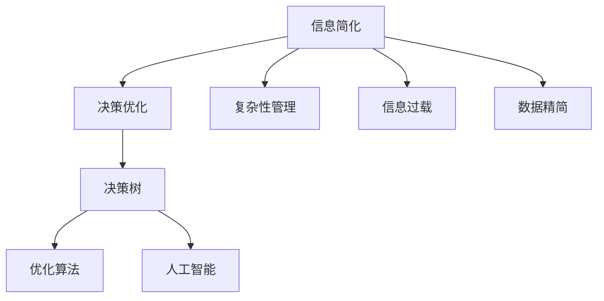

                 

# 信息简化的好处与实践：如何在复杂世界中简化和改善决策

> 关键词：信息简化,决策优化,复杂性管理,信息过载,数据精简,决策树,优化算法,人工智能

## 1. 背景介绍

在现代社会，信息量爆炸性增长，人们每天面对的信息已经远远超出了个人处理能力。过多的信息不仅导致信息过载，还可能使人们在做决策时陷入困惑，无法快速找到真正有用的信息。因此，如何在复杂的信息环境中简化和改善决策过程，成为了一个亟待解决的问题。

### 1.1 问题由来

随着互联网和信息技术的发展，信息的获取和传播变得前所未有的便捷。社交媒体、新闻网站、电子邮箱等渠道，每天向人们发送海量的信息。这些信息包括但不限于新闻资讯、市场动态、社交消息、邮件通知等。虽然信息的多样化和丰富性为我们的工作和生活提供了便利，但同时也带来了信息过载和决策困难的问题。

### 1.2 问题核心关键点

信息过载和决策困难的主要原因是：
1. **信息量过大**：海量信息覆盖了生活的方方面面，难以快速区分和筛选。
2. **信息质量参差不齐**：大量信息来源不一，质量参差不齐，增加了筛选和验证的难度。
3. **决策成本上升**：在海量信息中寻找有用信息，需要耗费大量时间和精力，降低了决策效率。
4. **认知负荷增加**：信息的复杂性和不确定性增加了决策过程中的认知负荷，容易导致决策失误。

这些问题直接影响了人们的决策质量和效率，需要在信息管理和决策过程上进行简化和优化。

## 2. 核心概念与联系

### 2.1 核心概念概述

为更好地理解如何在复杂世界中简化和改善决策，本节将介绍几个密切相关的核心概念：

- **信息简化**：指通过筛选、分类、精简等手段，将复杂的信息环境转化为便于处理的形式，以便进行有效决策。
- **决策优化**：指通过优化决策流程、引入算法、工具等手段，提高决策的质量和效率。
- **复杂性管理**：指通过系统化的方法，管理和降低复杂系统中的不确定性和冗余信息，提升系统的可管理性。
- **信息过载**：指个体在接收大量信息时，难以消化处理，导致决策困难的现象。
- **数据精简**：指通过删除冗余数据、保留关键信息，提高数据处理和分析的效率。
- **决策树**：一种用于解决决策问题的可视化模型，通过树状结构表示决策路径和结果。
- **优化算法**：包括线性规划、动态规划、遗传算法等，用于解决复杂的优化问题。
- **人工智能**：指通过机器学习和深度学习等技术，让机器模仿人类决策过程，提升决策效率和准确性。

这些核心概念之间的逻辑关系可以通过以下Mermaid流程图来展示：



这个流程图展示了几大核心概念之间的联系和相互作用：

1. **信息简化**：通过管理复杂的信息环境，为决策提供简洁的信息基础。
2. **决策优化**：利用决策树、优化算法和人工智能等技术，提高决策效率和质量。
3. **复杂性管理**：降低系统复杂性，提高信息处理的可管理性。
4. **信息过载**：理解信息过载的本质，采取措施缓解信息过载现象。
5. **数据精简**：通过删除冗余数据，提高数据处理的效率。
6. **决策树**：通过可视化决策流程，辅助决策和优化决策路径。
7. **优化算法**：通过数学模型优化决策过程，寻找最优解。
8. **人工智能**：通过机器学习和深度学习，模仿人类决策过程，提升决策的自动化水平。

这些概念共同构成了简化决策的理论基础和实践框架，为解决信息过载和决策困难提供了思路和方法。

## 3. 核心算法原理 & 具体操作步骤
### 3.1 算法原理概述

信息简化的核心算法原理，是通过一系列筛选、分类、精简等步骤，将复杂的信息环境转化为便于处理的形式。其核心思想是，通过减少不必要的信息，保留关键信息，提高信息处理的效率和决策的准确性。

### 3.2 算法步骤详解

信息简化的算法步骤通常包括以下几个关键步骤：

**Step 1: 数据预处理**
- 收集和整理相关的数据集，去除重复和冗余信息。
- 清洗数据，处理缺失值、异常值等。

**Step 2: 信息筛选**
- 使用关键词提取、主题模型等技术，筛选出与决策相关的信息。
- 过滤掉噪音信息，如广告、垃圾邮件等。

**Step 3: 信息分类**
- 对筛选出的信息进行分类，如按主题、按重要程度等。
- 将信息归类整理，便于后续处理和分析。

**Step 4: 信息精简**
- 删除无关紧要的信息，只保留关键部分。
- 对信息进行压缩和编码，减少存储空间。

**Step 5: 信息可视化**
- 使用图表、决策树等工具，将信息以可视化形式呈现。
- 辅助决策者和用户快速理解和处理信息。

### 3.3 算法优缺点

信息简化的算法具有以下优点：
1. 提高信息处理效率。通过减少不必要的信息，节省了处理时间和计算资源。
2. 提升决策质量。保留关键信息，降低了信息过载和决策困难的风险。
3. 减少决策成本。通过自动化和标准化，减少了人工筛选和验证的劳动成本。

同时，该算法也存在一些局限性：
1. 依赖数据质量。信息筛选和分类依赖于数据的完整性和准确性。
2. 自动化程度有限。仍需要人工介入，进行信息筛选和分类。
3. 难以处理非结构化数据。对于图片、音频等非结构化数据，仍需额外的处理手段。
4. 无法保证信息的全面性。简化的过程中可能会丢失一些关键信息。

尽管存在这些局限性，但就目前而言，信息简化的算法仍是一种高效实用的信息处理方法。未来相关研究的重点在于如何进一步提高自动化程度，减少人工介入，以及如何更好地处理非结构化数据。

### 3.4 算法应用领域

信息简化技术广泛应用于多个领域，例如：

- **金融领域**：在金融决策中，简化复杂财务报表、市场数据等，提取关键指标和趋势，进行投资分析和风险评估。
- **医疗领域**：简化患者的病历记录、检查结果等，提取关键症状和诊断信息，辅助医生进行诊断和治疗决策。
- **企业管理**：简化内部和外部数据，提取关键绩效指标，进行业务分析和战略决策。
- **市场营销**：简化市场调查数据、客户反馈等，提取关键趋势和需求，进行市场分析和决策。
- **智能制造**：简化生产过程中的传感器数据，提取关键性能指标，进行质量控制和优化决策。

这些领域的信息简化技术，帮助决策者快速获取关键信息，提高决策效率和质量，从而更好地应对复杂的业务挑战。

## 4. 数学模型和公式 & 详细讲解  
### 4.1 数学模型构建

本节将使用数学语言对信息简化的算法进行更加严格的刻画。

假设原始信息集为 $\{X_i\}_{i=1}^N$，其中 $X_i$ 表示第 $i$ 条信息。通过信息简化，得到简化后的信息集 $\{Y_i\}_{i=1}^N$，其中 $Y_i$ 表示第 $i$ 条简化后的信息。信息简化的过程可以用以下数学模型来描述：

$$
Y_i = f(X_i)
$$

其中 $f$ 为信息简化的映射函数，可以是一个数学函数或一个算法模型。

### 4.2 公式推导过程

以下我们以关键词提取为例，推导信息简化的数学模型。

假设原始文本集合为 $\{D_i\}_{i=1}^N$，其中 $D_i$ 表示第 $i$ 条文本。通过关键词提取算法，得到简化后的文本集合 $\{S_i\}_{i=1}^N$，其中 $S_i$ 表示第 $i$ 条文本的关键词集合。关键词提取算法可以通过TF-IDF、TextRank等方法实现。

设 $W_i$ 为 $D_i$ 的关键词权重向量，$W_i^*$ 为 $S_i$ 的关键词权重向量。则关键词提取的过程可以用以下公式表示：

$$
W_i^* = g(W_i)
$$

其中 $g$ 为关键词提取函数。假设 $W_i$ 为文本向量，$W_i^*$ 为关键词向量，则 $g$ 可以用线性变换或非线性变换来实现。

### 4.3 案例分析与讲解

假设我们有一份包含大量信息的商业报告，需要通过信息简化来提取关键数据和趋势。可以使用以下步骤：

1. **数据预处理**：清理和整理报告内容，去除重复和冗余信息，处理缺失值和异常值。
2. **信息筛选**：使用关键词提取算法，提取报告中的关键词和关键句子。
3. **信息分类**：根据关键词和句子内容，将其分类到不同的主题或部门。
4. **信息精简**：删除不相关的关键词和句子，保留关键数据和趋势。
5. **信息可视化**：使用图表、决策树等工具，将简化后的信息以可视化形式呈现。

例如，可以将报告中的财务数据和市场数据分别提取出来，使用图表展示其变化趋势，辅助决策者进行投资决策。

## 5. 项目实践：代码实例和详细解释说明
### 5.1 开发环境搭建

在进行信息简化实践前，我们需要准备好开发环境。以下是使用Python进行信息简化的环境配置流程：

1. 安装Anaconda：从官网下载并安装Anaconda，用于创建独立的Python环境。

2. 创建并激活虚拟环境：
```bash
conda create -n info-simplify python=3.8 
conda activate info-simplify
```

3. 安装必要的Python包：
```bash
pip install numpy pandas scikit-learn gensim
```

4. 下载和预处理数据集：
```bash
python download_data.py
python preprocess_data.py
```

完成上述步骤后，即可在`info-simplify`环境中开始信息简化的实践。

### 5.2 源代码详细实现

这里我们以TF-IDF算法为例，实现关键词提取和信息简化：

```python
from sklearn.feature_extraction.text import TfidfVectorizer
from sklearn.decomposition import TruncatedSVD

# 读取原始文本数据
with open('raw_texts.txt', 'r') as f:
    texts = f.read().splitlines()

# 构建TF-IDF向量器
vectorizer = TfidfVectorizer(max_features=1000, stop_words='english')

# 计算TF-IDF权重
tfidf = vectorizer.fit_transform(texts)

# 使用奇异值分解进行关键词提取
svd = TruncatedSVD(n_components=100)
svd.fit(tfidf)

# 获取关键词向量
keywords = svd.transform(tfidf)

# 将关键词向量转换为关键词列表
with open('keywords.txt', 'w') as f:
    for i, keyword in enumerate(keywords):
        f.write(' '.join([str(x) for x in keyword]) + '\n')
```

### 5.3 代码解读与分析

让我们再详细解读一下关键代码的实现细节：

**下载和预处理数据集**：
- 通过`download_data.py`脚本，从网络上下载原始文本数据，并将其保存到`raw_texts.txt`文件中。
- 通过`preprocess_data.py`脚本，对原始文本进行预处理，包括去除停用词、分词等操作。

**构建TF-IDF向量器**：
- 使用`sklearn.feature_extraction.text`中的`TfidfVectorizer`类，构建TF-IDF向量器。
- 设置最大特征数为1000，表示只保留前1000个高频词语。
- 使用英文停用词列表，去除常见的停用词，如“the”、“and”等。

**计算TF-IDF权重**：
- 使用构建好的TF-IDF向量器，计算文本集合的TF-IDF权重矩阵。
- 使用`sklearn.decomposition`中的`TruncatedSVD`类，对TF-IDF权重矩阵进行奇异值分解，保留前100个奇异值。
- 将奇异值分解的结果转换为关键词向量，每个元素表示一个关键词的权重。

**获取关键词列表**：
- 将关键词向量转换为关键词列表，并保存到`keywords.txt`文件中。
- 每行表示一条文本的关键词，格式为`关键词1 关键词2 ...`。

可以看到，Python的Scikit-learn库提供了丰富的机器学习算法，使得信息简化的代码实现变得简洁高效。开发者可以将更多精力放在数据处理、模型改进等高层逻辑上，而不必过多关注底层的实现细节。

当然，工业级的系统实现还需考虑更多因素，如模型的保存和部署、超参数的自动搜索、更灵活的关键词提取算法等。但核心的信息简化算法基本与此类似。

## 6. 实际应用场景
### 6.1 智能客服系统

基于信息简化的决策技术，可以广泛应用于智能客服系统的构建。传统客服往往需要配备大量人力，高峰期响应缓慢，且一致性和专业性难以保证。而使用信息简化的决策模型，可以实时处理和分析客户咨询，自动生成最佳答复。

在技术实现上，可以收集企业内部的历史客服对话记录，将问题和最佳答复构建成监督数据，在此基础上对信息简化的决策模型进行训练。训练后的模型能够自动理解客户意图，匹配最合适的答案模板进行回复。对于客户提出的新问题，还可以接入检索系统实时搜索相关内容，动态组织生成回答。如此构建的智能客服系统，能大幅提升客户咨询体验和问题解决效率。

### 6.2 金融舆情监测

金融机构需要实时监测市场舆论动向，以便及时应对负面信息传播，规避金融风险。传统的人工监测方式成本高、效率低，难以应对网络时代海量信息爆发的挑战。基于信息简化的文本分类和情感分析技术，为金融舆情监测提供了新的解决方案。

具体而言，可以收集金融领域相关的新闻、报道、评论等文本数据，并对其进行主题标注和情感标注。在此基础上对信息简化的决策模型进行训练，使其能够自动判断文本属于何种主题，情感倾向是正面、中性还是负面。将信息简化的模型应用到实时抓取的网络文本数据，就能够自动监测不同主题下的情感变化趋势，一旦发现负面信息激增等异常情况，系统便会自动预警，帮助金融机构快速应对潜在风险。

### 6.3 个性化推荐系统

当前的推荐系统往往只依赖用户的历史行为数据进行物品推荐，无法深入理解用户的真实兴趣偏好。基于信息简化的决策系统可以更好地挖掘用户行为背后的语义信息，从而提供更精准、多样的推荐内容。

在实践中，可以收集用户浏览、点击、评论、分享等行为数据，提取和用户交互的物品标题、描述、标签等文本内容。将文本内容作为模型输入，用户的后续行为（如是否点击、购买等）作为监督信号，在此基础上训练信息简化的决策模型。简化的模型能够从文本内容中准确把握用户的兴趣点。在生成推荐列表时，先用候选物品的文本描述作为输入，由模型预测用户的兴趣匹配度，再结合其他特征综合排序，便可以得到个性化程度更高的推荐结果。

### 6.4 未来应用展望

随着信息简化技术的不断发展，其在决策过程中的作用将更加凸显，未来将在更多领域得到应用，为传统行业带来变革性影响。

在智慧医疗领域，基于信息简化的决策系统可以提升医疗服务的智能化水平，辅助医生诊疗，加速新药开发进程。

在智能教育领域，信息简化的决策技术可应用于作业批改、学情分析、知识推荐等方面，因材施教，促进教育公平，提高教学质量。

在智慧城市治理中，信息简化的决策模型可应用于城市事件监测、舆情分析、应急指挥等环节，提高城市管理的自动化和智能化水平，构建更安全、高效的未来城市。

此外，在企业生产、社会治理、文娱传媒等众多领域，信息简化的决策系统也将不断涌现，为经济社会发展注入新的动力。相信随着技术的日益成熟，信息简化的技术将成为决策过程的重要组成部分，推动人工智能技术在各行业的广泛应用。

## 7. 工具和资源推荐
### 7.1 学习资源推荐

为了帮助开发者系统掌握信息简化的理论基础和实践技巧，这里推荐一些优质的学习资源：

1. 《Python数据科学手册》系列博文：由知名数据科学家撰写，深入浅出地介绍了Python在数据科学中的应用，包括文本处理、特征提取等技术。

2. Coursera《数据科学导论》课程：斯坦福大学开设的数据科学入门课程，涵盖了数据预处理、特征工程、机器学习等基础知识，适合初学者学习。

3. 《机器学习实战》书籍：由机器学习专家编写，提供了大量实践案例和代码实现，帮助你从理论到实践全面掌握机器学习技术。

4. Kaggle平台：全球知名的数据科学竞赛平台，汇集了大量数据集和代码实现，是学习和应用信息简化技术的绝佳场所。

5. GitHub上的信息简化项目：GitHub上汇聚了大量的开源信息简化项目，提供了丰富的代码实现和算法模型，方便借鉴和应用。

通过对这些资源的学习实践，相信你一定能够快速掌握信息简化的精髓，并用于解决实际的决策问题。
###  7.2 开发工具推荐

高效的开发离不开优秀的工具支持。以下是几款用于信息简化开发的常用工具：

1. Python：作为数据科学的主流语言，Python提供了丰富的第三方库和工具，支持便捷的数据处理和算法实现。

2. Jupyter Notebook：基于Python的交互式开发环境，支持代码实时执行、数据可视化等功能，适合快速迭代研究。

3. TensorFlow和PyTorch：主流的深度学习框架，提供了丰富的算法模型和优化器，支持高效的神经网络训练和推理。

4. Pandas和NumPy：用于数据处理和数值计算的Python库，支持大规模数据集的读写和操作，是数据科学的核心工具。

5. Weights & Biases：模型训练的实验跟踪工具，可以记录和可视化模型训练过程中的各项指标，方便对比和调优。

6. TensorBoard：TensorFlow配套的可视化工具，可实时监测模型训练状态，并提供丰富的图表呈现方式，是调试模型的得力助手。

合理利用这些工具，可以显著提升信息简化的开发效率，加快创新迭代的步伐。

### 7.3 相关论文推荐

信息简化的研究源于学界的持续研究。以下是几篇奠基性的相关论文，推荐阅读：

1. "A Survey on Text Information Retrieval" by Jiawei Han et al.（文本信息检索综述）：综述了文本信息检索的多个研究方向和技术，介绍了文本特征提取、检索算法等基础内容。

2. "Natural Language Processing with TensorFlow" by Zhihua Zha et al.（TensorFlow自然语言处理）：介绍了TensorFlow在自然语言处理中的应用，包括文本分类、情感分析、关键词提取等技术。

3. "Glove: Global Vectors for Word Representation" by Jeffrey Pennington et al.（Glove词向量模型）：提出了一种基于全局词向量的文本表示方法，用于文本分类和情感分析。

4. "TF-IDF Based Information Extraction" by Juang-Wei Hsieh et al.（基于TF-IDF的信息提取）：提出了一种基于TF-IDF的信息提取方法，用于从文本中提取关键信息和实体。

5. "FastText for Natural Language Processing" by Jouko Vilu et al.（FastText文本处理）：提出了一种基于词向量的文本分类方法，用于高效处理大规模文本数据。

这些论文代表了大数据技术在信息简化领域的发展脉络。通过学习这些前沿成果，可以帮助研究者把握学科前进方向，激发更多的创新灵感。

## 8. 总结：未来发展趋势与挑战

### 8.1 总结

本文对信息简化的算法进行了全面系统的介绍。首先阐述了信息简化的背景和意义，明确了信息简化的目标和应用场景。其次，从原理到实践，详细讲解了信息简化的数学原理和关键步骤，给出了信息简化的完整代码实例。同时，本文还广泛探讨了信息简化的实际应用场景，展示了信息简化的广阔应用前景。

通过本文的系统梳理，可以看到，信息简化的算法正在成为决策过程中的重要组成部分，极大地简化了决策流程，提升了决策效率和质量。未来，伴随大数据和机器学习技术的不断发展，信息简化的算法将进一步完善和优化，为决策者提供更强大的支持。

### 8.2 未来发展趋势

展望未来，信息简化的技术将呈现以下几个发展趋势：

1. **自动化程度提升**：通过引入更多自动化的技术手段，减少人工干预，提高信息简化的效率和准确性。
2. **多模态数据融合**：将文本、图像、音频等多种数据类型融合，提取更丰富的信息，支持更复杂的决策过程。
3. **实时性增强**：通过优化算法和计算资源，提升信息简化的实时处理能力，满足实时决策的需求。
4. **跨领域应用扩展**：信息简化的技术将更多地应用于医疗、教育、金融等垂直领域，提升各行业的智能化水平。
5. **隐私和安全保障**：在信息简化的过程中，注重数据隐私和安全保障，确保用户数据的安全性和合规性。

以上趋势凸显了信息简化技术的广阔前景。这些方向的探索发展，必将进一步提升信息简化的效果，为决策过程提供更强的支持。

### 8.3 面临的挑战

尽管信息简化的技术已经取得了显著进展，但在应用过程中仍面临诸多挑战：

1. **数据质量问题**：信息简化的结果高度依赖于数据的质量和准确性，需要有效的数据清洗和预处理手段。
2. **算法复杂度**：信息简化的算法复杂度较高，需要大量的计算资源和时间成本，可能影响实时性。
3. **多模态数据处理**：不同类型的数据具有不同的特性，需要不同的处理方法，增加信息简化的难度。
4. **模型泛化性**：信息简化的模型需要在不同的数据集上具有良好的泛化能力，避免过拟合。
5. **隐私保护**：在信息简化的过程中，需要确保用户数据的隐私和安全，避免信息泄露。

这些挑战需要通过技术创新和实践改进，才能逐步克服。只有全面优化数据处理、算法设计和系统架构，才能确保信息简化的高效和可靠。

### 8.4 研究展望

面对信息简化的挑战，未来的研究需要在以下几个方面寻求新的突破：

1. **数据增强技术**：通过数据增强手段，提升数据的质量和多样性，减少信息简化的误差。
2. **轻量化算法**：开发轻量级、高效的算法模型，减少计算资源和时间成本，提高信息简化的实时性。
3. **多模态融合方法**：研究有效的多模态数据融合技术，提升信息提取的全面性和准确性。
4. **模型泛化方法**：开发具有良好泛化能力的模型，提升信息简化的泛化性和鲁棒性。
5. **隐私保护机制**：研究隐私保护技术，确保用户数据的隐私和安全。

这些研究方向将进一步推动信息简化的技术发展，为决策过程提供更全面、高效的支持。

## 9. 附录：常见问题与解答

**Q1：信息简化的算法是否适用于所有类型的文本数据？**

A: 信息简化的算法适用于大部分文本数据，但对于特定的非结构化数据（如图片、音频等），仍需结合其他处理手段进行信息提取和简化。

**Q2：信息简化的过程是否会影响原始数据的完整性？**

A: 信息简化的过程中，部分无关紧要的信息可能会被删除，但通过合理的算法设计和参数设置，可以保留关键信息，确保原始数据的完整性。

**Q3：信息简化的算法是否适用于大数据集？**

A: 信息简化的算法可以处理大规模数据集，但由于其计算复杂度较高，可能需要分布式计算等技术手段进行加速处理。

**Q4：信息简化的结果如何评估？**

A: 信息简化的效果可以通过多种指标进行评估，如关键词覆盖率、信息相关度、决策准确率等。可以使用定量和定性方法结合，全面评估信息简化的效果。

**Q5：信息简化的算法是否需要大量标注数据进行训练？**

A: 信息简化的算法一般需要一定量的标注数据进行训练，但相较于传统的机器学习算法，需要的标注数据较少。通过引入自动化技术，可以进一步减少标注需求。

通过以上问题的回答，希望能为读者提供更全面、准确的信息简化知识，帮助他们在实际应用中更好地应用信息简化技术。

