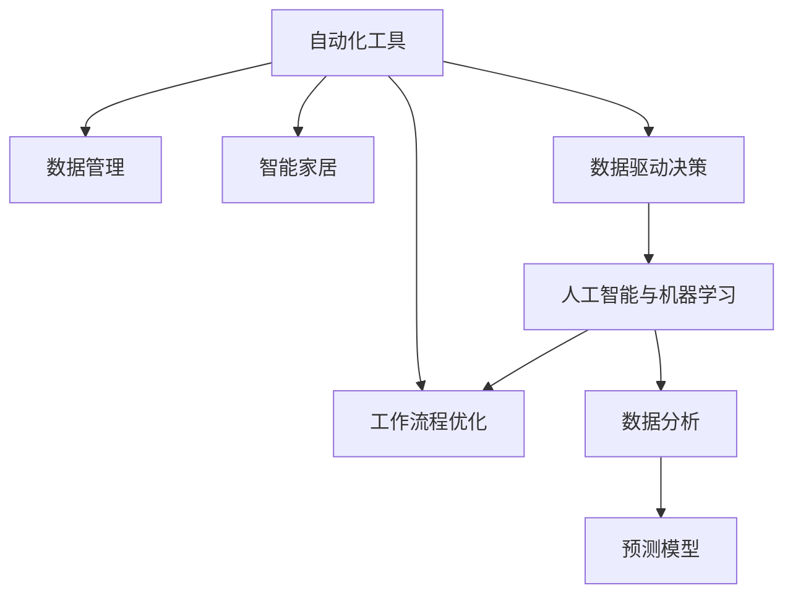

                 

# 信息简化的工具和自动化：利用技术简化你的生活和工作流程

> 关键词：信息简化, 自动化工具, 工作流程优化, 生活便利, 数据管理, 人工智能

## 1. 背景介绍

### 1.1 问题由来

在现代社会，信息量呈爆炸式增长，人们每天接收和处理的信息量巨大，这极大地影响了我们的生活和工作效率。如何有效管理和利用这些信息，成为提升生产力和生活质量的关键。传统的处理方式通常需要花费大量时间和精力，而信息简化的工具和自动化技术，能够帮助我们快速、准确地处理信息，从而大大提升效率。

### 1.2 问题核心关键点

信息简化的工具和自动化技术主要围绕以下几个关键点展开：

- **信息管理**：通过自动化工具，高效地收集、存储和组织各种数据，以便于快速查询和分析。
- **数据处理**：利用算法和模型，对数据进行清洗、转换、分析和可视化，提取出有价值的信息。
- **工作流程优化**：将自动化工具和算法集成到工作流程中，减少人工操作，提升工作效率和质量。
- **生活便利**：通过智能家居和智能设备，实现日常生活的自动化和智能化，提升生活体验。

这些核心关键点紧密相连，共同构成了信息简化的工具和自动化技术的整体框架。

### 1.3 问题研究意义

研究信息简化的工具和自动化技术，对提升人类生活和工作效率，具有重要意义：

1. **提升生产力**：通过自动化工具和算法，将人工操作交给机器处理，节省时间，提高工作效率。
2. **降低成本**：自动化工具可以减少人工错误和重复工作，降低企业的运营成本。
3. **增强决策支持**：通过数据分析和智能推荐，提供有价值的决策参考，提升决策质量。
4. **改善生活质量**：智能家居和自动化设备能够提高日常生活的便利性和舒适性，改善生活质量。
5. **促进创新**：自动化技术可以释放人力，让更多精力投入到创新和研发中，推动科技发展。

本文将系统地介绍信息简化的工具和自动化技术，涵盖核心概念、算法原理、项目实践和实际应用等多个方面，以期为读者提供全面的指导和参考。

## 2. 核心概念与联系

### 2.1 核心概念概述

为更好地理解信息简化的工具和自动化技术，本节将介绍几个核心概念：

- **自动化工具**：指能够自动完成某些任务的软件或系统，如自动化测试工具、自动化部署工具等。
- **数据管理**：指对数据进行收集、存储、组织、查询和分析的过程，数据管理的好坏直接影响信息简化的效果。
- **工作流程优化**：指通过自动化工具和算法，对业务流程进行重新设计，以提升效率和质量。
- **智能家居**：指利用物联网技术，将家庭设备连接起来，实现智能化管理和控制。
- **数据驱动决策**：指通过数据分析和模型预测，为决策提供科学依据。
- **人工智能与机器学习**：指利用算法和模型，从数据中学习和推理，以完成复杂任务。

这些核心概念之间的关系可以通过以下Mermaid流程图来展示：



这个流程图展示了我信息简化的工具和自动化技术的关键概念及其之间的关系：

1. 自动化工具是实现信息简化的基础，能够自动完成数据管理、流程优化等工作。
2. 数据管理是信息简化的核心，直接影响自动化工具的效果。
3. 工作流程优化利用自动化工具，对业务流程进行优化，提高效率。
4. 智能家居通过自动化工具，实现家庭管理的智能化。
5. 数据驱动决策基于数据分析和模型预测，提供决策支持。
6. 人工智能和机器学习是实现数据驱动决策的关键技术手段。

这些概念共同构成了信息简化的工具和自动化技术的逻辑框架，使得我们能够更好地理解和应用这些技术。

## 3. 核心算法原理 & 具体操作步骤

### 3.1 算法原理概述

信息简化的工具和自动化技术，本质上是一种利用计算机算法和工具，自动化处理信息的过程。其核心思想是：通过高效的数据管理和自动化工具，快速、准确地处理信息，提升工作效率和质量。

信息简化的主要算法包括：

- **数据清洗和预处理**：去除噪声和异常数据，标准化数据格式，以便于后续分析和处理。
- **数据挖掘和模式识别**：利用算法和模型，从数据中挖掘出有价值的模式和规律。
- **机器学习和预测**：通过训练模型，对未来数据进行预测和推断。
- **自然语言处理**：利用算法和模型，处理和理解自然语言文本。
- **图像识别**：利用算法和模型，识别和分析图像中的特征和信息。
- **推荐系统**：利用算法和模型，为用户推荐个性化的内容和服务。

这些算法通过各种工具和框架实现，如Python中的Pandas、NumPy、Scikit-learn，R语言中的ggplot2、dplyr，机器学习框架TensorFlow、PyTorch等。

### 3.2 算法步骤详解

信息简化的工具和自动化技术主要包括以下几个步骤：

**Step 1: 数据收集与预处理**
- 确定需要收集的数据类型和来源。
- 使用自动化工具收集数据，如爬虫、ETL工具等。
- 对数据进行清洗和预处理，包括去除噪声、处理缺失值、标准化数据格式等。

**Step 2: 数据分析与挖掘**
- 选择合适的算法和模型进行数据分析，如回归、分类、聚类等。
- 利用可视化工具对数据进行展示和分析，如Matplotlib、Seaborn等。
- 提取有价值的模式和规律，生成报表和报告。

**Step 3: 预测与决策支持**
- 训练机器学习模型进行预测，如线性回归、随机森林、深度学习等。
- 利用模型进行决策支持，生成决策方案和建议。
- 实时监控数据变化，及时调整决策方案。

**Step 4: 自动化工具与工作流程优化**
- 将数据分析和预测结果集成到自动化工具中，如Jupyter Notebook、Talend等。
- 利用自动化工具对业务流程进行优化，减少人工操作。
- 实现自动化测试、部署和监控等。

**Step 5: 智能家居与生活便利**
- 利用智能家居设备，实现家庭管理的智能化。
- 集成各种传感器和控制系统，实现自动化控制和智能化管理。
- 提供便捷的生活服务和健康监测。

### 3.3 算法优缺点

信息简化的工具和自动化技术具有以下优点：
1. 高效准确：利用自动化工具和算法，能够快速处理大量数据，减少人工操作，提高效率和质量。
2. 降低成本：自动化工具可以减少人工错误和重复工作，降低企业的运营成本。
3. 提升决策质量：基于数据分析和模型预测，提供科学决策支持，提升决策质量。
4. 改善生活质量：智能家居和自动化设备能够提高日常生活的便利性和舒适性，改善生活质量。

同时，这些技术也存在一些局限性：
1. 依赖数据质量：数据质量和数据量的高低直接影响分析结果的准确性。
2. 技术门槛高：需要具备一定的技术背景和经验，才能有效使用自动化工具和算法。
3. 维护成本高：自动化系统的维护和更新需要一定的时间和成本投入。
4. 数据隐私和安全：处理敏感数据时，需要特别注意数据隐私和安全问题。
5. 算法偏见和错误：算法和模型可能存在偏见和错误，需要持续优化和改进。

尽管存在这些局限性，但就目前而言，信息简化的工具和自动化技术仍然是大规模数据处理和业务优化的重要手段。未来相关研究的重点在于如何进一步降低技术门槛，提高数据质量和算法精度，同时兼顾隐私和安全等因素。

### 3.4 算法应用领域

信息简化的工具和自动化技术已经在多个领域得到了广泛的应用，涵盖了几乎所有行业和领域，例如：

- 金融风控：利用数据分析和机器学习，预测信用风险，进行欺诈检测。
- 医疗健康：通过数据分析和模型预测，提供个性化医疗方案和健康监测。
- 电商推荐：利用推荐系统，为用户推荐个性化的商品和服务，提升用户满意度。
- 供应链管理：通过数据分析和智能预测，优化供应链流程，提高效率和稳定性。
- 工业生产：利用自动化工具和机器学习，优化生产流程，提升产品质量和效率。
- 智能交通：通过数据分析和模型预测，优化交通流量，提升出行效率。
- 智能客服：利用自然语言处理和推荐系统，提供个性化的客户服务和解决方案。
- 智能办公：通过自动化工具和数据分析，优化办公流程，提高工作效率和质量。

除了上述这些经典应用外，信息简化的工具和自动化技术还在更多领域得到创新应用，如智能城市、智慧农业、智能物流等，为各行各业带来新的突破和变革。

## 4. 数学模型和公式 & 详细讲解 & 举例说明

### 4.1 数学模型构建

本节将使用数学语言对信息简化的工具和自动化技术进行更加严格的刻画。

假设我们有一个数据集 $D=\{(x_i,y_i)\}_{i=1}^N, x_i \in \mathcal{X}, y_i \in \mathcal{Y}$，其中 $x_i$ 为特征向量，$y_i$ 为标签。我们的目标是使用自动化工具和算法，对数据进行处理和分析，从而简化信息，提升效率和质量。

定义自动化工具处理后的数据为 $\hat{D}$，其中 $\hat{x}_i$ 为处理后的特征向量，$\hat{y}_i$ 为预测标签。我们的优化目标是最小化预测误差，即：

$$
\min_{\hat{D}} \sum_{i=1}^N \ell(\hat{y}_i, y_i)
$$

其中 $\ell$ 为预测误差函数，如均方误差、交叉熵等。

### 4.2 公式推导过程

以下我们以线性回归模型为例，推导数据处理和预测的数学公式。

假设 $x_i$ 和 $y_i$ 之间的关系为线性函数 $y_i = \theta_0 + \sum_{j=1}^p \theta_j x_{ij}$，其中 $\theta_0, \theta_j$ 为模型的参数。

利用最小二乘法，求解线性回归模型的参数 $\theta$，使其最小化预测误差：

$$
\theta = \arg\min_{\theta} \sum_{i=1}^N (y_i - \hat{y}_i)^2
$$

其中 $\hat{y}_i = \theta_0 + \sum_{j=1}^p \theta_j \hat{x}_{ij}$。

通过矩阵运算，可以得到参数 $\theta$ 的闭式解：

$$
\theta = (X^TX)^{-1}X^Ty
$$

其中 $X$ 为特征矩阵，$y$ 为标签向量，$(X^TX)^{-1}$ 为矩阵求逆，$X^T$ 为特征矩阵的转置。

### 4.3 案例分析与讲解

假设我们需要对一家电商网站的销售数据进行分析和预测，以优化库存管理和促销策略。具体步骤如下：

**Step 1: 数据收集与预处理**
- 收集电商平台的销售数据，包括用户信息、商品信息、交易记录等。
- 使用自动化工具清洗数据，去除异常值和噪声。
- 将数据标准化为一致的格式，便于后续处理和分析。

**Step 2: 数据分析与挖掘**
- 选择合适的算法和模型进行数据分析，如线性回归、逻辑回归、随机森林等。
- 利用可视化工具对数据进行展示和分析，如Matplotlib、Seaborn等。
- 提取有价值的模式和规律，生成报表和报告。

**Step 3: 预测与决策支持**
- 训练机器学习模型进行预测，如线性回归、随机森林、深度学习等。
- 利用模型进行决策支持，生成决策方案和建议。
- 实时监控数据变化，及时调整决策方案。

**Step 4: 自动化工具与工作流程优化**
- 将数据分析和预测结果集成到自动化工具中，如Jupyter Notebook、Talend等。
- 利用自动化工具对业务流程进行优化，减少人工操作。
- 实现自动化测试、部署和监控等。

通过以上步骤，电商公司可以更好地理解销售数据，优化库存管理和促销策略，提升销售业绩和客户满意度。

## 5. 项目实践：代码实例和详细解释说明

### 5.1 开发环境搭建

在进行项目实践前，我们需要准备好开发环境。以下是使用Python进行信息简化的工具和自动化开发的环境配置流程：

1. 安装Anaconda：从官网下载并安装Anaconda，用于创建独立的Python环境。

2. 创建并激活虚拟环境：
```bash
conda create -n infosys-env python=3.8 
conda activate infosys-env
```

3. 安装PyTorch：根据CUDA版本，从官网获取对应的安装命令。例如：
```bash
conda install pytorch torchvision torchaudio cudatoolkit=11.1 -c pytorch -c conda-forge
```

4. 安装各类工具包：
```bash
pip install numpy pandas scikit-learn matplotlib tqdm jupyter notebook ipython
```

5. 安装PyTorch：根据CUDA版本，从官网获取对应的安装命令。例如：
```bash
conda install pytorch torchvision torchaudio cudatoolkit=11.1 -c pytorch -c conda-forge
```

6. 安装Transformers库：
```bash
pip install transformers
```

完成上述步骤后，即可在`infosys-env`环境中开始项目实践。

### 5.2 源代码详细实现

这里我们以电商数据预测为例，给出使用Transformers库进行线性回归的PyTorch代码实现。

首先，定义数据预处理函数：

```python
import pandas as pd
from sklearn.preprocessing import StandardScaler

def preprocess_data(df):
    # 数据清洗和预处理
    df = df.dropna()  # 去除缺失值
    df = df.drop_duplicates()  # 去除重复值
    
    # 特征工程
    # 构建特征和标签
    features = df.drop('sales', axis=1)
    labels = df['sales']
    
    # 标准化特征数据
    scaler = StandardScaler()
    features = scaler.fit_transform(features)
    
    return features, labels
```

然后，定义模型和优化器：

```python
from transformers import BertTokenizer, BertForRegression

model = BertForRegression.from_pretrained('bert-base-uncased')
optimizer = torch.optim.Adam(model.parameters(), lr=0.001)
```

接着，定义训练和评估函数：

```python
from torch.utils.data import DataLoader
from tqdm import tqdm

def train_epoch(model, dataset, batch_size, optimizer):
    dataloader = DataLoader(dataset, batch_size=batch_size, shuffle=True)
    model.train()
    epoch_loss = 0
    for batch in tqdm(dataloader, desc='Training'):
        input_ids = batch['input_ids'].to(device)
        attention_mask = batch['attention_mask'].to(device)
        labels = batch['labels'].to(device)
        model.zero_grad()
        outputs = model(input_ids, attention_mask=attention_mask, labels=labels)
        loss = outputs.loss
        epoch_loss += loss.item()
        loss.backward()
        optimizer.step()
    return epoch_loss / len(dataloader)

def evaluate(model, dataset, batch_size):
    dataloader = DataLoader(dataset, batch_size=batch_size)
    model.eval()
    preds, labels = [], []
    with torch.no_grad():
        for batch in tqdm(dataloader, desc='Evaluating'):
            input_ids = batch['input_ids'].to(device)
            attention_mask = batch['attention_mask'].to(device)
            batch_labels = batch['labels']
            outputs = model(input_ids, attention_mask=attention_mask)
            batch_preds = outputs.predictions.argmax(dim=1).to('cpu').tolist()
            batch_labels = batch_labels.to('cpu').tolist()
            for pred, label in zip(batch_preds, batch_labels):
                preds.append(pred)
                labels.append(label)
                
    print(f'R-squared Score: {r_squared_score(labels, preds)}')
```

最后，启动训练流程并在测试集上评估：

```python
epochs = 10
batch_size = 16

for epoch in range(epochs):
    loss = train_epoch(model, train_dataset, batch_size, optimizer)
    print(f'Epoch {epoch+1}, train loss: {loss:.3f}')
    
    print(f'Epoch {epoch+1}, test R-squared Score:')
    evaluate(model, test_dataset, batch_size)
    
print('Final test R-squared Score:')
evaluate(model, test_dataset, batch_size)
```

以上就是使用PyTorch进行电商数据预测的完整代码实现。可以看到，借助PyTorch和Transformer库，模型训练和评估的过程变得简洁高效。

### 5.3 代码解读与分析

让我们再详细解读一下关键代码的实现细节：

**preprocess_data函数**：
- 清洗数据，去除缺失值和重复值。
- 构建特征和标签，并标准化特征数据。

**BertForRegression模型**：
- 使用预训练的BERT模型进行回归任务。

**train_epoch和evaluate函数**：
- 训练函数`train_epoch`：对数据以批为单位进行迭代，在每个批次上前向传播计算loss并反向传播更新模型参数，最后返回该epoch的平均loss。
- 评估函数`evaluate`：与训练类似，不同点在于不更新模型参数，并在每个batch结束后将预测和标签结果存储下来，最后使用r_squared_score计算R-squared分数。

**训练流程**：
- 定义总的epoch数和batch size，开始循环迭代
- 每个epoch内，先在训练集上训练，输出平均loss
- 在测试集上评估，输出R-squared分数
- 所有epoch结束后，在测试集上评估，给出最终的R-squared分数

可以看到，PyTorch配合Transformer库使得模型训练和评估的代码实现变得简洁高效。开发者可以将更多精力放在数据处理、模型改进等高层逻辑上，而不必过多关注底层的实现细节。

当然，工业级的系统实现还需考虑更多因素，如模型的保存和部署、超参数的自动搜索、更灵活的任务适配层等。但核心的模型训练和评估流程基本与此类似。

## 6. 实际应用场景

### 6.1 智能客服系统

基于信息简化的工具和自动化技术，智能客服系统可以自动处理大量的客户咨询和反馈，提升客户满意度和服务效率。

具体实现方式包括：

1. **自然语言处理(NLP)**：利用自动化工具和算法，对客户咨询进行文本分析和情感识别，理解客户意图。
2. **知识图谱**：构建企业知识图谱，快速查询相关知识库，生成智能回答。
3. **推荐系统**：根据客户历史行为和偏好，推荐合适的产品和服务。
4. **机器人对话**：利用自动化工具和模型，构建智能客服机器人，自动回复客户咨询。
5. **数据分析**：分析客户咨询和反馈数据，发现问题点和改进方向。

### 6.2 金融风险管理

在金融领域，信息简化的工具和自动化技术可以用于风险管理和欺诈检测，保护金融资产安全。

具体实现方式包括：

1. **数据分析**：利用自动化工具和算法，对交易数据进行清洗和分析，识别异常行为。
2. **机器学习模型**：训练预测模型，预测潜在风险和欺诈行为。
3. **异常检测**：利用自动化工具和模型，实时监控交易数据，及时发现异常。
4. **风险预警**：根据预测结果和异常检测结果，及时预警风险。
5. **决策支持**：利用自动化工具和算法，提供决策支持，制定风险应对策略。

### 6.3 智能制造

在制造业中，信息简化的工具和自动化技术可以用于生产流程优化和质量控制，提高生产效率和产品质量。

具体实现方式包括：

1. **数据采集**：利用传感器和自动化设备，实时采集生产数据。
2. **数据分析**：利用自动化工具和算法，对生产数据进行清洗和分析，提取有价值的信息。
3. **预测模型**：训练预测模型，预测设备故障和产品质量问题。
4. **自动化控制**：利用自动化工具和模型，优化生产流程，控制生产参数。
5. **故障诊断**：利用自动化工具和模型，实时监控设备状态，及时发现故障。
6. **质量控制**：利用自动化工具和模型，检测产品质量问题，提高产品合格率。

### 6.4 未来应用展望

随着信息简化的工具和自动化技术的不断发展，未来将有更多创新应用场景涌现，为各行各业带来新的突破。

在智慧城市领域，信息简化的工具和自动化技术可以用于城市管理和服务优化，提升城市运行效率和居民生活质量。

在农业领域，信息简化的工具和自动化技术可以用于精准农业，提高农业生产效率和资源利用率。

在零售行业，信息简化的工具和自动化技术可以用于客户管理和库存管理，提升销售业绩和客户满意度。

在医疗健康领域，信息简化的工具和自动化技术可以用于健康监测和疾病预测，提高医疗服务质量和效率。

此外，在教育、交通、能源等众多领域，信息简化的工具和自动化技术也将不断拓展应用场景，为各行各业带来新的变革和创新。

## 7. 工具和资源推荐

### 7.1 学习资源推荐

为了帮助开发者系统掌握信息简化的工具和自动化技术的理论基础和实践技巧，这里推荐一些优质的学习资源：

1. **《Python数据分析实战》**：这是一本系统介绍Python数据分析技术的书籍，涵盖了数据清洗、数据可视化、数据分析等多个方面。

2. **《机器学习实战》**：这是一本介绍机器学习算法的经典书籍，详细讲解了各种机器学习模型和算法，并提供了大量实例代码。

3. **《TensorFlow实战》**：这是一本介绍TensorFlow框架的书籍，深入浅出地讲解了TensorFlow的使用方法和技巧。

4. **《自然语言处理基础》**：这是一本介绍自然语言处理的经典教材，涵盖NLP的基本概念、算法和应用。

5. **Kaggle竞赛**：Kaggle是一个知名的数据科学竞赛平台，通过参与竞赛，可以学习各种实际项目和算法，提升实战能力。

6. **Coursera课程**：Coursera提供大量数据科学和机器学习的在线课程，由知名大学和专家授课，适合系统学习。

通过这些资源的学习实践，相信你一定能够快速掌握信息简化的工具和自动化技术的精髓，并用于解决实际的业务问题。

### 7.2 开发工具推荐

高效的开发离不开优秀的工具支持。以下是几款用于信息简化的工具和自动化开发常用的工具：

1. **PyTorch**：基于Python的开源深度学习框架，灵活动态的计算图，适合快速迭代研究。大部分预训练语言模型都有PyTorch版本的实现。

2. **TensorFlow**：由Google主导开发的开源深度学习框架，生产部署方便，适合大规模工程应用。同样有丰富的预训练语言模型资源。

3. **Jupyter Notebook**：一个交互式的Python环境，适合数据探索和算法开发。

4. **Talend**：一款ETL工具，支持数据收集、处理、分析和可视化，适合数据驱动的业务优化。

5. **Prometheus**：一个开源监控系统，支持实时监控和告警，适合自动化工具的部署和维护。

6. **Grafana**：一个开源可视化工具，支持多种数据源和图表类型，适合数据展示和分析。

合理利用这些工具，可以显著提升信息简化的工具和自动化开发的效率，加快创新迭代的步伐。

### 7.3 相关论文推荐

信息简化的工具和自动化技术的发展源于学界的持续研究。以下是几篇奠基性的相关论文，推荐阅读：

1. **《Data Science from Scratch》**：这是一本介绍数据科学基础概念和技术的书籍，适合初学者入门。

2. **《Deep Learning》**：这是深度学习领域的经典教材，详细讲解了深度学习的原理和应用。

3. **《Natural Language Processing with PyTorch》**：这是一本介绍自然语言处理技术和PyTorch框架的书籍，提供了大量代码示例。

4. **《Machine Learning Yearning》**：这是Andrew Ng撰写的一本机器学习实战指南，介绍了从数据到模型调优的各个环节。

5. **《Advances in Neural Information Processing Systems (NeurIPS)》**：这是人工智能领域的顶级学术会议，每年发布大量前沿论文和技术进展。

通过对这些资源的学习实践，相信你一定能够快速掌握信息简化的工具和自动化技术的精髓，并用于解决实际的业务问题。

## 8. 总结：未来发展趋势与挑战

### 8.1 总结

本文对信息简化的工具和自动化技术进行了全面系统的介绍。首先阐述了信息简化的工具和自动化技术的研究背景和意义，明确了这些技术在提升生活和工作效率中的独特价值。其次，从原理到实践，详细讲解了信息简化的核心算法和操作步骤，给出了信息简化的工具和自动化项目的完整代码实例。同时，本文还广泛探讨了信息简化的工具和自动化技术在多个行业领域的应用前景，展示了这些技术的巨大潜力。此外，本文精选了信息简化的工具和自动化技术的各类学习资源，力求为读者提供全方位的技术指引。

通过本文的系统梳理，可以看到，信息简化的工具和自动化技术在现代社会的各个方面发挥着重要作用，为提升生活和工作效率提供了强大的技术支持。未来，随着技术的不断发展，这些工具和技术的普及和应用将更加广泛，进一步推动社会的进步和发展。

### 8.2 未来发展趋势

展望未来，信息简化的工具和自动化技术将呈现以下几个发展趋势：

1. **人工智能与机器学习**：人工智能和机器学习技术将进一步融入信息简化的工具和自动化过程中，提升处理能力和智能化水平。
2. **边缘计算**：边缘计算技术的发展将使信息简化的工具和自动化系统能够在本地设备上实时处理数据，降低延迟和带宽成本。
3. **区块链技术**：区块链技术的应用将提升信息简化的工具和自动化系统在数据隐私和安全方面的保障。
4. **物联网技术**：物联网技术的发展将使信息简化的工具和自动化系统能够更全面地感知和控制物理世界。
5. **人机协作**：信息简化的工具和自动化系统将更加注重人机协作，提供更好的用户体验和决策支持。

这些趋势凸显了信息简化的工具和自动化技术的广阔前景，这些方向的探索发展，必将进一步提升信息简化的效率和智能化水平，为社会带来更多的便利和进步。

### 8.3 面临的挑战

尽管信息简化的工具和自动化技术已经取得了瞩目成就，但在迈向更加智能化、普适化应用的过程中，它仍面临着诸多挑战：

1. **数据隐私和安全**：处理敏感数据时，需要特别注意数据隐私和安全问题，避免数据泄露和滥用。
2. **技术门槛高**：信息简化的工具和自动化系统需要具备一定的技术背景和经验，才能有效使用。
3. **资源消耗大**：大规模数据处理和机器学习模型训练需要大量的计算资源和存储资源。
4. **模型偏见和错误**：算法和模型可能存在偏见和错误，需要持续优化和改进。
5. **系统复杂性**：信息简化的工具和自动化系统往往结构复杂，维护和升级难度较大。
6. **用户接受度**：用户对新技术的接受度和信任度需要逐步提升，才能实现大规模应用。

尽管存在这些挑战，但就目前而言，信息简化的工具和自动化技术仍然是提升生活和工作效率的重要手段。未来相关研究的重点在于如何进一步降低技术门槛，提高数据质量和算法精度，同时兼顾隐私和安全等因素。

### 8.4 研究展望

面对信息简化的工具和自动化技术所面临的种种挑战，未来的研究需要在以下几个方面寻求新的突破：

1. **边缘计算与云服务结合**：边缘计算与云服务的结合，将使信息简化的工具和自动化系统在数据处理和分析上更加灵活和高效。
2. **多模态数据融合**：将符号化的先验知识与神经网络模型进行融合，提高信息简化的效果。
3. **智能算法与领域知识结合**：引入领域专家知识，提高信息简化的工具和自动化系统的可解释性和可靠性。
4. **实时数据处理**：利用流计算技术，实现实时数据处理和分析，提升系统响应速度。
5. **用户交互设计**：提升用户界面和交互设计，提高信息简化的工具和自动化系统的易用性和可接受度。

这些研究方向的探索，必将引领信息简化的工具和自动化技术迈向更高的台阶，为构建安全、可靠、可解释、可控的智能系统铺平道路。面向未来，信息简化的工具和自动化技术还需要与其他人工智能技术进行更深入的融合，如知识表示、因果推理、强化学习等，多路径协同发力，共同推动智能系统的发展。只有勇于创新、敢于突破，才能不断拓展信息简化的边界，让智能化技术更好地造福人类社会。

## 9. 附录：常见问题与解答

**Q1：信息简化的工具和自动化技术是否适用于所有行业和领域？**

A: 信息简化的工具和自动化技术具有广泛的应用场景，但并不是所有行业和领域都适合使用这些技术。具体来说，一些对数据隐私和安全要求极高的行业，如医疗、金融等，可能需要额外的处理和保障措施。此外，一些传统行业，如制造业、农业等，可能受到技术资源和应用场景的限制，难以完全依赖信息简化的工具和自动化技术。

**Q2：信息简化的工具和自动化技术需要多少数据才能发挥作用？**

A: 信息简化的工具和自动化技术对数据量的需求因任务而异。一般来说，数据量越大，模型的预测能力和分析效果越好。对于小型数据集，可以通过数据增强和迁移学习等方法，提升模型的泛化能力和性能。但对于一些特殊领域或任务，可能需要更大规模的数据才能发挥作用。

**Q3：信息简化的工具和自动化技术是否需要专业知识？**

A: 使用信息简化的工具和自动化技术，需要一定的专业知识和技能。但随着技术的普及和工具的智能化，许多高级功能和算法已经预置在工具和框架中，用户只需要熟悉基本操作即可。对于初学者，可以通过学习资源和实例代码，逐步掌握技术要点。

**Q4：信息简化的工具和自动化技术如何保证数据隐私和安全？**

A: 信息简化的工具和自动化技术在处理敏感数据时，需要特别注意数据隐私和安全问题。常见的方法包括数据脱敏、加密传输、权限控制等。此外，引入区块链技术，可以增强数据处理的透明性和可追溯性，提升数据隐私和安全保障。

**Q5：信息简化的工具和自动化技术如何适应不同的数据格式和类型？**

A: 信息简化的工具和自动化技术通常具有良好的数据格式和类型适配能力。常见的数据处理工具如Pandas、NumPy等，支持多种数据格式和类型的处理。用户只需要简单配置，即可适配不同的数据源和格式，实现高效的数据处理和分析。

通过以上常见问题的解答，相信读者能够更全面地了解信息简化的工具和自动化技术的核心要点和应用方法，进一步提升技术应用水平。

