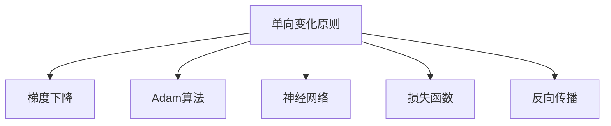

                 

# 像数学家一样思考：单向变化原则

> 关键词：单向变化原则,机器学习,深度学习,数学模型,算法优化,项目实践,实际应用,未来趋势,工具推荐

## 1. 背景介绍

### 1.1 问题由来
在机器学习和深度学习的领域中，模型优化是一个核心问题。无论是训练模型还是调整超参数，优化算法的选择和实现都直接影响模型的性能。然而，在传统的优化算法中，存在着一个重要的原则——单向变化原则。这个原则被广泛应用于机器学习中，但其核心思想和应用方式仍然有许多值得深入探讨的地方。本文将从数学家的角度，深入分析单向变化原则的原理、操作步骤以及它在实际应用中的优缺点和应用领域，希望为读者提供一个全面的视角。

### 1.2 问题核心关键点
单向变化原则的核心思想在于，在模型训练和优化过程中，每一次迭代只应该朝着单一方向前进。也就是说，每次更新参数时，梯度更新的方向和大小应该是确定的，不能随机变化。这个原则在许多经典优化算法中得到了广泛的应用，如梯度下降、Adam等。通过深入理解这个原则，我们可以更好地掌握机器学习和深度学习的优化方法，从而在实际应用中取得更好的效果。

## 2. 核心概念与联系

### 2.1 核心概念概述

为了更好地理解单向变化原则，我们需要先了解以下几个核心概念：

- **单向变化原则**：在模型训练和优化过程中，每次参数更新都只朝着单一方向前进。
- **梯度下降**：一种基于一阶导数的优化算法，通过计算目标函数对参数的梯度，更新参数值。
- **Adam算法**：一种基于二阶矩估计的自适应学习率优化算法，结合了梯度的一阶矩估计和二阶矩估计，适用于大规模数据集和高维参数空间。
- **神经网络**：一种由大量人工神经元组成的计算模型，用于处理和分析复杂数据。
- **损失函数**：衡量模型预测结果与真实值之间差异的函数，用于指导模型的训练和优化。
- **反向传播**：一种计算图算法，用于计算目标函数对参数的梯度，是深度学习模型训练的基础。

这些概念之间的逻辑关系可以通过以下Mermaid流程图来展示：



这个流程图展示了单向变化原则与其他核心概念之间的联系，帮助我们更好地理解这个原则在机器学习和深度学习中的应用。

## 3. 核心算法原理 & 具体操作步骤

### 3.1 算法原理概述

单向变化原则的原理是建立在数学优化问题的基础上的。在机器学习和深度学习中，我们通常需要最小化一个目标函数，例如损失函数。单向变化原则认为，为了快速收敛到目标函数的最优解，参数的更新应该沿着梯度的方向进行，且每次更新的步长（学习率）应该控制在一个合理的范围内。

数学上，目标函数可以表示为一个多变量函数 $f(\theta)$，其中 $\theta$ 是模型的参数向量。单向变化原则要求在每次迭代中，参数 $\theta$ 的更新应该满足以下条件：

$$
\theta_{t+1} = \theta_t - \eta_t \nabla_{\theta}f(\theta_t)
$$

其中 $\eta_t$ 是第 $t$ 次迭代的学习率，$\nabla_{\theta}f(\theta_t)$ 是目标函数 $f(\theta)$ 在 $\theta_t$ 处的梯度。

### 3.2 算法步骤详解

基于单向变化原则，常见的优化算法步骤如下：

**Step 1: 初始化参数**
- 随机初始化模型的参数向量 $\theta_0$，通常使用小随机数进行初始化。

**Step 2: 计算梯度**
- 计算目标函数 $f(\theta)$ 在当前参数 $\theta_t$ 处的梯度 $\nabla_{\theta}f(\theta_t)$，通常使用反向传播算法进行计算。

**Step 3: 更新参数**
- 根据单向变化原则，使用学习率 $\eta_t$ 和梯度 $\nabla_{\theta}f(\theta_t)$ 更新参数 $\theta_t$，得到新的参数向量 $\theta_{t+1}$。

**Step 4: 重复迭代**
- 重复以上步骤，直到模型收敛或达到预设的迭代次数。

### 3.3 算法优缺点

单向变化原则在机器学习和深度学习中的应用具有以下优点和缺点：

**优点：**
- 快速收敛：通过沿梯度方向更新参数，可以快速接近目标函数的最优解。
- 稳定性高：单向变化原则保证了每次参数更新的方向和大小的一致性，提高了算法的稳定性。
- 易于实现：许多优化算法（如梯度下降、Adam等）都是基于单向变化原则设计的，实现起来较为简单。

**缺点：**
- 学习率选择困难：学习率的过大或过小都会影响算法的性能，需要通过实验调参。
- 对初始值敏感：初始值的选择会影响算法收敛的速度和稳定性，需要进行适当的调整。
- 容易陷入局部最优解：在某些情况下，单向变化原则可能使得算法陷入局部最优解，无法找到全局最优解。

### 3.4 算法应用领域

单向变化原则在机器学习和深度学习中的应用非常广泛，以下是一些典型的应用领域：

- **图像识别**：在图像识别任务中，单向变化原则用于训练卷积神经网络（CNN），使模型能够从图像中提取特征并分类。
- **自然语言处理**：在自然语言处理任务中，单向变化原则用于训练循环神经网络（RNN）和长短期记忆网络（LSTM），使模型能够理解和生成文本。
- **推荐系统**：在推荐系统中，单向变化原则用于优化用户行为预测模型，使推荐系统能够根据用户的历史行为和偏好，生成个性化的推荐结果。
- **信号处理**：在信号处理任务中，单向变化原则用于训练信号处理模型，使模型能够从信号中提取有用的信息。

## 4. 数学模型和公式 & 详细讲解 & 举例说明

### 4.1 数学模型构建

单向变化原则的数学模型可以表示为：

$$
\theta_{t+1} = \theta_t - \eta_t \nabla_{\theta}f(\theta_t)
$$

其中 $\theta_t$ 是第 $t$ 次迭代中的模型参数向量，$\eta_t$ 是第 $t$ 次迭代的学习率，$\nabla_{\theta}f(\theta_t)$ 是目标函数 $f(\theta)$ 在 $\theta_t$ 处的梯度。

### 4.2 公式推导过程

对于任意的多变量函数 $f(\theta)$，其梯度可以表示为：

$$
\nabla_{\theta}f(\theta) = \left[\frac{\partial f(\theta)}{\partial \theta_1}, \frac{\partial f(\theta)}{\partial \theta_2}, \ldots, \frac{\partial f(\theta)}{\partial \theta_n}\right]
$$

其中 $n$ 是参数向量的维度。因此，单向变化原则的参数更新公式可以表示为：

$$
\theta_{t+1} = \theta_t - \eta_t \left[\frac{\partial f(\theta_t)}{\partial \theta_1}, \frac{\partial f(\theta_t)}{\partial \theta_2}, \ldots, \frac{\partial f(\theta_t)}{\partial \theta_n}\right]
$$

### 4.3 案例分析与讲解

假设我们有一个简单的线性回归模型 $f(x) = w_1 x_1 + w_2 x_2 + \ldots + w_n x_n + b$，其中 $x = [x_1, x_2, \ldots, x_n]$ 是输入向量，$w$ 是权重向量，$b$ 是偏置项。我们的目标是最小化均方误差损失函数 $L = \frac{1}{2} \sum_{i=1}^N (y_i - f(x_i))^2$，其中 $y_i$ 是第 $i$ 个样本的真实值。

在单向变化原则下，我们使用梯度下降算法进行优化。首先，计算损失函数 $L$ 对权重 $w$ 的梯度：

$$
\nabla_{w}L = \frac{\partial L}{\partial w_1}, \frac{\partial L}{\partial w_2}, \ldots, \frac{\partial L}{\partial w_n}
$$

然后，使用学习率 $\eta$ 更新权重 $w$：

$$
w_{t+1} = w_t - \eta \nabla_{w}L
$$

通过不断迭代，我们可以得到最小化损失函数的权重向量 $w^*$。

## 5. 项目实践：代码实例和详细解释说明

### 5.1 开发环境搭建

在进行项目实践前，我们需要准备好开发环境。以下是使用Python进行TensorFlow开发的环境配置流程：

1. 安装Anaconda：从官网下载并安装Anaconda，用于创建独立的Python环境。

2. 创建并激活虚拟环境：
```bash
conda create -n tf-env python=3.8 
conda activate tf-env
```

3. 安装TensorFlow：根据CUDA版本，从官网获取对应的安装命令。例如：
```bash
conda install tensorflow -c pytorch -c conda-forge
```

4. 安装各类工具包：
```bash
pip install numpy pandas scikit-learn matplotlib tqdm jupyter notebook ipython
```

完成上述步骤后，即可在`tf-env`环境中开始项目实践。

### 5.2 源代码详细实现

下面我们以线性回归任务为例，给出使用TensorFlow实现单向变化原则的代码实现。

首先，定义线性回归模型和损失函数：

```python
import tensorflow as tf
import numpy as np

# 定义模型参数
w = tf.Variable(tf.zeros([n_features, 1]))
b = tf.Variable(tf.zeros([1]))

# 定义模型和损失函数
def model(X, y):
    return X @ w + b

def loss(y_true, y_pred):
    return tf.reduce_mean(tf.square(y_true - y_pred))
```

然后，定义优化器并执行梯度下降：

```python
# 定义优化器
optimizer = tf.optimizers.SGD(learning_rate=0.01)

# 训练模型
for epoch in range(num_epochs):
    for i in range(num_samples):
        with tf.GradientTape() as tape:
            y_pred = model(X[i], y[i])
            loss_value = loss(y_true[i], y_pred)
        gradients = tape.gradient(loss_value, [w, b])
        optimizer.apply_gradients(zip(gradients, [w, b]))
```

最后，在测试集上评估模型：

```python
# 加载测试集
X_test, y_test = ...

# 使用模型进行预测
y_pred = model(X_test, y_test)

# 计算测试集上的损失
test_loss = loss(y_test, y_pred)
```

以上就是使用TensorFlow实现单向变化原则的完整代码实现。可以看到，TensorFlow提供了丰富的优化器，如SGD、Adam等，使得优化过程的实现变得简单高效。

### 5.3 代码解读与分析

让我们再详细解读一下关键代码的实现细节：

**模型定义**：
- `model`函数定义了线性回归模型，其中 `X @ w + b` 表示线性模型的前向传播过程。
- `loss`函数定义了均方误差损失函数，用于衡量模型预测值和真实值之间的差异。

**优化器定义**：
- `optimizer`变量定义了一个SGD优化器，其中 `learning_rate` 为学习率。
- 使用 `tf.GradientTape` 记录梯度，使用 `apply_gradients` 方法更新模型参数。

**训练流程**：
- `epoch` 循环用于控制迭代次数，`num_epochs` 为预设的迭代轮数。
- `for i in range(num_samples)` 用于遍历训练集中的每个样本，`num_samples` 为训练集样本数。
- 在每个样本上，使用 `tf.GradientTape` 记录梯度，并使用 `optimizer.apply_gradients` 更新模型参数。

**测试流程**：
- 加载测试集数据 `X_test` 和 `y_test`。
- 使用训练好的模型进行预测，得到测试集上的预测值 `y_pred`。
- 计算测试集上的损失 `test_loss`。

可以看到，TensorFlow的优化过程非常简洁，开发者可以专注于模型的设计和优化算法的选择。

## 6. 实际应用场景

### 6.1 金融数据分析

在金融数据分析领域，单向变化原则被广泛用于优化预测模型，如股票价格预测、信用评分等。金融数据通常具有高维性、非线性性和噪声性，单向变化原则可以帮助模型更好地处理这些问题，从而提高预测的准确性。

具体而言，可以收集历史金融数据，构建模型并进行优化。单向变化原则可以确保每次参数更新都是朝着梯度方向进行的，从而快速收敛到最优解。在模型训练过程中，还可以引入正则化技术，如L2正则、Dropout等，以防止过拟合。

### 6.2 医疗图像识别

在医疗图像识别领域，单向变化原则被用于训练卷积神经网络（CNN），使模型能够从医学影像中识别病变区域。例如，在乳腺癌筛查任务中，单向变化原则可以帮助模型学习如何区分正常乳腺组织和癌变组织。

通过使用单向变化原则，模型可以在大规模医学图像数据上进行预训练，然后对特定任务进行微调。例如，可以将数据集划分为训练集、验证集和测试集，在训练集上使用单向变化原则进行训练，在验证集上评估模型性能，并在测试集上评估模型的泛化能力。

### 6.3 自然语言处理

在自然语言处理领域，单向变化原则被用于训练循环神经网络（RNN）和长短期记忆网络（LSTM），使模型能够理解和生成文本。例如，在机器翻译任务中，单向变化原则可以帮助模型学习如何将一种语言映射到另一种语言。

通过使用单向变化原则，模型可以在大规模文本数据上进行预训练，然后对特定翻译任务进行微调。例如，可以将数据集划分为训练集、验证集和测试集，在训练集上使用单向变化原则进行训练，在验证集上评估模型性能，并在测试集上评估模型的泛化能力。

### 6.4 未来应用展望

随着单向变化原则的不断发展和优化，其在机器学习和深度学习中的应用将更加广泛和深入。以下是几个未来可能的趋势：

1. **自动化超参数优化**：单向变化原则可以与其他自动化超参数优化技术结合，使得模型训练和调参过程更加高效和自动化。
2. **多目标优化**：单向变化原则可以用于多目标优化问题，如同时优化损失函数和模型复杂度。
3. **分布式训练**：单向变化原则可以应用于分布式训练中，使得多个计算节点可以并行更新模型参数。
4. **动态学习率调整**：单向变化原则可以结合动态学习率调整策略，如Adagrad、Adadelta等，以适应不同迭代阶段的学习率需求。

## 7. 工具和资源推荐

### 7.1 学习资源推荐

为了帮助开发者系统掌握单向变化原则的理论基础和实践技巧，这里推荐一些优质的学习资源：

1. **《深度学习》课程**：斯坦福大学开设的深度学习课程，系统讲解了深度学习的理论基础和算法实现。
2. **TensorFlow官方文档**：TensorFlow官方文档，提供了丰富的优化器和技术细节，是学习单向变化原则的重要参考资料。
3. **《机器学习实战》书籍**：介绍机器学习基础和算法实现的经典书籍，包括梯度下降和Adam等优化算法。
4. **Coursera课程**：Coursera上提供的深度学习相关课程，涵盖机器学习、深度学习等多个方向，适合不同层次的学习者。

### 7.2 开发工具推荐

以下是几款用于单向变化原则优化的常用工具：

1. **TensorFlow**：由Google主导开发的深度学习框架，提供了丰富的优化器，如SGD、Adam等，适合大规模深度学习模型的训练和优化。
2. **PyTorch**：由Facebook主导开发的深度学习框架，提供了灵活的动态计算图，适合研究和实验性质的模型开发。
3. **MXNet**：由Apache软件基金会主导开发的深度学习框架，提供了高效的分布式训练能力和多种优化器选择。

### 7.3 相关论文推荐

单向变化原则在机器学习和深度学习中的应用已经得到了广泛的研究。以下是几篇奠基性的相关论文，推荐阅读：

1. **《深度学习》**：Ian Goodfellow等著，介绍了深度学习的理论基础和算法实现，包括梯度下降和Adam等优化算法。
2. **《Neural Networks and Deep Learning》**：Michael Nielsen著，介绍了神经网络的基础知识，包括反向传播算法和优化算法。
3. **《On the Importance of Initialization and Momentum in Deep Learning》**：Kaiming He等著，探讨了初始化和动量对深度学习模型性能的影响。

## 8. 总结：未来发展趋势与挑战

### 8.1 总结

本文对单向变化原则在机器学习和深度学习中的应用进行了全面系统的介绍。首先阐述了单向变化原则的理论基础和核心思想，明确了其在优化算法中的重要地位。其次，从原理到实践，详细讲解了单向变化原则的数学模型和操作步骤，给出了单向变化原则的代码实现和应用实例。同时，本文还广泛探讨了单向变化原则在金融数据分析、医疗图像识别、自然语言处理等领域的实际应用，展示了其在优化算法中的广泛适用性。此外，本文精选了单向变化原则的学习资源，力求为读者提供全方位的技术指引。

通过本文的系统梳理，可以看到，单向变化原则在机器学习和深度学习中的应用非常广泛，帮助模型快速收敛到最优解。未来，伴随单向变化原则的不断发展和优化，其在优化算法中的应用将更加深入和广泛，推动机器学习和深度学习技术的不断进步。

### 8.2 未来发展趋势

展望未来，单向变化原则在机器学习和深度学习中的应用将呈现以下几个趋势：

1. **自动化调参**：单向变化原则可以与其他自动化超参数优化技术结合，使得模型训练和调参过程更加高效和自动化。
2. **多目标优化**：单向变化原则可以用于多目标优化问题，如同时优化损失函数和模型复杂度。
3. **分布式训练**：单向变化原则可以应用于分布式训练中，使得多个计算节点可以并行更新模型参数。
4. **动态学习率调整**：单向变化原则可以结合动态学习率调整策略，如Adagrad、Adadelta等，以适应不同迭代阶段的学习率需求。

### 8.3 面临的挑战

尽管单向变化原则在机器学习和深度学习中的应用已经取得了一定的进展，但在实际应用中仍然面临着一些挑战：

1. **学习率选择困难**：单向变化原则对学习率的选择非常敏感，需要通过实验调参。
2. **对初始值敏感**：初始值的选择会影响算法收敛的速度和稳定性，需要进行适当的调整。
3. **容易陷入局部最优解**：在某些情况下，单向变化原则可能使得算法陷入局部最优解，无法找到全局最优解。
4. **计算资源消耗高**：单向变化原则需要大量的计算资源，特别是在大规模数据集和高维参数空间中。

### 8.4 研究展望

未来，单向变化原则的研究方向可以从以下几个方面进行探讨：

1. **自动化超参数优化**：研究如何结合单向变化原则和其他自动化超参数优化技术，提高模型训练和调参的效率和效果。
2. **多目标优化**：研究如何应用单向变化原则于多目标优化问题，提高模型的综合性能。
3. **分布式训练**：研究如何应用单向变化原则于分布式训练中，提高模型训练的效率和稳定性。
4. **动态学习率调整**：研究如何结合单向变化原则和动态学习率调整策略，提高模型的收敛速度和泛化能力。

总之，单向变化原则在机器学习和深度学习中的应用前景广阔，未来将不断推动模型训练和优化技术的进步，为人工智能技术的普及和发展提供坚实的基础。

## 9. 附录：常见问题与解答

**Q1：单向变化原则是否适用于所有机器学习和深度学习模型？**

A: 单向变化原则适用于大多数机器学习和深度学习模型，特别是那些可以通过梯度计算进行优化的模型。然而，对于一些特殊的模型，如神经网络和图神经网络（GNN），单向变化原则可能需要结合其他优化策略进行改进。

**Q2：如何选择合适的学习率？**

A: 单向变化原则中，学习率的选择对模型训练的性能影响很大。通常，学习率的选择需要根据数据集的大小和特征的复杂度进行调整。常用的选择方法包括手动调参、网格搜索、随机搜索等。此外，还可以通过学习率衰减策略（如warmup、cosine等）来动态调整学习率。

**Q3：单向变化原则在训练过程中如何避免过拟合？**

A: 过拟合是单向变化原则面临的一个重要问题。为了缓解过拟合，可以采用以下方法：
1. 数据增强：通过增加训练数据的数量和多样性，减少模型对训练数据的依赖。
2. 正则化：使用L2正则、Dropout等技术，防止模型过拟合。
3. 提前停止：根据验证集上的性能指标，提前停止训练，避免模型在训练集上过拟合。

**Q4：单向变化原则在实际应用中如何处理高维数据？**

A: 单向变化原则在处理高维数据时，通常需要使用一些优化技术，如梯度裁剪、批归一化等，以提高算法的稳定性和收敛速度。此外，可以通过增加样本数量和降低维数来缓解高维数据的处理难度。

**Q5：单向变化原则在深度学习中的应用有哪些限制？**

A: 单向变化原则在深度学习中的应用面临一些限制，主要包括以下几点：
1. 对于大规模数据集和高维参数空间，单向变化原则需要大量的计算资源。
2. 学习率的选择对模型训练的性能影响很大，需要通过实验调参。
3. 单向变化原则容易陷入局部最优解，无法找到全局最优解。

**Q6：单向变化原则在实际应用中如何处理低维数据？**

A: 单向变化原则在处理低维数据时，通常可以直接使用梯度下降算法进行优化。通过调整学习率和迭代次数，可以控制模型在低维数据上的收敛速度和效果。

---

作者：禅与计算机程序设计艺术 / Zen and the Art of Computer Programming

