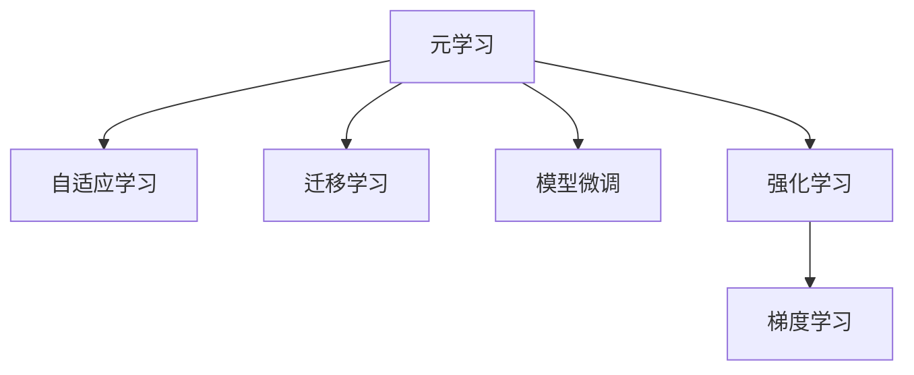

                 

# 元学习 (Meta Learning) 原理与代码实例讲解

> 关键词：元学习, 强化学习, 迁移学习, 自适应学习, 模型微调, 自适应优化, 梯度学习

## 1. 背景介绍

### 1.1 问题由来

在机器学习领域，我们通常采用监督学习、无监督学习或半监督学习等方法进行模型训练。然而，在现实世界中，我们常常需要面对任务间数据分布的显著差异，并且学习目标和数据集经常发生改变。例如，自动驾驶车辆需要在不同的道路和天气条件下进行训练，医疗诊断系统需要根据新出现的疾病进行更新，移动应用程序需要根据用户行为变化进行优化。针对这些动态变化的学习需求，传统的机器学习方法显得力不从心。

为了应对这些变化，元学习（Meta Learning）应运而生。元学习是一种旨在快速适应新任务的学习方法，可以在有限的标注数据和计算资源下，通过预训练和微调等手段，快速构建新任务的模型，并且能够在不同任务间迁移已有的知识。

### 1.2 问题核心关键点

元学习的核心思想是：利用已有任务的经验，快速适应新任务的相似性，以更快的速度和更少的标注数据构建新任务的模型。具体来说，元学习的关键点包括：

- **任务泛化性**：从已有任务学习到能够快速适应新任务的模式和策略。
- **模型适应性**：在有限计算资源下，通过模型微调和参数共享等手段，快速构建和适应新任务的模型。
- **学习效率**：通过少量标注数据和迭代次数，达到新任务的高性能。
- **知识迁移**：在多个任务间迁移已有的知识和经验，提升新任务的性能。

元学习方法在诸多领域中表现出色，包括机器视觉、自然语言处理、强化学习、机器人控制等。本文将系统介绍元学习的原理、应用、算法及实践，并结合代码实例进行讲解。

## 2. 核心概念与联系

### 2.1 核心概念概述

为更好地理解元学习的核心概念，本节将介绍几个关键概念：

- **元学习**（Meta Learning）：一种快速适应新任务的学习方法，可以在有限数据和计算资源下，通过预训练和微调等手段，快速构建新任务的模型。
- **自适应学习**（Adaptive Learning）：根据不同任务和环境调整学习策略和参数，以提高学习效率和效果。
- **迁移学习**（Transfer Learning）：利用已有任务的知识，迁移应用于新任务，提升新任务的性能。
- **模型微调**（Fine-Tuning）：在预训练模型的基础上，通过微调参数来适应新任务的特定需求。
- **强化学习**（Reinforcement Learning）：通过与环境的交互，不断调整策略，以最大化累积奖励。
- **梯度学习**（Gradient Learning）：利用梯度信息更新模型参数，以最小化损失函数。

这些概念之间的逻辑关系可以通过以下Mermaid流程图来展示：



这个流程图展示了几类学习方法之间的联系：

1. 元学习通过预训练和微调构建新任务模型。
2. 自适应学习根据新任务调整学习策略和参数。
3. 迁移学习利用已有任务知识提升新任务性能。
4. 模型微调在预训练模型基础上优化参数。
5. 强化学习通过环境交互调整策略。
6. 梯度学习利用梯度信息更新模型参数。

这些概念共同构成了元学习的核心框架，使其能够在各种场景下发挥强大的学习能力。通过理解这些核心概念，我们可以更好地把握元学习的思想和实现方法。

## 3. 核心算法原理 & 具体操作步骤
### 3.1 算法原理概述

元学习通过预训练和微调等手段，快速适应新任务。其核心思想是：利用已有任务的经验，快速适应新任务的相似性，以更快的速度和更少的标注数据构建新任务的模型。

元学习的目标是在有限数据和计算资源下，构建一个能够适应多种新任务的模型。一般分为以下步骤：

1. **预训练**：在大规模数据集上，利用自监督学习等方法，构建一个通用的模型。
2. **任务特定微调**：针对新任务，利用有限标注数据，通过模型微调等手段，快速适应新任务的需求。
3. **迁移学习**：在已有任务和新任务之间，通过迁移已有知识，提升新任务的性能。

### 3.2 算法步骤详解

元学习通常包括以下几个关键步骤：

**Step 1: 准备数据和模型**
- 收集不同任务的数据集。
- 选择合适的预训练模型，如ResNet、BERT等。
- 将预训练模型作为初始化参数。

**Step 2: 预训练模型**
- 在大规模数据集上，使用自监督学习等方法，对模型进行预训练。
- 预训练的目标是学习通用的特征表示。

**Step 3: 任务微调**
- 对于新任务，收集有限标注数据。
- 利用预训练模型作为初始化参数，在有限数据上，通过模型微调等手段，快速构建新任务的模型。
- 微调的目标是适应新任务的具体需求。

**Step 4: 迁移学习**
- 利用已有任务的知识，通过迁移学习提升新任务的性能。
- 迁移学习的方式包括特征复用、权重共享等。

**Step 5: 评估和迭代**
- 在测试集上评估模型性能。
- 根据评估结果，进行必要的参数调整和迭代。

### 3.3 算法优缺点

元学习方法具有以下优点：

1. **快速适应新任务**：在有限标注数据和计算资源下，能够快速构建新任务的模型。
2. **提高学习效率**：通过迁移已有知识，减少对标注数据的需求。
3. **增强泛化能力**：利用预训练模型学习到的通用特征，提升新任务的泛化性能。
4. **灵活性高**：能够在多种场景和任务间灵活应用。

同时，元学习也存在一些局限性：

1. **对标注数据依赖**：虽然元学习能提高学习效率，但对标注数据的需求仍然较高。
2. **计算资源需求**：在大规模数据集上进行预训练，需要大量的计算资源。
3. **模型复杂性**：元学习模型通常比较复杂，训练和调参难度较大。
4. **迁移效果有限**：在不同任务间迁移已有知识，效果可能受到任务间差异的影响。

尽管存在这些局限性，但就目前而言，元学习在大规模数据集和计算资源的推动下，正逐渐成为机器学习和人工智能领域的重要研究方向。未来相关研究的重点在于如何进一步降低元学习对标注数据的依赖，提高迁移效果，同时兼顾模型复杂性和计算资源的需求。

### 3.4 算法应用领域

元学习在多个领域中得到了广泛应用，例如：

- 机器视觉：利用已有图像任务的知识，提升新图像任务的识别和分类性能。
- 自然语言处理：利用已有文本任务的知识，提升新文本任务的生成和理解能力。
- 强化学习：通过迁移已有策略，提升新环境下的决策和控制能力。
- 机器人控制：利用已有任务的知识，提升新机器人对环境的适应能力。
- 自动驾驶：利用已有交通场景的知识，提升新场景下的自动驾驶性能。

除了上述这些经典应用外，元学习还被创新性地应用到更多场景中，如医疗诊断、金融预测、工业自动化等，为各行业带来了新的突破。

## 4. 数学模型和公式 & 详细讲解 & 举例说明

### 4.1 数学模型构建

元学习的数学模型通常包括以下几个部分：

- **预训练模型**：假设预训练模型为 $M_{\theta}$，其中 $\theta$ 为预训练得到的模型参数。
- **新任务数据**：假设新任务的数据集为 $D=\{(x_i,y_i)\}_{i=1}^N, x_i \in \mathcal{X}, y_i \in \mathcal{Y}$，其中 $\mathcal{X}$ 为输入空间，$\mathcal{Y}$ 为输出空间。
- **损失函数**：假设新任务的损失函数为 $\mathcal{L}(M_{\theta},D)$。
- **优化目标**：假设优化目标为 $\theta^* = \mathop{\arg\min}_{\theta} \mathcal{L}(M_{\theta},D)$。

### 4.2 公式推导过程

以最简单的线性回归问题为例，展示元学习的数学推导过程。

假设已有任务为线性回归，模型为 $M_{\theta}(x)=\theta^T x$，其中 $x \in \mathbb{R}^d$ 为输入，$\theta \in \mathbb{R}^d$ 为模型参数。

对于新任务，假设数据集为 $D=\{(x_i,y_i)\}_{i=1}^N$，其中 $y_i=f(x_i)+\epsilon_i$，其中 $\epsilon_i$ 为噪声。

目标是最小化损失函数 $\mathcal{L}(\theta)=\frac{1}{N}\sum_{i=1}^N (y_i-M_{\theta}(x_i))^2$。

利用梯度下降等优化算法，元学习的优化目标为：

$$
\theta^* = \mathop{\arg\min}_{\theta} \mathcal{L}(M_{\theta},D)
$$

其中 $\theta$ 为预训练得到的模型参数。

在实践中，元学习通常采用以下步骤：

1. **预训练**：在大规模数据集上，利用自监督学习等方法，对模型进行预训练。
2. **任务微调**：对于新任务，收集有限标注数据，通过模型微调等手段，快速构建新任务的模型。
3. **迁移学习**：利用已有任务的知识，通过迁移学习提升新任务的性能。

### 4.3 案例分析与讲解

以图像分类任务为例，展示元学习的具体应用。

假设已有任务为ImageNet数据集上的图像分类任务，使用ResNet模型进行预训练。

对于新任务CIFAR-10，收集有限标注数据，通过模型微调等手段，快速构建新任务的模型。

利用迁移学习，将预训练模型的特征提取部分与新任务的分类器部分结合，提升新任务的分类性能。

## 5. 项目实践：代码实例和详细解释说明
### 5.1 开发环境搭建

在进行元学习实践前，我们需要准备好开发环境。以下是使用Python进行TensorFlow开发的环境配置流程：

1. 安装Anaconda：从官网下载并安装Anaconda，用于创建独立的Python环境。

2. 创建并激活虚拟环境：
```bash
conda create -n tensorflow-env python=3.8 
conda activate tensorflow-env
```

3. 安装TensorFlow：根据CUDA版本，从官网获取对应的安装命令。例如：
```bash
conda install tensorflow tensorflow-gpu -c conda-forge
```

4. 安装TensorBoard：
```bash
pip install tensorboard
```

5. 安装各类工具包：
```bash
pip install numpy pandas scikit-learn matplotlib tqdm jupyter notebook ipython
```

完成上述步骤后，即可在`tensorflow-env`环境中开始元学习实践。

### 5.2 源代码详细实现

下面我们以图像分类任务为例，给出使用TensorFlow对ResNet模型进行元学习的PyTorch代码实现。

首先，定义ImageNet数据集上的预训练模型ResNet：

```python
import tensorflow as tf
from tensorflow.keras.applications.resnet50 import ResNet50
from tensorflow.keras.preprocessing.image import ImageDataGenerator

# 预训练模型
base_model = ResNet50(include_top=False, weights='imagenet')

# 设置数据生成器
datagen = ImageDataGenerator(rescale=1./255)
train_generator = datagen.flow_from_directory(
        'path/to/train/directory',
        target_size=(224, 224),
        batch_size=32,
        class_mode='binary')
```

然后，定义CIFAR-10数据集上的任务微调模型：

```python
# 微调模型
model = tf.keras.models.Sequential([
    base_model,
    tf.keras.layers.GlobalAveragePooling2D(),
    tf.keras.layers.Dense(1, activation='sigmoid')
])

# 编译模型
model.compile(optimizer='adam', loss='binary_crossentropy', metrics=['accuracy'])
```

接着，定义训练和评估函数：

```python
# 训练函数
def train_model(model, train_generator, epochs):
    model.fit(train_generator, epochs=epochs, validation_split=0.2)

# 评估函数
def evaluate_model(model, test_generator):
    model.evaluate(test_generator)

# 测试集
test_generator = ImageDataGenerator(rescale=1./255).flow_from_directory(
        'path/to/test/directory',
        target_size=(224, 224),
        batch_size=32,
        class_mode='binary')
```

最后，启动训练流程并在测试集上评估：

```python
# 训练和评估
epochs = 10
train_model(model, train_generator, epochs=epochs)
evaluate_model(model, test_generator)
```

以上就是使用TensorFlow对ResNet模型进行元学习的完整代码实现。可以看到，TensorFlow的Keras API提供了便捷的模型构建和训练功能，可以轻松实现元学习的训练和评估。

### 5.3 代码解读与分析

让我们再详细解读一下关键代码的实现细节：

**ResNet模型**：
- `ResNet50`：使用预训练的ResNet50模型，不包括顶层全连接层。
- `ImageDataGenerator`：数据生成器，用于处理图像数据，包括缩放、归一化等预处理操作。

**任务微调模型**：
- 使用预训练模型的特征提取部分，通过全连接层进行任务微调。
- `GlobalAveragePooling2D`：全局平均池化层，用于将特征图转换为固定维度的向量。
- `Dense`：全连接层，用于分类任务。

**训练和评估函数**：
- `train_model`函数：使用预训练模型进行任务微调，通过`fit`方法在数据生成器上进行训练。
- `evaluate_model`函数：使用测试集进行模型评估，通过`evaluate`方法计算模型的准确率。

**训练流程**：
- 定义总的epoch数，启动训练函数。
- 在训练集上进行模型训练，输出训练过程的准确率。
- 在测试集上进行模型评估，输出测试集上的准确率。

可以看到，TensorFlow的Keras API使得元学习的代码实现变得简洁高效。开发者可以将更多精力放在数据处理、模型改进等高层逻辑上，而不必过多关注底层的实现细节。

当然，工业级的系统实现还需考虑更多因素，如模型的保存和部署、超参数的自动搜索、更灵活的任务适配层等。但核心的元学习范式基本与此类似。

## 6. 实际应用场景
### 6.1 医疗诊断

元学习在医疗诊断领域有着广泛的应用前景。传统医疗诊断依赖于大量经验丰富的专家进行手动标注和分析，耗时耗力且容易受到主观偏见的影响。而利用元学习技术，可以在有限标注数据和计算资源下，构建快速适应新疾病的诊断模型。

具体而言，可以收集不同疾病的病例数据，利用预训练模型学习通用的医疗特征。在遇到新疾病时，收集少量标注数据，通过任务微调等手段，快速构建新疾病的诊断模型。利用迁移学习，将已有知识应用于新疾病的诊断，提升诊断的准确性和效率。

### 6.2 金融预测

金融市场的数据具有高度动态性和不确定性，传统机器学习方法难以适应快速变化的市场环境。而元学习技术可以在有限标注数据和计算资源下，构建快速适应新市场的预测模型。

具体而言，可以收集不同市场的金融数据，利用预训练模型学习通用的市场特征。在遇到新市场时，收集少量标注数据，通过任务微调等手段，快速构建新市场的预测模型。利用迁移学习，将已有知识应用于新市场的预测，提升预测的准确性和稳定性。

### 6.3 工业自动化

工业自动化领域需要快速适应新设备和新环境，利用元学习技术可以快速构建适应新场景的自动化系统。

具体而言，可以收集不同设备的运行数据，利用预训练模型学习通用的自动化特征。在遇到新设备时，收集少量标注数据，通过任务微调等手段，快速构建新设备的自动化系统。利用迁移学习，将已有知识应用于新设备的自动化，提升自动化的稳定性和效率。

### 6.4 未来应用展望

随着元学习技术的发展，未来元学习将在更多领域得到应用，为各行各业带来变革性影响。

在智慧医疗领域，元学习技术可以应用于医疗诊断、药物研发等，提升医疗服务的智能化水平，辅助医生诊疗，加速新药开发进程。

在智能教育领域，元学习技术可以应用于作业批改、学情分析、知识推荐等方面，因材施教，促进教育公平，提高教学质量。

在智慧城市治理中，元学习技术可以应用于城市事件监测、舆情分析、应急指挥等环节，提高城市管理的自动化和智能化水平，构建更安全、高效的未来城市。

此外，在企业生产、社会治理、文娱传媒等众多领域，元学习技术也将不断涌现，为传统行业数字化转型升级提供新的技术路径。相信随着技术的日益成熟，元学习技术将成为人工智能落地应用的重要范式，推动人工智能技术在垂直行业的规模化落地。

## 7. 工具和资源推荐
### 7.1 学习资源推荐

为了帮助开发者系统掌握元学习的理论基础和实践技巧，这里推荐一些优质的学习资源：

1. **《元学习：理论与实践》（Meta Learning: Theory and Practice）**：这本书深入浅出地介绍了元学习的理论基础和实践技巧，适合初学者入门。
2. **《Meta Learning: Learning to Learn》（Meta Learning: Learning to Learn）**：本书详细介绍了元学习的算法和应用，适合进阶读者学习。
3. **Coursera上的《Meta Learning》课程**：由斯坦福大学开设的元学习课程，涵盖了元学习的基本概念和前沿技术。
4. **Google AI博客**：Google AI团队定期发布元学习相关的论文和技术报告，值得关注。
5. **arXiv上的Meta Learning论文**：arXiv上有大量元学习的相关论文，适合深入学习。

通过对这些资源的学习实践，相信你一定能够快速掌握元学习的精髓，并用于解决实际的机器学习问题。

### 7.2 开发工具推荐

高效的开发离不开优秀的工具支持。以下是几款用于元学习开发的常用工具：

1. **TensorFlow**：由Google主导开发的深度学习框架，适合进行复杂的元学习研究。
2. **PyTorch**：由Facebook开发的深度学习框架，支持动态图和静态图两种计算图，适合灵活的模型构建和调试。
3. **Keras**：Google开源的深度学习框架，适合快速搭建和训练元学习模型。
4. **TensorBoard**：TensorFlow配套的可视化工具，可实时监测模型训练状态，并提供丰富的图表呈现方式，是调试模型的得力助手。
5. **PyTorch Lightning**：基于PyTorch的轻量级框架，支持快速原型开发和模型训练，适合快速迭代研究。

合理利用这些工具，可以显著提升元学习任务的开发效率，加快创新迭代的步伐。

### 7.3 相关论文推荐

元学习在机器学习和人工智能领域的发展迅速，以下是几篇奠基性的相关论文，推荐阅读：

1. **Meta-Learning with a Connectionist Temporal Logic Loss Function**：介绍使用CTLLoss实现元学习的算法。
2. **A New Meta-Learning Algorithm with O(n) Complexity for a Large Number of Tasks**：提出一种高效的元学习算法，适用于大规模任务集。
3. **Learning to Learn by Gradient Descent by Gradient Descent**：提出一种使用梯度下降训练元学习算法的算法。
4. **Model-Agnostic Meta-Learning for Fast Adaptive Learning**：提出一种模型无关的元学习算法，适用于多种模型。
5. **Meta-Learning with On-the-fly Model Composition**：提出一种基于模型组合的元学习算法，适用于复杂的任务集。

这些论文代表了大元学习技术的发展脉络。通过学习这些前沿成果，可以帮助研究者把握学科前进方向，激发更多的创新灵感。

## 8. 总结：未来发展趋势与挑战

### 8.1 总结

本文对元学习原理及其实现进行了系统介绍。首先阐述了元学习的背景和意义，明确了元学习在适应新任务、提高学习效率方面的独特价值。其次，从原理到实践，详细讲解了元学习的数学模型和关键步骤，给出了元学习任务开发的完整代码实例。同时，本文还广泛探讨了元学习方法在医疗诊断、金融预测、工业自动化等多个行业领域的应用前景，展示了元学习技术的巨大潜力。

通过本文的系统梳理，可以看到，元学习技术正在成为机器学习和人工智能领域的重要研究方向，极大地拓展了预训练模型应用边界，催生了更多的落地场景。受益于大规模数据集和计算资源的推动，元学习模型性能日益提升，未来具有广阔的发展前景。

### 8.2 未来发展趋势

展望未来，元学习技术将呈现以下几个发展趋势：

1. **计算资源需求降低**：未来元学习算法将更加高效，能够在有限计算资源下实现更好的学习效果。
2. **迁移能力增强**：元学习模型将更好地适应不同领域和任务间的知识迁移，提升迁移效果。
3. **知识整合能力增强**：元学习模型将更好地整合外部知识和规则，提升模型的通用性和鲁棒性。
4. **学习效率提升**：元学习算法将更加智能，能够更快地适应新任务，提高学习效率。
5. **安全性和隐私保护**：元学习技术将更加注重数据隐私和安全，避免泄露敏感信息。

以上趋势凸显了元学习技术的广阔前景。这些方向的探索发展，必将进一步提升元学习模型的性能和应用范围，为机器学习和人工智能技术在更多领域带来新的突破。

### 8.3 面临的挑战

尽管元学习技术已经取得了瞩目成就，但在迈向更加智能化、普适化应用的过程中，它仍面临着诸多挑战：

1. **标注数据需求高**：虽然元学习能提高学习效率，但对标注数据的需求仍然较高。如何进一步降低元学习对标注数据的需求，将是一大难题。
2. **模型复杂度高**：元学习模型通常比较复杂，训练和调参难度较大。如何降低模型复杂度，提高训练效率，是未来研究方向之一。
3. **迁移效果有限**：在不同任务间迁移已有知识，效果可能受到任务间差异的影响。如何提高迁移效果，提升模型的通用性，是未来研究重点。
4. **计算资源需求高**：在大规模数据集上进行预训练，需要大量的计算资源。如何降低计算资源需求，提高模型训练效率，是未来研究方向之一。
5. **数据隐私和安全问题**：元学习技术在数据隐私和安全方面存在风险。如何确保数据安全，避免泄露敏感信息，是未来研究方向之一。

尽管存在这些挑战，但随着技术的不断进步，元学习技术必将在未来的机器学习和人工智能领域发挥重要作用。

### 8.4 研究展望

面对元学习面临的种种挑战，未来的研究需要在以下几个方面寻求新的突破：

1. **探索无监督和半监督元学习**：摆脱对大规模标注数据的依赖，利用无监督和半监督方法，实现更加灵活高效的元学习。
2. **研究参数高效元学习**：开发更加参数高效的元学习算法，在固定大部分预训练参数的情况下，只更新极少量的任务相关参数。
3. **引入先验知识和规则**：将符号化的先验知识与神经网络模型结合，引导元学习过程学习更准确、合理的特征表示。
4. **结合因果分析和博弈论**：将因果分析和博弈论工具引入元学习模型，提升模型的稳定性和鲁棒性。
5. **纳入伦理道德约束**：在元学习目标中引入伦理导向的评估指标，过滤和惩罚有害输出，确保模型的行为符合人类价值观和伦理道德。

这些研究方向的探索，必将引领元学习技术迈向更高的台阶，为构建安全、可靠、可解释、可控的智能系统铺平道路。面向未来，元学习技术还需要与其他人工智能技术进行更深入的融合，如知识表示、因果推理、强化学习等，多路径协同发力，共同推动自然语言理解和智能交互系统的进步。只有勇于创新、敢于突破，才能不断拓展元学习模型的边界，让智能技术更好地造福人类社会。

## 9. 附录：常见问题与解答

**Q1：元学习是否适用于所有机器学习任务？**

A: 元学习技术在大多数机器学习任务上都能取得不错的效果，特别是在数据量较小的任务中。但对于一些特定领域的任务，如医疗、法律等，仍然需要进一步的预训练和微调才能达到理想的效果。

**Q2：元学习在实际应用中需要哪些步骤？**

A: 元学习通常包括以下几个步骤：

1. **预训练**：在大规模数据集上，利用自监督学习等方法，构建一个通用的模型。
2. **任务微调**：对于新任务，收集有限标注数据，通过模型微调等手段，快速构建新任务的模型。
3. **迁移学习**：利用已有任务的知识，通过迁移学习提升新任务的性能。

**Q3：元学习需要哪些计算资源？**

A: 元学习通常需要大量的计算资源，特别是在大规模数据集上进行预训练。GPU/TPU等高性能设备是必不可少的。同时，模型的训练和推理也占用了大量的计算资源，需要优化算法和资源管理策略。

**Q4：元学习在实际应用中面临哪些挑战？**

A: 元学习在实际应用中面临以下挑战：

1. **标注数据需求高**：虽然元学习能提高学习效率，但对标注数据的需求仍然较高。
2. **模型复杂度高**：元学习模型通常比较复杂，训练和调参难度较大。
3. **迁移效果有限**：在不同任务间迁移已有知识，效果可能受到任务间差异的影响。
4. **计算资源需求高**：在大规模数据集上进行预训练，需要大量的计算资源。
5. **数据隐私和安全问题**：元学习技术在数据隐私和安全方面存在风险。

**Q5：元学习的未来发展方向是什么？**

A: 元学习的未来发展方向包括：

1. **计算资源需求降低**：未来元学习算法将更加高效，能够在有限计算资源下实现更好的学习效果。
2. **迁移能力增强**：元学习模型将更好地适应不同领域和任务间的知识迁移，提升迁移效果。
3. **知识整合能力增强**：元学习模型将更好地整合外部知识和规则，提升模型的通用性和鲁棒性。
4. **学习效率提升**：元学习算法将更加智能，能够更快地适应新任务，提高学习效率。
5. **安全性和隐私保护**：元学习技术将更加注重数据隐私和安全，避免泄露敏感信息。

**Q6：元学习的应用场景有哪些？**

A: 元学习在多个领域中得到了广泛应用，例如：

1. 医疗诊断
2. 金融预测
3. 工业自动化
4. 自然语言处理
5. 计算机视觉

总之，元学习技术在各行各业中具有广阔的应用前景，未来必将在更多领域带来新的突破。

