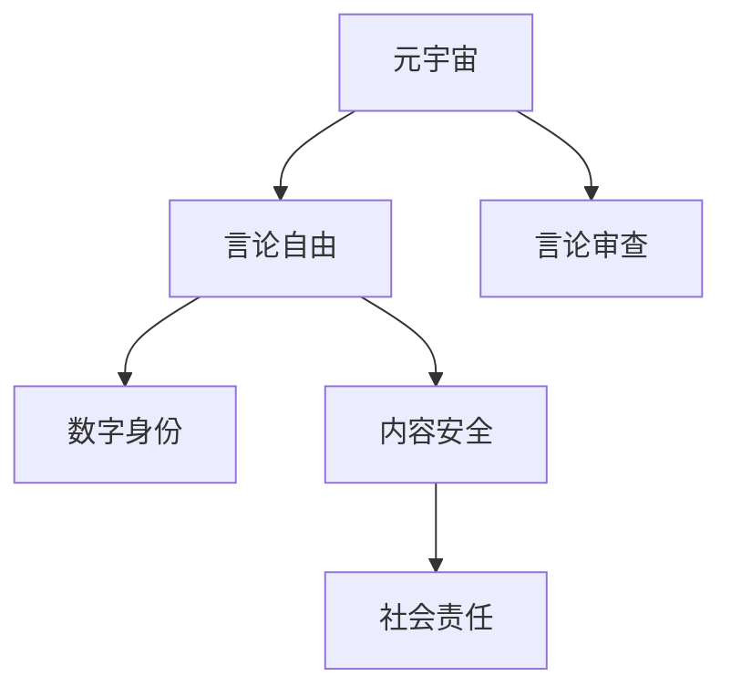

                 

# 元宇宙政治庇护:虚拟世界的言论自由保护

在元宇宙迅速发展的当下，虚拟世界在言论自由保护方面面临诸多挑战，如何构建一个自由、公正、开放的网络环境成为关注的焦点。本文旨在探讨元宇宙政治庇护的实现路径，分析虚拟世界言论自由的现状与问题，并提出相应的解决策略。

## 1. 背景介绍

### 1.1 元宇宙的兴起
随着虚拟现实技术的发展，元宇宙（Metaverse）的概念逐渐深入人心。元宇宙是一个虚拟的、互连的、共生的数字空间，用户可以在其中进行社交、工作、娱乐等活动。其潜力和未来价值吸引了众多企业的关注和投入，如Meta、Roblox、Sandbox等。

### 1.2 虚拟世界言论自由问题
虽然元宇宙为人们提供了丰富的表达自由，但也带来了新的挑战。用户可以在虚拟空间中自由交流，但如何在言论表达中避免欺诈、诽谤、暴力、仇恨等行为，保护言论自由与社交安全，是亟需解决的问题。

## 2. 核心概念与联系

### 2.1 核心概念概述

为更好地理解元宇宙言论自由保护的技术和理论基础，本节将介绍几个密切相关的核心概念：

- 元宇宙（Metaverse）：由多个数字平台互连组成，用户可以在其中自由互动的虚拟空间。
- 言论自由（Freedom of Speech）：指个人在法律允许的范围内，自由表达自己的观点和意见的权利。
- 言论审查（Speech Censorship）：指对言论内容进行限制或禁止，以维护社会秩序和安全。
- 数字身份（Digital Identity）：用户在线上的身份标识，包括虚拟角色、头像、昵称等。
- 内容安全（Content Safety）：保护用户免受有害信息、欺诈、仇恨言论等负面内容的影响。
- 社会责任（Social Responsibility）：平台需要承担的社会责任，确保言论自由的权利不被滥用，同时维护公共利益和社会安全。

这些概念之间的逻辑关系可以通过以下Mermaid流程图来展示：



这个流程图展示了点元宇宙、言论自由、言论审查、数字身份、内容安全以及社会责任这些核心概念及其之间的关系：

1. 元宇宙提供了一个自由交流的环境，用户可以在其中自由表达。
2. 言论自由在元宇宙中得以体现，用户有权发表自己的观点。
3. 言论审查在元宇宙中可能存在，用于防止有害信息的传播。
4. 数字身份标识用户的虚拟存在，保障言论自由的同时保护用户隐私。
5. 内容安全保护用户免受负面内容的侵害，保障交流的安全性。
6. 社会责任要求平台在保护言论自由的同时，还需维护社会秩序和公共利益。

## 3. 核心算法原理 & 具体操作步骤
### 3.1 算法原理概述

元宇宙言论自由的保护，可以通过算法和政策相结合的方式进行。算法的核心思想是利用机器学习和大数据分析技术，对用户言论进行智能审查，过滤有害信息，同时保护用户言论自由。

具体而言，算法可以包括以下几个关键步骤：

1. 数据收集与预处理：收集用户言论数据，进行清洗和标注，分为正面、负面、中性等类别。
2. 特征提取与模型训练：提取用户言论的关键词、情感倾向等特征，训练机器学习模型（如BERT、GPT等）。
3. 智能审查与分类：对用户输入的言论进行自动分类，判断是否含有违法违规内容。
4. 动态调整与反馈：根据用户反馈和最新数据，动态调整算法参数，提升审查效果。

### 3.2 算法步骤详解

**Step 1: 数据收集与预处理**

收集元宇宙平台上的用户言论数据，并进行预处理。具体包括：

- 数据清洗：去除无关数据、噪声数据，保证数据质量。
- 数据标注：对数据进行人工标注，分为正面、负面、中性等类别。
- 数据划分：将数据划分为训练集、验证集和测试集。

**Step 2: 特征提取与模型训练**

特征提取是算法的重要步骤，提取用户言论中的关键词、情感倾向、语义关系等特征。具体步骤如下：

- 分词与向量化：使用自然语言处理技术，将文本转化为向量形式。
- 特征选择：选择对分类效果影响较大的特征，如TF-IDF、词嵌入等。
- 模型训练：使用训练集数据，训练机器学习模型。常见的模型包括决策树、支持向量机、深度学习模型（如BERT、GPT）等。

**Step 3: 智能审查与分类**

智能审查是算法实现的核心，通过模型对用户输入的言论进行分类，判断是否含有违法违规内容。具体步骤如下：

- 输入预处理：将用户言论输入到预处理模块，进行分词、去停用词等操作。
- 特征提取：提取用户言论的关键词、情感倾向等特征。
- 模型预测：将提取的特征输入到训练好的模型，输出预测结果。

**Step 4: 动态调整与反馈**

动态调整和用户反馈是算法优化的重要环节，确保算法的准确性和实时性。具体步骤如下：

- 模型调优：根据模型预测结果和实际标注结果，调整模型参数。
- 用户反馈：收集用户对言论审查的反馈，进行人工复审和标注。
- 持续学习：根据用户反馈和最新数据，不断更新模型，提升审查效果。

### 3.3 算法优缺点

基于机器学习的言论自由保护算法具有以下优点：

1. 高效性：自动化的审查过程，可以显著提升审查效率，减少人工审查工作量。
2. 实时性：实时监测用户言论，快速响应有害内容，保障交流安全。
3. 可扩展性：可以处理大规模用户数据，适应不同规模和类型的元宇宙平台。

同时，该算法也存在一些局限性：

1. 数据依赖性：算法效果依赖于数据质量，标注数据不足或标注偏差可能导致模型性能下降。
2. 鲁棒性不足：对抗性攻击（如词形变换、同义词替换等）可能导致模型误判。
3. 过度审查：过于严格的审查可能导致言论自由的侵犯，限制用户表达自由。

### 3.4 算法应用领域

基于机器学习的言论自由保护算法，已经在多个领域得到了广泛应用，如社交网络、在线论坛、即时通讯等。

- 社交网络：如Facebook、Twitter等，通过智能审查技术，保护用户免受暴力、仇恨言论等负面内容的影响。
- 在线论坛：如Reddit、Discord等，通过自动审核，维护论坛秩序，防止恶意攻击和有害内容传播。
- 即时通讯：如WhatsApp、微信等，通过智能分析，保护用户免受欺诈、诈骗等负面信息的影响。

这些应用领域展示了基于机器学习的言论自由保护算法的强大应用潜力，未来还有更多新的应用场景值得探索。

## 4. 数学模型和公式 & 详细讲解  
### 4.1 数学模型构建

本节将使用数学语言对元宇宙言论自由保护的技术和理论基础进行更加严格的刻画。

记用户言论数据集为 $D=\{(x_i,y_i)\}_{i=1}^N, x_i \in \mathcal{X}, y_i \in \{0,1\}$，其中 $y_i=1$ 表示言论含有有害信息，否则 $y_i=0$。

定义特征提取函数 $f(x)$ 将用户言论 $x$ 转化为向量 $f(x) \in \mathcal{F}$，其中 $\mathcal{F}$ 为特征空间。

定义机器学习模型 $M:\mathcal{F} \rightarrow \{0,1\}$，用于对用户言论进行分类。

元宇宙言论自由的保护可以形式化为如下优化问题：

$$
\min_{M} \mathcal{L}(M) = \frac{1}{N} \sum_{i=1}^N [y_i\log M(f(x_i)) + (1-y_i)\log (1-M(f(x_i)))
$$

其中 $\mathcal{L}(M)$ 为损失函数，表示模型预测结果与实际标签之间的差异。

### 4.2 公式推导过程

以下我们以二分类任务为例，推导交叉熵损失函数及其梯度的计算公式。

假设模型 $M$ 在特征 $f(x)$ 上的预测结果为 $M(f(x))$，真实标签为 $y_i \in \{0,1\}$。则二分类交叉熵损失函数定义为：

$$
\ell(M(f(x)),y_i) = -[y_i\log M(f(x)) + (1-y_i)\log (1-M(f(x)))
$$

将其代入损失函数公式，得：

$$
\mathcal{L}(M) = -\frac{1}{N}\sum_{i=1}^N [y_i\log M(f(x_i))+ (1-y_i)\log(1-M(f(x_i)))
$$

根据链式法则，损失函数对模型参数 $w$ 的梯度为：

$$
\frac{\partial \mathcal{L}(M)}{\partial w} = \frac{\partial}{\partial w}\frac{1}{N}\sum_{i=1}^N [y_i\log M(f(x_i)) + (1-y_i)\log(1-M(f(x_i)))
$$

其中 $M(f(x_i)) = \sigma(Wf(x_i) + b)$，$\sigma$ 为激活函数，$W$ 为模型参数。

具体而言，梯度计算公式如下：

$$
\frac{\partial \mathcal{L}(M)}{\partial W} = \frac{1}{N}\sum_{i=1}^N \nabla_{W}M(f(x_i))
$$

$$
\nabla_{W}M(f(x_i)) = M(f(x_i))(1-M(f(x_i)))\nabla_{W}f(x_i)
$$

在得到损失函数的梯度后，即可带入参数更新公式，完成模型的迭代优化。重复上述过程直至收敛，最终得到适应元宇宙言论自由保护的最优模型 $M^*$。

## 5. 项目实践：代码实例和详细解释说明
### 5.1 开发环境搭建

在进行元宇宙言论自由保护实践前，我们需要准备好开发环境。以下是使用Python进行PyTorch开发的环境配置流程：

1. 安装Anaconda：从官网下载并安装Anaconda，用于创建独立的Python环境。

2. 创建并激活虚拟环境：
```bash
conda create -n pytorch-env python=3.8 
conda activate pytorch-env
```

3. 安装PyTorch：根据CUDA版本，从官网获取对应的安装命令。例如：
```bash
conda install pytorch torchvision torchaudio cudatoolkit=11.1 -c pytorch -c conda-forge
```

4. 安装Natural Language Toolkit (NLTK)：
```bash
pip install nltk
```

5. 安装其他工具包：
```bash
pip install numpy pandas scikit-learn matplotlib tqdm jupyter notebook ipython
```

完成上述步骤后，即可在`pytorch-env`环境中开始元宇宙言论自由保护的实践。

### 5.2 源代码详细实现

下面我们以元宇宙平台上的用户言论审查为例，给出使用Transformers库进行智能审查的PyTorch代码实现。

首先，定义数据处理函数：

```python
from transformers import BertTokenizer
from torch.utils.data import Dataset
import torch

class SpeechReviewDataset(Dataset):
    def __init__(self, texts, labels, tokenizer, max_len=128):
        self.texts = texts
        self.labels = labels
        self.tokenizer = tokenizer
        self.max_len = max_len
        
    def __len__(self):
        return len(self.texts)
    
    def __getitem__(self, item):
        text = self.texts[item]
        label = self.labels[item]
        
        encoding = self.tokenizer(text, return_tensors='pt', max_length=self.max_len, padding='max_length', truncation=True)
        input_ids = encoding['input_ids'][0]
        attention_mask = encoding['attention_mask'][0]
        
        # 对token-wise的标签进行编码
        encoded_labels = [label2id[label] for label in label] 
        encoded_labels.extend([label2id['O']] * (self.max_len - len(encoded_labels)))
        labels = torch.tensor(encoded_labels, dtype=torch.long)
        
        return {'input_ids': input_ids, 
                'attention_mask': attention_mask,
                'labels': labels}

# 标签与id的映射
label2id = {'O': 0, 'HATE': 1, 'FRAUD': 2, 'VIOLENCE': 3}
id2label = {v: k for k, v in label2id.items()}

# 创建dataset
tokenizer = BertTokenizer.from_pretrained('bert-base-cased')

train_dataset = SpeechReviewDataset(train_texts, train_labels, tokenizer)
dev_dataset = SpeechReviewDataset(dev_texts, dev_labels, tokenizer)
test_dataset = SpeechReviewDataset(test_texts, test_labels, tokenizer)
```

然后，定义模型和优化器：

```python
from transformers import BertForTokenClassification, AdamW

model = BertForTokenClassification.from_pretrained('bert-base-cased', num_labels=len(label2id))

optimizer = AdamW(model.parameters(), lr=2e-5)
```

接着，定义训练和评估函数：

```python
from torch.utils.data import DataLoader
from tqdm import tqdm
from sklearn.metrics import classification_report

device = torch.device('cuda') if torch.cuda.is_available() else torch.device('cpu')
model.to(device)

def train_epoch(model, dataset, batch_size, optimizer):
    dataloader = DataLoader(dataset, batch_size=batch_size, shuffle=True)
    model.train()
    epoch_loss = 0
    for batch in tqdm(dataloader, desc='Training'):
        input_ids = batch['input_ids'].to(device)
        attention_mask = batch['attention_mask'].to(device)
        labels = batch['labels'].to(device)
        model.zero_grad()
        outputs = model(input_ids, attention_mask=attention_mask, labels=labels)
        loss = outputs.loss
        epoch_loss += loss.item()
        loss.backward()
        optimizer.step()
    return epoch_loss / len(dataloader)

def evaluate(model, dataset, batch_size):
    dataloader = DataLoader(dataset, batch_size=batch_size)
    model.eval()
    preds, labels = [], []
    with torch.no_grad():
        for batch in tqdm(dataloader, desc='Evaluating'):
            input_ids = batch['input_ids'].to(device)
            attention_mask = batch['attention_mask'].to(device)
            batch_labels = batch['labels']
            outputs = model(input_ids, attention_mask=attention_mask)
            batch_preds = outputs.logits.argmax(dim=2).to('cpu').tolist()
            batch_labels = batch_labels.to('cpu').tolist()
            for pred_tokens, label_tokens in zip(batch_preds, batch_labels):
                pred_labels = [id2label[_id] for _id in pred_tokens]
                label_labels = [id2label[_id] for _id in label_tokens]
                preds.append(pred_labels[:len(label_labels)])
                labels.append(label_labels)
                
    print(classification_report(labels, preds))
```

最后，启动训练流程并在测试集上评估：

```python
epochs = 5
batch_size = 16

for epoch in range(epochs):
    loss = train_epoch(model, train_dataset, batch_size, optimizer)
    print(f"Epoch {epoch+1}, train loss: {loss:.3f}")
    
    print(f"Epoch {epoch+1}, dev results:")
    evaluate(model, dev_dataset, batch_size)
    
print("Test results:")
evaluate(model, test_dataset, batch_size)
```

以上就是使用PyTorch对元宇宙用户言论审查的完整代码实现。可以看到，借助Transformers库，模型的加载和微调变得相对简洁高效。

### 5.3 代码解读与分析

让我们再详细解读一下关键代码的实现细节：

**SpeechReviewDataset类**：
- `__init__`方法：初始化文本、标签、分词器等关键组件。
- `__len__`方法：返回数据集的样本数量。
- `__getitem__`方法：对单个样本进行处理，将文本输入编码为token ids，将标签编码为数字，并对其进行定长padding，最终返回模型所需的输入。

**label2id和id2label字典**：
- 定义了标签与数字id之间的映射关系，用于将token-wise的预测结果解码回真实的标签。

**训练和评估函数**：
- 使用PyTorch的DataLoader对数据集进行批次化加载，供模型训练和推理使用。
- 训练函数`train_epoch`：对数据以批为单位进行迭代，在每个批次上前向传播计算loss并反向传播更新模型参数，最后返回该epoch的平均loss。
- 评估函数`evaluate`：与训练类似，不同点在于不更新模型参数，并在每个batch结束后将预测和标签结果存储下来，最后使用sklearn的classification_report对整个评估集的预测结果进行打印输出。

**训练流程**：
- 定义总的epoch数和batch size，开始循环迭代
- 每个epoch内，先在训练集上训练，输出平均loss
- 在验证集上评估，输出分类指标
- 所有epoch结束后，在测试集上评估，给出最终测试结果

可以看到，PyTorch配合Transformers库使得元宇宙用户言论审查的代码实现变得简洁高效。开发者可以将更多精力放在数据处理、模型改进等高层逻辑上，而不必过多关注底层的实现细节。

当然，工业级的系统实现还需考虑更多因素，如模型的保存和部署、超参数的自动搜索、更灵活的任务适配层等。但核心的元宇宙言论自由保护算法基本与此类似。

## 6. 实际应用场景
### 6.1 智能客服系统

元宇宙中的智能客服系统可以通过用户言论审查，保护客户免受恶意攻击和有害内容的侵害。智能客服模型可以对用户输入的文本进行分析，自动分类并屏蔽暴力、仇恨等负面内容，从而提升服务质量。

具体实现如下：

- 收集用户输入的客服请求，进行预处理和特征提取。
- 使用训练好的元宇宙用户言论审查模型对文本进行分类，判断是否含有有害内容。
- 根据分类结果，自动屏蔽或提醒人工客服处理有害内容，确保交流安全。

### 6.2 在线论坛

在线论坛是元宇宙用户言论自由的重要场所。论坛管理员可以通过用户言论审查，维护论坛秩序，防止恶意攻击和有害内容传播。

具体实现如下：

- 收集论坛用户发言，进行预处理和特征提取。
- 使用训练好的元宇宙用户言论审查模型对文本进行分类，判断是否含有有害内容。
- 根据分类结果，自动删除或提醒管理员处理有害内容，维护论坛秩序。

### 6.3 虚拟课堂

虚拟课堂是元宇宙中重要的教育平台，学生和教师可以在虚拟空间中进行互动和交流。教师可以通过用户言论审查，保护学生免受欺凌、暴力等负面内容的侵害，营造良好的学习环境。

具体实现如下：

- 收集虚拟课堂中的学生发言，进行预处理和特征提取。
- 使用训练好的元宇宙用户言论审查模型对文本进行分类，判断是否含有有害内容。
- 根据分类结果，自动屏蔽或提醒教师处理有害内容，确保课堂秩序。

## 7. 工具和资源推荐
### 7.1 学习资源推荐

为了帮助开发者系统掌握元宇宙用户言论审查的理论基础和实践技巧，这里推荐一些优质的学习资源：

1. 《自然语言处理基础》系列博文：由大模型技术专家撰写，深入浅出地介绍了自然语言处理的基本概念和经典模型。

2. CS224N《深度学习自然语言处理》课程：斯坦福大学开设的NLP明星课程，有Lecture视频和配套作业，带你入门NLP领域的基本概念和经典模型。

3. 《Transformer从原理到实践》书籍：Transformers库的作者所著，全面介绍了Transformer原理、BERT模型、微调技术等前沿话题。

4. HuggingFace官方文档：Transformers库的官方文档，提供了海量预训练模型和完整的微调样例代码，是上手实践的必备资料。

5. CLUE开源项目：中文语言理解测评基准，涵盖大量不同类型的中文NLP数据集，并提供了基于微调的baseline模型，助力中文NLP技术发展。

通过对这些资源的学习实践，相信你一定能够快速掌握元宇宙用户言论审查的精髓，并用于解决实际的NLP问题。

### 7.2 开发工具推荐

高效的开发离不开优秀的工具支持。以下是几款用于元宇宙用户言论审查开发的常用工具：

1. PyTorch：基于Python的开源深度学习框架，灵活动态的计算图，适合快速迭代研究。大部分预训练语言模型都有PyTorch版本的实现。

2. TensorFlow：由Google主导开发的开源深度学习框架，生产部署方便，适合大规模工程应用。同样有丰富的预训练语言模型资源。

3. Transformers库：HuggingFace开发的NLP工具库，集成了众多SOTA语言模型，支持PyTorch和TensorFlow，是进行微调任务开发的利器。

4. Weights & Biases：模型训练的实验跟踪工具，可以记录和可视化模型训练过程中的各项指标，方便对比和调优。与主流深度学习框架无缝集成。

5. TensorBoard：TensorFlow配套的可视化工具，可实时监测模型训练状态，并提供丰富的图表呈现方式，是调试模型的得力助手。

6. Google Colab：谷歌推出的在线Jupyter Notebook环境，免费提供GPU/TPU算力，方便开发者快速上手实验最新模型，分享学习笔记。

合理利用这些工具，可以显著提升元宇宙用户言论审查的开发效率，加快创新迭代的步伐。

### 7.3 相关论文推荐

元宇宙用户言论审查技术的发展源于学界的持续研究。以下是几篇奠基性的相关论文，推荐阅读：

1. Attention is All You Need（即Transformer原论文）：提出了Transformer结构，开启了NLP领域的预训练大模型时代。

2. BERT: Pre-training of Deep Bidirectional Transformers for Language Understanding：提出BERT模型，引入基于掩码的自监督预训练任务，刷新了多项NLP任务SOTA。

3. Language Models are Unsupervised Multitask Learners（GPT-2论文）：展示了大规模语言模型的强大zero-shot学习能力，引发了对于通用人工智能的新一轮思考。

4. Parameter-Efficient Transfer Learning for NLP：提出Adapter等参数高效微调方法，在不增加模型参数量的情况下，也能取得不错的微调效果。

5. Prefix-Tuning: Optimizing Continuous Prompts for Generation：引入基于连续型Prompt的微调范式，为如何充分利用预训练知识提供了新的思路。

6. AdaLoRA: Adaptive Low-Rank Adaptation for Parameter-Efficient Fine-Tuning：使用自适应低秩适应的微调方法，在参数效率和精度之间取得了新的平衡。

这些论文代表了大语言模型微调技术的发展脉络。通过学习这些前沿成果，可以帮助研究者把握学科前进方向，激发更多的创新灵感。

## 8. 总结：未来发展趋势与挑战
### 8.1 总结

本文对元宇宙用户言论自由保护的技术和理论基础进行了全面系统的介绍。首先阐述了元宇宙用户言论自由保护的背景和意义，明确了智能审查在元宇宙言论自由保护中的重要地位。其次，从原理到实践，详细讲解了智能审查的数学模型和关键步骤，给出了用户言论审查的完整代码实例。同时，本文还广泛探讨了智能审查在元宇宙平台中的应用场景，展示了智能审查的强大应用潜力。此外，本文精选了智能审查技术的各类学习资源，力求为读者提供全方位的技术指引。

通过本文的系统梳理，可以看到，元宇宙用户言论自由保护技术正在成为元宇宙平台的重要组成部分，极大地提升了平台的用户体验和安全水平。智能审查算法为元宇宙平台提供了高效、实时、可靠的言论过滤手段，使得用户在元宇宙中能够自由交流，同时保障了平台秩序和用户安全。未来，随着智能审查技术的不断演进，元宇宙平台的言论自由保护将进入新阶段，为用户提供更加安全、开放、自由的网络环境。

### 8.2 未来发展趋势

展望未来，元宇宙用户言论自由保护技术将呈现以下几个发展趋势：

1. 算法复杂性提升。随着数据规模和任务复杂性的增加，智能审查算法将需要更复杂的模型和更高效的计算方法。深度学习、图神经网络等技术将被广泛应用。

2. 模型参数化增强。为了提升审查效果，智能审查模型将使用更大的模型参数，例如GPT-3、BERT等大模型，以处理更多样化的数据和任务。

3. 数据增强与迁移学习。为了提升算法的泛化能力，将使用更多的数据增强和迁移学习技术，使得智能审查模型能够更好地应对新的数据和任务。

4. 多方协作与数据融合。为了提升审查效果，智能审查模型将结合多模态数据和多方协作，例如结合图像、视频等数据，实现更为全面和准确的审查。

5. 隐私保护与安全防护。为了保护用户隐私和数据安全，智能审查模型将引入隐私保护技术和安全防护机制，例如差分隐私、联邦学习等。

6. 伦理与社会责任。为了维护社会公正和伦理规范，智能审查模型将引入伦理导向的评估指标和责任机制，例如引入社会责任评估指标，避免对特定群体的歧视。

这些趋势将推动元宇宙用户言论自由保护技术的不断进步，使得元宇宙平台能够更好地保障用户的言论自由，同时维护平台秩序和用户安全。

### 8.3 面临的挑战

尽管元宇宙用户言论自由保护技术已经取得了不小的进展，但在迈向更加智能化、普适化应用的过程中，它仍面临诸多挑战：

1. 算法鲁棒性不足。智能审查算法可能对对抗性攻击（如词形变换、同义词替换等）失去效果，导致误判。

2. 数据隐私问题。智能审查算法需要大量用户数据进行训练，存在隐私泄露的风险。

3. 算法偏见问题。智能审查算法可能存在偏见，对特定群体进行不公正的审查。

4. 模型可解释性不足。智能审查算法通常是黑盒模型，难以解释其内部工作机制和决策逻辑。

5. 法律合规问题。智能审查算法需要遵守当地法律法规，例如欧盟的GDPR等，确保用户隐私保护。

6. 技术与伦理的平衡。如何在保护言论自由的同时，防止有害内容的传播，是一个亟需解决的问题。

### 8.4 研究展望

面对元宇宙用户言论自由保护所面临的种种挑战，未来的研究需要在以下几个方面寻求新的突破：

1. 提升算法鲁棒性。研究更为强大的对抗性攻击检测算法，提升智能审查模型的鲁棒性。

2. 改进隐私保护技术。研究差分隐私、联邦学习等隐私保护技术，保护用户隐私。

3. 消除算法偏见。研究算法偏见检测和修正方法，确保智能审查模型对所有群体的公平性。

4. 增强模型可解释性。研究可解释的智能审查模型，确保审查过程的透明性和可解释性。

5. 探索法律合规机制。研究符合当地法律法规的智能审查算法，确保用户隐私保护和法律合规。

这些研究方向的探索，将引领元宇宙用户言论自由保护技术迈向更高的台阶，为元宇宙平台提供更为智能、公正、安全的言论环境。

## 9. 附录：常见问题与解答

**Q1：元宇宙言论自由保护技术如何应对对抗性攻击？**

A: 对抗性攻击是指通过词形变换、同义词替换等手段，使智能审查模型无法正确识别有害内容。为了应对对抗性攻击，可以采取以下策略：

1. 使用对抗性训练。在训练过程中，加入对抗性样本，提升模型对对抗性攻击的鲁棒性。

2. 引入语言模型训练。在模型训练过程中，加入语言模型训练，提升模型对自然语言的理解能力，避免对抗性攻击。

3. 使用多模型融合。使用多个智能审查模型，结合各自的优点，提升整体鲁棒性。

4. 引入人工复审。在智能审查模型的基础上，结合人工复审，确保审查的准确性和公正性。

**Q2：智能审查算法如何平衡言论自由和平台秩序？**

A: 智能审查算法需要在保护言论自由和维护平台秩序之间找到平衡。具体策略如下：

1. 设定严格的审查标准。制定明确的平台规则，确保审查标准的一致性和公正性。

2. 引入人工复审。在智能审查模型的基础上，结合人工复审，确保审查的准确性和公正性。

3. 引入用户反馈。允许用户对审查结果进行反馈，结合用户反馈进行优化。

4. 引入算法透明性。确保智能审查算法的透明性和可解释性，让用户了解审查过程。

**Q3：智能审查算法如何保护用户隐私？**

A: 智能审查算法需要保护用户隐私，具体策略如下：

1. 使用差分隐私技术。在训练过程中，加入差分隐私技术，保护用户隐私。

2. 使用联邦学习技术。在模型训练过程中，使用联邦学习技术，保护用户数据隐私。

3. 使用匿名化技术。在数据预处理过程中，使用匿名化技术，保护用户隐私。

4. 使用数据加密技术。在数据存储和传输过程中，使用数据加密技术，保护用户隐私。

**Q4：智能审查算法如何避免算法偏见？**

A: 智能审查算法需要避免算法偏见，具体策略如下：

1. 使用数据增强技术。在训练过程中，使用多样化的数据增强技术，减少算法偏见。

2. 引入公平性评估指标。在评估过程中，引入公平性评估指标，确保算法对所有群体的公正性。

3. 引入算法偏见检测技术。在算法设计过程中，引入算法偏见检测技术，及时发现和纠正算法偏见。

4. 引入人工复审。在智能审查模型的基础上，结合人工复审，确保审查的公正性和透明性。

**Q5：智能审查算法如何确保审查过程的透明性和可解释性？**

A: 智能审查算法需要确保审查过程的透明性和可解释性，具体策略如下：

1. 使用可解释模型。在模型设计过程中，使用可解释的模型，确保审查过程的透明性和可解释性。

2. 引入算法透明性技术。在算法设计过程中，引入算法透明性技术，确保审查过程的透明性和可解释性。

3. 引入人工复审。在智能审查模型的基础上，结合人工复审，确保审查过程的透明性和可解释性。

**Q6：智能审查算法如何应对用户反馈？**

A: 智能审查算法需要应对用户反馈，具体策略如下：

1. 引入用户反馈机制。在智能审查模型的基础上，引入用户反馈机制，及时发现和解决问题。

2. 结合用户反馈进行优化。在算法优化过程中，结合用户反馈进行优化，提升审查效果。

3. 引入人工复审。在智能审查模型的基础上，结合人工复审，确保审查的公正性和透明性。

4. 引入算法透明性技术。在算法设计过程中，引入算法透明性技术，确保审查过程的透明性和可解释性。

---

作者：禅与计算机程序设计艺术 / Zen and the Art of Computer Programming

