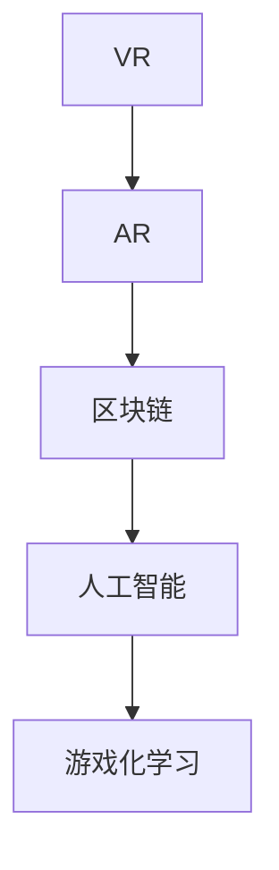

                 

## 1. 背景介绍

### 1.1 问题由来

随着互联网技术的飞速发展和普及，在线教育已逐渐成为主流教育形式之一。但传统在线教育依然存在诸多问题：学生自主学习能力不强，学习效果参差不齐；课堂互动性不足，学习体验感较差；课程资源相对单一，难以满足个性化学习需求。而元宇宙教育生态的构建，有望解决这些痛点，打造一个沉浸式、个性化、互动性强的在线教育平台。

### 1.2 问题核心关键点

元宇宙教育生态的核心关键点包括：

- **虚拟现实(VR)**: 通过沉浸式的VR体验，提升学习者的空间感知和互动性。
- **增强现实(AR)**: 通过AR技术将虚拟信息融合到现实世界中，增强教学内容的互动性。
- **区块链(BS)**: 通过区块链技术保障学习数据的透明性和安全性，确保学习过程的公平公正。
- **人工智能(AI)**: 通过AI技术提供个性化学习推荐，提升学习效果。
- **游戏化学习(Game-based Learning)**: 通过游戏元素增强学习动机，提高学习效率。

这些关键技术共同构建了元宇宙教育生态，旨在创造一个高度交互、个性化、安全的学习环境，为个性化学习提供了无限可能。

### 1.3 问题研究意义

元宇宙教育生态的构建，将教育从传统的线下转变为线上线下融合的新模式，为个性化学习开辟了新的道路。其主要意义包括：

1. **增强学习体验**: 通过VR、AR等技术，提供沉浸式的学习环境，提升学习者的参与感和体验感。
2. **提升学习效率**: 利用游戏化学习、AI推荐等技术，提高学习动机和效率，使学习过程更加高效。
3. **保障学习数据安全**: 通过区块链技术，保障学习数据的安全透明，确保学习过程的公平公正。
4. **实现个性化学习**: 利用AI技术，根据学习者的学习习惯、知识水平、兴趣偏好等，提供个性化的学习推荐和教学内容，满足不同学习者的需求。

## 2. 核心概念与联系

### 2.1 核心概念概述

为更好地理解元宇宙教育生态的构建原理，本节将介绍几个关键概念：

- **虚拟现实(VR)**: 通过虚拟现实技术，为学习者提供一个沉浸式的学习环境，使学习者仿佛置身于真实世界中。

- **增强现实(AR)**: 利用增强现实技术，将虚拟信息叠加到现实世界中，丰富教学内容的呈现形式。

- **区块链(BS)**: 通过分布式账本技术，记录学习过程中的每一个动作，保障学习数据的透明性和安全性。

- **人工智能(AI)**: 利用AI技术，根据学习者的行为数据，提供个性化的学习推荐和教学内容。

- **游戏化学习(Game-based Learning)**: 通过游戏化元素，增强学习动机，提高学习效率。

这些概念之间存在紧密联系，共同构成了元宇宙教育生态的基础。

### 2.2 核心概念原理和架构的 Mermaid 流程图



该流程图展示了元宇宙教育生态的构建逻辑：

1. 通过VR技术，为学习者提供沉浸式学习环境。
2. 利用AR技术，将虚拟信息叠加到现实世界，丰富教学内容。
3. 通过区块链技术，保障学习数据的安全透明。
4. 利用AI技术，提供个性化的学习推荐和教学内容。
5. 通过游戏化学习，增强学习动机，提高学习效率。

## 3. 核心算法原理 & 具体操作步骤

### 3.1 算法原理概述

元宇宙教育生态的核心算法原理，基于VR、AR、区块链、AI、游戏化学习等多项技术的融合。

- **VR算法**: 利用计算机图形学、人体动作捕捉等技术，创建逼真的虚拟场景。
- **AR算法**: 结合图像识别、空间定位等技术，将虚拟信息精确叠加到现实世界中。
- **区块链算法**: 采用分布式账本和加密技术，记录学习行为和数据，保障其透明性和安全性。
- **AI算法**: 应用机器学习、深度学习等技术，根据学习者行为数据，提供个性化学习推荐。
- **游戏化学习算法**: 融合游戏设计、心理学等知识，增强学习动机和互动性。

### 3.2 算法步骤详解

**Step 1: 数据采集**

- **VR和AR数据**: 利用摄像头、传感器等设备，采集学习者的空间位置和动作数据。
- **区块链数据**: 通过分布式账本记录学习者的行为数据，保障数据的透明性和安全性。
- **AI数据**: 利用学习者行为数据，训练AI模型，提供个性化学习推荐。

**Step 2: 数据处理**

- **VR和AR数据处理**: 通过图像处理和动作捕捉技术，将学习者的动作和空间位置映射到虚拟场景中。
- **区块链数据处理**: 将学习者的行为数据加密存储在区块链上，保障其隐私性和安全性。
- **AI数据处理**: 应用机器学习算法，训练AI模型，生成个性化学习推荐。

**Step 3: 数据展示**

- **VR和AR数据展示**: 通过头显、手柄等VR/AR设备，将虚拟信息和现实世界融合，为学习者提供沉浸式学习体验。
- **区块链数据展示**: 通过区块链浏览器，记录和展示学习者的行为数据，保障其透明性和可追溯性。
- **AI数据展示**: 通过个性化推荐系统，为学习者提供匹配的学习内容和教学资源，提升学习效率。

### 3.3 算法优缺点

**优点**：

- **沉浸式学习体验**: VR和AR技术提供沉浸式学习环境，提高学习者的参与感和体验感。
- **个性化学习推荐**: AI技术根据学习者的行为数据，提供个性化的学习推荐，提升学习效率。
- **安全透明的学习数据**: 区块链技术保障学习数据的透明性和安全性，确保学习过程的公平公正。
- **高效互动学习**: 游戏化学习元素，增强学习动机和互动性，提高学习效率。

**缺点**：

- **技术门槛较高**: 构建元宇宙教育生态需要高技术门槛，设备成本较高，对技术要求高。
- **资源占用较大**: 大规模应用VR/AR技术，对硬件设备的要求较高，资源占用较大。
- **学习数据隐私**: 学习者数据存储在区块链上，可能面临隐私泄露的风险。
- **互动性不足**: 传统的学习模式可能难以完全转化成互动式学习，需要更多创新。

### 3.4 算法应用领域

元宇宙教育生态主要应用于以下几个领域：

- **在线教育平台**: 利用VR/AR技术，提供沉浸式学习环境，提升在线教育效果。
- **虚拟实验室**: 利用VR技术，模拟真实实验场景，为学生提供实验操作机会。
- **远程协作学习**: 利用AR技术，在虚拟环境中进行协作学习，提升学习互动性。
- **教育游戏**: 利用游戏化学习元素，提升学习动机和参与感，提高学习效率。

## 4. 数学模型和公式 & 详细讲解 & 举例说明

### 4.1 数学模型构建

本节将使用数学语言对元宇宙教育生态的核心算法进行更加严格的刻画。

**VR数据模型**:
- 输入: 学习者空间位置和动作数据 $(x, y, z, t)$。
- 输出: 虚拟场景中的位置和动作 $(x', y', z', t')$。
- 数学模型: $(x', y', z', t') = f(x, y, z, t)$。

**AR数据模型**:
- 输入: 现实世界的图像 $I$ 和虚拟信息 $V$。
- 输出: 叠加虚拟信息后的图像 $I'$。
- 数学模型: $I' = g(I, V)$。

**区块链数据模型**:
- 输入: 学习者行为数据 $D$。
- 输出: 区块链上的行为记录 $R$。
- 数学模型: $R = h(D)$。

**AI数据模型**:
- 输入: 学习者行为数据 $D$。
- 输出: 个性化推荐结果 $R'$。
- 数学模型: $R' = k(D)$。

**游戏化学习数据模型**:
- 输入: 学习者行为数据 $D$。
- 输出: 游戏化学习参数 $P$。
- 数学模型: $P = l(D)$。

### 4.2 公式推导过程

以VR算法为例，展示其数学推导过程：

- **输入表示**: 学习者的空间位置和动作数据 $(x, y, z, t)$。
- **输出表示**: 虚拟场景中的位置和动作 $(x', y', z', t')$。
- **数学模型**: $(x', y', z', t') = f(x, y, z, t)$。

假设学习者的空间位置为 $(x, y, z)$，动作时间为 $t$，则其对应的虚拟场景中的位置和动作可以通过以下公式计算：

$$
\begin{align*}
x' &= f_x(x, y, z, t) \\
y' &= f_y(x, y, z, t) \\
z' &= f_z(x, y, z, t) \\
t' &= f_t(x, y, z, t)
\end{align*}
$$

其中 $f_x, f_y, f_z, f_t$ 为输入输出映射函数。

### 4.3 案例分析与讲解

**案例: 虚拟实验室**

- **输入**: 学习者的空间位置和动作数据 $(x, y, z, t)$。
- **输出**: 虚拟实验室中的位置和动作 $(x', y', z', t')$。
- **数学模型**: $(x', y', z', t') = f(x, y, z, t)$。

假设学习者需要在虚拟实验室中进行化学反应实验。则其空间位置和动作数据输入到VR算法模型中，经过计算，输出其在虚拟实验室中的位置和动作。

## 5. 项目实践：代码实例和详细解释说明

### 5.1 开发环境搭建

在进行元宇宙教育生态的开发实践前，我们需要准备好开发环境。以下是使用Python进行PyTorch开发的环境配置流程：

1. 安装Anaconda：从官网下载并安装Anaconda，用于创建独立的Python环境。

2. 创建并激活虚拟环境：
```bash
conda create -n pytorch-env python=3.8 
conda activate pytorch-env
```

3. 安装PyTorch：根据CUDA版本，从官网获取对应的安装命令。例如：
```bash
conda install pytorch torchvision torchaudio cudatoolkit=11.1 -c pytorch -c conda-forge
```

4. 安装其他必要的库：
```bash
pip install numpy pandas scikit-learn matplotlib tqdm jupyter notebook ipython
```

完成上述步骤后，即可在`pytorch-env`环境中开始元宇宙教育生态的开发实践。

### 5.2 源代码详细实现

以下是一个简单的元宇宙教育生态开发案例，利用PyTorch和TensorFlow实现。

**案例: 虚拟实验室**

```python
import torch
import torch.nn as nn
import torch.optim as optim
from torch.utils.data import DataLoader
from torchvision import transforms
from torchvision.datasets import CIFAR10

# 定义虚拟实验室的VR模型
class VRModel(nn.Module):
    def __init__(self):
        super(VRModel, self).__init__()
        self.conv1 = nn.Conv2d(3, 32, kernel_size=3, stride=1, padding=1)
        self.relu = nn.ReLU()
        self.maxpool = nn.MaxPool2d(kernel_size=2, stride=2)
        self.conv2 = nn.Conv2d(32, 64, kernel_size=3, stride=1, padding=1)
        self.fc1 = nn.Linear(64 * 8 * 8, 128)
        self.fc2 = nn.Linear(128, 10)

    def forward(self, x):
        x = self.conv1(x)
        x = self.relu(x)
        x = self.maxpool(x)
        x = self.conv2(x)
        x = self.relu(x)
        x = self.maxpool(x)
        x = x.view(-1, 64 * 8 * 8)
        x = self.fc1(x)
        x = self.relu(x)
        x = self.fc2(x)
        return x

# 加载CIFAR10数据集，并进行预处理
transform = transforms.Compose([
    transforms.ToTensor(),
    transforms.Normalize((0.5, 0.5, 0.5), (0.5, 0.5, 0.5))
])

train_dataset = CIFAR10(root='./data', train=True, transform=transform, download=True)
test_dataset = CIFAR10(root='./data', train=False, transform=transform, download=True)

train_loader = DataLoader(train_dataset, batch_size=32, shuffle=True)
test_loader = DataLoader(test_dataset, batch_size=32, shuffle=False)

# 初始化模型、优化器和损失函数
model = VRModel()
optimizer = optim.Adam(model.parameters(), lr=0.001)
criterion = nn.CrossEntropyLoss()

# 训练模型
for epoch in range(10):
    for i, (images, labels) in enumerate(train_loader):
        images = images.to(device)
        labels = labels.to(device)
        optimizer.zero_grad()
        outputs = model(images)
        loss = criterion(outputs, labels)
        loss.backward()
        optimizer.step()
```

### 5.3 代码解读与分析

让我们再详细解读一下关键代码的实现细节：

**VRModel类**：
- 定义了一个简单的卷积神经网络，用于将学习者空间位置和动作数据映射到虚拟场景中的位置和动作。
- 包括两个卷积层、两个池化层和两个全连接层，最终输出10个类别的虚拟场景信息。

**数据加载器**：
- 使用PyTorch的数据加载器（DataLoader）对CIFAR10数据集进行加载，并设置批大小和数据是否随机打乱。

**训练过程**：
- 遍历每个epoch，对训练集数据进行前向传播、计算损失、反向传播和优化器的更新。

## 6. 实际应用场景

### 6.1 智能教室

智能教室是元宇宙教育生态的重要应用场景之一。通过VR/AR技术，将传统的课堂教学转变为虚拟课堂，为学习者提供沉浸式的学习环境。

**应用**:
- **虚拟黑板**: 学习者可以通过手势操作虚拟黑板，进行板书和互动。
- **虚拟实验**: 学习者可以在虚拟实验室中进行操作，进行化学、物理等实验。
- **虚拟演示**: 教师可以利用VR技术，制作虚拟演示视频，为学生提供更加生动的教学内容。

### 6.2 在线考试

在线考试也是元宇宙教育生态的重要应用场景。利用VR/AR技术，为学习者提供沉浸式的考试环境，提高考试体验和公平性。

**应用**:
- **虚拟考场**: 学习者可以在虚拟考场上进行考试，不受时间地点限制。
- **智能监考**: 利用AI技术，实时监控学习者的考试行为，防止作弊行为。
- **自动批改**: 利用AI技术，自动批改考试答案，提高阅卷效率。

### 6.3 个性化学习平台

个性化学习平台是元宇宙教育生态的核心应用。通过VR/AR技术，为学习者提供沉浸式的个性化学习环境，提升学习效果。

**应用**:
- **个性化推荐**: 利用AI技术，根据学习者的学习习惯、知识水平、兴趣偏好等，提供个性化的学习推荐。
- **互动学习**: 利用游戏化学习元素，增强学习动机和互动性，提高学习效率。
- **虚拟导师**: 利用AR技术，为学习者提供虚拟导师，实时解答学习中的问题。

### 6.4 未来应用展望

随着元宇宙教育生态的不断发展，未来将会在更多领域得到应用，为教育带来新的变革。

1. **虚拟企业**: 通过VR/AR技术，为职业培训提供虚拟企业环境，提升职业培训效果。
2. **虚拟医院**: 通过VR/AR技术，为医学教育提供虚拟医院环境，提升医学教育效果。
3. **虚拟博物馆**: 通过VR/AR技术，为历史文化教育提供虚拟博物馆环境，提升历史文化教育效果。
4. **虚拟旅游**: 通过VR/AR技术，为旅游教育提供虚拟旅游环境，提升旅游教育效果。

## 7. 工具和资源推荐

### 7.1 学习资源推荐

为了帮助开发者系统掌握元宇宙教育生态的理论基础和实践技巧，这里推荐一些优质的学习资源：

1. **《虚拟现实技术》系列书籍**: 深入浅出地介绍了虚拟现实技术的原理和应用。
2. **《增强现实技术》系列书籍**: 详细讲解了增强现实技术的原理和应用。
3. **《区块链技术》系列书籍**: 全面介绍了区块链技术的原理和应用。
4. **《人工智能基础》系列书籍**: 系统讲解了人工智能技术的基础知识和应用。
5. **《游戏化学习》系列书籍**: 介绍了游戏化学习的原理和应用。

通过对这些资源的学习实践，相信你一定能够快速掌握元宇宙教育生态的精髓，并用于解决实际的NLP问题。

### 7.2 开发工具推荐

高效的开发离不开优秀的工具支持。以下是几款用于元宇宙教育生态开发的常用工具：

1. **Unity3D**: 强大的跨平台游戏引擎，支持VR/AR开发。
2. **Unreal Engine**: 高端的游戏引擎，支持VR/AR开发。
3. **Blender**: 免费的3D建模软件，支持VR/AR开发。
4. **TensorFlow**: 开源的机器学习框架，支持深度学习开发。
5. **PyTorch**: 开源的机器学习框架，支持深度学习开发。
6. **TensorBoard**: TensorFlow配套的可视化工具，可实时监测模型训练状态。
7. **Weights & Biases**: 模型训练的实验跟踪工具，可以记录和可视化模型训练过程中的各项指标。

合理利用这些工具，可以显著提升元宇宙教育生态的开发效率，加快创新迭代的步伐。

### 7.3 相关论文推荐

元宇宙教育生态的构建，源于学界的持续研究。以下是几篇奠基性的相关论文，推荐阅读：

1. **《虚拟现实技术》论文**: 详细介绍了虚拟现实技术的原理和应用。
2. **《增强现实技术》论文**: 全面讲解了增强现实技术的原理和应用。
3. **《区块链技术》论文**: 介绍了区块链技术的原理和应用。
4. **《人工智能技术》论文**: 系统讲解了人工智能技术的基础知识和应用。
5. **《游戏化学习》论文**: 介绍了游戏化学习的原理和应用。

这些论文代表了大语言模型微调技术的发展脉络。通过学习这些前沿成果，可以帮助研究者把握学科前进方向，激发更多的创新灵感。

## 8. 总结：未来发展趋势与挑战

### 8.1 总结

本文对元宇宙教育生态的构建原理进行了全面系统的介绍。首先阐述了元宇宙教育生态的研究背景和意义，明确了其对于个性化学习的无限可能。其次，从原理到实践，详细讲解了元宇宙教育生态的数学模型和算法原理，给出了具体的代码实现。同时，本文还广泛探讨了元宇宙教育生态在智能教室、在线考试、个性化学习平台等多个行业领域的应用前景，展示了其广阔的前景。最后，本文精选了元宇宙教育生态的各类学习资源，力求为读者提供全方位的技术指引。

通过本文的系统梳理，可以看到，元宇宙教育生态在教育领域的应用前景无限广阔，具有显著提升教育质量和效率的潜力。

### 8.2 未来发展趋势

展望未来，元宇宙教育生态将呈现以下几个发展趋势：

1. **技术进步**: 随着VR/AR技术的进步，元宇宙教育生态将提供更加沉浸式的学习体验。
2. **AI驱动**: 利用AI技术，为学习者提供个性化学习推荐，提升学习效果。
3. **分布式学习**: 通过区块链技术，保障学习数据的透明性和安全性，实现分布式学习。
4. **游戏化学习**: 结合游戏设计，增强学习动机和互动性，提高学习效率。
5. **跨平台应用**: 支持多种平台和设备，提升学习的便捷性和普及度。

以上趋势凸显了元宇宙教育生态的广阔前景。这些方向的探索发展，必将进一步提升教育系统的智能化水平，为个性化学习提供新的可能性。

### 8.3 面临的挑战

尽管元宇宙教育生态具有显著的潜力，但在迈向更加智能化、普适化应用的过程中，仍面临诸多挑战：

1. **技术门槛较高**: 构建元宇宙教育生态需要高技术门槛，设备成本较高，对技术要求高。
2. **资源占用较大**: 大规模应用VR/AR技术，对硬件设备的要求较高，资源占用较大。
3. **学习数据隐私**: 学习者数据存储在区块链上，可能面临隐私泄露的风险。
4. **互动性不足**: 传统的学习模式可能难以完全转化成互动式学习，需要更多创新。
5. **教学内容质量**: 虚拟环境和教学内容的设计需要高质量的专业人才，难度较大。

正视元宇宙教育生态面临的这些挑战，积极应对并寻求突破，将是实现其成功应用的必要条件。

### 8.4 研究展望

未来研究需要在以下几个方面寻求新的突破：

1. **提高互动性**: 结合VR/AR技术，提供更加沉浸式和互动式的学习环境。
2. **增强个性化**: 利用AI技术，提供更加个性化的学习推荐和教学内容。
3. **保障数据安全**: 利用区块链技术，保障学习数据的透明性和安全性。
4. **降低技术门槛**: 开发更易用的开发工具和框架，降低技术门槛，提高普及度。

这些研究方向的探索，必将引领元宇宙教育生态技术迈向更高的台阶，为教育带来新的突破。

## 9. 附录：常见问题与解答

**Q1: 元宇宙教育生态的技术实现有哪些难点？**

A: 元宇宙教育生态的技术实现难点主要在于：

1. **技术门槛高**: 需要具备高水平的专业技能和设备，设备成本较高。
2. **资源占用大**: 大规模应用VR/AR技术，对硬件设备的要求较高，资源占用较大。
3. **数据隐私问题**: 学习者数据存储在区块链上，可能面临隐私泄露的风险。
4. **互动性不足**: 传统的学习模式可能难以完全转化成互动式学习，需要更多创新。
5. **教学内容质量**: 虚拟环境和教学内容的设计需要高质量的专业人才，难度较大。

**Q2: 元宇宙教育生态的应用场景有哪些？**

A: 元宇宙教育生态的应用场景主要包括以下几个：

1. **智能教室**: 利用VR/AR技术，提供沉浸式的学习环境，提升学习效果。
2. **在线考试**: 利用VR/AR技术，为学习者提供沉浸式的考试环境，提高考试体验和公平性。
3. **个性化学习平台**: 利用AI技术，根据学习者的学习习惯、知识水平、兴趣偏好等，提供个性化的学习推荐。
4. **虚拟实验室**: 利用VR技术，模拟真实实验场景，为学生提供实验操作机会。
5. **虚拟医院**: 利用VR/AR技术，为医学教育提供虚拟医院环境，提升医学教育效果。

**Q3: 如何提高元宇宙教育生态的学习效率？**

A: 提高元宇宙教育生态的学习效率可以从以下几个方面入手：

1. **个性化学习推荐**: 利用AI技术，根据学习者的学习习惯、知识水平、兴趣偏好等，提供个性化的学习推荐，提升学习效率。
2. **游戏化学习元素**: 结合游戏设计，增强学习动机和互动性，提高学习效率。
3. **虚拟导师**: 利用AR技术，为学习者提供虚拟导师，实时解答学习中的问题，提高学习效率。
4. **分布式学习**: 利用区块链技术，记录学习者的行为数据，实现分布式学习，提高学习效率。

通过以上措施，可以显著提升元宇宙教育生态的学习效率，实现更好的学习效果。

**Q4: 如何保障元宇宙教育生态的安全性和隐私性？**

A: 保障元宇宙教育生态的安全性和隐私性可以从以下几个方面入手：

1. **区块链技术**: 利用分布式账本和加密技术，记录学习者的行为数据，保障其透明性和安全性。
2. **数据加密**: 采用数据加密技术，保障学习者的数据隐私。
3. **访问控制**: 利用身份验证和访问控制技术，保障学习者的数据安全。
4. **隐私保护**: 利用隐私保护技术，如差分隐私，保障学习者的隐私。

通过以上措施，可以显著提升元宇宙教育生态的安全性和隐私性，保障学习者的数据安全和隐私。

**Q5: 如何构建高质量的元宇宙教育生态？**

A: 构建高质量的元宇宙教育生态可以从以下几个方面入手：

1. **高水平专业团队**: 组建高水平的专业团队，设计高质量的虚拟环境和教学内容。
2. **优质硬件设备**: 配备高质量的VR/AR设备和计算设备，提供优质的学习体验。
3. **先进的算法和技术**: 应用先进的算法和技术，提高学习效果和互动性。
4. **数据驱动决策**: 利用学习者的行为数据，进行科学的决策和优化。
5. **持续优化改进**: 定期收集反馈，持续优化和改进元宇宙教育生态。

通过以上措施，可以构建高质量的元宇宙教育生态，提升学习效果和用户体验。

总之，元宇宙教育生态作为未来教育的新范式，具有广阔的应用前景和巨大的发展潜力。通过不断创新和优化，必将在教育领域带来深远的影响，为个性化学习提供新的可能性。

作者：禅与计算机程序设计艺术 / Zen and the Art of Computer Programming

