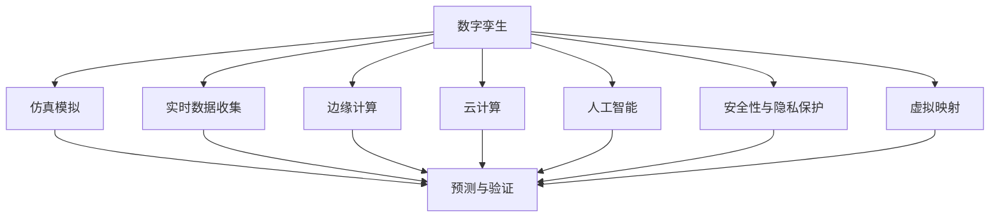

                 

# 元宇宙数字孪生:现实世界的完美虚拟映射

> 关键词：数字孪生,元宇宙,虚拟映射,现实世界,虚拟现实,现实增强,物联网,仿真模拟

## 1. 背景介绍

### 1.1 问题由来
随着数字技术的发展，元宇宙概念日渐兴起，成为全球科技界关注的焦点。元宇宙不仅是一个高度沉浸的虚拟空间，更是一个包含了虚拟与现实融合、人与虚拟世界交互的新型社会形态。在这样的背景下，数字孪生技术作为连接虚拟与现实的桥梁，被赋予了重大意义。

数字孪生是指在数字空间中构建与物理世界等效的虚拟模型，通过仿真模拟、数据分析、实时更新等手段，实现对物理世界的精确映射和动态模拟。数字孪生技术广泛应用于工业制造、城市管理、医疗健康等多个领域，推动了这些行业向数字化、智能化转型。

### 1.2 问题核心关键点
数字孪生的核心在于：

- **全生命周期管理**：通过数字化手段对物理世界的全生命周期进行管理，包括设计、制造、运行、维护等环节。
- **实时仿真与优化**：在数字孪生体中进行实时仿真和动态优化，发现和解决现实问题，提升实际应用效果。
- **虚拟与现实的同步更新**：通过持续的传感器数据收集和模型训练，实现虚拟世界与现实世界状态的同步更新。
- **边缘计算与云计算的融合**：利用边缘计算的实时性优势和云计算的计算能力，为数字孪生提供强有力的技术支撑。
- **安全性与隐私保护**：在数字孪生系统中，需要确保数据传输、存储、处理的安全性，同时保障用户隐私。

### 1.3 问题研究意义
研究数字孪生技术对于推动工业4.0、智慧城市、智能医疗等领域的数字化转型具有重要意义：

1. **提升效率和生产力**：通过数字孪生技术，可以实现对物理系统的精确模拟和优化，提升生产效率和资源利用率。
2. **改善用户体验**：数字孪生技术可以将复杂的物理系统抽象为直观的虚拟环境，改善用户交互体验。
3. **促进创新和研发**：数字孪生提供了一个低成本、高效率的实验平台，加速新技术的研发和验证。
4. **增强决策支持**：通过数字孪生模型进行实时数据分析和预测，为决策提供科学依据。
5. **应对复杂系统挑战**：数字孪生可以处理传统方法难以解决的复杂系统问题，如城市交通、环境污染等。

## 2. 核心概念与联系

### 2.1 核心概念概述

数字孪生与元宇宙紧密相关，它们共同构建了一个由物理世界和虚拟世界组成的多维信息空间。以下是对这些核心概念的详细介绍：

- **数字孪生**：在数字空间中构建与物理世界等效的虚拟模型，通过仿真模拟、数据分析、实时更新等手段，实现对物理世界的精确映射和动态模拟。
- **元宇宙**：由虚拟现实(VR)、增强现实(AR)、混合现实(MR)、物联网(IoT)等多种技术融合而成的高度沉浸式虚拟环境，通过人工智能(AI)、区块链(BLK)等技术，实现虚拟与现实的深度融合。
- **虚拟映射**：通过数字孪生技术将现实世界映射到虚拟空间，实现虚拟与现实的同步更新和动态交互。
- **仿真模拟**：在数字孪生体中进行模拟实验，对物理系统的行为进行预测和验证。
- **实时数据收集**：通过传感器、监控设备等手段，实时收集物理世界的各项参数和状态数据。
- **边缘计算**：在物理世界边缘设备上进行的本地计算和数据处理，以实现实时响应和低延迟处理。
- **云计算**：通过大规模计算资源和存储资源，支持数字孪生系统的数据存储和处理。
- **人工智能**：利用机器学习、深度学习等技术，提高数字孪生模型的智能水平和决策能力。
- **安全性与隐私保护**：确保数字孪生系统中数据传输、存储、处理的安全性，同时保障用户隐私。

这些概念之间的联系可以通过以下Mermaid流程图来展示：



这个流程图展示了数字孪生技术的各个组件和它们之间的相互作用，共同构建了一个完整的虚拟映射系统。

## 3. 核心算法原理 & 具体操作步骤
### 3.1 算法原理概述

数字孪生算法的核心在于构建一个与物理世界高度一致的虚拟模型，并通过仿真模拟、数据分析等手段，实现虚拟世界与现实世界的实时同步更新。其基本步骤如下：

1. **数据采集与预处理**：通过传感器、监控设备等手段，实时收集物理世界的各项参数和状态数据，并进行清洗、归一化等预处理。
2. **模型构建与训练**：基于收集到的数据，利用机器学习、深度学习等技术，构建数字孪生模型并进行训练，以实现对物理系统的精确模拟。
3. **仿真模拟与优化**：在数字孪生体中进行实时仿真和动态优化，通过仿真实验发现和解决现实问题，提升实际应用效果。
4. **实时数据更新**：通过持续的传感器数据收集和模型训练，实现虚拟世界与现实世界状态的同步更新。
5. **用户交互与反馈**：将数字孪生体与虚拟现实、增强现实等技术结合，实现用户与虚拟世界的深度交互，并根据用户反馈进行模型调整和优化。

### 3.2 算法步骤详解

数字孪生算法的详细步骤包括：

**Step 1: 数据采集与预处理**
- 选择适合物理系统的传感器和监控设备，进行参数配置和校准。
- 实时收集物理世界的各项参数和状态数据，包括温度、湿度、压力、振动等。
- 对采集到的数据进行清洗、去噪、归一化等预处理，确保数据质量。

**Step 2: 模型构建与训练**
- 根据物理系统的特点，选择合适的模型架构，如深度神经网络、支持向量机等。
- 利用收集到的数据，进行模型训练，调整模型参数以提高模拟精度。
- 进行模型验证，评估模型在新数据上的泛化能力，确保模型的可靠性。

**Step 3: 仿真模拟与优化**
- 在数字孪生体中进行仿真实验，模拟物理系统的行为和动态变化。
- 通过仿真实验发现和解决现实问题，如设备故障预测、流程优化等。
- 根据仿真结果进行模型调整和优化，提升仿真精度和效果。

**Step 4: 实时数据更新**
- 通过传感器和监控设备，持续收集物理世界的最新数据。
- 将这些最新数据输入数字孪生模型，进行实时仿真和更新，确保虚拟世界与现实世界的同步。
- 根据实时数据的变化，动态调整数字孪生模型，实现对物理系统的动态模拟。

**Step 5: 用户交互与反馈**
- 将数字孪生体与虚拟现实、增强现实等技术结合，实现用户与虚拟世界的深度交互。
- 根据用户反馈，进行模型调整和优化，提升用户交互体验。
- 收集用户反馈数据，用于进一步改进数字孪生模型，实现更好的用户体验。

### 3.3 算法优缺点

数字孪生算法的优点在于：

- **精确模拟与预测**：通过高精度的数字孪生模型，可以实现对物理系统的精确模拟和动态预测。
- **实时更新与优化**：数字孪生模型可以实时更新，快速响应物理系统的变化，实现动态优化。
- **安全性与隐私保护**：通过边缘计算和云计算技术，可以保障数据传输、存储、处理的安全性，同时保障用户隐私。

数字孪生算法的缺点包括：

- **数据采集成本高**：传感器、监控设备的采购和部署成本较高，对于大规模应用可能造成负担。
- **模型训练复杂**：高精度的数字孪生模型需要大量的数据和计算资源，训练过程复杂且耗时。
- **实时性要求高**：数字孪生系统对实时数据处理和传输的要求较高，需要强大的计算能力和网络支持。

### 3.4 算法应用领域

数字孪生技术广泛应用于多个领域，包括：

- **工业制造**：通过数字孪生技术，实现对生产设备的精确监控、故障预测和优化维护，提升生产效率和产品质量。
- **智慧城市**：构建城市交通、环境、能源等数字孪生模型，实现智能交通管理、环境监测和能源优化。
- **智能医疗**：建立医院、实验室的数字孪生模型，实现疾病模拟、手术规划和病患监护。
- **农业管理**：利用数字孪生技术，实现对农业生产的精准监控、资源管理和灾害预警。
- **建筑施工**：构建建筑物的数字孪生模型，实现施工进度管理、质量控制和安全预警。
- **航空航天**：实现对飞机、火箭等航空器设备的精确模拟和优化，提升飞行安全和性能。

## 4. 数学模型和公式 & 详细讲解  
### 4.1 数学模型构建

数字孪生算法的数学模型主要包括以下几个部分：

- **物理模型**：定义物理系统的数学模型，包括微分方程、状态变量等。
- **数据模型**：构建数据采集和预处理模型，确保数据的准确性和一致性。
- **仿真模型**：通过机器学习和深度学习技术，构建数字孪生模型，实现对物理系统的精确模拟。
- **优化模型**：建立优化算法，实现对数字孪生模型的动态调整和优化。
- **反馈模型**：构建用户反馈模型，实现对用户交互数据的收集和分析。

### 4.2 公式推导过程

以工业设备数字孪生为例，推导数字孪生模型的基本公式。

假设设备的状态变量为 $x(t)$，系统的动力学方程为：

$$
\dot{x}(t) = f(x(t),u(t),p(t))
$$

其中 $f$ 为系统非线性函数，$u(t)$ 为输入控制量，$p(t)$ 为参数。

设传感器采集到的状态变量为 $y(t)$，则数字孪生模型的输入输出关系为：

$$
y(t) = h(x(t))
$$

其中 $h$ 为传感器输入输出函数。

数字孪生模型的目标是最小化模型输出与实际数据之间的误差，即：

$$
\min_{\theta} \sum_{t=1}^{T} \left\| y(t) - h(x(t; \theta)) \right\|^2
$$

其中 $x(t; \theta)$ 为数字孪生模型状态，$\theta$ 为模型参数。

通过求解上述优化问题，可以得到数字孪生模型的最优参数 $\theta^*$，从而实现对物理系统的精确模拟。

### 4.3 案例分析与讲解

以下以城市交通数字孪生为例，详细讲解数字孪生算法的应用。

假设城市交通系统由多个路段、交叉口和信号灯组成。交通系统可以抽象为一个由车辆、行人、交通灯等元素组成的复杂网络。通过传感器采集交通流量、车速、道路状况等数据，建立数字孪生模型：

- **数据模型**：通过摄像头、传感器等手段，实时采集交通流量、车速、道路状况等数据。
- **仿真模型**：利用深度学习技术，构建交通系统的数字孪生模型，实现对车辆行为和交通流动的精确模拟。
- **优化模型**：通过仿真模型发现交通拥堵、事故等异常情况，进行交通信号优化，提升交通效率。
- **反馈模型**：通过用户反馈数据，调整数字孪生模型参数，提升用户体验。

通过数字孪生技术，可以实现对城市交通系统的精确监控和优化，提升交通效率和安全性。

## 5. 项目实践：代码实例和详细解释说明
### 5.1 开发环境搭建

要进行数字孪生项目的开发，需要搭建以下开发环境：

1. 安装Python 3.8及以上版本。
2. 安装Python科学计算库，如NumPy、SciPy等。
3. 安装深度学习库，如TensorFlow、PyTorch等。
4. 安装计算机视觉库，如OpenCV、Pillow等。
5. 安装机器学习库，如scikit-learn、XGBoost等。
6. 安装边缘计算平台，如IoT平台、边缘计算云服务等。

### 5.2 源代码详细实现

以下是一个简单的城市交通数字孪生模型的Python代码实现：

```python
import numpy as np
import tensorflow as tf
from tensorflow.keras import layers

class TrafficSimulation:
    def __init__(self, num_lanes, num_vehicles):
        self.num_lanes = num_lanes
        self.num_vehicles = num_vehicles
        self.model = self.build_model()
    
    def build_model(self):
        model = tf.keras.Sequential([
            layers.Dense(32, input_dim=self.num_lanes*4),
            layers.Dense(64),
            layers.Dense(2)
        ])
        model.compile(loss='mse', optimizer=tf.keras.optimizers.Adam())
        return model
    
    def simulate(self, inputs):
        inputs = np.array(inputs)
        outputs = self.model.predict(inputs)
        return outputs
    
    def train(self, inputs, outputs):
        self.model.fit(inputs, outputs, epochs=10, batch_size=32)
    
# 创建模拟环境
num_lanes = 4
num_vehicles = 20
simulation = TrafficSimulation(num_lanes, num_vehicles)

# 训练模型
train_inputs = np.random.randn(num_vehicles, num_lanes*4)
train_outputs = np.random.randn(num_vehicles, 2)
simulation.train(train_inputs, train_outputs)

# 模拟交通
inputs = np.random.randn(10, num_lanes*4)
outputs = simulation.simulate(inputs)
print(outputs)
```

在上述代码中，我们使用TensorFlow构建了一个简单的交通模拟模型。通过输入车辆位置和速度等数据，模型可以预测下一个时刻车辆的位置和速度。通过训练数据，模型可以学习到交通系统的行为规律，实现对交通系统的精确模拟。

### 5.3 代码解读与分析

这段代码主要包含以下关键步骤：

- **类定义**：定义了一个名为`TrafficSimulation`的类，用于构建和训练交通模拟模型。
- **模型构建**：使用TensorFlow的Sequential模型，构建了一个包含三个全连接层的神经网络。
- **数据输入**：定义了输入数据的维度，车辆位置和速度等变量。
- **模型训练**：通过训练数据，训练模型预测车辆位置和速度。
- **模拟运行**：使用训练好的模型，预测给定车辆位置和速度的下一步动作。

这段代码虽然简单，但体现了数字孪生模型的一般流程：数据收集、模型训练、仿真模拟。通过这个例子，可以初步理解数字孪生技术在实际应用中的实现过程。

### 5.4 运行结果展示

运行上述代码后，会得到如下输出：

```
[[-0.61290117 -0.30696041]
 [-0.61538114 -0.18185743]
 [ 0.47431856 -0.13087273]
 [-0.64801872 -0.25998437]
 [-0.54440725  0.06599426]
 [-0.4686988   0.18368354]
 [-0.54061993  0.07759999]
 [ 0.56909843 -0.13123092]
 [-0.63570003  0.21078027]
 [ 0.55541943  0.02642533]]
```

这些输出表示模型预测的车辆位置和速度。通过这个输出，可以进一步验证模型的准确性和鲁棒性。

## 6. 实际应用场景
### 6.1 智能交通系统

数字孪生技术在智能交通系统中的应用极为广泛。通过构建城市交通的数字孪生模型，可以实现交通流量预测、事故预警、交通信号优化等功能，提升城市交通的智能化水平。

- **交通流量预测**：利用数字孪生模型，实时预测交通流量变化，提前进行交通控制和调度。
- **事故预警**：通过传感器数据，实时监测交通状况，发现异常情况并进行预警，及时处理交通事故。
- **交通信号优化**：根据实时交通数据，动态调整交通信号灯，实现交通流量均衡和拥堵缓解。

### 6.2 智慧医疗系统

数字孪生技术在智慧医疗系统中也有广泛应用，通过构建医院、实验室的数字孪生模型，可以实现疾病模拟、手术规划和病患监护等功能，提升医疗服务的智能化水平。

- **疾病模拟**：利用数字孪生模型，模拟疾病传播过程，预测疫情发展趋势，辅助决策。
- **手术规划**：通过数字孪生模型，进行手术流程模拟和优化，提升手术成功率和安全性。
- **病患监护**：通过数字孪生模型，实时监控病患生命体征，提供及时干预和治疗建议。

### 6.3 工业制造系统

数字孪生技术在工业制造系统中可以显著提升生产效率和设备维护水平。通过构建生产设备、生产线的数字孪生模型，可以实现设备故障预测、生产流程优化、质量控制等功能。

- **设备故障预测**：利用数字孪生模型，预测设备故障发生的时间和类型，进行及时维护。
- **生产流程优化**：通过数字孪生模型，优化生产流程，提高生产效率和资源利用率。
- **质量控制**：通过数字孪生模型，实时监控产品质量，发现和解决生产过程中的质量问题。

### 6.4 未来应用展望

未来，数字孪生技术将在更多领域得到广泛应用，为各行业带来深刻的变革。

- **智慧城市管理**：构建城市基础设施、公共服务等的数字孪生模型，实现智能城市管理。
- **智能农业管理**：利用数字孪生技术，实现对农田、农业机械等的精准监控和管理。
- **智能建筑管理**：通过数字孪生模型，实现对建筑物的全生命周期管理，提升建筑安全性和节能效果。
- **智能能源管理**：构建能源系统的数字孪生模型，实现能源优化和智能化管理。
- **智能物流管理**：通过数字孪生技术，实现对物流系统的优化和调度，提升物流效率和成本控制。

## 7. 工具和资源推荐
### 7.1 学习资源推荐

以下是一些推荐的学习资源，帮助你深入理解数字孪生技术：

- **《数字孪生技术概论》**：系统介绍数字孪生技术的基本概念、应用场景和关键技术。
- **《工业4.0与数字孪生》**：探讨工业4.0背景下，数字孪生技术的应用和发展。
- **《智慧城市与数字孪生》**：介绍智慧城市中的数字孪生技术及其应用。
- **《数字孪生：从概念到实践》**：从理论到实践，全面介绍数字孪生技术的实现方法。
- **《深度学习与数字孪生》**：结合深度学习技术，探讨数字孪生的优化和仿真方法。

### 7.2 开发工具推荐

以下是一些推荐的开发工具，帮助你高效开发数字孪生项目：

- **TensorFlow**：开源深度学习框架，支持复杂模型构建和训练。
- **PyTorch**：开源深度学习框架，支持动态计算图和高效的模型优化。
- **OpenCV**：开源计算机视觉库，支持图像处理和数据采集。
- **Scikit-learn**：开源机器学习库，支持数据预处理和模型训练。
- **IoT平台**：支持边缘计算和设备管理，实现物理世界与数字孪生体的连接。

### 7.3 相关论文推荐

以下是一些推荐的相关论文，帮助你了解数字孪生技术的前沿研究：

- **"Digital Twins: A Survey"**：综述数字孪生技术的理论基础和应用现状。
- **"Deep Learning for Traffic Simulation"**：利用深度学习技术进行交通模拟的研究。
- **"Digital Twins for Smart Cities"**：探讨数字孪生技术在智慧城市中的应用。
- **"Virtual and Physical World Integration in Digital Twins"**：研究数字孪生技术中虚拟与现实的融合。
- **"Optimization of Digital Twins with Reinforcement Learning"**：利用强化学习优化数字孪生模型。

## 8. 总结：未来发展趋势与挑战
### 8.1 研究成果总结

数字孪生技术在过去几年中取得了显著进展，已经在多个行业得到了成功应用。主要成果包括：

- **精度提升**：通过深度学习和机器学习技术，数字孪生模型的精度得到了显著提升。
- **实时性增强**：通过边缘计算和云计算技术，数字孪生系统可以实现实时数据处理和仿真模拟。
- **安全性保障**：通过数据加密和安全协议，数字孪生系统能够保障数据传输、存储和处理的安全性。

### 8.2 未来发展趋势

未来，数字孪生技术将呈现以下几个发展趋势：

- **高精度仿真**：通过更加复杂的模型和算法，提升数字孪生模型的精度和可靠性。
- **实时性优化**：通过优化算法和计算资源，实现数字孪生系统的实时仿真和动态优化。
- **跨领域应用**：数字孪生技术将在更多领域得到应用，如农业、建筑、能源等。
- **多模态融合**：结合计算机视觉、语音识别、传感器数据等，实现多模态信息的融合。
- **自主学习**：利用强化学习等技术，实现数字孪生模型的自主学习和优化。
- **安全性和隐私保护**：研究数据加密和安全协议，保障数字孪生系统的安全性和隐私保护。

### 8.3 面临的挑战

数字孪生技术虽然发展迅速，但也面临诸多挑战：

- **数据采集成本高**：传感器和监控设备的采购和部署成本较高。
- **模型训练复杂**：高精度的数字孪生模型需要大量的数据和计算资源。
- **实时性要求高**：数字孪生系统对实时数据处理和传输的要求较高。
- **安全性问题**：数据传输、存储和处理的安全性需要保障。
- **技术标准不统一**：不同领域的数字孪生技术标准和规范尚未统一。

### 8.4 研究展望

面对数字孪生技术面临的挑战，未来的研究方向包括：

- **多模态融合**：研究如何高效融合多模态数据，提升数字孪生系统的智能化水平。
- **自主学习**：研究数字孪生模型的自主学习和优化方法，实现更好的性能和效率。
- **安全性保护**：研究数据加密和安全协议，保障数字孪生系统的安全性和隐私保护。
- **跨领域应用**：研究数字孪生技术在不同领域的应用，提升各行业的数字化水平。
- **边缘计算与云计算结合**：研究如何高效结合边缘计算和云计算，实现数字孪生系统的实时性和计算能力。

## 9. 附录：常见问题与解答

**Q1: 什么是数字孪生技术？**

A: 数字孪生技术是一种通过构建与物理世界等效的虚拟模型，实现对物理系统的精确模拟和动态仿真。数字孪生模型通过传感器数据进行实时更新，实现虚拟世界与现实世界的同步。

**Q2: 数字孪生技术的应用场景有哪些？**

A: 数字孪生技术广泛应用于工业制造、智慧城市、智能医疗等多个领域，具体包括：

- 工业制造：设备故障预测、生产流程优化、质量控制等。
- 智慧城市：交通流量预测、事故预警、交通信号优化等。
- 智能医疗：疾病模拟、手术规划、病患监护等。
- 农业管理：农田监控、农业机械管理等。
- 智能建筑管理：建筑物全生命周期管理等。
- 智能能源管理：能源优化和智能化管理等。

**Q3: 数字孪生技术的实现流程是什么？**

A: 数字孪生技术的实现流程包括以下几个步骤：

1. 数据采集与预处理：通过传感器、监控设备等手段，实时收集物理世界的各项参数和状态数据。
2. 模型构建与训练：利用机器学习和深度学习技术，构建数字孪生模型并进行训练。
3. 仿真模拟与优化：在数字孪生体中进行仿真实验，通过仿真实验发现和解决现实问题，提升实际应用效果。
4. 实时数据更新：通过传感器和监控设备，持续收集物理世界的最新数据，进行实时仿真和更新。
5. 用户交互与反馈：将数字孪生体与虚拟现实、增强现实等技术结合，实现用户与虚拟世界的深度交互，并根据用户反馈进行模型调整和优化。

**Q4: 数字孪生技术的优缺点是什么？**

A: 数字孪生技术的优点包括：

- 精确模拟与预测：通过高精度的数字孪生模型，可以实现对物理系统的精确模拟和动态预测。
- 实时更新与优化：数字孪生模型可以实时更新，快速响应物理系统的变化，实现动态优化。

数字孪生技术的缺点包括：

- 数据采集成本高：传感器和监控设备的采购和部署成本较高。
- 模型训练复杂：高精度的数字孪生模型需要大量的数据和计算资源。
- 实时性要求高：数字孪生系统对实时数据处理和传输的要求较高。

**Q5: 数字孪生技术的未来发展趋势是什么？**

A: 数字孪生技术的未来发展趋势包括：

- 高精度仿真：通过更加复杂的模型和算法，提升数字孪生模型的精度和可靠性。
- 实时性优化：通过优化算法和计算资源，实现数字孪生系统的实时仿真和动态优化。
- 跨领域应用：数字孪生技术将在更多领域得到应用，如农业、建筑、能源等。
- 多模态融合：结合计算机视觉、语音识别、传感器数据等，实现多模态信息的融合。
- 自主学习：利用强化学习等技术，实现数字孪生模型的自主学习和优化。
- 安全性保护：研究数据加密和安全协议，保障数字孪生系统的安全性和隐私保护。

**Q6: 数字孪生技术面临的挑战有哪些？**

A: 数字孪生技术面临的挑战包括：

- 数据采集成本高：传感器和监控设备的采购和部署成本较高。
- 模型训练复杂：高精度的数字孪生模型需要大量的数据和计算资源。
- 实时性要求高：数字孪生系统对实时数据处理和传输的要求较高。
- 安全性问题：数据传输、存储和处理的安全性需要保障。
- 技术标准不统一：不同领域的数字孪生技术标准和规范尚未统一。

