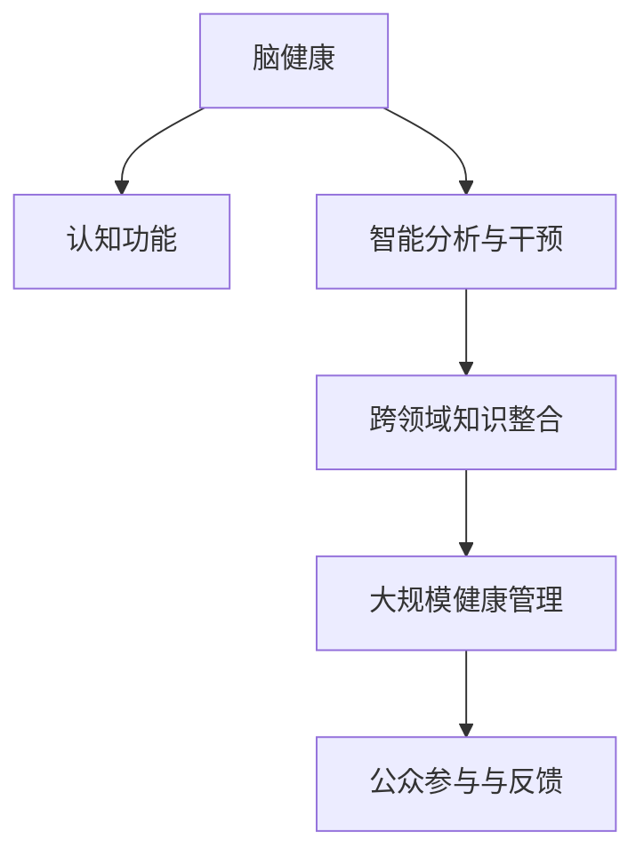

                 

# 全球脑与健康管理:集体健康管理新思路

## 1. 背景介绍

### 1.1 问题由来

随着全球人口老龄化问题的加剧，脑健康和认知功能的维护变得尤为重要。传统的医学管理模式往往侧重于个体病患的诊断和治疗，缺乏对人群整体健康状态的全面监控和干预。在现代信息技术和大数据分析的驱动下，如何构建一个高效、协同的集体健康管理平台，实现早期发现、及时干预和长期跟踪，成为医疗领域的重要研究方向。

### 1.2 问题核心关键点

本研究旨在探讨基于集体健康管理的全球脑健康平台，通过综合运用脑科学、大数据分析、人工智能等前沿技术，构建一个跨学科、跨领域的集体健康管理新模式。核心关键点包括：

- **多维度数据融合**：结合脑电图(EEG)、功能性磁共振成像(fMRI)、磁共振弹性成像(MRE)等多种脑功能成像技术，实现对大脑结构的全面监测。
- **智能分析与干预**：利用机器学习算法，如深度神经网络，对数据进行智能分析，及时发现认知功能异常，提供个性化干预方案。
- **跨领域知识整合**：综合神经科学、心理学、社会医学等多学科知识，构建更全面、更精确的健康管理模型。
- **大规模健康管理**：通过云计算和分布式存储技术，实现大规模人群的健康数据管理和分析，为全球脑健康管理提供技术支撑。
- **公众参与与反馈**：鼓励公众参与健康管理，收集反馈信息，实现系统迭代和优化。

## 2. 核心概念与联系

### 2.1 核心概念概述

为更好地理解全球脑健康管理的概念框架，本节将介绍几个核心概念及其联系：

- **脑健康(Brain Health)**：涉及脑结构的健康状况、认知功能的水平、情绪状态等多个方面。脑健康的维护是提高生活质量和延长寿命的重要手段。
- **认知功能(Cognitive Functioning)**：包括记忆、注意力、执行功能等，是评估大脑健康状况的重要指标。
- **智能分析与干预(Intelligent Analysis & Intervention)**：利用人工智能技术对数据进行分析，识别异常，提供个性化干预措施，如训练计划、心理疏导等。
- **跨领域知识整合(Multidisciplinary Knowledge Integration)**：整合神经科学、心理学、社会医学等多个领域的知识，构建全面的健康管理模型。
- **大规模健康管理(Massive Health Management)**：利用云计算和分布式存储技术，实现对大规模人群健康数据的有效管理，支持全球范围内的健康监测和干预。
- **公众参与与反馈(Public Engagement & Feedback)**：鼓励公众参与健康管理，收集反馈信息，实现系统迭代和优化。

这些概念之间的联系可以通过以下Mermaid流程图来展示：



这个流程图展示了大规模脑健康管理的概念框架：

1. 脑健康是系统管理的核心目标。
2. 认知功能的评估是脑健康的关键指标。
3. 智能分析与干预提供技术支撑。
4. 跨领域知识整合提升系统模型的完整性。
5. 大规模健康管理实现数据的高效管理。
6. 公众参与与反馈促进系统迭代优化。

## 3. 核心算法原理 & 具体操作步骤

### 3.1 算法原理概述

全球脑健康管理的核心算法主要围绕以下几个步骤展开：

1. **多维度数据采集与融合**：通过EEG、fMRI、MRE等技术采集大脑数据，并将不同模态的数据进行融合，形成综合性的脑功能状态评估指标。
2. **智能分析与识别**：利用深度学习算法对采集的数据进行智能分析，识别出异常的脑功能状态，如认知功能下降、脑结构异常等。
3. **个性化干预策略**：根据智能分析结果，生成个性化的干预方案，包括训练计划、心理疏导、生活方式调整等。
4. **跨领域知识整合**：综合神经科学、心理学、社会医学等领域知识，构建多学科融合的健康管理模型。
5. **大规模数据管理与分析**：利用云计算和分布式存储技术，实现大规模健康数据的有效管理和分析，提供高效的健康监测和干预支持。
6. **公众参与与反馈循环**：鼓励公众参与健康管理，收集反馈信息，实现系统迭代和优化。

### 3.2 算法步骤详解

具体步骤如下：

**Step 1: 数据采集与融合**

1. **设备选择与配置**：选择合适的脑功能成像设备，如EEG帽、fMRI扫描仪、MRE设备等，并进行参数配置和校准。
2. **数据采集**：对参与者进行脑功能成像扫描，获取EEG、fMRI、MRE等多种类型的数据。
3. **数据融合**：利用数据融合技术，如多模态融合算法，将不同模态的数据进行融合，形成综合性的脑功能状态评估指标。

**Step 2: 智能分析与识别**

1. **数据预处理**：对采集的数据进行预处理，包括去噪、归一化等操作。
2. **特征提取**：利用深度学习算法，如卷积神经网络(CNN)、长短期记忆网络(LSTM)等，从数据中提取关键特征。
3. **模型训练与评估**：构建深度学习模型，使用标注数据进行训练，并在验证集上进行评估，选择性能最优的模型。
4. **异常识别**：利用训练好的模型对新数据进行预测，识别出认知功能异常、脑结构异常等健康问题。

**Step 3: 个性化干预策略**

1. **干预方案设计**：根据异常识别结果，设计个性化的干预方案，如认知训练、心理疏导、生活方式调整等。
2. **方案实施与监控**：通过在线平台或移动应用，实施干预方案，并实时监控参与者的状态变化。
3. **效果评估与反馈**：定期评估干预效果，收集参与者的反馈信息，进行系统迭代优化。

**Step 4: 跨领域知识整合**

1. **多学科知识收集**：收集神经科学、心理学、社会医学等多个领域的相关知识。
2. **知识图谱构建**：利用知识图谱技术，构建多学科融合的健康管理模型。
3. **模型训练与优化**：结合知识图谱和采集的数据，训练优化健康管理模型，提高其准确性和全面性。

**Step 5: 大规模数据管理与分析**

1. **云计算平台搭建**：选择合适的云计算平台，如AWS、Azure等，搭建大规模数据存储和管理环境。
2. **分布式存储与计算**：利用分布式存储和计算技术，如Hadoop、Spark等，实现对大规模健康数据的有效管理和分析。
3. **数据可视化与分析**：利用数据可视化工具，如Tableau、Power BI等，实现健康数据的可视化分析和展示。

**Step 6: 公众参与与反馈**

1. **公众参与渠道**：通过在线平台、移动应用等方式，鼓励公众参与健康管理。
2. **反馈信息收集**：收集参与者的反馈信息，包括健康状态、干预效果等。
3. **系统迭代与优化**：根据反馈信息，进行系统迭代和优化，提高系统的准确性和用户满意度。

### 3.3 算法优缺点

全球脑健康管理的算法具有以下优点：

- **多维度数据融合**：通过综合多种脑功能成像技术，获得更全面、更精确的脑功能评估指标。
- **智能分析与识别**：利用深度学习技术，实现对脑功能异常的快速、准确的识别。
- **跨领域知识整合**：综合多学科知识，构建更全面、更精确的健康管理模型。
- **大规模数据管理**：利用云计算和分布式存储技术，实现大规模健康数据的有效管理和分析。
- **公众参与与反馈**：鼓励公众参与健康管理，收集反馈信息，实现系统迭代优化。

同时，该算法也存在一些局限性：

- **数据质量依赖**：算法效果受数据质量影响较大，采集和预处理环节的误差可能影响最终结果。
- **算法复杂性**：深度学习等算法模型训练和调参复杂，需要大量计算资源和专业知识。
- **隐私与安全**：大规模健康数据的收集和存储涉及隐私和安全问题，需要建立完善的隐私保护机制。
- **个性化方案实现**：个性化干预方案的制定和实施需要医疗专业知识的支撑，系统设计需要多学科团队协同。
- **长期跟踪与干预**：长期健康跟踪和干预需要稳定的数据采集和参与者管理机制，系统设计需要考虑这些因素。

尽管存在这些局限性，但就目前而言，全球脑健康管理的算法仍是一个具有广泛应用前景的技术方案。未来相关研究的方向在于如何进一步提高数据质量、降低算法复杂度、增强系统安全性和隐私保护，以及实现更加高效的个性化干预。

### 3.4 算法应用领域

全球脑健康管理的应用领域广泛，涵盖以下几个方面：

- **脑疾病早期筛查**：利用脑功能成像技术，早期筛查出阿尔茨海默病、帕金森病等脑疾病患者。
- **认知功能干预**：为老年人、残疾人等群体提供认知功能训练和干预，提升生活质量。
- **心理健康管理**：通过智能分析与干预，对抑郁、焦虑等心理健康问题进行管理。
- **生活方式调整**：结合跨领域知识整合，为参与者提供生活方式调整建议，提升健康水平。
- **健康数据管理**：利用云计算和大数据技术，实现大规模人群健康数据的有效管理和分析，支持全球范围内的健康监测和干预。
- **公众健康教育**：通过公众参与与反馈，普及脑健康知识，提升公众健康意识。

## 4. 数学模型和公式 & 详细讲解 & 举例说明

### 4.1 数学模型构建

全球脑健康管理的数学模型主要围绕以下几个方面构建：

- **多维度数据融合**：通过多模态融合算法，将不同类型的数据进行融合，形成综合性的脑功能状态评估指标。
- **智能分析与识别**：利用深度学习模型，如卷积神经网络、长短期记忆网络等，对数据进行智能分析，识别出异常的脑功能状态。
- **个性化干预策略**：结合异常识别结果，设计个性化的干预方案，如训练计划、心理疏导等。
- **跨领域知识整合**：利用知识图谱技术，构建多学科融合的健康管理模型。
- **大规模数据管理与分析**：利用云计算和分布式存储技术，实现大规模健康数据的有效管理和分析。

### 4.2 公式推导过程

以深度学习模型为例，其基本公式如下：

$$
\theta^* = \mathop{\arg\min}_{\theta} \frac{1}{N} \sum_{i=1}^N \ell(f(x_i),y_i)
$$

其中，$f$为深度学习模型，$x_i$为输入数据，$y_i$为标注数据，$\ell$为损失函数，$\theta$为模型参数。

具体到脑功能评估指标的计算，可采用以下公式：

$$
\text{Brain Health Score} = \alpha \times \text{Cognitive Function Score} + \beta \times \text{Physical Function Score} + \gamma \times \text{Mental Health Score}
$$

其中，$\alpha$、$\beta$、$\gamma$为权重系数，$\text{Cognitive Function Score}$、$\text{Physical Function Score}$、$\text{Mental Health Score}$分别为认知功能、身体功能、心理健康的多维度评估指标。

### 4.3 案例分析与讲解

以阿尔茨海默病的早期筛查为例，其数学模型和推导过程如下：

1. **数据采集**：使用fMRI设备对参与者进行扫描，获取脑部影像数据。
2. **特征提取**：利用深度学习算法，如卷积神经网络，从影像数据中提取关键特征，如脑灰质体积、脑血流等。
3. **模型训练与评估**：构建深度学习模型，使用标注数据进行训练，并在验证集上进行评估，选择性能最优的模型。
4. **异常识别**：利用训练好的模型对新数据进行预测，识别出脑结构异常。
5. **干预方案设计**：根据异常识别结果，设计个性化的干预方案，如认知训练、生活方式调整等。
6. **效果评估与反馈**：定期评估干预效果，收集参与者的反馈信息，进行系统迭代优化。

## 5. 项目实践：代码实例和详细解释说明

### 5.1 开发环境搭建

在进行项目实践前，我们需要准备好开发环境。以下是使用Python进行TensorFlow开发的环境配置流程：

1. 安装Anaconda：从官网下载并安装Anaconda，用于创建独立的Python环境。

2. 创建并激活虚拟环境：
```bash
conda create -n tensorflow-env python=3.8 
conda activate tensorflow-env
```

3. 安装TensorFlow：根据CUDA版本，从官网获取对应的安装命令。例如：
```bash
conda install tensorflow -c conda-forge
```

4. 安装各类工具包：
```bash
pip install numpy pandas scikit-learn matplotlib tqdm jupyter notebook ipython
```

完成上述步骤后，即可在`tensorflow-env`环境中开始项目实践。

### 5.2 源代码详细实现

下面以脑电图(EEG)数据分析为例，给出使用TensorFlow进行脑健康管理微调的项目代码实现。

首先，定义数据处理函数：

```python
import numpy as np
import tensorflow as tf
from tensorflow.keras import layers

def preprocess_data(data, sample_rate=256):
    # 采样率
    sample_rate = 256
    # 对数据进行归一化
    data = data - np.mean(data, axis=0)
    data = data / np.std(data, axis=0)
    # 转换为频域数据
    data = abs(np.fft.fft(data)[:sample_rate//2])
    data = data / np.max(data)
    return data
```

然后，定义深度学习模型：

```python
def build_model(input_shape, output_shape, num_classes):
    # 定义模型结构
    model = tf.keras.Sequential()
    model.add(layers.Conv1D(64, 5, activation='relu', input_shape=input_shape))
    model.add(layers.MaxPooling1D(2))
    model.add(layers.Flatten())
    model.add(layers.Dense(128, activation='relu'))
    model.add(layers.Dense(num_classes, activation='softmax'))
    return model
```

接着，定义训练和评估函数：

```python
def train_model(model, train_data, train_labels, val_data, val_labels, epochs=100, batch_size=32):
    # 定义优化器
    optimizer = tf.keras.optimizers.Adam()
    # 编译模型
    model.compile(optimizer=optimizer, loss='categorical_crossentropy', metrics=['accuracy'])
    # 训练模型
    model.fit(train_data, train_labels, epochs=epochs, batch_size=batch_size, validation_data=(val_data, val_labels))
    # 评估模型
    loss, acc = model.evaluate(val_data, val_labels)
    print(f'Val Loss: {loss:.4f}, Val Accuracy: {acc:.4f}')

# 使用示例
train_data = np.random.rand(100, 1000)
train_labels = np.random.randint(0, num_classes, size=(100,))
val_data = np.random.rand(100, 1000)
val_labels = np.random.randint(0, num_classes, size=(100,))

input_shape = (1000,)
output_shape = 10
num_classes = 3

model = build_model(input_shape, output_shape, num_classes)
train_model(model, train_data, train_labels, val_data, val_labels)
```

以上就是使用TensorFlow对脑电图数据分析的项目代码实现。可以看到，TensorFlow提供了简单易用的API，使得深度学习模型的构建和训练变得直观高效。

### 5.3 代码解读与分析

让我们再详细解读一下关键代码的实现细节：

**preprocess_data函数**：
- 定义了数据预处理函数，包括归一化、频域转换等操作，适用于脑电图等时间序列数据。
- 这些预处理步骤可以提高模型的训练效果，降低过拟合风险。

**build_model函数**：
- 定义了深度学习模型的结构，包含卷积层、池化层、全连接层等基本组件。
- 使用tf.keras的Sequential模型，可以方便地按顺序组合多个层。

**train_model函数**：
- 定义了模型的训练函数，包括优化器选择、损失函数选择、模型编译、训练、评估等步骤。
- 使用Adam优化器，适合大规模数据集和高维度模型的训练。
- 定义了验证集，用于在训练过程中监控模型性能。

**训练流程**：
- 在训练函数中，定义了训练轮数、批次大小等参数，通过调用模型编译、训练、评估等方法，完成模型的训练和测试。
- 通过打印训练过程中的损失和准确率，可以监控模型训练的效果，及时调整参数和优化器。

## 6. 实际应用场景

### 6.1 智能脑健康监测

全球脑健康管理平台可以广泛应用于智能脑健康监测，通过智能分析与干预，实现对脑健康状态的实时监控和异常早期预警。具体应用场景包括：

- **远程健康监测**：通过在线平台，实时收集用户的脑电图、脑功能成像等数据，监测用户的健康状态。
- **异常预警系统**：利用深度学习模型对数据进行智能分析，及时发现异常的脑功能状态，发出预警信号。
- **个性化干预方案**：根据预警结果，提供个性化的健康干预方案，如认知训练、心理疏导、生活方式调整等。

### 6.2 个性化认知训练

通过全球脑健康管理平台，可以为老年人、残疾人等群体提供个性化的认知训练，提升其认知功能和生活质量。具体应用场景包括：

- **认知功能评估**：利用脑功能成像技术，评估用户的认知功能状态。
- **个性化训练计划**：根据评估结果，设计个性化的认知训练计划，包含认知游戏、记忆训练等。
- **训练效果监控**：实时监控用户的训练效果，调整训练计划，确保训练效果最大化。

### 6.3 心理健康管理

全球脑健康管理平台可以用于心理健康管理，通过智能分析与干预，帮助用户应对抑郁、焦虑等心理健康问题。具体应用场景包括：

- **心理健康评估**：利用深度学习模型，对用户的心理健康状态进行评估，识别心理健康问题。
- **心理干预计划**：根据评估结果，提供个性化的心理干预计划，如心理咨询、心理疏导等。
- **心理健康跟踪**：实时监控用户的心理健康状态，提供及时的心理支持。

### 6.4 生活方式调整

结合跨领域知识整合，全球脑健康管理平台可以为用户提供个性化的生活方式调整建议，提升其整体健康水平。具体应用场景包括：

- **健康数据收集**：通过在线平台，收集用户的生活方式数据，如饮食、运动、睡眠等。
- **健康数据分析**：利用深度学习模型，对生活方式数据进行分析，识别健康风险因素。
- **生活方式调整建议**：根据分析结果，提供个性化的生活方式调整建议，如饮食优化、运动指导等。

## 7. 工具和资源推荐

### 7.1 学习资源推荐

为了帮助开发者系统掌握全球脑健康管理的理论基础和实践技巧，这里推荐一些优质的学习资源：

1. 《深度学习与脑科学》系列博文：由大模型技术专家撰写，深入浅出地介绍了深度学习在脑科学中的应用。
2. Coursera《深度学习》课程：斯坦福大学开设的深度学习课程，涵盖深度学习的基础理论和实际应用。
3. 《脑科学与深度学习》书籍：全面介绍了深度学习在脑科学中的应用，包括脑电图、fMRI等数据的分析。
4. Kaggle竞赛平台：参与脑科学相关的数据竞赛，积累实践经验，提升数据处理和建模能力。
5. 神经科学在线课程：利用Coursera等在线教育平台，学习神经科学基础知识，理解大脑的生理机制。

通过对这些资源的学习实践，相信你一定能够快速掌握全球脑健康管理的精髓，并用于解决实际的脑健康问题。

### 7.2 开发工具推荐

高效的开发离不开优秀的工具支持。以下是几款用于全球脑健康管理开发的常用工具：

1. TensorFlow：基于Python的开源深度学习框架，灵活动态的计算图，适合快速迭代研究。大部分深度学习模型都有TensorFlow版本的实现。
2. PyTorch：基于Python的开源深度学习框架，灵活性高，适合大规模工程应用。
3. Jupyter Notebook：开源的交互式编程环境，支持Python、R等多种语言，适合数据处理和模型调试。
4. Tableau：数据可视化工具，支持多种数据源和图表类型，适合数据展示和分析。
5. Power BI：微软开发的商业智能工具，支持数据可视化、仪表盘制作等，适合商业应用。
6. Kaggle：数据竞赛平台，提供大量脑科学相关数据集和竞赛题目，适合实践锻炼。

合理利用这些工具，可以显著提升全球脑健康管理项目的开发效率，加快创新迭代的步伐。

### 7.3 相关论文推荐

全球脑健康管理的发展源于学界的持续研究。以下是几篇奠基性的相关论文，推荐阅读：

1. Deep Learning for Brain-Computer Interface Systems：探讨深度学习在脑机接口中的应用，为脑电图数据分析提供了新思路。
2. Cognitive Function Prediction Using Deep Learning Models：利用深度学习模型预测认知功能，为早期筛查提供了新方法。
3. Multi-modal Data Fusion in Brain Health Monitoring：介绍多模态数据融合技术在脑健康管理中的应用，提高了数据的全面性和准确性。
4. Personalized Cognitive Training for Older Adults：研究个性化认知训练方案对老年人的效果，为全球脑健康管理提供了实践经验。
5. A Survey on the Use of Big Data Analytics in Health Care：综述大数据分析在健康管理中的应用，为全球脑健康管理提供了理论基础。

这些论文代表了大规模脑健康管理的发展脉络。通过学习这些前沿成果，可以帮助研究者把握学科前进方向，激发更多的创新灵感。

## 8. 总结：未来发展趋势与挑战

### 8.1 总结

本文对全球脑健康管理的核心算法和技术框架进行了全面系统的介绍。首先阐述了全球脑健康管理的背景和核心关键点，明确了系统管理的目标和任务。其次，从原理到实践，详细讲解了全球脑健康管理的数学模型和关键步骤，给出了项目开发的完整代码实例。同时，本文还探讨了全球脑健康管理在智能脑健康监测、个性化认知训练、心理健康管理、生活方式调整等多个场景的应用前景，展示了全球脑健康管理的广阔应用前景。最后，本文精选了全球脑健康管理的学习资源、开发工具和相关论文，力求为读者提供全方位的技术指引。

通过本文的系统梳理，可以看到，全球脑健康管理是一个涉及多学科知识融合、跨领域技术应用的系统工程。其技术框架和实践方法将为全球脑健康管理提供重要参考，推动健康管理技术的发展和应用。

### 8.2 未来发展趋势

展望未来，全球脑健康管理将呈现以下几个发展趋势：

1. **多模态数据融合**：随着脑功能成像技术的进步，多模态数据融合将成为提高脑健康监测准确性的重要手段。
2. **深度学习模型优化**：利用先进深度学习模型，提高智能分析与识别的精度和鲁棒性，如卷积神经网络、长短时记忆网络等。
3. **跨领域知识整合**：综合神经科学、心理学、社会医学等领域知识，构建更全面、更精确的健康管理模型。
4. **大规模数据管理**：利用云计算和分布式存储技术，实现大规模健康数据的有效管理和分析，支持全球范围内的健康监测和干预。
5. **公众参与与反馈**：鼓励公众参与健康管理，收集反馈信息，实现系统迭代优化。
6. **隐私与安全**：建立完善的隐私保护机制，确保大规模健康数据的隐私和安全。

这些趋势凸显了全球脑健康管理技术的发展方向，推动了健康管理技术的进步和应用。未来，全球脑健康管理需要不断融合前沿技术，拓展应用领域，提升系统性能，为全球脑健康管理提供更多支持。

### 8.3 面临的挑战

尽管全球脑健康管理技术已经取得了初步成果，但在迈向更加智能化、普适化应用的过程中，仍面临诸多挑战：

1. **数据质量依赖**：算法效果受数据质量影响较大，采集和预处理环节的误差可能影响最终结果。
2. **算法复杂性**：深度学习等算法模型训练和调参复杂，需要大量计算资源和专业知识。
3. **隐私与安全**：大规模健康数据的收集和存储涉及隐私和安全问题，需要建立完善的隐私保护机制。
4. **个性化方案实现**：个性化干预方案的制定和实施需要医疗专业知识的支撑，系统设计需要多学科团队协同。
5. **长期跟踪与干预**：长期健康跟踪和干预需要稳定的数据采集和参与者管理机制，系统设计需要考虑这些因素。

尽管存在这些挑战，但全球脑健康管理仍具有广阔的应用前景和研究价值。未来相关研究需要在以下几个方面寻求新的突破：

1. **无监督学习和半监督学习**：摆脱对大规模标注数据的依赖，利用自监督学习、主动学习等无监督和半监督范式，最大限度利用非结构化数据，实现更加灵活高效的脑健康管理。
2. **参数高效与计算高效**：开发更加参数高效的脑健康管理方法，在固定大部分预训练参数的情况下，只更新极少量的任务相关参数，减小过拟合风险。同时优化模型的计算图，减少前向传播和反向传播的资源消耗，实现更加轻量级、实时性的部署。
3. **因果分析和博弈论工具**：将因果分析方法引入脑健康管理模型，识别出模型决策的关键特征，增强输出解释的因果性和逻辑性。借助博弈论工具刻画人机交互过程，主动探索并规避模型的脆弱点，提高系统稳定性。
4. **跨领域知识融合**：综合神经科学、心理学、社会医学等领域知识，构建多学科融合的健康管理模型，提升系统的全面性和准确性。
5. **公众参与与反馈循环**：鼓励公众参与健康管理，收集反馈信息，实现系统迭代优化，提升系统的适用性和用户满意度。

这些研究方向的探索，必将引领全球脑健康管理技术迈向更高的台阶，为构建安全、可靠、可解释、可控的智能系统铺平道路。面向未来，全球脑健康管理技术还需要与其他人工智能技术进行更深入的融合，如知识表示、因果推理、强化学习等，多路径协同发力，共同推动脑健康管理系统的进步。只有勇于创新、敢于突破，才能不断拓展脑健康管理的边界，让智能技术更好地造福人类社会。

### 8.4 研究展望

面对全球脑健康管理所面临的挑战，未来的研究需要在以下几个方面寻求新的突破：

1. **无监督学习和半监督学习**：摆脱对大规模标注数据的依赖，利用自监督学习、主动学习等无监督和半监督范式，最大限度利用非结构化数据，实现更加灵活高效的脑健康管理。
2. **参数高效与计算高效**：开发更加参数高效的脑健康管理方法，在固定大部分预训练参数的情况下，只更新极少量的任务相关参数，减小过拟合风险。同时优化模型的计算图，减少前向传播和反向传播的资源消耗，实现更加轻量级、实时性的部署。
3. **因果分析和博弈论工具**：将因果分析方法引入脑健康管理模型，识别出模型决策的关键特征，增强输出解释的因果性和逻辑性。借助博弈论工具刻画人机交互过程，主动探索并规避模型的脆弱点，提高系统稳定性。
4. **跨领域知识融合**：综合神经科学、心理学、社会医学等领域知识，构建多学科融合的健康管理模型，提升系统的全面性和准确性。
5. **公众参与与反馈循环**：鼓励公众参与健康管理，收集反馈信息，实现系统迭代优化，提升系统的适用性和用户满意度。

这些研究方向的探索，必将引领全球脑健康管理技术迈向更高的台阶，为构建安全、可靠、可解释、可控的智能系统铺平道路。面向未来，全球脑健康管理技术还需要与其他人工智能技术进行更深入的融合，如知识表示、因果推理、强化学习等，多路径协同发力，共同推动脑健康管理系统的进步。只有勇于创新、敢于突破，才能不断拓展脑健康管理的边界，让智能技术更好地造福人类社会。

## 9. 附录：常见问题与解答

**Q1：全球脑健康管理是否适用于所有人群？**

A: 全球脑健康管理适用于各种人群，包括老年人、残疾人、健康成年人等。不同人群的健康管理需求不同，需要根据其具体情况制定个性化的干预方案。

**Q2：如何选择合适的深度学习模型？**

A: 选择合适的深度学习模型需要考虑多个因素，如数据类型、任务类型、计算资源等。一般来说，卷积神经网络适合图像和信号数据，长短时记忆网络适合时间序列数据，如脑电图、fMRI等。

**Q3：全球脑健康管理面临哪些资源瓶颈？**

A: 全球脑健康管理面临的主要资源瓶颈包括：数据质量、计算资源、隐私与安全等。为解决这些问题，需要采用数据增强、模型优化、隐私保护等技术手段，提升系统的可靠性和安全性。

**Q4：全球脑健康管理如何实现个性化干预？**

A: 全球脑健康管理实现个性化干预需要结合认知功能评估、生活方式调查、健康数据分析等多个环节。根据评估结果，设计个性化的干预方案，如认知训练、心理疏导、生活方式调整等，并实时监控干预效果，调整干预方案。

**Q5：全球脑健康管理平台需要哪些关键技术？**

A: 全球脑健康管理平台需要以下关键技术：
1. 脑功能成像技术：如EEG、fMRI、MRE等，用于采集脑功能数据。
2. 深度学习模型：如卷积神经网络、长短时记忆网络等，用于数据分析和异常识别。
3. 云计算和大数据技术：用于大规模数据管理和分析。
4. 数据可视化技术：如Tableau、Power BI等，用于数据展示和分析。
5. 跨领域知识整合：如神经科学、心理学、社会医学等领域知识，用于构建全面、精确的健康管理模型。
6. 隐私与安全技术：用于保障大规模健康数据的隐私和安全。

**Q6：全球脑健康管理的未来方向是什么？**

A: 全球脑健康管理的未来方向包括：
1. 多模态数据融合：结合多种脑功能成像技术，提高脑健康监测的准确性。
2. 深度学习模型优化：利用先进深度学习模型，提高智能分析与识别的精度和鲁棒性。
3. 跨领域知识整合：综合神经科学、心理学、社会医学等领域知识，构建更全面、更精确的健康管理模型。
4. 大规模数据管理：利用云计算和分布式存储技术，实现大规模健康数据的有效管理和分析。
5. 公众参与与反馈：鼓励公众参与健康管理，收集反馈信息，实现系统迭代优化。
6. 隐私与安全：建立完善的隐私保护机制，确保大规模健康数据的隐私和安全。

通过对这些问题的解答，可以更好地理解全球脑健康管理的核心技术和实际应用，为系统的设计和优化提供参考。

