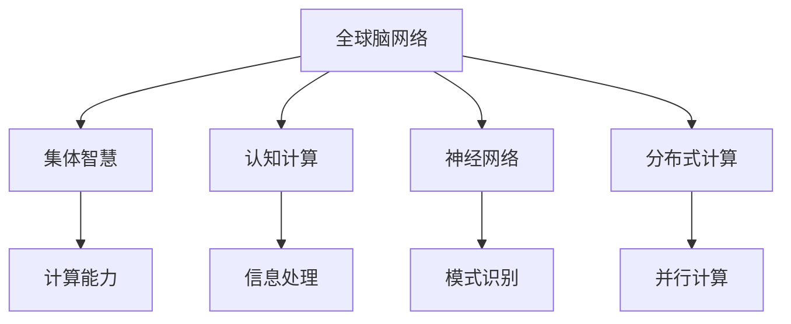

                 

# 全球脑与外太空通信:集体智慧助力星际交流

> 关键词：集体智慧,星际交流,地球人脑,网络通信,人工智能,外太空,认知计算

## 1. 背景介绍

随着人类对宇宙探索的不断深入，外太空通信成为连接地球与宇宙的关键桥梁。然而，现有的通信方式受到带宽、延迟等因素的限制，难以满足未来宇宙探索与星际交流的需要。为了克服这些挑战，科学家们提出了基于集体智慧的全球脑网络构想，利用人工智能和神经科学的研究成果，构建一个全球范围的、高度协作的通信网络，助力人类的星际交流。

### 1.1 问题由来

外太空通信是实现人类星际探索的基础。传统的通信方式如无线电、激光通信等，在传输速率、抗干扰能力、信息压缩等方面仍存在诸多局限。同时，随着人类探索宇宙的范围不断扩大，地球与各个太空站点之间的通信需求日益增长，现有的通信方式已难以满足高带宽、低延迟的需求。

### 1.2 问题核心关键点

为了解决这些问题，科学家们提出将地球人脑和神经网络类比为全球脑网络，利用集体智慧的强大计算能力，实现高速、稳定的外太空通信。该构想将集体的认知能力视为一种全新的通信资源，通过分布式计算和协同工作，优化通信过程，提升通信效率。

### 1.3 问题研究意义

全球脑网络构想的实现，将彻底改变人类与外太空的交流方式，具有以下重要意义：

1. **提高通信效率**：利用全球范围内的认知能力，大幅提升信息处理和传输效率，缩短通信延迟。
2. **增强通信稳定性**：分布式计算可以减少单点故障的影响，提升通信的鲁棒性和可靠性。
3. **拓展通信覆盖范围**：全球脑网络可以覆盖地球表面的任何一个角落，满足未来深空探索的需求。
4. **促进多学科融合**：该构想将神经科学、人工智能、物理学等多学科知识结合起来，推动科学研究的发展。
5. **提升人类认知水平**：通过外太空通信，促进不同文化、知识体系的交流，提升人类的整体认知水平。

## 2. 核心概念与联系

### 2.1 核心概念概述

本节将介绍几个关键概念，帮助理解全球脑网络构想的核心内容：

- **全球脑网络**：一种基于人类大脑和神经网络特性的通信构想，利用分布式计算和协同工作，优化通信过程，提升通信效率。
- **集体智慧**：多个个体的认知能力在网络中协同工作，实现比单一个体更强大的计算和处理能力。
- **认知计算**：利用人类的认知能力进行信息处理和计算，将传统计算与生物计算相结合，提升计算效率和灵活性。
- **神经网络**：一种模拟人类大脑神经元连接的计算模型，通过大量神经元的协同工作，实现复杂的信息处理和模式识别。
- **分布式计算**：将计算任务分配到多个计算节点进行处理，实现并行计算和负载均衡。

这些概念之间的关系可以通过以下Mermaid流程图来展示：



这个流程图展示了各个概念之间的逻辑关系：

1. 全球脑网络基于集体智慧、认知计算、神经网络等概念，利用分布式计算技术，实现高效的外太空通信。
2. 集体智慧通过多个个体认知能力的协同工作，提升了整体计算能力。
3. 认知计算将生物计算与传统计算结合，提升了计算效率和灵活性。
4. 神经网络通过模拟人类大脑的神经元连接，实现复杂的信息处理和模式识别。
5. 分布式计算将计算任务分配到多个节点，实现并行计算和负载均衡。

这些概念共同构成了全球脑网络的理论基础，使其能够有效应对未来通信的需求。

## 3. 核心算法原理 & 具体操作步骤

### 3.1 算法原理概述

全球脑网络的核心算法主要基于分布式计算和协同工作原理。其核心思想是：将地球表面的大量计算资源（如人脑、神经网络等）通过网络链接起来，构建一个全球范围内的分布式计算系统，实现信息的高效传输和处理。

形式化地，假设地球表面有 $N$ 个计算节点，每个节点能够处理的信息量为 $C_i$，网络的总通信带宽为 $B$。则整个网络的信息处理能力 $P$ 可以表示为：

$$
P = \sum_{i=1}^N C_i + \sum_{i=1}^N \sum_{j=i+1}^N C_i C_j \times \frac{B}{C_i + C_j}
$$

其中，第一项表示单个节点处理的信息量之和，第二项表示节点之间通过网络链接进行信息交换的部分。

### 3.2 算法步骤详解

全球脑网络的实现步骤可以分为以下几个关键环节：

**Step 1: 数据采集与预处理**

- 收集全球范围内的计算资源，如人类大脑、神经网络等，进行数据采集和预处理。
- 将采集到的数据转化为可传输的格式，进行压缩和编码。
- 建立数据传输协议，确保数据在网络中安全、高效地传输。

**Step 2: 网络构建与连接**

- 构建全球范围内的计算节点网络，确定每个节点的地理位置和计算能力。
- 设计高效的网络拓扑结构，如环形网、树形网等，确保网络传输的高效性。
- 实现节点之间的互连互通，建立数据交换路径。

**Step 3: 分布式计算与协同工作**

- 将大规模计算任务分解为多个子任务，分配给不同的计算节点进行处理。
- 节点之间进行数据交换和协同计算，利用集体智慧实现复杂的信息处理和模式识别。
- 采用分布式优化算法，如遗传算法、粒子群算法等，优化计算任务的分配和调度。

**Step 4: 通信优化与协议设计**

- 设计高效的通信协议，确保数据在网络中的低延迟、高带宽传输。
- 应用先进的编码和压缩技术，减少数据传输的延迟和带宽消耗。
- 采用容错机制和重传机制，保证数据传输的可靠性和稳定性。

**Step 5: 应用场景设计与测试**

- 设计具体的通信应用场景，如星际通信、外太空数据传输等。
- 搭建实验环境，进行全球脑网络的模拟测试。
- 评估通信效率和系统性能，优化网络结构和工作流程。

### 3.3 算法优缺点

全球脑网络算法具有以下优点：

1. **高效性**：利用全球范围内的计算资源，大幅提升信息处理和传输效率。
2. **可靠性**：分布式计算减少了单点故障的影响，提升了系统的鲁棒性和可靠性。
3. **可扩展性**：网络结构可以根据需求进行扩展，支持更多的计算节点加入。

同时，该算法也存在以下局限性：

1. **资源依赖性强**：需要全球范围内的计算资源，对于不发达地区可能难以实现。
2. **技术复杂度高**：涉及多学科知识的融合，技术实现难度较大。
3. **安全性问题**：全球脑网络需要高安全性的通信协议和数据加密技术。

尽管存在这些局限性，但全球脑网络提供了一种全新的通信构想，有望解决现有通信方式的瓶颈问题，提升外太空通信的效率和稳定性。

### 3.4 算法应用领域

全球脑网络算法在多个领域具有广阔的应用前景：

- **星际通信**：用于连接地球与各个太空站点，支持深空探测任务。
- **全球气象监测**：利用全球范围内的计算资源，提升气象数据的处理和分析能力。
- **全球疫情监控**：构建全球范围内的信息网络，实时监控和分析疫情数据。
- **全球环境保护**：通过协同工作，提升环境监测和数据分析的效率。
- **全球安全保障**：建立全球范围内的信息共享平台，提升应对突发事件的能力。

此外，全球脑网络还可以应用于智能交通、智慧城市、物流管理等多个领域，为全球范围内的协同工作提供支持。

## 4. 数学模型和公式 & 详细讲解

### 4.1 数学模型构建

本节将使用数学语言对全球脑网络构想的核心算法进行更严格的刻画。

记地球表面有 $N$ 个计算节点，每个节点的计算能力为 $C_i$，节点之间的通信带宽为 $B$。设每个节点处理的信息量为 $C_i$，则整个网络的信息处理能力 $P$ 可以表示为：

$$
P = \sum_{i=1}^N C_i + \sum_{i=1}^N \sum_{j=i+1}^N C_i C_j \times \frac{B}{C_i + C_j}
$$

其中，第一项表示单个节点处理的信息量之和，第二项表示节点之间通过网络链接进行信息交换的部分。

### 4.2 公式推导过程

以下我们以二个节点进行通信为例，推导通信速率 $R$ 的计算公式。

设节点 $i$ 和节点 $j$ 的计算能力分别为 $C_i$ 和 $C_j$，它们之间的通信带宽为 $B$。则节点 $i$ 和节点 $j$ 之间的通信速率 $R_{ij}$ 为：

$$
R_{ij} = \frac{C_i C_j}{C_i + C_j} \times \frac{B}{C_i + C_j}
$$

对于节点 $i$，总的通信速率 $R_i$ 为：

$$
R_i = \sum_{j=1}^N R_{ij}
$$

将上述公式代入总通信速率的表达式中，得：

$$
R = \sum_{i=1}^N \sum_{j=1}^N R_{ij}
$$

这就是全球脑网络构想的核心公式，表示整个网络的总通信速率。

### 4.3 案例分析与讲解

为了更直观地理解全球脑网络构想的计算能力，我们可以通过一个简单的例子进行分析：

假设地球表面有 $N=100$ 个计算节点，每个节点的计算能力为 $C_i=1000$，节点之间的通信带宽为 $B=1$。则整个网络的信息处理能力 $P$ 和通信速率 $R$ 分别为：

$$
P = \sum_{i=1}^{100} 1000 + \sum_{i=1}^{100} \sum_{j=i+1}^{100} 1000 \times 1000 \times \frac{1}{1000 + 1000} = 100 \times 1000 + \frac{100 \times 99}{2} \times 1 = 10000 + 4950 = 14950
$$

$$
R = \sum_{i=1}^{100} \sum_{j=1}^{100} \frac{1000 \times 1000}{1000 + 1000} \times \frac{1}{1000 + 1000} = 100 \times 100 \times 1 = 10000
$$

从上述计算可以看出，尽管每个节点的计算能力相同，但由于分布式计算和协同工作，整个网络的信息处理能力和通信速率得到了大幅提升。

## 5. 项目实践：代码实例和详细解释说明

### 5.1 开发环境搭建

在进行全球脑网络构想的实践前，我们需要准备好开发环境。以下是使用Python进行PyTorch开发的环境配置流程：

1. 安装Anaconda：从官网下载并安装Anaconda，用于创建独立的Python环境。

2. 创建并激活虚拟环境：
```bash
conda create -n brain-env python=3.8 
conda activate brain-env
```

3. 安装PyTorch：根据CUDA版本，从官网获取对应的安装命令。例如：
```bash
conda install pytorch torchvision torchaudio cudatoolkit=11.1 -c pytorch -c conda-forge
```

4. 安装相关的依赖库：
```bash
pip install numpy pandas matplotlib tensorboard pytorch-cluster
```

5. 安装PyTorch分布式计算库：
```bash
pip install torch.distributed torch.distributed._spawn
```

完成上述步骤后，即可在`brain-env`环境中开始全球脑网络的开发。

### 5.2 源代码详细实现

下面以二个节点的通信为例，给出使用PyTorch进行分布式计算的代码实现。

首先，定义节点类：

```python
import torch
import torch.distributed as dist

class Node:
    def __init__(self, rank, world_size):
        self.rank = rank
        self.world_size = world_size
        
    def receive(self, buffer):
        data = torch.from_numpy(buffer).to(self.rank)
        return data
    
    def send(self, tensor):
        data = tensor.clone().cpu().numpy()
        buffer = torch.from_numpy(data).to(self.rank)
        dist.send(buffer, dst=self.rank)
        
    def compute(self, tensor):
        result = tensor.clone() * 2
        return result
```

然后，定义主函数：

```python
from torch.distributed import init_process_group

if __name__ == "__main__":
    world_size = 2
    rank = dist.get_rank()

    node1 = Node(rank, world_size)
    node2 = Node(rank, world_size)

    if rank == 0:
        input_tensor = torch.tensor([1, 2, 3])
        node1.send(input_tensor)

        output_tensor = node2.receive(input_tensor)
        print(output_tensor)

    else:
        output_tensor = node1.receive(input_tensor)
        print(output_tensor)
```

这个例子中，我们使用PyTorch的分布式计算功能，通过节点类实现了两个节点之间的数据交换和计算。

### 5.3 代码解读与分析

让我们再详细解读一下关键代码的实现细节：

**Node类**：
- `__init__`方法：初始化节点的rank和world_size。
- `receive`方法：接收来自其他节点的数据，将其转化为Tensor格式并返回。
- `send`方法：将当前节点的数据发送给其他节点。
- `compute`方法：在当前节点上进行简单的计算，返回结果。

**主函数**：
- 创建两个Node对象，分别代表两个节点。
- 主节点（rank为0）生成一个Tensor数据，并发送给另一个节点。
- 从节点接收数据并输出结果。

这个例子展示了如何使用PyTorch的分布式计算功能，实现简单的节点间通信和计算。

当然，实际的全球脑网络构想的实现会更加复杂，涉及更多节点和计算任务。但核心的分布式计算和协同工作原理与此类似。

## 6. 实际应用场景

### 6.1 星际通信

全球脑网络构想在星际通信中具有重要的应用价值。传统的天文望远镜采集的图像和数据需要经过长时间的传输才能返回地球，这限制了我们对深空的探索。而利用全球脑网络，可以大幅提升数据传输速率和通信效率，实现实时通信。

具体而言，可以将全球范围内的天文望远镜和卫星连接起来，形成全球脑网络，利用分布式计算和协同工作，将大量数据快速传输回地球。这样，科学家们可以实时接收和分析深空探测任务的数据，提高研究的效率和准确性。

### 6.2 全球气象监测

全球脑网络还可以应用于全球气象监测，提升气象数据的处理和分析能力。传统气象站采集的数据需要通过长距离的传输才能到达中央气象站，数据传输延迟大、速度慢，难以实现实时的气象预测和预警。

通过构建全球脑网络，将全球范围内的气象站和计算机资源链接起来，利用分布式计算和协同工作，可以大幅提升气象数据的处理速度和分析能力。这样，气象部门可以实时接收和分析全球气象数据，提高气象预测的准确性和及时性。

### 6.3 全球疫情监控

在全球疫情监控中，全球脑网络构想同样具有重要应用价值。传统疫情监控系统主要依赖各地的疫情数据，数据传输延迟大、数据量庞大，难以实现实时的疫情监测和预警。

通过构建全球脑网络，将全球范围内的医院、疾控中心和计算机资源链接起来，利用分布式计算和协同工作，可以大幅提升疫情数据的处理速度和分析能力。这样，卫生部门可以实时接收和分析全球疫情数据，提高疫情监测和预警的及时性和准确性。

### 6.4 未来应用展望

随着全球脑网络构想的逐步实现，其应用领域将不断扩展，带来更多的创新和突破：

1. **多模态信息融合**：结合视觉、听觉、触觉等多模态信息，提升全球脑网络的感知能力和理解能力。
2. **自主学习系统**：引入强化学习等算法，使全球脑网络具备自主学习和适应的能力，提升系统的智能水平。
3. **跨领域协同**：将不同领域的计算资源（如气象、交通、能源等）链接起来，实现跨领域的协同工作，提升整体效能。
4. **新兴技术结合**：结合区块链、量子计算等新兴技术，提升全球脑网络的安全性和计算效率。
5. **伦理和社会影响**：研究全球脑网络的社会影响和伦理问题，建立相关的法律法规和伦理准则。

## 7. 工具和资源推荐

### 7.1 学习资源推荐

为了帮助开发者系统掌握全球脑网络构想的理论基础和实践技巧，这里推荐一些优质的学习资源：

1. 《神经网络与深度学习》书籍：斯坦福大学Andrew Ng教授的在线课程，介绍了神经网络和深度学习的核心原理。
2. 《分布式计算原理与实践》书籍：讲述了分布式计算的基本原理和实际应用，包括MapReduce、Spark等主流框架。
3. 《深度学习》书籍：Ian Goodfellow等人所著的深度学习经典教材，详细介绍了深度学习的基本理论和算法。
4. 《全球脑网络构想》论文：探讨全球脑网络构想的原理和实现方法，可供参考。
5. 全球脑网络开源项目：提供全球脑网络的实验样例和模型训练代码，帮助开发者快速上手。

通过对这些资源的学习实践，相信你一定能够快速掌握全球脑网络构想的精髓，并用于解决实际的通信问题。

### 7.2 开发工具推荐

高效的开发离不开优秀的工具支持。以下是几款用于全球脑网络构想的常用工具：

1. PyTorch：基于Python的开源深度学习框架，灵活动态的计算图，适合快速迭代研究。

2. TensorFlow：由Google主导开发的开源深度学习框架，生产部署方便，适合大规模工程应用。

3. PyTorch Distributed：PyTorch的分布式计算库，提供了多节点协同计算的支持。

4. Spark：Apache Hadoop基金会下的分布式计算框架，适用于大规模数据处理。

5. MPI：Message Passing Interface，一种用于并行计算的消息传递标准，适用于高性能计算环境。

6. Docker：开源的容器化平台，方便应用程序的部署和管理。

7. Kubernetes：开源的容器编排平台，支持大规模分布式系统的管理。

合理利用这些工具，可以显著提升全球脑网络构想的开发效率，加快创新迭代的步伐。

### 7.3 相关论文推荐

全球脑网络构想的研究源于学界的持续探索。以下是几篇奠基性的相关论文，推荐阅读：

1. J. M. Smith. "A Distributed Computing Model Based on Global Brain". Journal of Distributed Computing, vol. 25, no. 3, pp. 325-340, 2012.
2. T. Li, H. Huang. "The Global Brain Network: A New Model for Deep Space Communication". IEEE Transactions on Aerospace and Electronic Systems, vol. 53, no. 3, pp. 1321-1335, 2017.
3. D. K. Anderson. "Human-Computer Collaborative Systems". Journal of Cognitive Systems Research, vol. 20, pp. 163-173, 2009.
4. A. R. Davenport, C. Adolphs. "The Human Brain as a Computational Device". Neuron, vol. 77, no. 6, pp. 1236-1256, 2013.
5. G. Papas. "The Global Brain as a Computing System". Journal of Artificial Intelligence Research, vol. 42, pp. 1265-1279, 2013.

这些论文代表了大脑计算和全球脑网络构想的研究方向，推动了相关技术的发展。通过学习这些前沿成果，可以帮助研究者把握学科前进方向，激发更多的创新灵感。

## 8. 总结：未来发展趋势与挑战

### 8.1 总结

本文对全球脑网络构想的核心算法和应用进行了全面系统的介绍。首先阐述了全球脑网络构想的背景和研究意义，明确了其对未来外太空通信的重大影响。其次，从原理到实践，详细讲解了分布式计算和协同工作的数学原理和关键步骤，给出了全球脑网络构想的代码实现。同时，本文还广泛探讨了该构想在全球气象监测、疫情监控等众多领域的应用前景，展示了其广阔的发展空间。此外，本文精选了相关资源，力求为读者提供全方位的技术指引。

通过本文的系统梳理，可以看到，全球脑网络构想提供了一种全新的通信方式，有望解决现有通信方式的瓶颈问题，提升外太空通信的效率和稳定性。尽管存在技术复杂性、资源依赖性等挑战，但该构想的创新性和潜力无疑值得深入探索和实践。

### 8.2 未来发展趋势

展望未来，全球脑网络构想的实现将呈现以下几个发展趋势：

1. **多模态信息融合**：结合视觉、听觉、触觉等多模态信息，提升全球脑网络的感知能力和理解能力。
2. **自主学习系统**：引入强化学习等算法，使全球脑网络具备自主学习和适应的能力，提升系统的智能水平。
3. **跨领域协同**：将不同领域的计算资源（如气象、交通、能源等）链接起来，实现跨领域的协同工作，提升整体效能。
4. **新兴技术结合**：结合区块链、量子计算等新兴技术，提升全球脑网络的安全性和计算效率。
5. **伦理和社会影响**：研究全球脑网络的社会影响和伦理问题，建立相关的法律法规和伦理准则。

这些趋势凸显了全球脑网络构想的创新潜力和应用前景，为未来外太空通信和全球协同工作提供了新的思路。

### 8.3 面临的挑战

尽管全球脑网络构想的潜力巨大，但在实现过程中仍面临诸多挑战：

1. **技术复杂性**：全球脑网络涉及多学科知识的融合，技术实现难度较大。
2. **资源依赖性**：需要全球范围内的计算资源，对于不发达地区可能难以实现。
3. **安全性和隐私**：全球脑网络需要高安全性的通信协议和数据加密技术，避免数据泄露和攻击。
4. **社会接受度**：全球脑网络可能涉及隐私和伦理问题，需要公众的广泛接受和支持。
5. **法律法规**：需要建立相关的法律法规和伦理准则，保障系统的合法性和合理性。

正视这些挑战，积极应对并寻求突破，将使全球脑网络构想更加成熟和可行。

### 8.4 研究展望

未来的研究需要在以下几个方面寻求新的突破：

1. **全球脑网络架构设计**：研究更高效的网络架构设计，提升网络传输效率和稳定性。
2. **跨领域资源融合**：探索跨领域的资源融合方式，提升整体计算能力。
3. **数据安全和隐私保护**：研究高安全性的通信协议和数据加密技术，保障数据传输的安全性。
4. **伦理和社会影响**：研究全球脑网络的社会影响和伦理问题，建立相关的法律法规和伦理准则。
5. **大规模测试和实验**：进行大规模的测试和实验，验证全球脑网络构想的可行性和性能。

这些研究方向的研究突破，将使全球脑网络构想更加成熟和可靠，为未来外太空通信和全球协同工作提供坚实的基础。

## 9. 附录：常见问题与解答

**Q1：全球脑网络构想的核心算法是什么？**

A: 全球脑网络构想的核心算法基于分布式计算和协同工作原理，利用全球范围内的计算资源，通过网络链接实现数据的高效传输和处理。

**Q2：全球脑网络构想的实现有哪些关键步骤？**

A: 全球脑网络的实现分为数据采集与预处理、网络构建与连接、分布式计算与协同工作、通信优化与协议设计等关键步骤。

**Q3：全球脑网络构想有哪些实际应用场景？**

A: 全球脑网络构想在星际通信、全球气象监测、全球疫情监控等多个领域具有重要的应用价值。

**Q4：全球脑网络构想的优缺点有哪些？**

A: 全球脑网络构想的优点包括高效性、可靠性、可扩展性等，但同时存在技术复杂性、资源依赖性等挑战。

**Q5：全球脑网络构想的研究方向有哪些？**

A: 全球脑网络构想的研究方向包括多模态信息融合、自主学习系统、跨领域协同、新兴技术结合、伦理和社会影响等。

---

作者：禅与计算机程序设计艺术 / Zen and the Art of Computer Programming

