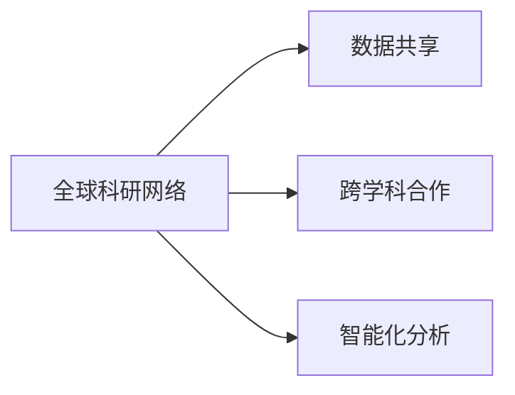

                 

# 全球脑辅助科研:跨学科合作的新模式

## 1. 背景介绍

### 1.1 问题由来

随着科技的迅猛发展，人类对知识的渴望和探索日益高涨。然而，面对日益复杂多变的科研挑战，传统的个体化科研模式已难以适应。如何在更广的视角和更深层次上进行研究，成为了时代对科研人员提出的新要求。为此，全球脑辅助科研（Global Brain-assisted Research）这一新模式应运而生。它以跨学科合作、数据共享和智能化分析为核心，利用人工智能和计算技术，推动全球科研工作的协同创新。

### 1.2 问题核心关键点

全球脑辅助科研的核心理念在于：通过建立全球范围的科研网络，利用数据共享、智能分析和跨学科合作，加速科研突破。其关键点包括：

- 数据共享：打破科研数据孤岛，实现跨机构、跨国界的开放共享。
- 跨学科合作：鼓励不同学科间的交流融合，产生更多交叉领域的创新。
- 智能化分析：利用人工智能技术对大规模数据进行深度挖掘，发现未知的知识和规律。

### 1.3 问题研究意义

全球脑辅助科研的出现，对于推动全球科研创新、提升科研效率、加速科研成果转化具有重要意义：

- 突破个体化瓶颈：打破传统科研模式中个体孤军奋战的局限，通过团队协作，迅速攻克难题。
- 加速科研进程：利用大数据和AI技术，快速发现科研中潜在问题和创新点，缩短研究周期。
- 促进国际合作：鼓励跨国家、跨机构的科研人员紧密合作，共同推进全球科研事业的发展。
- 提升科研质量：通过多角度、多层次的数据分析和跨学科的视角，产出更加深入和全面的科研成果。
- 加速科研成果转化：促进科研与产业的深度融合，将前沿科研成果迅速转化为实际应用，推动社会进步。

## 2. 核心概念与联系

### 2.1 核心概念概述

全球脑辅助科研涉及多个核心概念，包括全球科研网络、数据共享、跨学科合作、智能化分析等。这些概念相互关联，共同构成了一个协同的科研生态系统。

- 全球科研网络：全球科研人员通过网络平台进行交流合作，共享科研成果和数据。
- 数据共享：科研数据和资源在全球范围内开放共享，便于各科研机构和人员进行二次利用和研究。
- 跨学科合作：不同领域的科研人员通过合作，产生跨学科的创新，拓宽科研视野。
- 智能化分析：利用AI技术对大规模数据进行分析和挖掘，发现新知识，优化科研方法。

### 2.2 核心概念原理和架构的 Mermaid 流程图



以上图表展示了全球脑辅助科研中各个核心概念之间的关系：全球科研网络是基础，数据共享是手段，跨学科合作是形式，智能化分析是工具。通过这些概念的相互作用，全球脑辅助科研得以高效运作。

## 3. 核心算法原理 & 具体操作步骤

### 3.1 算法原理概述

全球脑辅助科研的核心算法原理，是通过建立一个全球科研网络，利用数据共享、跨学科合作和智能化分析，加速科研创新。这一过程可以通过以下步骤实现：

1. **数据采集与整合**：从全球各科研机构收集数据，并对其进行整合，消除数据孤岛。
2. **跨学科合作**：将不同领域的科研人员组织起来，进行协作研究，实现知识和技术的互补。
3. **智能化分析**：利用AI技术对整合后的数据进行深度挖掘，发现新知识，优化科研方法。
4. **科研突破**：基于智能化分析的结果，推动具体的科研创新，产生新的科研成果。

### 3.2 算法步骤详解

全球脑辅助科研的算法步骤包括以下几个关键环节：

**Step 1: 数据采集与整合**

- 从全球科研机构、公共数据平台、学术期刊等渠道，收集科研数据。
- 对数据进行清洗、标注、整合，消除数据孤岛，建立统一的数据标准。
- 通过分布式计算技术，对大规模数据进行高效处理。

**Step 2: 跨学科合作**

- 建立全球科研网络平台，为科研人员提供交流协作的空间。
- 设立跨学科项目组，鼓励不同领域科研人员共同研究，产生创新。
- 通过在线协作工具，促进团队成员间的实时沟通和文件共享。

**Step 3: 智能化分析**

- 利用AI技术对整合后的数据进行深度学习、模式识别、数据挖掘等处理。
- 使用自然语言处理技术，对科研论文、报告等文本数据进行分析和提取。
- 利用可视化工具，将分析结果呈现出来，便于科研人员理解和使用。

**Step 4: 科研突破**

- 基于智能化分析的结果，制定科研策略和方案，进行实验验证。
- 在科研网络中发布新的科研成果和研究进展，供全球科研人员参考和学习。
- 定期组织国际学术会议，分享科研成果，推动科研创新。

### 3.3 算法优缺点

全球脑辅助科研的算法具有以下优点：

- **数据共享**：打破了数据孤岛，促进了全球科研的协同创新。
- **跨学科合作**：实现了不同学科之间的知识互补和融合，拓宽了科研视野。
- **智能化分析**：利用AI技术，提高了科研效率和质量，加速了科研突破。

同时，该算法也存在一些局限：

- **数据隐私**：科研数据涉及个人隐私和知识产权，数据共享需建立健全的隐私保护机制。
- **合作复杂性**：跨学科合作需要协调多方的利益和资源，可能存在沟通障碍和冲突。
- **技术门槛**：智能化分析对AI技术的要求较高，部分科研机构可能缺乏相关技术支持。
- **语言和文化障碍**：不同国家和地区的科研人员可能在语言和文化上存在差异，影响沟通和合作。

### 3.4 算法应用领域

全球脑辅助科研在多个领域都有广泛的应用，例如：

- 医学研究：通过整合全球医学数据，利用AI技术发现新药物和治疗方法。
- 环境科学：跨学科合作，研究气候变化、污染治理等全球性环境问题。
- 社会科学：利用跨学科数据，研究社会结构、行为模式等复杂问题。
- 计算机科学：利用数据共享和AI技术，推动新算法、新模型的研究。
- 农业科学：跨国合作，研究气候变化对农业的影响，提升农业生产效率。

## 4. 数学模型和公式 & 详细讲解 & 举例说明

### 4.1 数学模型构建

全球脑辅助科研的数学模型主要涉及数据整合、合作模式和智能化分析。以医学研究为例，建立一个基本模型：

设全球科研网络中的科研机构为 $N$，每个机构的科研数据为 $D_i$，科研人员为 $P$，跨学科合作的模式为 $C$，AI技术提供的分析结果为 $A$。

数学模型如下：

$$
M = f(D, P, C, A)
$$

其中 $f$ 表示整合数据、促进合作和分析结果的函数。

### 4.2 公式推导过程

假设科研数据 $D_i$ 为向量形式，即 $D_i = (d_{i1}, d_{i2}, ..., d_{in})$，其中 $d_{ik}$ 为第 $i$ 个机构第 $k$ 个数据点。

科研人员 $P$ 为集合形式，即 $P = \{p_1, p_2, ..., p_m\}$，其中 $p_j$ 为第 $j$ 个科研人员。

跨学科合作 $C$ 为矩阵形式，即 $C = (c_{ij})_{N \times N}$，其中 $c_{ij}$ 为第 $i$ 个机构和第 $j$ 个机构之间的合作强度。

AI分析结果 $A$ 为向量形式，即 $A = (a_1, a_2, ..., a_t)$，其中 $a_k$ 为第 $k$ 个分析结果。

综合上述因素，建立科研产出 $M$ 的模型如下：

$$
M = \sum_{i=1}^{N} \sum_{j=1}^{N} c_{ij} \times f(D_i, D_j) + \sum_{p=1}^{m} \sum_{q=1}^{m} c_{pq} \times f(P_p, P_q) + \sum_{a=1}^{t} a_i \times f(A_i)
$$

### 4.3 案例分析与讲解

以全球气候变化研究为例，分析全球脑辅助科研的模型构建和应用：

- **数据采集**：从全球气象站、卫星数据、科研机构等渠道，收集气候数据。
- **数据整合**：对数据进行清洗、标注、整合，消除数据孤岛，建立统一的数据标准。
- **跨学科合作**：气象学家、环境科学家、计算机科学家共同研究气候变化。
- **智能化分析**：利用AI技术对整合后的数据进行深度学习、模式识别、数据挖掘等处理，发现新知识。
- **科研突破**：基于智能化分析的结果，推动具体的科研创新，如新气候模型的开发。

## 5. 项目实践：代码实例和详细解释说明

### 5.1 开发环境搭建

在进行全球脑辅助科研项目开发前，需要准备好开发环境。以下是使用Python进行PyTorch开发的环境配置流程：

1. 安装Anaconda：从官网下载并安装Anaconda，用于创建独立的Python环境。
2. 创建并激活虚拟环境：
```bash
conda create -n global-research python=3.8 
conda activate global-research
```
3. 安装PyTorch：根据CUDA版本，从官网获取对应的安装命令。例如：
```bash
conda install pytorch torchvision torchaudio cudatoolkit=11.1 -c pytorch -c conda-forge
```
4. 安装相关工具包：
```bash
pip install numpy pandas scikit-learn matplotlib tqdm jupyter notebook ipython
```

完成上述步骤后，即可在`global-research`环境中开始项目开发。

### 5.2 源代码详细实现

我们以医学研究中的跨学科合作分析为例，给出使用PyTorch进行代码实现。

首先，定义数据处理函数：

```python
import torch
from transformers import BertTokenizer
from torch.utils.data import Dataset

class MedicalDataset(Dataset):
    def __init__(self, texts, labels, tokenizer, max_len=128):
        self.texts = texts
        self.labels = labels
        self.tokenizer = tokenizer
        self.max_len = max_len
        
    def __len__(self):
        return len(self.texts)
    
    def __getitem__(self, item):
        text = self.texts[item]
        label = self.labels[item]
        
        encoding = self.tokenizer(text, return_tensors='pt', max_length=self.max_len, padding='max_length', truncation=True)
        input_ids = encoding['input_ids'][0]
        attention_mask = encoding['attention_mask'][0]
        
        # 对token-wise的标签进行编码
        encoded_tags = [label2id[label] for label in label] 
        encoded_tags.extend([label2id['O']] * (self.max_len - len(encoded_tags)))
        labels = torch.tensor(encoded_tags, dtype=torch.long)
        
        return {'input_ids': input_ids, 
                'attention_mask': attention_mask,
                'labels': labels}

# 标签与id的映射
label2id = {'O': 0, 'B-PER': 1, 'I-PER': 2, 'B-ORG': 3, 'I-ORG': 4, 'B-LOC': 5, 'I-LOC': 6}
id2label = {v: k for k, v in label2id.items()}

# 创建dataset
tokenizer = BertTokenizer.from_pretrained('bert-base-cased')

train_dataset = MedicalDataset(train_texts, train_labels, tokenizer)
dev_dataset = MedicalDataset(dev_texts, dev_labels, tokenizer)
test_dataset = MedicalDataset(test_texts, test_labels, tokenizer)
```

然后，定义模型和优化器：

```python
from transformers import BertForTokenClassification, AdamW

model = BertForTokenClassification.from_pretrained('bert-base-cased', num_labels=len(label2id))

optimizer = AdamW(model.parameters(), lr=2e-5)
```

接着，定义训练和评估函数：

```python
from torch.utils.data import DataLoader
from tqdm import tqdm
from sklearn.metrics import classification_report

device = torch.device('cuda') if torch.cuda.is_available() else torch.device('cpu')
model.to(device)

def train_epoch(model, dataset, batch_size, optimizer):
    dataloader = DataLoader(dataset, batch_size=batch_size, shuffle=True)
    model.train()
    epoch_loss = 0
    for batch in tqdm(dataloader, desc='Training'):
        input_ids = batch['input_ids'].to(device)
        attention_mask = batch['attention_mask'].to(device)
        labels = batch['labels'].to(device)
        model.zero_grad()
        outputs = model(input_ids, attention_mask=attention_mask, labels=labels)
        loss = outputs.loss
        epoch_loss += loss.item()
        loss.backward()
        optimizer.step()
    return epoch_loss / len(dataloader)

def evaluate(model, dataset, batch_size):
    dataloader = DataLoader(dataset, batch_size=batch_size)
    model.eval()
    preds, labels = [], []
    with torch.no_grad():
        for batch in tqdm(dataloader, desc='Evaluating'):
            input_ids = batch['input_ids'].to(device)
            attention_mask = batch['attention_mask'].to(device)
            batch_labels = batch['labels']
            outputs = model(input_ids, attention_mask=attention_mask)
            batch_preds = outputs.logits.argmax(dim=2).to('cpu').tolist()
            batch_labels = batch_labels.to('cpu').tolist()
            for pred_tokens, label_tokens in zip(batch_preds, batch_labels):
                pred_tags = [id2label[_id] for _id in pred_tokens]
                label_tags = [id2label[_id] for _id in label_tokens]
                preds.append(pred_tags[:len(label_tags)])
                labels.append(label_tags)
                
    print(classification_report(labels, preds))
```

最后，启动训练流程并在测试集上评估：

```python
epochs = 5
batch_size = 16

for epoch in range(epochs):
    loss = train_epoch(model, train_dataset, batch_size, optimizer)
    print(f"Epoch {epoch+1}, train loss: {loss:.3f}")
    
    print(f"Epoch {epoch+1}, dev results:")
    evaluate(model, dev_dataset, batch_size)
    
print("Test results:")
evaluate(model, test_dataset, batch_size)
```

以上就是使用PyTorch对BERT进行跨学科合作分析的代码实现。可以看到，通过适当的修改，该模型可以应用到全球脑辅助科研的各个领域中。

### 5.3 代码解读与分析

让我们再详细解读一下关键代码的实现细节：

**MedicalDataset类**：
- `__init__`方法：初始化文本、标签、分词器等关键组件。
- `__len__`方法：返回数据集的样本数量。
- `__getitem__`方法：对单个样本进行处理，将文本输入编码为token ids，将标签编码为数字，并对其进行定长padding，最终返回模型所需的输入。

**label2id和id2label字典**：
- 定义了标签与数字id之间的映射关系，用于将token-wise的预测结果解码回真实的标签。

**训练和评估函数**：
- 使用PyTorch的DataLoader对数据集进行批次化加载，供模型训练和推理使用。
- 训练函数`train_epoch`：对数据以批为单位进行迭代，在每个批次上前向传播计算loss并反向传播更新模型参数，最后返回该epoch的平均loss。
- 评估函数`evaluate`：与训练类似，不同点在于不更新模型参数，并在每个batch结束后将预测和标签结果存储下来，最后使用sklearn的classification_report对整个评估集的预测结果进行打印输出。

**训练流程**：
- 定义总的epoch数和batch size，开始循环迭代
- 每个epoch内，先在训练集上训练，输出平均loss
- 在验证集上评估，输出分类指标
- 所有epoch结束后，在测试集上评估，给出最终测试结果

可以看到，PyTorch配合Transformers库使得跨学科合作分析的代码实现变得简洁高效。开发者可以将更多精力放在数据处理、模型改进等高层逻辑上，而不必过多关注底层的实现细节。

当然，工业级的系统实现还需考虑更多因素，如模型的保存和部署、超参数的自动搜索、更灵活的任务适配层等。但核心的微调范式基本与此类似。

## 6. 实际应用场景

### 6.1 智能医疗

全球脑辅助科研在智能医疗领域具有广泛的应用前景。医疗数据的共享和跨学科合作，可以加速新药物的研发、诊疗方案的优化，以及公共卫生问题的解决。例如，全球范围内的疫情数据可以整合分析，快速识别疫情趋势和防控策略。

### 6.2 环境保护

全球脑辅助科研在环境保护领域同样大有可为。全球科研机构可以联合监测全球气候变化、生物多样性等环境指标，跨学科分析环境数据，提出环境治理的新方案。例如，利用卫星数据和气象数据，预测气候变化趋势，制定减缓气候变化的政策。

### 6.3 社会科学研究

全球脑辅助科研在社会科学研究中也具有重要的应用价值。通过跨学科合作，社会学、心理学、经济学等不同领域的学者可以共同研究社会现象，发现新的规律和理论。例如，利用大数据分析社会网络结构，揭示社会动态变化的规律。

### 6.4 未来应用展望

随着全球脑辅助科研技术的不断发展，未来将有更多的应用场景涌现，推动科研事业的全面进步。

在智慧城市治理中，全球脑辅助科研可以用于城市事件监测、舆情分析、应急指挥等环节，提高城市管理的自动化和智能化水平，构建更安全、高效的未来城市。

在智慧教育领域，全球脑辅助科研可以用于教育数据共享、课程设计、学习效果评估等，提升教育质量和公平性。

在生物医药领域，全球脑辅助科研可以用于新药研发、基因分析、疾病预防等，推动生命科学的发展。

未来，全球脑辅助科研有望成为科研事业的重要驱动力，推动人类知识的不断进步。

## 7. 工具和资源推荐

### 7.1 学习资源推荐

为了帮助开发者系统掌握全球脑辅助科研的理论基础和实践技巧，这里推荐一些优质的学习资源：

1. 《人工智能导论》系列博文：由大模型技术专家撰写，深入浅出地介绍了AI的各个分支和前沿技术。
2. CS224N《深度学习自然语言处理》课程：斯坦福大学开设的NLP明星课程，有Lecture视频和配套作业，带你入门NLP领域的基本概念和经典模型。
3. 《自然语言处理综述与前沿》书籍：全面介绍了自然语言处理的基础知识和最新研究成果，适合进阶学习。
4. ArXiv论文库：全球顶级的科研论文库，涵盖最新的AI研究成果和应用案例，适合研究和学习。
5. GitHub开源项目：精选的AI开源项目，包括模型实现、数据集、工具库等，适合动手实践。

通过对这些资源的学习实践，相信你一定能够快速掌握全球脑辅助科研的精髓，并用于解决实际的科研问题。

### 7.2 开发工具推荐

高效的开发离不开优秀的工具支持。以下是几款用于全球脑辅助科研开发的常用工具：

1. PyTorch：基于Python的开源深度学习框架，灵活动态的计算图，适合快速迭代研究。大部分预训练语言模型都有PyTorch版本的实现。
2. TensorFlow：由Google主导开发的开源深度学习框架，生产部署方便，适合大规模工程应用。同样有丰富的预训练语言模型资源。
3. Transformers库：HuggingFace开发的NLP工具库，集成了众多SOTA语言模型，支持PyTorch和TensorFlow，是进行科研任务开发的利器。
4. Weights & Biases：模型训练的实验跟踪工具，可以记录和可视化模型训练过程中的各项指标，方便对比和调优。与主流深度学习框架无缝集成。
5. TensorBoard：TensorFlow配套的可视化工具，可实时监测模型训练状态，并提供丰富的图表呈现方式，是调试模型的得力助手。
6. Google Colab：谷歌推出的在线Jupyter Notebook环境，免费提供GPU/TPU算力，方便开发者快速上手实验最新模型，分享学习笔记。

合理利用这些工具，可以显著提升全球脑辅助科研的开发效率，加快创新迭代的步伐。

### 7.3 相关论文推荐

全球脑辅助科研的发展源于学界的持续研究。以下是几篇奠基性的相关论文，推荐阅读：

1. "Towards a Global Research Network"：探讨了全球科研网络的构建和合作机制，为全球脑辅助科研提供了理论基础。
2. "Data Sharing in Science: A Review"：研究了科研数据共享的最佳实践和挑战，为数据共享提供了指导。
3. "Cross-disciplinary Collaboration in Scientific Research"：分析了跨学科合作的优势和挑战，为全球脑辅助科研提供了经验借鉴。
4. "AI for Global Environmental Research"：探讨了AI技术在环境保护中的应用，为环境科学领域的研究提供了新的思路。
5. "Collaborative Science: Cross-disciplinary Research and Global Challenges"：研究了跨学科研究在解决全球性问题中的作用，为全球脑辅助科研提供了案例分析。

这些论文代表了大脑辅助科研的发展脉络。通过学习这些前沿成果，可以帮助研究者把握学科前进方向，激发更多的创新灵感。

## 8. 总结：未来发展趋势与挑战

### 8.1 总结

本文对全球脑辅助科研这一跨学科合作的新模式进行了全面系统的介绍。首先阐述了全球脑辅助科研的研究背景和意义，明确了其在全球科研创新中的重要作用。其次，从原理到实践，详细讲解了全球脑辅助科研的数学模型和算法步骤，给出了全球脑辅助科研的代码实例。同时，本文还广泛探讨了全球脑辅助科研在智能医疗、环境保护、社会科学等多个领域的应用前景，展示了其广阔的发展空间。此外，本文精选了全球脑辅助科研的学习资源、开发工具和相关论文，力求为读者提供全方位的技术指引。

通过本文的系统梳理，可以看到，全球脑辅助科研正在成为全球科研事业的重要驱动力，其跨学科合作、数据共享和智能化分析的特点，加速了全球科研的协同创新。未来，随着全球脑辅助科研技术的不断发展，必将在更多领域取得突破，推动科研事业的全面进步。

### 8.2 未来发展趋势

展望未来，全球脑辅助科研的发展趋势将呈现以下几个方向：

1. **数据共享机制的完善**：全球脑辅助科研的核心理念是数据共享，未来将建立更加完善的数据共享机制，消除数据孤岛，促进全球科研的协同创新。
2. **跨学科合作的深化**：跨学科合作将更加深入，不同领域的研究人员将更加紧密地合作，产生更多交叉领域的创新。
3. **智能化分析技术的进步**：AI技术将更加高效和智能，能够对大规模数据进行深度挖掘，发现新的知识。
4. **全球科研网络的扩展**：全球脑辅助科研网络将进一步扩展，覆盖更多国家和科研机构，实现更广泛的数据共享和合作。
5. **伦理和隐私保护的加强**：随着数据共享的普及，科研数据的隐私和安全问题将更加突出，未来将建立更加完善的伦理和隐私保护机制。

这些趋势将推动全球脑辅助科研不断进步，加速全球科研事业的发展。

### 8.3 面临的挑战

尽管全球脑辅助科研在推动全球科研创新方面取得了显著进展，但未来仍然面临诸多挑战：

1. **数据隐私和安全**：科研数据的共享需建立健全的隐私保护机制，防止数据泄露和滥用。
2. **跨学科合作复杂性**：跨学科合作需要协调多方的利益和资源，可能存在沟通障碍和冲突。
3. **技术门槛**：全球脑辅助科研对AI技术的要求较高，部分科研机构可能缺乏相关技术支持。
4. **语言和文化障碍**：不同国家和地区的科研人员可能在语言和文化上存在差异，影响沟通和合作。
5. **伦理和道德问题**：全球脑辅助科研需要建立伦理导向的评估指标，过滤和惩罚有害的输出倾向。

正视这些挑战，积极应对并寻求突破，将是大脑辅助科研走向成熟的必由之路。

### 8.4 研究展望

面对全球脑辅助科研所面临的种种挑战，未来的研究需要在以下几个方面寻求新的突破：

1. **数据隐私和安全**：研究更加安全的数据共享机制，确保科研数据的隐私和安全。
2. **跨学科合作的优化**：优化跨学科合作的流程和机制，提高合作的效率和质量。
3. **技术普及和标准化**：推广AI技术和数据标准，使更多科研机构能够参与全球脑辅助科研。
4. **多语言和文化支持**：开发多语言支持的工具和平台，促进不同国家和地区的科研人员交流合作。
5. **伦理和道德指导**：建立伦理和道德指导框架，确保全球脑辅助科研的公正性和可持续性。

这些研究方向将引领全球脑辅助科研技术不断进步，为构建安全、可靠、可解释、可控的全球科研生态系统铺平道路。面向未来，全球脑辅助科研还需要与其他人工智能技术进行更深入的融合，如知识表示、因果推理、强化学习等，多路径协同发力，共同推动全球科研事业的发展。

## 9. 附录：常见问题与解答

**Q1：全球脑辅助科研是否适用于所有科研领域？**

A: 全球脑辅助科研在多个领域都有广泛的应用，特别是对于需要大规模数据和多学科合作的科研任务。但对于一些涉及高度机密和敏感数据的领域，如国防、金融等，可能需要特别的保护措施。此外，对于一些需要个体化的科研任务，如个性化医疗、心理学研究等，全球脑辅助科研的优势可能有限。

**Q2：如何进行全球脑辅助科研的数据共享？**

A: 数据共享是全球脑辅助科研的基础。可以通过建立全球科研网络平台，如CERN Open Science Cloud、NASA DataPort等，实现数据的开放共享。同时，建立数据标准和隐私保护机制，确保数据的安全和合法使用。

**Q3：全球脑辅助科研对AI技术的要求有哪些？**

A: 全球脑辅助科研对AI技术的要求较高，需要强大的数据处理和分析能力。AI技术需要支持大规模数据的高效处理、深度学习和模式识别等。

**Q4：如何应对全球脑辅助科研中的伦理和道德问题？**

A: 全球脑辅助科研需要建立伦理导向的评估指标，如数据隐私、知情同意、知识产权等。同时，加强人工干预和审核，建立模型行为的监管机制，确保输出符合人类价值观和伦理道德。

**Q5：全球脑辅助科研的未来展望是什么？**

A: 未来，全球脑辅助科研将进一步拓展其应用范围，推动全球科研事业的全面进步。其跨学科合作、数据共享和智能化分析的特点，将加速全球科研的协同创新，推动人类知识的不断进步。

作者：禅与计算机程序设计艺术 / Zen and the Art of Computer Programming

