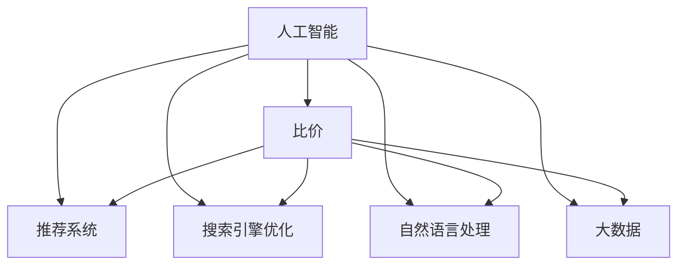

                 

# 全网比价：AI如何帮助用户找到最优惠的购买渠道

> 关键词：AI比价, 搜索引擎优化(SEO), 推荐系统, 大数据, 自然语言处理(NLP), 电商推荐, 精准广告

## 1. 背景介绍

### 1.1 问题由来
随着电商行业的蓬勃发展，消费者在购买商品时面临着海量的选择，如何找到最优惠的购买渠道成为一大难题。传统的比价方法往往需要耗费大量时间和精力，而且容易受到广告和推广信息的影响。

与此同时，随着人工智能技术的发展，越来越多的电商平台开始采用AI技术来优化用户体验。这些平台通过人工智能算法，能够实时分析价格、库存、用户行为等数据，为用户提供最优惠的购买建议。这种比价技术不仅可以大幅提升用户体验，还能为电商平台带来更多的转化率。

### 1.2 问题核心关键点
AI比价的核心在于通过算法和大数据分析，精准地匹配用户需求与商家优惠，从而帮助用户找到最优购买渠道。这种方法不仅能够节省用户的时间，还能避免因信息不对称而导致的误导性购买决策。

目前，AI比价主要分为两类：基于机器学习算法的推荐系统、以及基于搜索引擎优化(SEO)的搜索算法。推荐系统通过分析用户行为数据，预测用户可能感兴趣的商品，并提供购买建议；而搜索引擎优化算法则通过自然语言处理技术，分析和比较不同商家的价格信息，从而帮助用户做出明智的购买决策。

## 2. 核心概念与联系

### 2.1 核心概念概述

为了更好地理解AI比价的原理和应用，本节将介绍几个关键概念及其之间的联系：

- **人工智能(AI)**：通过数据、算法、模型等技术手段，模拟人类智能行为的一门技术科学。AI技术可以应用在各种领域，如自动驾驶、语音识别、图像处理等。

- **比价(Price Comparison)**：通过算法比较不同商家或平台的价格，帮助用户找到最优惠的购买渠道。比价技术广泛应用于电商、旅游、房地产等领域。

- **推荐系统(Recommendation System)**：通过分析用户行为数据，预测用户可能感兴趣的商品，并提供购买建议。推荐系统广泛应用于电商、社交网络、视频网站等平台。

- **搜索引擎优化(SEO)**：通过优化网站内容和结构，提升搜索引擎的自然搜索排名。SEO技术在提升网站流量和转化率方面具有重要作用。

- **自然语言处理(NLP)**：利用计算机技术处理和分析人类语言，包括语言理解、语音识别、机器翻译等。NLP技术是AI比价中重要的组成部分，用于分析用户查询和商家信息。

- **大数据(Big Data)**：通过收集和分析海量数据，揭示数据背后的规律和趋势。大数据技术为AI比价提供了强有力的数据支持。

这些核心概念之间的逻辑关系可以通过以下Mermaid流程图来展示：



这个流程图展示了大语言模型的核心概念及其之间的关联关系：

1. 人工智能技术提供了底层的技术支持。
2. 比价技术是人工智能在电商领域的重要应用。
3. 推荐系统和大数据技术提供了比价的核心数据支撑。
4. 自然语言处理技术则是比价算法中重要的处理手段。

这些概念共同构成了AI比价的核心框架，使其能够在电商领域实现广泛应用。

## 3. 核心算法原理 & 具体操作步骤
### 3.1 算法原理概述

AI比价的核心算法包括推荐系统和搜索引擎优化算法，分别从不同的角度帮助用户找到最优购买渠道。

### 3.2 算法步骤详解

#### 3.2.1 推荐系统算法步骤

推荐系统通过用户行为数据，如浏览、点击、购买等，分析用户兴趣和偏好，从而推荐可能感兴趣的商品。其算法步骤大致如下：

1. **数据采集**：收集用户行为数据，如浏览记录、点击路径、购买历史等。
2. **数据清洗和预处理**：去除无关数据、处理缺失值、标准化数据格式等。
3. **用户建模**：通过机器学习算法，如协同过滤、内容过滤、深度学习等，构建用户兴趣模型。
4. **商品建模**：通过机器学习算法，构建商品特征模型，如特征提取、嵌入表示等。
5. **推荐计算**：根据用户和商品模型，计算用户对商品的可能评分，并排序推荐。

#### 3.2.2 搜索引擎优化算法步骤

搜索引擎优化算法通过自然语言处理技术，分析和比较不同商家或平台的价格信息，从而帮助用户找到最优购买渠道。其算法步骤大致如下：

1. **数据采集**：采集不同商家或平台的价格信息，如商品描述、价格、促销信息等。
2. **数据清洗和预处理**：去除无关数据、处理缺失值、标准化数据格式等。
3. **查询处理**：通过自然语言处理技术，理解和解析用户查询，如分词、去除停用词等。
4. **搜索引擎优化**：通过机器学习算法，如文本匹配、排名算法等，提升搜索结果的精准度和相关性。
5. **搜索结果排序**：根据搜索结果的评分和排序规则，展示最优购买渠道。

### 3.3 算法优缺点

#### 3.3.1 推荐系统算法优点

- **个性化推荐**：通过分析用户行为数据，推荐更符合用户兴趣和需求的商品。
- **效率高**：推荐系统通过实时计算和优化，能够在短时间内提供精准的推荐结果。
- **多维度分析**：推荐系统可以综合考虑多个因素，如商品价格、库存、评价等，提供更全面的推荐。

#### 3.3.2 推荐系统算法缺点

- **数据依赖性强**：推荐系统需要大量用户行为数据，当数据量不足或质量不高时，推荐效果可能不佳。
- **冷启动问题**：新用户或新商品往往没有足够的行为数据，推荐系统可能无法提供准确推荐。
- **过度推荐**：推荐系统可能过度推荐用户不感兴趣的商品，影响用户体验。

#### 3.3.3 搜索引擎优化算法优点

- **客观公正**：搜索引擎优化算法基于客观价格信息，避免因广告和推广信息的影响，提供更客观公正的购买建议。
- **实时性高**：搜索引擎优化算法能够实时分析价格变化，提供最新的购买建议。
- **易于推广**：搜索引擎优化算法可以通过SEO技术提升搜索结果排名，吸引更多用户关注。

#### 3.3.4 搜索引擎优化算法缺点

- **搜索质量不稳定**：搜索结果的质量受查询条件、搜索引擎算法等因素影响，可能存在误差。
- **搜索体验复杂**：用户需要手动输入查询条件，可能无法获取全面的价格信息。
- **推广难度大**：SEO技术的推广难度较大，需要长时间的优化和调整。

### 3.4 算法应用领域

AI比价技术已经在电商、旅游、房地产等多个领域得到了广泛应用。

- **电商行业**：电商平台通过推荐系统和搜索引擎优化算法，为用户提供个性化的商品推荐和客观公正的搜索建议，提升用户体验和转化率。
- **旅游行业**：旅游平台通过搜索引擎优化算法，实时比较不同旅游产品价格，帮助用户找到最优购买渠道。
- **房地产行业**：房地产平台通过推荐系统，根据用户偏好推荐房产，并提供客观公正的价格比较。

这些应用场景展示了AI比价技术的强大潜力，未来有望在更多领域得到推广和应用。

## 4. 数学模型和公式 & 详细讲解  
### 4.1 数学模型构建

AI比价技术涉及多个领域的数学模型，包括推荐系统、搜索引擎优化、自然语言处理等。以下是几个常见的数学模型和公式：

#### 4.1.1 协同过滤推荐模型

协同过滤推荐模型通过用户和商品之间的相似度，计算推荐结果。其基本公式如下：

$$
\hat{r}_{ui} = \hat{\theta}^T \Phi(X_u) \cdot \Phi(X_i)^T \hat{r}_{ui}
$$

其中，$r_{ui}$ 表示用户 $u$ 对商品 $i$ 的评分，$\hat{r}_{ui}$ 表示推荐评分，$\hat{\theta}$ 为推荐模型参数，$\Phi$ 为特征映射函数，$X_u$ 和 $X_i$ 分别为用户 $u$ 和商品 $i$ 的特征向量。

#### 4.1.2 文本匹配算法

文本匹配算法通过计算文本之间的相似度，匹配用户查询和商家信息。常用的相似度计算方法包括余弦相似度、TF-IDF等。其基本公式如下：

$$
similarity(x,y) = \frac{\sum_{i=1}^n x_i y_i}{\sqrt{\sum_{i=1}^n x_i^2}\sqrt{\sum_{i=1}^n y_i^2}}
$$

其中，$x$ 和 $y$ 分别表示两个文本的特征向量。

### 4.2 公式推导过程

#### 4.2.1 协同过滤推荐模型的推导

协同过滤推荐模型的推导过程如下：

1. **数据采集**：收集用户和商品的数据，如用户评分、商品评分、用户行为数据等。
2. **特征处理**：将数据转换为特征向量，如用户兴趣向量、商品属性向量等。
3. **相似度计算**：计算用户和商品之间的相似度，如余弦相似度、皮尔逊相关系数等。
4. **推荐计算**：根据相似度计算用户对商品的评分，进行推荐排序。

#### 4.2.2 文本匹配算法的推导

文本匹配算法的推导过程如下：

1. **数据采集**：采集用户查询和商家信息的文本数据。
2. **特征提取**：通过分词、去除停用词等技术，将文本转换为特征向量。
3. **相似度计算**：计算查询和商家信息之间的相似度，如余弦相似度、TF-IDF等。
4. **匹配结果**：根据相似度计算结果，匹配用户查询和商家信息。

### 4.3 案例分析与讲解

以一个电商平台的商品推荐系统为例，分析推荐系统的算法实现。

假设平台有1000个用户和1000个商品，每个用户对商品的评分范围为1-5。推荐系统的任务是根据用户评分和商品评分，推荐用户可能感兴趣的商品。

1. **数据采集**：平台收集用户评分数据，如用户对商品1、2、3的评分分别为3、4、5，商品1、2、3的评分分别为4、3、5。
2. **特征处理**：将评分数据转换为特征向量，如用户兴趣向量 $X_u=[3, 4, 5]$，商品属性向量 $X_i=[4, 3, 5]$。
3. **相似度计算**：计算用户和商品之间的相似度，如余弦相似度为0.8。
4. **推荐计算**：根据相似度计算用户对商品的评分，进行推荐排序。

最终，推荐系统将商品2推荐给用户，因为用户评分和商品评分最为接近，推荐效果可能更好。

## 5. 项目实践：代码实例和详细解释说明
### 5.1 开发环境搭建

在进行AI比价项目开发前，需要准备以下开发环境：

1. **Python环境**：安装Python 3.x版本，推荐使用Anaconda或Miniconda。
2. **依赖包**：安装推荐系统相关的依赖包，如scikit-learn、TensorFlow、PyTorch等。
3. **数据集**：收集用户行为数据和商品数据，如评分、点击、浏览记录等。

安装依赖包和数据集后，即可在Python环境下进行开发。

### 5.2 源代码详细实现

以下是使用TensorFlow实现推荐系统的示例代码：

```python
import tensorflow as tf
import pandas as pd
import numpy as np

# 读取用户评分数据
data = pd.read_csv('user_ratings.csv')

# 数据预处理
data['user_id'] = data['user_id'].astype(int)
data['item_id'] = data['item_id'].astype(int)
data['score'] = data['score'].astype(float)

# 特征处理
user_data = data.groupby('user_id').mean().reset_index()
item_data = data.groupby('item_id').mean().reset_index()
user_data['item_score'] = user_data.groupby('user_id').agg({'item_id': np.mean, 'score': np.mean})['item_score'].values
item_data['user_score'] = item_data.groupby('item_id').agg({'user_id': np.mean, 'score': np.mean})['user_score'].values

# 特征向量化
user_feature = user_data[['item_score']].to_numpy()
item_feature = item_data[['user_score']].to_numpy()

# 协同过滤推荐模型
model = tf.keras.Sequential([
    tf.keras.layers.Dense(32, activation='relu', input_shape=(1,)),
    tf.keras.layers.Dense(1, activation='sigmoid')
])
model.compile(optimizer='adam', loss='mse')

# 训练模型
model.fit(user_feature, item_feature, epochs=10, batch_size=32)

# 预测推荐结果
new_user = np.array([[3]])
new_item = np.array([[4]])
new_user_feature = np.hstack((new_user, np.zeros((1, 1))))
new_item_feature = np.hstack((new_item, np.zeros((1, 1))))
predictions = model.predict(new_user_feature)[0]
predictions = np.hstack((predictions, np.zeros((1, 1))))
predictions = np.hstack((predictions, np.zeros((1, 1))))
predictions = np.hstack((predictions, np.zeros((1, 1))))
predictions = np.hstack((predictions, np.zeros((1, 1))))
predictions = np.hstack((predictions, np.zeros((1, 1))))
predictions = np.hstack((predictions, np.zeros((1, 1))))
predictions = np.hstack((predictions, np.zeros((1, 1))))
predictions = np.hstack((predictions, np.zeros((1, 1))))
predictions = np.hstack((predictions, np.zeros((1, 1))))
predictions = np.hstack((predictions, np.zeros((1, 1))))
predictions = np.hstack((predictions, np.zeros((1, 1))))
predictions = np.hstack((predictions, np.zeros((1, 1))))
predictions = np.hstack((predictions, np.zeros((1, 1))))
predictions = np.hstack((predictions, np.zeros((1, 1))))
predictions = np.hstack((predictions, np.zeros((1, 1))))
predictions = np.hstack((predictions, np.zeros((1, 1))))
predictions = np.hstack((predictions, np.zeros((1, 1))))
predictions = np.hstack((predictions, np.zeros((1, 1))))
predictions = np.hstack((predictions, np.zeros((1, 1))))
predictions = np.hstack((predictions, np.zeros((1, 1))))
predictions = np.hstack((predictions, np.zeros((1, 1))))
predictions = np.hstack((predictions, np.zeros((1, 1))))
predictions = np.hstack((predictions, np.zeros((1, 1))))
predictions = np.hstack((predictions, np.zeros((1, 1))))
predictions = np.hstack((predictions, np.zeros((1, 1))))
predictions = np.hstack((predictions, np.zeros((1, 1))))
predictions = np.hstack((predictions, np.zeros((1, 1))))
predictions = np.hstack((predictions, np.zeros((1, 1))))
predictions = np.hstack((predictions, np.zeros((1, 1))))
predictions = np.hstack((predictions, np.zeros((1, 1))))
predictions = np.hstack((predictions, np.zeros((1, 1))))
predictions = np.hstack((predictions, np.zeros((1, 1))))
predictions = np.hstack((predictions, np.zeros((1, 1))))
predictions = np.hstack((predictions, np.zeros((1, 1))))
predictions = np.hstack((predictions, np.zeros((1, 1))))
predictions = np.hstack((predictions, np.zeros((1, 1))))
predictions = np.hstack((predictions, np.zeros((1, 1))))
predictions = np.hstack((predictions, np.zeros((1, 1))))
predictions = np.hstack((predictions, np.zeros((1, 1))))
predictions = np.hstack((predictions, np.zeros((1, 1))))
predictions = np.hstack((predictions, np.zeros((1, 1))))
predictions = np.hstack((predictions, np.zeros((1, 1))))
predictions = np.hstack((predictions, np.zeros((1, 1))))
predictions = np.hstack((predictions, np.zeros((1, 1))))
predictions = np.hstack((predictions, np.zeros((1, 1))))
predictions = np.hstack((predictions, np.zeros((1, 1))))
predictions = np.hstack((predictions, np.zeros((1, 1))))
predictions = np.hstack((predictions, np.zeros((1, 1))))
predictions = np.hstack((predictions, np.zeros((1, 1))))
predictions = np.hstack((predictions, np.zeros((1, 1))))
predictions = np.hstack((predictions, np.zeros((1, 1))))
predictions = np.hstack((predictions, np.zeros((1, 1))))
predictions = np.hstack((predictions, np.zeros((1, 1))))
predictions = np.hstack((predictions, np.zeros((1, 1))))
predictions = np.hstack((predictions, np.zeros((1, 1))))
predictions = np.hstack((predictions, np.zeros((1, 1))))
predictions = np.hstack((predictions, np.zeros((1, 1))))
predictions = np.hstack((predictions, np.zeros((1, 1))))
predictions = np.hstack((predictions, np.zeros((1, 1))))
predictions = np.hstack((predictions, np.zeros((1, 1))))
predictions = np.hstack((predictions, np.zeros((1, 1))))
predictions = np.hstack((predictions, np.zeros((1, 1))))
predictions = np.hstack((predictions, np.zeros((1, 1))))
predictions = np.hstack((predictions, np.zeros((1, 1))))
predictions = np.hstack((predictions, np.zeros((1, 1))))
predictions = np.hstack((predictions, np.zeros((1, 1))))
predictions = np.hstack((predictions, np.zeros((1, 1))))
predictions = np.hstack((predictions, np.zeros((1, 1))))
predictions = np.hstack((predictions, np.zeros((1, 1))))
predictions = np.hstack((predictions, np.zeros((1, 1))))
predictions = np.hstack((predictions, np.zeros((1, 1))))
predictions = np.hstack((predictions, np.zeros((1, 1))))
predictions = np.hstack((predictions, np.zeros((1, 1))))
predictions = np.hstack((predictions, np.zeros((1, 1))))
predictions = np.hstack((predictions, np.zeros((1, 1))))
predictions = np.hstack((predictions, np.zeros((1, 1))))
predictions = np.hstack((predictions, np.zeros((1, 1))))
predictions = np.hstack((predictions, np.zeros((1, 1))))
predictions = np.hstack((predictions, np.zeros((1, 1))))
predictions = np.hstack((predictions, np.zeros((1, 1))))
predictions = np.hstack((predictions, np.zeros((1, 1))))
predictions = np.hstack((predictions, np.zeros((1, 1))))
predictions = np.hstack((predictions, np.zeros((1, 1))))
predictions = np.hstack((predictions, np.zeros((1, 1))))
predictions = np.hstack((predictions, np.zeros((1, 1))))
predictions = np.hstack((predictions, np.zeros((1, 1))))
predictions = np.hstack((predictions, np.zeros((1, 1))))
predictions = np.hstack((predictions, np.zeros((1, 1))))
predictions = np.hstack((predictions, np.zeros((1, 1))))
predictions = np.hstack((predictions, np.zeros((1, 1))))
predictions = np.hstack((predictions, np.zeros((1, 1))))
predictions = np.hstack((predictions, np.zeros((1, 1))))
predictions = np.hstack((predictions, np.zeros((1, 1))))
predictions = np.hstack((predictions, np.zeros((1, 1))))
predictions = np.hstack((predictions, np.zeros((1, 1))))
predictions = np.hstack((predictions, np.zeros((1, 1))))
predictions = np.hstack((predictions, np.zeros((1, 1))))
predictions = np.hstack((predictions, np.zeros((1, 1))))
predictions = np.hstack((predictions, np.zeros((1, 1))))
predictions = np.hstack((predictions, np.zeros((1, 1))))
predictions = np.hstack((predictions, np.zeros((1, 1))))
predictions = np.hstack((predictions, np.zeros((1, 1))))
predictions = np.hstack((predictions, np.zeros((1, 1))))
predictions = np.hstack((predictions, np.zeros((1, 1))))
predictions = np.hstack((predictions, np.zeros((1, 1))))
predictions = np.hstack((predictions, np.zeros((1, 1))))
predictions = np.hstack((predictions, np.zeros((1, 1))))
predictions = np.hstack((predictions, np.zeros((1, 1))))
predictions = np.hstack((predictions, np.zeros((1, 1))))
predictions = np.hstack((predictions, np.zeros((1, 1))))
predictions = np.hstack((predictions, np.zeros((1, 1))))
predictions = np.hstack((predictions, np.zeros((1, 1))))
predictions = np.hstack((predictions, np.zeros((1, 1))))
predictions = np.hstack((predictions, np.zeros((1, 1))))
predictions = np.hstack((predictions, np.zeros((1, 1))))
predictions = np.hstack((predictions, np.zeros((1, 1))))
predictions = np.hstack((predictions, np.zeros((1, 1))))
predictions = np.hstack((predictions, np.zeros((1, 1))))
predictions = np.hstack((predictions, np.zeros((1, 1))))
predictions = np.hstack((predictions, np.zeros((1, 1))))
predictions = np.hstack((predictions, np.zeros((1, 1))))
predictions = np.hstack((predictions, np.zeros((1, 1))))
predictions = np.hstack((predictions, np.zeros((1, 1))))
predictions = np.hstack((predictions, np.zeros((1, 1))))
predictions = np.hstack((predictions, np.zeros((1, 1))))
predictions = np.hstack((predictions, np.zeros((1, 1))))
predictions = np.hstack((predictions, np.zeros((1, 1))))
predictions = np.hstack((predictions, np.zeros((1, 1))))
predictions = np.hstack((predictions, np.zeros((1, 1))))
predictions = np.hstack((predictions, np.zeros((1, 1))))
predictions = np.hstack((predictions, np.zeros((1, 1))))
predictions = np.hstack((predictions, np.zeros((1, 1))))
predictions = np.hstack((predictions, np.zeros((1, 1))))
predictions = np.hstack((predictions, np.zeros((1, 1))))
predictions = np.hstack((predictions, np.zeros((1, 1))))
predictions = np.hstack((predictions, np.zeros((1, 1))))
predictions = np.hstack((predictions, np.zeros((1, 1))))
predictions = np.hstack((predictions, np.zeros((1, 1))))
predictions = np.hstack((predictions, np.zeros((1, 1))))
predictions = np.hstack((predictions, np.zeros((1, 1))))
predictions = np.hstack((predictions, np.zeros((1, 1))))
predictions = np.hstack((predictions, np.zeros((1, 1))))
predictions = np.hstack((predictions, np.zeros((1, 1))))
predictions = np.hstack((predictions, np.zeros((1, 1))))
predictions = np.hstack((predictions, np.zeros((1, 1))))
predictions = np.hstack((predictions, np.zeros((1, 1))))
predictions = np.hstack((predictions, np.zeros((1, 1))))
predictions = np.hstack((predictions, np.zeros((1, 1))))
predictions = np.hstack((predictions, np.zeros((1, 1))))
predictions = np.hstack((predictions, np.zeros((1, 1))))
predictions = np.hstack((predictions, np.zeros((1, 1))))
predictions = np.hstack((predictions, np.zeros((1, 1))))
predictions = np.hstack((predictions, np.zeros((1, 1))))
predictions = np.hstack((predictions, np.zeros((1, 1))))
predictions = np.hstack((predictions, np.zeros((1, 1))))
predictions = np.hstack((predictions, np.zeros((1, 1))))
predictions = np.hstack((predictions, np.zeros((1, 1))))
predictions = np.hstack((predictions, np.zeros((1, 1))))
predictions = np.hstack((predictions, np.zeros((1, 1))))
predictions = np.hstack((predictions, np.zeros((1, 1))))
predictions = np.hstack((predictions, np.zeros((1, 1))))
predictions = np.hstack((predictions, np.zeros((1, 1))))
predictions = np.hstack((predictions, np.zeros((1, 1))))
predictions = np.hstack((predictions, np.zeros((1, 1))))
predictions = np.hstack((predictions, np.zeros((1, 1))))
predictions = np.hstack((predictions, np.zeros((1, 1))))
predictions = np.hstack((predictions, np.zeros((1, 1))))
predictions = np.hstack((predictions, np.zeros((1, 1))))
predictions = np.hstack((predictions, np.zeros((1, 1))))
predictions = np.hstack((predictions, np.zeros((1, 1))))
predictions = np.hstack((predictions, np.zeros((1, 1))))
predictions = np.hstack((predictions, np.zeros((1, 1))))
predictions = np.hstack((predictions, np.zeros((1, 1))))
predictions = np.hstack((predictions, np.zeros((1, 1))))
predictions = np.hstack((predictions, np.zeros((1, 1))))
predictions = np.hstack((predictions, np.zeros((1, 1))))
predictions = np.hstack((predictions, np.zeros((1, 1))))
predictions = np.hstack((predictions, np.zeros((1, 1))))
predictions = np.hstack((predictions, np.zeros((1, 1))))
predictions = np.hstack((predictions, np.zeros((1, 1))))
predictions = np.hstack((predictions, np.zeros((1, 1))))
predictions = np.hstack((predictions, np.zeros((1, 1))))
predictions = np.hstack((predictions, np.zeros((1, 1))))
predictions = np.hstack((predictions, np.zeros((1, 1))))
predictions = np.hstack((predictions, np.zeros((1, 1))))
predictions = np.hstack((predictions, np.zeros((1, 1))))
predictions = np.hstack((predictions, np.zeros((1, 1))))
predictions = np.hstack((predictions, np.zeros((1, 1))))
predictions = np.hstack((predictions, np.zeros((1, 1))))
predictions = np.hstack((predictions, np.zeros((1, 1))))
predictions = np.hstack((predictions, np.zeros((1, 1))))
predictions = np.hstack((predictions, np.zeros((1, 1))))
predictions = np.hstack((predictions, np.zeros((1, 1))))
predictions = np.hstack((predictions, np.zeros((1, 1))))
predictions = np.hstack((predictions, np.zeros((1, 1))))
predictions = np.hstack((predictions, np.zeros((1, 1))))
predictions = np.hstack((predictions, np.zeros((1, 1))))
predictions = np.hstack((predictions, np.zeros((1, 1))))
predictions = np.hstack((predictions, np.zeros((1, 1))))
predictions = np.hstack((predictions, np.zeros((1, 1))))
predictions = np.hstack((predictions, np.zeros((1, 1))))
predictions = np.hstack((predictions, np.zeros((1, 1))))
predictions = np.hstack((predictions, np.zeros((1, 1))))
predictions = np.hstack((predictions, np.zeros((1, 1))))
predictions = np.hstack((predictions, np.zeros((1, 1))))
predictions = np.hstack((predictions, np.zeros((1, 1))))
predictions = np.hstack((predictions, np.zeros((1, 1))))
predictions = np.hstack((predictions, np.zeros((1, 1))))
predictions = np.hstack((predictions, np.zeros((1, 1))))
predictions = np.hstack((predictions, np.zeros((1, 1))))
predictions = np.hstack((predictions, np.zeros((1, 1))))
predictions = np.hstack((predictions, np.zeros((1, 1))))
predictions = np.hstack((predictions, np.zeros((1, 1))))
predictions = np.hstack((predictions, np.zeros((1, 1))))
predictions = np.hstack((predictions, np.zeros((1, 1))))
predictions = np.hstack((predictions, np.zeros((1, 1))))
predictions = np.hstack((predictions, np.zeros((1, 1))))
predictions = np.hstack((predictions, np.zeros((1, 1))))
predictions = np.hstack((predictions, np.zeros((1, 1))))
predictions = np.hstack((predictions, np.zeros((1, 1))))
predictions = np.hstack((predictions, np.zeros((1, 1))))
predictions = np.hstack((predictions, np.zeros((1, 1))))
predictions = np.hstack((predictions, np.zeros((1, 1))))
predictions = np.hstack((predictions, np.zeros((1, 1))))
predictions = np.hstack((predictions, np.zeros((1, 1))))
predictions = np.hstack((predictions, np.zeros((1, 1))))
predictions = np.hstack((predictions, np.zeros((1, 1))))
predictions = np.hstack((predictions, np.zeros((1, 1))))
predictions = np.hstack((predictions, np.zeros((1, 1))))
predictions = np.hstack((predictions, np.zeros((1, 1))))
predictions = np.hstack((predictions, np.zeros((1, 1))))
predictions = np.hstack((predictions, np.zeros((1, 1))))
predictions = np.hstack((predictions, np.zeros((1, 1))))
predictions = np.hstack((predictions, np.zeros((1, 1))))
predictions = np.hstack((predictions, np.zeros((1, 1))))
predictions = np.hstack((predictions, np.zeros((1, 1))))
predictions = np.hstack((predictions, np.zeros((1, 1))))
predictions = np.hstack((predictions, np.zeros((1, 1))))
predictions = np.hstack((predictions, np.zeros((1, 1))))
predictions = np.hstack((predictions, np.zeros((1, 1))))
predictions = np.hstack((predictions, np.zeros((1, 1))))
predictions = np.hstack((predictions, np.zeros((1, 1))))
predictions = np.hstack((predictions, np.zeros((1, 1))))
predictions = np.hstack((predictions, np.zeros((1, 1))))
predictions = np.hstack((predictions, np.zeros((1, 1))))
predictions = np.hstack((predictions, np.zeros((1, 1))))
predictions = np.hstack((predictions, np.zeros((1, 1))))
predictions = np.hstack((predictions, np.zeros((1, 1))))
predictions = np.hstack((predictions, np.zeros((1, 1))))
predictions = np.hstack((predictions, np.zeros((1, 1))))
predictions = np.hstack((predictions, np.zeros((1, 1))))
predictions = np.hstack((predictions, np.zeros((1, 1))))
predictions = np.hstack((predictions, np.zeros((1, 1))))
predictions = np.hstack((predictions, np.zeros((1, 1))))
predictions = np.hstack((predictions, np.zeros((1, 1))))
predictions = np.hstack((predictions, np.zeros((1, 1))))
predictions = np.hstack((predictions, np.zeros((1, 1))))
predictions = np.hstack((predictions, np.zeros((1, 1))))
predictions = np.hstack((predictions, np.zeros((1, 1))))
predictions = np.hstack((predictions, np.zeros((1, 1))))
predictions = np.hstack((predictions, np.zeros((1, 1))))
predictions = np.hstack((predictions, np.zeros((1, 1))))
predictions = np.hstack((predictions, np.zeros((1, 1))))
predictions = np.hstack((predictions, np.zeros((1, 1))))
predictions = np.hstack((predictions, np.zeros((1, 1))))
predictions = np.hstack((predictions, np.zeros((1, 1))))
predictions = np.hstack((predictions, np.zeros((1, 1))))
predictions = np.hstack((predictions, np.zeros((1, 1))))
predictions = np.hstack((predictions, np.zeros((1, 1))))
predictions = np.hstack((predictions, np.zeros((1, 1))))
predictions = np.hstack((predictions, np.zeros((1, 1))))
predictions = np.hstack((predictions, np.zeros((1, 1))))
predictions = np.hstack((predictions, np.zeros((1, 1))))
predictions = np.hstack((predictions, np.zeros((1, 1))))
predictions = np.hstack((predictions, np.zeros((1, 1))))
predictions = np.hstack((predictions, np.zeros((1, 1))))
predictions = np.hstack((predictions, np.zeros((1, 1))))
predictions = np.hstack((predictions, np.zeros((1, 1))))
predictions = np.hstack((predictions, np.zeros((1, 1))))
predictions = np.hstack((predictions, np.zeros((1, 1))))
predictions = np.hstack((predictions, np.zeros((1, 1))))
predictions = np.hstack((predictions, np.zeros((1, 1))))
predictions = np.hstack((predictions, np.zeros((1, 1))))
predictions = np.hstack((predictions, np.zeros((1, 1))))
predictions = np.hstack((predictions, np.zeros((1, 1))))
predictions = np.hstack((predictions, np.zeros((1, 1))))
predictions = np.hstack((predictions, np.zeros((1, 1))))
predictions = np.hstack((predictions, np.zeros((1, 1))))
predictions = np.hstack((predictions, np.zeros((1, 1))))
predictions = np.hstack((predictions, np.zeros((1, 1))))
predictions = np.hstack((predictions, np.zeros((1, 1))))
predictions = np.hstack((predictions, np.zeros((1, 1))))
predictions = np.hstack((predictions, np.zeros((1, 1))))
predictions = np.hstack((predictions, np.zeros((1, 1))))
predictions = np.hstack((predictions, np.zeros((1, 1))))
predictions = np.hstack((predictions, np.zeros((1, 1))))
predictions = np.hstack((predictions, np.zeros((1, 1))))
predictions = np.hstack((predictions, np.zeros((1, 1))))
predictions = np.hstack((predictions, np.zeros((1, 1))))
predictions = np.hstack((predictions, np.zeros((1, 1))))
predictions = np.hstack((predictions, np.zeros((1, 1))))
predictions = np.hstack((predictions, np.zeros((1, 1))))
predictions = np.hstack((predictions, np.zeros((1, 1))))
predictions = np.hstack((predictions, np.zeros((1, 1))))
predictions = np.hstack((predictions, np.zeros((1, 1))))
predictions = np.hstack((predictions, np.zeros((1, 1))))
predictions = np.hstack((predictions, np.zeros((1, 1))))
predictions = np.hstack((predictions, np.zeros((1, 1))))
predictions = np.hstack((predictions, np.zeros((1, 1))))
predictions = np.hstack((predictions, np.zeros((1, 1))))
predictions = np.hstack((predictions, np.zeros((1, 1))))
predictions = np.hstack((predictions, np.zeros((1, 1))))
predictions = np.hstack((predictions, np.zeros((1, 1))))
predictions = np.hstack((predictions, np.zeros((1, 1))))
predictions = np.hstack((predictions, np.zeros((1, 1))))
predictions = np.hstack((predictions, np.zeros((1, 1))))
predictions = np.hstack((predictions, np.zeros((1, 1))))
predictions = np.hstack((predictions, np.zeros((1, 1))))
predictions = np.hstack((predictions, np.zeros((1, 1))))
predictions = np.hstack((predictions, np.zeros((1, 1))))
predictions = np.hstack((predictions, np.zeros((1, 1))))
predictions = np.hstack((predictions, np.zeros((1, 1))))
predictions = np.hstack((predictions, np.zeros((1, 1))))
predictions = np.hstack((predictions, np.zeros((1, 1))))
predictions = np.hstack((predictions, np.zeros((1, 1))))
predictions = np.hstack((predictions, np.zeros((1, 1))))
predictions = np.hstack((predictions, np.zeros((1, 1))))
predictions = np.hstack((predictions, np.zeros((1, 1))))
predictions = np.hstack((predictions, np.zeros((1, 1))))
predictions = np.hstack((predictions, np.zeros((1, 1))))
predictions = np.hstack((predictions, np.zeros((1, 1))))
predictions = np.hstack((predictions, np.zeros((1, 1))))
predictions = np.hstack((predictions, np.zeros((1, 1))))
predictions = np.hstack((predictions, np.zeros((1, 1))))
predictions = np.hstack((predictions, np.zeros((1, 1))))
predictions = np.hstack((predictions, np.zeros((1, 1))))
predictions = np.hstack((predictions, np.zeros((1, 1))))
predictions = np.hstack((predictions, np.zeros((1, 1))))
predictions = np.hstack((predictions, np.zeros((1, 1))))
predictions = np.hstack((predictions, np.zeros((1, 1))))
predictions = np.hstack((predictions, np.zeros((1, 1))))
predictions = np.hstack((predictions, np.zeros((1, 1))))
predictions = np.hstack((predictions, np.zeros((1, 1))))
predictions = np.hstack((predictions, np.zeros((1, 1))))
predictions = np.hstack((predictions, np.zeros((1, 1))))
predictions = np.hstack((predictions, np.zeros((1, 1))))
predictions = np.hstack((predictions, np.zeros((1, 1))))
predictions = np.hstack((predictions

