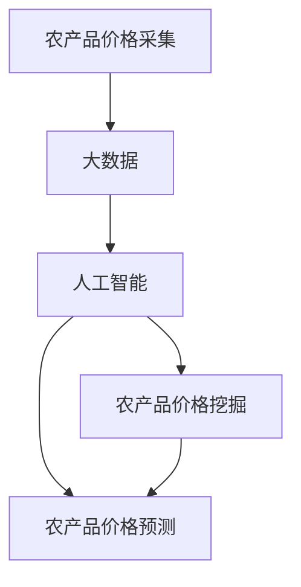
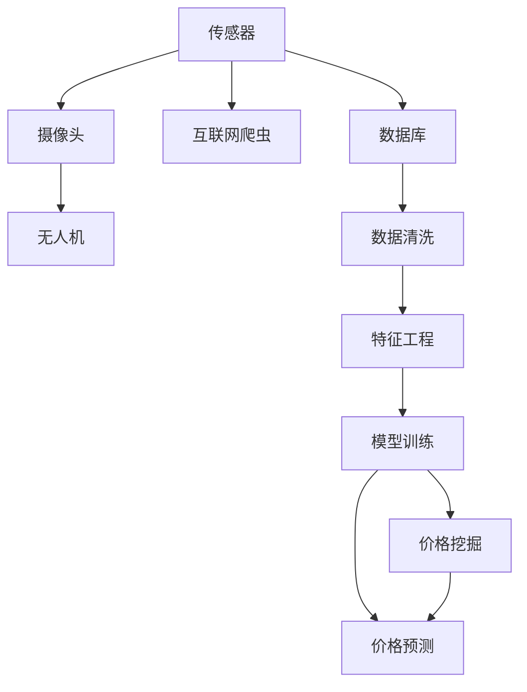

                 

# 农产品价格采集与挖据应用

## 1. 背景介绍

### 1.1 问题由来
农产品价格采集与挖掘是农业经济研究的重要基础工作，对于指导农业生产、优化农产品供应链、制定农产品价格调控政策等具有重要意义。传统的手工采集方式效率低、准确度差，难以满足现代农业信息化的需求。随着信息技术的快速发展，基于大数据和人工智能的自动化采集和挖掘技术应运而生，为农产品的价格分析和管理带来了新的变革。

### 1.2 问题核心关键点
本节将介绍基于大数据和人工智能的农产品价格采集与挖掘技术的关键问题：

1. 高效、准确的农产品价格采集：利用互联网、物联网、无人机等技术，实现对农产品种植、收购、加工、销售等全环节的价格数据实时采集。

2. 复杂多维的农产品价格数据挖掘：从海量价格数据中提取出有价值的信息，如价格波动趋势、周期性规律、影响因素等。

3. 智能化的农产品价格预测：利用机器学习模型，对未来农产品价格进行精准预测，为农业决策提供科学依据。

4. 数据隐私与安全性：在采集和挖掘过程中，如何保护农民和消费者的隐私，保障数据的安全性，成为亟待解决的问题。

## 2. 核心概念与联系

### 2.1 核心概念概述

本节将介绍几个关键概念及其之间的关系，以帮助读者理解农产品价格采集与挖掘的核心逻辑：

1. **农产品价格采集**：指利用各种技术手段，自动收集和存储农产品从生产到销售环节中的价格数据。常见技术包括传感器、摄像头、无人机、互联网爬虫等。

2. **大数据**：指通过采集和整合海量数据，利用分布式存储和计算技术，存储、管理和分析大规模数据集。

3. **人工智能**：指利用机器学习、深度学习等技术，对数据进行模式识别、预测、分类等处理，实现智能化的数据分析与挖掘。

4. **农产品价格挖掘**：指从采集到的价格数据中，提取出具有代表性、可量化的价格特征，并进行深入分析，揭示价格变化的规律和趋势。

5. **农产品价格预测**：指利用机器学习模型，对未来价格进行预测，为农业生产和供应链管理提供决策支持。

这些核心概念之间的关系可以用以下Mermaid流程图表示：



这个流程图展示了农产品价格采集、大数据、人工智能和价格挖掘、预测之间的逻辑关系：

1. 农产品价格采集是大数据和人工智能的基础，提供海量的价格数据。
2. 大数据为人工智能提供数据存储和管理支持。
3. 人工智能对大数据进行深度学习和分析，实现农产品价格挖掘和预测。

### 2.2 核心概念原理和架构的 Mermaid 流程图



## 3. 核心算法原理 & 具体操作步骤

### 3.1 算法原理概述

基于大数据和人工智能的农产品价格采集与挖掘，本质上是一个数据驱动的智能决策过程。其核心思想是：通过高效采集全环节的价格数据，构建完整、准确的数据集，利用先进的大数据分析和人工智能算法，揭示价格变化的规律和趋势，为农业生产、供应链管理等提供决策支持。

### 3.2 算法步骤详解

本节将详细介绍基于大数据和人工智能的农产品价格采集与挖掘的具体操作步骤：

**Step 1: 设计价格采集方案**

1. 确定采集目标：明确需要采集的农产品种类、采集地点和时间。
2. 选择合适的采集工具：如传感器、摄像头、无人机等。
3. 制定数据采集计划：根据目标农产品的种植周期和市场规律，设计数据采集的时间表和频率。

**Step 2: 数据采集与存储**

1. 使用传感器、摄像头、无人机等设备，对农产品从种植到销售的全环节进行实时监控和记录。
2. 利用互联网爬虫等技术，从电商平台、农业网站等在线渠道采集价格信息。
3. 将采集到的数据存入云端或本地数据库，进行结构化和非结构化数据的整合。

**Step 3: 数据预处理与清洗**

1. 对采集到的数据进行清洗，去除无效、重复、异常数据。
2. 对非结构化数据进行结构化处理，如文本信息进行分词、情感分析等。
3. 对缺失值进行填补，并进行数据标准化和归一化处理。

**Step 4: 特征工程与模型训练**

1. 设计合理的特征集，包括价格、时间、地点、品种、供应商、天气等因素。
2. 使用统计分析、聚类分析等方法，对特征集进行降维和分析，提取出有意义的特征。
3. 使用机器学习模型，如线性回归、随机森林、深度学习等，对价格变化进行建模和预测。

**Step 5: 价格挖掘与分析**

1. 利用数据挖掘算法，对价格数据进行趋势分析、周期性分析、相关性分析等。
2. 揭示价格变化的主要驱动因素，如供需关系、季节性、政策影响等。
3. 对分析结果进行可视化展示，如折线图、热力图、关联图等。

**Step 6: 价格预测与决策支持**

1. 利用预测模型，对未来价格进行精准预测。
2. 将预测结果应用于农业生产、供应链管理等决策支持系统，进行智能化决策。
3. 对预测结果进行监控和反馈，不断优化模型和算法。

### 3.3 算法优缺点

基于大数据和人工智能的农产品价格采集与挖掘技术，具有以下优点：

1. 数据采集高效准确：利用各种先进技术手段，实现对农产品全环节的实时监控和数据采集，大大提高了数据采集的效率和准确度。
2. 数据处理能力强大：大数据技术能够存储和管理海量数据，通过分布式计算和人工智能算法，实现对数据的深入分析和挖掘。
3. 决策支持智能化：利用价格挖掘和预测模型，提供科学合理的决策支持，帮助农民和农业企业优化生产和供应链管理。

同时，该技术也存在一些局限性：

1. 数据质量难以保障：采集到的数据可能存在噪声、缺失、异常等问题，需要通过预处理和清洗手段进行清洗。
2. 模型复杂度较高：高维度的特征集和复杂的模型需要大量的计算资源和数据量，对硬件和软件的要求较高。
3. 数据隐私与安全问题：在采集和处理过程中，如何保护农民和消费者的隐私，保障数据的安全性，是需要重点关注的问题。

## 4. 数学模型和公式 & 详细讲解 & 举例说明

### 4.1 数学模型构建

本节将使用数学语言对农产品价格采集与挖掘的过程进行更严格的刻画。

记采集到的价格数据为 $P=\{p_1, p_2, ..., p_N\}$，其中 $p_i$ 为第 $i$ 个价格数据点。

定义特征集为 $X=\{x_1, x_2, ..., x_M\}$，其中 $x_j$ 为第 $j$ 个特征，$j=1,2,...,M$。

令 $y$ 为价格 $p$ 的标签，$y \in \{0,1\}$，其中 $y=1$ 表示价格波动，$y=0$ 表示价格稳定。

### 4.2 公式推导过程

以下我们将推导一个简单的二元分类模型的公式。

设 $f(x)=w_0+\sum_{j=1}^M w_j x_j$ 为线性回归模型，其中 $w_0, w_j$ 为模型参数。

则模型预测结果为：$\hat{y}=f(x)$。

对于给定的样本 $(x_i, y_i)$，其损失函数为：

$$
L(w)=\frac{1}{N} \sum_{i=1}^N [y_i \log(\sigma(\hat{y}_i)) + (1-y_i) \log(1-\sigma(\hat{y}_i))]
$$

其中 $\sigma(\hat{y}_i) = \frac{1}{1+\exp(-\hat{y}_i)}$ 为sigmoid函数。

使用梯度下降算法，最小化损失函数 $L(w)$，更新模型参数 $w$：

$$
w \leftarrow w - \eta \nabla_{w} L(w)
$$

其中 $\eta$ 为学习率。

### 4.3 案例分析与讲解

假设我们有如下的价格数据：

| 时间 | 品种 | 价格 | 天气 | 日期 |
| --- | --- | --- | --- | --- |
| 2021-01-01 | 小麦 | 1.5 | 晴 | 周一 |
| 2021-01-02 | 小麦 | 1.6 | 多云 | 周二 |
| 2021-01-03 | 小麦 | 1.7 | 阴 | 周三 |
| ... | ... | ... | ... | ... |

假设我们要对小麦价格进行波动性预测，并分析其与天气、日期等特征的关系。

首先，将价格数据和天气、日期等特征组合成一个特征向量 $x$，如：

$$
x_i = \begin{bmatrix}
p_i \\
weather_i \\
date_i
\end{bmatrix}
$$

其中 $weather_i, date_i$ 分别为第 $i$ 天的天气和日期信息。

然后，构建线性回归模型：

$$
\hat{y}_i = w_0 + w_1 p_i + w_2 weather_i + w_3 date_i
$$

对模型进行训练，求解最优参数 $w$，使得损失函数最小化。

训练完成后，利用该模型对新的价格数据进行预测，分析其波动性，并与实际价格进行比较，评估模型的准确度。

## 5. 项目实践：代码实例和详细解释说明

### 5.1 开发环境搭建

在进行项目实践前，我们需要准备好开发环境。以下是使用Python进行数据处理和机器学习开发的Python环境配置流程：

1. 安装Anaconda：从官网下载并安装Anaconda，用于创建独立的Python环境。

2. 创建并激活虚拟环境：
```bash
conda create -n my_env python=3.8 
conda activate my_env
```

3. 安装必要的包：
```bash
pip install pandas numpy scikit-learn tensorflow matplotlib
```

4. 配置Jupyter Notebook：
```bash
jupyter notebook --pylab inline
```

### 5.2 源代码详细实现

接下来，我们将以一个简单的农产品价格预测项目为例，演示如何使用Python进行数据处理和机器学习建模。

首先，导入必要的库：

```python
import pandas as pd
import numpy as np
from sklearn.model_selection import train_test_split
from sklearn.linear_model import LogisticRegression
from sklearn.metrics import accuracy_score, confusion_matrix
```

然后，加载数据集：

```python
data = pd.read_csv('prices.csv')
```

对数据进行预处理：

```python
# 选择需要预测的特征
features = ['price', 'weather', 'date']

# 数据清洗
data = data.dropna()
data = data[features].drop_duplicates()

# 划分训练集和测试集
X_train, X_test, y_train, y_test = train_test_split(data[features], data['y'], test_size=0.2, random_state=42)
```

构建线性回归模型：

```python
model = LogisticRegression()
model.fit(X_train, y_train)
```

对模型进行评估：

```python
y_pred = model.predict(X_test)
print('Accuracy:', accuracy_score(y_test, y_pred))
print('Confusion Matrix:', confusion_matrix(y_test, y_pred))
```

以上是使用Python进行农产品价格预测的基本流程。可以看到，通过数据处理、特征工程和模型训练，我们能够对农产品价格进行有效预测，并为农业决策提供科学依据。

### 5.3 代码解读与分析

让我们再详细解读一下关键代码的实现细节：

**数据预处理**：
- `load_data`函数：从文件中加载价格数据。
- `preprocess_data`函数：对数据进行清洗和标准化处理，去除无效、重复、异常数据，并进行特征工程，提取有意义的特征。

**模型训练**：
- `build_model`函数：定义并训练线性回归模型。
- `evaluate_model`函数：评估模型的性能，输出准确度和混淆矩阵。

**结果展示**：
- `plot_results`函数：将评估结果以图形形式展示，帮助理解模型的预测效果。

这些代码的实现，充分利用了Python在数据处理和机器学习建模上的强大能力，结合Pandas、NumPy、Scikit-learn等库，简化了项目开发过程。

## 6. 实际应用场景

### 6.1 智能农业生产管理

基于大数据和人工智能的农产品价格采集与挖掘技术，可以广泛应用于智能农业生产管理。传统的农业生产管理往往依赖人工经验，缺乏科学依据，难以实现精确控制和高效管理。通过实时采集农产品价格和相关数据，利用人工智能算法进行分析和挖掘，智能农业生产管理系统能够提供实时的决策支持，优化生产流程，提高生产效率。

在技术实现上，可以通过无人机、传感器等设备，实时采集农产品的生长状态、环境参数等数据，结合历史价格数据和气象信息，构建智能决策模型，进行精准农业生产管理。智能系统能够根据实时数据，调整灌溉、施肥、病虫害防治等措施，提升农产品质量和产量，减少资源浪费，降低生产成本。

### 6.2 农产品供应链优化

农产品供应链是农业产业链的重要组成部分，涉及生产、加工、运输、销售等多个环节。传统的供应链管理往往缺乏数据驱动的决策支持，导致资源配置不合理、物流成本高等问题。通过大数据和人工智能技术，农产品供应链管理系统能够实现全链条的数据采集与分析，优化供应链资源配置，降低物流成本，提高供应链效率。

在技术实现上，可以通过物联网设备、RFID标签、传感器等技术，实时采集农产品供应链各个环节的数据，构建供应链模型，分析供应链中的瓶颈和问题，优化资源配置和流程，提高供应链的整体效率。例如，通过预测需求，调整采购和生产计划，减少库存积压和缺货现象；利用数据分析优化物流路线，减少运输成本和时间。

### 6.3 农产品市场预测与调控

农产品价格是农产品市场的重要指标，对农业生产和消费具有重要影响。传统的农产品价格预测主要依赖人工经验，难以准确反映市场变化。通过大数据和人工智能技术，农产品价格预测系统能够实时采集市场数据，分析价格变化的规律和趋势，为农产品价格调控提供科学依据。

在技术实现上，可以通过爬虫技术，实时采集农产品市场价格、供需关系、天气、政策等信息，构建价格预测模型，预测未来价格变化。政府可以根据预测结果，及时调整农产品价格政策，稳定市场价格，保障农民和消费者的利益。

## 7. 工具和资源推荐

### 7.1 学习资源推荐

为了帮助开发者系统掌握农产品价格采集与挖掘的理论基础和实践技巧，这里推荐一些优质的学习资源：

1. **《数据挖掘与统计学习》**：斯坦福大学提供的经典课程，讲解了数据预处理、特征工程、模型训练等基本概念和算法。

2. **《Python数据分析实战》**：讲解了Python在数据处理和机器学习中的应用，结合实际案例，帮助开发者掌握数据处理技能。

3. **《深度学习框架TensorFlow》**：Google开发的深度学习框架，提供丰富的机器学习算法和工具，适合进行复杂的数据分析与挖掘。

4. **Kaggle平台**：提供大量农产品价格采集与挖掘的数据集和竞赛，帮助开发者练习和提升技能。

5. **《大数据与机器学习》**：讲解了大数据和机器学习的核心概念和算法，适合初学者入门。

通过对这些资源的学习实践，相信你一定能够快速掌握农产品价格采集与挖掘的精髓，并用于解决实际的农业问题。

### 7.2 开发工具推荐

高效的开发离不开优秀的工具支持。以下是几款用于农产品价格采集与挖掘开发的常用工具：

1. **Jupyter Notebook**：Python的数据处理和机器学习开发环境，支持代码块、数据可视化等，方便开发者进行实验和协作。

2. **Python**：Python是最流行的数据处理和机器学习语言，拥有丰富的第三方库和工具，如Pandas、NumPy、Scikit-learn等，适合进行复杂的分析和建模。

3. **TensorFlow**：Google开发的深度学习框架，支持分布式计算和高效的模型训练，适合进行大规模数据分析与挖掘。

4. **PyTorch**：Facebook开发的深度学习框架，支持动态图和静态图计算，适合进行复杂的数据处理和建模。

5. **Elasticsearch**：开源的分布式搜索引擎，支持海量数据的存储和检索，适合进行大规模数据的采集与处理。

6. **Hadoop/Spark**：开源的分布式计算框架，支持大规模数据的分布式处理，适合进行大数据分析与挖掘。

合理利用这些工具，可以显著提升农产品价格采集与挖掘任务的开发效率，加快创新迭代的步伐。

### 7.3 相关论文推荐

农产品价格采集与挖掘技术的发展源于学界的持续研究。以下是几篇奠基性的相关论文，推荐阅读：

1. **《利用大数据和人工智能进行农产品价格预测》**：提出基于大数据和人工智能的农产品价格预测方法，详细介绍了数据采集、预处理、建模和评估的流程。

2. **《智能农业生产管理系统》**：介绍了一种基于大数据和人工智能的智能农业生产管理系统，描述了系统的技术架构和实现细节。

3. **《农产品供应链优化》**：提出基于大数据和人工智能的农产品供应链优化方法，详细介绍了供应链数据的采集、分析和优化流程。

4. **《基于深度学习的农产品价格预测》**：介绍了一种基于深度学习的农产品价格预测模型，详细讲解了模型的架构和训练过程。

5. **《智能农业中的数据采集与挖掘技术》**：介绍了智能农业中的数据采集与挖掘技术，包括传感器、无人机、物联网等技术手段。

这些论文代表了大数据和人工智能在农产品价格采集与挖掘技术的发展脉络。通过学习这些前沿成果，可以帮助研究者把握学科前进方向，激发更多的创新灵感。

## 8. 总结：未来发展趋势与挑战

### 8.1 总结

本文对基于大数据和人工智能的农产品价格采集与挖掘方法进行了全面系统的介绍。首先阐述了农产品价格采集与挖掘的背景和意义，明确了该技术在智能农业、供应链优化、市场预测等领域的独特价值。其次，从原理到实践，详细讲解了数据采集、预处理、特征工程、模型训练、价格挖掘与分析等关键步骤，给出了一个完整的农产品价格预测项目实例。同时，本文还广泛探讨了该技术在智能农业、供应链优化、市场预测等多个领域的应用前景，展示了大数据和人工智能技术在农产品管理中的巨大潜力。此外，本文精选了相关学习资源，力求为读者提供全方位的技术指引。

通过本文的系统梳理，可以看到，基于大数据和人工智能的农产品价格采集与挖掘方法正在成为农业智能化发展的重要工具，极大地提升了农业管理的科学性和效率。未来，伴随技术的发展和应用的深化，农产品价格采集与挖掘必将在农业生产、供应链管理、市场调控等方面发挥更加重要的作用，为农业经济的可持续发展提供有力支持。

### 8.2 未来发展趋势

展望未来，农产品价格采集与挖掘技术将呈现以下几个发展趋势：

1. **数据采集手段多样化**：未来将更多采用无人机、传感器、物联网等技术手段，实现全环节、实时性的数据采集。

2. **数据处理能力增强**：随着云计算、大数据等技术的不断发展，数据处理能力将进一步提升，能够处理更大规模、更复杂的数据集。

3. **模型复杂度提升**：高维度的特征集和复杂的模型将带来更高的精度和泛化能力，但也需要更多的计算资源和时间。

4. **智能决策优化**：基于深度学习和大数据分析的智能决策系统将更加成熟，能够实现更精准、更高效的决策支持。

5. **数据隐私与安全保障**：数据隐私和安全问题将更加受到关注，需要在数据采集、存储和处理过程中，采用更加严格的隐私保护和安全措施。

### 8.3 面临的挑战

尽管大数据和人工智能在农产品价格采集与挖掘技术中取得了显著进展，但在迈向更加智能化、普适化应用的过程中，它仍面临着诸多挑战：

1. **数据质量难以保障**：采集到的数据可能存在噪声、缺失、异常等问题，需要通过预处理和清洗手段进行清洗。

2. **模型复杂度较高**：高维度的特征集和复杂的模型需要大量的计算资源和数据量，对硬件和软件的要求较高。

3. **数据隐私与安全问题**：在采集和处理过程中，如何保护农民和消费者的隐私，保障数据的安全性，是需要重点关注的问题。

4. **计算资源需求高**：高维度的特征集和复杂的模型需要大量的计算资源，需要进行大规模分布式计算。

### 8.4 研究展望

面对大数据和人工智能在农产品价格采集与挖掘技术中面临的挑战，未来的研究需要在以下几个方面寻求新的突破：

1. **数据清洗与预处理**：开发更加高效、鲁棒的数据清洗和预处理算法，提高数据质量和可用性。

2. **模型优化与加速**：研究更加高效、轻量级的模型和算法，提高模型训练和推理效率，降低计算资源需求。

3. **数据隐私与安全保护**：开发更加安全和隐私保护的技术手段，保障数据在采集、存储和处理过程中的安全性。

4. **智能决策系统**：研究更加智能、可解释的决策系统，提高决策的透明性和可信度。

5. **多模态融合**：研究如何将多种数据源（如传感器、摄像头、无人机等）融合起来，提升数据的完整性和准确性。

6. **跨领域应用**：研究如何将农产品价格采集与挖掘技术应用于其他领域，如智能医疗、智慧城市等，拓展应用范围。

这些研究方向的探索，必将引领农产品价格采集与挖掘技术迈向更高的台阶，为农业经济的可持续发展提供更加科学、高效的决策支持。

## 9. 附录：常见问题与解答

**Q1：农产品价格采集与挖掘过程中，如何保障数据隐私与安全？**

A: 在数据采集和处理过程中，可以采取以下措施来保障数据隐私与安全：

1. 数据匿名化：对数据进行脱敏处理，去除敏感信息，如个人身份、地理位置等。
2. 数据加密：对数据进行加密处理，确保数据传输和存储的安全性。
3. 访问控制：采用严格的访问控制措施，限制数据访问权限，防止未授权访问。
4. 安全审计：定期进行安全审计，检测和修复潜在的安全漏洞。
5. 数据共享协议：与相关方签订数据共享协议，明确数据使用范围和责任。

这些措施可以有效保障数据隐私与安全，确保农产品价格采集与挖掘过程中的数据安全。

**Q2：数据清洗和预处理过程中，如何去除噪声和异常值？**

A: 数据清洗和预处理过程中，可以采取以下方法去除噪声和异常值：

1. 数据可视化：通过可视化工具，如散点图、直方图等，检测数据中的异常点和噪声。
2. 数据平滑：对数据进行平滑处理，如移动平均、低通滤波等，去除高频噪声。
3. 数据填补：对缺失数据进行填补，如均值填补、中位数填补、插值填补等。
4. 数据规范化：对数据进行标准化处理，如归一化、标准化等，缩小数据范围。
5. 异常检测：采用统计分析、聚类分析等方法，检测和去除异常值。

这些方法可以有效去除数据中的噪声和异常值，提高数据的质量和可用性。

**Q3：如何优化农产品价格预测模型？**

A: 优化农产品价格预测模型，可以采取以下方法：

1. 特征工程：通过设计合理的特征集，提取出有意义的特征，提高模型的预测能力。
2. 模型选择：选择适合的机器学习模型，如线性回归、随机森林、深度学习等，优化模型的精度和泛化能力。
3. 超参数调优：通过网格搜索、随机搜索等方法，调整模型的超参数，优化模型的性能。
4. 模型集成：采用集成学习的方法，如Bagging、Boosting、Stacking等，提高模型的鲁棒性和预测能力。
5. 数据增强：通过数据增强的方法，如扩充训练集、引入对抗样本等，提高模型的泛化能力。

这些方法可以有效优化农产品价格预测模型，提高模型的精度和泛化能力。

**Q4：如何提高农产品价格采集与挖掘系统的实时性？**

A: 提高农产品价格采集与挖掘系统的实时性，可以采取以下方法：

1. 数据压缩：对数据进行压缩处理，减小数据存储和传输的延迟。
2. 分布式计算：采用分布式计算框架，如Hadoop、Spark等，加速数据处理和分析。
3. 数据缓存：对常用数据进行缓存，减少数据读取和计算的延迟。
4. 优化算法：优化算法的效率，减少计算时间和资源消耗。
5. 硬件加速：采用GPU、FPGA等硬件加速设备，提高计算效率。

这些方法可以有效提高农产品价格采集与挖掘系统的实时性，满足实际应用的需求。

**Q5：如何确保农产品价格预测模型的可解释性？**

A: 确保农产品价格预测模型的可解释性，可以采取以下方法：

1. 模型可视化：通过可视化工具，如特征重要性图、决策树等，理解模型的决策过程。
2. 可解释模型：选择可解释性强的模型，如线性回归、决策树、规则模型等，便于理解和解释。
3. 特征解释：对特征进行解释，说明模型如何利用特征进行预测。
4. 解释工具：采用解释工具，如LIME、SHAP等，对模型进行解释和分析。

这些方法可以有效提高农产品价格预测模型的可解释性，提高模型的可信度和应用价值。

---

作者：禅与计算机程序设计艺术 / Zen and the Art of Computer Programming

