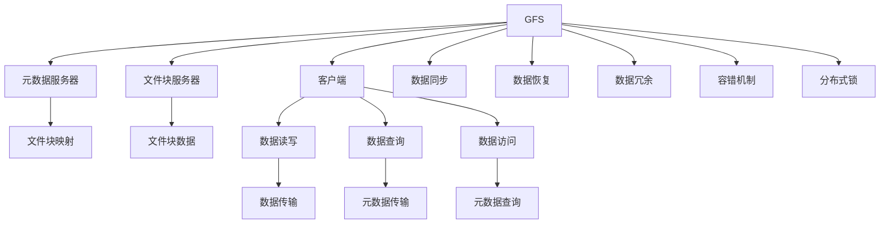

                 

# 分布式存储系统：GFS 和 HDFS

分布式存储系统是互联网数据中心的核心基础设施之一，负责海量数据的可靠存储和高效访问。本文将深入探讨两个经典分布式存储系统：Google的文件系统（GFS）和Hadoop分布式文件系统（HDFS）。通过分析GFS和HDFS的核心概念、设计原理、实现细节和应用场景，我们期望对分布式存储系统有一个更深入的理解。

## 1. 背景介绍

### 1.1 问题由来

随着互联网的迅速发展和数据量的爆炸性增长，单一存储系统已经无法满足大规模数据存储的需求。分布式存储系统应运而生，通过将数据分散存储在多台计算机上，并借助网络进行数据访问，有效地解决了数据存储和访问的扩展性问题。

在众多分布式存储系统中，Google的GFS和Hadoop的HDFS是最为经典的两个系统。它们设计理念和实现方式各具特色，都经过了大规模实际应用的考验，具有很高的参考价值。

### 1.2 问题核心关键点

本文聚焦于两个核心问题：
1. GFS和HDFS的设计原理和架构特点。
2. GFS和HDFS在实际应用中的优缺点和适用场景。

这两个问题涉及的知识点包括：
- 分布式文件系统的工作原理和组成部分。
- 数据布局策略和一致性模型。
- 故障恢复和系统容错机制。
- 系统性能优化和扩展策略。

通过理解这些问题，读者可以更清晰地认识到分布式存储系统的优势和局限，并根据自己的需求选择合适的系统。

## 2. 核心概念与联系

### 2.1 核心概念概述

为了更好地理解GFS和HDFS，首先需要介绍一些核心概念：

- 分布式文件系统（Distributed File System, DFS）：一种文件系统，其存储资源分布在多台计算机上，并借助网络进行数据访问和传输。
- 数据冗余（Data Redundancy）：通过在不同节点上存储数据的多个副本，提高系统的容错性和数据可靠性。
- 分布式锁（Distributed Lock）：在多节点环境下，通过共享锁、独占锁等机制，保证数据访问的一致性和互斥性。
- 容错机制（Fault Tolerance）：系统设计中的关键技术，通过冗余、备份和错误恢复等手段，保证系统的高可用性。

### 2.2 核心概念原理和架构的 Mermaid 流程图

这个图展示了GFS和HDFS的基本架构和关键流程：
- **GFS**：包含客户端、元数据服务器、文件块服务器三部分。客户端通过元数据服务器获取文件块映射信息，进而通过文件块服务器访问数据块。元数据服务器负责文件块映射的管理和数据同步。
- **HDFS**：也分为客户端、元数据服务器和数据块服务器三部分。客户端通过元数据服务器获取文件块映射信息，进而通过数据块服务器访问数据块。元数据服务器负责文件块映射的管理和数据同步。

## 3. 核心算法原理 & 具体操作步骤

### 3.1 算法原理概述

GFS和HDFS都基于“主从”架构设计，即主节点负责管理元数据和资源调度，从节点负责数据的存储和处理。它们的算法原理和操作步骤大同小异，主要区别在于实现细节和应用场景。

#### 3.2 算法步骤详解

以下是GFS和HDFS的主要算法步骤：

**GFS的步骤**：
1. 文件创建：客户端向元数据服务器发送创建请求，元数据服务器分配文件块号，并将文件块映射信息写入元数据服务器。
2. 数据存储：客户端根据元数据服务器返回的映射信息，将数据块存储在相应的文件块服务器上。
3. 数据读写：客户端向元数据服务器查询数据块映射信息，并通过文件块服务器读写数据。
4. 数据同步：元数据服务器定期将数据块映射信息同步到所有从节点。
5. 数据恢复：在文件块服务器出现故障时，元数据服务器和客户端通过冗余数据块恢复数据。

**HDFS的步骤**：
1. 文件创建：客户端向元数据服务器发送创建请求，元数据服务器分配数据块号，并将文件块映射信息写入元数据服务器。
2. 数据存储：客户端根据元数据服务器返回的映射信息，将数据块存储在相应的数据块服务器上。
3. 数据读写：客户端向元数据服务器查询数据块映射信息，并通过数据块服务器读写数据。
4. 数据同步：元数据服务器定期将数据块映射信息同步到所有数据块服务器。
5. 数据恢复：在数据块服务器出现故障时，元数据服务器和客户端通过冗余数据块恢复数据。

### 3.3 算法优缺点

#### 3.3.1 GFS的优缺点

**优点**：
1. 支持跨机文件系统，能够动态扩展存储资源。
2. 通过复制数据块提高数据可靠性。
3. 支持跨网络的文件访问。

**缺点**：
1. 元数据服务器单点故障可能导致系统不可用。
2. 对硬件依赖较大，需要高度集成的硬件平台。
3. 数据块的跨节点迁移需要较高的网络开销。

#### 3.3.2 HDFS的优缺点

**优点**：
1. 支持大文件存储和访问，适合大规模数据处理。
2. 元数据和数据分离，减少了元数据服务器的负载。
3. 分布式锁机制保证了数据一致性。

**缺点**：
1. 文件块大小固定，不能灵活适应不同类型的数据。
2. 对数据块的位置没有控制权，依赖于随机数据存储策略。
3. 对数据块节点的故障容忍度较低，数据恢复需要时间。

### 3.4 算法应用领域

GFS和HDFS在实际应用中，主要应用于以下领域：

**GFS的应用**：
1. 谷歌内部数据存储：如MapReduce、BigTable等大规模数据处理系统。
2. 高吞吐量存储系统：如YouTube的视频存储、Google文档的文本存储。
3. 高性能计算系统：如Google的内部计算集群和科学计算应用。

**HDFS的应用**：
1. 大规模数据存储和访问：如Apache Hadoop生态系统，适用于大规模数据处理和分析。
2. 分布式文件系统：如Apache Hive和Apache Pig，支持大规模数据仓库和数据挖掘。
3. 大数据平台：如Apache Spark和Apache Flink，支持分布式数据流处理和大数据应用。

## 4. 数学模型和公式 & 详细讲解 & 举例说明

### 4.1 数学模型构建

#### 4.1.1 GFS的数学模型构建

GFS的数学模型主要涉及文件块映射和数据同步两个方面。

- **文件块映射**：假设文件大小为F，块大小为B，则文件共分为F/B个块。每个块映射到两个数据块服务器，元数据服务器记录每个块的服务器地址。
- **数据同步**：元数据服务器定期将文件块映射信息同步到所有数据块服务器。设同步周期为T，每次同步数据量为S，则数据同步的总量为S*T。

#### 4.1.2 HDFS的数学模型构建

HDFS的数学模型主要涉及数据块存储和数据同步两个方面。

- **数据块存储**：假设文件大小为F，块大小为B，则文件共分为F/B个块。每个块映射到一个数据块服务器。
- **数据同步**：元数据服务器定期将数据块映射信息同步到所有数据块服务器。设同步周期为T，每次同步数据量为S，则数据同步的总量为S*T。

### 4.2 公式推导过程

#### 4.2.1 GFS的公式推导

1. **文件块映射**：
   $$
   \text{文件块数} = \lceil \frac{F}{B} \rceil
   $$
   $$
   \text{服务器数} = 2 \times \text{文件块数}
   $$

2. **数据同步**：
   $$
   \text{同步周期} = T
   $$
   $$
   \text{同步总量} = S \times T
   $$

#### 4.2.2 HDFS的公式推导

1. **数据块存储**：
   $$
   \text{文件块数} = \lceil \frac{F}{B} \rceil
   $$
   $$
   \text{服务器数} = \text{文件块数}
   $$

2. **数据同步**：
   $$
   \text{同步周期} = T
   $$
   $$
   \text{同步总量} = S \times T
   $$

### 4.3 案例分析与讲解

**案例1：谷歌的数据存储**

谷歌内部使用GFS存储海量数据，包括视频、文档、搜索索引等。谷歌的MapReduce系统通过GFS进行数据存储和访问，实现了高效的大规模数据处理。

**案例2：Apache Hadoop**

Apache Hadoop是基于HDFS的分布式计算框架，支持大规模数据存储和分布式计算。HDFS和MapReduce的结合，为大规模数据处理和分析提供了高效、可靠的解决方案。

## 5. 项目实践：代码实例和详细解释说明

### 5.1 开发环境搭建

**5.1.1 硬件环境**

GFS和HDFS的部署需要较高的硬件配置，包括高性能服务器、高速网络等。以下是一些推荐的硬件配置：

- **服务器**：至少2台高性能服务器，配备多个CPU和大量内存。
- **网络**：高速交换机和万兆网络接口卡。
- **存储**：SAS或NVMe硬盘，建议容量大于1TB。

**5.1.2 软件环境**

GFS和HDFS的部署需要安装相应的操作系统和软件工具，以下是一些推荐的部署步骤：

- **操作系统**：建议使用Linux发行版，如Ubuntu或CentOS。
- **软件安装**：
  - 安装GFS：下载Google的GFS源代码，按照文档进行安装和配置。
  - 安装HDFS：下载Apache的HDFS源代码，按照文档进行安装和配置。

### 5.2 源代码详细实现

**5.2.1 GFS的源代码实现**

GFS的源代码实现可以参考Google的官方文档和示例代码。以下是一些关键部分的实现细节：

- **文件创建**：客户端向元数据服务器发送创建请求，元数据服务器分配文件块号，并将文件块映射信息写入元数据服务器。
- **数据存储**：客户端根据元数据服务器返回的映射信息，将数据块存储在相应的文件块服务器上。
- **数据读写**：客户端向元数据服务器查询数据块映射信息，并通过文件块服务器读写数据。

**5.2.2 HDFS的源代码实现**

HDFS的源代码实现可以参考Apache的官方文档和示例代码。以下是一些关键部分的实现细节：

- **文件创建**：客户端向元数据服务器发送创建请求，元数据服务器分配数据块号，并将文件块映射信息写入元数据服务器。
- **数据存储**：客户端根据元数据服务器返回的映射信息，将数据块存储在相应的数据块服务器上。
- **数据读写**：客户端向元数据服务器查询数据块映射信息，并通过数据块服务器读写数据。

### 5.3 代码解读与分析

**5.3.1 GFS的代码解读**

GFS的代码实现主要分为元数据服务器和文件块服务器两个部分。以下是一些关键部分的代码解读：

- **元数据服务器**：负责文件块映射的管理和数据同步。通过数据库记录文件块映射信息，定期向所有文件块服务器同步数据。
- **文件块服务器**：负责数据块的存储和读写。通过读写数据块实现数据的访问和存储。

**5.3.2 HDFS的代码解读**

HDFS的代码实现主要分为元数据服务器和数据块服务器两个部分。以下是一些关键部分的代码解读：

- **元数据服务器**：负责文件块映射的管理和数据同步。通过数据库记录文件块映射信息，定期向所有数据块服务器同步数据。
- **数据块服务器**：负责数据块的存储和读写。通过读写数据块实现数据的访问和存储。

### 5.4 运行结果展示

**5.4.1 GFS的运行结果**

GFS的运行结果主要通过元数据服务器和文件块服务器的日志文件来展示。以下是一些关键结果的展示：

- **元数据服务器日志**：记录文件块映射信息和同步日志，验证元数据服务器的工作状态。
- **文件块服务器日志**：记录数据块的存储和读写日志，验证数据块服务器的工作状态。

**5.4.2 HDFS的运行结果**

HDFS的运行结果主要通过元数据服务器和数据块服务器的日志文件来展示。以下是一些关键结果的展示：

- **元数据服务器日志**：记录文件块映射信息和同步日志，验证元数据服务器的工作状态。
- **数据块服务器日志**：记录数据块的存储和读写日志，验证数据块服务器的工作状态。

## 6. 实际应用场景

### 6.1 智能客服系统

智能客服系统是一种典型的分布式存储系统应用场景。通过GFS或HDFS，客服系统可以存储和访问大量用户的历史对话记录，并实现高效的查询和分析。

**GFS应用**：谷歌内部使用GFS存储大量的客户对话记录，通过MapReduce系统进行数据分析和处理，实现了高效的智能客服系统。

**HDFS应用**：Apache Hadoop支持大规模数据存储和分布式计算，可以用于存储和处理大量的客户对话记录，实现高效的智能客服系统。

### 6.2 金融舆情监测

金融舆情监测系统需要实时监测市场舆论动向，以便及时应对负面信息传播，规避金融风险。通过GFS或HDFS，舆情监测系统可以存储和访问大量的金融新闻、评论、数据报告等文本数据，并实现高效的分析和处理。

**GFS应用**：谷歌内部使用GFS存储大量的金融数据，通过MapReduce系统进行数据分析和处理，实现了高效的金融舆情监测系统。

**HDFS应用**：Apache Hadoop支持大规模数据存储和分布式计算，可以用于存储和处理大量的金融数据，实现高效的金融舆情监测系统。

### 6.3 个性化推荐系统

个性化推荐系统需要存储和访问大量的用户行为数据，并通过机器学习算法进行推荐。通过GFS或HDFS，推荐系统可以存储和访问大量的用户行为数据，并实现高效的推荐处理。

**GFS应用**：谷歌内部使用GFS存储大量的用户行为数据，通过MapReduce系统进行数据分析和处理，实现了高效的个性化推荐系统。

**HDFS应用**：Apache Hadoop支持大规模数据存储和分布式计算，可以用于存储和处理大量的用户行为数据，实现高效的个性化推荐系统。

### 6.4 未来应用展望

随着互联网和数据量的不断增长，分布式存储系统将扮演越来越重要的角色。未来，GFS和HDFS将继续扩展其应用领域，支持更多高吞吐量、大文件存储和分布式计算场景。

**未来发展趋势**：
1. **云存储和分布式存储的融合**：未来的存储系统将越来越多地采用云存储技术，实现数据的高可用性和弹性扩展。
2. **大数据和AI的深度融合**：分布式存储系统将与大数据和AI技术深度融合，实现高效的数据处理和分析。
3. **区块链技术的应用**：分布式存储系统将引入区块链技术，实现数据的安全和透明存储。
4. **边缘计算的支持**：分布式存储系统将支持边缘计算，实现数据的实时处理和存储。

**未来突破**：
1. **数据同步优化**：通过优化数据同步机制，提高数据同步的效率和可靠性。
2. **容错机制的增强**：通过增强容错机制，提高系统的故障容忍度和可靠性。
3. **分布式锁的优化**：通过优化分布式锁机制，提高数据一致性和系统性能。

## 7. 工具和资源推荐

### 7.1 学习资源推荐

为了帮助开发者深入理解GFS和HDFS，以下是一些推荐的在线学习资源：

- **Google GFS文档**：详细介绍了GFS的架构和实现细节，适合深入学习和研究。
- **Apache HDFS文档**：详细介绍了HDFS的架构和实现细节，适合深入学习和研究。
- **分布式系统课程**：如Coursera上的《分布式系统》课程，涵盖GFS和HDFS的原理和实现。

### 7.2 开发工具推荐

为了高效开发GFS和HDFS，以下是一些推荐的开发工具：

- **IDE**：建议使用IntelliJ IDEA或Eclipse，支持GFS和HDFS的开发和调试。
- **版本控制**：建议使用Git和GitHub，方便代码管理和协作。
- **测试工具**：建议使用JUnit和Mockito，方便单元测试和自动化测试。

### 7.3 相关论文推荐

为了进一步理解GFS和HDFS，以下是一些推荐的学术论文：

- **GFS论文**：Google的GFS论文详细介绍了GFS的架构和实现细节。
- **HDFS论文**：Apache的HDFS论文详细介绍了HDFS的架构和实现细节。
- **分布式系统论文**：如《A Fault-Tolerant Storage System for Large Web Servers》，介绍了大规模分布式文件系统的设计思路。

## 8. 总结：未来发展趋势与挑战

### 8.1 研究成果总结

GFS和HDFS作为两个经典的分布式存储系统，已经在谷歌和Apache Hadoop生态系统中得到了广泛应用。通过深入理解它们的原理和实现，开发者可以更好地设计和开发分布式存储系统。

### 8.2 未来发展趋势

随着互联网和数据量的不断增长，分布式存储系统将扮演越来越重要的角色。未来，GFS和HDFS将继续扩展其应用领域，支持更多高吞吐量、大文件存储和分布式计算场景。

**未来发展趋势**：
1. **云存储和分布式存储的融合**：未来的存储系统将越来越多地采用云存储技术，实现数据的高可用性和弹性扩展。
2. **大数据和AI的深度融合**：分布式存储系统将与大数据和AI技术深度融合，实现高效的数据处理和分析。
3. **区块链技术的应用**：分布式存储系统将引入区块链技术，实现数据的安全和透明存储。
4. **边缘计算的支持**：分布式存储系统将支持边缘计算，实现数据的实时处理和存储。

### 8.3 面临的挑战

尽管GFS和HDFS已经取得了一定的成功，但它们在实际应用中也面临着诸多挑战：

**挑战1**：数据同步机制的优化。现有数据同步机制存在同步延迟和数据丢失等问题，需要通过优化解决。

**挑战2**：容错机制的增强。现有容错机制在故障容忍度和数据恢复速度方面仍有不足，需要通过增强解决。

**挑战3**：分布式锁的优化。现有分布式锁机制在数据一致性和系统性能方面仍有不足，需要通过优化解决。

### 8.4 研究展望

未来的研究需要在这几个方面寻求新的突破：

**研究1**：优化数据同步机制，提高数据同步的效率和可靠性。

**研究2**：增强容错机制，提高系统的故障容忍度和数据恢复速度。

**研究3**：优化分布式锁机制，提高数据一致性和系统性能。

通过这些研究方向的探索，未来的分布式存储系统将更加高效、可靠、安全，能够更好地支持大规模数据存储和处理的需求。

## 9. 附录：常见问题与解答

**Q1: 如何评估GFS和HDFS的性能？**

**A1:** 评估GFS和HDFS的性能需要从多个方面进行测试，包括文件创建和删除速度、数据读写速度、数据同步速度、系统稳定性等。可以使用IOPS（每秒输入输出操作数）和吞吐量（每秒传输数据量）等指标进行评估。

**Q2: GFS和HDFS有哪些优缺点？**

**A2:** GFS和HDFS的优缺点如下：

- **GFS的优点**：支持跨机文件系统，能够动态扩展存储资源，通过复制数据块提高数据可靠性，支持跨网络的文件访问。
- **GFS的缺点**：元数据服务器单点故障可能导致系统不可用，对硬件依赖较大，数据块的跨节点迁移需要较高的网络开销。
- **HDFS的优点**：支持大文件存储和访问，适合大规模数据处理，元数据和数据分离，减少了元数据服务器的负载，分布式锁机制保证了数据一致性。
- **HDFS的缺点**：文件块大小固定，不能灵活适应不同类型的数据，对数据块的位置没有控制权，依赖于随机数据存储策略，数据块节点的故障容忍度较低，数据恢复需要时间。

**Q3: GFS和HDFS如何选择？**

**A3:** 选择GFS还是HDFS需要考虑以下因素：

- **数据规模**：如果数据量较大，可以选择HDFS。如果数据量较小，可以选择GFS。
- **应用场景**：如果需要支持跨机文件系统，可以选择GFS。如果只需要支持大规模数据存储和访问，可以选择HDFS。
- **硬件配置**：如果硬件配置较高，可以选择GFS。如果硬件配置较低，可以选择HDFS。

通过深入理解GFS和HDFS的原理和实现，开发者可以根据具体需求选择合适的系统，并利用它们的高可用性和扩展性优势，构建高效可靠的分布式存储系统。

---

作者：禅与计算机程序设计艺术 / Zen and the Art of Computer Programming

