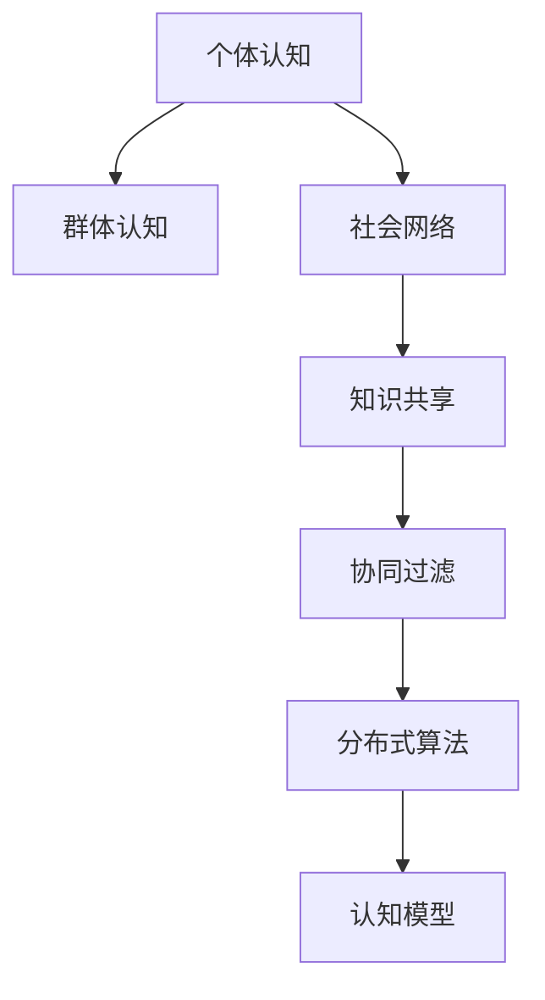

                 

# 分布式认知：揭秘群体智慧的奥秘

> 关键词：分布式认知、群体智慧、社会计算、分布式算法、协同过滤、社会网络、认知科学

## 1. 背景介绍

### 1.1 问题由来
随着互联网技术的飞速发展，全球信息互联互通成为现实，人类社会正在经历一场前所未有的变革。社会计算、群体智慧、分布式算法等新兴概念应运而生，逐渐成为研究热点。其中，分布式认知(Distributed Cognition)作为研究社会系统中个体与系统之间交互关系的认知科学新领域，正吸引越来越多的学者关注。

分布式认知关注个体和群体之间的知识共享、协同工作和问题解决，旨在揭示群体智慧在组织决策、创新和协作中的作用机制。它不仅涉及到认知心理学和计算机科学，还涉及社会学、行为科学、信息科学等多个交叉学科。

### 1.2 问题核心关键点
分布式认知的核心在于理解个体和群体如何协同工作、共享知识，以及如何通过信息流动和交互实现更高效的协同决策。主要涉及以下几个关键点：

- **知识共享**：个体之间如何通过交流、协作共享知识和信息，提升群体智慧水平。
- **协同决策**：群体如何利用分布式认知过程做出更准确、合理的决策。
- **社会网络**：信息如何在个体之间传递、互动，形成复杂社交网络。
- **认知模型**：个体和群体在认知过程中的心理、行为模型。

### 1.3 问题研究意义
分布式认知研究对于理解人类协作行为、提升组织决策效率、促进信息共享与知识创新具有重要意义。通过揭示群体智慧的运作机制，可以为更好地设计协同工作系统、优化组织决策流程、增强群体创新能力提供理论依据和实践指导。

具体来说：

1. **促进协作**：揭示个体和群体间的知识共享和协同机制，为提高团队协作效率、增强跨部门协同工作能力提供科学依据。
2. **优化决策**：通过分布式认知理论指导组织决策过程，提升决策的合理性和准确性。
3. **促进创新**：揭示创新过程中知识流动和协同机制，为创新工作提供指导，提升创新效率。
4. **社会治理**：应用于社会治理，如公共卫生、灾害预警、应急管理等领域，提升社会治理水平。
5. **企业竞争**：提升企业内部协作水平，促进知识共享，增强企业竞争力。

## 2. 核心概念与联系

### 2.1 核心概念概述

分布式认知涉及多个核心概念，以下对其进行逐一介绍：

- **个体认知**：指单个个体进行信息处理和决策的过程，涉及感知、记忆、推理等认知过程。
- **群体认知**：指多个个体在交流、协作中产生的集体认知，即群体智慧。
- **社会网络**：描述个体之间的交流、合作、冲突等关系，由节点和边构成。
- **知识共享**：个体通过交流、协作共享知识和信息，促进知识积累和创新。
- **协同过滤**：群体在信息流动和交互中对信息进行选择、过滤和共享的过程。
- **分布式算法**：在分布式系统中处理问题和优化资源配置的算法，如MapReduce、Gossip算法等。
- **认知模型**：描述个体和群体在认知过程中的心理、行为模型，如社会认知理论、集体心理模型等。

这些概念之间的联系可以通过以下Mermaid流程图来展示：



这个流程图展示了分布式认知中的核心概念及其相互关系：

1. 个体认知是基础，群体认知是其进阶形式。
2. 社会网络、知识共享和协同过滤是群体认知形成的关键机制。
3. 分布式算法和认知模型在群体认知形成中发挥重要作用。

这些概念共同构成了分布式认知的理论框架，为理解群体智慧运作机制提供了科学依据。

## 3. 核心算法原理 & 具体操作步骤
### 3.1 算法原理概述

分布式认知的算法原理主要基于群体智慧和协同工作机制，通过社会计算和社会网络分析方法，揭示个体和群体在协作中的知识共享、信息流动和协同决策过程。

核心思想是：将个体视为信息处理单元，群体视为信息交互网络，通过模拟群体成员之间的交流和协作，形成分布式认知系统。系统通过信息流动、知识共享和协同过滤等机制，实现对信息的筛选和整合，从而提升群体智慧水平。

具体来说，分布式认知算法可以分为以下几个步骤：

1. **数据获取**：收集个体和群体之间的交流数据，如邮件、聊天记录、社交网络关系等。
2. **社会网络分析**：通过分析个体之间的交流关系，构建社交网络模型。
3. **知识共享与协同过滤**：根据交流数据，识别信息流动和知识共享模式，实现信息筛选和协同过滤。
4. **分布式决策**：通过分布式算法，实现群体智慧的协同决策。

### 3.2 算法步骤详解

以下以一个简单的协同过滤算法为例，详细讲解分布式认知的实现步骤：

1. **数据收集**：
   - 从社交网络平台、邮件系统等收集个体之间的交流数据。
   - 处理数据，提取关键信息，如信息发布者、接收者、信息内容等。

2. **社交网络建模**：
   - 将收集到的交流数据转化为社交网络数据，建立社交网络模型。
   - 使用节点表示个体，边表示交流关系，构建稀疏矩阵表示个体间的信息传递关系。

3. **知识共享与协同过滤**：
   - 定义知识共享度量指标，如信息传播速度、信息传播范围等。
   - 根据知识共享度量，对信息进行筛选和过滤，去除噪声信息，保留关键信息。
   - 通过协同过滤算法，识别信息的重要程度，生成信息优先级列表。

4. **分布式决策**：
   - 将决策问题分解为多个子问题，每个个体负责解决一部分子问题。
   - 利用分布式算法（如MapReduce、Gossip算法等），实现子问题的并行处理。
   - 根据个体解决子问题的结果，通过协同过滤算法，综合生成最终的决策结果。

### 3.3 算法优缺点

分布式认知算法具有以下优点：

1. **提升群体智慧**：通过信息共享和协同过滤机制，提升群体智慧水平，增强决策合理性和准确性。
2. **降低信息过载**：通过知识共享和协同过滤，减少信息过载，提高信息处理的效率。
3. **增强灵活性**：基于分布式算法的协同决策，可以灵活应对复杂动态环境。
4. **促进创新**：通过信息流动和协同过滤，促进知识积累和创新，提升团队创新能力。

同时，分布式认知算法也存在一些局限性：

1. **数据依赖**：算法的效果依赖于数据的完整性和准确性，数据缺失或不准确会影响结果。
2. **算法复杂度**：分布式算法和协同过滤算法复杂度较高，对计算资源和计算时间有一定要求。
3. **安全隐私**：个体之间的交流数据涉及隐私保护，需要采取隐私保护措施。
4. **控制困难**：协同决策过程中，控制个体行为和信息流动较为困难。

### 3.4 算法应用领域

分布式认知算法已在多个领域得到了广泛应用：

1. **社交网络分析**：分析社交网络中的信息流动和知识共享模式，揭示网络结构和信息传播规律。
2. **团队决策支持**：基于分布式认知算法，支持团队决策过程，提高决策的合理性和准确性。
3. **协同工作系统**：应用于企业协同工作平台，提升团队协作效率，促进知识共享和协同创新。
4. **社会治理**：应用于公共卫生、应急管理、灾害预警等领域，提升社会治理能力。
5. **信息过滤和推荐**：应用于信息过滤和个性化推荐系统，提升信息筛选和推荐效果。

## 4. 数学模型和公式 & 详细讲解 & 举例说明

### 4.1 数学模型构建

分布式认知算法的数学模型主要基于社会网络和协同过滤理论，以下是基于协同过滤的数学模型构建。

假设社交网络中个体为 $N$，信息流向 $M$ 个方向，信息传播速度为 $v_i$，信息传播范围为 $r_i$。个体之间的交流关系表示为邻接矩阵 $A$，其中 $A_{ij}=1$ 表示个体 $i$ 和 $j$ 之间有交流关系，$A_{ij}=0$ 表示没有交流关系。

定义知识共享度量指标 $\phi_i$ 为信息传播速度和传播范围的乘积，即：

$$
\phi_i = v_i \times r_i
$$

分布式认知算法通过协同过滤机制，识别信息的重要程度，生成信息优先级列表。设个体 $i$ 获取信息的重要性权重为 $w_i$，则信息优先级列表 $\mathcal{P}$ 可以表示为：

$$
\mathcal{P} = \{(\phi_i, w_i)\}_{i=1}^N
$$

其中 $w_i$ 可以通过权重算法（如PageRank、HITS等）计算得到。

### 4.2 公式推导过程

以PageRank算法为例，推导信息优先级列表的计算公式。

1. **初始化权重**：
   - 初始化每个节点的权重 $w_i^{(0)}=1/N$，即每个节点都同等重要。

2. **迭代计算权重**：
   - 对于节点 $i$，其权重 $w_i^{(t+1)}$ 由以下公式计算：
   $$
   w_i^{(t+1)} = \frac{1}{N}\sum_{j=1}^N A_{ij}w_j^{(t)}
   $$
   其中 $A_{ij}$ 表示节点 $j$ 到节点 $i$ 的信息流动关系，$w_j^{(t)}$ 为节点 $j$ 在第 $t$ 次迭代时的权重。

3. **收敛判断**：
   - 当权重变化率 $\Delta w_i < \epsilon$ 时，迭代停止，得到最终权重 $w_i$。

4. **生成优先级列表**：
   - 根据 $w_i$ 排序，生成信息优先级列表 $\mathcal{P}$。

### 4.3 案例分析与讲解

考虑一个简单的社交网络，其中节点表示个体，边表示信息交流关系。假设每个节点发布的信息传播速度和范围相同，即 $v_i=r_i=1$。社会网络邻接矩阵为：

$$
A = \begin{bmatrix}
0 & 1 & 1 & 0 & 1 \\
1 & 0 & 1 & 0 & 0 \\
1 & 1 & 0 & 1 & 0 \\
0 & 0 & 1 & 0 & 1 \\
1 & 0 & 0 & 1 & 0
\end{bmatrix}
$$

使用PageRank算法计算权重，进行两次迭代后的权重向量为：

$$
w^{(1)} = \begin{bmatrix}
\frac{1}{5} \\
\frac{1}{5} \\
\frac{1}{5} \\
\frac{1}{5} \\
\frac{1}{5}
\end{bmatrix}, 
w^{(2)} = \begin{bmatrix}
\frac{1}{5} \\
\frac{1}{5} \\
\frac{1}{5} \\
\frac{1}{5} \\
\frac{1}{5}
\end{bmatrix}
$$

由于信息传播速度和范围相同，权重最终保持不变。信息优先级列表为：

$$
\mathcal{P} = \{(1, \frac{1}{5}), (1, \frac{1}{5}), (1, \frac{1}{5}), (1, \frac{1}{5}), (1, \frac{1}{5})\}
$$

这表明每个节点发布的信息同等重要，优先级相同。

## 5. 项目实践：代码实例和详细解释说明
### 5.1 开发环境搭建

在进行分布式认知算法开发前，需要准备如下开发环境：

1. 安装Python 3.x，建议使用Anaconda环境。
2. 安装必要的Python库，如Numpy、Scipy、Pandas、Scikit-learn、Matplotlib等。
3. 安装社会网络分析库，如NetworkX、Gephi等。
4. 安装分布式计算框架，如Apache Spark、Dask等。
5. 安装可视化工具，如Jupyter Notebook、TensorBoard等。

完成环境配置后，可以使用以下代码片段进行数据收集和处理：

```python
import pandas as pd
import networkx as nx

# 数据收集
df = pd.read_csv('social_network_data.csv')

# 社交网络建模
G = nx.from_edgelist(df['edges'].values.tolist())

# 绘制社交网络图
nx.draw(G, with_labels=True)
```

### 5.2 源代码详细实现

以下是一个基于PageRank算法的分布式认知算法实现示例，包括数据收集、社交网络建模、信息优先级计算和可视化：

```python
import numpy as np
import networkx as nx
import pandas as pd
from scipy import sparse

# 数据收集
df = pd.read_csv('social_network_data.csv')

# 社交网络建模
G = nx.from_edgelist(df['edges'].values.tolist())
A = nx.adjacency_matrix(G)

# 信息优先级计算
v = np.ones(len(G))  # 信息传播速度
r = np.ones(len(G))  # 信息传播范围
phi = v * r  # 知识共享度量
w = np.ones(len(G))  # 初始权重

for _ in range(10):
    w = np.dot(w, np.dot(A.toarray(), phi))

# 生成信息优先级列表
P = list(zip(phi, w))
P.sort(key=lambda x: x[1], reverse=True)

# 可视化
nx.draw(G, with_labels=True)
plt.show()
```

### 5.3 代码解读与分析

本节将详细解读代码实现中的关键步骤：

1. **数据收集**：
   - 使用Pandas库从CSV文件中读取社交网络数据。
   - 使用NetworkX库构建社交网络图，将数据转化为邻接矩阵。

2. **信息优先级计算**：
   - 定义信息传播速度 $v_i$ 和传播范围 $r_i$，计算知识共享度量 $\phi_i$。
   - 使用PageRank算法迭代计算权重，进行多次迭代后得到最终权重 $w_i$。
   - 根据权重排序，生成信息优先级列表 $\mathcal{P}$。

3. **可视化**：
   - 使用Matplotlib库绘制社交网络图，直观展示信息流动和知识共享模式。

## 6. 实际应用场景
### 6.1 社交网络分析

社交网络分析是分布式认知算法的重要应用场景之一。通过分析社交网络中的信息流动和知识共享模式，可以揭示网络结构和信息传播规律，为社区管理、舆论引导等提供科学依据。

具体应用包括：

1. **社区结构分析**：通过社会网络分析，揭示社区内部结构，发现重要节点和信息枢纽。
2. **舆情监测**：分析社交网络中的信息传播路径，监测舆情动态，及时预警。
3. **信息过滤**：通过协同过滤机制，过滤无用信息和噪声，提高信息筛选效率。

### 6.2 团队决策支持

在团队决策过程中，分布式认知算法可以提供有力的支持：

1. **知识共享**：通过信息共享机制，促进团队成员之间的知识交流，提升决策质量。
2. **协同决策**：利用分布式算法，实现群体决策过程的并行处理，提高决策效率。
3. **冲突解决**：通过社会网络分析，识别决策过程中的冲突点，优化决策流程。

### 6.3 协同工作系统

分布式认知算法在企业协同工作系统中的应用，可以有效提升团队协作效率，促进知识共享和协同创新：

1. **任务分配**：根据知识共享度量，将任务分配给最合适的人员，提高任务执行效率。
2. **协同创新**：通过信息共享和协同过滤，促进跨部门协作，提升创新效率。
3. **反馈机制**：通过分布式决策机制，收集团队反馈，优化工作流程。

### 6.4 社会治理

分布式认知算法在社会治理中的应用，可以提升社会管理水平，促进公共决策和应急响应：

1. **应急管理**：通过社会网络分析，监测社会动态，快速响应突发事件。
2. **公共决策**：利用协同过滤机制，促进公民参与公共决策过程，提高决策透明度和公信力。
3. **信息传播**：通过信息优先级排序，优化信息传播路径，确保信息及时传达。

## 7. 工具和资源推荐
### 7.1 学习资源推荐

为了帮助开发者系统掌握分布式认知理论，以下是一些优质的学习资源：

1. **《分布式认知基础》**：介绍分布式认知的基本概念和原理，涵盖社会计算、社会网络分析等内容。
2. **《群体智慧与社会计算》**：深入探讨群体智慧的运作机制，分析分布式认知算法在实际应用中的效果。
3. **《协同过滤与推荐系统》**：介绍协同过滤算法的基本原理和实现方法，涵盖信息共享和知识积累等内容。
4. **《社会网络分析理论与实践》**：系统介绍社会网络分析的基本理论和实践方法，提供丰富的案例分析。
5. **Coursera《分布式系统与云计算》**：涵盖分布式系统、分布式算法等内容，适合了解分布式认知算法的底层实现。

通过对这些资源的学习实践，相信你一定能够快速掌握分布式认知的精髓，并用于解决实际的社交计算问题。

### 7.2 开发工具推荐

高效的开发离不开优秀的工具支持。以下是几款用于分布式认知开发常用的工具：

1. **Jupyter Notebook**：轻量级数据科学开发环境，支持Python等语言，方便数据处理和算法实验。
2. **PySpark**：Apache Spark的Python接口，支持分布式计算，适合大规模社交网络分析。
3. **Gephi**：社交网络可视化工具，支持复杂网络分析，方便结果展示和分析。
4. **TensorBoard**：TensorFlow的可视化工具，支持分布式算法的可视化分析，方便调试和优化。
5. **Dask**：支持分布式计算的Python库，适合大规模数据处理和算法实验。

合理利用这些工具，可以显著提升分布式认知任务的开发效率，加快创新迭代的步伐。

### 7.3 相关论文推荐

分布式认知理论的发展离不开学界的持续研究。以下是几篇奠基性的相关论文，推荐阅读：

1. **"Social Network Analysis: Structures, Methods and Applications"**：介绍社交网络分析的基本概念和应用，适合了解分布式认知算法的理论基础。
2. **"Collaborative Filtering Techniques for Recommender Systems"**：介绍协同过滤算法的基本原理和实现方法，适合了解分布式认知算法在信息过滤和推荐系统中的应用。
3. **"Reasoning in Social Systems: A Tutorial"**：介绍群体智慧的运作机制，分析分布式认知算法在群体决策中的应用。
4. **"Emergence in Social Systems: From Control to Trust"**：探讨群体智慧的涌现机制，分析分布式认知算法在社会管理中的应用。
5. **"Towards a Science of Cognition"**：探讨分布式认知的心理学基础，分析人类认知和群体认知的关系。

这些论文代表了大规模分布式认知算法的最新进展，适合进一步深入了解和研究。

## 8. 总结：未来发展趋势与挑战
### 8.1 总结

本文对分布式认知方法进行了全面系统的介绍。首先阐述了分布式认知的研究背景和意义，明确了分布式认知在群体智慧运作中的核心作用。其次，从原理到实践，详细讲解了分布式认知的数学模型和算法实现，给出了分布式认知算法的完整代码实例。同时，本文还广泛探讨了分布式认知在多个行业领域的应用前景，展示了分布式认知算法的巨大潜力。最后，本文精选了分布式认知技术的各类学习资源，力求为读者提供全方位的技术指引。

通过本文的系统梳理，可以看到，分布式认知研究对于理解人类协作行为、提升组织决策效率、促进信息共享与知识创新具有重要意义。这些理论和方法不仅能用于社会计算，还能广泛应用于协同工作系统、信息过滤和推荐、社会治理等多个领域。

### 8.2 未来发展趋势

展望未来，分布式认知技术将呈现以下几个发展趋势：

1. **技术融合**：分布式认知算法将与其他新兴技术进行深度融合，如人工智能、大数据、物联网等，拓展应用范围。
2. **跨学科研究**：分布式认知研究将与心理学、行为科学、信息科学等多学科交叉，提供更全面的理论支持。
3. **模型优化**：分布式认知算法将不断优化，提升计算效率和精度，降低资源消耗。
4. **隐私保护**：随着数据隐私保护的重视，分布式认知算法将引入隐私保护机制，确保信息安全。
5. **跨语言应用**：分布式认知算法将应用于多语言环境，提升跨语言沟通效率，促进全球协作。
6. **实时决策**：分布式认知算法将应用于实时决策系统，提升决策速度和准确性。

### 8.3 面临的挑战

尽管分布式认知技术已经取得了一定的进展，但在迈向更加智能化、普适化应用的过程中，它仍面临诸多挑战：

1. **数据依赖**：分布式认知算法的效果依赖于数据的完整性和准确性，数据缺失或不准确会影响结果。
2. **算法复杂度**：分布式算法和协同过滤算法复杂度较高，对计算资源和计算时间有一定要求。
3. **安全隐私**：个体之间的交流数据涉及隐私保护，需要采取隐私保护措施。
4. **控制困难**：协同决策过程中，控制个体行为和信息流动较为困难。

### 8.4 研究展望

面对分布式认知技术面临的挑战，未来的研究需要在以下几个方面寻求新的突破：

1. **数据增强**：探索数据增强技术，提高数据质量和数量，缓解数据依赖问题。
2. **算法优化**：开发更高效、更轻量级的分布式认知算法，降低计算资源消耗，提高实时性。
3. **隐私保护**：研究隐私保护算法，确保个体数据的隐私和安全。
4. **系统设计**：设计更灵活、更可控的分布式认知系统，提升系统可靠性和稳定性。
5. **跨领域应用**：拓展分布式认知算法在更多领域的应用，如教育、医疗、金融等，提升应用效果。

## 9. 附录：常见问题与解答

**Q1：分布式认知和协同过滤有什么区别？**

A: 分布式认知关注个体和群体在协作中的知识共享、信息流动和协同决策过程，而协同过滤主要应用于推荐系统，通过个体间的相似性关系，推荐相关物品。

**Q2：如何衡量信息优先级？**

A: 信息优先级的衡量可以通过知识共享度量、权重计算等方法实现。常用的知识共享度量包括信息传播速度、信息传播范围等，权重可以通过PageRank、HITS等算法计算得到。

**Q3：分布式认知算法的计算复杂度如何？**

A: 分布式认知算法的计算复杂度较高，尤其是在大规模社交网络数据上。常用的分布式计算框架如Spark、Dask等可以缓解计算资源压力，提高算法效率。

**Q4：如何保证分布式认知算法的公平性？**

A: 在分布式认知算法中，公平性是一个重要问题。可以通过优化算法参数、引入公平性约束等方法，保证算法公平性，防止信息流动不均等现象。

**Q5：分布式认知算法的应用前景如何？**

A: 分布式认知算法在多个领域具有广泛应用前景，如社交网络分析、团队决策支持、协同工作系统、社会治理等。未来，随着算法的不断优化和技术的进步，其应用前景将更加广阔。

总之，分布式认知技术为理解群体智慧的运作机制、提升社会管理水平、促进信息共享与知识创新提供了新思路和新方法。未来，随着技术的发展和应用的深入，分布式认知技术必将在更多领域大放异彩，为构建更加智能化、普适化的社会系统提供有力支持。

---

作者：禅与计算机程序设计艺术 / Zen and the Art of Computer Programming

