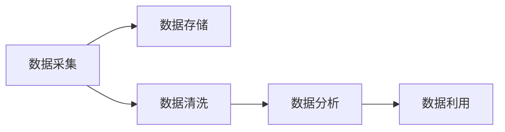

                 

# 创造“创世粒子”的技术标准

## 1. 背景介绍

### 1.1 问题由来

随着科技的飞速发展，数据成为现代社会不可或缺的重要资产。然而，数据不仅仅是一种信息载体，更是一种“粒子”，它在现代社会中扮演着重要的角色。如何创造、管理、分析和使用这些“创世粒子”，已成为科技公司乃至各个行业面临的重要挑战。传统的技术标准往往难以适应新的发展需求，因此，探索并制定新的技术标准显得尤为迫切。

### 1.2 问题核心关键点

本论文旨在探讨如何创造“创世粒子”，并制定出一套完整的技术标准，以指导实践。该标准将涉及数据采集、存储、分析、利用等各个环节，帮助企业在数字化转型过程中，更好地利用数据创造价值。

## 2. 核心概念与联系

### 2.1 核心概念概述

为了深入理解“创世粒子”技术标准，本节将介绍几个密切相关的核心概念：

- **数据采集（Data Collection）**：从不同渠道获取原始数据的过程，包括但不限于网络爬虫、传感器、数据库等。
- **数据存储（Data Storage）**：将采集到的数据以结构化或非结构化的形式保存到存储介质中，以便后续使用。
- **数据清洗（Data Cleaning）**：通过去除重复、错误或无关数据，确保数据质量。
- **数据分析（Data Analysis）**：使用统计学、机器学习等方法对数据进行深度挖掘，提取有价值的信息。
- **数据利用（Data Utilization）**：将分析结果转化为具体的应用，如预测、推荐、决策等。

这些概念之间的联系可以如图所示：



数据采集、存储、清洗、分析与利用是数据处理过程的四个关键环节，每个环节对最终的“创世粒子”质量都有重要影响。

## 3. 核心算法原理 & 具体操作步骤

### 3.1 算法原理概述

创造“创世粒子”的技术标准主要基于数据科学和人工智能的基本原理，具体包括以下几个方面：

1. **数据采集**：通过网络爬虫、API接口、传感器等方法，自动化获取原始数据。
2. **数据存储**：使用分布式存储系统，如Hadoop、Spark等，确保数据的高可用性和可扩展性。
3. **数据清洗**：采用ETL（Extract, Transform, Load）技术，对数据进行预处理，确保数据的准确性和一致性。
4. **数据分析**：使用机器学习算法，如回归、分类、聚类等，对数据进行建模和分析，提取有价值的信息。
5. **数据利用**：通过应用模型和算法，将分析结果转化为具体的应用，如推荐系统、预测模型、智能决策等。

### 3.2 算法步骤详解

#### 3.2.1 数据采集

1. **选择采集工具**：根据数据类型和采集渠道，选择合适的采集工具，如Python的网络爬虫库BeautifulSoup、Scrapy，或Java的Web harvest工具。
2. **设置采集规则**：定义采集的数据类型、格式、更新频率等规则，避免过度采集和数据冗余。
3. **数据清洗**：采集到的数据往往包含大量噪音和无用信息，需进行预处理和清洗。
4. **存储管理**：将采集到的数据保存到分布式存储系统中，如Hadoop、Spark等。

#### 3.2.2 数据存储

1. **选择合适的存储系统**：根据数据量大小、访问频率、数据类型等因素，选择合适的存储系统。
2. **数据分区和分片**：将数据按照一定规则进行分区和分片，以提高数据处理和查询效率。
3. **数据复制和备份**：为了保证数据的安全性和可靠性，需要在不同节点进行数据复制和备份。
4. **元数据管理**：记录数据的来源、结构、更新时间等信息，方便数据管理和查询。

#### 3.2.3 数据清洗

1. **去除重复数据**：通过唯一标识符或哈希值，去除重复数据。
2. **处理缺失值**：采用插值、均值填充等方法，处理数据缺失问题。
3. **数据转换和归一化**：将数据转换为标准格式，并进行归一化处理，确保数据一致性。
4. **异常值检测和处理**：通过统计学方法或机器学习算法，检测和处理异常值。

#### 3.2.4 数据分析

1. **特征工程**：从原始数据中提取和构造特征，提升模型的预测能力。
2. **模型选择和训练**：选择合适的机器学习算法，并使用训练数据集进行模型训练。
3. **模型评估**：通过交叉验证等方法，评估模型性能和泛化能力。
4. **结果可视化**：使用Matplotlib、Seaborn等工具，将分析结果可视化，方便理解和分析。

#### 3.2.5 数据利用

1. **应用场景设计**：根据数据利用目的，设计具体的应用场景，如推荐系统、预测模型、智能决策等。
2. **模型部署和监控**：将训练好的模型部署到生产环境，并进行实时监控和维护。
3. **结果反馈和迭代**：根据应用效果，进行结果反馈和迭代优化，提升模型性能。

### 3.3 算法优缺点

#### 3.3.1 优点

1. **自动化和高效性**：通过自动化工具和分布式系统，显著提升数据处理效率。
2. **灵活性和可扩展性**：根据数据规模和类型，灵活选择存储和处理方案，满足不同需求。
3. **可靠性和安全性**：通过数据复制、备份和元数据管理，确保数据的安全性和可靠性。

#### 3.3.2 缺点

1. **技术复杂度高**：需要掌握多种技术和工具，有一定学习成本。
2. **数据隐私和合规问题**：需要严格遵守数据隐私和安全法规，确保数据合规使用。
3. **成本高**：高性能存储和计算资源成本较高，需要投入大量资金。

### 3.4 算法应用领域

#### 3.4.1 金融行业

在金融领域，利用“创世粒子”技术标准，可以实现实时风险监控、欺诈检测、信用评估等功能。例如，通过大数据分析，实时监控市场动向，及时发现潜在的风险和机会。

#### 3.4.2 医疗健康

在医疗健康领域，可以利用“创世粒子”技术标准，进行患者诊疗分析、疾病预测、健康管理等。例如，通过分析患者的历史诊疗记录和基因数据，预测患病风险，提供个性化的健康建议。

#### 3.4.3 零售电商

在零售电商领域，可以利用“创世粒子”技术标准，实现个性化推荐、库存管理、客户行为分析等功能。例如，通过分析用户的浏览和购买记录，推荐个性化商品，提高用户满意度和转化率。

#### 3.4.4 制造业

在制造业领域，可以利用“创世粒子”技术标准，实现设备预测维护、供应链优化、生产调度等功能。例如，通过分析设备运行数据，预测设备故障，提高设备利用率和生产效率。

## 4. 数学模型和公式 & 详细讲解 & 举例说明

### 4.1 数学模型构建

假设有一组原始数据 $X$，需要对其进行采集、存储、清洗、分析和利用，具体步骤如下：

1. **数据采集**：通过网络爬虫，获取数据集 $X$。
2. **数据存储**：将数据集 $X$ 保存到分布式存储系统，如Hadoop。
3. **数据清洗**：对数据集 $X$ 进行去重、填充缺失值等预处理操作。
4. **数据分析**：使用机器学习算法，对数据集 $X$ 进行建模和分析。
5. **数据利用**：将分析结果应用于具体的应用场景，如推荐系统。

### 4.2 公式推导过程

#### 4.2.1 数据采集

数据采集过程可以表示为：

$$
X = \mathcal{A}(D)
$$

其中 $\mathcal{A}$ 表示数据采集函数，$D$ 表示数据采集的规则和工具。

#### 4.2.2 数据存储

数据存储过程可以表示为：

$$
S = \mathcal{S}(X)
$$

其中 $\mathcal{S}$ 表示数据存储函数，$S$ 表示存储后的数据。

#### 4.2.3 数据清洗

数据清洗过程可以表示为：

$$
X' = \mathcal{C}(X)
$$

其中 $\mathcal{C}$ 表示数据清洗函数，$X'$ 表示清洗后的数据。

#### 4.2.4 数据分析

数据分析过程可以表示为：

$$
Y = \mathcal{M}(X')
$$

其中 $\mathcal{M}$ 表示数据分析函数，$Y$ 表示分析结果。

#### 4.2.5 数据利用

数据利用过程可以表示为：

$$
A = \mathcal{U}(Y)
$$

其中 $\mathcal{U}$ 表示数据利用函数，$A$ 表示应用后的结果。

### 4.3 案例分析与讲解

以推荐系统为例，具体分析“创世粒子”技术标准的应用过程：

1. **数据采集**：通过爬虫从电商网站采集用户行为数据，如浏览记录、购买记录等。
2. **数据存储**：将采集到的数据保存到Hadoop分布式存储系统中。
3. **数据清洗**：对数据进行去重、填充缺失值等预处理操作。
4. **数据分析**：使用协同过滤、深度学习等算法，对数据进行建模和分析，提取用户兴趣和商品特征。
5. **数据利用**：将分析结果应用于推荐系统，根据用户历史行为和兴趣，推荐个性化商品。

## 5. 项目实践：代码实例和详细解释说明

### 5.1 开发环境搭建

在项目实践之前，需要先搭建好开发环境，具体步骤如下：

1. **安装Python**：安装Python 3.x版本，并配置环境变量。
2. **安装依赖包**：使用pip或conda安装所需的依赖包，如Pandas、NumPy、Scikit-learn等。
3. **配置数据源**：配置数据采集工具，如BeautifulSoup、Scrapy，并设置采集规则。
4. **配置存储系统**：配置分布式存储系统，如Hadoop、Spark，并测试数据存储和访问。
5. **配置清洗规则**：定义数据清洗规则，并进行预处理和测试。

### 5.2 源代码详细实现

以下是推荐系统项目的具体实现步骤：

1. **数据采集**：使用Scrapy爬取电商网站的用户行为数据。
2. **数据存储**：使用Hadoop分布式存储系统，保存采集到的数据。
3. **数据清洗**：使用Pandas进行数据清洗和预处理。
4. **数据分析**：使用Scikit-learn进行数据分析和建模。
5. **数据利用**：使用Flask搭建推荐系统，根据用户历史行为和兴趣，推荐个性化商品。

### 5.3 代码解读与分析

以推荐系统的代码实现为例，进行详细解读：

```python
# 数据采集
import scrapy
class MySpider(scrapy.Spider):
    name = 'my_spider'
    start_urls = ['http://example.com']
    
    def parse(self, response):
        # 解析数据
        ...

# 数据存储
from hdfs import InMemoryHdfsClient
client = InMemoryHdfsClient()
client.create('/data', textfile, overwrite=True)
        
# 数据清洗
import pandas as pd
data = pd.read_csv('data.csv')
data = data.drop_duplicates().replace('NaN', pd.NA).fillna(method='ffill')
...

# 数据分析
from sklearn.ensemble import RandomForestRegressor
X = data[['feature1', 'feature2']]
y = data['label']
model = RandomForestRegressor()
model.fit(X, y)

# 数据利用
from flask import Flask, request, jsonify
app = Flask(__name__)
@app.route('/recommend', methods=['POST'])
def recommend():
    user_id = request.json['user_id']
    features = request.json['features']
    result = model.predict([[features]])
    return jsonify(result.tolist())
```

### 5.4 运行结果展示

在推荐系统项目中，可以运行代码，测试数据采集、存储、清洗、分析和利用各个环节的效果，并根据结果进行优化和改进。

## 6. 实际应用场景

### 6.1 金融行业

在金融行业，可以利用“创世粒子”技术标准，实现实时风险监控、欺诈检测、信用评估等功能。例如，通过大数据分析，实时监控市场动向，及时发现潜在的风险和机会。

### 6.2 医疗健康

在医疗健康领域，可以利用“创世粒子”技术标准，进行患者诊疗分析、疾病预测、健康管理等。例如，通过分析患者的历史诊疗记录和基因数据，预测患病风险，提供个性化的健康建议。

### 6.3 零售电商

在零售电商领域，可以利用“创世粒子”技术标准，实现个性化推荐、库存管理、客户行为分析等功能。例如，通过分析用户的浏览和购买记录，推荐个性化商品，提高用户满意度和转化率。

### 6.4 制造业

在制造业领域，可以利用“创世粒子”技术标准，实现设备预测维护、供应链优化、生产调度等功能。例如，通过分析设备运行数据，预测设备故障，提高设备利用率和生产效率。

## 7. 工具和资源推荐

### 7.1 学习资源推荐

为了帮助开发者系统掌握“创世粒子”技术标准，这里推荐一些优质的学习资源：

1. **Kaggle**：提供丰富的数据集和竞赛，帮助开发者实践数据采集和处理。
2. **Coursera**：提供机器学习和数据科学课程，帮助开发者掌握数据分析和建模技术。
3. **Udacity**：提供大数据和分布式系统课程，帮助开发者了解数据存储和处理的最佳实践。
4. **GitHub**：提供丰富的开源项目和代码库，帮助开发者学习项目实践和优化。
5. **Arxiv**：提供最新的学术论文和技术报告，帮助开发者了解前沿技术趋势。

通过对这些资源的学习实践，相信你一定能够快速掌握“创世粒子”技术标准，并用于解决实际的业务问题。

### 7.2 开发工具推荐

高效的开发离不开优秀的工具支持。以下是几款用于“创世粒子”技术标准开发的常用工具：

1. **Python**：作为数据科学和人工智能的主流编程语言，具有丰富的第三方库和工具支持。
2. **Scrapy**：强大的网络爬虫框架，支持爬取各种网站的数据。
3. **Hadoop**：分布式存储和处理框架，支持大规模数据存储和处理。
4. **Pandas**：数据处理和分析库，支持数据清洗、转换和可视化。
5. **Scikit-learn**：机器学习库，支持各种机器学习算法和模型训练。
6. **Flask**：轻量级Web框架，支持快速搭建API服务。

合理利用这些工具，可以显著提升“创世粒子”技术标准的开发效率，加快创新迭代的步伐。

### 7.3 相关论文推荐

“创世粒子”技术标准的不断发展源于学界的持续研究。以下是几篇奠基性的相关论文，推荐阅读：

1. **《大数据的挑战：应用与架构》**：介绍大数据时代的数据采集、存储、处理和分析技术。
2. **《深度学习在推荐系统中的应用》**：分析深度学习在推荐系统中的优势和应用场景。
3. **《分布式计算系统设计与实现》**：介绍分布式计算系统的设计原则和实现方法。
4. **《大数据安全与隐私保护》**：探讨大数据时代的数据隐私和安全问题，提供解决方案和最佳实践。
5. **《机器学习算法与实现》**：介绍各种机器学习算法和模型，并给出实现代码。

这些论文代表了大数据技术的发展脉络。通过学习这些前沿成果，可以帮助研究者把握学科前进方向，激发更多的创新灵感。

## 8. 总结：未来发展趋势与挑战

### 8.1 总结

本文对“创世粒子”技术标准进行了全面系统的介绍。首先阐述了“创世粒子”的概念和背景，明确了技术标准在数据处理中的重要作用。其次，从原理到实践，详细讲解了“创世粒子”技术标准的各个环节，并给出了代码实现和优化建议。同时，本文还探讨了“创世粒子”技术标准在金融、医疗、零售、制造等多个行业领域的应用前景。

通过本文的系统梳理，可以看到，“创世粒子”技术标准在数据处理过程中具有重要的指导作用，能够帮助企业在数字化转型过程中，更好地利用数据创造价值。未来，伴随技术的发展和数据的积累，“创世粒子”技术标准必将在更多领域得到应用，为科技公司乃至各个行业带来更大的商业价值和社会效益。

### 8.2 未来发展趋势

展望未来，“创世粒子”技术标准将呈现以下几个发展趋势：

1. **自动化和智能化**：利用人工智能技术，实现数据的自动化采集、处理和分析，提升效率和准确性。
2. **分布式和云计算**：利用云计算和分布式技术，实现大规模数据的高效存储和处理，支持更大规模的应用场景。
3. **大数据和区块链结合**：利用区块链技术，保证数据的透明和不可篡改，提高数据安全和隐私保护。
4. **跨领域和跨学科融合**：结合物联网、智能制造、生物信息等技术，实现跨领域、跨学科的数据融合和应用。

以上趋势凸显了“创世粒子”技术标准的广阔前景。这些方向的探索发展，必将进一步提升“创世粒子”技术标准的性能和应用范围，为科技公司乃至各个行业带来更大的商业价值和社会效益。

### 8.3 面临的挑战

尽管“创世粒子”技术标准已经取得了显著进展，但在迈向更加智能化、普适化应用的过程中，仍面临诸多挑战：

1. **数据隐私和安全问题**：在大数据时代，数据隐私和安全问题日益突出，如何确保数据的合法使用和保护用户隐私，成为重要的研究课题。
2. **数据质量和一致性问题**：在数据采集和处理过程中，如何确保数据的质量和一致性，避免数据冗余和噪音，是重要的研究方向。
3. **计算资源和成本问题**：大规模数据存储和处理需要高性能计算资源，如何降低成本，提高效率，是重要的工程挑战。
4. **模型选择和优化问题**：如何选择合适的机器学习算法和模型，进行高效的优化和训练，是重要的技术问题。
5. **技术标准和规范问题**：如何在不同系统和平台之间实现数据共享和互操作，制定统一的技术标准和规范，是重要的业务挑战。

这些挑战需要科技公司乃至整个行业共同努力，积极应对并寻求突破，才能推动“创世粒子”技术标准迈向更高的台阶，为数字化转型和智能化应用提供坚实的基础。

### 8.4 研究展望

面向未来，“创世粒子”技术标准的研究方向可以聚焦以下几个方面：

1. **数据治理和隐私保护**：探索新的数据治理模型和隐私保护技术，确保数据的合法使用和用户隐私保护。
2. **大数据与人工智能结合**：结合人工智能技术，实现数据的自动化采集、处理和分析，提升效率和准确性。
3. **分布式计算与云计算**：利用云计算和分布式技术，实现大规模数据的高效存储和处理，支持更大规模的应用场景。
4. **跨领域和跨学科融合**：结合物联网、智能制造、生物信息等技术，实现跨领域、跨学科的数据融合和应用。

这些研究方向将推动“创世粒子”技术标准的不断发展，为科技公司乃至各个行业带来更大的商业价值和社会效益。

## 9. 附录：常见问题与解答

**Q1: 如何选择合适的数据采集工具？**

A: 选择数据采集工具需要考虑多个因素，如数据类型、采集频率、采集难度等。一般情况下，可以根据数据类型选择爬虫库（如BeautifulSoup、Scrapy），根据采集难度选择第三方API接口或传感器等工具。

**Q2: 数据清洗过程中有哪些常见问题？**

A: 数据清洗过程中常见的问题包括重复数据、缺失值、异常值等。可以通过去重、填充、转换等方式解决。需要注意的是，数据清洗过程中需要保证数据的一致性和完整性。

**Q3: 如何设计高效的特征工程？**

A: 特征工程设计需要考虑数据的属性和业务需求。一般情况下，可以通过数据探索、特征选择、特征构造等方式设计高效的特征工程。需要注意的是，特征工程需要结合业务场景进行优化，避免过拟合和欠拟合。

**Q4: 数据利用过程中需要考虑哪些因素？**

A: 数据利用过程中需要考虑应用场景、模型选择、性能评估等因素。可以根据业务需求选择合适的机器学习算法和模型，并进行评估和优化。需要注意的是，数据利用过程中需要考虑模型的泛化能力和鲁棒性，避免过拟合和数据泄露。

**Q5: 如何保证数据的质量和一致性？**

A: 保证数据质量和一致性需要从数据采集、存储、清洗等多个环节入手。可以从数据规范、数据校验、数据备份等方面入手，确保数据的质量和一致性。需要注意的是，数据质量问题需要在整个数据处理过程中持续关注和优化。

---

作者：禅与计算机程序设计艺术 / Zen and the Art of Computer Programming

