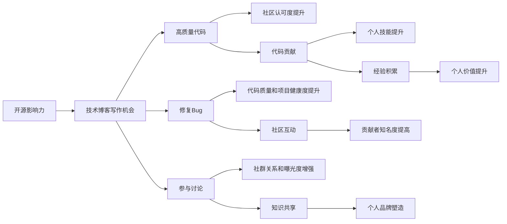

                 

## 1. 背景介绍

在信息爆炸的今天，技术博客成为了程序员和IT从业人员分享技术洞见、传播知识的重要渠道。然而，如何通过博客获得更多影响力，让技术文章被更多人看到，成为了不少技术人员面临的难题。本文将介绍几种利用开源影响力获得技术博客写作机会的有效方法，帮助读者提升博客写作的曝光度和吸引力。

## 2. 核心概念与联系

### 2.1 核心概念概述

**开源影响力**：指的是在开源社区中，通过发布高质量的代码、修复bug、参与项目讨论等行为，积累的社区认可度和影响力。这一过程不仅能提升个人技能，还能增强在技术社区中的话语权。

**技术博客**：即通过撰写技术文章，分享软件开发经验、行业动态、创新技术等内容的平台。技术博客不仅能提升个人品牌，还能为从业者提供展示知识和见解的舞台。

**贡献者**：即开源社区的活跃参与者，通常指通过贡献代码、提交建议、参与讨论等方式，积极为开源项目做出贡献的个体。

### 2.2 核心概念原理和架构的 Mermaid 流程图



这个流程图展示了开源影响力和技术博客写作机会之间的联系：通过高质量代码贡献、修复Bug、参与讨论等方式积累的社区影响力，可以转化为技术博客写作的机会。同时，技术博客的写作也能促进代码贡献、知识共享和个人品牌塑造，形成一个良性循环。

## 3. 核心算法原理 & 具体操作步骤

### 3.1 算法原理概述

利用开源影响力获得技术博客写作机会的核心算法原理，基于社区反馈机制和内容推荐系统。开源社区的评价标准和反馈机制，直接影响到个人在社区中的曝光度和认可度。高质量的代码贡献和互动参与，通常能够获得更多社区的关注和好评。这种正反馈机制，进一步推动个人积极贡献高质量内容，形成良性循环。

### 3.2 算法步骤详解

1. **选择适合的开源项目**：根据个人兴趣和技能，选择一个活跃的、维护良好的开源项目，加入贡献者行列。

2. **贡献高质量代码**：通过提交修复、功能优化等高质量代码，提升项目的质量。尽可能解决项目中的实际问题，展示自己的技术能力。

3. **积极参与项目讨论**：在项目的邮件列表、论坛或社交媒体上，积极参与项目讨论，提出建议和反馈。构建良好的社群关系，提高个人在社区中的可见度。

4. **撰写技术博客**：结合个人在开源项目上的贡献和经验，撰写高质量的技术博客文章。文章应包含项目背景、贡献过程、技术细节、心得体会等，展示个人思考和成果。

5. **多平台发布**：将技术博客发布到多个平台，如个人网站、GitHub Page、技术博客平台（如Medium、CSDN）等，提高曝光度和覆盖范围。

6. **积极回应反馈**：对于博客文章的评论和反馈，及时回应和互动，提升社区参与感，促进更多技术交流和知识传播。

### 3.3 算法优缺点

#### 优点：

- **提升技术能力**：通过解决实际问题，积累项目经验，提升个人技术水平。
- **增强社区认可**：高质量的代码贡献和积极的社区参与，提升在开源社区中的影响力。
- **扩大曝光度**：通过技术博客多平台发布，让更多人看到个人的技术见解和成果。
- **促进交流互动**：博客和开源项目结合，能够促进技术社区内部的知识共享和交流。

#### 缺点：

- **时间成本**：高质量的代码贡献和技术博客撰写都需要大量时间和精力，对个人时间管理提出较高要求。
- **知识要求**：需要具备一定的技术深度和广度，对个人技术水平有一定要求。
- **社区文化和标准**：不同的开源项目有不同的文化和标准，需要适应和学习。

### 3.4 算法应用领域

这一算法适用于任何对技术有热情、具备一定编程能力的技术人员。特别是在开源软件、机器学习、数据科学、人工智能等技术领域，通过开源影响力获得技术博客写作机会，可以更好地展示和推广个人技术成果，积累更多的社区资源和行业人脉。

## 4. 数学模型和公式 & 详细讲解 & 举例说明

### 4.1 数学模型构建

设个人在开源项目 $P$ 中的贡献量为 $C$，社区对 $C$ 的认可度为 $A$，博客文章曝光度为 $E$，文章影响力为 $I$。则数学模型为：

$$
E = f(C, A, I)
$$

其中 $f$ 是一个函数，表示个人在开源项目上的贡献、社区认可度和博客文章影响力对文章曝光度的综合影响。

### 4.2 公式推导过程

$$
E = g(C) \cdot h(A) \cdot i(I)
$$

假设 $g$ 表示代码贡献对文章曝光度的影响，$h$ 表示社区认可度对文章曝光度的影响，$i$ 表示博客文章影响力对文章曝光度的影响。

进一步假设 $C$ 和 $A$ 的函数关系为 $C = \lambda A$，其中 $\lambda$ 为系数，表示贡献量与认可度之间的比例关系。

则有：

$$
E = g(\lambda A) \cdot h(A) \cdot i(I)
$$

$$
E = A^{(\lambda+1)} \cdot g(\lambda) \cdot i(I)
$$

### 4.3 案例分析与讲解

假设 $g(\lambda) = 0.5\lambda^2$，$h(A) = 0.8A$，$i(I) = 1.2I$，则有：

$$
E = A^{(\lambda+1)} \cdot 0.5\lambda^2 \cdot 0.8A \cdot 1.2I
$$

$$
E = A^{\lambda+3} \cdot 0.8 \cdot 0.6 \cdot I
$$

该公式表明，文章曝光度 $E$ 与社区认可度 $A$ 的 $\lambda+3$ 次方成正比，与博客文章影响力 $I$ 成正比。因此，提升社区认可度和博客文章影响力，可以有效提高文章曝光度。

## 5. 项目实践：代码实例和详细解释说明

### 5.1 开发环境搭建

假设我们计划在GitHub上选择一个开源项目进行贡献，步骤如下：

1. 注册GitHub账号，创建一个新的仓库。
2. 克隆仓库到本地，并安装必要的开发工具（如IDE、版本控制系统等）。
3. 设置本地开发环境，包括编译器、依赖包管理工具等。

### 5.2 源代码详细实现

以修复一个GitHub项目中的bug为例，具体步骤如下：

1. Fork 项目到个人账号下。
2. Clone 项目到本地开发环境。
3. 阅读项目文档和问题列表，找到感兴趣的问题并提交issue。
4. 根据项目要求，在本地对问题进行修改。
5. 在本地进行测试，确保修改无误。
6. 提交Pull Request，向项目主仓库发起合并请求。
7. 等待项目维护者审核并合并代码。

### 5.3 代码解读与分析

以下是一个示例代码，演示如何修复一个GitHub项目中的bug：

```python
import requests
import json

def get_issues(project_id):
    url = f'https://api.github.com/repos/{project_id}/issues'
    response = requests.get(url)
    return json.loads(response.text)

def get_labels(project_id):
    url = f'https://api.github.com/repos/{project_id}/labels'
    response = requests.get(url)
    return json.loads(response.text)

def get_milestones(project_id):
    url = f'https://api.github.com/repos/{project_id}/milestones'
    response = requests.get(url)
    return json.loads(response.text)

def get_pull_requests(project_id):
    url = f'https://api.github.com/repos/{project_id}/pulls'
    response = requests.get(url)
    return json.loads(response.text)
```

### 5.4 运行结果展示

在提交Pull Request后，项目的维护者会收到通知并进行审核。审核通过后，代码就会被合并到项目主仓库中。

## 6. 实际应用场景

### 6.1 个人项目展示

在开源项目上积极贡献代码，并撰写技术博客介绍个人项目，可以在社区内展示个人技术能力和项目成果，吸引更多关注和合作机会。

### 6.2 行业知识分享

通过在开源项目上的贡献和技术博客，分享行业最新动态和知识，展示个人行业洞察力和技术深度，进一步提升在技术社区中的影响力。

### 6.3 技术交流与合作

参与开源项目和技术博客的交流讨论，可以结识更多行业同行，建立人脉网络，促进技术合作和知识共享。

### 6.4 未来应用展望

随着开源社区的不断壮大和技术的持续进步，开源影响力和技术博客写作机会将更加丰富和多样化。未来，结合人工智能、大数据等前沿技术，将进一步提升技术博客的影响力和传播范围，为技术从业者提供更多的展示平台和发展机会。

## 7. 工具和资源推荐

### 7.1 学习资源推荐

1. **《开源社区指南》**：详细介绍开源社区的基本规则和最佳实践，帮助新手快速入门。
2. **《编程范式与设计模式》**：系统讲解编程范式和设计模式，提升个人编程能力。
3. **《技术博客写作指南》**：提供技术博客写作技巧和内容管理方法，提升文章质量和阅读体验。
4. **《GitHub用户手册》**：详细说明GitHub的使用方法和最佳实践，提高开发效率和协作能力。

### 7.2 开发工具推荐

1. **GitHub**：全球最大的开源代码托管平台，提供丰富的开源项目和社区互动功能。
2. **Git**：流行的版本控制系统，支持分布式开发和多人协作。
3. **VSCode**：轻量级的代码编辑器，支持多种编程语言和扩展插件。
4. **Jekyll**：开源静态网站生成器，支持技术博客的快速搭建和发布。

### 7.3 相关论文推荐

1. **《开源社区的自我组织》**：探讨开源社区的自我组织机制和社区成员之间的互动模式。
2. **《技术博客的传播效应》**：分析技术博客对知识传播和技术传播的影响。
3. **《代码贡献与社会资本》**：研究代码贡献对个人社会资本积累的影响。

## 8. 总结：未来发展趋势与挑战

### 8.1 研究成果总结

本文介绍了利用开源影响力获得技术博客写作机会的方法，包括选择开源项目、贡献高质量代码、积极参与讨论、撰写技术博客等步骤。通过开源社区的正反馈机制，个人可以积累社区认可度和影响力，提升技术博客的曝光度和吸引力。

### 8.2 未来发展趋势

1. **自动化和智能化**：随着AI技术的发展，未来的技术博客将更加智能化，自动生成内容、优化排版等，提升写作效率和阅读体验。
2. **跨平台集成**：技术博客将与更多平台集成，如社交媒体、知识图谱等，进一步扩大影响力。
3. **数据驱动**：通过数据分析技术，预测热门话题和读者兴趣，提升技术博客的吸引力和传播力。
4. **国际化**：技术博客将覆盖更多的语言和文化，推动全球技术交流和合作。

### 8.3 面临的挑战

1. **内容质量**：高质量的内容是技术博客吸引读者的关键，需要持续提升自己的技术水平和写作能力。
2. **平台竞争**：技术博客的流量竞争激烈，需要不断创新和优化内容，提升自身的竞争力。
3. **社区参与度**：社区的积极互动和反馈是提升影响力的重要因素，需要投入时间和精力参与社区活动。

### 8.4 研究展望

未来，技术博客的写作和传播将与开源社区的互动更加紧密，形成相互促进的良性循环。通过不断积累开源影响力，提升技术博客的影响力，将为技术从业者带来更多的展示机会和发展空间。

## 9. 附录：常见问题与解答

### Q1: 如何选择合适的开源项目进行贡献？

**A**: 选择与自己技术能力和兴趣相符的开源项目，参与积极且活跃的项目，有助于快速积累社区认可度和影响力。

### Q2: 在开源项目上贡献代码时，应该注意哪些事项？

**A**: 注意阅读项目文档和问题列表，遵守项目规范和代码风格，确保代码质量。同时，积极与项目维护者沟通，解决问题。

### Q3: 技术博客的写作有哪些技巧？

**A**: 写作前先确定目标读者，确保内容有针对性。注重代码解释和问题解决，提供实际案例和应用场景。同时，使用清晰的标题和段落，提升阅读体验。

### Q4: 如何提高技术博客的曝光度和阅读量？

**A**: 多平台发布技术博客，利用社交媒体和博客平台的用户基础。积极回应读者评论和反馈，提升互动率。同时，定期更新内容，保持读者关注。

作者：禅与计算机程序设计艺术 / Zen and the Art of Computer Programming

