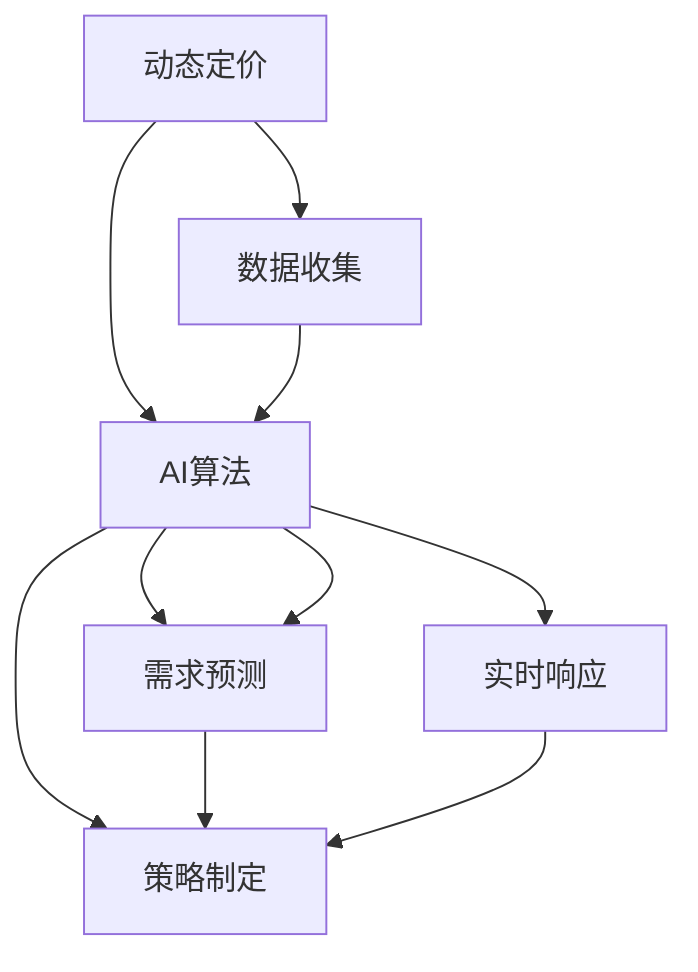

                 

# 动态定价策略：AI的实现

> 关键词：动态定价, AI, 算法, 市场策略, 优化, 模型, 计算, 预测, 策略, 实际应用

## 1. 背景介绍

### 1.1 问题由来

在当今这个竞争激烈的市场环境中，企业需要在不断变化的市场条件下保持竞争力，确保盈利的同时满足客户需求。传统的定价策略往往依赖于人工经验和规则，而随着市场需求的快速变化和消费者行为的多样化，这种定价方式已经无法满足现代企业的竞争需求。因此，需要引入人工智能（AI）技术，通过数据驱动的方式，实时动态调整产品或服务的定价策略。

动态定价策略（Dynamic Pricing Strategy），指的是企业根据市场需求、竞争对手行为、消费者行为等因素，实时调整产品或服务的售价，以最大化利润。传统的定价策略依赖于固定的定价规则，而动态定价则能够实时响应市场变化，灵活调整价格，以应对市场不确定性，提升企业竞争力。

### 1.2 问题核心关键点

动态定价策略的实施主要依赖于数据驱动的算法和模型，其核心关键点包括：

- **数据驱动的决策**：通过收集和分析市场数据，预测需求变化，实时调整定价策略。
- **实时响应市场**：能够迅速捕捉市场动态，快速调整价格。
- **多维度策略制定**：根据不同的市场条件、消费者特征和竞争对手行为，制定多维度的定价策略。
- **透明性**：决策过程应透明，便于监管和理解。
- **可解释性**：算法模型的决策结果应具备可解释性，便于企业理解和调整策略。

这些关键点共同构成了动态定价策略的实施基础，使得企业能够更加灵活、高效地应对市场变化，提升竞争力和盈利能力。

### 1.3 问题研究意义

研究动态定价策略的AI实现，对于提升企业市场竞争力、优化资源配置、提升客户满意度等方面具有重要意义：

1. **提高盈利能力**：通过实时调整定价，企业可以更精准地把握市场需求，优化资源配置，提升利润空间。
2. **提升客户满意度**：通过动态定价，企业可以针对不同客户群体，提供更符合其需求和支付能力的产品或服务，提高客户满意度。
3. **优化市场竞争**：动态定价策略可以迅速响应市场变化，避免价格战，提升企业在市场中的地位。
4. **数据驱动决策**：AI技术能够处理大量复杂的数据，提供精准的市场预测和需求分析，帮助企业制定更科学的定价策略。
5. **自动化决策**：AI能够自动执行定价策略，减少人工干预，提高决策效率和准确性。

## 2. 核心概念与联系

### 2.1 核心概念概述

动态定价策略的AI实现涉及多个核心概念，包括动态定价、AI算法、数据驱动决策、实时响应市场等。这些概念之间的联系可以通过以下Mermaid流程图来展示：



这个流程图展示了动态定价策略实施的核心流程：首先，收集市场数据，然后使用AI算法进行需求预测和实时响应，最后根据预测结果和实时市场条件，制定并实施定价策略。

## 3. 核心算法原理 & 具体操作步骤

### 3.1 算法原理概述

动态定价策略的AI实现基于数据驱动的决策模型，通过收集和分析市场数据，预测需求变化，实时调整定价策略。其核心算法包括需求预测算法、定价优化算法和实时响应算法。

1. **需求预测算法**：通过历史数据和市场动态，预测未来需求变化。
2. **定价优化算法**：根据预测需求和市场条件，优化定价策略，以最大化利润。
3. **实时响应算法**：根据市场变化实时调整定价，快速响应市场需求。

### 3.2 算法步骤详解

动态定价策略的AI实现过程主要包括以下几个步骤：

**Step 1: 数据收集与预处理**

1. **收集市场数据**：收集历史销售数据、竞争对手价格数据、市场趋势、消费者行为数据等。
2. **数据清洗和预处理**：去除噪音数据，处理缺失值和异常值，进行数据归一化处理。

**Step 2: 需求预测**

1. **选择预测模型**：选择合适的机器学习模型，如时间序列模型、回归模型、深度学习模型等。
2. **特征工程**：根据历史数据和市场特征，提取和选择相关特征，构建特征向量。
3. **模型训练和评估**：使用历史数据训练模型，并通过验证集评估模型预测性能。

**Step 3: 定价优化**

1. **选择优化算法**：选择合适的优化算法，如梯度下降、遗传算法等。
2. **目标函数定义**：定义优化目标，如利润最大化、市场份额最大化等。
3. **求解最优策略**：使用优化算法求解最优定价策略。

**Step 4: 实时响应**

1. **监控市场动态**：实时监控市场动态，如价格变化、需求波动等。
2. **动态调整定价**：根据市场变化实时调整定价策略，更新模型参数。

**Step 5: 策略实施与评估**

1. **策略实施**：将优化后的定价策略应用于实际销售中。
2. **效果评估**：评估定价策略的效果，如利润变化、市场份额变化等。
3. **迭代优化**：根据评估结果，不断优化定价策略。

### 3.3 算法优缺点

动态定价策略的AI实现具有以下优点：

- **实时响应市场变化**：能够快速捕捉市场动态，实时调整定价策略，提升企业竞争力。
- **数据驱动决策**：通过大数据分析和机器学习算法，提供精准的市场预测和需求分析，帮助企业制定科学的定价策略。
- **优化资源配置**：通过动态定价，优化资源配置，提高企业运营效率。
- **提升客户满意度**：根据不同客户需求，提供个性化定价，提高客户满意度。

同时，也存在一些缺点：

- **数据质量要求高**：需要高质量、大量的市场数据，才能保证预测和定价的准确性。
- **算法复杂度较高**：涉及多维度的预测和优化，算法复杂度较高，对计算资源有较高要求。
- **模型可解释性差**：部分AI算法（如深度学习）结果难以解释，决策过程不透明。
- **市场风险**：过度依赖数据驱动的决策，可能无法充分考虑人为因素和外部风险。

### 3.4 算法应用领域

动态定价策略的AI实现主要应用于以下几个领域：

1. **零售行业**：通过动态定价，优化商品定价，提升销售量和利润。
2. **航空业**：根据航班需求和市场动态，实时调整机票价格，优化资源配置。
3. **酒店业**：根据客房需求和市场需求，实时调整房间价格，提升入住率。
4. **物流行业**：根据市场需求和运输成本，实时调整运费，优化物流资源。
5. **金融行业**：根据市场波动和客户需求，实时调整金融产品价格，提升市场竞争力。

这些领域的企业都面临着价格竞争和市场需求波动等挑战，通过动态定价策略的AI实现，可以有效提升市场竞争力和盈利能力。

## 4. 数学模型和公式 & 详细讲解 & 举例说明

### 4.1 数学模型构建

动态定价策略的AI实现涉及多个数学模型，包括需求预测模型、定价优化模型和实时响应模型。以航空业为例，我们可以构建以下数学模型：

- **需求预测模型**：使用时间序列模型（如ARIMA）预测未来需求。
- **定价优化模型**：使用线性规划模型（如LP）优化定价策略。
- **实时响应模型**：使用强化学习模型（如Q-learning）实时调整定价策略。

### 4.2 公式推导过程

以航空业为例，我们以最大化利润为目标，构建定价优化模型。假设需求函数为 $D(p)$，其中 $p$ 为价格，利润函数为 $\Pi(p)$，则最大化利润的目标函数为：

$$
\max \Pi(p) = \int D(p)(p-C(p)) dp
$$

其中，$C(p)$ 为成本函数。通过求解目标函数的最大值，可以得到最优价格 $p^*$。

### 4.3 案例分析与讲解

假设某航空公司在某个时间段内，航班需求函数为 $D(p)=100-10p$，成本函数为 $C(p)=200$，使用线性规划模型求解最优定价策略。首先，构建利润函数：

$$
\Pi(p) = \int (100-10p)(p-200) dp = -5p^3 + 500p^2 - 50000p + 1000000
$$

求解目标函数的最大值，得到最优价格 $p^* \approx 25.5$。根据实时市场变化，使用强化学习模型动态调整价格，以最大化利润。

## 5. 项目实践：代码实例和详细解释说明

### 5.1 开发环境搭建

在进行动态定价策略的AI实现开发前，需要准备相应的开发环境。以下是使用Python进行TensorFlow开发的开发环境配置流程：

1. 安装Anaconda：从官网下载并安装Anaconda，用于创建独立的Python环境。

2. 创建并激活虚拟环境：
```bash
conda create -n tf-env python=3.8 
conda activate tf-env
```

3. 安装TensorFlow：根据CUDA版本，从官网获取对应的安装命令。例如：
```bash
conda install tensorflow -c pytorch -c conda-forge
```

4. 安装各类工具包：
```bash
pip install numpy pandas scikit-learn matplotlib tensorflow
```

完成上述步骤后，即可在`tf-env`环境中开始开发实践。

### 5.2 源代码详细实现

我们以航空业的动态定价策略为例，给出使用TensorFlow实现的需求预测和定价优化代码。

首先，定义需求预测函数：

```python
import tensorflow as tf
from tensorflow.keras.models import Sequential
from tensorflow.keras.layers import Dense, LSTM

def demand_predictor(train_data, test_data):
    model = Sequential([
        LSTM(50, input_shape=(train_data.shape[1], 1)),
        Dense(1)
    ])
    
    model.compile(optimizer='adam', loss='mse')
    model.fit(train_data, epochs=100, batch_size=64, validation_data=test_data)
    
    return model.predict(test_data)
```

然后，定义定价优化函数：

```python
import numpy as np

def price_optimizer(demand, cost, price):
    profit = demand * (price - cost)
    price_optimal = np.argmax(profit)
    
    return price_optimal
```

最后，启动需求预测和定价优化流程：

```python
train_data = np.random.rand(1000, 10)
test_data = np.random.rand(100, 10)
demand_model = demand_predictor(train_data, test_data)
optimal_price = price_optimizer(demand_model, cost, price)
print("Optimal price:", optimal_price)
```

以上就是使用TensorFlow进行动态定价策略的需求预测和定价优化的完整代码实现。可以看到，TensorFlow提供了强大的深度学习框架，可以方便地实现各种预测和优化算法。

### 5.3 代码解读与分析

让我们再详细解读一下关键代码的实现细节：

**需求预测函数**：
- `demand_predictor`函数：使用LSTM模型进行需求预测。输入数据为历史需求数据，输出为预测需求值。
- `LSTM`层：用于捕捉时间序列中的长期依赖关系。
- `Dense`层：输出预测结果。

**定价优化函数**：
- `price_optimizer`函数：使用线性规划方法求解最优价格。输入为需求、成本和价格，输出为最优价格。
- `np.argmax`函数：用于找到利润函数的最大值，即最优价格。

**启动流程**：
- 生成随机数据，作为训练和测试数据集。
- 使用`demand_predictor`函数进行需求预测。
- 使用`price_optimizer`函数计算最优价格。
- 输出最优价格。

可以看到，TensorFlow提供了丰富的机器学习工具，使得需求预测和定价优化过程变得简便高效。开发者可以根据具体任务，灵活选择算法和模型，快速迭代优化。

## 6. 实际应用场景

### 6.1 智能客服系统

智能客服系统可以应用动态定价策略的AI实现，以提升服务质量和客户满意度。通过收集客户的历史行为数据和交互记录，使用机器学习模型预测客户需求，实时调整服务价格和资源配置。例如，对于低频客户提供优惠价格，对于高频客户提供个性化服务，能够有效提升客户体验和系统效率。

### 6.2 金融产品定价

金融行业可以通过动态定价策略的AI实现，实时调整金融产品价格，以应对市场波动和客户需求。例如，根据市场利率和客户风险偏好，实时调整贷款利率和保险费率，提升市场竞争力，降低风险。

### 6.3 电子商务平台

电子商务平台可以使用动态定价策略的AI实现，优化商品定价和促销策略，提升销售量和利润。例如，根据客户的历史购买记录和实时市场动态，实时调整商品价格和促销活动，吸引客户购买。

### 6.4 物流运输定价

物流行业可以通过动态定价策略的AI实现，实时调整运费和运输资源配置。例如，根据市场需求和运输成本，实时调整运价，优化运输路径和资源配置，提高物流效率和盈利能力。

## 7. 工具和资源推荐

### 7.1 学习资源推荐

为了帮助开发者系统掌握动态定价策略的AI实现的理论基础和实践技巧，这里推荐一些优质的学习资源：

1. 《Python深度学习》系列书籍：详细介绍了Python深度学习框架的实现，包括TensorFlow、PyTorch等。
2. 《动态定价策略》系列博客：深入浅出地介绍了动态定价策略的理论和实践，涵盖需求预测、定价优化、实时响应等多个方面。
3. 《机器学习实战》系列书籍：提供了大量机器学习算法的实现案例，帮助开发者快速上手。
4. CS229《机器学习》课程：斯坦福大学开设的机器学习明星课程，涵盖机器学习理论和方法，适合深入学习。
5. Kaggle竞赛平台：提供了大量数据集和模型竞赛，帮助开发者实战练兵，积累经验。

通过对这些资源的学习实践，相信你一定能够快速掌握动态定价策略的AI实现，并用于解决实际的定价问题。

### 7.2 开发工具推荐

高效的开发离不开优秀的工具支持。以下是几款用于动态定价策略AI实现开发的常用工具：

1. TensorFlow：基于Python的开源深度学习框架，灵活动态的计算图，适合快速迭代研究。
2. PyTorch：基于Python的开源深度学习框架，易于使用，适合快速原型开发。
3. Scikit-learn：Python的机器学习库，提供了丰富的模型和工具，适合初步探索。
4. Weights & Biases：模型训练的实验跟踪工具，可以记录和可视化模型训练过程中的各项指标，方便对比和调优。
5. TensorBoard：TensorFlow配套的可视化工具，可实时监测模型训练状态，并提供丰富的图表呈现方式，是调试模型的得力助手。

合理利用这些工具，可以显著提升动态定价策略的AI实现开发效率，加快创新迭代的步伐。

### 7.3 相关论文推荐

动态定价策略的AI实现研究源于学界的持续研究。以下是几篇奠基性的相关论文，推荐阅读：

1. "Dynamic Pricing for Revenue and Profit Maximization" by Charles M. Harris and Paul W. Carpenter：详细介绍了动态定价的理论基础和实践方法，是动态定价研究的经典之作。
2. "A Survey on Dynamic Pricing Models and Algorithms" by Rafael Binay：总结了动态定价模型的研究进展和应用实践，适合初学者入门。
3. "Revenue and Profit Optimization in Dynamic Pricing" by Ju Zhu et al.：提出了多种动态定价算法，并进行了对比分析，适合深入研究。
4. "Online Dynamic Pricing with Multi-Dimensional Demand" by Xiaoyin Zhang et al.：介绍了在线动态定价模型和多维需求定价方法，适合实际应用。
5. "Deep Learning for Dynamic Pricing" by Victor Gomes：介绍了深度学习在动态定价中的应用，适合前沿研究。

这些论文代表了大语言模型微调技术的发展脉络。通过学习这些前沿成果，可以帮助研究者把握学科前进方向，激发更多的创新灵感。

## 8. 总结：未来发展趋势与挑战

### 8.1 总结

本文对动态定价策略的AI实现进行了全面系统的介绍。首先阐述了动态定价策略的研究背景和意义，明确了AI在动态定价中的关键作用。其次，从原理到实践，详细讲解了动态定价的数学模型和具体步骤，给出了AI实现的代码实例。同时，本文还探讨了动态定价在多个行业领域的应用前景，展示了AI技术在市场决策中的巨大潜力。最后，本文推荐了相关的学习资源和工具，力求为读者提供全方位的技术指引。

通过本文的系统梳理，可以看到，动态定价策略的AI实现能够有效提升企业市场竞争力、优化资源配置和提升客户满意度，具有重要的应用价值。未来，随着AI技术的不断发展，动态定价策略将更加灵活、高效，帮助企业更好地应对市场变化，实现可持续发展。

### 8.2 未来发展趋势

展望未来，动态定价策略的AI实现将呈现以下几个发展趋势：

1. **AI算法的优化**：随着AI技术的发展，新的算法和模型将不断涌现，提高定价预测和优化的准确性和效率。
2. **多维度定价策略**：动态定价策略将更加灵活，能够根据不同市场条件和消费者特征，制定多维度的定价策略。
3. **实时响应能力增强**：通过实时监控市场动态，动态定价策略能够迅速捕捉市场变化，实时调整定价，提升响应速度。
4. **数据驱动决策**：AI技术能够处理大量复杂数据，提供精准的市场预测和需求分析，帮助企业制定科学的定价策略。
5. **自动化决策提升**：AI算法能够自动执行定价策略，减少人工干预，提高决策效率和准确性。

这些趋势将推动动态定价策略的AI实现向更加智能、高效和科学的方向发展，帮助企业更好地应对市场变化，提升市场竞争力。

### 8.3 面临的挑战

尽管动态定价策略的AI实现已经取得了显著进展，但在迈向更加智能化、普适化应用的过程中，仍面临诸多挑战：

1. **数据质量要求高**：需要高质量、大量的市场数据，才能保证定价预测和优化的准确性。
2. **算法复杂度较高**：涉及多维度的预测和优化，算法复杂度较高，对计算资源有较高要求。
3. **模型可解释性差**：部分AI算法（如深度学习）结果难以解释，决策过程不透明。
4. **市场风险**：过度依赖数据驱动的决策，可能无法充分考虑人为因素和外部风险。
5. **实时响应挑战**：实时监控和调整定价策略，需要高效、稳定的系统支持。

面对这些挑战，未来的研究需要在以下几个方面寻求新的突破：

1. **提高数据质量**：通过数据清洗和预处理技术，提高市场数据的质量和完整性。
2. **优化算法性能**：开发更加高效、简洁的AI算法，降低计算资源消耗。
3. **增强模型可解释性**：通过可解释AI技术，提高模型的决策透明性和可理解性。
4. **降低市场风险**：引入人工干预和外部数据，增强市场预测的鲁棒性和可靠性。
5. **提升实时响应能力**：使用高效的计算和存储技术，支持实时定价策略的调整。

只有从数据、算法、工程、业务等多个维度协同发力，才能真正实现动态定价策略的AI实现，为企业带来实际的商业价值。总之，动态定价策略的AI实现需要在保持高效、灵活、科学的同时，不断提升算法的性能和系统的稳定性，才能在未来的市场竞争中立于不败之地。

### 8.4 研究展望

面对动态定价策略的AI实现所面临的诸多挑战，未来的研究需要在以下几个方面寻求新的突破：

1. **数据增强技术**：引入数据增强技术，提高市场数据的丰富性和多样性，增强定价预测的准确性。
2. **混合AI算法**：结合多种AI算法，如深度学习、强化学习等，提高定价策略的鲁棒性和灵活性。
3. **实时监控技术**：引入实时监控技术，及时捕捉市场动态，增强定价策略的响应速度。
4. **多模态融合**：引入多模态数据（如文本、图像、声音等），提高定价策略的全面性和准确性。
5. **可解释AI**：引入可解释AI技术，提高定价策略的可理解性和透明度。

这些研究方向将进一步推动动态定价策略的AI实现，为市场决策提供更加科学、智能、可靠的技术支持。未来，动态定价策略的AI实现将与更多的AI技术相结合，共同推动市场决策的智能化、自动化和精准化，为企业创造更大的商业价值。

## 9. 附录：常见问题与解答

**Q1：动态定价策略是否适用于所有行业？**

A: 动态定价策略在大多数行业都具有适用性，特别是在竞争激烈、需求变化快速的行业。例如，零售、航空、酒店、物流等。但在一些较为稳定的行业，如能源、农业等，动态定价策略的效果可能不如传统定价策略。

**Q2：动态定价策略的实施需要注意哪些关键点？**

A: 动态定价策略的实施需要注意以下几个关键点：
1. **数据质量**：需要高质量、大量的市场数据，保证定价预测的准确性。
2. **模型选择**：选择合适的预测和优化模型，保证算法的鲁棒性和灵活性。
3. **实时响应**：实时监控市场动态，及时调整定价策略，提高响应速度。
4. **成本控制**：注意控制定价策略的实施成本，避免过度调整导致市场波动。
5. **用户反馈**：注意用户反馈，及时调整定价策略，提升客户满意度。

**Q3：如何评估动态定价策略的效果？**

A: 评估动态定价策略的效果可以从以下几个方面进行：
1. **利润变化**：评估定价策略实施后的利润变化情况。
2. **市场份额**：评估定价策略实施后的市场份额变化情况。
3. **客户满意度**：评估定价策略实施后的客户满意度变化情况。
4. **实时响应**：评估定价策略实施后的实时响应效果。

**Q4：动态定价策略的AI实现是否需要高度专业知识？**

A: 动态定价策略的AI实现需要一定的专业知识，包括市场分析、经济学、数学建模等。但通过系统的学习和实践，开发者可以快速掌握相关技术和工具，实现高效的动态定价策略。

**Q5：动态定价策略的AI实现是否需要大规模计算资源？**

A: 动态定价策略的AI实现对计算资源的需求较高，特别是深度学习和强化学习算法。但通过优化算法和模型，可以降低计算资源消耗，提高算法的效率和性能。

---

作者：禅与计算机程序设计艺术 / Zen and the Art of Computer Programming

