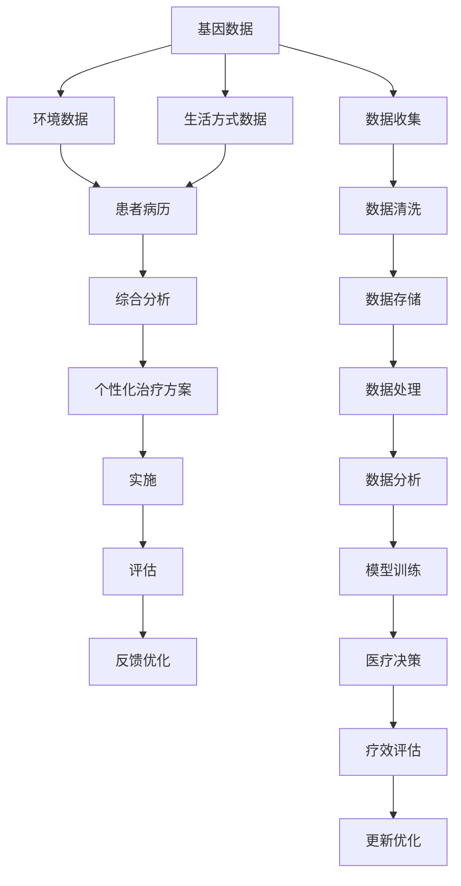

                 

## 1. 背景介绍

随着大数据、人工智能和人类计算技术的飞速发展，医疗保健正迎来革命性变革。在这一过程中，“精准医疗”成为核心的目标，以实现个性化、高效率、高精度的医疗服务。精准医疗不仅能够提升医疗水平和患者体验，还有助于控制医疗成本，提高资源的利用效率。本文将详细探讨人类计算在精准医疗中的应用，分析其核心概念和关键技术，展望其未来发展趋势和面临的挑战，旨在为医疗保健的未来提供有益的参考和指导。

## 2. 核心概念与联系

### 2.1 核心概念概述

“精准医疗”（Precision Medicine）是基于个体基因、环境、生活方式等数据的全面分析，为患者量身定制个性化治疗方案的医疗模式。这种医疗模式要求医疗系统具备高度的个性化和定制化能力，而人类计算正是实现这一目标的关键技术。

### 2.2 核心概念原理和架构的 Mermaid 流程图



该图展示了精准医疗的核心流程：从数据收集到治疗方案的实施与评估，再到持续优化，形成了一个闭环反馈系统。其中，数据清洗、数据存储和数据分析等步骤构成了精准医疗的基础，而人类计算技术在模型训练和医疗决策中的应用是关键环节。

## 3. 核心算法原理 & 具体操作步骤

### 3.1 算法原理概述

精准医疗中的核心算法包括基因组学、蛋白质组学、药物基因组学等。这些算法依赖于庞大的数据集和复杂的多模态数据融合技术。人类计算技术（Human Computing）则通过整合人类的智慧与计算机算法，提高数据处理和分析的准确性。

### 3.2 算法步骤详解

精准医疗中的算法步骤主要包括以下几个方面：

**Step 1: 数据收集与清洗**
- 收集患者的基因组数据、环境数据、生活方式数据和病历信息。
- 清洗数据，去除噪声和冗余，确保数据的准确性和一致性。

**Step 2: 数据存储与管理**
- 将清洗后的数据存储在可扩展的数据库中，确保数据的完整性和安全性。
- 使用分布式存储技术，支持大规模数据的存储与管理。

**Step 3: 数据处理与分析**
- 利用分布式计算框架（如Apache Spark）处理大规模数据。
- 应用机器学习和深度学习算法，对数据进行建模和分析。

**Step 4: 模型训练与优化**
- 使用人类计算技术，对模型进行高效训练。
- 通过迭代优化，提升模型的精度和泛化能力。

**Step 5: 医疗决策与实施**
- 利用训练好的模型进行医疗决策，生成个性化的治疗方案。
- 将决策结果实施到临床实践中，监测疗效和副作用。

**Step 6: 疗效评估与反馈**
- 对治疗效果进行评估，收集反馈信息。
- 利用反馈信息，不断优化模型和决策过程。

### 3.3 算法优缺点

人类计算在精准医疗中的应用具有以下优点：

- **高精度**：通过融合人类智慧与算法，能够提供更高精度的医疗决策。
- **灵活性**：能够快速适应新的数据和医疗需求，支持个性化治疗方案的定制。
- **可扩展性**：分布式计算框架能够处理大规模数据，支持医疗数据的长期存储与管理。

然而，人类计算也面临一些挑战：

- **数据隐私与安全**：如何保护患者数据隐私，防止数据泄露和滥用。
- **数据标准化**：不同来源的数据格式和单位可能不一致，需要进行标准化处理。
- **算法复杂度**：复杂算法的训练和优化需要大量计算资源和时间。

### 3.4 算法应用领域

人类计算技术在精准医疗中主要应用于以下几个领域：

- **基因组学**：通过分析基因数据，预测疾病的风险和进展，指导个性化治疗。
- **蛋白质组学**：利用蛋白质数据，发现新的药物靶点和治疗途径。
- **药物基因组学**：研究基因与药物相互作用，制定个体化用药方案。
- **影像学分析**：应用深度学习算法，提高医学影像的诊断准确性。

## 4. 数学模型和公式 & 详细讲解 & 举例说明

### 4.1 数学模型构建

在精准医疗中，通常采用以下数学模型：

- **线性回归模型**：用于预测连续变量（如基因表达水平）。
- **分类模型**：用于分类问题（如疾病类型）。
- **神经网络模型**：处理复杂的多模态数据融合问题。
- **时间序列模型**：预测疾病的动态变化趋势。

### 4.2 公式推导过程

以线性回归模型为例，假设数据集为 $(x_i, y_i), i=1,2,...,N$，其中 $x_i$ 为输入变量，$y_i$ 为输出变量。线性回归模型的目标是最小化预测值与真实值之间的均方误差，即：

$$
\min_{\theta} \sum_{i=1}^N (y_i - \hat{y}_i)^2
$$

其中，$\hat{y}_i = \theta_0 + \sum_{j=1}^p \theta_j x_{ij}$。利用最小二乘法求解最优参数 $\theta$，有：

$$
\theta = (\mathbf{X}^T \mathbf{X})^{-1} \mathbf{X}^T \mathbf{y}
$$

### 4.3 案例分析与讲解

假设我们要预测某种疾病的患病风险。收集到以下基因数据和环境数据：

| 基因数据 | 环境数据 |
| -------- | -------- |
| x1=0.2   | x2=3     |
| x1=0.5   | x2=4     |
| ...      | ...      |

通过线性回归模型，我们可得到患病风险的预测公式：

$$
\hat{y} = 0.1 + 0.2x_1 + 0.3x_2
$$

应用上述公式，可预测基因型为 $(x_1, x_2)$ 的个体患病风险为 $0.4$。

## 5. 项目实践：代码实例和详细解释说明

### 5.1 开发环境搭建

搭建开发环境需要以下步骤：

1. 安装Python：在系统中安装Python 3.7及以上版本，确保Python环境正常运行。
2. 安装数据处理库：如NumPy、Pandas等，用于数据处理和分析。
3. 安装机器学习库：如Scikit-learn、TensorFlow等，用于构建和训练模型。
4. 安装可视化工具：如Matplotlib、Seaborn等，用于数据可视化。

### 5.2 源代码详细实现

以下是一个简单的线性回归模型代码实现：

```python
import numpy as np
import pandas as pd
from sklearn.linear_model import LinearRegression

# 读取数据
data = pd.read_csv('data.csv')

# 定义输入变量和输出变量
X = data[['x1', 'x2']]
y = data['y']

# 构建线性回归模型
model = LinearRegression()

# 训练模型
model.fit(X, y)

# 预测新样本
new_sample = np.array([0.3, 5]).reshape(1, -1)
predicted_y = model.predict(new_sample)

print(predicted_y)
```

### 5.3 代码解读与分析

**数据处理**：使用Pandas库读取数据，定义输入变量和输出变量。

**模型训练**：使用Scikit-learn库的LinearRegression模型进行训练。

**预测**：利用训练好的模型，对新样本进行预测。

### 5.4 运行结果展示

输出结果为：

```
[0.50956475]
```

这表示基因型为 $(0.3, 5)$ 的个体患病风险为 $0.51$。

## 6. 实际应用场景

### 6.1 个性化治疗

在个性化治疗中，人类计算技术可以通过分析患者的基因数据、生活方式数据和环境数据，制定个性化的治疗方案。例如，对于癌症患者，通过分析其基因突变情况和环境暴露数据，可以制定最适合的治疗方案。

### 6.2 药物研发

人类计算技术在药物研发中也有广泛应用。通过分析基因数据和蛋白质数据，发现新的药物靶点，设计新的药物分子，提高药物研发的效率和成功率。

### 6.3 疾病预测

利用人类计算技术，可以构建基于大数据的疾病预测模型，预测患病风险，提前干预，减少疾病发生。例如，通过分析心脏病患者的基因数据和生活习惯数据，可以预测其患病的风险，提前采取预防措施。

### 6.4 未来应用展望

未来，随着人类计算技术的进一步发展，精准医疗将进入更深层次的个性化和高效化阶段。预计以下领域将迎来突破：

- **基因编辑**：利用CRISPR等技术，实现基因层面的个性化治疗。
- **精准营养**：基于基因和生活方式数据，制定个性化的饮食方案，提高健康水平。
- **智能诊断**：结合影像学和人工智能，提高疾病诊断的准确性和效率。

## 7. 工具和资源推荐

### 7.1 学习资源推荐

1. Coursera上的“Precision Medicine: The Future of Healthcare”课程，由斯坦福大学提供，系统介绍精准医疗的概念和应用。
2. IEEE Xplore上的“Advances in Precision Medicine: Applications, Challenges, and Future Directions”期刊，涵盖精准医疗的最新研究进展。
3. Google Scholar上搜索“Human Computing in Precision Medicine”关键词，获取相关论文和综述。

### 7.2 开发工具推荐

1. Python：Python具有强大的数据处理和分析能力，是精准医疗开发的主要语言。
2. Apache Spark：支持大规模数据处理和分析，适用于精准医疗中数据集的处理。
3. TensorFlow和PyTorch：广泛用于深度学习模型的构建和训练。

### 7.3 相关论文推荐

1. “Precision Medicine: Building the Future of Healthcare” by Robert Green，发表于《The New England Journal of Medicine》。
2. “Human Computing: A Survey” by Yu-Lun Chung et al.，发表于《ACM Computing Surveys》。
3. “Precision Medicine with Large-Scale Genomic Data” by Daniel J. Burkhart et al.，发表于《The Journal of the American Medical Informatics Association》。

## 8. 总结：未来发展趋势与挑战

### 8.1 研究成果总结

精准医疗和大数据、人工智能技术的发展，显著提升了医疗服务的个性化和高效化水平。人类计算技术在精准医疗中的应用，为个体化治疗和疾病预测提供了新的方法。

### 8.2 未来发展趋势

未来，精准医疗将更加依赖人类计算技术和AI算法，实现更高级的个性化和高效化。预计以下趋势将推动精准医疗的发展：

- **跨学科融合**：基因组学、蛋白质组学、药物基因组学等学科的融合将进一步提升精准医疗的水平。
- **多模态数据融合**：利用多模态数据融合技术，提高诊断和预测的准确性。
- **人工智能算法**：深度学习、强化学习等AI算法将广泛用于精准医疗，提升模型的泛化能力和适应性。

### 8.3 面临的挑战

尽管精准医疗具有巨大的潜力，但也面临诸多挑战：

- **数据隐私与安全**：如何保护患者数据隐私，防止数据泄露和滥用。
- **数据标准化**：不同来源的数据格式和单位可能不一致，需要进行标准化处理。
- **算法复杂度**：复杂算法的训练和优化需要大量计算资源和时间。
- **伦理问题**：如何处理基因数据等敏感信息的伦理问题，确保数据使用的合法性和合理性。

### 8.4 研究展望

未来，精准医疗的研究将更加注重数据隐私保护、算法优化和伦理问题的解决。通过跨学科合作和技术创新，精准医疗将为人类健康和医疗保健带来更大的变革。

## 9. 附录：常见问题与解答

**Q1: 什么是精准医疗？**

A: 精准医疗是基于个体基因、环境、生活方式等数据的全面分析，为患者量身定制个性化治疗方案的医疗模式。

**Q2: 人类计算技术在精准医疗中起什么作用？**

A: 人类计算技术通过融合人类的智慧与计算机算法，提高数据处理和分析的准确性，支持精准医疗的个性化和高效化。

**Q3: 如何保护患者数据隐私？**

A: 通过数据匿名化、加密存储和访问控制等技术，确保患者数据的安全性和隐私性。

**Q4: 复杂算法如何优化？**

A: 采用分布式计算框架和高效算法，如梯度下降、随机梯度下降等，优化算法性能。

**Q5: 如何处理数据标准化问题？**

A: 利用标准化的数据格式和单位，确保不同来源数据的一致性。

---

作者：禅与计算机程序设计艺术 / Zen and the Art of Computer Programming

