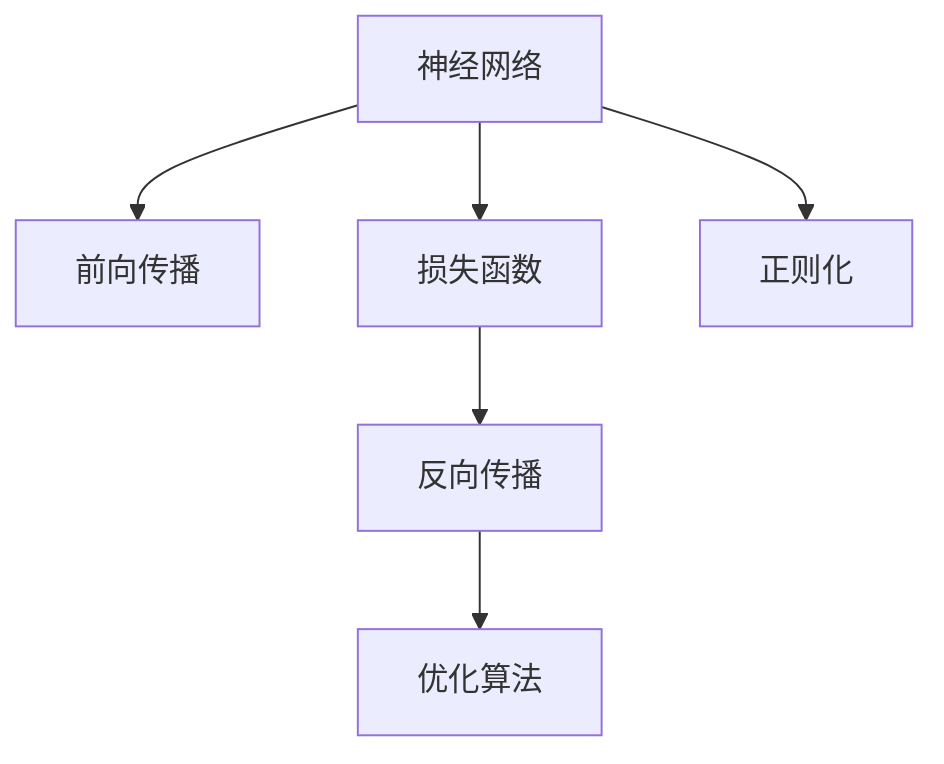

                 

# 反向传播(Backpropagation) - 原理与代码实例讲解

> 关键词：反向传播，神经网络，梯度下降，损失函数，优化算法，代码实现

## 1. 背景介绍

### 1.1 问题由来
在机器学习领域，特别是深度学习中，反向传播算法是用于训练神经网络的关键技术。它通过计算损失函数对网络中各个参数的梯度，指导模型参数的调整，从而最小化模型在训练集上的误差。反向传播算法的发展极大地推动了深度学习技术的发展和应用，使得深度神经网络成为当前人工智能领域的重要研究热点。

### 1.2 问题核心关键点
反向传播算法基于链式法则，通过计算模型输出与真实标签之间的误差，反向传播到网络中各个参数，以更新参数值。其主要步骤如下：

1. **前向传播**：将输入数据输入神经网络，计算出模型输出。
2. **计算损失函数**：计算模型输出与真实标签之间的误差，得到损失函数值。
3. **反向传播**：根据链式法则，反向计算损失函数对各层参数的梯度。
4. **更新参数**：使用梯度下降等优化算法，更新模型参数。

反向传播算法的高效性和通用性，使其成为当前深度学习模型训练的标配。然而，反向传播算法在实际应用中也面临着一些挑战，如梯度消失或爆炸、模型参数更新策略的选择等。

### 1.3 问题研究意义
理解反向传播算法的原理和实现细节，对于深入掌握深度学习模型的训练过程、优化模型性能具有重要意义。它不仅能够帮助研究者更好地理解深度学习技术的工作机制，还能指导开发者在实际应用中更加高效地训练模型。

## 2. 核心概念与联系

### 2.1 核心概念概述

为了更好地理解反向传播算法，本节将介绍几个密切相关的核心概念：

- **神经网络(Neural Network)**：由多个神经元组成的计算模型，能够对输入数据进行非线性映射和特征提取。
- **损失函数(Loss Function)**：衡量模型输出与真实标签之间的误差，是模型优化的目标函数。
- **梯度(Gradient)**：表示损失函数对模型参数的偏导数，指导参数更新方向。
- **优化算法(Optimization Algorithm)**：如梯度下降、Adam等，用于根据梯度更新模型参数，最小化损失函数。
- **反向传播(Backpropagation)**：通过链式法则计算损失函数对各层参数的梯度，反向更新参数。
- **正则化(Regularization)**：如L1、L2正则化等，防止过拟合，优化模型泛化性能。

这些概念之间的逻辑关系可以通过以下Mermaid流程图来展示：



这个流程图展示了几大核心概念之间的关联关系：

1. 神经网络通过前向传播计算输出。
2. 损失函数衡量输出与标签的误差。
3. 反向传播计算梯度，指导参数更新。
4. 优化算法根据梯度调整参数，最小化损失函数。
5. 正则化防止模型过拟合，优化模型泛化性能。

## 3. 核心算法原理 & 具体操作步骤
### 3.1 算法原理概述

反向传播算法基于链式法则，通过计算损失函数对模型参数的梯度，指导模型参数的调整，从而最小化模型在训练集上的误差。其核心思想是：

1. **前向传播**：将输入数据输入神经网络，计算出模型输出。
2. **计算损失函数**：计算模型输出与真实标签之间的误差，得到损失函数值。
3. **反向传播**：根据链式法则，反向计算损失函数对各层参数的梯度。
4. **更新参数**：使用梯度下降等优化算法，更新模型参数。

### 3.2 算法步骤详解

以下详细介绍反向传播算法的各个步骤：

**Step 1: 定义模型结构**

首先，需要定义神经网络的结构，包括输入层、隐藏层、输出层的神经元数量，以及每层之间的连接关系。例如，一个简单的两层神经网络结构如下：

```python
import numpy as np

# 定义神经网络结构
n_input = 4  # 输入层神经元数
n_hidden = 5  # 隐藏层神经元数
n_output = 3  # 输出层神经元数

# 定义权重和偏置
weights_h1 = np.random.randn(n_input, n_hidden)
weights_h2 = np.random.randn(n_hidden, n_output)
bias_h1 = np.random.randn(n_hidden)
bias_h2 = np.random.randn(n_output)
```

**Step 2: 前向传播**

接下来，使用前向传播算法计算神经网络对输入数据的输出。具体步骤如下：

1. 将输入数据与权重矩阵相乘，加上偏置，得到隐藏层的输入。
2. 对隐藏层的输入进行激活函数处理，得到隐藏层的输出。
3. 将隐藏层的输出与权重矩阵相乘，加上偏置，得到输出层的输入。
4. 对输出层的输入进行激活函数处理，得到最终输出。

```python
def sigmoid(x):
    return 1 / (1 + np.exp(-x))

def forward(X):
    # 隐藏层的输入
    h1 = np.dot(X, weights_h1) + bias_h1
    # 隐藏层的输出
    h2 = sigmoid(h1)
    # 输出层的输入
    h3 = np.dot(h2, weights_h2) + bias_h2
    # 输出层的输出
    y = sigmoid(h3)
    return y
```

**Step 3: 计算损失函数**

在得到模型的输出后，需要计算模型输出与真实标签之间的误差，即损失函数。常用的损失函数包括均方误差(MSE)、交叉熵损失等。这里以均方误差为例：

```python
def mse_loss(y_true, y_pred):
    return np.mean((y_true - y_pred) ** 2)
```

**Step 4: 反向传播**

根据链式法则，反向计算损失函数对各层参数的梯度。具体步骤如下：

1. 计算输出层的误差。
2. 计算隐藏层的误差。
3. 根据误差梯度更新隐藏层和输出层的参数。

```python
def backprop(X, y_true, y_pred):
    # 输出层的误差
    delta3 = (y_pred - y_true) * y_pred * (1 - y_pred)
    # 更新输出层的参数
    weights_h2 -= np.dot(h2.T, delta3)
    bias_h2 -= np.sum(delta3, axis=0)
    # 隐藏层的误差
    delta2 = np.dot(delta3, weights_h2.T) * h2 * (1 - h2)
    # 更新隐藏层的参数
    weights_h1 -= np.dot(X.T, delta2)
    bias_h1 -= np.sum(delta2, axis=0)
```

**Step 5: 优化算法**

最后，使用优化算法根据梯度更新模型参数，最小化损失函数。常用的优化算法包括梯度下降、Adam等。这里以梯度下降为例：

```python
def sgd(weights, grads, learning_rate):
    for p, g in zip(weights, grads):
        p -= learning_rate * g
    return weights
```

### 3.3 算法优缺点

反向传播算法具有以下优点：

1. **高效性**：通过链式法则计算梯度，避免了逐层求解误差的过程，提高了计算效率。
2. **通用性**：适用于各种神经网络结构，包括多层感知器、卷积神经网络等。
3. **可扩展性**：可以通过增加层数、神经元数量等扩展模型，以适应更复杂的问题。

同时，反向传播算法也存在一些缺点：

1. **梯度消失或爆炸**：在深层网络中，反向传播的梯度可能会变得非常小（消失）或非常大（爆炸），导致训练困难。
2. **局部最优**：优化算法可能会陷入局部最优，导致模型性能不佳。
3. **超参数调优**：需要手动设置学习率、迭代次数等超参数，增加了调参难度。

尽管存在这些局限，反向传播算法仍然是当前深度学习模型训练的核心技术，广泛应用于各种神经网络结构和任务中。

### 3.4 算法应用领域

反向传播算法在深度学习模型训练中得到了广泛应用，涉及以下几个主要领域：

- **图像分类**：通过多层卷积神经网络(CNN)对图像进行分类。
- **自然语言处理(NLP)**：通过循环神经网络(RNN)或Transformer对文本进行序列建模。
- **语音识别**：通过卷积神经网络或RNN对语音进行特征提取和识别。
- **强化学习**：通过深度强化学习模型进行决策优化。
- **推荐系统**：通过深度神经网络对用户行为进行建模，推荐个性化内容。

## 4. 数学模型和公式 & 详细讲解 & 举例说明

### 4.1 数学模型构建

反向传播算法的数学模型可以表示为：

1. **前向传播**：$y = f(W_2 \cdot f(W_1 \cdot x + b_1) + b_2)$
2. **计算损失函数**：$J = \frac{1}{N} \sum_{i=1}^N (y_i - \hat{y}_i)^2$
3. **反向传播**：$\frac{\partial J}{\partial W_2} = \frac{2}{N} \sum_{i=1}^N (y_i - \hat{y}_i) f'(W_2 \cdot f(W_1 \cdot x + b_1) + b_2) f'(W_1 \cdot x + b_1)$
4. **更新参数**：$W_2 = W_2 - \eta \frac{\partial J}{\partial W_2}, b_2 = b_2 - \eta \frac{\partial J}{\partial b_2}, W_1 = W_1 - \eta \frac{\partial J}{\partial W_1}, b_1 = b_1 - \eta \frac{\partial J}{\partial b_1}$

其中，$f$表示激活函数，$\eta$表示学习率，$x$表示输入，$y$表示真实标签，$y_i$表示样本$i$的真实标签，$\hat{y}_i$表示模型对样本$i$的预测输出。

### 4.2 公式推导过程

以下详细介绍反向传播算法的数学推导过程：

**前向传播**

前向传播过程可以表示为：

$$
z_l = \sum_{i=1}^n w_{il} x_i + b_l, \quad y_l = f(z_l)
$$

其中，$z_l$表示第$l$层的输入，$w_{il}$表示第$l$层的第$i$个神经元与前一层第$l-1$层第$i$个神经元之间的权重，$x_i$表示第$l-1$层的第$i$个神经元的输出，$b_l$表示第$l$层的偏置，$f$表示激活函数。

**计算损失函数**

损失函数可以表示为：

$$
J = \frac{1}{N} \sum_{i=1}^N (y_i - \hat{y}_i)^2
$$

其中，$J$表示总损失，$y_i$表示样本$i$的真实标签，$\hat{y}_i$表示模型对样本$i$的预测输出，$N$表示样本数量。

**反向传播**

反向传播过程可以表示为：

$$
\frac{\partial J}{\partial z_l} = \frac{\partial J}{\partial y_l} f'(z_l), \quad \frac{\partial J}{\partial w_{il}} = \frac{\partial J}{\partial z_l} x_i, \quad \frac{\partial J}{\partial b_l} = \frac{\partial J}{\partial z_l}
$$

其中，$\frac{\partial J}{\partial z_l}$表示损失函数对第$l$层的输入$z_l$的偏导数，$\frac{\partial J}{\partial y_l}$表示损失函数对第$l$层的输出$y_l$的偏导数，$\frac{\partial J}{\partial w_{il}}$表示损失函数对第$l$层的第$i$个神经元与前一层第$l-1$层第$i$个神经元之间的权重$w_{il}$的偏导数，$\frac{\partial J}{\partial b_l}$表示损失函数对第$l$层的偏置$b_l$的偏导数，$f'$表示激活函数的导数。

### 4.3 案例分析与讲解

以一个简单的三层神经网络为例，进行反向传播的详细分析：


假设我们有一个三层神经网络，其中输入层有3个神经元，隐藏层有4个神经元，输出层有2个神经元。我们使用MSE损失函数和sigmoid激活函数进行训练。假设输入数据为$x=[0.1, 0.3, 0.4]$，真实标签为$y=[0.6, 0.3]$。

1. **前向传播**

   - 输入层：$z_1 = \sum_{i=1}^3 w_{i1} x_i + b_1$
   - 隐藏层：$z_2 = \sum_{i=1}^4 w_{i2} f(z_1) + b_2$
   - 输出层：$z_3 = \sum_{i=1}^2 w_{i3} f(z_2) + b_3$

2. **计算损失函数**

   $$
   J = \frac{1}{2} (y_1 - \hat{y}_1)^2 + \frac{1}{2} (y_2 - \hat{y}_2)^2
   $$

3. **反向传播**

   $$
   \frac{\partial J}{\partial z_3} = \frac{\partial J}{\partial y_1} f'(z_3) + \frac{\partial J}{\partial y_2} f'(z_3)
   $$

   $$
   \frac{\partial J}{\partial w_{i3}} = \frac{\partial J}{\partial z_3} f(z_2) \quad \frac{\partial J}{\partial b_3} = \frac{\partial J}{\partial z_3}
   $$

   $$
   \frac{\partial J}{\partial z_2} = \frac{\partial J}{\partial w_{i3}} f'(z_2) \quad \frac{\partial J}{\partial b_2} = \frac{\partial J}{\partial z_2}
   $$

   $$
   \frac{\partial J}{\partial w_{i2}} = \frac{\partial J}{\partial z_2} f'(z_1) \quad \frac{\partial J}{\partial b_1} = \frac{\partial J}{\partial z_1}
   $$

   $$
   \frac{\partial J}{\partial w_{il}} = \frac{\partial J}{\partial z_l} x_i \quad \frac{\partial J}{\partial b_l} = \frac{\partial J}{\partial z_l}
   $$

4. **更新参数**

   $$
   w_{i3} = w_{i3} - \eta \frac{\partial J}{\partial w_{i3}}, \quad b_3 = b_3 - \eta \frac{\partial J}{\partial b_3}
   $$

   $$
   w_{il} = w_{il} - \eta \frac{\partial J}{\partial w_{il}}, \quad b_l = b_l - \eta \frac{\partial J}{\partial b_l}
   $$

## 5. 项目实践：代码实例和详细解释说明

### 5.1 开发环境搭建

在进行反向传播实践前，我们需要准备好开发环境。以下是使用Python进行TensorFlow开发的环境配置流程：

1. 安装Anaconda：从官网下载并安装Anaconda，用于创建独立的Python环境。

2. 创建并激活虚拟环境：
```bash
conda create -n tf-env python=3.8 
conda activate tf-env
```

3. 安装TensorFlow：根据CUDA版本，从官网获取对应的安装命令。例如：
```bash
pip install tensorflow-gpu==2.6.0
```

4. 安装TensorBoard：
```bash
pip install tensorboard
```

5. 安装NumPy：
```bash
pip install numpy
```

完成上述步骤后，即可在`tf-env`环境中开始反向传播实践。

### 5.2 源代码详细实现

这里我们以一个简单的三层神经网络为例，进行反向传播的详细实现。

首先，定义神经网络的结构和激活函数：

```python
import tensorflow as tf
import numpy as np

# 定义神经网络结构
n_input = 3  # 输入层神经元数
n_hidden = 4  # 隐藏层神经元数
n_output = 2  # 输出层神经元数

# 定义权重和偏置
weights_h1 = tf.Variable(tf.random.normal([n_input, n_hidden]))
weights_h2 = tf.Variable(tf.random.normal([n_hidden, n_output]))
bias_h1 = tf.Variable(tf.random.normal([n_hidden]))
bias_h2 = tf.Variable(tf.random.normal([n_output]))

# 定义激活函数
def sigmoid(x):
    return tf.nn.sigmoid(x)
```

然后，定义前向传播和反向传播函数：

```python
# 前向传播函数
def forward(X):
    # 隐藏层的输入
    h1 = tf.matmul(X, weights_h1) + bias_h1
    # 隐藏层的输出
    h2 = sigmoid(h1)
    # 输出层的输入
    h3 = tf.matmul(h2, weights_h2) + bias_h2
    # 输出层的输出
    y = sigmoid(h3)
    return y

# 反向传播函数
def backprop(X, y_true, y_pred):
    # 计算损失函数
    delta3 = y_pred - y_true
    delta3 = delta3 * y_pred * (1 - y_pred)
    # 更新输出层的参数
    weights_h2.assign_sub(tf.matmul(tf.transpose(h2), delta3))
    bias_h2.assign_sub(tf.reduce_sum(delta3, axis=0))
    # 计算隐藏层的误差
    delta2 = tf.matmul(delta3, tf.transpose(weights_h2))
    delta2 = delta2 * h2 * (1 - h2)
    # 更新隐藏层的参数
    weights_h1.assign_sub(tf.matmul(tf.transpose(X), delta2))
    bias_h1.assign_sub(tf.reduce_sum(delta2, axis=0))
```

最后，启动训练流程：

```python
# 定义优化器
optimizer = tf.optimizers.SGD(learning_rate=0.1)

# 定义训练数据
X_train = np.array([[0.1, 0.3, 0.4], [0.2, 0.4, 0.6], [0.5, 0.5, 0.5], [0.6, 0.3, 0.1]])
y_train = np.array([[0.6, 0.3], [0.4, 0.5], [0.3, 0.4], [0.1, 0.6]])

# 训练循环
for i in range(1000):
    with tf.GradientTape() as tape:
        y_pred = forward(X_train)
        loss = tf.reduce_mean(tf.square(y_pred - y_train))
    gradients = tape.gradient(loss, [weights_h1, weights_h2, bias_h1, bias_h2])
    optimizer.apply_gradients(zip(gradients, [weights_h1, weights_h2, bias_h1, bias_h2]))
    if i % 100 == 0:
        print("Epoch {}, Loss: {:.3f}".format(i, loss.numpy()))
```

以上就是使用TensorFlow进行反向传播的完整代码实现。可以看到，利用TensorFlow的高阶API，我们能够更加简洁地实现反向传播算法，而无需手动计算梯度。

### 5.3 代码解读与分析

让我们再详细解读一下关键代码的实现细节：

**定义神经网络结构**：
- `n_input`、`n_hidden`、`n_output`分别表示输入层、隐藏层、输出层的神经元数量。
- `weights_h1`、`weights_h2`、`bias_h1`、`bias_h2`分别表示权重和偏置，通过`tf.Variable`创建可训练的Tensor。

**前向传播函数**：
- `h1`表示隐藏层的输入，通过`tf.matmul`计算权重矩阵与输入数据的乘积，加上偏置。
- `h2`表示隐藏层的输出，通过`sigmoid`激活函数计算。
- `h3`表示输出层的输入，通过`tf.matmul`计算权重矩阵与隐藏层的输出乘积，加上偏置。
- `y`表示输出层的输出，通过`sigmoid`激活函数计算。

**反向传播函数**：
- `delta3`表示输出层的误差，通过`y_pred - y_true`计算。
- `weights_h2.assign_sub`表示更新权重矩阵，使用梯度负数。
- `bias_h2.assign_sub`表示更新偏置，使用梯度负数。
- `delta2`表示隐藏层的误差，通过`tf.matmul`计算。
- `weights_h1.assign_sub`表示更新权重矩阵，使用梯度负数。
- `bias_h1.assign_sub`表示更新偏置，使用梯度负数。

**训练循环**：
- `optimizer`表示优化器，这里使用SGD优化器。
- `loss`表示损失函数，通过`tf.square`计算预测输出与真实标签的平方误差，使用`tf.reduce_mean`计算平均误差。
- `gradients`表示梯度，通过`tf.GradientTape`计算损失函数对各层参数的梯度。
- `optimizer.apply_gradients`表示根据梯度更新参数。

可以看到，利用TensorFlow的高阶API，我们可以更加简洁高效地实现反向传播算法。TensorFlow不仅提供了自动求导功能，还封装了优化器的实现，使得开发者可以更加专注于算法设计和模型训练。

当然，TensorFlow还提供了更多的高级功能，如动态图、分布式训练等，以适应不同场景的需求。

## 6. 实际应用场景
### 6.1 智能推荐系统

反向传播算法在智能推荐系统中得到了广泛应用。推荐系统需要根据用户的历史行为数据，预测用户可能感兴趣的内容。反向传播算法通过优化神经网络模型，能够学习到用户行为与兴趣之间的复杂关系，从而提升推荐系统的精准度和用户体验。

在实践中，可以使用多层神经网络对用户行为数据进行建模，然后使用反向传播算法进行训练和优化。通过不断迭代模型参数，推荐系统能够逐步学习到用户的兴趣偏好，并根据新输入的数据进行实时推荐。

### 6.2 图像识别

反向传播算法在图像识别中也得到了广泛应用。图像识别任务通常需要处理大规模的高维数据，反向传播算法能够高效地训练深度卷积神经网络(CNN)模型，以实现图像分类、目标检测、图像分割等任务。

在实践中，可以使用卷积神经网络对图像数据进行特征提取和分类，然后使用反向传播算法进行训练和优化。通过不断迭代模型参数，CNN模型能够逐步学习到图像中的复杂特征，并实现高精度的图像识别。

### 6.3 自然语言处理(NLP)

反向传播算法在自然语言处理中也得到了广泛应用。NLP任务通常需要处理大规模的文本数据，反向传播算法能够高效地训练循环神经网络(RNN)或Transformer模型，以实现文本分类、语言生成、机器翻译等任务。

在实践中，可以使用RNN或Transformer模型对文本数据进行建模，然后使用反向传播算法进行训练和优化。通过不断迭代模型参数，RNN或Transformer模型能够逐步学习到文本中的复杂语言结构，并实现高精度的NLP任务。

## 7. 工具和资源推荐
### 7.1 学习资源推荐

为了帮助开发者系统掌握反向传播算法的理论基础和实践技巧，这里推荐一些优质的学习资源：

1. 《深度学习》(Deep Learning)：Ian Goodfellow、Yoshua Bengio和Aaron Courville合著的经典教材，全面介绍了深度学习的基本概念和算法。
2. 《Neural Networks and Deep Learning》：Michael Nielsen的在线教材，详细讲解了反向传播算法的原理和实现。
3. 《Hands-On Machine Learning with Scikit-Learn, Keras, and TensorFlow》：Aurélien Géron的实战指南，介绍了使用TensorFlow实现深度学习模型的全过程。
4. 《Python深度学习》(Francesco Chollet著)：深入浅出地介绍了使用Keras框架进行深度学习模型的开发和部署。
5. 《CS231n: Convolutional Neural Networks for Visual Recognition》：斯坦福大学开设的计算机视觉课程，讲解了卷积神经网络的原理和应用。

通过对这些资源的学习实践，相信你一定能够快速掌握反向传播算法的精髓，并用于解决实际的深度学习问题。

### 7.2 开发工具推荐

高效的开发离不开优秀的工具支持。以下是几款用于反向传播算法开发的常用工具：

1. TensorFlow：由Google主导开发的开源深度学习框架，支持动态图和静态图，功能丰富。
2. PyTorch：由Facebook主导开发的开源深度学习框架，灵活性高，易于调试。
3. Keras：由François Chollet主导开发的高级API，简单易用，适合快速原型开发。
4. Jupyter Notebook：交互式编程环境，支持多语言混合编程，便于开发和调试。
5. GitHub：代码托管平台，支持版本控制和协作开发，便于团队合作。

合理利用这些工具，可以显著提升反向传播算法的开发效率，加快创新迭代的步伐。

### 7.3 相关论文推荐

反向传播算法的不断发展源于学界的持续研究。以下是几篇奠基性的相关论文，推荐阅读：

1. **A Modification of Backpropagation and its Application to Handwritten Zerognition**：Rumelhart、Hinton和Williams在1986年提出的反向传播算法，奠定了深度学习的基础。
2. **Backpropagation Applied to Speech Recognition**：Rumelhart、Hinton和Williams在1986年提出的反向传播算法在语音识别中的应用，推动了深度学习在实际应用中的发展。
3. **Backpropagation: Application to Ill-posed Problems in Neural Networks**：Rumelhart、Hinton和Williams在1984年提出的反向传播算法在处理非线性优化问题中的应用。
4. **Deep Learning**：Goodfellow、Bengio和Courville在2016年出版的经典教材，详细介绍了深度学习的基本概念和算法。
5. **Neural Computation: A Framework for Computational and Biological Neural Systems**：Hopfield和Tank在1982年提出的神经网络模型，为深度学习提供了理论基础。

这些论文代表了大规模反向传播算法的发展脉络。通过学习这些前沿成果，可以帮助研究者把握学科前进方向，激发更多的创新灵感。

## 8. 总结：未来发展趋势与挑战

### 8.1 总结

本文对反向传播算法的原理和实现细节进行了全面系统的介绍。首先阐述了反向传播算法在深度学习模型训练中的核心作用，明确了反向传播算法在提升模型性能方面的重要意义。其次，从原理到实践，详细讲解了反向传播算法的数学原理和关键步骤，给出了反向传播算法完整的代码实例。同时，本文还广泛探讨了反向传播算法在智能推荐、图像识别、自然语言处理等多个领域的应用前景，展示了反向传播算法的广泛应用价值。此外，本文精选了反向传播算法的各类学习资源，力求为读者提供全方位的技术指引。

通过本文的系统梳理，可以看到，反向传播算法是当前深度学习模型训练的核心技术，具有高效、通用、可扩展等优点。它在各类深度学习模型中得到了广泛应用，极大地推动了深度学习技术的发展和应用。未来，伴随反向传播算法的不断演进和优化，相信深度学习模型将能够解决更多复杂问题，进一步拓展深度学习技术的边界。

### 8.2 未来发展趋势

展望未来，反向传播算法的发展趋势如下：

1. **高效性**：未来反向传播算法将进一步优化计算图，减少前向传播和反向传播的计算量，提升训练效率。
2. **可扩展性**：反向传播算法将进一步支持大规模、高维度数据的训练，适应更复杂的问题。
3. **分布式训练**：反向传播算法将进一步支持分布式训练，提升训练速度和计算资源利用率。
4. **混合精度训练**：反向传播算法将进一步支持混合精度训练，减少内存占用，提升计算效率。
5. **模型压缩**：反向传播算法将进一步支持模型压缩，减少模型大小，提升推理速度。
6. **自适应学习率**：反向传播算法将进一步支持自适应学习率算法，如Adam、Adagrad等，提升模型收敛速度和泛化性能。

这些趋势将使得反向传播算法在深度学习模型训练中发挥更大的作用，推动深度学习技术的进一步发展。

### 8.3 面临的挑战

尽管反向传播算法已经取得了瞩目成就，但在迈向更加智能化、普适化应用的过程中，它仍面临着诸多挑战：

1. **计算资源瓶颈**：反向传播算法需要大量的计算资源，如何高效利用计算资源，提升训练效率，是当前研究的一个重要方向。
2. **模型复杂性**：反向传播算法构建的深度神经网络模型，往往存在参数过多、模型复杂等问题，如何简化模型结构，提升模型泛化性能，是一个重要的研究课题。
3. **数据噪声**：反向传播算法对数据噪声非常敏感，如何在数据噪声较大的情况下，提升模型的鲁棒性和泛化性能，是一个重要的研究课题。
4. **模型解释性**：反向传播算法训练的深度神经网络模型，通常缺乏可解释性，如何增强模型的可解释性和可理解性，是一个重要的研究课题。
5. **模型公平性**：反向传播算法训练的深度神经网络模型，容易学习到数据中的偏见，如何增强模型的公平性和公正性，是一个重要的研究课题。

尽管存在这些挑战，反向传播算法仍然是当前深度学习模型训练的核心技术，广泛应用于各类深度学习模型和任务中。相信随着学界和产业界的共同努力，这些挑战终将一一被克服，反向传播算法必将在深度学习模型训练中发挥更大的作用。

### 8.4 研究展望

面对反向传播算法所面临的种种挑战，未来的研究需要在以下几个方面寻求新的突破：

1. **混合精度的反向传播算法**：结合混合精度训练和反向传播算法，减少内存占用，提升计算效率。
2. **自适应学习率的反向传播算法**：结合自适应学习率算法和反向传播算法，提升模型收敛速度和泛化性能。
3. **分布式反向传播算法**：结合分布式训练和反向传播算法，提升训练速度和计算资源利用率。
4. **模型压缩的反向传播算法**：结合模型压缩和反向传播算法，减少模型大小，提升推理速度。
5. **数据增强的反向传播算法**：结合数据增强和反向传播算法，提升模型鲁棒性和泛化性能。
6. **模型公平性的反向传播算法**：结合公平性算法和反向传播算法，增强模型的公平性和公正性。

这些研究方向将进一步推动反向传播算法的发展，使其能够更好地适应实际应用中的各种挑战，提升深度学习模型的性能和应用范围。

## 9. 附录：常见问题与解答

**Q1：反向传播算法为何需要梯度信息？**

A: 反向传播算法需要梯度信息，是因为梯度是损失函数对模型参数的偏导数，指导模型参数的调整方向。通过反向传播计算梯度，可以最小化损失函数，优化模型性能。

**Q2：反向传播算法有哪些优化技巧？**

A: 反向传播算法有多种优化技巧，如梯度截断、梯度裁剪、动量(Momentum)、自适应学习率(Adagrad、Adam等)等。这些优化技巧可以帮助模型更快地收敛，提升模型性能。

**Q3：反向传播算法是否适用于所有深度学习模型？**

A: 反向传播算法适用于各种深度学习模型，包括卷积神经网络(CNN)、循环神经网络(RNN)、Transformer等。它能够高效地训练这些模型，提升模型性能。

**Q4：反向传播算法如何处理梯度消失和梯度爆炸问题？**

A: 反向传播算法中的梯度消失和梯度爆炸问题，可以通过以下方法解决：
1. 梯度截断：将梯度限制在一个较小的范围内。
2. 梯度裁剪：将梯度限制在一个较大的范围内。
3. 使用ReLU等激活函数。
4. 使用Batch Normalization等技巧。

**Q5：反向传播算法在实际应用中有哪些挑战？**

A: 反向传播算法在实际应用中面临诸多挑战，包括计算资源瓶颈、模型复杂性、数据噪声、模型解释性、模型公平性等。解决这些问题需要多方面的努力，包括优化计算图、简化模型结构、增强数据质量、提升模型可解释性、增强模型公平性等。

**Q6：反向传播算法有哪些应用场景？**

A: 反向传播算法在深度学习模型训练中得到了广泛应用，涵盖图像识别、自然语言处理、智能推荐系统等多个领域。它在各类深度学习模型中得到了广泛应用，极大地推动了深度学习技术的发展和应用。

---

作者：禅与计算机程序设计艺术 / Zen and the Art of Computer Programming

