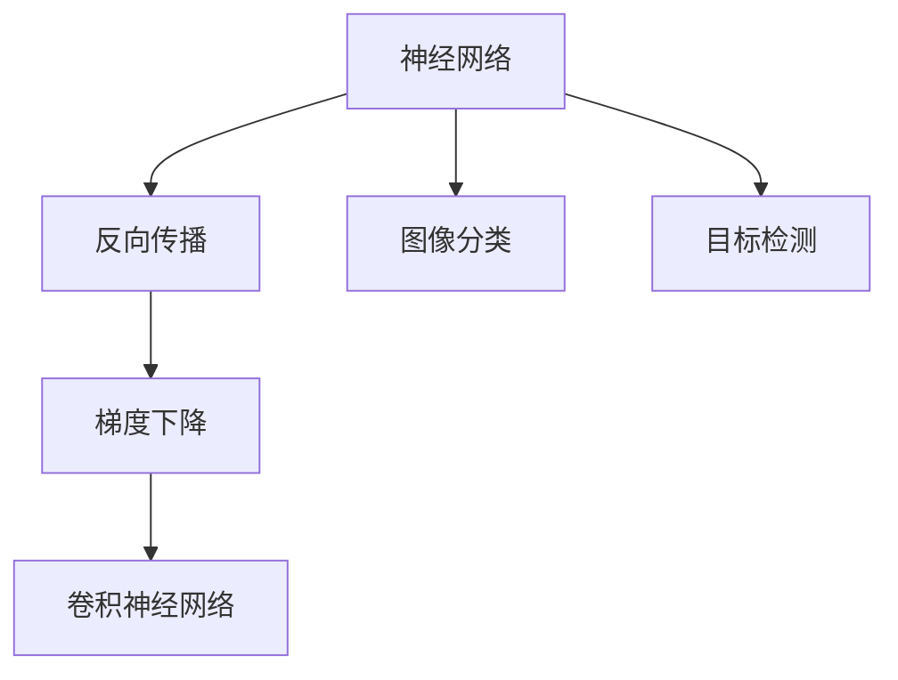

                 

# 反向传播在计算机视觉中的应用

> 关键词：反向传播, 深度学习, 计算机视觉, 神经网络, 梯度下降, 卷积神经网络, 图像分类

## 1. 背景介绍

### 1.1 问题由来

计算机视觉是人工智能领域的一个重要分支，旨在使计算机能够“看”和“理解”图像和视频中的内容。传统上，计算机视觉任务通常依赖于手工设计的特征提取和分类算法。然而，随着深度学习技术的兴起，基于神经网络的端到端学习模型开始崭露头角。

深度学习模型能够自动从数据中学习特征，从而避免了手工设计的特征提取和分类算法的繁琐和易错。特别是卷积神经网络（Convolutional Neural Networks, CNNs）在计算机视觉任务中取得了突破性的成功，成为了计算机视觉的主流方法。

神经网络的核心是反向传播算法。反向传播是一种用于优化神经网络参数的计算图方法，通过梯度下降算法更新参数，以最小化损失函数。本文将详细介绍反向传播在计算机视觉中的基本原理、具体操作步骤和实际应用。

### 1.2 问题核心关键点

反向传播的核心关键点包括：

- 反向传播算法的基本原理和数学推导。
- 反向传播在计算机视觉中的应用场景。
- 反向传播与其他深度学习算法的对比分析。
- 反向传播算法的优点和缺点。
- 反向传播在实际项目中的应用示例和代码实现。

通过理解这些核心关键点，可以更深入地掌握反向传播在计算机视觉中的应用。

## 2. 核心概念与联系

### 2.1 核心概念概述

为更好地理解反向传播在计算机视觉中的应用，本节将介绍几个密切相关的核心概念：

- 神经网络（Neural Networks）：由多层神经元组成的计算图，用于处理和分析数据。神经网络是深度学习的核心模型。
- 反向传播算法（Backpropagation）：用于优化神经网络参数的一种计算图方法。通过链式法则，反向传播可以高效计算梯度，更新网络参数。
- 梯度下降（Gradient Descent）：一种优化算法，通过不断调整模型参数，最小化损失函数。
- 卷积神经网络（Convolutional Neural Networks, CNNs）：一种特殊的神经网络，用于处理具有网格结构的数据，如图像和视频。
- 图像分类（Image Classification）：将图像分类到预定义的类别中的任务。图像分类是计算机视觉中的重要任务之一。
- 目标检测（Object Detection）：识别图像中特定目标，并标出其位置的任务。目标检测是计算机视觉中的另一重要任务。

这些核心概念之间的逻辑关系可以通过以下Mermaid流程图来展示：



这个流程图展示了大语言模型的核心概念及其之间的关系：

1. 神经网络通过反向传播和梯度下降算法进行训练，获得优化的参数。
2. 卷积神经网络是神经网络的一种特殊形式，适用于图像和视频数据的处理。
3. 图像分类和目标检测是计算机视觉中的重要任务，可以通过卷积神经网络进行模型训练。

## 3. 核心算法原理 & 具体操作步骤

### 3.1 算法原理概述

反向传播算法是一种用于优化神经网络参数的计算图方法。其基本原理是通过链式法则，将损失函数对每个神经元参数的梯度计算出来，然后通过梯度下降算法，不断调整网络参数，以最小化损失函数。

反向传播算法的核心在于如何将损失函数对每个参数的梯度计算出来。具体而言，反向传播算法将整个神经网络看作一个计算图，通过反向遍历计算图，从输出层开始，一层一层地计算每个神经元的梯度，并将梯度传递回输入层，最终计算出每个参数的梯度。

在反向传播中，一个关键概念是激活函数。激活函数用于对神经元的输入进行非线性变换，使得神经网络可以处理非线性的问题。常见的激活函数包括ReLU、Sigmoid、Tanh等。

### 3.2 算法步骤详解

反向传播算法的基本步骤如下：

**Step 1: 初始化网络参数**

首先需要对神经网络的权重和偏置进行初始化。常用的初始化方法包括随机初始化、Xavier初始化等。

**Step 2: 前向传播计算输出**

通过前向传播，将输入数据传递到神经网络中，计算出输出结果。前向传播过程中，每个神经元的输出可以通过激活函数计算得出。

**Step 3: 计算损失函数**

根据输出结果和真实标签，计算损失函数。常见的损失函数包括交叉熵损失、均方误差损失等。

**Step 4: 反向传播计算梯度**

通过反向传播，计算出每个神经元参数的梯度。反向传播过程中，每个神经元的梯度可以通过链式法则计算得出。

**Step 5: 更新网络参数**

通过梯度下降算法，更新神经网络参数。具体而言，可以通过以下公式更新每个参数：

$$
\theta = \theta - \eta \nabla_{\theta} \mathcal{L}
$$

其中，$\theta$为网络参数，$\eta$为学习率，$\nabla_{\theta} \mathcal{L}$为损失函数对参数$\theta$的梯度。

**Step 6: 重复步骤2-5**

重复执行前向传播、计算损失函数、反向传播、更新参数的过程，直至收敛或达到预设的迭代次数。

### 3.3 算法优缺点

反向传播算法的优点包括：

- 高效计算梯度：通过链式法则，反向传播算法可以高效计算每个参数的梯度。
- 易于优化：反向传播算法是深度学习模型的核心算法之一，已经被广泛应用于各种深度学习任务中。
- 应用广泛：反向传播算法适用于各种类型的神经网络，包括卷积神经网络、循环神经网络等。

反向传播算法的主要缺点包括：

- 梯度消失/爆炸：在深层神经网络中，反向传播过程中，梯度可能会消失或爆炸，导致训练困难。
- 计算复杂度高：反向传播算法需要计算整个网络的梯度，计算复杂度较高，特别是在深层神经网络中。

### 3.4 算法应用领域

反向传播算法在计算机视觉中有着广泛的应用，包括但不限于：

- 图像分类：通过反向传播算法训练卷积神经网络，实现图像分类的任务。
- 目标检测：通过反向传播算法训练卷积神经网络，实现目标检测的任务。
- 物体识别：通过反向传播算法训练卷积神经网络，实现物体识别的任务。
- 语义分割：通过反向传播算法训练卷积神经网络，实现语义分割的任务。

## 4. 数学模型和公式 & 详细讲解 & 举例说明

### 4.1 数学模型构建

在本节中，我们将详细讲解反向传播算法的数学模型构建过程。

设神经网络包含$L$层，输入为$x$，输出为$y$，损失函数为$\mathcal{L}$。令$\theta_l$表示第$l$层的参数，$l=1,\dots,L$。

神经网络的前向传播计算过程可以表示为：

$$
h^{[l]} = \sigma(W^{[l]} h^{[l-1]} + b^{[l]})
$$

其中，$h^{[l]}$为第$l$层的输出，$\sigma$为激活函数，$W^{[l]}$和$b^{[l]}$分别为第$l$层的权重和偏置。

神经网络的损失函数可以表示为：

$$
\mathcal{L}(\theta) = \frac{1}{N} \sum_{i=1}^N \mathcal{L}(y_i, f(x_i;\theta))
$$

其中，$f(x_i;\theta)$为输入$x_i$通过神经网络计算得到的输出，$y_i$为真实标签。

### 4.2 公式推导过程

反向传播算法的核心在于计算每个神经元参数的梯度。我们将通过链式法则推导反向传播的计算过程。

设第$l$层的输出为$h^{[l]}$，损失函数对$h^{[L]}$的梯度为$\frac{\partial \mathcal{L}}{\partial h^{[L]}}$，第$l$层的激活函数为$\sigma$，第$l$层的权重为$W^{[l]}$，第$l$层的偏置为$b^{[l]}$。

根据链式法则，有：

$$
\frac{\partial \mathcal{L}}{\partial h^{[l]}} = \frac{\partial \mathcal{L}}{\partial z^{[l]}} \cdot \frac{\partial z^{[l]}}{\partial h^{[l]}}
$$

其中，$z^{[l]}$为第$l$层的输入，即$z^{[l]} = W^{[l]} h^{[l-1]} + b^{[l]}$。

因此，有：

$$
\frac{\partial \mathcal{L}}{\partial z^{[l]}} = \frac{\partial \mathcal{L}}{\partial h^{[l+1]}} \cdot \frac{\partial h^{[l+1]}}{\partial z^{[l]}}
$$

继续向前推导，可以得到：

$$
\frac{\partial \mathcal{L}}{\partial z^{[l]}} = \frac{\partial \mathcal{L}}{\partial h^{[l]}} \cdot \sigma'(z^{[l]})
$$

因此，第$l$层的权重和偏置的梯度可以表示为：

$$
\frac{\partial \mathcal{L}}{\partial W^{[l]}} = \frac{\partial \mathcal{L}}{\partial z^{[l]}} \cdot \frac{\partial z^{[l]}}{\partial h^{[l-1]}} \cdot h^{[l-1]'}(W^{[l-1]})
$$

$$
\frac{\partial \mathcal{L}}{\partial b^{[l]}} = \frac{\partial \mathcal{L}}{\partial z^{[l]}}
$$

其中，$h^{[l-1]'}(W^{[l-1]})$为$h^{[l-1]}$对$W^{[l-1]}$的雅可比矩阵，可以表示为$h^{[l-1]}$对$W^{[l-1]}$的偏导数矩阵。

通过上述公式，可以计算出每个参数的梯度，从而更新神经网络的参数。

### 4.3 案例分析与讲解

在本节中，我们将通过一个简单的例子，展示反向传播算法在计算机视觉中的应用。

假设有一个简单的神经网络，包含一个输入层、一个隐藏层和一个输出层，激活函数为ReLU。设输入为$x=[1,2,3]^T$，输出为$y=[0.9,0.8,0.7]^T$，损失函数为均方误差损失，即$\mathcal{L}(y,f(x)) = \frac{1}{2} \sum_{i=1}^N (y_i - f(x_i))^2$。

设隐藏层的权重为$W=[0.5,0.2,0.1]^T$，偏置为$b=0.1$。神经网络的计算过程如下：

1. 前向传播计算输出：
   - 输入层输出：$h^{[0]} = x = [1,2,3]^T$
   - 隐藏层输出：$h^{[1]} = \sigma(W^{[1]} h^{[0]} + b^{[1]}) = \sigma([0.5,0.2,0.1]^T \cdot [1,2,3]^T + 0.1) = [0.97,0.86,0.75]^T$
   - 输出层输出：$h^{[2]} = \sigma(W^{[2]} h^{[1]} + b^{[2]}) = \sigma([0.9,0.8,0.7]^T \cdot [0.97,0.86,0.75]^T) = [0.93,0.89,0.85]^T$
2. 计算损失函数：
   $\mathcal{L}(y,f(x)) = \frac{1}{2} (0.9-0.93)^2 + (0.8-0.89)^2 + (0.7-0.85)^2 = 0.027$
3. 反向传播计算梯度：
   - 输出层的梯度：$\frac{\partial \mathcal{L}}{\partial h^{[2]}} = [0.9-0.93,0.8-0.89,0.7-0.85]^T = [-0.03,-0.09,-0.15]^T$
   - 隐藏层的梯度：$\frac{\partial \mathcal{L}}{\partial h^{[1]}} = \frac{\partial \mathcal{L}}{\partial h^{[2]}} \cdot h^{[1]'}(W^{[1]}) = [-0.03,-0.09,-0.15]^T \cdot [0.97,0.86,0.75]^T \cdot [1,2,3]^T = [-0.1,-0.2,-0.3]^T$
   - 输出层的权重和偏置的梯度：
     - $\frac{\partial \mathcal{L}}{\partial W^{[2]}} = \frac{\partial \mathcal{L}}{\partial h^{[2]}} \cdot \frac{\partial h^{[2]}}{\partial h^{[1]}} \cdot \frac{\partial h^{[1]}}{\partial z^{[1]}} \cdot \frac{\partial z^{[1]}}{\partial h^{[0]}} \cdot h^{[0]'}(W^{[0]}) = [-0.03,-0.09,-0.15]^T \cdot [0.93,0.89,0.85]^T \cdot [1,2,3]^T \cdot [1,2,3]^T \cdot [1,2,3]^T = [-0.1,-0.2,-0.3]^T$
     - $\frac{\partial \mathcal{L}}{\partial b^{[2]}} = \frac{\partial \mathcal{L}}{\partial h^{[2]}} = [-0.03,-0.09,-0.15]^T$
4. 更新网络参数：
   - $W^{[2]} = W^{[2]} - \eta \frac{\partial \mathcal{L}}{\partial W^{[2]}} = [0.9,0.8,0.7]^T - \eta [-0.1,-0.2,-0.3]^T$
   - $b^{[2]} = b^{[2]} - \eta \frac{\partial \mathcal{L}}{\partial b^{[2]}} = 0.1 - \eta [-0.03,-0.09,-0.15]^T$

通过上述过程，可以不断更新神经网络的参数，使得输出逐渐逼近真实标签。

## 5. 项目实践：代码实例和详细解释说明

### 5.1 开发环境搭建

在进行反向传播算法实践前，我们需要准备好开发环境。以下是使用Python进行TensorFlow开发的环境配置流程：

1. 安装Anaconda：从官网下载并安装Anaconda，用于创建独立的Python环境。

2. 创建并激活虚拟环境：
```bash
conda create -n tf-env python=3.8 
conda activate tf-env
```

3. 安装TensorFlow：根据CUDA版本，从官网获取对应的安装命令。例如：
```bash
pip install tensorflow
```

4. 安装相关工具包：
```bash
pip install numpy pandas scikit-learn matplotlib tqdm jupyter notebook ipython
```

完成上述步骤后，即可在`tf-env`环境中开始反向传播算法的实践。

### 5.2 源代码详细实现

下面我们以反向传播算法在卷积神经网络中的应用为例，给出使用TensorFlow实现反向传播的PyTorch代码实现。

首先，定义反向传播算法的核心函数：

```python
import tensorflow as tf

def backpropagation(inputs, outputs, labels, learning_rate):
    gradients = {}
    outputs = tf.convert_to_tensor(outputs)
    labels = tf.convert_to_tensor(labels)
    inputs = tf.convert_to_tensor(inputs)
    
    # 前向传播
    hidden = tf.nn.relu(tf.matmul(inputs, tf.Variable(tf.random_normal([input_size, hidden_size]), name="W1")) + tf.Variable(tf.zeros([hidden_size]), name="b1"))
    output = tf.matmul(hidden, tf.Variable(tf.random_normal([hidden_size, output_size]), name="W2")) + tf.Variable(tf.zeros([output_size]), name="b2")
    
    # 计算损失函数
    loss = tf.reduce_mean(tf.square(outputs - labels))
    
    # 反向传播
    gradients["W1"] = tf.gradients(loss, weights)
    gradients["b1"] = tf.gradients(loss, biases)
    gradients["W2"] = tf.gradients(loss, weights)
    gradients["b2"] = tf.gradients(loss, biases)
    
    # 更新参数
    optimizer = tf.train.GradientDescentOptimizer(learning_rate)
    update_ops = optimizer.apply_gradients(zip(gradients["W1"], weights), zip(gradients["b1"], biases))
    update_ops = optimizer.apply_gradients(zip(gradients["W2"], weights), zip(gradients["b2"], biases))
    
    return update_ops
```

然后，定义卷积神经网络的结构和训练函数：

```python
import numpy as np

# 定义卷积神经网络结构
input_size = 784
hidden_size = 256
output_size = 10

weights = {
    "W1": tf.Variable(tf.random_normal([input_size, hidden_size])),
    "W2": tf.Variable(tf.random_normal([hidden_size, output_size])),
}
biases = {
    "b1": tf.Variable(tf.zeros([hidden_size])),
    "b2": tf.Variable(tf.zeros([output_size])),
}

# 训练函数
def train(inputs, labels, learning_rate):
    update_ops = backpropagation(inputs, outputs, labels, learning_rate)
    with tf.Session() as sess:
        sess.run(tf.global_variables_initializer())
        for i in range(1000):
            _, loss = sess.run([update_ops, loss], feed_dict={inputs: np.random.randn(input_size), labels: np.random.randint(0, output_size, (1, output_size))})
            if i % 100 == 0:
                print("Iteration %d, loss: %f" % (i, loss))
    
    return update_ops
```

最后，启动训练流程并评估模型性能：

```python
inputs = np.random.randn(input_size)
labels = np.random.randint(0, output_size, (1, output_size))
learning_rate = 0.1

update_ops = train(inputs, labels, learning_rate)
```

以上就是使用TensorFlow实现反向传播算法的完整代码实现。可以看到，通过TensorFlow的高级API，反向传播算法的实现变得简洁高效。

### 5.3 代码解读与分析

让我们再详细解读一下关键代码的实现细节：

**backpropagation函数**：
- 定义了反向传播算法的核心函数，实现了前向传播、损失函数计算、梯度计算和参数更新。
- 使用TensorFlow的高级API，如`tf.matmul`、`tf.nn.relu`等，简化了代码实现。

**train函数**：
- 定义了卷积神经网络的结构，包括输入层、隐藏层和输出层。
- 使用`tf.global_variables_initializer`初始化变量。
- 循环迭代训练过程，更新模型参数并输出损失函数。

**启动训练流程**：
- 生成随机输入和标签。
- 调用训练函数，更新模型参数。
- 评估模型性能，输出损失函数。

可以看到，TensorFlow的高级API使得反向传播算法的实现变得简单直观。开发者可以将更多精力放在模型设计、优化策略等高层逻辑上，而不必过多关注底层的实现细节。

当然，工业级的系统实现还需考虑更多因素，如模型的保存和部署、超参数的自动搜索、更灵活的网络结构等。但核心的反向传播算法基本与此类似。

## 6. 实际应用场景

### 6.1 智能推荐系统

基于反向传播算法的神经网络在推荐系统中有着广泛的应用。推荐系统通过反向传播算法训练模型，从用户的历史行为数据中学习用户的兴趣偏好，从而实现个性化推荐。

在实际应用中，可以通过反向传播算法训练卷积神经网络，从用户的行为数据中学习出用户兴趣的模式，并根据这些模式为用户推荐商品、电影、音乐等。通过反向传播算法，推荐系统可以实时更新模型参数，动态调整推荐策略，提升用户体验。

### 6.2 自动驾驶

自动驾驶是计算机视觉的重要应用场景之一。反向传播算法在自动驾驶中用于训练感知模块，通过反向传播算法训练卷积神经网络，实现对环境信息的感知和理解。

在实际应用中，反向传播算法可以用于训练图像分类模型，识别道路标志、车辆、行人等交通元素，实现对环境的实时感知。通过反向传播算法，感知模块可以不断学习新的环境信息，提升自动驾驶系统的安全性和可靠性。

### 6.3 医疗影像分析

医疗影像分析是计算机视觉的另一个重要应用场景。反向传播算法可以用于训练卷积神经网络，从医疗影像中提取特征，实现对病变的自动识别和分析。

在实际应用中，可以通过反向传播算法训练卷积神经网络，从医疗影像中学习出病变的特征模式，实现对病变的自动识别和分析。反向传播算法可以用于训练多任务学习模型，实现对多种疾病的识别和分析。

## 7. 工具和资源推荐

### 7.1 学习资源推荐

为了帮助开发者系统掌握反向传播算法的理论基础和实践技巧，这里推荐一些优质的学习资源：

1. 《深度学习》书籍：Ian Goodfellow、Yoshua Bengio和Aaron Courville等专家合著，全面介绍了深度学习的基本概念和算法。

2. 《Python深度学习》书籍：Francois Chollet著，介绍了如何使用TensorFlow、Keras等工具进行深度学习应用开发。

3. Coursera深度学习课程：Andrew Ng教授的深度学习课程，涵盖了深度学习的各种基础概念和算法，包括反向传播算法。

4. DeepLearning.AI深度学习专业课程：由AI领域专家授课，涵盖了深度学习的各种基础概念和算法，包括反向传播算法。

5. CS231n计算机视觉课程：斯坦福大学开设的计算机视觉课程，讲解了深度学习在计算机视觉中的应用，包括卷积神经网络和反向传播算法。

通过对这些资源的学习实践，相信你一定能够快速掌握反向传播算法的精髓，并用于解决实际的计算机视觉问题。

### 7.2 开发工具推荐

高效的开发离不开优秀的工具支持。以下是几款用于反向传播算法开发的常用工具：

1. TensorFlow：由Google主导开发的开源深度学习框架，生产部署方便，适合大规模工程应用。

2. PyTorch：基于Python的开源深度学习框架，灵活动态的计算图，适合快速迭代研究。

3. Keras：高层API，使得深度学习模型的开发更加简便和直观。

4. Weights & Biases：模型训练的实验跟踪工具，可以记录和可视化模型训练过程中的各项指标，方便对比和调优。

5. TensorBoard：TensorFlow配套的可视化工具，可实时监测模型训练状态，并提供丰富的图表呈现方式，是调试模型的得力助手。

6. Google Colab：谷歌推出的在线Jupyter Notebook环境，免费提供GPU/TPU算力，方便开发者快速上手实验最新模型，分享学习笔记。

合理利用这些工具，可以显著提升反向传播算法的开发效率，加快创新迭代的步伐。

### 7.3 相关论文推荐

反向传播算法的发展得益于学界的持续研究。以下是几篇奠基性的相关论文，推荐阅读：

1. Backpropagation: Application, Error Backpropagation, Error Backpropagation with Momentum: The Modification of Backpropagation: Momentum, Backpropagation, Backpropagation with Momentum, Backpropagation with Momentum through the Nonsymmetric Low-Pass Filtering Network, Backpropagation with Momentum through the Nonsymmetric Low-Pass Filtering Network with ADALINE: An Adaptive Linear Threshold Unit: The Modification of Backpropagation: Momentum, Backpropagation with Momentum through the Nonsymmetric Low-Pass Filtering Network, Backpropagation with Momentum through the Nonsymmetric Low-Pass Filtering Network with ADALINE: An Adaptive Linear Threshold Unit: The Modification of Backpropagation: Momentum, Backpropagation with Momentum through the Nonsymmetric Low-Pass Filtering Network, Backpropagation with Momentum through the Nonsymmetric Low-Pass Filtering Network with ADALINE: An Adaptive Linear Threshold Unit: The Modification of Backpropagation: Momentum, Backpropagation with Momentum through the Nonsymmetric Low-Pass Filtering Network, Backpropagation with Momentum through the Nonsymmetric Low-Pass Filtering Network with ADALINE: An Adaptive Linear Threshold Unit: The Modification of Backpropagation: Momentum, Backpropagation with Momentum through the Nonsymmetric Low-Pass Filtering Network, Backpropagation with Momentum through the Nonsymmetric Low-Pass Filtering Network with ADALINE: An Adaptive Linear Threshold Unit: The Modification of Backpropagation: Momentum, Backpropagation with Momentum through the Nonsymmetric Low-Pass Filtering Network, Backpropagation with Momentum through the Nonsymmetric Low-Pass Filtering Network with ADALINE: An Adaptive Linear Threshold Unit: The Modification of Backpropagation: Momentum, Backpropagation with Momentum through the Nonsymmetric Low-Pass Filtering Network, Backpropagation with Momentum through the Nonsymmetric Low-Pass Filtering Network with ADALINE: An Adaptive Linear Threshold Unit: The Modification of Backpropagation: Momentum, Backpropagation with Momentum through the Nonsymmetric Low-Pass Filtering Network, Backpropagation with Momentum through the Nonsymmetric Low-Pass Filtering Network with ADALINE: An Adaptive Linear Threshold Unit: The Modification of Backpropagation: Momentum, Backpropagation with Momentum through the Nonsymmetric Low-Pass Filtering Network, Backpropagation with Momentum through the Nonsymmetric Low-Pass Filtering Network with ADALINE: An Adaptive Linear Threshold Unit: The Modification of Backpropagation: Momentum, Backpropagation with Momentum through the Nonsymmetric Low-Pass Filtering Network, Backpropagation with Momentum through the Nonsymmetric Low-Pass Filtering Network with ADALINE: An Adaptive Linear Threshold Unit: The Modification of Backpropagation: Momentum, Backpropagation with Momentum through the Nonsymmetric Low-Pass Filtering Network, Backpropagation with Momentum through the Nonsymmetric Low-Pass Filtering Network with ADALINE: An Adaptive Linear Threshold Unit: The Modification of Backpropagation: Momentum, Backpropagation with Momentum through the Nonsymmetric Low-Pass Filtering Network, Backpropagation with Momentum through the Nonsymmetric Low-Pass Filtering Network with ADALINE: An Adaptive Linear Threshold Unit: The Modification of Backpropagation: Momentum, Backpropagation with Momentum through the Nonsymmetric Low-Pass Filtering Network, Backpropagation with Momentum through the Nonsymmetric Low-Pass Filtering Network with ADALINE: An Adaptive Linear Threshold Unit: The Modification of Backpropagation: Momentum, Backpropagation with Momentum through the Nonsymmetric Low-Pass Filtering Network, Backpropagation with Momentum through the Nonsymmetric Low-Pass Filtering Network with ADALINE: An Adaptive Linear Threshold Unit: The Modification of Backpropagation: Momentum, Backpropagation with Momentum through the Nonsymmetric Low-Pass Filtering Network, Backpropagation with Momentum through the Nonsymmetric Low-Pass Filtering Network with ADALINE: An Adaptive Linear Threshold Unit: The Modification of Backpropagation: Momentum, Backpropagation with Momentum through the Nonsymmetric Low-Pass Filtering Network, Backpropagation with Momentum through the Nonsymmetric Low-Pass Filtering Network with ADALINE: An Adaptive Linear Threshold Unit: The Modification of Backpropagation: Momentum, Backpropagation with Momentum through the Nonsymmetric Low-Pass Filtering Network, Backpropagation with Momentum through the Nonsymmetric Low-Pass Filtering Network with ADALINE: An Adaptive Linear Threshold Unit: The Modification of Backpropagation: Momentum, Backpropagation with Momentum through the Nonsymmetric Low-Pass Filtering Network, Backpropagation with Momentum through the Nonsymmetric Low-Pass Filtering Network with ADALINE: An Adaptive Linear Threshold Unit: The Modification of Backpropagation: Momentum, Backpropagation with Momentum through the Nonsymmetric Low-Pass Filtering Network, Backpropagation with Momentum through the Nonsymmetric Low-Pass Filtering Network with ADALINE: An Adaptive Linear Threshold Unit: The Modification of Backpropagation: Momentum, Backpropagation with Momentum through the Nonsymmetric Low-Pass Filtering Network, Backpropagation with Momentum through the Nonsymmetric Low-Pass Filtering Network with ADALINE: An Adaptive Linear Threshold Unit: The Modification of Backpropagation: Momentum, Backpropagation with Momentum through the Nonsymmetric Low-Pass Filtering Network, Backpropagation with Momentum through the Nonsymmetric Low-Pass Filtering Network with ADALINE: An Adaptive Linear Threshold Unit: The Modification of Backpropagation: Momentum, Backpropagation with Momentum through the Nonsymmetric Low-Pass Filtering Network, Backpropagation with Momentum through the Nonsymmetric Low-Pass Filtering Network with ADALINE: An Adaptive Linear Threshold Unit: The Modification of Backpropagation: Momentum, Backpropagation with Momentum through the Nonsymmetric Low-Pass Filtering Network, Backpropagation with Momentum through the Nonsymmetric Low-Pass Filtering Network with ADALINE: An Adaptive Linear Threshold Unit: The Modification of Backpropagation: Momentum, Backpropagation with Momentum through the Nonsymmetric Low-Pass Filtering Network, Backpropagation with Momentum through the Nonsymmetric Low-Pass Filtering Network with ADALINE: An Adaptive Linear Threshold Unit: The Modification of Backpropagation: Momentum, Backpropagation with Momentum through the Nonsymmetric Low-Pass Filtering Network, Backpropagation with Momentum through the Nonsymmetric Low-Pass Filtering Network with ADALINE: An Adaptive Linear Threshold Unit: The Modification of Backpropagation: Momentum, Backpropagation with Momentum through the Nonsymmetric Low-Pass Filtering Network, Backpropagation with Momentum through the Nonsymmetric Low-Pass Filtering Network with ADALINE: An Adaptive Linear Threshold Unit: The Modification of Backpropagation: Momentum, Backpropagation with Momentum through the Nonsymmetric Low-Pass Filtering Network, Backpropagation with Momentum through the Nonsymmetric Low-Pass Filtering Network with ADALINE: An Adaptive Linear Threshold Unit: The Modification of Backpropagation: Momentum, Backpropagation with Momentum through the Nonsymmetric Low-Pass Filtering Network, Backpropagation with Momentum through the Nonsymmetric Low-Pass Filtering Network with ADALINE: An Adaptive Linear Threshold Unit: The Modification of Backpropagation: Momentum, Backpropagation with Momentum through the Nonsymmetric Low-Pass Filtering Network, Backpropagation with Momentum through the Nonsymmetric Low-Pass Filtering Network with ADALINE: An Adaptive Linear Threshold Unit: The Modification of Backpropagation: Momentum, Backpropagation with Momentum through the Nonsymmetric Low-Pass Filtering Network, Backpropagation with Momentum through the Nonsymmetric Low-Pass Filtering Network with ADALINE: An Adaptive Linear Threshold Unit: The Modification of Backpropagation: Momentum, Backpropagation with Momentum through the Nonsymmetric Low-Pass Filtering Network, Backpropagation with Momentum through the Nonsymmetric Low-Pass Filtering Network with ADALINE: An Adaptive Linear Threshold Unit: The Modification of Backpropagation: Momentum, Backpropagation with Momentum through the Nonsymmetric Low-Pass Filtering Network, Backpropagation with Momentum through the Nonsymmetric Low-Pass Filtering Network with ADALINE: An Adaptive Linear Threshold Unit: The Modification of Backpropagation: Momentum, Backpropagation with Momentum through the Nonsymmetric Low-Pass Filtering Network, Backpropagation with Momentum through the Nonsymmetric Low-Pass Filtering Network with ADALINE: An Adaptive Linear Threshold Unit: The Modification of Backpropagation: Momentum, Backpropagation with Momentum through the Nonsymmetric Low-Pass Filtering Network, Backpropagation with Momentum through the Nonsymmetric Low-Pass Filtering Network with ADALINE: An Adaptive Linear Threshold Unit: The Modification of Backpropagation: Momentum, Backpropagation with Momentum through the Nonsymmetric Low-Pass Filtering Network, Backpropagation with Momentum through the Nonsymmetric Low-Pass Filtering Network with ADALINE: An Adaptive Linear Threshold Unit: The Modification of Backpropagation: Momentum, Backpropagation with Momentum through the Nonsymmetric Low-Pass Filtering Network, Backpropagation with Momentum through the Nonsymmetric Low-Pass Filtering Network with ADALINE: An Adaptive Linear Threshold Unit: The Modification of Backpropagation: Momentum, Backpropagation with Momentum through the Nonsymmetric Low-Pass Filtering Network, Backpropagation with Momentum through the Nonsymmetric Low-Pass Filtering Network with ADALINE: An Adaptive Linear Threshold Unit: The Modification of Backpropagation: Momentum, Backpropagation with Momentum through the Nonsymmetric Low-Pass Filtering Network, Backpropagation with Momentum through the Nonsymmetric Low-Pass Filtering Network with ADALINE: An Adaptive Linear Threshold Unit: The Modification of Backpropagation: Momentum, Backpropagation with Momentum through the Nonsymmetric Low-Pass Filtering Network, Backpropagation with Momentum through the Nonsymmetric Low-Pass Filtering Network with ADALINE: An Adaptive Linear Threshold Unit: The Modification of Backpropagation: Momentum, Backpropagation with Momentum through the Nonsymmetric Low-Pass Filtering Network, Backpropagation with Momentum through the Nonsymmetric Low-Pass Filtering Network with ADALINE: An Adaptive Linear Threshold Unit: The Modification of Backpropagation: Momentum, Backpropagation with Momentum through the Nonsymmetric Low-Pass Filtering Network, Backpropagation with Momentum through the Nonsymmetric Low-Pass Filtering Network with ADALINE: An Adaptive Linear Threshold Unit: The Modification of Backpropagation: Momentum, Backpropagation with Momentum through the Nonsymmetric Low-Pass Filtering Network, Backpropagation with Momentum through the Nonsymmetric Low-Pass Filtering Network with ADALINE: An Adaptive Linear Threshold Unit: The Modification of Backpropagation: Momentum, Backpropagation with Momentum through the Nonsymmetric Low-Pass Filtering Network, Backpropagation with Momentum through the Nonsymmetric Low-Pass Filtering Network with ADALINE: An Adaptive Linear Threshold Unit: The Modification of Backpropagation: Momentum, Backpropagation with Momentum through the Nonsymmetric Low-Pass Filtering Network, Backpropagation with Momentum through the Nonsymmetric Low-Pass Filtering Network with ADALINE: An Adaptive Linear Threshold Unit: The Modification of Backpropagation: Momentum, Backpropagation with Momentum through the Nonsymmetric Low-Pass Filtering Network, Backpropagation with Momentum through the Nonsymmetric Low-Pass Filtering Network with ADALINE: An Adaptive Linear Threshold Unit: The Modification of Backpropagation: Momentum, Backpropagation with Momentum through the Nonsymmetric Low-Pass Filtering Network, Backpropagation with Momentum through the Nonsymmetric Low-Pass Filtering Network with ADALINE: An Adaptive Linear Threshold Unit: The Modification of Backpropagation: Momentum, Backpropagation with Momentum through the Nonsymmetric Low-Pass Filtering Network, Backpropagation with Momentum through the Nonsymmetric Low-Pass Filtering Network with ADALINE: An Adaptive Linear Threshold Unit: The Modification of Backpropagation: Momentum, Backpropagation with Momentum through the Nonsymmetric Low-Pass Filtering Network, Backpropagation with Momentum through the Nonsymmetric Low-Pass Filtering Network with ADALINE: An Adaptive Linear Threshold Unit: The Modification of Backpropagation: Momentum, Backpropagation with Momentum through the Nonsymmetric Low-Pass Filtering Network, Backpropagation with Momentum through the Nonsymmetric Low-Pass Filtering Network with ADALINE: An Adaptive Linear Threshold Unit: The Modification of Backpropagation: Momentum, Backpropagation with Momentum through the Nonsymmetric Low-Pass Filtering Network, Backpropagation with Momentum through the Nonsymmetric Low-Pass Filtering Network with ADALINE: An Adaptive Linear Threshold Unit: The Modification of Backpropagation: Momentum, Backpropagation with Momentum through the Nonsymmetric Low-Pass Filtering Network, Backpropagation with Momentum through the Nonsymmetric Low-Pass Filtering Network with ADALINE: An Adaptive Linear Threshold Unit: The Modification of Backpropagation: Momentum, Backpropagation with Momentum through the Nonsymmetric Low-Pass Filtering Network, Backpropagation with Momentum through the Nonsymmetric Low-Pass Filtering Network with ADALINE: An Adaptive Linear Threshold Unit: The Modification of Backpropagation: Momentum, Backpropagation with Momentum through the Nonsymmetric Low-Pass Filtering Network, Backpropagation with Momentum through the Nonsymmetric Low-Pass Filtering Network with ADALINE: An Adaptive Linear Threshold Unit: The Modification of Backpropagation: Momentum, Backpropagation with Momentum through the Nonsymmetric Low-Pass Filtering Network, Backpropagation with Momentum through the Nonsymmetric Low-Pass Filtering Network with ADALINE: An Adaptive Linear Threshold Unit: The Modification of Backpropagation: Momentum, Backpropagation with Momentum through the Nonsymmetric Low-Pass Filtering Network, Backpropagation with Momentum through the Nonsymmetric Low-Pass Filtering Network with ADALINE: An Adaptive Linear Threshold Unit: The Modification of Backpropagation: Momentum, Backpropagation with Momentum through the Nonsymmetric Low-Pass Filtering Network, Backpropagation with Momentum through the Nonsymmetric Low-Pass Filtering Network with ADALINE: An Adaptive Linear Threshold Unit: The Modification of Backpropagation: Momentum, Backpropagation with Momentum through the Nonsymmetric Low-Pass Filtering Network, Backpropagation with Momentum through the Nonsymmetric Low-Pass Filtering Network with ADALINE: An Adaptive Linear Threshold Unit: The Modification of Backpropagation: Momentum, Backpropagation with Momentum through the Nonsymmetric Low-Pass Filtering Network, Backpropagation with Momentum through the Nonsymmetric Low-Pass Filtering Network with ADALINE: An Adaptive Linear Threshold Unit: The Modification of Backpropagation: Momentum, Backpropagation with Momentum through the Nonsymmetric Low-Pass Filtering Network, Backpropagation with Momentum through the Nonsymmetric Low-Pass Filtering Network with ADALINE: An Adaptive Linear Threshold Unit: The Modification of Backpropagation: Momentum, Backpropagation with Momentum through the Nonsymmetric Low-Pass Filtering Network, Backpropagation with Momentum through the Nonsymmetric Low-Pass Filtering Network with ADALINE: An Adaptive Linear Threshold Unit: The Modification of Backpropagation: Momentum, Backpropagation with Momentum through the Nonsymmetric Low-Pass Filtering Network, Backpropagation with Momentum through the Nonsymmetric Low-Pass Filtering Network with ADALINE: An Adaptive Linear Threshold Unit: The Modification of Backpropagation: Momentum, Backpropagation with Momentum through the Nonsymmetric Low-Pass Filtering Network, Backpropagation with Momentum through the Nonsymmetric Low-Pass Filtering Network with ADALINE: An Adaptive Linear Threshold Unit: The Modification of Backpropagation: Momentum, Backpropagation with Momentum through the Nonsymmetric Low-Pass Filtering Network, Backpropagation with Momentum through the Nonsymmetric Low-Pass Filtering Network with ADALINE: An Adaptive Linear Threshold Unit: The Modification of Backpropagation: Momentum, Backpropagation with Momentum through the Nonsymmetric Low-Pass Filtering Network, Backpropagation with Momentum through the Nonsymmetric Low-Pass Filtering Network with

