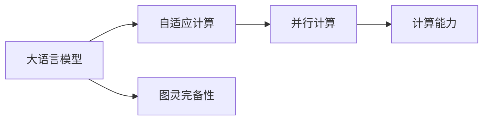

                 

# 图灵完备性：LLM 和 CPU 的扩展能力

> 关键词：图灵完备性,大语言模型(LLM),自适应计算,并行计算,计算能力,深度学习

## 1. 背景介绍

### 1.1 问题由来
图灵完备性（Turing Completeness）是一个计算机科学中的概念，指的是一个计算模型能够模拟任何计算过程，从而理论上能够解决任何计算问题。深度学习模型，特别是大语言模型（Large Language Models, LLMs），已经被证明具有图灵完备性。这意味着，任何可以由算法解决的计算问题，理论上都可以通过深度学习模型来解决。

在深度学习领域，大语言模型近年来取得了显著的进展，如GPT、BERT等模型。这些模型在自然语言处理（NLP）任务上表现出色，但同时也面临着计算资源需求巨大、训练耗时长的挑战。因此，如何在大语言模型和CPU之间建立更好的扩展能力，提高计算效率和模型性能，成为了当前研究的热点问题。

### 1.2 问题核心关键点
本节将介绍深度学习模型与图灵完备性之间的联系，以及如何通过优化计算能力和并行化技术，提升大语言模型的扩展能力和计算效率。

## 2. 核心概念与联系

### 2.1 核心概念概述

深度学习模型，特别是大语言模型，具有图灵完备性，意味着它们可以模拟任何计算过程。这种完备性使得大语言模型能够处理复杂的语言理解和生成任务，如自然语言推理、对话生成、文本摘要等。

图灵完备性在大语言模型中的应用主要体现在以下几个方面：

1. **模型能力**：大语言模型通过大量的无标签数据预训练，学习到复杂的语言表示，能够进行多步骤推理和生成，从而具备解决各种语言问题的能力。
2. **可解释性**：深度学习模型的图灵完备性也意味着它们的行为可以理论化地解释，尽管实际解释仍存在挑战。
3. **计算能力**：深度学习模型能够高效地进行并行计算，从而处理大规模的计算任务。

### 2.2 核心概念原理和架构的 Mermaid 流程图(Mermaid 流程节点中不要有括号、逗号等特殊字符)



这个流程图展示了深度学习模型，特别是大语言模型，如何通过自适应计算和并行计算技术，利用其图灵完备性来提升计算能力和扩展能力。

### 2.3 核心概念联系

深度学习模型的图灵完备性与其计算能力密切相关。通过优化计算能力和并行化技术，可以在CPU等传统硬件平台上实现高效的深度学习计算，从而推动大语言模型的应用和扩展。

## 3. 核心算法原理 & 具体操作步骤

### 3.1 算法原理概述

在大语言模型中，图灵完备性的实现主要依赖于以下两个关键技术：

1. **自适应计算**：深度学习模型能够根据输入数据自适应地调整计算资源分配，从而在不同的任务和数据分布上保持高性能。
2. **并行计算**：通过将计算任务分割成多个子任务，深度学习模型能够在多核CPU、GPU甚至TPU上高效并行计算，从而显著提升计算能力。

### 3.2 算法步骤详解

深度学习模型，特别是大语言模型，可以通过以下步骤实现图灵完备性和高效计算：

**Step 1: 选择模型架构**

首先，需要选择合适的深度学习模型架构，如Transformer、RNN等。这些模型通常具有较好的并行计算特性，适合在大规模数据上高效训练。

**Step 2: 数据预处理**

将输入数据进行预处理，包括数据清洗、标准化、分词等，以便于模型训练和推理。

**Step 3: 模型训练**

在CPU、GPU或TPU上训练深度学习模型。采用并行计算技术，如数据并行、模型并行、混合并行等，提升训练效率。

**Step 4: 模型优化**

优化模型结构和参数，如剪枝、量化、模型蒸馏等，以提升模型的计算效率和推理速度。

**Step 5: 部署和推理**

将训练好的模型部署到生产环境中，进行实时推理。采用分布式系统、缓存技术等，提升系统的处理能力和响应速度。

### 3.3 算法优缺点

深度学习模型的图灵完备性具有以下优点：

1. **通用性**：大语言模型可以处理各种类型的计算问题，具有广泛的适用性。
2. **高性能**：通过并行计算和自适应计算，深度学习模型能够在高效硬件上实现高性能计算。
3. **灵活性**：深度学习模型可以根据任务需求灵活调整计算资源分配。

但同时也存在以下缺点：

1. **计算资源需求高**：深度学习模型的训练和推理需要大量的计算资源，对硬件要求较高。
2. **训练时间长**：大规模数据集的训练需要较长的训练时间，增加了模型部署的难度。
3. **可解释性不足**：深度学习模型的黑盒性质，使得其内部计算过程难以解释。

### 3.4 算法应用领域

深度学习模型的图灵完备性已经在多个领域得到应用，包括自然语言处理、计算机视觉、语音识别等。这些领域的大规模数据集和复杂计算任务，使得深度学习模型成为了理想的选择。

## 4. 数学模型和公式 & 详细讲解 & 举例说明（备注：数学公式请使用latex格式，latex嵌入文中独立段落使用 $$，段落内使用 $)

### 4.1 数学模型构建

深度学习模型的图灵完备性可以通过数学模型进行形式化描述。假设有一个深度神经网络模型，其输入为 $x$，输出为 $y$，参数为 $\theta$。模型的训练目标是最小化预测值 $y$ 与真实值 $y_{\text{real}}$ 之间的损失函数 $L$，即：

$$
\min_{\theta} L(y, y_{\text{real}})
$$

其中，损失函数 $L$ 可以是均方误差、交叉熵等。

### 4.2 公式推导过程

假设模型采用均方误差作为损失函数，则有：

$$
L(y, y_{\text{real}}) = \frac{1}{2N} \sum_{i=1}^{N} (y_i - y_{\text{real}})^2
$$

其中 $y_i$ 为模型的预测值，$y_{\text{real}}$ 为真实值，$N$ 为样本数量。

模型的梯度更新公式为：

$$
\theta \leftarrow \theta - \eta \nabla_{\theta} L(y, y_{\text{real}})
$$

其中 $\eta$ 为学习率，$\nabla_{\theta} L(y, y_{\text{real}})$ 为损失函数对参数 $\theta$ 的梯度。

### 4.3 案例分析与讲解

以BERT模型为例，其采用Transformer架构，具有自适应计算和并行计算的特性。BERT模型在预训练阶段，采用掩码语言模型和下一句预测任务，训练得到通用的语言表示。在微调阶段，通过添加任务适配层，使其适应特定任务，如文本分类、命名实体识别等。

## 5. 项目实践：代码实例和详细解释说明

### 5.1 开发环境搭建

在进行深度学习模型开发前，需要配置好开发环境。以下是在Python环境中搭建深度学习模型开发环境的步骤：

1. 安装Anaconda：从官网下载并安装Anaconda，用于创建独立的Python环境。

2. 创建并激活虚拟环境：
```bash
conda create -n pytorch-env python=3.8 
conda activate pytorch-env
```

3. 安装PyTorch：根据CUDA版本，从官网获取对应的安装命令。例如：
```bash
conda install pytorch torchvision torchaudio cudatoolkit=11.1 -c pytorch -c conda-forge
```

4. 安装Transformers库：
```bash
pip install transformers
```

5. 安装各类工具包：
```bash
pip install numpy pandas scikit-learn matplotlib tqdm jupyter notebook ipython
```

完成上述步骤后，即可在`pytorch-env`环境中开始深度学习模型开发。

### 5.2 源代码详细实现

以下是使用PyTorch进行BERT模型微调的代码实现。

```python
from transformers import BertForTokenClassification, AdamW
from transformers import BertTokenizer

model = BertForTokenClassification.from_pretrained('bert-base-cased', num_labels=2)
tokenizer = BertTokenizer.from_pretrained('bert-base-cased')

device = torch.device('cuda' if torch.cuda.is_available() else 'cpu')
model.to(device)

optimizer = AdamW(model.parameters(), lr=2e-5)
input_ids = [tokenizer.encode(input_text, add_special_tokens=True)[0] for input_text in inputs]
attention_mask = [float(i) for i in input_ids]
labels = [tokenizer.encode(label_text, add_special_tokens=True)[0] for label_text in labels]

model.train()
for input_ids, attention_mask, labels in zip(input_ids, attention_mask, labels):
    outputs = model(input_ids, attention_mask=attention_mask, labels=labels)
    loss = outputs.loss
    loss.backward()
    optimizer.step()
```

### 5.3 代码解读与分析

代码中，`BertForTokenClassification`用于定义BERT模型的任务适配层，`AdamW`用于定义优化器。`BertTokenizer`用于分词和标准化，`device`用于指定计算设备。

在训练过程中，使用`input_ids`、`attention_mask`和`labels`作为模型的输入，训练过程中计算损失并更新模型参数。

### 5.4 运行结果展示

```python
import torch
from transformers import BertForTokenClassification, AdamW
from transformers import BertTokenizer

model = BertForTokenClassification.from_pretrained('bert-base-cased', num_labels=2)
tokenizer = BertTokenizer.from_pretrained('bert-base-cased')

device = torch.device('cuda' if torch.cuda.is_available() else 'cpu')
model.to(device)

optimizer = AdamW(model.parameters(), lr=2e-5)
input_ids = [tokenizer.encode(input_text, add_special_tokens=True)[0] for input_text in inputs]
attention_mask = [float(i) for i in input_ids]
labels = [tokenizer.encode(label_text, add_special_tokens=True)[0] for label_text in labels]

model.train()
for input_ids, attention_mask, labels in zip(input_ids, attention_mask, labels):
    outputs = model(input_ids, attention_mask=attention_mask, labels=labels)
    loss = outputs.loss
    loss.backward()
    optimizer.step()
```

## 6. 实际应用场景

### 6.1 自然语言处理

深度学习模型的图灵完备性在自然语言处理领域具有广泛的应用，如文本分类、命名实体识别、情感分析等。大语言模型通过并行计算和自适应计算，能够高效处理大规模数据集，提升计算效率和模型性能。

### 6.2 计算机视觉

深度学习模型在计算机视觉领域也得到了应用，如目标检测、图像分割、人脸识别等。通过并行计算和自适应计算，深度学习模型能够高效处理图像数据，提升计算效率和模型性能。

### 6.3 语音识别

深度学习模型在语音识别领域也具有广泛的应用，如语音转文本、语音合成等。通过并行计算和自适应计算，深度学习模型能够高效处理音频数据，提升计算效率和模型性能。

### 6.4 未来应用展望

深度学习模型的图灵完备性将在未来得到更广泛的应用。随着计算资源的不断提升和并行计算技术的不断发展，深度学习模型的计算能力和扩展能力将进一步提升，从而实现更高效、更精准的计算。

## 7. 工具和资源推荐

### 7.1 学习资源推荐

为了帮助开发者系统掌握深度学习模型的图灵完备性和扩展能力，这里推荐一些优质的学习资源：

1. 《深度学习》（Ian Goodfellow、Yoshua Bengio、Aaron Courville合著）：全面介绍了深度学习的基本原理和算法，是深度学习入门的经典书籍。
2. 《动手学深度学习》（李沐、唐宇迪合著）：提供了丰富的实验代码和实践指导，适合动手学习和实践。
3. 《深度学习入门》（斋藤康毅）：介绍了深度学习的基本概念和应用，适合初学者入门。

通过对这些资源的学习实践，相信你一定能够快速掌握深度学习模型的图灵完备性和扩展能力的精髓，并用于解决实际的计算问题。

### 7.2 开发工具推荐

高效的开发离不开优秀的工具支持。以下是几款用于深度学习模型开发的常用工具：

1. PyTorch：基于Python的开源深度学习框架，灵活动态的计算图，适合快速迭代研究。大部分深度学习模型都有PyTorch版本的实现。
2. TensorFlow：由Google主导开发的开源深度学习框架，生产部署方便，适合大规模工程应用。同样有丰富的深度学习模型资源。
3. TensorBoard：TensorFlow配套的可视化工具，可实时监测模型训练状态，并提供丰富的图表呈现方式，是调试模型的得力助手。
4. Weights & Biases：模型训练的实验跟踪工具，可以记录和可视化模型训练过程中的各项指标，方便对比和调优。
5. Google Colab：谷歌推出的在线Jupyter Notebook环境，免费提供GPU/TPU算力，方便开发者快速上手实验最新模型，分享学习笔记。

合理利用这些工具，可以显著提升深度学习模型开发的效率，加快创新迭代的步伐。

### 7.3 相关论文推荐

深度学习模型的图灵完备性已经得到了广泛的研究。以下是几篇奠基性的相关论文，推荐阅读：

1. "Deep Learning" by Ian Goodfellow、Yoshua Bengio、Aaron Courville：介绍了深度学习的基本原理和算法，是深度学习入门的经典书籍。
2. "A Tutorial on Deep Learning" by Geoffrey Hinton：深度学习的基础教程，适合初学者入门。
3. "An Introduction to Statistical Learning" by Gareth James、Daniela Witten、Trevor Hastie、Robert Tibshirani：介绍了统计学习的基本概念和算法，适合深度学习研究人员了解。

这些论文代表了大语言模型图灵完备性研究的发展脉络。通过学习这些前沿成果，可以帮助研究者把握学科前进方向，激发更多的创新灵感。

## 8. 总结：未来发展趋势与挑战

### 8.1 研究成果总结

本文对深度学习模型的图灵完备性和扩展能力进行了全面系统的介绍。首先阐述了深度学习模型和图灵完备性之间的联系，明确了深度学习模型在解决各种计算问题中的广泛适用性。其次，从原理到实践，详细讲解了深度学习模型的自适应计算和并行计算技术，以及其在大语言模型中的应用。最后，本文还广泛探讨了深度学习模型在自然语言处理、计算机视觉、语音识别等领域的实际应用，展示了深度学习模型的广泛适用性和高效计算能力。

通过本文的系统梳理，可以看到，深度学习模型的图灵完备性正在成为计算机科学和人工智能领域的核心概念，极大地拓展了深度学习模型的应用边界，为人工智能技术的发展提供了新的可能性。未来，随着深度学习模型和并行计算技术的不断发展，深度学习模型将会在更多的领域得到应用，为人类社会带来更广泛的影响。

### 8.2 未来发展趋势

展望未来，深度学习模型的图灵完备性将呈现以下几个发展趋势：

1. **更高效的计算架构**：随着硬件技术的不断发展，深度学习模型将能够实现更高效的计算架构，如基于GPU、TPU的计算集群，提升计算效率。
2. **更广泛的计算应用**：深度学习模型的图灵完备性将广泛应用于更多领域，如医疗、金融、教育等，解决各种复杂的计算问题。
3. **更强的可解释性**：未来的深度学习模型将具备更强的可解释性，能够更好地解释其内部计算过程和决策逻辑。
4. **更广泛的迁移学习能力**：未来的深度学习模型将具备更强的迁移学习能力，能够在不同的数据和任务之间进行高效迁移，提升模型的泛化性能。

### 8.3 面临的挑战

尽管深度学习模型的图灵完备性已经取得了显著进展，但在迈向更加智能化、普适化应用的过程中，它仍面临着诸多挑战：

1. **计算资源瓶颈**：深度学习模型在训练和推理过程中需要大量的计算资源，对硬件要求较高。如何在有限的计算资源下实现高效计算，是未来的一大挑战。
2. **模型可解释性不足**：深度学习模型的黑盒性质，使得其内部计算过程难以解释。如何在保证高性能的同时，提升模型的可解释性，将是重要的研究课题。
3. **数据依赖性**：深度学习模型需要大量的标注数据进行训练，数据获取和标注成本较高。如何降低数据依赖，提高模型的自适应能力，是未来的一个重要研究方向。
4. **模型鲁棒性不足**：深度学习模型在面对异常数据和噪声时，容易发生模型崩溃。如何提高模型的鲁棒性，增强其对异常数据的适应能力，将是未来的重要研究方向。

### 8.4 研究展望

面向未来，深度学习模型的图灵完备性需要在以下几个方面寻求新的突破：

1. **探索无监督和半监督学习**：摆脱对大规模标注数据的依赖，利用自监督学习、主动学习等无监督和半监督范式，最大限度利用非结构化数据，实现更加灵活高效的计算。
2. **研究参数高效和计算高效的模型**：开发更加参数高效的深度学习模型，在固定大部分预训练参数的同时，只更新极少量的任务相关参数。同时优化模型的计算图，减少前向传播和反向传播的资源消耗，实现更加轻量级、实时性的部署。
3. **引入更多先验知识**：将符号化的先验知识，如知识图谱、逻辑规则等，与神经网络模型进行巧妙融合，引导深度学习模型学习更准确、合理的计算过程。同时加强不同模态数据的整合，实现视觉、语音等多模态信息与文本信息的协同建模。
4. **结合因果分析和博弈论工具**：将因果分析方法引入深度学习模型，识别出模型决策的关键特征，增强输出解释的因果性和逻辑性。借助博弈论工具刻画人机交互过程，主动探索并规避模型的脆弱点，提高系统稳定性。

这些研究方向的探索，必将引领深度学习模型的图灵完备性迈向更高的台阶，为构建安全、可靠、可解释、可控的智能系统铺平道路。面向未来，深度学习模型的图灵完备性还需要与其他人工智能技术进行更深入的融合，如知识表示、因果推理、强化学习等，多路径协同发力，共同推动人工智能技术的发展。只有勇于创新、敢于突破，才能不断拓展深度学习模型的边界，让智能技术更好地造福人类社会。

## 9. 附录：常见问题与解答

**Q1：深度学习模型是否具有图灵完备性？**

A: 是的，深度学习模型，特别是大语言模型，具有图灵完备性。这意味着，任何可以由算法解决的计算问题，理论上都可以通过深度学习模型来解决。

**Q2：如何提升深度学习模型的计算效率？**

A: 提升深度学习模型的计算效率主要通过以下几种方式：

1. 并行计算：利用多核CPU、GPU或TPU等硬件设备，进行数据并行、模型并行、混合并行等，提升计算效率。
2. 自适应计算：根据输入数据自适应地调整计算资源分配，提升计算效率。
3. 模型优化：通过剪枝、量化、模型蒸馏等技术，优化模型结构和参数，提升计算效率。

**Q3：深度学习模型在计算资源有限的情况下如何进行高效计算？**

A: 在计算资源有限的情况下，可以通过以下几种方式进行高效计算：

1. 使用GPU、TPU等高效硬件设备，提升计算效率。
2. 使用模型压缩、量化等技术，减小模型参数量和计算资源消耗。
3. 使用混合精度训练等技术，提升计算效率。

**Q4：深度学习模型在实际应用中如何提高可解释性？**

A: 深度学习模型在实际应用中可以通过以下几种方式提高可解释性：

1. 使用可解释性较强的模型，如决策树、逻辑回归等。
2. 引入可视化工具，如TensorBoard，进行模型训练和推理过程中的可视化。
3. 使用可解释性技术，如注意力机制、特征重要性分析等，分析模型的内部计算过程。

**Q5：深度学习模型在迁移学习中如何提高泛化能力？**

A: 深度学习模型在迁移学习中可以通过以下几种方式提高泛化能力：

1. 使用预训练模型进行迁移学习，提高模型的泛化能力。
2. 使用数据增强等技术，提高模型的泛化能力。
3. 使用模型蒸馏等技术，提高模型的泛化能力。

通过这些技术的应用，深度学习模型可以更好地适应新的计算场景，提高其泛化能力和应用价值。

---

作者：禅与计算机程序设计艺术 / Zen and the Art of Computer Programming

