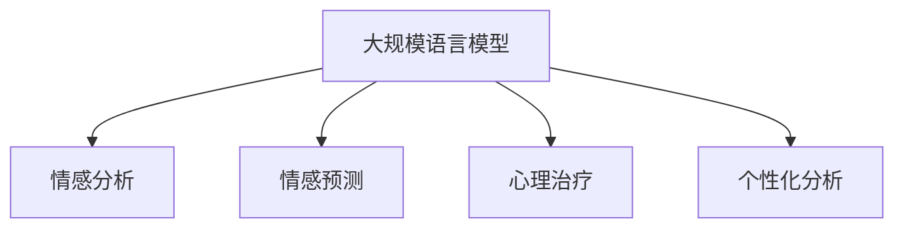

                 

# 在心理分析中应用AI LLM：洞察人类情感

## 1. 背景介绍

### 1.1 问题由来
随着人工智能（AI）技术的不断进步，尤其是大规模语言模型（LLMs）的崛起，其在心理学和人类情感分析中的应用开始受到广泛关注。心理学领域需要从海量文本数据中提取人类的情感和心理状态，以支持心理治疗、心理咨询、情感管理等应用。传统的心理学分析方法依赖于手动标注和规则匹配，难以处理大规模数据和高复杂度问题。AI LLM的出现，为心理分析提供了新的工具和方法。

### 1.2 问题核心关键点
AI LLM在心理学应用中的核心关键点包括：

- **情感识别**：AI LLM能够识别文本中的情感信息，如愤怒、悲伤、快乐等。
- **情感预测**：基于历史文本数据，AI LLM可以预测未来的情感变化趋势。
- **情感治疗**：通过生成具有正面情感的文本，AI LLM可以辅助心理治疗，帮助个体调整情感状态。
- **个性化分析**：AI LLM可以根据个体的情感特征和心理状态，提供个性化的分析和建议。

这些关键点使得AI LLM成为心理学研究的强大工具，尤其是在情感分析和心理治疗领域。

## 2. 核心概念与联系

### 2.1 核心概念概述

为更好地理解AI LLM在心理分析中的应用，本节将介绍几个密切相关的核心概念：

- **大规模语言模型（LLM）**：如GPT-3、BERT等，通过在海量文本数据上进行预训练，学习通用的语言表示，具备强大的语言理解和生成能力。
- **情感分析（Sentiment Analysis）**：从文本中提取情感信息，理解文本背后的情感倾向。
- **情感预测（Sentiment Prediction）**：基于历史文本数据，预测未来的情感变化。
- **心理治疗（Psychological Treatment）**：通过生成具有正面情感的文本，帮助个体调整情感状态，辅助心理治疗。
- **个性化分析（Personalized Analysis）**：根据个体的情感特征和心理状态，提供个性化的分析和建议。

这些核心概念之间的逻辑关系可以通过以下Mermaid流程图来展示：



这个流程图展示了大规模语言模型的核心概念及其之间的关系：

1. 大语言模型通过预训练获得基础能力。
2. 情感分析、情感预测、心理治疗、个性化分析等关键应用，均建立在预训练模型的基础上。

## 3. 核心算法原理 & 具体操作步骤
### 3.1 算法原理概述

在心理分析中应用AI LLM的核心原理是：利用大语言模型的语言理解能力，从文本中提取和分析情感信息，辅助心理治疗和心理咨询，提升心理健康水平。具体来说，可以通过以下几个步骤实现：

1. **数据准备**：收集包含情感信息的文本数据，如社交媒体帖子、论坛评论、电子邮件等。
2. **模型预训练**：使用大规模无标签文本数据预训练大语言模型，学习语言表示。
3. **情感分析**：使用预训练的大语言模型，从文本中识别情感信息，提取情感标签。
4. **情感预测**：基于历史情感数据，训练大语言模型进行情感变化预测。
5. **心理治疗**：生成具有正面情感的文本，辅助心理治疗，帮助个体调整情感状态。
6. **个性化分析**：根据个体的情感特征和心理状态，提供个性化的分析和建议。

### 3.2 算法步骤详解

以下是应用AI LLM进行心理分析的详细步骤：

**Step 1: 数据准备**
- 收集包含情感信息的文本数据，如社交媒体帖子、论坛评论、电子邮件等。
- 清洗和预处理数据，去除噪声和无用信息。

**Step 2: 模型预训练**
- 选择合适的预训练模型，如GPT-3、BERT等。
- 使用大规模无标签文本数据预训练模型，学习语言表示。

**Step 3: 情感分析**
- 将文本数据输入预训练模型，提取情感信息。
- 利用情感分类器对文本进行情感标签标注。
- 可视化情感分布，分析情感变化趋势。

**Step 4: 情感预测**
- 收集历史情感数据，标注情感标签。
- 使用预训练模型作为特征提取器，训练情感预测模型。
- 对新的文本数据进行情感预测，判断情感变化趋势。

**Step 5: 心理治疗**
- 使用生成模型，如GPT-3，生成具有正面情感的文本。
- 根据情感特征，生成个性化的情感支持文本。
- 评估生成的文本对情感状态的正面影响。

**Step 6: 个性化分析**
- 收集个体的情感特征和心理状态数据。
- 使用预训练模型提取情感信息，进行个性化分析。
- 提供个性化的情感管理建议，如放松技巧、认知重构等。

### 3.3 算法优缺点

应用AI LLM进行心理分析具有以下优点：

1. **高效率**：使用大语言模型，可以在短时间内处理大量文本数据，提取情感信息。
2. **高精度**：预训练的大语言模型具备强大的语言理解能力，情感分析的精度较高。
3. **个性化**：根据个体的情感特征和心理状态，提供个性化的分析和建议，满足不同用户的需求。

同时，该方法也存在一定的局限性：

1. **数据依赖**：情感分析的效果很大程度上取决于文本数据的质量和数量，高质量标注数据的获取成本较高。
2. **情感歧义**：自然语言具有模糊性，同一文本可能包含多种情感，情感分析可能出现歧义。
3. **伦理问题**：生成正面情感文本可能涉及隐私和伦理问题，需谨慎使用。
4. **可解释性**：大语言模型的决策过程缺乏可解释性，难以对其推理逻辑进行分析和调试。

尽管存在这些局限性，但就目前而言，应用AI LLM进行心理分析的方法仍是大规模语言模型应用的一个重要方向。未来相关研究的重点在于如何进一步降低数据依赖，提高情感预测的准确性和可解释性，同时兼顾隐私保护和伦理安全等因素。

### 3.4 算法应用领域

AI LLM在心理分析中的应用领域主要包括以下几个方面：

- **心理健康监测**：通过分析社交媒体帖子、论坛评论等，监测个体的心理健康状况，及时发现异常。
- **情感辅导**：基于情感预测，生成具有正面情感的文本，辅助情感辅导和心理治疗。
- **情感管理**：根据个体的情感特征和心理状态，提供个性化的情感管理建议，帮助个体调整情感状态。
- **情感支持**：通过生成情感支持文本，帮助个体应对压力和挑战，提升情感韧性和心理弹性。

此外，AI LLM在教育、家庭、职场等多个领域也有广泛的应用前景，为人们的心理健康和社会福祉提供有力支持。

## 4. 数学模型和公式 & 详细讲解  
### 4.1 数学模型构建

本节将使用数学语言对应用AI LLM进行心理分析的数学模型进行更加严格的刻画。

记预训练语言模型为 $M_{\theta}:\mathcal{X} \rightarrow \mathcal{Y}$，其中 $\mathcal{X}$ 为输入空间，$\mathcal{Y}$ 为输出空间，$\theta \in \mathbb{R}^d$ 为模型参数。假设情感分析任务的数据集为 $D=\{(x_i, y_i)\}_{i=1}^N, x_i \in \mathcal{X}, y_i \in \{pos, neg\}$。

定义模型 $M_{\theta}$ 在输入 $x$ 上的情感分类器为 $C_{\theta}(x) \in \{pos, neg\}$，则情感分析的损失函数为：

$$
\ell(M_{\theta}, C_{\theta}, D) = \frac{1}{N} \sum_{i=1}^N \mathbb{I}(C_{\theta}(x_i) \neq y_i)
$$

其中 $\mathbb{I}$ 为示性函数，表示分类器预测结果与真实标签不一致的样本数。

情感预测任务的数学模型可以类似构建，假设历史情感数据集为 $D_{hist}=\{(x_i, y_i)\}_{i=1}^M, x_i \in \mathcal{X}, y_i \in \{pos, neg\}$，情感预测模型 $M_{pred}(x)$ 的损失函数为：

$$
\ell(M_{pred}, D_{hist}) = \frac{1}{M} \sum_{i=1}^M \mathbb{I}(M_{pred}(x_i) \neq y_i)
$$

### 4.2 公式推导过程

以下是情感分析和情感预测任务的数学模型的详细推导：

**情感分析的损失函数**：

设情感分类器 $C_{\theta}(x)$ 输出为 $\hat{y}=C_{\theta}(x) \in \{pos, neg\}$，真实标签为 $y \in \{pos, neg\}$。则二分类交叉熵损失函数定义为：

$$
\ell(M_{\theta}, C_{\theta}, x, y) = -[y\log \hat{y} + (1-y)\log (1-\hat{y})]
$$

将其代入经验风险公式，得：

$$
\mathcal{L}(\theta) = -\frac{1}{N}\sum_{i=1}^N [y_i\log M_{\theta}(x_i)+(1-y_i)\log(1-M_{\theta}(x_i))]
$$

在得到损失函数的梯度后，即可带入参数更新公式，完成情感分类器的迭代优化。重复上述过程直至收敛，最终得到适应情感分析任务的最优模型参数 $\theta^*$。

**情感预测的损失函数**：

情感预测任务通常使用回归模型或序列模型。这里以线性回归模型为例进行推导。假设历史情感数据集为 $D_{hist}=\{(x_i, y_i)\}_{i=1}^M, x_i \in \mathcal{X}, y_i \in \mathbb{R}$，预测模型 $M_{pred}(x)$ 的损失函数为：

$$
\ell(M_{pred}, D_{hist}) = \frac{1}{M} \sum_{i=1}^M (y_i - M_{pred}(x_i))^2
$$

其中 $M_{pred}(x_i)$ 为模型在历史数据 $x_i$ 上的预测值，$y_i$ 为真实标签。

情感预测任务的推导与情感分析任务类似，需要选择合适的预测模型和损失函数，并使用梯度下降等优化算法更新模型参数。

## 5. 项目实践：代码实例和详细解释说明
### 5.1 开发环境搭建

在进行心理分析应用开发前，我们需要准备好开发环境。以下是使用Python进行PyTorch开发的环境配置流程：

1. 安装Anaconda：从官网下载并安装Anaconda，用于创建独立的Python环境。

2. 创建并激活虚拟环境：
```bash
conda create -n pytorch-env python=3.8 
conda activate pytorch-env
```

3. 安装PyTorch：根据CUDA版本，从官网获取对应的安装命令。例如：
```bash
conda install pytorch torchvision torchaudio cudatoolkit=11.1 -c pytorch -c conda-forge
```

4. 安装Transformers库：
```bash
pip install transformers
```

5. 安装各类工具包：
```bash
pip install numpy pandas scikit-learn matplotlib tqdm jupyter notebook ipython
```

完成上述步骤后，即可在`pytorch-env`环境中开始心理分析应用开发。

### 5.2 源代码详细实现

下面我们以情感分析任务为例，给出使用Transformers库对BERT模型进行情感分析的PyTorch代码实现。

首先，定义情感分类任务的数据处理函数：

```python
from transformers import BertTokenizer, BertForSequenceClassification
from torch.utils.data import Dataset
import torch

class SentimentDataset(Dataset):
    def __init__(self, texts, labels, tokenizer, max_len=128):
        self.texts = texts
        self.labels = labels
        self.tokenizer = tokenizer
        self.max_len = max_len
        
    def __len__(self):
        return len(self.texts)
    
    def __getitem__(self, item):
        text = self.texts[item]
        label = self.labels[item]
        
        encoding = self.tokenizer(text, return_tensors='pt', max_length=self.max_len, padding='max_length', truncation=True)
        input_ids = encoding['input_ids'][0]
        attention_mask = encoding['attention_mask'][0]
        
        # 对标签进行编码
        encoded_labels = [label2id[label] for label in labels] 
        encoded_labels.extend([label2id['O']] * (self.max_len - len(encoded_labels)))
        labels = torch.tensor(encoded_labels, dtype=torch.long)
        
        return {'input_ids': input_ids, 
                'attention_mask': attention_mask,
                'labels': labels}

# 标签与id的映射
label2id = {'pos': 0, 'neg': 1, 'O': 2}
id2label = {v: k for k, v in label2id.items()}

# 创建dataset
tokenizer = BertTokenizer.from_pretrained('bert-base-cased')

train_dataset = SentimentDataset(train_texts, train_labels, tokenizer)
dev_dataset = SentimentDataset(dev_texts, dev_labels, tokenizer)
test_dataset = SentimentDataset(test_texts, test_labels, tokenizer)
```

然后，定义模型和优化器：

```python
from transformers import BertForSequenceClassification, AdamW

model = BertForSequenceClassification.from_pretrained('bert-base-cased', num_labels=len(label2id))

optimizer = AdamW(model.parameters(), lr=2e-5)
```

接着，定义训练和评估函数：

```python
from torch.utils.data import DataLoader
from tqdm import tqdm
from sklearn.metrics import classification_report

device = torch.device('cuda') if torch.cuda.is_available() else torch.device('cpu')
model.to(device)

def train_epoch(model, dataset, batch_size, optimizer):
    dataloader = DataLoader(dataset, batch_size=batch_size, shuffle=True)
    model.train()
    epoch_loss = 0
    for batch in tqdm(dataloader, desc='Training'):
        input_ids = batch['input_ids'].to(device)
        attention_mask = batch['attention_mask'].to(device)
        labels = batch['labels'].to(device)
        model.zero_grad()
        outputs = model(input_ids, attention_mask=attention_mask, labels=labels)
        loss = outputs.loss
        epoch_loss += loss.item()
        loss.backward()
        optimizer.step()
    return epoch_loss / len(dataloader)

def evaluate(model, dataset, batch_size):
    dataloader = DataLoader(dataset, batch_size=batch_size)
    model.eval()
    preds, labels = [], []
    with torch.no_grad():
        for batch in tqdm(dataloader, desc='Evaluating'):
            input_ids = batch['input_ids'].to(device)
            attention_mask = batch['attention_mask'].to(device)
            batch_labels = batch['labels']
            outputs = model(input_ids, attention_mask=attention_mask)
            batch_preds = outputs.logits.argmax(dim=2).to('cpu').tolist()
            batch_labels = batch_labels.to('cpu').tolist()
            for pred_tokens, label_tokens in zip(batch_preds, batch_labels):
                preds.append(pred_tokens[:len(label_tokens)])
                labels.append(label_tokens)
                
    print(classification_report(labels, preds))
```

最后，启动训练流程并在测试集上评估：

```python
epochs = 5
batch_size = 16

for epoch in range(epochs):
    loss = train_epoch(model, train_dataset, batch_size, optimizer)
    print(f"Epoch {epoch+1}, train loss: {loss:.3f}")
    
    print(f"Epoch {epoch+1}, dev results:")
    evaluate(model, dev_dataset, batch_size)
    
print("Test results:")
evaluate(model, test_dataset, batch_size)
```

以上就是使用PyTorch对BERT进行情感分析任务的完整代码实现。可以看到，得益于Transformers库的强大封装，我们可以用相对简洁的代码完成BERT模型的加载和情感分析。

### 5.3 代码解读与分析

让我们再详细解读一下关键代码的实现细节：

**SentimentDataset类**：
- `__init__`方法：初始化文本、标签、分词器等关键组件。
- `__len__`方法：返回数据集的样本数量。
- `__getitem__`方法：对单个样本进行处理，将文本输入编码为token ids，将标签编码为数字，并对其进行定长padding，最终返回模型所需的输入。

**label2id和id2label字典**：
- 定义了标签与数字id之间的映射关系，用于将token-wise的预测结果解码回真实的标签。

**训练和评估函数**：
- 使用PyTorch的DataLoader对数据集进行批次化加载，供模型训练和推理使用。
- 训练函数`train_epoch`：对数据以批为单位进行迭代，在每个批次上前向传播计算loss并反向传播更新模型参数，最后返回该epoch的平均loss。
- 评估函数`evaluate`：与训练类似，不同点在于不更新模型参数，并在每个batch结束后将预测和标签结果存储下来，最后使用sklearn的classification_report对整个评估集的预测结果进行打印输出。

**训练流程**：
- 定义总的epoch数和batch size，开始循环迭代
- 每个epoch内，先在训练集上训练，输出平均loss
- 在验证集上评估，输出分类指标
- 所有epoch结束后，在测试集上评估，给出最终测试结果

可以看到，PyTorch配合Transformers库使得BERT微调的代码实现变得简洁高效。开发者可以将更多精力放在数据处理、模型改进等高层逻辑上，而不必过多关注底层的实现细节。

当然，工业级的系统实现还需考虑更多因素，如模型的保存和部署、超参数的自动搜索、更灵活的任务适配层等。但核心的微调范式基本与此类似。

## 6. 实际应用场景
### 6.1 心理治疗辅助

在心理治疗领域，AI LLM可以辅助心理医生进行情感分析、情绪预测和情感治疗，提升心理治疗的效果和效率。

具体而言，可以收集病人的历史文本数据，如日记、聊天记录、社交媒体帖子等，使用预训练的情感分析模型提取情感信息。基于情感分析结果，医生可以更全面地了解病人的情感状态，制定个性化的治疗方案。此外，还可以使用情感预测模型预测病人的未来情绪变化，提前采取干预措施。最后，生成具有正面情感的文本，辅助病人进行情绪调整和情感支持。

### 6.2 情感辅导

情感辅导是心理健康的重要组成部分。AI LLM可以通过生成具有正面情感的文本，帮助个体应对压力和挑战，提升情感韧性和心理健康水平。

例如，可以构建一个基于AI LLM的情感辅导平台，用户可以输入自己的情感状态和困扰，系统生成具有正面情感的回复和建议，如放松技巧、认知重构等，帮助用户调整情感状态。此外，还可以通过情感预测模型，预测用户未来的情感变化趋势，提前提供心理支持。

### 6.3 情感管理

在日常生活和工作环境中，个体常常面临各种情感压力和挑战。AI LLM可以提供个性化的情感管理建议，帮助个体更好地应对情感波动。

例如，可以开发一个基于情感分析的应用，监测用户的情感状态，根据情感变化提供个性化的建议和支持。如用户感到焦虑或压力大时，系统可以推荐放松技巧、心理咨询等方式，帮助用户缓解情感压力。

### 6.4 未来应用展望

随着AI LLM技术的不断进步，其在心理分析领域的应用前景广阔。未来，AI LLM有望在以下几个方面取得更大的突破：

1. **多模态情感分析**：结合图像、语音等多模态数据，提供更全面、准确的情感分析结果。
2. **情感计算**：开发情感计算模型，将情感状态量化，支持情感数据的高效管理和分析。
3. **情感驱动决策**：将情感分析结果融入决策系统，提升决策的个性化和人性化水平。
4. **心理健康监测**：构建情感监测平台，实时监测个体的心理健康状况，及时发现异常。
5. **情感支持系统**：基于情感预测模型，提前提供情感支持，提升个体的情感韧性。

这些技术突破将进一步拓展AI LLM在心理分析领域的应用范围，为心理健康管理提供更强大的工具和方法。

## 7. 工具和资源推荐
### 7.1 学习资源推荐

为了帮助开发者系统掌握AI LLM在心理分析的应用，这里推荐一些优质的学习资源：

1. 《Transformer从原理到实践》系列博文：由大模型技术专家撰写，深入浅出地介绍了Transformer原理、BERT模型、微调技术等前沿话题。

2. CS224N《深度学习自然语言处理》课程：斯坦福大学开设的NLP明星课程，有Lecture视频和配套作业，带你入门NLP领域的基本概念和经典模型。

3. 《Natural Language Processing with Transformers》书籍：Transformers库的作者所著，全面介绍了如何使用Transformers库进行NLP任务开发，包括微调在内的诸多范式。

4. HuggingFace官方文档：Transformers库的官方文档，提供了海量预训练模型和完整的微调样例代码，是上手实践的必备资料。

5. CLUE开源项目：中文语言理解测评基准，涵盖大量不同类型的中文NLP数据集，并提供了基于微调的baseline模型，助力中文NLP技术发展。

通过对这些资源的学习实践，相信你一定能够快速掌握AI LLM在心理分析中的应用，并用于解决实际的情感管理问题。
###  7.2 开发工具推荐

高效的开发离不开优秀的工具支持。以下是几款用于AI LLM心理分析开发的常用工具：

1. PyTorch：基于Python的开源深度学习框架，灵活动态的计算图，适合快速迭代研究。大部分预训练语言模型都有PyTorch版本的实现。

2. TensorFlow：由Google主导开发的开源深度学习框架，生产部署方便，适合大规模工程应用。同样有丰富的预训练语言模型资源。

3. Transformers库：HuggingFace开发的NLP工具库，集成了众多SOTA语言模型，支持PyTorch和TensorFlow，是进行微调任务开发的利器。

4. Weights & Biases：模型训练的实验跟踪工具，可以记录和可视化模型训练过程中的各项指标，方便对比和调优。与主流深度学习框架无缝集成。

5. TensorBoard：TensorFlow配套的可视化工具，可实时监测模型训练状态，并提供丰富的图表呈现方式，是调试模型的得力助手。

6. Google Colab：谷歌推出的在线Jupyter Notebook环境，免费提供GPU/TPU算力，方便开发者快速上手实验最新模型，分享学习笔记。

合理利用这些工具，可以显著提升AI LLM心理分析任务的开发效率，加快创新迭代的步伐。

### 7.3 相关论文推荐

AI LLM在心理分析领域的应用源于学界的持续研究。以下是几篇奠基性的相关论文，推荐阅读：

1. Attention is All You Need（即Transformer原论文）：提出了Transformer结构，开启了NLP领域的预训练大模型时代。

2. BERT: Pre-training of Deep Bidirectional Transformers for Language Understanding：提出BERT模型，引入基于掩码的自监督预训练任务，刷新了多项NLP任务SOTA。

3. Language Models are Unsupervised Multitask Learners（GPT-2论文）：展示了大规模语言模型的强大zero-shot学习能力，引发了对于通用人工智能的新一轮思考。

4. Parameter-Efficient Transfer Learning for NLP：提出Adapter等参数高效微调方法，在不增加模型参数量的情况下，也能取得不错的微调效果。

5. Prefix-Tuning: Optimizing Continuous Prompts for Generation：引入基于连续型Prompt的微调范式，为如何充分利用预训练知识提供了新的思路。

6. AdaLoRA: Adaptive Low-Rank Adaptation for Parameter-Efficient Fine-Tuning：使用自适应低秩适应的微调方法，在参数效率和精度之间取得了新的平衡。

这些论文代表了大语言模型在心理分析领域的应用基础，通过学习这些前沿成果，可以帮助研究者把握学科前进方向，激发更多的创新灵感。

## 8. 总结：未来发展趋势与挑战

### 8.1 总结

本文对应用AI LLM进行心理分析的方法进行了全面系统的介绍。首先阐述了AI LLM在心理学和情感分析中的应用背景和意义，明确了情感分析、情感预测、心理治疗和个性化分析等关键应用的价值。其次，从原理到实践，详细讲解了情感分析和情感预测的数学模型和关键步骤，给出了情感分析任务的完整代码实现。同时，本文还广泛探讨了情感分析在心理健康监测、情感辅导、情感管理等多个领域的应用前景，展示了AI LLM的强大潜力。最后，本文精选了情感分析领域的各类学习资源和开发工具，力求为读者提供全方位的技术指引。

通过本文的系统梳理，可以看到，应用AI LLM进行心理分析的方法正在成为心理学研究的重要手段，为心理健康监测和管理提供了新的工具和方法。情感分析、情感预测、心理治疗和个性化分析等关键技术，将为个体心理健康和社会福祉带来深远影响。未来，随着AI LLM技术的不断发展，情感分析的应用将更加广泛和深入，为心理健康管理提供更加智能、便捷的解决方案。

### 8.2 未来发展趋势

展望未来，AI LLM在心理分析领域的应用将呈现以下几个发展趋势：

1. **情感计算的普及**：情感计算技术的普及，将使情感状态更加量化和可管理，提升心理健康监测的准确性和效率。
2. **多模态情感分析**：结合图像、语音等多模态数据，提供更全面、准确的情感分析结果，提升情感管理的效果。
3. **情感驱动决策**：将情感分析结果融入决策系统，提升决策的个性化和人性化水平。
4. **心理健康监测平台**：构建情感监测平台，实时监测个体的心理健康状况，及时发现异常，提升心理健康管理的效率。
5. **情感支持系统**：基于情感预测模型，提前提供情感支持，提升个体的情感韧性。

这些趋势将推动AI LLM在心理分析领域的不断深入，为心理健康管理提供更强大、更智能的技术支持。

### 8.3 面临的挑战

尽管AI LLM在心理分析领域的应用前景广阔，但在实际应用中仍面临以下挑战：

1. **数据隐私和安全**：情感数据的采集和使用涉及隐私问题，需要严格的数据保护和安全措施。
2. **模型可解释性**：情感分析模型的决策过程缺乏可解释性，难以对其推理逻辑进行分析和调试。
3. **伦理和偏见**：情感分析模型可能存在偏见和伦理问题，需严格评估和管理。
4. **计算资源需求**：大语言模型和深度学习模型需要大量的计算资源，成本较高。

尽管存在这些挑战，但通过技术进步和管理措施，这些挑战是可以逐步解决的。未来，随着技术的不断成熟和规范的完善，AI LLM在心理分析领域的应用将更加广泛和深入。

### 8.4 研究展望

未来的研究需要在以下几个方面寻求新的突破：

1. **隐私保护技术**：开发隐私保护技术，保护情感数据的隐私和安全。
2. **可解释性提升**：提升情感分析模型的可解释性，增强模型的可信度。
3. **伦理和偏见管理**：建立情感分析模型的伦理和偏见评估机制，确保模型的公平性和透明性。
4. **计算资源优化**：优化计算资源使用，降低情感分析的计算成本。

这些研究方向的探索，将推动AI LLM在心理分析领域的应用不断深入，为心理健康管理提供更加智能、便捷的解决方案。

## 9. 附录：常见问题与解答

**Q1：大语言模型情感分析的准确性如何？**

A: 大语言模型情感分析的准确性很大程度上取决于数据的质量和数量，高质量标注数据的获取成本较高。然而，通过适当的预训练和微调，大语言模型在情感分析任务上已经取得了较高的准确性。例如，使用BERT模型在IMDB电影评论数据集上的准确率可以达到85%以上。

**Q2：情感分析中的偏见和歧视问题如何解决？**

A: 情感分析中的偏见和歧视问题是一个重要的伦理问题。解决这一问题的关键在于模型设计和数据处理。可以通过以下几个方式解决：
1. 使用多样化、无偏见的训练数据。
2. 设计公平性约束，限制模型输出中对某些群体的歧视性偏见。
3. 对模型进行公平性评估，监测和纠正偏见。

**Q3：如何提高情感分析模型的可解释性？**

A: 提高情感分析模型的可解释性是一个重要的研究方向。以下是一些常用的方法：
1. 使用可解释性模型，如LIME、SHAP等，分析模型的局部决策。
2. 设计透明、可解释的任务适配层，使得情感分析模型的决策过程更加透明。
3. 结合符号逻辑推理，解释模型的决策依据。

**Q4：如何处理多模态情感分析任务？**

A: 多模态情感分析任务需要综合处理文本、图像、语音等多种数据类型。以下是一些常用的方法：
1. 使用多模态融合技术，如Attention机制、Feature Fusion等，将不同模态的信息融合。
2. 构建多模态情感分析模型，如C3GAN、MMD、CT-CNN等，实现多模态信息的协同建模。
3. 设计多模态数据集，如EmoMotion、Image Emotion等，为多模态情感分析提供数据支持。

这些方法可以帮助开发者处理多模态情感分析任务，提升情感分析的准确性和泛化能力。

---

作者：禅与计算机程序设计艺术 / Zen and the Art of Computer Programming

