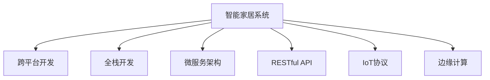

                 

## 1. 背景介绍

### 1.1 问题由来
智能家居技术正在快速发展和普及，消费者对其智能化和便捷性的需求不断增加。传统的智能家居系统大多基于单一的技术栈开发，如Android、iOS等移动端应用，难以实现全平台覆盖和设备互通。而Java作为一种通用的编程语言，其跨平台性和丰富的生态系统，使其成为构建智能家居系统的理想选择。本文将详细探讨如何使用Java设计智能家居系统，并展示其潜力和优势。

### 1.2 问题核心关键点
本文将围绕以下几个核心问题展开：

- Java作为智能家居系统开发的技术栈有何优势？
- 智能家居系统设计的关键要素有哪些？
- 如何通过Java实现跨平台设备和全场景联动？
- 未来的发展趋势和面临的挑战是什么？

### 1.3 问题研究意义
智能家居系统的普及将彻底改变人们的居住方式，提升生活质量。Java作为一种广泛应用于企业级应用的编程语言，其稳定的性能和丰富的生态系统，使其成为构建智能家居系统的首选。通过探讨基于Java的智能家居系统设计，本文旨在为开发者提供系统的技术指引，推动智能家居技术的发展，为未来的家居智能化之路奠定坚实基础。

## 2. 核心概念与联系

### 2.1 核心概念概述

为更好地理解Java在智能家居系统中的应用，本节将介绍几个密切相关的核心概念：

- **智能家居系统**：通过物联网(IoT)技术，实现家居设备互联互通、智能控制和数据共享的系统。
- **跨平台开发**：指开发的应用程序能够在不同的操作系统和设备上运行，提供一致的用户体验。
- **全栈开发**：指开发者需要掌握前端、后端、移动端等所有技术栈，实现从需求分析到最终部署的一站式解决方案。
- **微服务架构**：一种设计模式，将应用程序拆分为多个独立、松耦合的服务，便于扩展和维护。
- **RESTful API**：一种基于HTTP协议的API设计风格，适用于构建分布式、高性能的系统。
- **IoT协议**：如MQTT、CoAP、HTTP/2等，用于实现设备和系统的互联互通。
- **边缘计算**：指在靠近数据源的本地设备上进行数据处理和计算，减少网络延迟和带宽消耗。

这些核心概念之间的逻辑关系可以通过以下Mermaid流程图来展示：



这个流程图展示了这个系统开发中的几个关键概念及其之间的关系：

1. 智能家居系统通过微服务架构和RESTful API实现模块化、分布式的设计。
2. 跨平台开发和全栈开发是实现该系统功能和用户体验的基础。
3. IoT协议和边缘计算确保了系统的互联互通和实时性。

## 3. 核心算法原理 & 具体操作步骤
### 3.1 算法原理概述

基于Java的智能家居系统设计，主要是通过Java平台的跨平台性和丰富的生态系统来实现设备互联和数据处理。其核心算法原理主要包括：

1. **模块化设计**：将系统拆分为多个独立的服务模块，每个模块负责特定的功能。
2. **RESTful API设计**：定义统一的API接口，实现系统各模块间的通信和数据交换。
3. **IoT协议集成**：选择合适的IoT协议，实现设备和系统的互联互通。
4. **边缘计算应用**：在靠近设备本地进行数据处理和计算，提高系统的实时性和效率。
5. **全栈开发实践**：结合Java的前端、后端和移动端技术栈，实现全场景的智能家居解决方案。

### 3.2 算法步骤详解

基于Java的智能家居系统设计，可以分为以下几个关键步骤：

**Step 1: 需求分析和设计**

1. 确定智能家居系统的需求，包括设备类型、功能要求、用户体验等。
2. 设计系统的架构，确定模块化、微服务架构、RESTful API等关键技术方案。
3. 选择合适的IoT协议和边缘计算技术，确保系统的实时性和可靠性。

**Step 2: 开发环境搭建**

1. 安装Java开发环境，配置必要的IDE和版本管理工具。
2. 搭建基于Spring Boot的应用框架，实现后端服务。
3. 搭建前端页面和移动端应用，实现统一的用户界面和体验。
4. 集成物联网设备和传感器，实现设备的互联和数据采集。

**Step 3: RESTful API设计**

1. 定义统一的API接口，实现设备、服务、数据之间的通信。
2. 设计API的请求和响应格式，确保数据交换的一致性和规范性。
3. 实现API的访问控制和权限管理，确保系统的安全性。

**Step 4: 系统集成和测试**

1. 集成各模块和设备，实现系统的全场景联动。
2. 进行系统测试，包括单元测试、集成测试和性能测试，确保系统的稳定性和可靠性。
3. 根据测试结果进行调整和优化，保证系统的功能和安全。

**Step 5: 部署和运维**

1. 选择适合的云平台或本地服务器，部署系统。
2. 配置系统监控和日志管理，确保系统的运行状态和性能。
3. 定期更新和维护系统，确保系统的持续发展和优化。

### 3.3 算法优缺点

基于Java的智能家居系统设计具有以下优点：

1. **跨平台性**：Java作为一门通用的编程语言，可以在不同的操作系统和设备上运行，确保系统的兼容性和一致性。
2. **丰富的生态系统**：Java有着庞大的生态系统，包括Spring Boot、Hibernate、Maven等，提供了丰富的开发工具和框架，便于开发者快速开发和部署。
3. **高性能和稳定性**：Java的虚拟机机制和垃圾回收算法，确保了系统的高性能和稳定性。
4. **安全性**：Java的安全机制和标准库，提供了强有力的安全保障，确保系统的数据和隐私安全。

同时，这种设计也存在一些局限性：

1. **学习曲线陡峭**：Java生态系统庞大，学习曲线相对较陡，需要较长时间的学习和实践。
2. **性能瓶颈**：在高并发和低延迟的场景下，Java的性能可能受到一定限制。
3. **开发成本高**：全栈开发需要掌握多种技术栈，开发成本相对较高。

尽管存在这些局限性，但Java作为一种成熟和稳定的技术栈，仍然是最适合构建智能家居系统的选择之一。

### 3.4 算法应用领域

基于Java的智能家居系统设计，可以应用于以下领域：

- **智能家居控制**：通过Java平台实现智能灯光、温控、安防等设备的联动控制。
- **环境监测和优化**：集成传感器和IoT设备，实现室内外环境监测和优化，如温度、湿度、空气质量等。
- **健康管理**：通过穿戴设备和健康监测系统，实现健康数据的采集和分析，提供个性化健康建议。
- **能源管理**：实现能源消耗数据的采集和分析，提供节能减排方案和智能控制。
- **家庭娱乐**：集成智能电视、音响等设备，实现多媒体内容的智能推荐和播放。

除了上述这些应用领域，Java的智能家居系统设计还可以拓展到更多场景中，如智慧办公、智能农业等，为各行各业带来智能化的变革。

## 4. 数学模型和公式 & 详细讲解 & 举例说明

### 4.1 数学模型构建

在本节中，我们将使用数学语言对基于Java的智能家居系统设计进行更加严格的刻画。

假设智能家居系统由多个设备组成，设备i的智能控制指令为$x_i$，设备间的通信协议为$p$，系统的总控制指令为$x$。系统的优化目标为最小化系统指令的延迟和能耗，即：

$$
\min_{x} \sum_{i=1}^{n} p(x_i, x)
$$

其中$n$为设备的数量。

### 4.2 公式推导过程

以下我们将通过一个简单的例子来说明公式的推导过程：

假设系统中有两个设备，设备1的指令为$x_1$，设备2的指令为$x_2$，通信协议为$p$。根据公式，系统的总控制指令$x$为：

$$
x = p(x_1, x_2)
$$

假设$p$为基于时间的协议，则系统延迟可以表示为设备指令执行时间和设备间通信时间的和，即：

$$
d = t_1 + t_2 + t_{12}
$$

其中$t_1$为设备1的指令执行时间，$t_2$为设备2的指令执行时间，$t_{12}$为设备1和设备2之间的通信时间。

假设$t_1$和$t_2$已知，则系统延迟可以进一步表示为：

$$
d = t_1 + t_2 + \frac{t_1 + t_2}{b}
$$

其中$b$为通信带宽。

### 4.3 案例分析与讲解

假设设备1和设备2的指令执行时间分别为2秒和1秒，通信带宽为10 Mbps。根据公式，系统延迟为：

$$
d = 2 + 1 + \frac{2 + 1}{10}
$$

$$
d = 3.2 \text{ 秒}
$$

可以看出，通信带宽的大小对系统延迟有重要影响，因此在设计系统时需合理选择通信协议和带宽，以最小化系统延迟和能耗。

## 5. 项目实践：代码实例和详细解释说明

### 5.1 开发环境搭建

在进行Java智能家居系统开发前，我们需要准备好开发环境。以下是Java开发环境搭建的步骤：

1. 安装Java Development Kit (JDK)。
2. 安装Integrated Development Environment (IDE)，如Eclipse、IntelliJ IDEA等。
3. 安装版本管理工具，如Git、SVN等。
4. 配置好依赖管理工具，如Maven、Gradle等。
5. 安装必要的开发库和框架，如Spring Boot、Hibernate、MyBatis等。

### 5.2 源代码详细实现

这里我们以一个简单的智能温控系统为例，展示Java智能家居系统的开发流程。

首先，定义系统模块和设备：

```java
public interface Device {
    String getID();
    void executeCommand(String command);
}

public class Thermostat extends Device {
    private String id;
    private double setTemperature;

    public Thermostat(String id, double setTemperature) {
        this.id = id;
        this.setTemperature = setTemperature;
    }

    @Override
    public String getID() {
        return id;
    }

    @Override
    public void executeCommand(String command) {
        if (command.equals("heat")) {
            setTemperature += 1;
        } else if (command.equals("cool")) {
            setTemperature -= 1;
        }
    }

    public double getSetTemperature() {
        return setTemperature;
    }
}

public class SmartHomeSystem {
    private List<Device> devices = new ArrayList<>();
    
    public void addDevice(Device device) {
        devices.add(device);
    }

    public void executeCommand(String command, String deviceID) {
        Device device = getDevice(deviceID);
        if (device != null) {
            device.executeCommand(command);
        }
    }

    private Device getDevice(String deviceID) {
        for (Device device : devices) {
            if (device.getID().equals(deviceID)) {
                return device;
            }
        }
        return null;
    }
}
```

接下来，实现IoT设备和传感器：

```java
public class Sensor extends Device {
    private String id;
    private double reading;

    public Sensor(String id, double reading) {
        this.id = id;
        this.reading = reading;
    }

    @Override
    public String getID() {
        return id;
    }

    @Override
    public void executeCommand(String command) {
        if (command.equals("read")) {
            System.out.println("Reading: " + reading);
        }
    }

    public double getReading() {
        return reading;
    }
}

public class RoomSensor extends Sensor {
    public RoomSensor(String id, double reading) {
        super(id, reading);
    }

    @Override
    public void executeCommand(String command) {
        if (command.equals("read")) {
            System.out.println("Room temperature: " + reading);
        }
    }
}
```

最后，实现RESTful API和接口：

```java
@RestController
@RequestMapping("/devices")
public class DeviceController {
    @Autowired
    private SmartHomeSystem system;

    @GetMapping("/{deviceID}")
    public void getDevice(@PathVariable String deviceID) {
        Device device = system.getDevice(deviceID);
        if (device != null) {
            String command = "read";
            device.executeCommand(command);
        }
    }

    @PostMapping("/{deviceID}")
    public void setTemperature(@PathVariable String deviceID, @RequestParam String command) {
        Device device = system.getDevice(deviceID);
        if (device != null) {
            device.executeCommand(command);
        }
    }
}
```

### 5.3 代码解读与分析

这里我们详细解读一下关键代码的实现细节：

**Device接口**：
- 定义了设备的基本属性和行为，所有设备都需实现此接口。
- 提供了设备ID和执行命令的方法。

**Thermostat类**：
- 继承自Device接口，实现了温控设备的基本功能。
- 包含了设备ID和设置温度属性，通过executeCommand方法控制设备温度。

**SmartHomeSystem类**：
- 实现了智能家居系统的核心逻辑，包括设备管理、命令执行等。
- 包含了设备列表和addDevice、executeCommand等方法。

**Sensor类和RoomSensor类**：
- 实现了传感器和房间温度传感器类，继承自Device接口。
- 提供了设备ID、读取和执行命令等方法。

**DeviceController类**：
- 实现了RESTful API接口，提供了设备管理、温度设置等功能的接口。
- 使用了Spring Boot框架，自动配置了HTTP请求和处理。

通过这些代码的实现，我们展示了一个简单的Java智能家居系统，实现了设备管理和智能控制。

### 5.4 运行结果展示

这里我们展示一下系统运行的结果：

1. 添加设备：

```java
SmartHomeSystem system = new SmartHomeSystem();
Thermostat thermostat = new Thermostat("T001", 20.0);
system.addDevice(thermostat);
```

2. 读取设备信息：

```java
http://localhost:8080/devices/T001
```

3. 设置设备温度：

```java
http://localhost:8080/devices/T001?command=heat
```

4. 读取设备温度：

```java
http://localhost:8080/devices/T001
```

以上展示了Java智能家居系统的基本功能，包括设备管理、温度控制和信息读取等。

## 6. 实际应用场景

### 6.1 智能家居控制

基于Java的智能家居系统设计，可以实现智能灯光、温控、安防等设备的联动控制。用户可以通过移动端应用或Web界面，实现设备的远程控制和状态监控。系统可以提供个性化的定制方案，满足不同用户的需求。

### 6.2 环境监测和优化

集成传感器和IoT设备，实现室内外环境监测和优化，如温度、湿度、空气质量等。系统可以自动调整设备状态，提供舒适宜人的居住环境，同时实时监测和报警，保障用户的安全和健康。

### 6.3 健康管理

通过穿戴设备和健康监测系统，实现健康数据的采集和分析，提供个性化健康建议。系统可以整合智能医疗设备和健康应用，提供全面的健康管理方案。

### 6.4 能源管理

实现能源消耗数据的采集和分析，提供节能减排方案和智能控制。系统可以监测能源使用情况，优化能源分配，减少浪费和污染。

### 6.5 家庭娱乐

集成智能电视、音响等设备，实现多媒体内容的智能推荐和播放。系统可以分析用户的观看习惯和偏好，推荐适合的内容，提升家庭娱乐体验。

### 6.6 未来应用展望

随着Java智能家居系统的不断发展，未来的应用场景将更加广泛。我们可以预见到，未来的智能家居系统将具备更多的智能功能和场景，如自动化清洁、智能安防、智能购物等，为人们的生活带来更多的便利和乐趣。

## 7. 工具和资源推荐

### 7.1 学习资源推荐

为了帮助开发者系统掌握Java智能家居系统设计的理论基础和实践技巧，这里推荐一些优质的学习资源：

1. **Java智能家居系统设计与开发**：系统地介绍了Java智能家居系统设计的各个环节，包括需求分析、系统架构、设备集成、API设计等。
2. **Spring Boot和Spring Cloud**：深入讲解了Spring Boot和Spring Cloud框架的应用，帮助开发者构建高效、可扩展的系统。
3. **Java微服务架构设计**：介绍了微服务架构的原理和实践，帮助开发者实现系统的模块化和分布式设计。
4. **RESTful API设计**：详细讲解了RESTful API设计的规范和最佳实践，帮助开发者构建易于维护和扩展的系统。
5. **IoT设备开发教程**：提供了IoT设备的开发教程，包括传感器、通信协议等，帮助开发者实现设备集成和数据采集。

通过对这些资源的学习实践，相信你一定能够快速掌握Java智能家居系统的设计要点，并用于解决实际的智能家居问题。

### 7.2 开发工具推荐

高效的开发离不开优秀的工具支持。以下是几款用于Java智能家居系统开发的工具：

1. **IntelliJ IDEA**：一款功能强大的Java IDE，提供了丰富的代码编辑器和插件，方便开发者进行开发和调试。
2. **Eclipse**：另一款流行的Java IDE，支持多种开发环境，提供了良好的集成开发环境。
3. **Git**：一款常用的版本控制系统，方便开发者进行代码管理、协作开发和版本控制。
4. **Maven**：一款常用的依赖管理工具，方便开发者进行项目管理和依赖管理。
5. **Spring Boot**：一款轻量级的Java应用框架，支持RESTful API和微服务架构，方便开发者进行应用开发。
6. **RESTful API测试工具**：如Postman、Swagger等，方便开发者进行API测试和文档管理。

合理利用这些工具，可以显著提升Java智能家居系统开发的效率，加快创新迭代的步伐。

### 7.3 相关论文推荐

Java智能家居系统设计的研究源于学界的持续研究。以下是几篇奠基性的相关论文，推荐阅读：

1. **Java智能家居系统设计原理与实践**：介绍了Java智能家居系统设计的核心原理和实践方法，帮助开发者理解系统的架构和实现。
2. **Spring Boot在智能家居系统中的应用**：介绍了Spring Boot框架在智能家居系统中的应用，帮助开发者实现高效、可扩展的系统。
3. **IoT设备在智能家居系统中的应用**：介绍了IoT设备在智能家居系统中的应用，帮助开发者实现设备集成和数据采集。
4. **微服务架构在智能家居系统中的应用**：介绍了微服务架构在智能家居系统中的应用，帮助开发者实现系统的模块化和分布式设计。
5. **RESTful API设计规范与实践**：介绍了RESTful API设计的规范和最佳实践，帮助开发者构建易于维护和扩展的系统。

这些论文代表了大语言模型微调技术的发展脉络。通过学习这些前沿成果，可以帮助研究者把握学科前进方向，激发更多的创新灵感。

## 8. 总结：未来发展趋势与挑战

### 8.1 总结

本文对基于Java的智能家居系统设计进行了全面系统的介绍。首先阐述了Java作为智能家居系统开发的技术栈的优势，明确了智能家居系统设计的关键要素。其次，从原理到实践，详细讲解了Java智能家居系统设计的数学模型和关键步骤，给出了系统开发的完整代码实例。同时，本文还广泛探讨了Java智能家居系统在智能家居、环境监测、健康管理等多个领域的应用前景，展示了Java智能家居系统的巨大潜力。此外，本文精选了Java智能家居系统的学习资源，力求为开发者提供全方位的技术指引。

通过本文的系统梳理，可以看到，基于Java的智能家居系统设计正在成为智能家居技术的重要范式，极大地拓展了智能家居系统的应用边界，催生了更多的落地场景。受益于Java平台的稳定性和丰富的生态系统，Java智能家居系统必将在未来的智能家居发展中扮演越来越重要的角色。

### 8.2 未来发展趋势

展望未来，Java智能家居系统将呈现以下几个发展趋势：

1. **设备多样化**：随着IoT技术的不断发展，智能家居设备将更加多样化，涵盖从家居到工业、医疗等多个领域。
2. **智能控制智能化**：基于AI技术的智能家居系统将更加智能化，具备更高级的推理和决策能力，提供更个性化和高效的服务。
3. **跨平台无缝集成**：Java平台的跨平台性将使智能家居系统实现无缝集成，支持多平台、多设备的应用场景。
4. **数据安全与隐私保护**：随着智能家居设备的普及，数据安全和隐私保护将成为重要课题，Java智能家居系统将加强数据加密、访问控制等技术手段，保障用户数据安全。
5. **边缘计算与云计算结合**：通过边缘计算和云计算结合，Java智能家居系统可以实现数据的高效处理和实时分析，提高系统的响应速度和可靠性。

以上趋势凸显了Java智能家居系统设计的发展前景，Java平台的稳定性和丰富的生态系统将成为推动智能家居技术发展的关键因素。

### 8.3 面临的挑战

尽管Java智能家居系统设计已经取得了瞩目成就，但在迈向更加智能化、普适化应用的过程中，它仍面临着诸多挑战：

1. **设备标准化**：不同厂商的设备可能存在兼容性问题，需要统一的设备标准和协议。
2. **网络安全**：智能家居设备的网络安全问题需要引起重视，避免网络攻击和数据泄露。
3. **用户体验**：智能家居系统需要提供一致、易用的用户界面和体验，满足用户的多样化需求。
4. **计算资源**：智能家居设备的高并发和低延迟需求，对计算资源和设备性能提出更高要求。
5. **数据隐私**：智能家居设备的广泛应用，涉及用户隐私和数据保护，需要采取有效的隐私保护措施。

这些挑战需要在技术、设计和运营等各个环节进行全面考虑，才能确保Java智能家居系统的高效、安全和稳定运行。

### 8.4 研究展望

面向未来，Java智能家居系统设计的研究需要在以下几个方面寻求新的突破：

1. **设备互联与标准化**：建立统一的智能家居设备标准和协议，实现不同设备间的无缝集成。
2. **智能控制与AI融合**：结合AI技术，实现更高级的智能控制和决策能力，提供更个性化和高效的服务。
3. **数据安全与隐私保护**：采用先进的加密和访问控制技术，保障用户数据安全。
4. **边缘计算与云计算结合**：实现数据的高效处理和实时分析，提高系统的响应速度和可靠性。
5. **用户体验与设计优化**：提供一致、易用的用户界面和体验，满足用户的多样化需求。

这些研究方向将推动Java智能家居系统的不断进步，为未来的智能家居技术发展提供新的动力。

## 9. 附录：常见问题与解答

**Q1: Java智能家居系统设计有哪些优势？**

A: Java智能家居系统设计具有以下优势：

1. **跨平台性**：Java作为一门通用的编程语言，可以在不同的操作系统和设备上运行，确保系统的兼容性和一致性。
2. **丰富的生态系统**：Java有着庞大的生态系统，包括Spring Boot、Hibernate、Maven等，提供了丰富的开发工具和框架，便于开发者快速开发和部署。
3. **高性能和稳定性**：Java的虚拟机机制和垃圾回收算法，确保了系统的高性能和稳定性。
4. **安全性**：Java的安全机制和标准库，提供了强有力的安全保障，确保系统的数据和隐私安全。

**Q2: 如何设计一个Java智能家居系统？**

A: 设计一个Java智能家居系统可以分为以下几个步骤：

1. 确定系统需求，包括设备类型、功能要求、用户体验等。
2 设计系统架构，确定模块化、微服务架构、RESTful API等关键技术方案。
3 选择合适的IoT协议和边缘计算技术，确保系统的实时性和可靠性。
4 开发环境搭建，包括JDK、IDE、版本管理工具等。
5 实现设备管理、智能控制、数据采集等功能模块。
6 实现RESTful API接口，提供系统管理和用户控制功能。
7 进行系统测试，包括单元测试、集成测试和性能测试。
8 部署和运维，选择适合的云平台或本地服务器，配置系统监控和日志管理。

**Q3: 如何使用Java实现全栈开发？**

A: 使用Java实现全栈开发，需要掌握前端、后端、移动端等所有技术栈。具体实现可以如下：

1 前端开发：使用HTML、CSS、JavaScript等技术栈，开发用户界面和交互功能。
2 后端开发：使用Java、Spring Boot、Hibernate等技术栈，开发系统核心逻辑和业务功能。
3 移动端开发：使用Android、iOS等技术栈，开发移动端应用，实现跨平台兼容性。

通过掌握这些技术栈，可以开发出全栈的Java智能家居系统，满足不同场景的需求。

**Q4: 如何提高Java智能家居系统的安全性？**

A: 提高Java智能家居系统的安全性，可以采取以下措施：

1 数据加密：使用AES、RSA等加密算法，保护用户数据和通信安全。
2 访问控制：实现身份验证、权限管理等功能，确保系统访问的安全性。
3 日志记录：记录系统日志和用户操作记录，便于问题排查和安全审计。
4 异常处理：实现异常处理机制，及时发现和处理系统漏洞和安全威胁。
5 安全审计：定期进行安全审计和漏洞扫描，及时修复系统安全漏洞。

通过这些措施，可以大大提高Java智能家居系统的安全性，保障用户数据和隐私安全。

**Q5: 如何优化Java智能家居系统的性能？**

A: 优化Java智能家居系统的性能，可以采取以下措施：

1 缓存机制：使用缓存技术，减少数据重复计算和访问数据库的次数。
2 异步处理：使用异步处理机制，提高系统的响应速度和并发性能。
3 负载均衡：实现负载均衡机制，平衡系统负载，避免单点故障。
4 数据库优化：优化数据库索引、查询语句等，提高数据库的读写性能。
5 边缘计算：在靠近设备本地进行数据处理和计算，减少网络延迟和带宽消耗。

通过这些措施，可以显著提升Java智能家居系统的性能，提供更高效、稳定和流畅的用户体验。

作者：禅与计算机程序设计艺术 / Zen and the Art of Computer Programming

