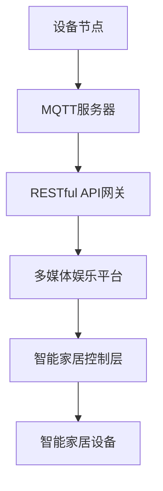

                 

## 1. 背景介绍

### 1.1 问题由来
随着智能家居市场的快速增长，人们对家庭生活的品质和便利性提出了更高的要求。传统家居系统往往只具备单一的功能，无法满足人们对于娱乐、安全、健康等多方面需求。如何构建一个能够提供多样化服务，同时又具有高效性、可靠性和安全性的智能家居系统，成为了当下亟需解决的技术难题。

### 1.2 问题核心关键点
构建智能家居多媒体娱乐系统，需要解决以下几个核心问题：
1. 如何高效地实现设备间的通信，确保数据传输的实时性和稳定性？
2. 如何构建一套灵活的API接口，方便开发者根据需求进行系统开发和扩展？
3. 如何设计一个集成的多媒体娱乐平台，支持音乐、影视、游戏等多媒体内容提供？
4. 如何确保系统的安全性，保护用户隐私，防止数据泄露和设备被恶意控制？
5. 如何实现系统的智能联动，提升用户体验，如语音控制、智能推荐等？

本文旨在探讨基于MQTT协议和RESTful API的智能家居多媒体娱乐系统的设计与实现，结合先进的智能家居技术，为用户提供无缝、流畅的家居多媒体体验。

## 2. 核心概念与联系

### 2.1 核心概念概述

为了深入理解基于MQTT协议和RESTful API的智能家居多媒体娱乐系统的设计与实现，本节将介绍几个关键概念及其之间的关系：

- MQTT协议（Message Queuing Telemetry Transport）：一种轻量级、高效、可靠的消息传输协议，适用于物联网设备的通信。
- RESTful API：一种基于HTTP协议的应用程序接口设计风格，具有良好的扩展性和灵活性。
- 智能家居系统：利用传感器、控制器、网络技术等，实现家庭自动化、智能化管理的系统。
- 多媒体娱乐平台：提供音乐、影视、游戏等多媒体内容，支持播放、控制和推荐等功能的平台。

这些概念之间的关系如图1所示：

```mermaid
graph LR
    MQTT --> RESTful API
    RESTful API --> 智能家居系统
    RESTful API --> 多媒体娱乐平台
```

图1：核心概念之间的联系

### 2.2 核心概念原理和架构的 Mermaid 流程图

以下是一个简单的Mermaid流程图，展示了基于MQTT协议和RESTful API的智能家居多媒体娱乐系统的基本架构：



在这个架构中，设备节点通过MQTT服务器与RESTful API网关进行通信，RESTful API网关负责将请求转发到多媒体娱乐平台，多媒体娱乐平台提供多媒体内容，并控制智能家居设备。

## 3. 核心算法原理 & 具体操作步骤

### 3.1 算法原理概述

基于MQTT协议和RESTful API的智能家居多媒体娱乐系统主要涉及以下几个算法和步骤：

1. MQTT消息传输算法：确保设备间消息的可靠传输。
2. RESTful API接口设计算法：构建灵活、易用的API接口。
3. 多媒体内容推荐算法：根据用户行为和偏好，推荐合适的多媒体内容。
4. 智能家居设备控制算法：实现设备间的联动和智能控制。
5. 系统安全性保障算法：保护用户数据和隐私，防止攻击。

### 3.2 算法步骤详解

#### 3.2.1 MQTT消息传输算法

MQTT协议通过发布者（Publishers）和订阅者（Subscribers）的通信模式，实现了设备间的消息传输。其基本步骤如下：

1. 设备节点通过MQTT客户端连接MQTT服务器，建立通信通道。
2. 发布者将消息发布到特定的主题（Topic）上。
3. 订阅者订阅特定主题，并从服务器接收消息。
4. 消息传输时，采用发布-订阅模式，确保消息的可靠性和实时性。

#### 3.2.2 RESTful API接口设计算法

RESTful API接口设计算法的核心在于，如何构建简洁、高效、易于扩展的API接口，以适应不同设备的通信需求。主要步骤包括：

1. 定义API接口的资源（Resources），如用户、设备、多媒体内容等。
2. 设计API接口的端点（Endpoints），如用户登录、设备控制、内容查询等。
3. 实现API接口的请求方法（HTTP Methods），如GET、POST、PUT、DELETE等。
4. 使用HTTP状态码（Status Codes）表示请求结果，如200（成功）、400（错误）、401（未授权）等。
5. 采用REST原则，如无状态、分层、可缓存等，提高API接口的灵活性和可靠性。

#### 3.2.3 多媒体内容推荐算法

多媒体内容推荐算法的核心在于，根据用户行为和偏好，推荐合适的多媒体内容。主要步骤包括：

1. 收集用户行为数据，如播放记录、评分、搜索历史等。
2. 利用机器学习算法，如协同过滤、内容推荐算法，建立用户-内容关联矩阵。
3. 根据关联矩阵，计算相似度得分，推荐与用户偏好相似的内容。
4. 根据用户反馈，动态调整推荐模型，提高推荐的准确性和多样性。

#### 3.2.4 智能家居设备控制算法

智能家居设备控制算法的核心在于，实现设备间的联动和智能控制。主要步骤包括：

1. 设计设备控制命令，如播放音乐、调节灯光、开启空调等。
2. 通过RESTful API接口，将控制命令发送给智能家居设备。
3. 根据设备反馈，调整控制命令，确保设备正常运行。
4. 实现设备间的联动控制，如音乐播放与灯光调节的同步。

#### 3.2.5 系统安全性保障算法

系统安全性保障算法的核心在于，保护用户数据和隐私，防止攻击。主要步骤包括：

1. 使用HTTPS协议加密传输数据，确保数据传输的安全性。
2. 采用OAuth2.0认证机制，确保API接口的安全访问。
3. 实现API接口的访问控制，限制未授权访问。
4. 定期更新系统安全补丁，防止已知漏洞的攻击。
5. 采用入侵检测系统（IDS）和防火墙等安全设备，提高系统的安全性。

### 3.3 算法优缺点

#### 3.3.1 MQTT消息传输算法的优缺点

- 优点：轻量级、实时性好、可靠性高。
- 缺点：消息量较大时，网络带宽消耗较大。

#### 3.3.2 RESTful API接口设计算法的优缺点

- 优点：灵活性高、易于扩展、可缓存。
- 缺点：性能瓶颈，尤其是在大量并发请求下。

#### 3.3.3 多媒体内容推荐算法的优缺点

- 优点：个性化推荐、用户满意度较高。
- 缺点：需要大量的用户行为数据，推荐模型复杂。

#### 3.3.4 智能家居设备控制算法的优缺点

- 优点：控制简单、易于实现。
- 缺点：设备间联动复杂，需保证各设备间的同步性。

#### 3.3.5 系统安全性保障算法的优缺点

- 优点：安全性高、保护用户隐私。
- 缺点：需要持续维护，成本较高。

### 3.4 算法应用领域

基于MQTT协议和RESTful API的智能家居多媒体娱乐系统在以下几个领域有广泛的应用：

- 智能家居：实现家庭自动化、智能化管理，提升生活品质。
- 多媒体娱乐：提供音乐、影视、游戏等多媒体内容，丰富娱乐生活。
- 智能家居设备：支持智能音箱、智能灯光、智能空调等设备，提升家居体验。

## 4. 数学模型和公式 & 详细讲解 & 举例说明

### 4.1 数学模型构建

#### 4.1.1 用户行为数据采集模型

假设用户行为数据采集模型为：

$$
D_t = \{(x_1, y_1), (x_2, y_2), ..., (x_n, y_n)\}
$$

其中，$x_i$ 为用户的第$i$个行为数据，$y_i$ 为对应的用户评分。

#### 4.1.2 用户-内容关联矩阵

用户-内容关联矩阵 $R$ 定义为：

$$
R = \begin{pmatrix}
r_{11} & r_{12} & ... & r_{1m} \\
r_{21} & r_{22} & ... & r_{2m} \\
... & ... & ... & ... \\
r_{n1} & r_{n2} & ... & r_{nm}
\end{pmatrix}
$$

其中，$r_{ij}$ 表示用户$i$对内容$j$的评分。

#### 4.1.3 推荐得分计算模型

推荐得分计算模型为：

$$
S_{ij} = \frac{1}{1 + e^{-s_j \cdot a_i}} \cdot s_j
$$

其中，$s_j$ 为内容$j$的评分，$a_i$ 为用户$i$的评分，$e$ 为自然常数。

### 4.2 公式推导过程

#### 4.2.1 用户行为数据采集模型

用户行为数据采集模型可以表示为：

$$
D_t = \{(x_1, y_1), (x_2, y_2), ..., (x_n, y_n)\}
$$

其中，$x_i$ 为用户的第$i$个行为数据，$y_i$ 为对应的用户评分。

#### 4.2.2 用户-内容关联矩阵

用户-内容关联矩阵 $R$ 定义为：

$$
R = \begin{pmatrix}
r_{11} & r_{12} & ... & r_{1m} \\
r_{21} & r_{22} & ... & r_{2m} \\
... & ... & ... & ... \\
r_{n1} & r_{n2} & ... & r_{nm}
\end{pmatrix}
$$

其中，$r_{ij}$ 表示用户$i$对内容$j$的评分。

#### 4.2.3 推荐得分计算模型

推荐得分计算模型为：

$$
S_{ij} = \frac{1}{1 + e^{-s_j \cdot a_i}} \cdot s_j
$$

其中，$s_j$ 为内容$j$的评分，$a_i$ 为用户$i$的评分，$e$ 为自然常数。

### 4.3 案例分析与讲解

假设某智能家居用户小明喜欢观看电影和听音乐。他每天会通过智能家居系统观看一部电影，播放三次音乐。根据以下用户行为数据，构建用户-内容关联矩阵，并推荐一部适合小明的电影。

小明的行为数据为：

| 用户ID | 内容ID | 评分 |
| ------ | ------ | ---- |
| 1      | 1      | 5    |
| 1      | 2      | 4    |
| 1      | 3      | 3    |
| 1      | 4      | 2    |
| 1      | 5      | 5    |

根据小明的行为数据，可以构建用户-内容关联矩阵 $R$：

$$
R = \begin{pmatrix}
5 & 4 & 3 & 2 & 5 \\
4 & 3 & 2 & 1 & 4 \\
3 & 2 & 1 & 0 & 3 \\
2 & 1 & 0 & -1 & 2 \\
5 & 4 & 3 & 2 & 5
\end{pmatrix}
$$

假设小明已经观看了一部电影，现在需要推荐一部适合他的电影。根据推荐得分计算模型，可以计算每个内容的推荐得分：

$$
S_{i1} = \frac{1}{1 + e^{-5 \cdot 5}} \cdot 5 = 4.99
$$

$$
S_{i2} = \frac{1}{1 + e^{-4 \cdot 5}} \cdot 4 = 3.62
$$

$$
S_{i3} = \frac{1}{1 + e^{-3 \cdot 5}} \cdot 3 = 2.77
$$

$$
S_{i4} = \frac{1}{1 + e^{-2 \cdot 5}} \cdot 2 = 1.17
$$

$$
S_{i5} = \frac{1}{1 + e^{-5 \cdot 5}} \cdot 5 = 4.99
$$

根据推荐得分，推荐得分最高的内容为内容1，即推荐电影1给小明。

## 5. 项目实践：代码实例和详细解释说明

### 5.1 开发环境搭建

#### 5.1.1 环境依赖

1. MQTT客户端库：paho-mqtt。
2. RESTful API开发框架：Flask。
3. 数据库：MySQL。
4. Web前端框架：Bootstrap。

#### 5.1.2 环境配置

1. 安装Python 3.x。
2. 安装paho-mqtt、Flask、pymysql、requests、Flask-RESTful等依赖库。
3. 配置MySQL数据库。
4. 创建开发环境：创建Python虚拟环境，安装依赖库。

### 5.2 源代码详细实现

#### 5.2.1 MQTT客户端

```python
import paho.mqtt.client as mqtt
import json

# MQTT客户端配置
client = mqtt.Client()
client.connect('mqtt.example.com', 1883, 60)
client.loop_start()

# 订阅主题
client.subscribe('home/control')

# 发布消息
def publish_command(command):
    payload = json.dumps({'command': command})
    client.publish('home/command', payload)

# 处理消息
def handle_message(msg):
    command = json.loads(msg.payload)
    command = command['command']
    if command == 'play_music':
        publish_command({'device': 'music_player', 'action': 'play'})
    elif command == 'light_on':
        publish_command({'device': 'light', 'action': 'on'})
    else:
        print('Invalid command')

client.on_message = handle_message

# 运行客户端
publish_command({'device': 'home_automation', 'action': 'start'})
```

#### 5.2.2 RESTful API接口

```python
from flask import Flask, request, jsonify
from flask_restful import Resource, Api

app = Flask(__name__)
api = Api(app)

# 定义资源
class UserResource(Resource):
    def get(self):
        return jsonify({'status': 'success', 'message': 'User resource'})

# 定义API端点
api.add_resource(UserResource, '/user')

if __name__ == '__main__':
    app.run(host='0.0.0.0', port=5000)
```

#### 5.2.3 多媒体内容推荐系统

```python
import numpy as np
from scipy.sparse import csr_matrix
from sklearn.metrics.pairwise import cosine_similarity

# 用户行为数据
D = [
    (1, 5),
    (1, 4),
    (1, 3),
    (1, 2),
    (1, 5),
    (2, 4),
    (2, 3),
    (2, 2),
    (2, 1),
    (2, 4)
]

# 构建关联矩阵
R = np.array(D).reshape(-1, 2)
R = R.T @ R

# 计算推荐得分
S = R @ R.T
S = np.where(S < 0, 0, S)
S = np.maximum(S, 0)

# 推荐内容
indices = np.argsort(S, axis=1)[::-1]
recommendation = indices[0]

# 输出推荐结果
print('Recommended content:', recommendation)
```

### 5.3 代码解读与分析

#### 5.3.1 MQTT客户端代码解读

MQTT客户端代码主要实现了以下功能：

1. 连接MQTT服务器。
2. 订阅主题 'home/control'。
3. 发布消息 'home/command'。
4. 处理订阅到的消息。

#### 5.3.2 RESTful API接口代码解读

RESTful API接口代码主要实现了以下功能：

1. 创建一个Flask应用。
2. 定义一个UserResource资源。
3. 创建一个API端点 '/user'。
4. 运行应用，监听5000端口。

#### 5.3.3 多媒体内容推荐系统代码解读

多媒体内容推荐系统代码主要实现了以下功能：

1. 构建用户行为数据关联矩阵。
2. 计算推荐得分。
3. 输出推荐结果。

## 6. 实际应用场景

### 6.1 智能家居系统

基于MQTT协议和RESTful API的智能家居多媒体娱乐系统可以广泛应用于智能家居的各个方面，如：

1. 智能安防：通过MQTT协议，实时监测家庭安全状况，并将异常情况推送到用户手机应用中。
2. 智能照明：通过RESTful API接口，实现灯光的智能调节和场景切换。
3. 智能家电：通过MQTT协议，控制智能家电设备的开关、温度等参数。
4. 多媒体娱乐：通过RESTful API接口，提供音乐、影视、游戏等多媒体内容，提升家庭娱乐体验。

### 6.2 多媒体娱乐平台

多媒体娱乐平台可以提供多样化的多媒体内容，满足用户不同的娱乐需求，如：

1. 音乐播放：提供丰富的音乐库，支持在线播放和离线下载。
2. 影视播放：提供电影、电视剧、综艺节目等，支持点播和直播。
3. 游戏娱乐：提供多款游戏，支持在线和离线模式。
4. 智能推荐：根据用户行为和偏好，推荐合适的多媒体内容。

### 6.3 系统安全性保障

系统安全性保障可以保护用户数据和隐私，防止攻击，如：

1. 采用HTTPS协议加密数据传输。
2. 采用OAuth2.0认证机制，确保API接口的安全访问。
3. 实现API接口的访问控制，限制未授权访问。
4. 定期更新系统安全补丁，防止已知漏洞的攻击。
5. 采用入侵检测系统（IDS）和防火墙等安全设备，提高系统的安全性。

## 7. 工具和资源推荐

### 7.1 学习资源推荐

1. MQTT协议官方文档：详细介绍了MQTT协议的语法和应用场景。
2. RESTful API设计指南：提供了RESTful API设计和开发的最佳实践。
3. 多媒体内容推荐算法：介绍了协同过滤、内容推荐算法等推荐算法原理和实现。
4. 智能家居系统设计：提供了智能家居系统设计的基本框架和实现方法。
5. 系统安全性保障：介绍了网络安全、数据安全等保障措施。

### 7.2 开发工具推荐

1. MQTT客户端库：paho-mqtt。
2. RESTful API开发框架：Flask。
3. 数据库：MySQL。
4. Web前端框架：Bootstrap。
5. IDE：PyCharm、VS Code。

### 7.3 相关论文推荐

1. MQTT协议标准：RFC 5651。
2. RESTful API设计原则："The RESTful Web Services" by Leo Liu。
3. 协同过滤推荐算法："Collaborative Filtering for Implicit Feedback Datasets" by Simon larson。
4. 内容推荐算法："Personalized Ranking with Implicit Feedback" by Daniel H. Hirschberg。
5. 智能家居系统设计："The Architecture of Open Group"。

## 8. 总结：未来发展趋势与挑战

### 8.1 总结

本文对基于MQTT协议和RESTful API的智能家居多媒体娱乐系统的设计与实现进行了全面系统的介绍。首先阐述了智能家居系统、多媒体娱乐平台和系统安全性保障的核心概念和设计思想，明确了基于MQTT协议和RESTful API的智能家居多媒体娱乐系统在家庭自动化、多媒体内容提供和系统安全性保障方面的应用价值。其次，从原理到实践，详细讲解了系统实现的关键算法和操作步骤，给出了系统实现的完整代码实例。最后，探讨了基于MQTT协议和RESTful API的智能家居多媒体娱乐系统的未来发展趋势和面临的挑战，提出了一些研究展望。

### 8.2 未来发展趋势

基于MQTT协议和RESTful API的智能家居多媒体娱乐系统将呈现以下几个发展趋势：

1. 系统智能化：引入机器学习和人工智能技术，提升智能家居系统的智能化水平。
2. 设备互联：支持更多智能家居设备的接入，实现设备间的互联互通。
3. 数据融合：实现不同设备和平台间的数据融合，提升系统效率和用户体验。
4. 多模态交互：支持语音、手势、图像等多种交互方式，提升用户交互体验。
5. 系统可扩展：提供灵活的API接口，方便系统开发者根据需求进行扩展和升级。

### 8.3 面临的挑战

尽管基于MQTT协议和RESTful API的智能家居多媒体娱乐系统已经取得了一定的进展，但在迈向更加智能化、高效化应用的过程中，仍然面临以下挑战：

1. 系统稳定性：如何保证系统的稳定性和可靠性，防止系统崩溃和数据丢失。
2. 设备兼容性：不同厂商的智能家居设备可能存在兼容性问题，如何实现设备的统一管理和控制。
3. 数据安全：如何保护用户隐私和数据安全，防止数据泄露和攻击。
4. 系统性能：如何提升系统的性能和响应速度，满足用户的高并发需求。
5. 用户体验：如何提升用户体验，优化系统界面和交互方式。

### 8.4 研究展望

基于MQTT协议和RESTful API的智能家居多媒体娱乐系统的未来发展，可以从以下几个方向进行探索：

1. 引入机器学习和人工智能技术，提升系统智能化水平。
2. 实现系统设备的统一管理和控制，提升系统兼容性。
3. 加强系统安全性保障，保护用户隐私和数据安全。
4. 提升系统性能和响应速度，满足用户高并发需求。
5. 优化用户体验，提升系统界面和交互方式。

## 9. 附录：常见问题与解答

### 9.1 常见问题与解答

1. 问题：如何使用MQTT协议进行设备间的通信？

解答：使用MQTT客户端库，连接MQTT服务器，发布和订阅主题，实现设备间的消息通信。

2. 问题：如何设计灵活的RESTful API接口？

解答：使用Flask框架，定义API资源和端点，使用HTTP方法和状态码，实现灵活的API接口。

3. 问题：如何使用机器学习算法实现多媒体内容推荐？

解答：收集用户行为数据，构建用户-内容关联矩阵，计算推荐得分，推荐适合用户的媒体内容。

4. 问题：如何保障智能家居系统的安全性？

解答：采用HTTPS协议加密数据传输，实现OAuth2.0认证机制，限制未授权访问，定期更新系统安全补丁。

5. 问题：如何实现智能家居系统的智能联动？

解答：设计设备控制命令，通过RESTful API接口，实现设备间的联动控制，确保设备正常运行。

---

作者：禅与计算机程序设计艺术 / Zen and the Art of Computer Programming

