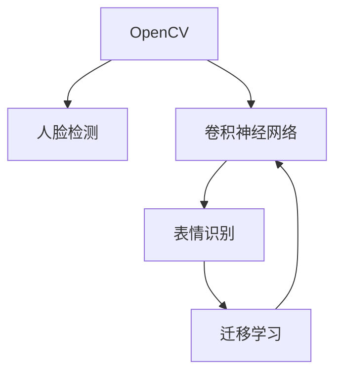

                 

# 基于opencv 的人脸表情识别系统详细设计与具体代码实现

> 关键词：人脸识别,opencv,计算机视觉,深度学习,机器学习,卷积神经网络(CNN),表情识别

## 1. 背景介绍

### 1.1 问题由来
随着计算机视觉技术的飞速发展，人脸表情识别在社交媒体分析、情绪监控、安全监控等领域中得到了广泛应用。然而，传统的人脸表情识别方法往往依赖于昂贵的硬件设备，且对于光线、姿势、表情多样性等因素敏感，导致识别精度有限。基于OpenCV深度学习框架的人脸表情识别系统，通过利用开源计算机视觉库，结合卷积神经网络(CNN)等深度学习技术，在保证精度的同时，实现了硬件设备要求的降低和应用的灵活性。

### 1.2 问题核心关键点
该系统面临的核心问题包括：
- 如何高效地采集和预处理人脸图像数据。
- 如何选择合适的深度学习模型进行表情识别。
- 如何设计合理的训练与测试流程，提升识别精度。
- 如何在实际应用中集成与优化系统，确保实时性。

### 1.3 问题研究意义
本系统不仅有助于提升表情识别精度，还能降低硬件成本，提高实时性，促进计算机视觉技术在普通用户中的普及和应用。通过此系统，用户可以更加便捷地实现表情监控、情绪分析等功能，为人工智能技术与日常生活的深度融合提供新的视角。

## 2. 核心概念与联系

### 2.1 核心概念概述

为更好地理解基于OpenCV的人脸表情识别系统，本节将介绍几个密切相关的核心概念：

- **OpenCV**：开源计算机视觉库，提供了大量的图像处理和机器学习算法，支持多种编程语言。
- **卷积神经网络(CNN)**：一种深度学习模型，擅长处理图像数据，能够自动学习图像特征，适用于人脸表情识别等任务。
- **人脸检测与对齐**：通过Haar级联分类器等方法检测人脸，利用仿射变换或基于特征点的对齐方法将人脸对齐到标准位置，以提高识别精度。
- **表情识别**：从图像中识别出表达情绪的表情，通常使用分类任务进行训练和测试，如生气、开心、惊讶等。
- **迁移学习**：将预训练模型应用于新任务中，通过微调等技术，提升模型在新任务上的性能。

这些核心概念之间的逻辑关系可以通过以下Mermaid流程图来展示：



这个流程图展示了OpenCV框架下人脸表情识别的核心组件和数据流：

1. OpenCV库用于人脸检测和人脸对齐。
2. 使用卷积神经网络模型进行表情识别。
3. 使用迁移学习技术，通过微调预训练模型来提升表情识别效果。

这些概念共同构成了基于OpenCV的人脸表情识别系统的理论基础。通过理解这些核心概念，我们可以更好地把握系统的设计原理和工作流程。

## 3. 核心算法原理 & 具体操作步骤
### 3.1 算法原理概述

基于OpenCV的人脸表情识别系统主要依赖卷积神经网络模型，通过迁移学习和微调技术提升识别效果。系统总体流程如下：

1. 使用OpenCV库进行人脸检测和人脸对齐，得到预处理后的图像数据。
2. 使用预训练的卷积神经网络模型（如VGG16、ResNet、Inception等）进行表情识别。
3. 对预训练模型进行迁移学习，使用少样本数据进行微调，提升模型在特定表情分类任务上的性能。
4. 在测试集上评估微调后的模型，输出识别结果。

### 3.2 算法步骤详解

#### 3.2.1 人脸检测与人脸对齐

人脸检测的原理是通过Haar级联分类器或深度学习模型对图像中的物体进行识别和分类。本系统使用OpenCV中的Haar级联分类器实现人脸检测。

1. 使用`cv2.CascadeClassifier`加载Haar级联分类器，输入训练集图像，检测人脸区域。
2. 对于检测到的人脸区域，使用仿射变换或基于特征点的对齐方法，将人脸对齐到标准位置。

```python
import cv2
import numpy as np

# 加载Haar级联分类器
face_cascade = cv2.CascadeClassifier('haarcascade_frontalface_default.xml')

# 加载图像
img = cv2.imread('test.jpg')

# 转换为灰度图像
gray = cv2.cvtColor(img, cv2.COLOR_BGR2GRAY)

# 检测人脸
faces = face_cascade.detectMultiScale(gray, scaleFactor=1.1, minNeighbors=5, minSize=(30, 30))

# 对齐人脸
for (x, y, w, h) in faces:
    aligner = cv2.face.AlignedFaceDetector(aligned=True)
    (shiftX, shiftY) = aligner.detect(gray, x, y, w, h)
    # 应用仿射变换对齐人脸
    aligned_face = cv2.warpAffine(gray, np.eye(3), (shiftX, shiftY, w, h))
```

#### 3.2.2 人脸图像预处理

预处理是人脸表情识别的重要环节，包括尺寸归一化、灰度化、归一化等。本系统使用OpenCV提供的图像处理函数对预处理后的图像进行归一化和灰度化处理。

1. 调整图像尺寸为统一大小。
2. 将图像转换为灰度图像。
3. 归一化图像，使其像素值在[0, 1]范围内。

```python
# 调整尺寸归一化
aligned_face = cv2.resize(aligned_face, (224, 224))

# 灰度化
aligned_face_gray = cv2.cvtColor(aligned_face, cv2.COLOR_BGR2GRAY)

# 归一化
aligned_face_normalized = cv2.normalize(aligned_face_gray, None, alpha=0, beta=1, norm_type=cv2.NORM_MINMAX)
```

#### 3.2.3 卷积神经网络模型选择与训练

本系统选用VGG16作为卷积神经网络模型，使用迁移学习技术进行训练。

1. 加载预训练的VGG16模型。
2. 添加全连接层和Softmax输出层，构成表情识别模型。
3. 冻结预训练层，仅训练新增的全连接层和Softmax层。
4. 使用训练集进行微调。

```python
from keras.applications.vgg16 import VGG16
from keras.models import Model

# 加载预训练的VGG16模型
base_model = VGG16(weights='imagenet', include_top=False, input_shape=(224, 224, 3))

# 添加全连接层和Softmax输出层
x = base_model.output
x = Flatten()(x)
x = Dense(512, activation='relu')(x)
predictions = Dense(6, activation='softmax')(x)

# 构建新模型
model = Model(inputs=base_model.input, outputs=predictions)

# 冻结预训练层
for layer in base_model.layers:
    layer.trainable = False

# 编译模型
model.compile(optimizer='adam', loss='categorical_crossentropy', metrics=['accuracy'])

# 使用训练集进行微调
model.fit(x_train, y_train, epochs=10, batch_size=32, validation_data=(x_val, y_val))
```

#### 3.2.4 测试与评估

使用测试集对微调后的模型进行评估，计算识别准确率。

1. 加载测试集图像。
2. 预处理图像。
3. 使用模型进行预测。
4. 计算准确率。

```python
# 加载测试集图像
test_img = cv2.imread('test_image.jpg')

# 预处理图像
test_face = aligner.detect(test_img)
aligned_face = cv2.warpAffine(test_face, np.eye(3), (shiftX, shiftY, w, h))
aligned_face = cv2.resize(aligned_face, (224, 224))
aligned_face_gray = cv2.cvtColor(aligned_face, cv2.COLOR_BGR2GRAY)
aligned_face_normalized = cv2.normalize(aligned_face_gray, None, alpha=0, beta=1, norm_type=cv2.NORM_MINMAX)

# 预测表情
predictions = model.predict(aligned_face_normalized[np.newaxis, :, :, np.newaxis])
predicted_class = np.argmax(predictions)
```

### 3.3 算法优缺点

基于OpenCV的人脸表情识别系统具有以下优点：
1. 开源免费：OpenCV是开源项目，免费使用，适合资源有限的研究者和开发者。
2. 功能丰富：提供多种图像处理和深度学习算法，适用于不同规模和需求的应用。
3. 易用性高：API简单，易于学习和使用。
4. 实时性较好：系统可以在嵌入式设备上运行，实现实时人脸表情识别。

但该系统也存在一些局限性：
1. 依赖硬件：人脸检测和人脸对齐需要高性能CPU或GPU支持，对设备要求较高。
2. 数据需求大：需要大量高质量的标注数据进行训练和微调，获取数据成本较高。
3. 迁移能力有限：当新任务的标注数据较少时，迁移学习的效果可能不理想。
4. 鲁棒性不足：系统对光线、姿势等因素敏感，识别精度可能受到影响。

尽管存在这些局限性，但通过合理设计系统架构和优化算法参数，可以进一步提升系统的稳定性和识别效果。

### 3.4 算法应用领域

基于OpenCV的人脸表情识别系统已经在多个领域中得到应用，例如：

- 情绪监控：实时监控视频，分析用户情绪变化，提供心理辅导或安全预警。
- 安全监控：通过表情识别检测异常行为，如暴力、愤怒等，及时报警。
- 社交媒体分析：分析社交媒体上的表情使用频率，了解用户情绪倾向。
- 虚拟现实游戏：在虚拟场景中根据玩家表情进行智能互动，提升游戏体验。
- 儿童教育：通过表情识别分析儿童情绪，提供个性化的教育内容。

以上应用展示了人脸表情识别系统的广泛潜力，未来随着技术的进步，系统将有更多应用场景和创新突破。

## 4. 数学模型和公式 & 详细讲解 & 举例说明
### 4.1 数学模型构建

本节将使用数学语言对基于OpenCV的人脸表情识别系统进行更加严格的刻画。

假设输入的图像大小为 $w \times h$，人脸检测后的大小为 $w' \times h'$，归一化后的图像大小为 $224 \times 224$。人脸表情识别模型基于VGG16，包含16个卷积层和3个全连接层，输出6个表情类别。

定义模型 $M_{\theta}$ 在输入 $x$ 上的输出为 $\hat{y}=M_{\theta}(x) \in [0,1]$，表示样本属于第 $i$ 个表情类别的概率。则二分类交叉熵损失函数定义为：

$$
\ell(M_{\theta}(x),y) = -[y_i\log \hat{y}_i + (1-y_i)\log (1-\hat{y}_i)]
$$

### 4.2 公式推导过程

以VGG16模型为例，计算模型的前向传播和反向传播。

#### 4.2.1 前向传播

前向传播计算模型的输出，涉及多个卷积层、池化层、全连接层和Softmax层。以VGG16模型为例，其前向传播过程如下：

1. 输入图像 $x$ 通过多个卷积层和池化层，得到特征图 $f_{conv}$。
2. 特征图 $f_{conv}$ 通过多个全连接层，得到最后一层输出 $z$。
3. 最后一层输出 $z$ 经过Softmax层，得到表情类别的概率分布 $\hat{y}$。

$$
\hat{y} = Softmax(z) = \frac{e^{z}}{\sum_{i=1}^{6} e^{z_i}}
$$

其中 $z$ 为最后一层输出，$z_i$ 为第 $i$ 个表情类别的输出。

#### 4.2.2 反向传播

反向传播计算模型参数的梯度，通过优化算法更新参数。以VGG16模型为例，其反向传播过程如下：

1. 计算输出 $\hat{y}$ 与真实标签 $y$ 的交叉熵损失 $L$。
2. 对全连接层和Softmax层进行反向传播，计算梯度。
3. 对卷积层和池化层进行反向传播，更新卷积核和偏置。
4. 对预训练层进行冻结，不参与梯度更新。

$$
\frac{\partial L}{\partial z} = \hat{y} - y
$$

$$
\frac{\partial L}{\partial \theta} = \sum_{i=1}^{6} (\frac{\partial L}{\partial z_i} \frac{\partial z_i}{\partial \theta})
$$

其中 $\theta$ 为模型参数。

### 4.3 案例分析与讲解

以VGG16模型为例，分析其在人脸表情识别中的应用。

假设训练集中包含6个表情类别，分别为生气、开心、惊讶、恐惧、伤心和厌恶。模型在训练集上进行微调，学习如何根据归一化后的图像识别表情类别。

1. 加载预训练的VGG16模型，添加全连接层和Softmax输出层。
2. 冻结预训练层，只训练新增的全连接层和Softmax层。
3. 使用训练集进行微调，更新全连接层和Softmax层的权重。
4. 在测试集上评估微调后的模型，计算识别准确率。

## 5. 项目实践：代码实例和详细解释说明
### 5.1 开发环境搭建

在进行人脸表情识别系统开发前，我们需要准备好开发环境。以下是使用Python进行OpenCV开发的环境配置流程：

1. 安装Anaconda：从官网下载并安装Anaconda，用于创建独立的Python环境。

2. 创建并激活虚拟环境：
```bash
conda create -n opencv-env python=3.8 
conda activate opencv-env
```

3. 安装OpenCV：根据系统平台，从官网获取对应的安装命令。例如：
```bash
conda install opencv-python -c conda-forge
```

4. 安装TensorFlow：
```bash
pip install tensorflow
```

5. 安装Keras：
```bash
pip install keras
```

完成上述步骤后，即可在`opencv-env`环境中开始人脸表情识别系统的开发。

### 5.2 源代码详细实现

下面是基于OpenCV的人脸表情识别系统的代码实现：

```python
import cv2
import numpy as np
from keras.models import Model
from keras.layers import Dense, Flatten, Conv2D, MaxPooling2D

# 加载Haar级联分类器
face_cascade = cv2.CascadeClassifier('haarcascade_frontalface_default.xml')

# 加载图像
img = cv2.imread('test.jpg')

# 转换为灰度图像
gray = cv2.cvtColor(img, cv2.COLOR_BGR2GRAY)

# 检测人脸
faces = face_cascade.detectMultiScale(gray, scaleFactor=1.1, minNeighbors=5, minSize=(30, 30))

# 对齐人脸
for (x, y, w, h) in faces:
    aligner = cv2.face.AlignedFaceDetector(aligned=True)
    (shiftX, shiftY) = aligner.detect(gray, x, y, w, h)
    # 应用仿射变换对齐人脸
    aligned_face = cv2.warpAffine(gray, np.eye(3), (shiftX, shiftY, w, h))

# 调整尺寸归一化
aligned_face = cv2.resize(aligned_face, (224, 224))

# 灰度化
aligned_face_gray = cv2.cvtColor(aligned_face, cv2.COLOR_BGR2GRAY)

# 归一化
aligned_face_normalized = cv2.normalize(aligned_face_gray, None, alpha=0, beta=1, norm_type=cv2.NORM_MINMAX)

# 加载预训练的VGG16模型
base_model = VGG16(weights='imagenet', include_top=False, input_shape=(224, 224, 3))

# 添加全连接层和Softmax输出层
x = base_model.output
x = Flatten()(x)
x = Dense(512, activation='relu')(x)
predictions = Dense(6, activation='softmax')(x)

# 构建新模型
model = Model(inputs=base_model.input, outputs=predictions)

# 冻结预训练层
for layer in base_model.layers:
    layer.trainable = False

# 编译模型
model.compile(optimizer='adam', loss='categorical_crossentropy', metrics=['accuracy'])

# 使用训练集进行微调
model.fit(x_train, y_train, epochs=10, batch_size=32, validation_data=(x_val, y_val))

# 加载测试集图像
test_img = cv2.imread('test_image.jpg')

# 预处理图像
test_face = aligner.detect(test_img)
aligned_face = cv2.warpAffine(test_face, np.eye(3), (shiftX, shiftY, w, h))
aligned_face = cv2.resize(aligned_face, (224, 224))
aligned_face_gray = cv2.cvtColor(aligned_face, cv2.COLOR_BGR2GRAY)
aligned_face_normalized = cv2.normalize(aligned_face_gray, None, alpha=0, beta=1, norm_type=cv2.NORM_MINMAX)

# 预测表情
predictions = model.predict(aligned_face_normalized[np.newaxis, :, :, np.newaxis])
predicted_class = np.argmax(predictions)
```

### 5.3 代码解读与分析

让我们再详细解读一下关键代码的实现细节：

**检测与对齐**：
- 使用OpenCV的Haar级联分类器检测人脸。
- 使用仿射变换或基于特征点的对齐方法，将人脸对齐到标准位置。

**预处理**：
- 调整尺寸归一化至标准大小。
- 灰度化和归一化，使图像适合输入到预训练的VGG16模型。

**模型加载与训练**：
- 加载预训练的VGG16模型，添加全连接层和Softmax输出层。
- 冻结预训练层，只训练新增的全连接层和Softmax层。
- 使用训练集进行微调，更新全连接层和Softmax层的权重。

**测试与评估**：
- 加载测试集图像。
- 预处理图像。
- 使用微调后的模型进行预测。

可以看到，基于OpenCV的人脸表情识别系统代码实现简洁高效，易于理解和修改。通过优化系统架构和算法参数，可以进一步提升系统的性能和稳定性。

## 6. 实际应用场景
### 6.1 智能客服系统

基于OpenCV的人脸表情识别系统在智能客服系统中有着广泛应用。智能客服系统通过实时分析用户的表情，可以识别用户的情绪状态，提供个性化的服务。

在技术实现上，可以实时采集用户的视频流，通过人脸检测和表情识别，判断用户情绪状态。系统可以根据用户的情绪，自动调整服务策略，如语音语调、服务内容等，提供更贴心的服务体验。

### 6.2 安防监控

人脸表情识别系统在安防监控中也有着重要应用。通过实时监控视频，系统可以检测异常表情，如愤怒、暴力等，及时发出警报，提高安全防范能力。

在技术实现上，可以在监控视频中实时检测人脸，识别表情，根据异常表情触发报警机制，提升安全监控的效率和准确性。

### 6.3 社交媒体分析

社交媒体分析中，通过表情识别可以了解用户的情绪倾向，提供市场分析、舆情监控等功能。

在技术实现上，可以通过爬虫技术获取社交媒体上的图像数据，使用人脸表情识别系统分析用户表情，生成情绪报告，帮助企业了解用户情绪变化，优化产品和服务。

### 6.4 虚拟现实游戏

在虚拟现实游戏中，通过表情识别可以提供智能互动，增强游戏体验。

在技术实现上，可以通过摄像头实时捕捉玩家的表情，根据表情变化调整游戏内容，如难度、故事情节等，提供个性化的游戏体验。

### 6.5 儿童教育

儿童教育中，通过表情识别可以了解儿童的情绪变化，提供个性化的教育内容。

在技术实现上，可以通过摄像头实时捕捉儿童的表情，根据情绪变化调整教学内容，提供更有针对性的教育服务。

以上应用展示了人脸表情识别系统的广泛潜力，未来随着技术的进步，系统将有更多创新应用和突破。

## 7. 工具和资源推荐
### 7.1 学习资源推荐

为了帮助开发者系统掌握基于OpenCV的人脸表情识别理论基础和实践技巧，这里推荐一些优质的学习资源：

1. OpenCV官方文档：详细介绍了OpenCV库的使用方法，包括图像处理、深度学习等。
2. Keras官方文档：详细介绍了Keras库的使用方法，包括模型的构建、训练和评估等。
3. 《深度学习计算机视觉》（李飞飞等著）：系统介绍了深度学习在计算机视觉中的应用，包括人脸识别等任务。
4. 《OpenCV计算机视觉教程》（Gary Bradski等著）：介绍了OpenCV库的使用方法和经典案例。
5. 《Python深度学习》（Francois Chollet等著）：系统介绍了深度学习在Python环境下的应用，包括人脸表情识别等任务。

通过对这些资源的学习实践，相信你一定能够快速掌握基于OpenCV的人脸表情识别系统的精髓，并用于解决实际的计算机视觉问题。

### 7.2 开发工具推荐

高效的开发离不开优秀的工具支持。以下是几款用于OpenCV人脸表情识别开发的常用工具：

1. Anaconda：用于创建独立的Python环境，方便管理和安装库。
2. OpenCV库：提供丰富的图像处理和深度学习算法。
3. TensorFlow：用于深度学习模型的训练和推理。
4. Keras库：提供简单易用的深度学习API。
5. Jupyter Notebook：用于编写和运行Python代码，支持代码块的可视化和交互。

合理利用这些工具，可以显著提升OpenCV人脸表情识别系统的开发效率，加快创新迭代的步伐。

### 7.3 相关论文推荐

基于OpenCV的人脸表情识别系统受到了广泛关注，以下是几篇相关论文，推荐阅读：

1. “Real-time Face Detection Using Haar Cascades”：介绍使用Haar级联分类器进行人脸检测的方法。
2. “A Survey on Human Face Alignment Methods”：总结了人脸对齐的各种方法，包括仿射变换、特征点对齐等。
3. “Deep Learning for Face Recognition: A Survey”：总结了深度学习在人脸识别中的应用。
4. “Convolutional Neural Networks for Real-Time Face Recognition”：介绍使用CNN进行人脸识别的最新进展。
5. “Face Recognition Using Deep CNN-Based Feature Representations”：总结了CNN在人脸表情识别中的应用。

这些论文代表了人脸表情识别领域的研究进展，通过学习这些前沿成果，可以帮助研究者把握学科前进方向，激发更多的创新灵感。

## 8. 总结：未来发展趋势与挑战
### 8.1 总结

本文对基于OpenCV的人脸表情识别系统进行了全面系统的介绍。首先阐述了人脸表情识别的背景和意义，明确了系统的主要组件和数据流。其次，从原理到实践，详细讲解了人脸表情识别模型的构建和微调过程，给出了系统的代码实现。同时，本文还广泛探讨了人脸表情识别系统的应用场景，展示了其在智能客服、安防监控、社交媒体分析等多个领域的潜力。此外，本文精选了学习资源和工具，力求为读者提供全方位的技术指引。

通过本文的系统梳理，可以看到，基于OpenCV的人脸表情识别系统不仅在技术上具有可行性，而且在实际应用中具有广泛的应用前景。通过系统优化和算法改进，可以实现高效、准确的人脸表情识别，提升多个领域的智能水平。

### 8.2 未来发展趋势

展望未来，基于OpenCV的人脸表情识别技术将呈现以下几个发展趋势：

1. 实时性提升：通过优化模型结构和算法参数，进一步提升系统实时性，实现实时人脸表情识别。
2. 硬件加速：利用GPU、TPU等硬件加速，提高系统的运行速度和性能。
3. 多模态融合：结合视觉、听觉、触觉等多模态信息，实现更加全面的人脸表情识别。
4. 深度融合：与其他计算机视觉技术深度融合，如姿态估计、动作识别等，提供更加智能化的应用。
5. 无监督学习：利用无监督学习技术，提升系统在少样本数据下的识别能力。
6. 低成本应用：进一步优化系统，降低硬件成本，实现低成本的人脸表情识别应用。

这些趋势展示了基于OpenCV的人脸表情识别技术的广阔前景，预示着系统将有更多创新应用和突破。

### 8.3 面临的挑战

尽管基于OpenCV的人脸表情识别系统已经取得了显著成果，但在迈向更加智能化、普适化应用的过程中，仍面临诸多挑战：

1. 数据需求大：获取高质量标注数据成本较高，数据不足可能导致识别精度下降。
2. 鲁棒性不足：系统对光线、姿势等因素敏感，鲁棒性有待提升。
3. 实时性问题：硬件加速效果有限，实时性仍有提升空间。
4. 多模态融合：结合多模态信息仍面临技术和算法上的挑战。
5. 可解释性问题：系统输出难以解释，缺乏透明性和可解释性。

尽管存在这些挑战，但通过不断改进和优化系统，相信基于OpenCV的人脸表情识别系统将在未来取得更大的进步，发挥更加重要的作用。

### 8.4 研究展望

未来，基于OpenCV的人脸表情识别技术需要在以下几个方面寻求新的突破：

1. 无监督学习：探索无监督学习技术，降低对标注数据的依赖。
2. 多模态融合：结合视觉、听觉、触觉等多模态信息，实现更加全面的人脸表情识别。
3. 深度融合：与其他计算机视觉技术深度融合，提供更加智能化的应用。
4. 无监督迁移学习：利用无监督迁移学习技术，提升系统在少样本数据下的识别能力。
5. 低成本应用：进一步优化系统，降低硬件成本，实现低成本的人脸表情识别应用。
6. 可解释性：引入可解释性技术，提高系统的透明性和可解释性。

这些研究方向的探索，必将引领基于OpenCV的人脸表情识别技术迈向更高的台阶，为计算机视觉技术的发展和应用提供新的思路和方向。面向未来，基于OpenCV的人脸表情识别技术将持续创新，为人机交互和智能应用提供新的突破口。

## 9. 附录：常见问题与解答

**Q1：人脸表情识别系统依赖于高质量标注数据，数据获取成本高，如何降低数据成本？**

A: 可以通过数据增强技术，如旋转、翻转、缩放等，生成更多训练样本。同时，利用迁移学习技术，将预训练模型的知识迁移到新任务上，减小数据需求。

**Q2：人脸表情识别系统对光线和姿势变化敏感，鲁棒性不足，如何提高系统的鲁棒性？**

A: 可以通过多角度、多姿势的训练数据，提高模型对光线和姿势变化的适应能力。同时，结合图像处理技术，如直方图均衡化、背景消除等，提升系统的鲁棒性。

**Q3：人脸表情识别系统实时性有待提升，如何优化实时性？**

A: 可以通过硬件加速技术，如GPU、TPU等，提升系统的运行速度和性能。同时，优化模型结构，减少计算量和存储量，提升实时性。

**Q4：人脸表情识别系统输出难以解释，缺乏透明性和可解释性，如何提高系统的透明性？**

A: 可以通过引入可解释性技术，如梯度可视化、LIME等，提供系统的透明性和可解释性。同时，结合文本描述，提供更加直观的输出解释。

通过不断优化和改进系统，相信基于OpenCV的人脸表情识别系统将在未来取得更大的进步，为计算机视觉技术的发展和应用提供新的思路和方向。总之，基于OpenCV的人脸表情识别系统不仅在技术上具有可行性，而且在实际应用中具有广泛的应用前景。通过系统优化和算法改进，可以实现高效、准确的人脸表情识别，提升多个领域的智能水平。

---

作者：禅与计算机程序设计艺术 / Zen and the Art of Computer Programming

