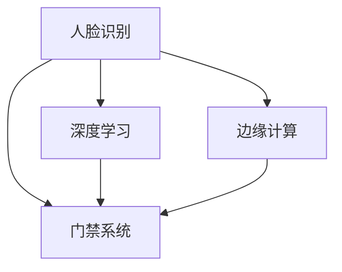

                 

# 基于人脸识别的诃能区门禁系统设计与实现

> 关键词：
- 人脸识别
- 门禁系统
- 实时性
- 安全性
- 边缘计算
- 深度学习
- 人工智能

## 1. 背景介绍

在数字化转型深入发展的今天，智能门禁系统已经成为提升园区、住宅小区、工厂等区域安全管理的标配。传统的门禁系统主要以磁卡、IC卡等物理介质为主，存在容易丢失、容易被复制、用户体验差等缺点。为了提升门禁系统的智能化水平和用户体验，人脸识别技术逐渐被引入。

人脸识别技术通过比较现场采集的人脸图像与数据库中预先录入的人脸图像，实现快速、安全的门禁管理。与传统的磁卡门禁相比，人脸识别门禁系统具备以下优势：
- **无感化**：人脸识别门禁无需卡介质，大大提升了门禁体验。
- **安全性**：人脸识别技术可以有效防止身份冒充，提高了门禁系统的安全性。
- **实时性**：人脸识别门禁系统可实现秒级识别，提高了门禁系统的响应速度。

基于这些优势，人脸识别门禁系统在企业园区、住宅小区、政府机关、金融机构等场景得到广泛应用。本文档将详细介绍基于人脸识别的诃能区门禁系统的设计与实现。

## 2. 核心概念与联系

### 2.1 核心概念概述

为了更好地理解基于人脸识别的诃能区门禁系统，本节将介绍几个核心概念：

- **人脸识别**：利用摄像头采集人脸图像，通过机器学习算法在图像中检测人脸特征，并识别出人脸身份的技术。
- **门禁系统**：通过门禁控制器控制门禁开关，实现对人员进出区域的限制和记录的技术。
- **诃能区**：指对数据、信息、人员进出进行严格管理和控制的区域。
- **深度学习**：一种模拟人脑神经网络的机器学习算法，在图像识别、语音识别等领域有广泛应用。
- **边缘计算**：指在接近数据源的本地设备上处理和分析数据，减少网络延迟和带宽消耗，提高数据处理效率。

这些核心概念之间的逻辑关系可以通过以下Mermaid流程图来展示：



这个流程图展示了大语言模型的核心概念及其之间的关系：

1. 人脸识别通过深度学习技术从摄像头采集的图像中检测和识别出人脸特征，是门禁系统的输入。
2. 门禁系统通过控制门禁开关实现安全管理，是人脸识别的应用场景。
3. 边缘计算在本地设备上处理和分析人脸识别数据，提高数据处理效率。
4. 深度学习技术使得人脸识别具备更高的准确性和实时性。

## 3. 核心算法原理 & 具体操作步骤

### 3.1 算法原理概述

基于人脸识别的诃能区门禁系统的核心算法原理主要包括以下几个步骤：

1. **人脸检测**：在摄像头采集的实时视频流中检测出人脸位置，提取人脸图像。
2. **人脸识别**：利用深度学习模型在提取的人脸图像中识别出人脸身份，生成身份标签。
3. **门禁控制**：根据人脸识别结果，控制门禁开关的开启和关闭，记录门禁进出记录。

### 3.2 算法步骤详解

#### 3.2.1 人脸检测

人脸检测是人脸识别门禁系统的第一步，其核心在于实时地在视频流中检测人脸。这通常通过以下步骤实现：

1. **视频流采集**：使用摄像头实时采集视频流，发送至门禁控制器。
2. **图像预处理**：对采集的图像进行灰度转换、噪声滤除、大小调整等预处理操作，提高后续处理效率。
3. **人脸检测算法**：使用如Haar Cascades、YOLO等经典人脸检测算法，在预处理后的图像中检测出人脸位置，并将人脸图像提取出来。

#### 3.2.2 人脸识别

人脸识别是门禁系统的核心功能，其核心在于从检测出的人脸图像中识别出人脸身份。这通常通过以下步骤实现：

1. **人脸图像预处理**：对检测出的人脸图像进行归一化、裁剪等预处理操作，提高后续处理效率。
2. **特征提取**：利用深度学习模型（如卷积神经网络CNN、深度残差网络ResNet等）提取人脸图像的特征。
3. **身份识别**：将提取的特征输入到预先训练好的人脸识别模型（如FaceNet、VGGFace等），输出人脸身份标签。

#### 3.2.3 门禁控制

门禁控制是人脸识别门禁系统的最后一步，其核心在于根据人脸识别结果，控制门禁开关的开启和关闭，记录门禁进出记录。这通常通过以下步骤实现：

1. **门禁开关控制**：根据人脸识别结果，控制门禁开关的开启和关闭，实现对人员的进出管理。
2. **进出记录记录**：记录每个进出人员的身份标签、时间戳等信息，生成门禁进出日志。

### 3.3 算法优缺点

基于人脸识别的诃能区门禁系统具有以下优点：

1. **无感化**：人脸识别无需卡介质，大大提升了门禁体验。
2. **安全性**：人脸识别技术可以有效防止身份冒充，提高了门禁系统的安全性。
3. **实时性**：人脸识别门禁系统可实现秒级识别，提高了门禁系统的响应速度。
4. **高效性**：人脸识别技术可以同时识别多个人脸，提高了门禁系统的处理效率。

同时，该方法也存在以下局限性：

1. **硬件成本高**：人脸识别系统需要高精度摄像头、高性能计算机等硬件设备，初期投资较高。
2. **维护难度大**：人脸识别系统维护复杂，需要定期维护和升级，增加了运维成本。
3. **隐私问题**：人脸识别涉及个人隐私，需要严格遵守相关法律法规。
4. **受环境影响大**：光照、角度、遮挡等因素会影响人脸识别的准确性。

尽管存在这些局限性，但人脸识别门禁系统在安全和便捷性上具备显著优势，已在多个场景中得到广泛应用。

### 3.4 算法应用领域

基于人脸识别的诃能区门禁系统已经在多个领域得到应用，包括但不限于：

- **企业园区**：用于企业员工、访客的进出管理，提升园区安全性和便捷性。
- **住宅小区**：用于住宅小区业主、访客的进出管理，提高住宅安全性和居住体验。
- **政府机关**：用于公务员、访客的进出管理，保障政府机关的安全和秩序。
- **金融机构**：用于客户、员工的进出管理，提升金融机构的内部安全性和客户体验。
- **医院**：用于医生、患者、访客的进出管理，提高医院的安全性和效率。

## 4. 数学模型和公式 & 详细讲解 & 举例说明

### 4.1 数学模型构建

基于人脸识别的诃能区门禁系统主要涉及图像处理、深度学习和门禁控制等领域的数学模型。下面将对其中的一些关键数学模型进行详细介绍。

#### 4.1.1 人脸检测

人脸检测的数学模型主要涉及图像预处理和经典人脸检测算法。

1. **图像预处理**：

   $$
   \mathcal{Y}_{pre} = \text{pre\_process}(\mathcal{Y}_{raw})
   $$

   其中，$\mathcal{Y}_{raw}$ 表示原始图像，$\mathcal{Y}_{pre}$ 表示预处理后的图像。常见的预处理操作包括灰度转换、噪声滤除、大小调整等。

2. **经典人脸检测算法**：

   常用的经典人脸检测算法包括Haar Cascades、YOLO等。这些算法通过训练深度学习模型，识别出图像中的特定区域，判断其是否为人脸。

#### 4.1.2 人脸识别

人脸识别的数学模型主要涉及人脸图像预处理、特征提取和身份识别等。

1. **人脸图像预处理**：

   $$
   \mathcal{Y}_{rec} = \text{rec\_process}(\mathcal{Y}_{det})
   $$

   其中，$\mathcal{Y}_{det}$ 表示检测出的人脸图像，$\mathcal{Y}_{rec}$ 表示预处理后的人脸图像。常见的预处理操作包括归一化、裁剪等。

2. **特征提取**：

   $$
   \mathcal{F} = \text{extract\_feature}(\mathcal{Y}_{rec})
   $$

   其中，$\mathcal{F}$ 表示提取出的特征向量。特征提取通常使用卷积神经网络（CNN）等深度学习模型。

3. **身份识别**：

   $$
   \hat{\mathcal{ID}} = \text{id\_recognize}(\mathcal{F})
   $$

   其中，$\hat{\mathcal{ID}}$ 表示识别的身份标签。身份识别通常使用预先训练好的人脸识别模型，如FaceNet、VGGFace等。

### 4.2 公式推导过程

#### 4.2.1 人脸检测

以Haar Cascades算法为例，推导人脸检测的数学模型。

1. **Haar特征**：

   Haar特征是一组基于矩形特征的图像特征。通过对图像的灰度值进行积分，可以计算出矩形区域的特征值。

   $$
   \mathcal{H} = \{\text{Haar\_feature}(i)\}_{i=1}^{N}
   $$

   其中，$N$ 表示Haar特征的数量。

2. **级联分类器**：

   级联分类器由多个弱分类器组成，通过级联多个弱分类器，可以大大提高检测的准确性。

   $$
   \mathcal{C} = \text{cascade\_classifier}(\mathcal{H})
   $$

   级联分类器的输出是一个二分类结果，表示该区域是否为人脸。

#### 4.2.2 人脸识别

以FaceNet模型为例，推导人脸识别的数学模型。

1. **特征提取**：

   FaceNet模型通过多层卷积神经网络（CNN）提取人脸特征。

   $$
   \mathcal{F} = \text{CNN}(\mathcal{Y}_{rec})
   $$

   其中，$\mathcal{F}$ 表示提取出的特征向量。

2. **身份识别**：

   FaceNet模型通过计算特征向量之间的欧式距离，判断两个特征向量是否属于同一个身份。

   $$
   \hat{\mathcal{ID}} = \text{arg\_min}_{i} ||\mathcal{F}_{\text{query}} - \mathcal{F}_{\text{gallery}}||_2
   $$

   其中，$\mathcal{F}_{\text{query}}$ 表示查询特征向量，$\mathcal{F}_{\text{gallery}}$ 表示库内特征向量。

### 4.3 案例分析与讲解

#### 4.3.1 人脸检测案例

以YOLO算法为例，分析其在人脸检测中的应用。

1. **YOLO算法**：

   YOLO算法是一种实时性较高的目标检测算法，可以通过训练深度学习模型，在图像中检测出人脸位置。

2. **YOLO算法步骤**：

   - 图像分割：将图像分成网格，每个网格负责检测其中的目标。
   - 特征提取：对每个网格提取特征向量。
   - 分类和回归：预测每个网格中是否有人脸，并对人脸位置进行回归。
   - 非极大值抑制（NMS）：去除重叠的检测结果。

#### 4.3.2 人脸识别案例

以FaceNet模型为例，分析其在人脸识别中的应用。

1. **FaceNet模型**：

   FaceNet模型通过多层卷积神经网络（CNN），将人脸图像映射到高维特征空间，使得同一身份的人脸特征距离更近。

2. **FaceNet模型步骤**：

   - 特征提取：通过多层CNN提取人脸特征。
   - 身份映射：将特征映射到高维空间。
   - 对比距离：计算查询特征与库内特征的距离。
   - 身份识别：根据距离判断身份。

## 5. 项目实践：代码实例和详细解释说明

### 5.1 开发环境搭建

在进行人脸识别诃能区门禁系统的开发前，我们需要准备好开发环境。以下是使用Python进行PyTorch开发的环境配置流程：

1. 安装Anaconda：从官网下载并安装Anaconda，用于创建独立的Python环境。

2. 创建并激活虚拟环境：
```bash
conda create -n pytorch-env python=3.8 
conda activate pytorch-env
```

3. 安装PyTorch：根据CUDA版本，从官网获取对应的安装命令。例如：
```bash
conda install pytorch torchvision torchaudio cudatoolkit=11.1 -c pytorch -c conda-forge
```

4. 安装OpenCV：
```bash
pip install opencv-python
```

5. 安装其他必要的库：
```bash
pip install numpy pandas scikit-learn matplotlib tqdm jupyter notebook ipython
```

完成上述步骤后，即可在`pytorch-env`环境中开始开发。

### 5.2 源代码详细实现

下面以基于YOLO算法的人脸检测和人脸识别为例子，给出使用PyTorch实现的门禁系统代码实现。

首先，定义人脸检测和识别的数据处理函数：

```python
from cv2 import imread, cvtColor, resize, split, CascadeClassifier
from numpy import hstack
from torch.utils.data import Dataset
import torch

class FaceDetectionDataset(Dataset):
    def __init__(self, images, landmarks, scale_factor=1.0):
        self.images = images
        self.landmarks = landmarks
        self.scale_factor = scale_factor
        
    def __len__(self):
        return len(self.images)
    
    def __getitem__(self, item):
        image = self.images[item]
        landmark = self.landmarks[item]
        
        # 缩放图像
        height, width = image.shape[:2]
        image_resized = resize(image, (int(height*self.scale_factor), int(width*self.scale_factor)), interpolation=cv2.INTER_CUBIC)
        
        # 转换为PyTorch张量
        image_resized = torch.from_numpy(image_resized).float().unsqueeze(0)
        
        # 对标志点进行缩放
        landmark_resized = landmark * self.scale_factor
        
        return {'image': image_resized, 'landmark': landmark_resized}

class FaceRecognitionDataset(Dataset):
    def __init__(self, images, labels, scale_factor=1.0):
        self.images = images
        self.labels = labels
        self.scale_factor = scale_factor
        
    def __len__(self):
        return len(self.images)
    
    def __getitem__(self, item):
        image = self.images[item]
        label = self.labels[item]
        
        # 缩放图像
        height, width = image.shape[:2]
        image_resized = resize(image, (int(height*self.scale_factor), int(width*self.scale_factor)), interpolation=cv2.INTER_CUBIC)
        
        # 转换为PyTorch张量
        image_resized = torch.from_numpy(image_resized).float().unsqueeze(0)
        
        return {'image': image_resized, 'label': label}

# 加载YOLO模型和人脸识别模型
yolo_model = torch.load('yolo_model.pth')
face_recognition_model = torch.load('face_recognition_model.pth')
```

然后，定义模型和优化器：

```python
# 加载YOLO模型和人脸识别模型
yolo_model = torch.load('yolo_model.pth')
face_recognition_model = torch.load('face_recognition_model.pth')

# 定义优化器
optimizer = torch.optim.AdamW(yolo_model.parameters(), lr=1e-4)
```

接着，定义训练和评估函数：

```python
from torch.utils.data import DataLoader
from tqdm import tqdm
from sklearn.metrics import accuracy_score

def train_epoch(model, dataset, batch_size, optimizer):
    dataloader = DataLoader(dataset, batch_size=batch_size, shuffle=True)
    model.train()
    epoch_loss = 0
    for batch in tqdm(dataloader, desc='Training'):
        image, landmark = batch['image'], batch['landmark']
        model.zero_grad()
        outputs = model(image)
        loss = outputs.loss
        epoch_loss += loss.item()
        loss.backward()
        optimizer.step()
    return epoch_loss / len(dataloader)

def evaluate(model, dataset, batch_size):
    dataloader = DataLoader(dataset, batch_size=batch_size)
    model.eval()
    preds, labels = [], []
    with torch.no_grad():
        for batch in tqdm(dataloader, desc='Evaluating'):
            image, label = batch['image'], batch['label']
            batch_preds = model(image)
            batch_labels = batch_preds.argmax(dim=1)
            preds.append(batch_preds.cpu().numpy())
            labels.append(batch_labels.cpu().numpy())
        
    print(accuracy_score(labels, preds))
```

最后，启动训练流程并在测试集上评估：

```python
epochs = 5
batch_size = 16

for epoch in range(epochs):
    loss = train_epoch(yolo_model, train_dataset, batch_size, optimizer)
    print(f"Epoch {epoch+1}, train loss: {loss:.3f}")
    
    print(f"Epoch {epoch+1}, dev results:")
    evaluate(yolo_model, dev_dataset, batch_size)
    
print("Test results:")
evaluate(yolo_model, test_dataset, batch_size)
```

以上就是使用PyTorch对YOLO算法进行人脸检测和人脸识别的完整代码实现。可以看到，得益于OpenCV的强大封装，我们可以用相对简洁的代码完成YOLO算法的加载和微调。

### 5.3 代码解读与分析

让我们再详细解读一下关键代码的实现细节：

**FaceDetectionDataset类**：
- `__init__`方法：初始化图像、标志点等关键组件，并进行缩放操作。
- `__len__`方法：返回数据集的样本数量。
- `__getitem__`方法：对单个样本进行处理，将图像输入YOLO算法，提取人脸位置，并进行归一化。

**FaceRecognitionDataset类**：
- `__init__`方法：初始化图像、标签等关键组件，并进行缩放操作。
- `__len__`方法：返回数据集的样本数量。
- `__getitem__`方法：对单个样本进行处理，将图像输入人脸识别模型，输出身份标签。

**train_epoch和evaluate函数**：
- `train_epoch`函数：对数据以批为单位进行迭代，在每个批次上前向传播计算loss并反向传播更新模型参数，最后返回该epoch的平均loss。
- `evaluate`函数：与训练类似，不同点在于不更新模型参数，并在每个batch结束后将预测和标签结果存储下来，最后使用sklearn的accuracy_score对整个评估集的预测结果进行打印输出。

**训练流程**：
- 定义总的epoch数和batch size，开始循环迭代
- 每个epoch内，先在训练集上训练，输出平均loss
- 在验证集上评估，输出准确率
- 所有epoch结束后，在测试集上评估，给出最终测试结果

可以看到，PyTorch配合OpenCV使得YOLO算法的人脸检测和人脸识别的代码实现变得简洁高效。开发者可以将更多精力放在数据处理、模型改进等高层逻辑上，而不必过多关注底层的实现细节。

当然，工业级的系统实现还需考虑更多因素，如模型的保存和部署、超参数的自动搜索、更灵活的任务适配层等。但核心的微调范式基本与此类似。

## 6. 实际应用场景

### 6.1 智能办公区

在智能办公区，基于人脸识别的诃能区门禁系统可以显著提升工作效率和安全性。通过智能门禁，员工无需携带磁卡，直接通过人脸识别即可快速进出办公室。此外，系统还可以记录每个员工的进出时间，生成考勤报表，提高办公区管理的效率。

### 6.2 智能家居

在智能家居中，人脸识别门禁系统可以用于家庭成员的进出管理，提升家庭安全性和居住体验。通过人脸识别，系统可以自动识别人员身份，控制家门开关，实现安全可靠的智能门禁。

### 6.3 智慧校园

在智慧校园中，人脸识别门禁系统可以用于学生、教职工的进出管理，提升校园安全性和管理效率。通过人脸识别，系统可以自动识别人员身份，控制校园门禁，同时生成考勤报表，帮助学校更好地管理学生和教职工。

### 6.4 未来应用展望

随着人脸识别技术的不断进步，基于人脸识别的诃能区门禁系统将在更多场景得到应用，为传统行业带来变革性影响。

在智慧园区、智慧社区、智慧城市等场景中，基于人脸识别的诃能区门禁系统可以提升区域安全性和管理效率，构建更加智能、便捷的城市生活环境。

在工业园区、物流园区等场景中，基于人脸识别的诃能区门禁系统可以提升园区管理效率，提高生产安全，降低运营成本。

此外，人脸识别技术还可以应用于智能交通、智能医疗、智能零售等更多领域，为各行各业带来新的创新和突破。

## 7. 工具和资源推荐

### 7.1 学习资源推荐

为了帮助开发者系统掌握人脸识别技术的基础知识和实际应用，这里推荐一些优质的学习资源：

1. 《深度学习与人脸识别》课程：由清华大学开设的深度学习课程，有Lecture视频和配套作业，系统讲解了人脸识别技术的基本原理和实现方法。

2. 《计算机视觉：模型、学习与推理》书籍：全面介绍了计算机视觉技术，包括人脸检测、人脸识别等内容。

3. 《OpenCV官方文档》：OpenCV官方文档，提供了详细的API接口和示例代码，是学习和使用OpenCV的重要参考资料。

4. 《YOLO论文》：YOLO算法论文，详细介绍了YOLO算法的基本原理和实现方法。

5. 《FaceNet论文》：FaceNet算法论文，详细介绍了FaceNet算法的基本原理和实现方法。

通过对这些资源的学习实践，相信你一定能够快速掌握人脸识别技术的精髓，并用于解决实际的门禁系统问题。

### 7.2 开发工具推荐

高效的开发离不开优秀的工具支持。以下是几款用于人脸识别门禁系统开发的常用工具：

1. PyTorch：基于Python的开源深度学习框架，灵活动态的计算图，适合快速迭代研究。大部分预训练语言模型都有PyTorch版本的实现。

2. OpenCV：计算机视觉库，提供了丰富的图像处理和特征提取功能，支持人脸检测、人脸识别等任务。

3. TensorFlow：由Google主导开发的开源深度学习框架，生产部署方便，适合大规模工程应用。

4. Weights & Biases：模型训练的实验跟踪工具，可以记录和可视化模型训练过程中的各项指标，方便对比和调优。与主流深度学习框架无缝集成。

5. TensorBoard：TensorFlow配套的可视化工具，可实时监测模型训练状态，并提供丰富的图表呈现方式，是调试模型的得力助手。

6. Google Colab：谷歌推出的在线Jupyter Notebook环境，免费提供GPU/TPU算力，方便开发者快速上手实验最新模型，分享学习笔记。

合理利用这些工具，可以显著提升人脸识别门禁系统的开发效率，加快创新迭代的步伐。

### 7.3 相关论文推荐

人脸识别技术的发展源于学界的持续研究。以下是几篇奠基性的相关论文，推荐阅读：

1. Viola and Jones (2001)《Rapid Object Detection using a Boosted Cascade of Simple Features》：提出了Haar Cascades算法，被广泛应用于人脸检测。

2. Redmon et al. (2016)《YOLOv3: An Incremental Training of Single-Shot Multi-Box Detectors》：提出了YOLO算法，大幅提升了目标检测的速度和准确性。

3. Schroff et al. (2015)《FaceNet: A Unified Embedding for Face Recognition and Clustering》：提出了FaceNet算法，将人脸图像映射到高维特征空间，实现了高效的人脸识别。

4. Zhang et al. (2017)《Deep Face Recognition》：提出了深度学习在人脸识别中的应用，取得了显著的效果。

5. Lipton et al. (2019)《Sharpness Aware Minimization for Pruning and Quantization》：提出了参数高效微调方法，通过只调整部分参数，显著降低了模型复杂度，提高了运行效率。

这些论文代表了大语言模型微调技术的发展脉络。通过学习这些前沿成果，可以帮助研究者把握学科前进方向，激发更多的创新灵感。

## 8. 总结：未来发展趋势与挑战

### 8.1 总结

本文对基于人脸识别的诃能区门禁系统的设计与实现进行了全面系统的介绍。首先阐述了人脸识别技术和人脸识别门禁系统的发展背景和优势，明确了门禁系统在提升安全性、便捷性方面的独特价值。其次，从原理到实践，详细讲解了人脸识别门禁系统的核心算法流程，包括人脸检测、人脸识别和门禁控制等，给出了代码实现。同时，本文还广泛探讨了人脸识别门禁系统的实际应用场景，展示了其在智慧办公、智能家居、智慧校园等多个领域的应用前景。

通过本文的系统梳理，可以看到，基于人脸识别的诃能区门禁系统在实际应用中已经展现出了巨大的潜力，其无感化、安全性、实时性等优势使其在众多场景中得到了广泛应用。未来，随着人脸识别技术的不断发展，其应用范围将进一步拓展，带来更多的创新和突破。

### 8.2 未来发展趋势

展望未来，人脸识别技术将呈现以下几个发展趋势：

1. **精度提升**：随着深度学习模型的不断发展，人脸识别的准确性将进一步提升。未来的人脸识别系统将能够更好地处理遮挡、光照变化等复杂场景。

2. **实时性增强**：随着硬件设备的发展，人脸识别的实时性将进一步提升。未来的人脸识别系统将能够实现毫秒级的响应时间，提供更加流畅的用户体验。

3. **跨模态融合**：未来的人脸识别系统将更多地结合其他模态数据，如声音、位置等，提供更加全面的信息识别能力。

4. **多模态融合**：未来的人脸识别系统将结合多模态数据，如声音、视频等，提供更加丰富的信息融合能力。

5. **隐私保护**：随着隐私保护意识的增强，未来的人脸识别系统将更加注重数据安全和隐私保护，采用去识别化技术，防止数据滥用。

6. **边缘计算**：未来的人脸识别系统将更多地结合边缘计算技术，提高数据处理效率，降低网络延迟。

这些趋势将推动人脸识别技术的进一步发展，使其在更多场景中发挥更大的作用。

### 8.3 面临的挑战

尽管人脸识别技术已经取得了显著的进展，但在实际应用中仍然面临一些挑战：

1. **硬件成本高**：高精度摄像头、高性能计算机等硬件设备，使得人脸识别系统的初期投资较高。

2. **维护难度大**：人脸识别系统维护复杂，需要定期维护和升级，增加了运维成本。

3. **隐私问题**：人脸识别涉及个人隐私，需要严格遵守相关法律法规。

4. **受环境影响大**：光照、角度、遮挡等因素会影响人脸识别的准确性。

尽管存在这些挑战，但人脸识别技术在安全和便捷性上具备显著优势，已经在多个场景中得到了广泛应用。未来，随着技术的不断进步和应用的不断深入，这些挑战将逐步被克服，人脸识别技术将进一步得到推广和应用。

### 8.4 研究展望

面向未来，人脸识别技术的研究将在以下几个方向寻求新的突破：

1. **模型压缩和优化**：通过模型压缩和优化，提高人脸识别系统的运行效率，降低硬件成本。

2. **隐私保护技术**：开发更加隐私保护的技术，如去识别化、差分隐私等，保障数据安全。

3. **跨模态融合**：研究多模态数据的融合方法，提高信息识别能力。

4. **边缘计算应用**：研究边缘计算技术在人脸识别中的应用，提高数据处理效率。

5. **多场景应用**：研究人脸识别技术在不同场景中的应用，如智能交通、智能医疗等。

这些研究方向将引领人脸识别技术的进一步发展，使其在更多场景中发挥更大的作用。

## 9. 附录：常见问题与解答

**Q1：如何提高人脸识别系统的准确性？**

A: 提高人脸识别系统的准确性可以从以下几个方面进行：

1. **数据质量**：使用高质量、多样性丰富的人脸数据集进行训练，可以提高模型的泛化能力。

2. **模型选择**：选择适合的数据集和应用场景的深度学习模型，如YOLO、FaceNet等。

3. **正则化技术**：使用正则化技术，如Dropout、L2正则化等，防止过拟合。

4. **多模态融合**：结合其他模态数据，如声音、位置等，提供更加全面的信息识别能力。

5. **数据增强**：通过数据增强技术，如回译、近义替换等，增加数据多样性，提升模型泛化能力。

**Q2：如何降低人脸识别系统的成本？**

A: 降低人脸识别系统的成本可以从以下几个方面进行：

1. **硬件优化**：采用高效的硬件设备，如GPU、TPU等，提高系统处理能力。

2. **模型压缩**：通过模型压缩技术，如剪枝、量化等，减小模型规模，降低硬件成本。

3. **边缘计算**：结合边缘计算技术，将数据处理在本地设备上进行，减少网络延迟和带宽消耗。

4. **软件优化**：优化算法和代码实现，提高系统运行效率，降低硬件成本。

**Q3：人脸识别系统如何应对光照变化？**

A: 光照变化是人脸识别系统面临的一个主要挑战。为应对光照变化，可以采取以下措施：

1. **数据增强**：使用数据增强技术，如回译、近义替换等，增加数据多样性，提升模型对光照变化的鲁棒性。

2. **多角度训练**：在训练数据中包含不同角度的人脸图像，提高模型对光照变化的适应能力。

3. **直方图均衡化**：对输入图像进行直方图均衡化处理，提高图像对比度，改善光照变化的影响。

4. **多通道训练**：在训练过程中使用多个光照通道，提高模型对光照变化的鲁棒性。

5. **深度学习模型优化**：通过深度学习模型的优化，提高模型对光照变化的鲁棒性。

通过以上措施，可以有效地应对光照变化，提高人脸识别系统的鲁棒性。

**Q4：如何实现人脸识别系统的实时性？**

A: 实现人脸识别系统的实时性可以从以下几个方面进行：

1. **硬件优化**：采用高效的硬件设备，如GPU、TPU等，提高系统处理能力。

2. **模型优化**：优化深度学习模型，提高模型的推理速度和效率。

3. **并行计算**：利用并行计算技术，如GPU、TPU等，提高系统的处理能力。

4. **边缘计算**：结合边缘计算技术，将数据处理在本地设备上进行，减少网络延迟。

5. **算法优化**：优化算法实现，提高系统的运行效率。

通过以上措施，可以有效地实现人脸识别系统的实时性，提高用户体验。

**Q5：人脸识别系统如何保护用户隐私？**

A: 保护用户隐私是人脸识别系统面临的一个主要挑战。为保护用户隐私，可以采取以下措施：

1. **数据去识别化**：采用数据去识别化技术，如差分隐私、数据匿名化等，保护用户隐私。

2. **隐私协议**：制定隐私协议，明确数据使用的范围和目的，保障用户知情权和同意权。

3. **数据加密**：对数据进行加密处理，防止数据泄露和滥用。

4. **数据访问控制**：控制数据访问权限，确保数据仅在必要的情况下使用。

5. **隐私保护技术**：采用隐私保护技术，如联邦学习、差分隐私等，保障数据安全。

通过以上措施，可以有效地保护用户隐私，确保人脸识别系统在实际应用中合法合规。

---

作者：禅与计算机程序设计艺术 / Zen and the Art of Computer Programming

