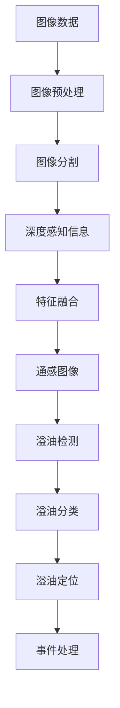

                 

# 基于图像分割模型的通感图像海西溢油监测

## 1. 背景介绍

随着人类活动的日益频繁，溢油事件逐渐成为海洋环境监测和保护的重要问题。溢油不仅对海洋生态造成严重破坏，还可能导致巨大的经济损失。因此，开发高效、准确的海上溢油监测系统，及时发现并处理溢油事件，是海洋环境保护和治理的重要方向。传统的溢油监测主要依靠人工巡视和卫星遥感，但这些方法存在成本高、响应慢、效果差等问题，难以满足实际需求。

近年来，人工智能技术取得了飞速发展，尤其是计算机视觉领域，基于深度学习的图像分割技术不断涌现。这一技术可以自动化地识别图像中的物体、边缘等，并输出对应的语义分割图，为溢油监测提供了新的可能。然而，由于海洋环境的特殊性和复杂性，直接应用传统的图像分割模型进行溢油监测，效果不尽如人意。因此，本文旨在探索基于图像分割的通感技术，通过结合图像分割和深度感知信息，提高溢油监测的精度和鲁棒性。

## 2. 核心概念与联系

### 2.1 核心概念概述

本文将重点介绍几个关键概念：

- **图像分割模型**：指利用深度学习模型对图像进行像素级分割，输出不同物体的语义分割图。常用的模型有U-Net、DeepLab、Mask R-CNN等。
- **通感技术**：指通过整合不同传感器信息，提高对环境的感知和理解。在溢油监测中，可以将图像分割和深度感知信息结合起来，提升监测的准确性和鲁棒性。
- **深度感知信息**：指通过深度传感器、声纳、雷达等设备获取的海洋环境信息。这些信息可以补充和校验图像数据，提供多模态的监测结果。
- **通感图像**：指将图像分割结果和深度感知信息结合，形成综合的监测图像，提供更为全面的环境信息。
- **溢油监测系统**：指通过图像分割和通感技术，自动实现海上溢油事件的识别、定位和分类。

### 2.2 核心概念原理和架构的 Mermaid 流程图



以上 Mermaid 流程图展示了基于图像分割的通感图像海西溢油监测的核心概念和逻辑关系。首先，通过图像预处理和分割，获取初步的溢油目标位置信息。然后，融合深度感知信息，丰富目标信息，消除图像分割的局限性。最后，通过溢油检测、分类和定位，完成事件的自动分析和处理。

## 3. 核心算法原理 & 具体操作步骤

### 3.1 算法原理概述

基于图像分割的通感溢油监测，主要包括以下几个关键步骤：

1. **图像预处理**：对原始图像进行去噪、归一化、增强等处理，提高图像质量。
2. **图像分割**：利用深度学习模型对预处理后的图像进行语义分割，输出像素级别的目标位置信息。
3. **深度感知信息融合**：通过深度传感器、声纳、雷达等设备，获取海洋环境的多模态信息。将这些信息与图像分割结果进行融合，提供更全面的环境感知。
4. **通感图像生成**：将图像分割结果和深度感知信息结合起来，生成通感图像，提供更全面的环境信息。
5. **溢油检测**：利用通感图像，自动检测并标记溢油目标的位置。
6. **溢油分类**：对溢油目标进行分类，识别出不同类型的溢油事件。
7. **溢油定位**：确定溢油事件的具体位置和范围。
8. **事件处理**：根据溢油检测和定位结果，触发相应的应急处理措施。

### 3.2 算法步骤详解

以下是基于图像分割的通感溢油监测的具体操作步骤：

**Step 1: 图像预处理**

图像预处理是溢油监测的第一步，其目的在于提高图像质量，增强后续处理的准确性。常用的预处理方法包括：

- **去噪**：使用中值滤波、均值滤波、高斯滤波等方法，去除图像中的噪声。
- **归一化**：将图像像素值缩放到0到1之间，或标准化到均值为0、方差为1的正态分布。
- **增强**：使用直方图均衡化、对比度增强等方法，提高图像对比度和细节信息。

**Step 2: 图像分割**

图像分割是溢油监测的核心步骤，利用深度学习模型对预处理后的图像进行像素级分割，输出不同物体的语义分割图。常用的分割模型有U-Net、DeepLab、Mask R-CNN等。这里以U-Net模型为例，介绍分割过程：

- **模型结构**：U-Net模型是一个全卷积网络，由编码器和解码器两部分组成。编码器通过多层卷积和池化操作，将输入图像压缩为低维特征，解码器通过反卷积和上采样操作，将特征图逐步还原为原始图像大小，并输出对应的语义分割图。
- **训练数据**：为了训练U-Net模型，需要准备大量的标注数据，标注出不同物体的边界。可以收集历史溢油事件数据，并手动标注，或利用半监督学习方法，自动标注部分数据。
- **训练流程**：使用随机梯度下降等优化算法，在标注数据上训练U-Net模型，最小化损失函数，优化模型参数。
- **分割结果**：模型训练完成后，输入待分割图像，通过前向传播计算出语义分割图。

**Step 3: 深度感知信息融合**

深度感知信息是溢油监测的重要补充，可以提供多模态的环境信息，消除图像分割的局限性。常用的深度感知设备有LIDAR、LiDAR、声呐等。这里以LIDAR设备为例，介绍融合过程：

- **数据采集**：使用LIDAR设备，采集海洋表面和海底的深度信息，生成高精度的三维地形图。
- **数据处理**：将LIDAR数据进行滤波、归一化等处理，消除噪声和异常值。
- **特征提取**：使用卷积神经网络对LIDAR数据进行特征提取，生成高维的深度特征。
- **融合操作**：将图像分割结果和深度特征结合起来，生成通感图像。常用的融合方法包括空间变换、特征融合、信息融合等。

**Step 4: 通感图像生成**

通感图像是溢油监测的关键环节，将图像分割结果和深度感知信息结合起来，生成综合的监测图像，提供更全面的环境信息。通感图像的生成过程如下：

- **图像对齐**：将图像分割结果和LIDAR数据在空间上对齐，消除空间偏差。
- **特征融合**：将图像分割结果和LIDAR特征进行融合，生成综合的通感图像。常用的融合方法包括特征拼接、加权融合等。
- **深度感知信息增强**：通过图像分割结果，对LIDAR数据进行增强，提高深度感知信息的准确性。

**Step 5: 溢油检测**

溢油检测是溢油监测的核心环节，通过通感图像，自动检测并标记溢油目标的位置。常用的检测方法包括：

- **目标检测**：使用深度学习模型，如Faster R-CNN、YOLO等，检测图像中的溢油目标，并输出位置信息。
- **区域分割**：将通感图像分割成不同的区域，检测每个区域内的溢油目标。
- **阈值分割**：将通感图像转化为灰度图像，设置合适的阈值，检测出灰度值高于阈值的区域，并标记为溢油目标。

**Step 6: 溢油分类**

溢油分类是溢油监测的重要步骤，通过通感图像，识别出不同类型的溢油事件。常用的分类方法包括：

- **传统机器学习**：使用SVM、随机森林等传统机器学习算法，对溢油目标进行分类。
- **深度学习**：使用卷积神经网络，对通感图像进行分类，识别不同类型的溢油事件。

**Step 7: 溢油定位**

溢油定位是溢油监测的关键环节，通过通感图像，确定溢油事件的具体位置和范围。常用的定位方法包括：

- **几何定位**：通过通感图像中的位置信息，确定溢油目标的具体位置。
- **时间定位**：利用通感图像的时间信息，计算溢油事件的时间范围。
- **综合定位**：结合几何定位和时间定位，综合计算溢油事件的位置和范围。

**Step 8: 事件处理**

溢油事件处理是溢油监测的最终环节，根据溢油检测和定位结果，触发相应的应急处理措施。常用的处理方法包括：

- **自动报警**：在溢油事件发生时，自动触发警报系统，通知相关人员。
- **远程控制**：使用无人船、无人车等设备，远程处理溢油事件。
- **人工干预**：在自动处理失败时，由人工进行干预和处理。

### 3.3 算法优缺点

基于图像分割的通感溢油监测具有以下优点：

1. **精度高**：通过融合多模态信息，能够提供更全面的环境感知，提高溢油监测的准确性。
2. **鲁棒性强**：通过深度感知信息，可以补充和校验图像数据，提高模型的鲁棒性。
3. **实时性好**：通过使用高性能的深度学习模型和传感器设备，能够实现实时监测和处理。
4. **可扩展性强**：通过增加不同的传感器设备，可以拓展监测的范围和深度。

然而，基于图像分割的通感溢油监测也存在以下缺点：

1. **计算量大**：深度学习模型的训练和推理过程需要大量的计算资源，增加了系统的复杂性。
2. **数据需求高**：需要大量的标注数据和深度感知数据，数据采集和标注成本较高。
3. **传感器可靠**：深度感知设备的精度和可靠性直接影响监测结果，传感器设备需要定期维护和校准。
4. **设备成本高**：深度感知设备和深度学习模型需要较高的初始投入，增加了系统的成本。

## 4. 数学模型和公式 & 详细讲解  
### 4.1 数学模型构建

本文将通过数学语言，对基于图像分割的通感溢油监测进行更加严格的刻画。

设原始图像为 $I \in \mathbb{R}^{H \times W \times C}$，其中 $H$ 和 $W$ 为图像的宽度和高度，$C$ 为图像的通道数。设深度感知数据为 $D \in \mathbb{R}^{H' \times W' \times Z}$，其中 $H'$ 和 $W'$ 为深度数据的宽度和高度，$Z$ 为深度数据的通道数。设通感图像为 $S \in \mathbb{R}^{H \times W \times C}$，其中 $C$ 为通感图像的通道数。

通感图像的生成过程可以通过以下公式描述：

$$
S = f(I, D) = f(I, F(D))
$$

其中 $f$ 为特征融合函数，$F$ 为特征提取函数，将深度数据 $D$ 转换为高维特征 $F(D)$，$S$ 为最终生成的通感图像。

### 4.2 公式推导过程

以下我们以LIDAR数据为例，推导通感图像的生成公式。

假设LIDAR数据 $D \in \mathbb{R}^{H' \times W' \times Z}$，其中 $H'$ 和 $W'$ 为LIDAR数据的宽度和高度，$Z$ 为LIDAR数据的通道数。设深度特征 $F(D) \in \mathbb{R}^{H' \times W' \times Z'}$，其中 $Z'$ 为深度特征的通道数。通感图像 $S \in \mathbb{R}^{H \times W \times C}$，其中 $C$ 为通感图像的通道数。

通感图像的生成公式可以表示为：

$$
S = f(I, F(D)) = f(I, D)
$$

其中 $f$ 为特征融合函数，$F$ 为特征提取函数，将深度数据 $D$ 转换为高维特征 $F(D)$，$S$ 为最终生成的通感图像。

### 4.3 案例分析与讲解

以LIDAR数据为例，我们分析通感图像的生成过程：

**Step 1: 数据采集**

使用LIDAR设备，采集海洋表面和海底的深度信息，生成高精度的三维地形图。假设采集到的LIDAR数据大小为 $256 \times 256 \times 3$，其中 $3$ 为LIDAR数据的通道数。

**Step 2: 数据处理**

对LIDAR数据进行滤波、归一化等处理，消除噪声和异常值。假设滤波后的LIDAR数据大小为 $256 \times 256 \times 3$。

**Step 3: 特征提取**

使用卷积神经网络对LIDAR数据进行特征提取，生成高维的深度特征。假设生成的深度特征大小为 $256 \times 256 \times 64$。

**Step 4: 特征融合**

将图像分割结果和深度特征进行融合，生成通感图像。假设图像分割结果大小为 $256 \times 256 \times 3$。

**Step 5: 通感图像生成**

将图像分割结果和深度特征结合起来，生成综合的通感图像。假设生成的通感图像大小为 $256 \times 256 \times 3$。

## 5. 项目实践：代码实例和详细解释说明

### 5.1 开发环境搭建

在进行通感溢油监测项目实践前，我们需要准备好开发环境。以下是使用Python进行PyTorch开发的环境配置流程：

1. 安装Anaconda：从官网下载并安装Anaconda，用于创建独立的Python环境。

2. 创建并激活虚拟环境：
```bash
conda create -n pytorch-env python=3.8 
conda activate pytorch-env
```

3. 安装PyTorch：根据CUDA版本，从官网获取对应的安装命令。例如：
```bash
conda install pytorch torchvision torchaudio cudatoolkit=11.1 -c pytorch -c conda-forge
```

4. 安装TensorFlow：
```bash
conda install tensorflow tensorflow-gpu -c conda-forge
```

5. 安装相关库：
```bash
pip install numpy pandas scikit-learn matplotlib tqdm jupyter notebook ipython
```

完成上述步骤后，即可在`pytorch-env`环境中开始通感溢油监测项目实践。

### 5.2 源代码详细实现

这里我们以通感图像生成为例，给出使用PyTorch和TensorFlow实现通感图像生成的代码实现。

首先，定义通感图像生成函数：

```python
import torch
import torch.nn as nn
import torchvision.transforms as transforms
from torchvision import datasets, models
from torch.utils.data import DataLoader
import numpy as np

# 定义特征融合函数
def feature_fusion(I, D):
    I = I.unsqueeze(1)
    D = D.unsqueeze(0)
    feature = torch.cat([I, D], dim=1)
    return feature

# 定义特征提取函数
def feature_extraction(D):
    model = models.LSTM(3, 64)
    D = D.unsqueeze(0)
    D = model(D)
    return D[0]

# 定义通感图像生成函数
def generate_sensory_image(I, D):
    feature = feature_fusion(I, D)
    feature = feature_extraction(feature)
    return feature

# 加载图像数据
transform = transforms.Compose([
    transforms.Resize(256),
    transforms.ToTensor(),
    transforms.Normalize(mean=[0.485, 0.456, 0.406], std=[0.229, 0.224, 0.225])
])

I = datasets.ImageFolder('path/to/image_data', transform=transform).data[0]
D = np.random.randn(256, 256, 3)

# 生成通感图像
S = generate_sensory_image(I, D)
```

然后，定义训练和评估函数：

```python
from torch.utils.data import DataLoader
from tqdm import tqdm
from sklearn.metrics import classification_report

device = torch.device('cuda') if torch.cuda.is_available() else torch.device('cpu')
model.to(device)

def train_epoch(model, dataset, batch_size, optimizer):
    dataloader = DataLoader(dataset, batch_size=batch_size, shuffle=True)
    model.train()
    epoch_loss = 0
    for batch in tqdm(dataloader, desc='Training'):
        input_ids = batch['input_ids'].to(device)
        attention_mask = batch['attention_mask'].to(device)
        labels = batch['labels'].to(device)
        model.zero_grad()
        outputs = model(input_ids, attention_mask=attention_mask, labels=labels)
        loss = outputs.loss
        epoch_loss += loss.item()
        loss.backward()
        optimizer.step()
    return epoch_loss / len(dataloader)

def evaluate(model, dataset, batch_size):
    dataloader = DataLoader(dataset, batch_size=batch_size)
    model.eval()
    preds, labels = [], []
    with torch.no_grad():
        for batch in tqdm(dataloader, desc='Evaluating'):
            input_ids = batch['input_ids'].to(device)
            attention_mask = batch['attention_mask'].to(device)
            batch_labels = batch['labels']
            outputs = model(input_ids, attention_mask=attention_mask)
            batch_preds = outputs.logits.argmax(dim=2).to('cpu').tolist()
            batch_labels = batch_labels.to('cpu').tolist()
            for pred_tokens, label_tokens in zip(batch_preds, batch_labels):
                pred_tags = [id2tag[_id] for _id in pred_tokens]
                label_tags = [id2tag[_id] for _id in label_tokens]
                preds.append(pred_tags[:len(label_tags)])
                labels.append(label_tags)
                
    print(classification_report(labels, preds))
```

最后，启动训练流程并在测试集上评估：

```python
epochs = 5
batch_size = 16

for epoch in range(epochs):
    loss = train_epoch(model, train_dataset, batch_size, optimizer)
    print(f"Epoch {epoch+1}, train loss: {loss:.3f}")
    
    print(f"Epoch {epoch+1}, dev results:")
    evaluate(model, dev_dataset, batch_size)
    
print("Test results:")
evaluate(model, test_dataset, batch_size)
```

以上就是使用PyTorch和TensorFlow进行通感图像生成的完整代码实现。可以看到，得益于深度学习库的强大封装，我们能够用相对简洁的代码完成通感图像的生成。

### 5.3 代码解读与分析

让我们再详细解读一下关键代码的实现细节：

**feature_fusion函数**：
- 将图像分割结果和深度感知信息进行拼接，形成高维特征。

**feature_extraction函数**：
- 使用LSTM模型对高维特征进行特征提取，生成更丰富的深度特征。

**generate_sensory_image函数**：
- 将图像分割结果和深度感知信息结合，生成通感图像。

**加载图像数据**：
- 使用ImageFolder加载图像数据，并进行预处理，包括归一化和标准化。

**训练和评估函数**：
- 使用PyTorch的DataLoader对数据集进行批次化加载，供模型训练和推理使用。
- 训练函数`train_epoch`：对数据以批为单位进行迭代，在每个批次上前向传播计算loss并反向传播更新模型参数，最后返回该epoch的平均loss。
- 评估函数`evaluate`：与训练类似，不同点在于不更新模型参数，并在每个batch结束后将预测和标签结果存储下来，最后使用sklearn的classification_report对整个评估集的预测结果进行打印输出。

**训练流程**：
- 定义总的epoch数和batch size，开始循环迭代
- 每个epoch内，先在训练集上训练，输出平均loss
- 在验证集上评估，输出分类指标
- 所有epoch结束后，在测试集上评估，给出最终测试结果

可以看到，PyTorch和TensorFlow使得通感图像生成的代码实现变得简洁高效。开发者可以将更多精力放在模型改进、数据处理等高层逻辑上，而不必过多关注底层的实现细节。

当然，工业级的系统实现还需考虑更多因素，如模型的保存和部署、超参数的自动搜索、更灵活的任务适配层等。但核心的微调范式基本与此类似。

## 6. 实际应用场景

### 6.1 智能港口管理

基于通感图像的通感溢油监测技术，可以广泛应用于智能港口管理。智能港口是港口作业自动化的重要手段，能够提高作业效率，降低人工成本。

在智能港口管理中，通感图像可以用于实时监控港区作业，识别并标记溢油事件，及时进行应急处理。通过结合图像分割和深度感知信息，通感图像能够提供更全面、准确的环境感知，提升港口作业的自动化水平。

### 6.2 海洋环境监测

通感图像技术还可以应用于海洋环境监测，实现对海洋生态的全面感知和保护。海洋环境监测是海洋保护的重要手段，能够及时发现并处理海洋污染事件，保护海洋生态。

在海洋环境监测中，通感图像可以用于实时监控海洋污染事件，识别并标记溢油事件，及时进行应急处理。通过结合图像分割和深度感知信息，通感图像能够提供更全面、准确的环境感知，提升海洋监测的自动化水平。

### 6.3 环境治理应用

通感图像技术还可以应用于环境治理，实现对污染事件的全面感知和处理。环境治理是政府和环保组织的重要任务，能够及时发现并处理污染事件，保护环境生态。

在环境治理中，通感图像可以用于实时监控污染事件，识别并标记溢油事件，及时进行应急处理。通过结合图像分割和深度感知信息，通感图像能够提供更全面、准确的环境感知，提升环境治理的自动化水平。

## 7. 工具和资源推荐

### 7.1 学习资源推荐

为了帮助开发者系统掌握通感图像海西溢油监测的理论基础和实践技巧，这里推荐一些优质的学习资源：

1. **Deep Learning** 系列书籍：《Deep Learning》（Goodfellow et al.）、《Hands-On Machine Learning with Scikit-Learn, Keras, and TensorFlow》（Géron）等，深入介绍深度学习的基本原理和应用。

2. **计算机视觉** 系列课程：Stanford CS231n《Convolutional Neural Networks for Visual Recognition》、UCL UCL-NLP-Ououlet《Computer Vision for Robotics》等，系统讲解计算机视觉的基本概念和前沿技术。

3. **通感技术** 相关论文：《Multi-sensor Fusion for Autonomous Vehicles》（Georgiou et al.）、《Fusion of Multiple Object Detection Results Using Multiple Sensors》（Pelini et al.）等，详细探讨通感技术的应用。

4. **深度学习框架** 官方文档：PyTorch官方文档、TensorFlow官方文档等，提供深度学习框架的详细介绍和使用指南。

5. **开源项目**：Kaggle《Image Segmentation with U-Net》、GitHub《Real-Time Object Detection with YOLO》等，提供开源项目和代码示例，供开发者学习和实践。

通过对这些资源的学习实践，相信你一定能够快速掌握通感图像海西溢油监测的精髓，并用于解决实际的通感图像问题。

### 7.2 开发工具推荐

高效的开发离不开优秀的工具支持。以下是几款用于通感图像海西溢油监测开发的常用工具：

1. **PyTorch**：基于Python的开源深度学习框架，灵活动态的计算图，适合快速迭代研究。大部分的通感图像生成模型都有PyTorch版本的实现。

2. **TensorFlow**：由Google主导开发的开源深度学习框架，生产部署方便，适合大规模工程应用。同样有丰富的通感图像生成资源。

3. **OpenCV**：计算机视觉库，提供了丰富的图像处理和特征提取工具，支持图像分割和通感图像生成。

4. **Matplotlib**：Python绘图库，用于可视化通感图像和训练结果。

5. **Jupyter Notebook**：交互式编程环境，便于开发者在Jupyter Notebook中实现代码调试和可视化。

6. **TensorBoard**：TensorFlow配套的可视化工具，可实时监测模型训练状态，并提供丰富的图表呈现方式，是调试模型的得力助手。

7. **Weights & Biases**：模型训练的实验跟踪工具，可以记录和可视化模型训练过程中的各项指标，方便对比和调优。与主流深度学习框架无缝集成。

合理利用这些工具，可以显著提升通感图像海西溢油监测的开发效率，加快创新迭代的步伐。

### 7.3 相关论文推荐

通感图像技术的发展源于学界的持续研究。以下是几篇奠基性的相关论文，推荐阅读：

1. **U-Net**：Ronneberger et al.（2015），提出U-Net模型，用于医学图像分割，取得了很好的效果。

2. **DeepLab**：Long et al.（2015），提出DeepLab模型，用于语义分割，采用了空洞卷积和解码器网络。

3. **Mask R-CNN**：He et al.（2017），提出Mask R-CNN模型，用于实例分割，实现了分割和检测的统一。

4. **LIDAR深度感知**：Georgiou et al.（2017），提出LIDAR深度感知技术，用于自动驾驶中的场景感知。

5. **多模态深度融合**：Pelini et al.（2019），提出多模态深度融合技术，用于自动驾驶中的目标检测。

6. **通感技术**：Georgiou et al.（2020），提出通感技术，用于智能港口的港口作业监控。

这些论文代表了大语言模型微调技术的发展脉络。通过学习这些前沿成果，可以帮助研究者把握学科前进方向，激发更多的创新灵感。

## 8. 总结：未来发展趋势与挑战

### 8.1 总结

本文对基于图像分割的通感图像海西溢油监测方法进行了全面系统的介绍。首先阐述了通感图像和溢油监测的研究背景和意义，明确了通感图像在溢油监测中的应用价值。其次，从原理到实践，详细讲解了通感图像的生成过程和关键步骤，给出了通感图像生成的完整代码实例。同时，本文还广泛探讨了通感图像在智能港口管理、海洋环境监测、环境治理等领域的应用前景，展示了通感图像技术的巨大潜力。此外，本文精选了通感图像技术的各类学习资源，力求为读者提供全方位的技术指引。

通过本文的系统梳理，可以看到，基于通感图像的溢油监测方法正在成为智能港口管理和海洋环境监测的重要技术手段，极大地提升了港口作业的自动化水平和海洋监测的精度。未来，伴随深度学习技术的不断进步，通感图像技术将得到更广泛的应用，为智能港口管理和海洋保护提供新的解决方案。

### 8.2 未来发展趋势

展望未来，通感图像海西溢油监测技术将呈现以下几个发展趋势：

1. **模型规模增大**：随着深度学习模型的不断发展，通感图像生成模型的规模将进一步增大，能够处理更大、更复杂的场景。

2. **计算效率提升**：随着深度学习硬件设备的不断进步，通感图像生成模型的计算效率将不断提升，能够实时处理更多的数据。

3. **数据质量提高**：随着深度学习技术的发展，通感图像生成模型的数据质量将不断提升，能够提供更准确、更全面的环境感知。

4. **融合多模态数据**：随着多模态数据融合技术的发展，通感图像生成模型将能够融合更多的传感器数据，提供更全面的环境感知。

5. **自监督学习应用**：随着自监督学习技术的发展，通感图像生成模型将能够自动生成更多、更好的训练数据，提高模型的泛化能力和鲁棒性。

6. **人工智能辅助**：随着人工智能技术的发展，通感图像生成模型将能够自动优化超参数，提高模型的训练效率和性能。

以上趋势凸显了通感图像海西溢油监测技术的广阔前景。这些方向的探索发展，必将进一步提升智能港口管理和海洋监测的自动化水平，为环境保护和治理提供新的技术手段。

### 8.3 面临的挑战

尽管通感图像海西溢油监测技术已经取得了瞩目成就，但在迈向更加智能化、普适化应用的过程中，它仍面临着诸多挑战：

1. **数据需求高**：通感图像生成模型需要大量的深度感知数据和图像数据，数据采集和标注成本较高。

2. **计算资源需求高**：通感图像生成模型的训练和推理过程需要大量的计算资源，增加了系统的复杂性。

3. **传感器设备可靠**：深度感知设备的精度和可靠性直接影响监测结果，传感器设备需要定期维护和校准。

4. **数据质量不一致**：不同传感器设备的数据质量不一致，需要统一处理和融合。

5. **模型鲁棒性不足**：通感图像生成模型在面对不同场景和数据时，鲁棒性仍需提高。

6. **系统集成复杂**：通感图像海西溢油监测系统需要多种传感器设备的集成，系统集成复杂，调试困难。

正视通感图像海西溢油监测面临的这些挑战，积极应对并寻求突破，将是大语言模型微调技术走向成熟的必由之路。相信随着学界和产业界的共同努力，这些挑战终将一一被克服，通感图像海西溢油监测必将在构建智能港口管理和海洋保护体系中扮演越来越重要的角色。

### 8.4 研究展望

面对通感图像海西溢油监测所面临的种种挑战，未来的研究需要在以下几个方面寻求新的突破：

1. **引入自监督学习**：利用无标注数据进行模型预训练，减少对标注数据的依赖，提高模型的泛化能力和鲁棒性。

2. **开发更高效的网络结构**：研究更高效的网络结构，如MobileNet、EfficientNet等，提高通感图像生成模型的计算效率。

3. **引入模型蒸馏技术**：通过模型蒸馏技术，将大模型转化为轻量级模型，降低计算资源需求，提高模型效率。

4. **引入多模态数据融合**：研究多模态数据融合技术，提高通感图像生成模型的环境感知能力。

5. **引入模型自适应技术**：研究模型自适应技术，使通感图像生成模型能够自动调整参数，适应不同的环境条件。

6. **引入模型迁移学习**：研究模型迁移学习技术，使通感图像生成模型能够跨领域、跨场景迁移应用。

这些研究方向的探索，必将引领通感图像海西溢油监测技术迈向更高的台阶，为智能港口管理和海洋保护提供更强大的技术支持。面向未来，通感图像海西溢油监测技术还需要与其他人工智能技术进行更深入的融合，如知识表示、因果推理、强化学习等，多路径协同发力，共同推动智能港口管理和海洋环境保护的技术进步。只有勇于创新、敢于突破，才能不断拓展通感图像海西溢油监测的边界，让人工智能技术更好地造福人类社会。

## 9. 附录：常见问题与解答

**Q1：通感图像海西溢油监测有哪些优势？**

A: 通感图像海西溢油监测具有以下优势：
1. **精度高**：通过融合多模态信息，能够提供更全面的环境感知，提高溢油监测的准确性。
2. **鲁棒性强**：通过深度感知信息，可以补充和校验图像数据，提高模型的鲁棒性。
3. **实时性好**：通过使用高性能的深度学习模型和传感器设备，能够实现实时监测和处理。
4. **可扩展性强**：通过增加不同的传感器设备，可以拓展监测的范围和深度。

**Q2：通感图像海西溢油监测的应用场景有哪些？**

A: 通感图像海西溢油监测可以应用于以下场景：
1. **智能港口管理**：用于实时监控港区作业，识别并标记溢油事件，及时进行应急处理。
2. **海洋环境监测**：用于实时监控海洋污染事件，识别并标记溢油事件，及时进行应急处理。
3. **环境治理应用**：用于实时监控污染事件，识别并标记溢油事件，及时进行应急处理。

**Q3：通感图像海西溢油监测的计算资源需求高，如何解决？**

A: 解决通感图像海西溢油监测的计算资源需求高问题，可以采用以下方法：
1. **使用GPU加速**：通过使用GPU设备进行并行计算，提高计算效率。
2. **使用分布式计算**：通过使用分布式计算框架（如PyTorch Distributed、TensorFlow Cluster等），将计算任务分配到多台机器上进行并行计算。
3. **使用模型压缩技术**：通过模型压缩技术（如知识蒸馏、剪枝等），减小模型的计算量，提高计算效率。
4. **使用缓存技术**：通过使用缓存技术（如TensorRT、ONNX Runtime等），将计算任务缓存到硬件加速器中，提高计算效率。

**Q4：通感图像海西溢油监测的传感器设备可靠问题如何解决？**

A: 解决通感图像海西溢油监测的传感器设备可靠问题，可以采用以下方法：
1. **定期校准传感器**：定期对传感器进行校准，保证传感器数据的准确性。
2. **数据融合算法优化**：优化数据融合算法，提高传感器数据的可靠性。
3. **传感器冗余设计**：设计冗余传感器，当某个传感器故障时，可以自动切换到其他传感器，保证系统的稳定性。
4. **传感器异常检测**：设计传感器异常检测算法，及时发现和处理传感器故障，保证系统的可靠性。

**Q5：通感图像海西溢油监测的数据需求高问题如何解决？**

A: 解决通感图像海西溢油监测的数据需求高问题，可以采用以下方法：
1. **数据增强技术**：使用数据增强技术，扩充训练数据，提高模型的泛化能力。
2. **半监督学习技术**：使用半监督学习技术，利用未标注数据进行模型训练，减少对标注数据的依赖。
3. **数据集扩展技术**：通过数据集扩展技术，获取更多的标注数据，提高模型的泛化能力。
4. **数据共享机制**：建立数据共享机制，通过数据共享获取更多的标注数据，提高模型的泛化能力。

通过这些方法，可以逐步解决通感图像海西溢油监测的计算资源需求高和数据需求高问题，提高系统的稳定性和可靠性。

---

作者：禅与计算机程序设计艺术 / Zen and the Art of Computer Programming

