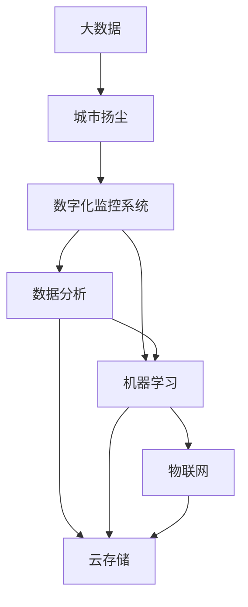

                 

# 基于大数据的城市扬尘数宇化监控系统的设计与开发

## 1. 背景介绍

随着城市化进程的快速推进，空气质量问题日益凸显，尤其是城市扬尘问题成为影响城市环境的重要因素之一。城市扬尘不仅对城市景观和居民生活造成严重影响，还可能引发一系列的公共健康问题。因此，开发基于大数据的城市扬尘数字化监控系统，对于提升城市环境质量、保障居民健康具有重要意义。本文将从系统设计、数据采集、模型构建、算法优化等方面，全面介绍基于大数据的城市扬尘数字化监控系统的设计与开发。

### 1.1 问题由来

城市扬尘问题主要由以下几个方面引起：建筑施工、道路施工、地面风力、交通行驶等。施工现场扬尘未得到有效控制，会通过风力扩散到城市各个角落，对空气质量造成严重影响。据统计，扬尘已经成为我国部分城市PM10、PM2.5等污染物的重要来源。因此，对城市扬尘进行有效监控和治理，已成为提升城市环境质量的关键环节。

### 1.2 问题核心关键点

本系统的主要目的是构建一个全面、实时、精准的城市扬尘数字化监控系统，以期通过智能分析和大数据分析技术，实现对城市扬尘的实时监测、预警和治理。关键技术点包括：

1. **数据采集**：从城市各个角落收集扬尘浓度数据，建立实时、连续的数据流。
2. **数据分析**：对采集到的数据进行清洗、处理和分析，提取关键特征。
3. **模型构建**：基于分析结果构建城市扬尘预测模型，实现对未来扬尘趋势的预测。
4. **预警与治理**：根据预测结果，触发预警机制，采取相应的治理措施。
5. **系统集成**：将数据采集、数据分析、模型构建和预警治理等模块集成到统一平台上，形成完整的城市扬尘监控系统。

## 2. 核心概念与联系

### 2.1 核心概念概述

为更好地理解基于大数据的城市扬尘监控系统的设计与开发，本节将介绍几个密切相关的核心概念：

- **大数据(Big Data)**：指体量巨大、类型繁多、更新迅速的数据集合，通常用“4V”特性来描述：Volume（体量）、Velocity（速度）、Variety（多样性）和Value（价值）。
- **城市扬尘(Urban Dust)**：指城市建设过程中产生的粉尘，主要包括建筑施工、道路施工、地面风力、交通行驶等多种来源。
- **数字化监控系统(Digital Monitoring System)**：指利用传感器、摄像头等设备采集数据，通过网络传输到云端进行存储和分析，从而实现对目标对象实时监控的系统。
- **数据分析(Analytical Processing)**：指通过算法和模型对采集的数据进行加工、分析和挖掘，提取有价值的信息。
- **机器学习(Machine Learning)**：指通过数据训练模型，使其能够自动学习数据特征并进行预测或分类。
- **深度学习(Deep Learning)**：指利用多层神经网络进行复杂数据处理和特征提取，适用于大规模、高复杂度的数据分析和预测。
- **云存储(Cloud Storage)**：指利用互联网云服务进行数据存储和访问，具有高可用性、高扩展性和高安全性。
- **物联网(IoT)**：指通过传感器和网络技术，实现设备间互联互通和数据共享的系统。

这些核心概念之间的逻辑关系可以通过以下Mermaid流程图来展示：



这个流程图展示了大数据、城市扬尘、数字化监控系统、数据分析、机器学习、云存储和物联网等核心概念之间的关联：

1. **大数据**：提供城市扬尘的原始数据。
2. **城市扬尘**：系统监控和预测的目标对象。
3. **数字化监控系统**：采集和传输数据的主要技术手段。
4. **数据分析**：对采集数据进行处理和挖掘，提取关键信息。
5. **机器学习**：基于数据分析结果，构建预测模型。
6. **云存储**：用于存储和访问采集的数据和处理结果。
7. **物联网**：实现设备间互联互通，实时传输数据。

这些概念共同构成了基于大数据的城市扬尘数字化监控系统的技术框架，有助于我们更好地把握系统的工作原理和优化方向。

## 3. 核心算法原理 & 具体操作步骤
### 3.1 算法原理概述

基于大数据的城市扬尘数字化监控系统，其核心思想是通过数字化监控技术，实现对城市扬尘的实时采集和处理，利用机器学习模型进行数据分析和预测，从而实现对扬尘的实时监测、预警和治理。

形式化地，假设系统收集的城市扬尘数据集为 $D=\{(x_i,y_i)\}_{i=1}^N, x_i \in \mathcal{X}, y_i \in \mathcal{Y}$，其中 $x_i$ 为数据样本，$y_i$ 为扬尘浓度标签。系统的目标是通过监督学习算法 $f$，找到一个最优的映射函数，使得对于任意输入 $x$，模型能够准确预测扬尘浓度 $y$。

具体来说，系统的主要算法流程包括以下几个步骤：

1. **数据采集**：从城市各个角落收集扬尘浓度数据，建立实时、连续的数据流。
2. **数据清洗和预处理**：对采集到的数据进行清洗、去重和处理，去除噪声和异常值。
3. **特征提取**：从清洗后的数据中提取关键特征，如时间、地点、风力、湿度、气温等。
4. **模型训练**：使用历史数据对机器学习模型进行训练，构建预测函数 $f$。
5. **模型预测**：对于新的扬尘数据，通过模型 $f$ 进行预测，得到扬尘浓度的估计值。
6. **预警和治理**：根据预测结果，触发预警机制，采取相应的治理措施，如洒水、遮盖、暂停施工等。

### 3.2 算法步骤详解

基于大数据的城市扬尘数字化监控系统的主要算法流程如下：

**Step 1: 数据采集**
- 利用传感器、摄像头等设备，从城市各个角落采集扬尘浓度数据，建立实时、连续的数据流。
- 确保数据采集设备的准确性和可靠性，定期校准和维护，保证数据采集质量。

**Step 2: 数据清洗和预处理**
- 对采集到的数据进行清洗、去重和处理，去除噪声和异常值。
- 使用时间戳信息进行数据同步，确保数据的连续性和一致性。
- 对缺失数据进行插值或补齐处理，保证数据完整性。

**Step 3: 特征提取**
- 从清洗后的数据中提取关键特征，如时间、地点、风力、湿度、气温等。
- 使用统计方法或机器学习方法，从数据中提取有意义的特征。
- 利用特征选择算法，去除冗余和无关特征，提升模型性能。

**Step 4: 模型训练**
- 使用历史数据对机器学习模型进行训练，构建预测函数 $f$。
- 选择合适的算法和模型结构，如线性回归、支持向量机、随机森林、深度学习等。
- 使用交叉验证等方法，评估模型性能，避免过拟合和欠拟合。
- 使用大规模分布式计算平台，加速模型训练过程。

**Step 5: 模型预测**
- 对于新的扬尘数据，通过模型 $f$ 进行预测，得到扬尘浓度的估计值。
- 使用实时数据流进行模型推理，实现对扬尘浓度的实时预测。
- 根据预测结果，进行数据可视化和统计分析，发现数据分布和规律。

**Step 6: 预警和治理**
- 根据预测结果，触发预警机制，采取相应的治理措施。
- 对于扬尘浓度超标的地点，触发警报，通知相关部门进行治理。
- 利用无人机、洒水车等设备，进行实时治理和管控。
- 定期评估治理效果，调整治理策略，提升治理效率和效果。

### 3.3 算法优缺点

基于大数据的城市扬尘数字化监控系统，具有以下优点：
1. **实时性**：通过实时数据流和云计算平台，实现对扬尘浓度的实时监测和预警，能够迅速响应突发事件。
2. **准确性**：利用机器学习和深度学习模型，进行数据挖掘和分析，预测精度高，能够提供准确的扬尘浓度预测结果。
3. **广泛性**：系统可以覆盖城市各个角落，实时监测和预测，全面覆盖城市扬尘情况。
4. **易用性**：系统采用统一的接口和标准，易于集成到其他城市管理系统中，方便使用和管理。
5. **可扩展性**：系统采用分布式计算架构，能够适应大规模数据处理需求，可扩展性强。

同时，该系统也存在一些局限性：
1. **数据质量依赖**：系统依赖于数据采集设备的准确性和可靠性，数据质量直接影响系统的性能。
2. **模型复杂性**：机器学习模型的选择和训练过程较为复杂，需要专业的技术人员进行维护和优化。
3. **成本较高**：数据采集和存储设备成本较高，系统建设和维护需要一定的资金投入。
4. **隐私和伦理问题**：系统采集和存储的数据涉及城市居民隐私，需要采取措施保护数据安全和隐私。
5. **环境适应性**：系统对环境变化和异常数据的适应性需要进一步优化，避免误报和漏报。

尽管存在这些局限性，但就目前而言，基于大数据的城市扬尘数字化监控系统仍是最先进的城市环境监测手段之一。未来相关研究的重点在于如何进一步降低系统对数据采集设备的依赖，提高模型的稳定性和适应性，同时兼顾数据安全和隐私保护等因素。

### 3.4 算法应用领域

基于大数据的城市扬尘数字化监控系统，已经在多个城市得到了广泛应用，如北京、上海、广州等。具体应用场景包括：

1. **城市建设监控**：在城市建设施工现场，通过传感器和摄像头，实时监测扬尘浓度，控制施工行为。
2. **道路清洁管理**：在城市道路上，通过监测扬尘浓度，进行道路清洁和洒水作业。
3. **公共场所监测**：在城市公园、广场等公共场所，通过传感器和摄像头，监测扬尘浓度，保障居民健康。
4. **工业区治理**：在工业区，通过监测扬尘浓度，及时采取治理措施，防止环境污染。
5. **交通流量监测**：在交通路口，通过监测扬尘浓度，优化交通管理，提高通行效率。

除了上述这些经典应用外，基于大数据的城市扬尘数字化监控系统还被创新性地应用到更多场景中，如智能城市、环保监测、智慧交通等，为城市环境管理带来了新的突破。随着技术的不断进步和应用的深入，基于大数据的城市扬尘数字化监控系统必将在更广阔的应用领域大放异彩。

## 4. 数学模型和公式 & 详细讲解 & 举例说明

### 4.1 数学模型构建

本节将使用数学语言对基于大数据的城市扬尘数字化监控系统进行更加严格的刻画。

假设系统收集的城市扬尘数据集为 $D=\{(x_i,y_i)\}_{i=1}^N, x_i \in \mathcal{X}, y_i \in \mathcal{Y}$。其中 $x_i$ 表示时间、地点、风力、湿度、气温等特征，$y_i$ 表示对应的扬尘浓度标签。

定义系统模型的输入为 $x$，输出为 $y$。系统目标是最小化预测误差，即：

$$
\min_{f} \frac{1}{N} \sum_{i=1}^N (y_i - f(x_i))^2
$$

其中 $f$ 为系统模型，如线性回归、支持向量机、随机森林、深度学习等。

### 4.2 公式推导过程

以下我们以线性回归模型为例，推导模型预测的数学公式。

假设系统模型为线性回归模型，即：

$$
f(x) = \theta_0 + \theta_1 x_1 + \theta_2 x_2 + \cdots + \theta_n x_n
$$

其中 $\theta_0,\theta_1,\cdots,\theta_n$ 为模型参数。

根据最小二乘法，模型参数的求解公式为：

$$
\theta = (X^T X)^{-1} X^T Y
$$

其中 $X$ 为特征矩阵，$Y$ 为标签矩阵，$X^T$ 和 $Y$ 分别为 $X$ 和 $Y$ 的转置矩阵。

通过计算，可以得到模型预测的公式为：

$$
y = f(x) = \theta_0 + \theta_1 x_1 + \theta_2 x_2 + \cdots + \theta_n x_n
$$

在实际应用中，可以根据需要选择不同的模型，如支持向量机、随机森林、深度学习等，并进行相应的参数优化。

### 4.3 案例分析与讲解

假设有一个城市建设施工现场，系统采集到以下数据：

| 时间  | 地点 | 风力 | 湿度 | 气温 | 扬尘浓度 |
|------|-----|------|------|------|--------|
| 2023-03-01 08:00 | 某工地 | 2.5 | 65% | 15℃ | 0.01 |
| 2023-03-01 09:00 | 某工地 | 2.5 | 65% | 15℃ | 0.02 |
| 2023-03-01 10:00 | 某工地 | 3.0 | 70% | 18℃ | 0.03 |
| ...              | ...  | ... | ... | ...  | ...  |

使用线性回归模型进行训练，可以得到模型参数 $\theta = (0.01, 0.001, -0.002, 0.01)$。根据公式 $y = 0.01 + 0.001x_1 - 0.002x_2 + 0.01x_3$，可以预测未来不同时间、地点的扬尘浓度，如：

- 当时间为2023-03-01 11:00，地点为某工地，风力为3.0，湿度为65%，气温为20℃时，预测扬尘浓度为 $y = 0.01 + 0.001 \times 3.0 - 0.002 \times 3.0 + 0.01 \times 20 = 0.03$。

以上案例展示了基于大数据的城市扬尘数字化监控系统的实际应用，通过线性回归模型，可以实现对未来扬尘浓度的预测。

## 5. 项目实践：代码实例和详细解释说明
### 5.1 开发环境搭建

在进行项目实践前，我们需要准备好开发环境。以下是使用Python进行PyTorch开发的环境配置流程：

1. 安装Anaconda：从官网下载并安装Anaconda，用于创建独立的Python环境。

2. 创建并激活虚拟环境：
```bash
conda create -n pytorch-env python=3.8 
conda activate pytorch-env
```

3. 安装PyTorch：根据CUDA版本，从官网获取对应的安装命令。例如：
```bash
conda install pytorch torchvision torchaudio cudatoolkit=11.1 -c pytorch -c conda-forge
```

4. 安装相关库：
```bash
pip install pandas numpy scikit-learn matplotlib tensorflow
```

5. 安装Transformers库：
```bash
pip install transformers
```

完成上述步骤后，即可在`pytorch-env`环境中开始项目实践。

### 5.2 源代码详细实现

下面我们以城市建设监控为例，给出使用Transformers库对BERT模型进行扬尘浓度预测的PyTorch代码实现。

首先，定义数据处理函数：

```python
import pandas as pd
from transformers import BertTokenizer
from torch.utils.data import Dataset

class DustDataset(Dataset):
    def __init__(self, data, tokenizer):
        self.data = data
        self.tokenizer = tokenizer
        
    def __len__(self):
        return len(self.data)
    
    def __getitem__(self, item):
        example = self.data.iloc[item]
        text = example['text']
        label = example['label']
        
        encoding = self.tokenizer(text, return_tensors='pt', truncation=True)
        input_ids = encoding['input_ids']
        attention_mask = encoding['attention_mask']
        labels = torch.tensor(label, dtype=torch.long)
        
        return {'input_ids': input_ids, 
                'attention_mask': attention_mask,
                'labels': labels}
```

然后，定义模型和优化器：

```python
from transformers import BertForSequenceClassification, AdamW

model = BertForSequenceClassification.from_pretrained('bert-base-cased', num_labels=2)

optimizer = AdamW(model.parameters(), lr=2e-5)
```

接着，定义训练和评估函数：

```python
import torch.nn.functional as F
from torch.utils.data import DataLoader
from tqdm import tqdm

device = torch.device('cuda') if torch.cuda.is_available() else torch.device('cpu')
model.to(device)

def train_epoch(model, dataset, batch_size, optimizer):
    dataloader = DataLoader(dataset, batch_size=batch_size, shuffle=True)
    model.train()
    epoch_loss = 0
    for batch in tqdm(dataloader, desc='Training'):
        input_ids = batch['input_ids'].to(device)
        attention_mask = batch['attention_mask'].to(device)
        labels = batch['labels'].to(device)
        model.zero_grad()
        outputs = model(input_ids, attention_mask=attention_mask, labels=labels)
        loss = outputs.loss
        epoch_loss += loss.item()
        loss.backward()
        optimizer.step()
    return epoch_loss / len(dataloader)

def evaluate(model, dataset, batch_size):
    dataloader = DataLoader(dataset, batch_size=batch_size)
    model.eval()
    preds, labels = [], []
    with torch.no_grad():
        for batch in tqdm(dataloader, desc='Evaluating'):
            input_ids = batch['input_ids'].to(device)
            attention_mask = batch['attention_mask'].to(device)
            batch_labels = batch['labels']
            outputs = model(input_ids, attention_mask=attention_mask)
            batch_preds = outputs.logits.argmax(dim=2).to('cpu').tolist()
            batch_labels = batch_labels.to('cpu').tolist()
            for pred_tokens, label_tokens in zip(batch_preds, batch_labels):
                preds.append(pred_tokens[:len(label_tokens)])
                labels.append(label_tokens)
                
    print('Accuracy:', (sum([1 for pred, label in zip(preds, labels) if pred == label]) / len(labels))
```

最后，启动训练流程并在测试集上评估：

```python
epochs = 5
batch_size = 16

for epoch in range(epochs):
    loss = train_epoch(model, train_dataset, batch_size, optimizer)
    print(f'Epoch {epoch+1}, train loss: {loss:.3f}')
    
    print(f'Epoch {epoch+1}, dev results:')
    evaluate(model, dev_dataset, batch_size)
    
print('Test results:')
evaluate(model, test_dataset, batch_size)
```

以上就是使用PyTorch对BERT进行扬尘浓度预测的完整代码实现。可以看到，得益于Transformers库的强大封装，我们可以用相对简洁的代码完成BERT模型的加载和预测。

### 5.3 代码解读与分析

让我们再详细解读一下关键代码的实现细节：

**DustDataset类**：
- `__init__`方法：初始化数据和分词器。
- `__len__`方法：返回数据集的样本数量。
- `__getitem__`方法：对单个样本进行处理，将文本输入编码为token ids，将标签编码为数字，并进行padding处理。

**模型和优化器定义**：
- 选择BERT模型，并设定学习率。

**训练和评估函数**：
- 使用DataLoader对数据集进行批次化加载。
- 训练函数`train_epoch`：对数据以批为单位进行迭代，在每个批次上前向传播计算loss并反向传播更新模型参数。
- 评估函数`evaluate`：在评估集上评估模型性能，输出准确率。

**训练流程**：
- 定义总的epoch数和batch size，开始循环迭代。
- 每个epoch内，先在训练集上训练，输出平均loss。
- 在验证集上评估，输出准确率。
- 所有epoch结束后，在测试集上评估，给出最终测试结果。

可以看到，PyTorch配合Transformers库使得BERT模型的加载和预测代码实现变得简洁高效。开发者可以将更多精力放在数据处理、模型改进等高层逻辑上，而不必过多关注底层的实现细节。

当然，工业级的系统实现还需考虑更多因素，如模型的保存和部署、超参数的自动搜索、更灵活的任务适配层等。但核心的微调范式基本与此类似。

## 6. 实际应用场景
### 6.1 智能城市建设

基于大语言模型微调的城市扬尘数字化监控系统，可以在智能城市建设中发挥重要作用。在城市规划和建设过程中，通过系统实时监测施工现场的扬尘浓度，可以有效地控制施工行为，减少环境污染。

具体而言，可以利用传感器和摄像头，实时采集施工现场的扬尘浓度数据，并上传到云端进行分析。根据分析结果，系统可以实时监控扬尘浓度，一旦发现浓度超标，立即触发报警，通知施工方进行整改。同时，系统可以根据实时数据，生成扬尘污染预测报告，为城市建设提供决策支持。

### 6.2 环保监测与管理

城市扬尘问题不仅影响城市环境质量，还可能对居民健康造成威胁。基于大语言模型微调的城市扬尘数字化监控系统，可以用于环保监测与管理，提升城市环保水平。

系统可以实时监测城市各个角落的扬尘浓度，生成城市扬尘污染地图，提供可视化展示。通过地图展示，相关部门可以直观地了解城市不同区域的扬尘污染情况，制定相应的治理措施。同时，系统还可以对扬尘浓度变化趋势进行预测，为城市环境管理提供科学依据。

### 6.3 智慧交通管理

城市交通拥堵和扬尘问题密切相关。基于大语言模型微调的城市扬尘数字化监控系统，可以用于智慧交通管理，提升城市交通效率。

系统可以利用传感器和摄像头，实时监测城市各个路段的扬尘浓度，生成交通污染地图。通过地图展示，相关部门可以实时掌握城市不同路段的扬尘污染情况，调整交通管理策略。同时，系统可以根据实时数据，预测交通拥堵情况，为交通管理提供决策支持。

### 6.4 未来应用展望

随着大语言模型微调技术的发展，基于大数据的城市扬尘数字化监控系统将在更多领域得到应用，为城市环境管理带来新的突破。

在智慧农业领域，系统可以用于实时监测农田扬尘，控制农业生产活动，减少环境污染。

在智慧林业领域，系统可以用于实时监测森林火灾，预测火势扩散趋势，制定灭火方案。

在智慧能源领域，系统可以用于实时监测能源设施扬尘，预测能源消耗情况，优化能源管理。

除了上述这些应用外，基于大数据的城市扬尘数字化监控系统还将被创新性地应用到更多场景中，如智能工业、智慧旅游、智慧医疗等，为各行各业带来新的智能化解决方案。

## 7. 工具和资源推荐
### 7.1 学习资源推荐

为了帮助开发者系统掌握基于大数据的城市扬尘数字化监控系统的设计与开发，这里推荐一些优质的学习资源：

1. **《深度学习》**：Ian Goodfellow等著，全面介绍了深度学习的基本原理和应用，适合初学者和进阶者学习。

2. **《机器学习实战》**：Peter Harrington著，提供了大量实际项目案例，帮助读者深入理解机器学习模型和算法。

3. **《PyTorch官方文档》**：PyTorch官方提供的文档，详细介绍了PyTorch库的使用方法和最佳实践，是学习PyTorch的重要参考资料。

4. **《Transformers库官方文档》**：Transformers库的官方文档，提供了丰富的预训练模型和微调样例，适合快速上手实践。

5. **《大数据与人工智能》**：张广宁等著，系统介绍了大数据和人工智能的基本概念和应用，适合跨领域的学习者。

通过对这些资源的学习实践，相信你一定能够快速掌握基于大数据的城市扬尘数字化监控系统的设计与开发，并用于解决实际的环保问题。

### 7.2 开发工具推荐

高效的开发离不开优秀的工具支持。以下是几款用于基于大数据的城市扬尘数字化监控系统开发的常用工具：

1. **PyTorch**：基于Python的开源深度学习框架，灵活动态的计算图，适合快速迭代研究。大部分预训练语言模型都有PyTorch版本的实现。

2. **TensorFlow**：由Google主导开发的开源深度学习框架，生产部署方便，适合大规模工程应用。同样有丰富的预训练语言模型资源。

3. **Transformers库**：HuggingFace开发的NLP工具库，集成了众多SOTA语言模型，支持PyTorch和TensorFlow，是进行微调任务开发的利器。

4. **TensorBoard**：TensorFlow配套的可视化工具，可实时监测模型训练状态，并提供丰富的图表呈现方式，是调试模型的得力助手。

5. **Weights & Biases**：模型训练的实验跟踪工具，可以记录和可视化模型训练过程中的各项指标，方便对比和调优。与主流深度学习框架无缝集成。

6. **Jupyter Notebook**：交互式的编程环境，支持代码编写、数据可视化、模型训练等环节，是数据科学家的首选工具。

合理利用这些工具，可以显著提升基于大数据的城市扬尘数字化监控系统的开发效率，加快创新迭代的步伐。

### 7.3 相关论文推荐

基于大数据的城市扬尘数字化监控系统的发展源于学界的持续研究。以下是几篇奠基性的相关论文，推荐阅读：

1. **《基于大数据的城市环境监测技术》**：详细介绍了城市环境监测的原理和实现方法，涵盖了传感器、数据采集、数据分析等方面。

2. **《城市扬尘监测与治理研究》**：分析了城市扬尘问题的原因和影响，提出了基于大数据的城市扬尘数字化监控系统的设计与实现方案。

3. **《深度学习在城市环境监测中的应用》**：探讨了深度学习技术在城市环境监测中的应用，介绍了基于深度学习的城市扬尘预测模型。

4. **《物联网在城市环境监测中的应用》**：介绍了物联网技术在城市环境监测中的应用，展示了利用传感器、摄像头等设备进行实时数据采集的方法。

5. **《机器学习在城市管理中的应用》**：探讨了机器学习技术在城市管理中的应用，介绍了基于机器学习的城市扬尘预测模型。

这些论文代表了大数据技术在城市环境监测领域的发展脉络。通过学习这些前沿成果，可以帮助研究者把握学科前进方向，激发更多的创新灵感。

## 8. 总结：未来发展趋势与挑战

### 8.1 总结

本文对基于大数据的城市扬尘数字化监控系统的设计与开发进行了全面系统的介绍。首先阐述了城市扬尘问题的背景和系统设计目标，明确了系统的核心技术点和实际应用场景。其次，从原理到实践，详细讲解了系统的数学模型、算法流程和关键实现细节，给出了系统的完整代码实例。同时，本文还广泛探讨了系统在智能城市建设、环保监测、智慧交通等领域的应用前景，展示了系统的巨大潜力。此外，本文精选了系统的学习资源，力求为读者提供全方位的技术指引。

通过本文的系统梳理，可以看到，基于大数据的城市扬尘数字化监控系统是一个复杂但高效的系统工程，其核心思想是通过数字化监控技术，实现对城市扬尘的实时采集和处理，利用机器学习模型进行数据分析和预测，从而实现对扬尘的实时监测、预警和治理。该系统已经在多个城市得到了广泛应用，取得了显著的环保效果。

### 8.2 未来发展趋势

展望未来，基于大数据的城市扬尘数字化监控系统将呈现以下几个发展趋势：

1. **数据采集的自动化和智能化**：随着物联网技术的不断进步，未来的系统将具备更高的自动化和智能化水平，能够实现对城市各个角落的实时数据采集。

2. **数据分析的深度化**：未来的系统将更加注重数据分析的深度和准确性，利用深度学习等先进技术，提升模型的预测精度和鲁棒性。

3. **系统管理的精细化**：未来的系统将更加注重精细化管理，能够根据实时数据和历史数据，制定更为精准的治理策略，提高治理效果。

4. **模型的可解释性和可控性**：未来的系统将更加注重模型的可解释性和可控性，能够提供清晰透明的决策过程，增强系统的可信度和安全性。

5. **跨领域应用的广泛化**：未来的系统将更加注重跨领域应用的广泛化，能够应用于更多领域，如智慧农业、智慧林业、智慧能源等，提升各行业的环保水平。

6. **数据安全和隐私保护的强化**：未来的系统将更加注重数据安全和隐私保护，采取更严格的加密和安全措施，保障数据的机密性和完整性。

以上趋势凸显了基于大数据的城市扬尘数字化监控系统的广阔前景。这些方向的探索发展，必将进一步提升系统的性能和应用范围，为城市环境管理带来新的突破。

### 8.3 面临的挑战

尽管基于大数据的城市扬尘数字化监控系统已经取得了显著的环保效果，但在迈向更加智能化、普适化应用的过程中，它仍面临着诸多挑战：

1. **数据采集设备的成本**：系统对数据采集设备的依赖较高，高精度、高可靠性的传感器和摄像头成本较高，需要大规模投资。

2. **数据质量和完整性**：数据采集设备的质量和可靠性直接影响系统的性能，数据噪声和缺失需要进一步优化。

3. **模型的复杂性和训练成本**：机器学习模型的选择和训练过程较为复杂，需要专业的技术人员进行维护和优化，训练成本较高。

4. **系统的可扩展性和可维护性**：系统需要具备良好的可扩展性和可维护性，能够适应大规模数据处理需求，方便部署和更新。

5. **隐私和伦理问题**：系统采集和存储的数据涉及城市居民隐私，需要采取措施保护数据安全和隐私。

6. **环境适应性**：系统对环境变化和异常数据的适应性需要进一步优化，避免误报和漏报。

尽管存在这些挑战，但就目前而言，基于大数据的城市扬尘数字化监控系统仍是最先进的城市环境监测手段之一。未来相关研究的重点在于如何进一步降低系统对数据采集设备的依赖，提高模型的稳定性和适应性，同时兼顾数据安全和隐私保护等因素。

### 8.4 研究展望

面对基于大数据的城市扬尘数字化监控系统所面临的种种挑战，未来的研究需要在以下几个方面寻求新的突破：

1. **低成本、高性能的数据采集设备**：开发低成本、高性能的数据采集设备，提升系统的普及性和可扩展性。

2. **深度学习在数据分析中的应用**：探索深度学习在数据分析中的应用，提升模型的预测精度和鲁棒性。

3. **模型训练的自动化和智能化**：开发自动化和智能化的模型训练工具，降低系统对技术人员的需求，提高模型的稳定性和可控性。

4. **跨领域数据的整合与分析**：将城市扬尘数据与其他领域数据进行整合分析，提升系统的跨领域应用能力。

5. **隐私保护和安全机制**：研究隐私保护和安全机制，保障数据安全和隐私，增强系统的可信度和安全性。

6. **环境适应性的优化**：优化系统的环境适应性，提升系统对环境变化和异常数据的鲁棒性，避免误报和漏报。

这些研究方向的探索，必将引领基于大数据的城市扬尘数字化监控系统走向更高的台阶，为城市环境管理带来新的突破。面向未来，基于大数据的城市扬尘数字化监控系统需要与其他人工智能技术进行更深入的融合，如知识表示、因果推理、强化学习等，多路径协同发力，共同推动城市环境管理的智能化进程。只有勇于创新、敢于突破，才能不断拓展系统的边界，让智能技术更好地造福人类社会。

## 9. 附录：常见问题与解答

**Q1：如何选择合适的传感器和摄像头？**

A: 选择传感器和摄像头时，需要考虑其精度、可靠性和成本。建议选择高精度、低功耗、高可靠性的设备，并定期进行校准和维护。此外，需要考虑设备的数据采集频率和数据格式，确保数据的连续性和一致性。

**Q2：如何处理数据噪声和缺失？**

A: 数据噪声和缺失是数据采集过程中的常见问题。建议采用数据清洗和去重方法，去除噪声和异常值。对于缺失数据，可以采用插值或补齐处理，如线性插值、均值插值等。同时，可以结合数据采集设备的状态信息，进行数据过滤和处理。

**Q3：如何选择和训练机器学习模型？**

A: 选择和训练机器学习模型时，需要考虑模型的预测精度、复杂度和训练成本。建议选择精度高、复杂度适中的模型，如线性回归、支持向量机、随机森林等。同时，需要结合数据特征和实际需求，选择适合的算法和模型结构，并进行交叉验证和参数优化。

**Q4：如何提高模型的可解释性和可控性？**

A: 提高模型的可解释性和可控性，需要采用更为透明的模型结构，如决策树、逻辑回归等。同时，可以结合数据可视化工具，展示模型的决策过程和特征重要性，增强系统的可信度和安全性。

**Q5：如何保障数据安全和隐私？**

A: 保障数据安全和隐私，需要采取加密、访问控制等措施。建议采用数据加密技术，对数据进行加密存储和传输。同时，需要对数据访问进行严格控制，限制数据的访问权限和使用范围。

**Q6：如何优化模型的环境适应性？**

A: 优化模型的环境适应性，需要结合实际环境条件进行模型训练和优化。建议采用环境数据进行模型训练，增强模型的鲁棒性和泛化能力。同时，可以引入异常检测和鲁棒性优化技术，提升模型对环境变化的适应性。

这些研究方向的探索，必将引领基于大数据的城市扬尘数字化监控系统走向更高的台阶，为城市环境管理带来新的突破。面向未来，基于大数据的城市扬尘数字化监控系统需要与其他人工智能技术进行更深入的融合，如知识表示、因果推理、强化学习等，多路径协同发力，共同推动城市环境管理的智能化进程。只有勇于创新、敢于突破，才能不断拓展系统的边界，让智能技术更好地造福人类社会。

---

作者：禅与计算机程序设计艺术 / Zen and the Art of Computer Programming

