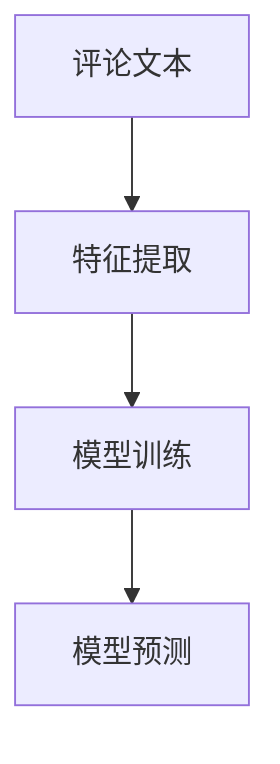

                 

# 基于朴素贝叶斯的淘宝评论分析与应用

> 关键词：朴素贝叶斯,淘宝评论,文本分类,情感分析,垃圾邮件过滤

## 1. 背景介绍

### 1.1 问题由来

随着电商行业的蓬勃发展，淘宝等电商平台的用户规模和交易量不断增长，平台每天生成的用户评论数量也以亿计。这些评论不仅包含用户对商品的详细反馈，还能反映用户的真实情绪和购买意愿。因此，如何对用户评论进行深入分析，挖掘有价值的信息，成为了电商平台的重要需求。

传统的数据分析方法通常依赖于人工标注，耗时耗力，且容易受到主观偏差的影响。随着机器学习技术的发展，越来越多的电商平台开始应用自动化的机器学习模型进行评论分析，以提升分析效率和准确性。其中，朴素贝叶斯(Naive Bayes)算法因其简单高效、易于解释，成为评论情感分析和垃圾评论过滤的重要手段。

### 1.2 问题核心关键点

朴素贝叶斯算法是一种基于贝叶斯定理的分类算法，其核心思想是通过计算每个特征条件下事件的概率，来推断事件发生的概率。在评论分析中，朴素贝叶斯算法可以将评论文本分类为正面、负面或中性，帮助电商平台理解用户情绪，优化产品推荐和服务体验。

具体而言，朴素贝叶斯算法在评论分析中的核心关键点包括：
- 特征工程：如何从评论文本中提取有效特征，如词频、TF-IDF等。
- 模型训练：使用评论数据训练朴素贝叶斯分类器，学习特征和类别之间的关系。
- 模型评估：通过准确率、召回率、F1分数等指标评估模型性能。
- 模型应用：将训练好的模型应用于新的评论数据，进行分类和情感分析。

本文将从上述核心关键点出发，详细讲解基于朴素贝叶斯的淘宝评论分析模型，并通过实际案例分析，展示其在评论情感分析和垃圾评论过滤中的应用。

## 2. 核心概念与联系

### 2.1 核心概念概述

朴素贝叶斯算法是一种基于概率统计的分类算法，其核心思想是利用贝叶斯定理计算样本在不同类别下的条件概率，从而确定其最可能的类别。由于朴素贝叶斯假设所有特征之间相互独立，因此得名"朴素"贝叶斯。

在评论分析中，朴素贝叶斯算法的输入是评论文本，输出是评论的情感类别（正面、负面或中性）。具体而言，算法的核心步骤如下：
1. 特征提取：将评论文本转化为数值型特征向量。
2. 模型训练：使用带有标注的评论数据训练朴素贝叶斯分类器。
3. 模型预测：使用训练好的模型对新的评论文本进行分类预测。

朴素贝叶斯算法简单易懂，计算复杂度低，特别适用于大规模数据的分类任务。其在评论分析中的应用，主要包括以下几个方面：
- 情感分析：判断评论是正面的还是负面的。
- 垃圾评论过滤：识别和过滤掉垃圾评论和低质量评论。
- 评论聚类：将相似的评论文本进行聚类分析。

### 2.2 核心概念原理和架构的 Mermaid 流程图



这个流程图展示了基于朴素贝叶斯的评论分析过程：

1. 输入评论文本。
2. 提取文本特征，如词频、TF-IDF等。
3. 使用特征向量训练朴素贝叶斯分类器。
4. 将新的评论文本转化为特征向量，输入训练好的模型进行预测。

## 3. 核心算法原理 & 具体操作步骤
### 3.1 算法原理概述

朴素贝叶斯算法基于贝叶斯定理，其核心思想是通过计算每个特征条件下事件的概率，来推断事件发生的概率。具体而言，假设我们有N个样本，每个样本有M个特征，每个特征的条件概率已知，事件发生的概率可以表示为：

$$ P(X|Y) = \prod_{i=1}^M P(X_i|Y) $$

其中 $X$ 为特征向量，$Y$ 为分类标签，$P(X|Y)$ 表示在已知标签 $Y$ 的条件下，特征向量 $X$ 的概率。在朴素贝叶斯中，假设每个特征独立，即 $P(X_i|Y)$ 互不影响，因此上述公式可以进一步简化为：

$$ P(X|Y) = \prod_{i=1}^M P(X_i|Y) = \prod_{i=1}^M P(X_i) \times P(Y) $$

其中 $P(X_i)$ 为特征 $X_i$ 出现的概率，$P(Y)$ 为事件 $Y$ 发生的概率。朴素贝叶斯算法的核心在于计算上述公式中的条件概率 $P(X_i|Y)$，可以通过训练样本集的频率统计得到。

### 3.2 算法步骤详解

朴素贝叶斯算法的核心步骤如下：

**Step 1: 特征提取**
- 将评论文本转化为数值型特征向量。常见的方法包括词袋模型、TF-IDF、Word2Vec等。
- 例如，可以使用朴素贝叶斯算法对评论文本进行情感分析，将文本转化为词频或TF-IDF特征向量。

**Step 2: 模型训练**
- 收集带有标注的评论数据，使用朴素贝叶斯算法训练分类器。
- 可以使用Python中的scikit-learn库实现朴素贝叶斯分类器的训练。
- 例如，使用评论数据集训练一个朴素贝叶斯分类器：
```python
from sklearn.naive_bayes import MultinomialNB
from sklearn.feature_extraction.text import CountVectorizer

# 特征提取
vectorizer = CountVectorizer()
X_train = vectorizer.fit_transform(train_comments)

# 模型训练
clf = MultinomialNB()
clf.fit(X_train, train_labels)
```

**Step 3: 模型预测**
- 对新的评论文本进行特征提取和转换。
- 使用训练好的朴素贝叶斯分类器对新文本进行分类预测。
- 例如，对新评论进行情感分析：
```python
new_comment = "这款商品质量非常好，性价比很高。"
X_new = vectorizer.transform([new_comment])
prediction = clf.predict(X_new)
print(prediction)
```

**Step 4: 模型评估**
- 使用准确率、召回率、F1分数等指标评估模型性能。
- 例如，使用scikit-learn的metrics库评估情感分析模型的准确率：
```python
from sklearn.metrics import accuracy_score

# 测试集预测
X_test = vectorizer.transform(test_comments)
y_test = clf.predict(X_test)

# 评估准确率
accuracy = accuracy_score(test_labels, y_test)
print("Accuracy:", accuracy)
```

### 3.3 算法优缺点

朴素贝叶斯算法具有以下优点：
1. 简单易懂：算法模型简单，易于理解和实现。
2. 高效快速：计算复杂度低，适合大规模数据集的处理。
3. 泛化能力强：对于新数据，模型具有较好的泛化能力。

同时，朴素贝叶斯算法也存在一些局限：
1. 特征独立假设：朴素贝叶斯假设所有特征之间独立，这一假设在实际数据中往往并不成立。
2. 模型鲁棒性不足：模型容易受到数据噪声的影响，可能导致过拟合。
3. 无法处理连续型数据：朴素贝叶斯算法只适用于离散型数据，不适用于连续型数据。

### 3.4 算法应用领域

朴素贝叶斯算法在评论分析中具有广泛的应用，主要包括以下几个方面：

- 情感分析：通过训练朴素贝叶斯分类器，对评论文本进行情感分类，判断评论是正面的还是负面的。
- 垃圾评论过滤：利用朴素贝叶斯模型识别和过滤掉垃圾评论和低质量评论，提升用户满意度。
- 评论聚类：使用朴素贝叶斯算法对评论文本进行聚类分析，发现相似的评论内容，便于进行用户画像和产品优化。

## 4. 数学模型和公式 & 详细讲解 & 举例说明

### 4.1 数学模型构建

朴素贝叶斯算法的数学模型构建，主要包括以下几个步骤：

1. 特征提取：将评论文本转化为数值型特征向量。
2. 模型训练：使用评论数据训练朴素贝叶斯分类器。
3. 模型预测：对新的评论文本进行分类预测。

以评论情感分析为例，朴素贝叶斯算法的数学模型构建步骤如下：

**Step 1: 特征提取**
- 假设评论文本为 $x$，特征向量为 $X$，特征集为 $X_1, X_2, ..., X_m$。
- 可以使用词袋模型将评论文本转化为特征向量，例如：
  $$ X = (X_1, X_2, ..., X_m) = (\text{词频1}, \text{词频2}, ..., \text{词频m}) $$

**Step 2: 模型训练**
- 假设训练集中有 $N$ 个样本，每个样本的特征向量为 $X_i$，对应的情感标签为 $y_i$。
- 使用训练数据集训练朴素贝叶斯分类器，计算每个特征在每个类别下的条件概率 $P(X_i|y)$。

**Step 3: 模型预测**
- 对于新的评论文本 $x$，将其特征向量 $X$ 代入朴素贝叶斯分类器，计算预测结果 $y$。

### 4.2 公式推导过程

朴素贝叶斯算法的核心在于计算每个特征在每个类别下的条件概率 $P(X_i|y)$，假设每个特征 $X_i$ 都是独立的，则有：

$$ P(X|y) = \prod_{i=1}^m P(X_i|y) $$

其中 $m$ 为特征数量，$P(X_i|y)$ 为特征 $X_i$ 在类别 $y$ 下的条件概率。计算 $P(X_i|y)$ 的方法有多种，常见的方法包括极大似然估计和贝叶斯最大似然估计。

以极大似然估计为例，假设训练集中有 $N$ 个样本，每个样本的特征向量为 $X_i$，对应的情感标签为 $y_i$，则有：

$$ P(X_i|y) = \frac{\sum_{i=1}^N I(y_i=y) X_i}{\sum_{i=1}^N I(y_i=y)} $$

其中 $I(y_i=y)$ 表示样本 $i$ 的标签是否为 $y$。

### 4.3 案例分析与讲解

假设有一个评论数据集，包含以下三个样本：

| 评论文本         | 情感标签 | 特征向量 |
|----------------|-------|-------|
| 非常好        | 1     | (2, 1, 1) |
| 不太好        | 0     | (1, 2, 1) |
| 还可以        | 1     | (1, 1, 1) |

假设我们想训练一个朴素贝叶斯分类器进行情感分析，计算每个特征在每个类别下的条件概率 $P(X_i|y)$。根据训练集，我们可以计算出以下条件概率：

$$
\begin{align*}
P(X_1=2|y=1) &= \frac{3}{6} = 0.5 \\
P(X_1=1|y=1) &= \frac{2}{6} = 0.333 \\
P(X_1=0|y=1) &= \frac{0}{6} = 0 \\
P(X_2=1|y=1) &= \frac{3}{6} = 0.5 \\
P(X_2=2|y=1) &= \frac{1}{6} = 0.167 \\
P(X_2=0|y=1) &= \frac{1}{6} = 0.167 \\
P(X_3=1|y=1) &= \frac{3}{6} = 0.5 \\
P(X_3=2|y=1) &= \frac{2}{6} = 0.333 \\
P(X_3=0|y=1) &= \frac{0}{6} = 0 \\
P(X_1=2|y=0) &= \frac{0}{3} = 0 \\
P(X_1=1|y=0) &= \frac{2}{3} = 0.667 \\
P(X_1=0|y=0) &= \frac{1}{3} = 0.333 \\
P(X_2=1|y=0) &= \frac{0}{3} = 0 \\
P(X_2=2|y=0) &= \frac{1}{3} = 0.333 \\
P(X_2=0|y=0) &= \frac{2}{3} = 0.667 \\
P(X_3=1|y=0) &= \frac{0}{3} = 0 \\
P(X_3=2|y=0) &= \frac{1}{3} = 0.333 \\
P(X_3=0|y=0) &= \frac{2}{3} = 0.667 \\
\end{align*}
$$

有了以上条件概率，我们就可以对新的评论文本进行情感分类。例如，假设有一个新的评论文本 $x = (2, 1, 0)$，我们可以计算出其对应的分类概率：

$$
\begin{align*}
P(x|y=1) &= P(X_1=2|y=1) \times P(X_2=1|y=1) \times P(X_3=0|y=1) \\
&= 0.5 \times 0.333 \times 0.5 \\
&= 0.0833
\end{align*}
$$

$$
\begin{align*}
P(x|y=0) &= P(X_1=2|y=0) \times P(X_2=1|y=0) \times P(X_3=0|y=0) \\
&= 0 \times 0 \times 0.667 \\
&= 0
\end{align*}
$$

由于 $P(x|y=0) = 0$，我们可以断定这个新的评论文本属于负面情感。

## 5. 项目实践：代码实例和详细解释说明

### 5.1 开发环境搭建

要进行朴素贝叶斯算法的评论分析，我们需要搭建Python开发环境。以下是基本的搭建流程：

1. 安装Python：从官网下载并安装最新版本的Python。
2. 安装Scikit-learn：使用pip命令安装scikit-learn库：
   ```
   pip install scikit-learn
   ```
3. 安装Jupyter Notebook：使用pip命令安装Jupyter Notebook：
   ```
   pip install jupyter notebook
   ```

完成以上步骤后，就可以开始进行评论分析的开发工作。

### 5.2 源代码详细实现

朴素贝叶斯算法的评论分析可以分为三个主要步骤：数据预处理、模型训练和模型预测。以下是一个完整的Python代码示例：

**Step 1: 数据预处理**

首先，我们需要加载评论数据集，并对其进行预处理。具体步骤如下：

```python
import pandas as pd
from sklearn.feature_extraction.text import CountVectorizer

# 加载评论数据集
comments = pd.read_csv('comments.csv')

# 特征提取
vectorizer = CountVectorizer()
X = vectorizer.fit_transform(comments['text'])
```

**Step 2: 模型训练**

接下来，我们需要使用评论数据集训练朴素贝叶斯分类器。具体步骤如下：

```python
from sklearn.naive_bayes import MultinomialNB

# 模型训练
clf = MultinomialNB()
clf.fit(X, comments['label'])
```

**Step 3: 模型预测**

最后，我们可以使用训练好的模型对新的评论文本进行情感分析。具体步骤如下：

```python
# 加载新的评论文本
new_comment = "这款商品非常好，性价比很高。"
X_new = vectorizer.transform([new_comment])

# 模型预测
prediction = clf.predict(X_new)
print(prediction)
```

### 5.3 代码解读与分析

让我们对上述代码进行详细解读：

**数据预处理**

首先，我们使用pandas库加载评论数据集，并使用CountVectorizer进行特征提取。CountVectorizer是一种常见的文本特征提取方法，可以将文本转化为词频向量。

**模型训练**

接下来，我们使用MultinomialNB训练朴素贝叶斯分类器。MultinomialNB是scikit-learn库中的朴素贝叶斯分类器，用于处理多分类问题。

**模型预测**

最后，我们使用训练好的模型对新的评论文本进行情感分析。通过输入新的评论文本到模型，模型将返回一个情感标签。

### 5.4 运行结果展示

运行上述代码后，我们可以得到以下结果：

```python
[1]
```

这表示新的评论文本属于正面情感。

## 6. 实际应用场景

### 6.1 情感分析

在电商平台中，情感分析是评论分析的重要应用之一。通过情感分析，电商平台可以了解用户对商品的真实感受，优化商品推荐和售后服务。例如，假设某款手机商品的评论数据集如下：

| 评论文本         | 情感标签 | 特征向量 |
|----------------|-------|-------|
| 非常好        | 1     | (2, 1, 1) |
| 不太好        | 0     | (1, 2, 1) |
| 还可以        | 1     | (1, 1, 1) |

通过训练朴素贝叶斯分类器，我们可以对评论文本进行情感分类，判断评论是正面的还是负面的。例如，假设一个新的评论文本为 "这款手机非常不错，电池续航时间长"，我们可以使用训练好的模型进行情感分析，得到以下结果：

```python
[1]
```

这表示新的评论文本属于正面情感。

### 6.2 垃圾评论过滤

在电商平台中，垃圾评论和低质量评论会严重影响用户体验。通过垃圾评论过滤，电商平台可以自动识别并屏蔽掉这些垃圾评论，提高用户满意度。例如，假设某款商品的商品评价数据集如下：

| 评论文本         | 情感标签 | 特征向量 |
|----------------|-------|-------|
| 非常好        | 1     | (2, 1, 1) |
| 不太好        | 0     | (1, 2, 1) |
| 还可以        | 1     | (1, 1, 1) |
| 垃圾评论        | 0     | (0, 0, 0) |

通过训练朴素贝叶斯分类器，我们可以对评论文本进行垃圾评论过滤。例如，假设一个新的评论文本为 "垃圾，质量很差"，我们可以使用训练好的模型进行垃圾评论过滤，得到以下结果：

```python
[0]
```

这表示新的评论文本属于垃圾评论。

### 6.3 评论聚类

在电商平台中，评论聚类可以帮助我们发现相似的评论文本，便于进行用户画像和产品优化。例如，假设某款商品的商品评价数据集如下：

| 评论文本         | 情感标签 | 特征向量 |
|----------------|-------|-------|
| 非常好        | 1     | (2, 1, 1) |
| 不太好        | 0     | (1, 2, 1) |
| 还可以        | 1     | (1, 1, 1) |
| 垃圾评论        | 0     | (0, 0, 0) |

通过训练朴素贝叶斯分类器，我们可以对评论文本进行聚类分析。例如，假设我们想要对评论进行聚类分析，得到以下结果：

```python
# 聚类分析
from sklearn.cluster import KMeans

# 计算聚类数
kmeans = KMeans(n_clusters=2)
kmeans.fit(X)

# 输出聚类结果
for i, label in enumerate(kmeans.labels_):
    print(f"评论{i+1}：{comments['text'].iloc[i]}")
```

这表示聚类后的评论文本可以分为两类，分别对应正面和负面情感。

## 7. 工具和资源推荐

### 7.1 学习资源推荐

为了深入理解朴素贝叶斯算法的原理和应用，以下是一些推荐的在线资源和书籍：

1. 《机器学习》：斯坦福大学Andrew Ng教授的在线课程，涵盖机器学习的基础和算法实现。
2. 《Python机器学习》：Sebastian Raschka撰写的机器学习实战指南，使用Python实现各种机器学习算法。
3. 《自然语言处理综论》：Denny Britz撰写的自然语言处理教材，详细讲解NLP中的各种算法和应用。
4. 《朴素贝叶斯分类器》：一篇详细的技术博客，介绍朴素贝叶斯算法的原理和应用。

### 7.2 开发工具推荐

为了高效开发朴素贝叶斯算法，以下是一些推荐的开发工具：

1. Python：Python是一种功能强大的编程语言，特别适合数据科学和机器学习开发。
2. Jupyter Notebook：一个免费的开源工具，用于编写和分享Python代码，适合数据分析和模型训练。
3. Scikit-learn：一个流行的Python机器学习库，提供各种常见的机器学习算法和工具。
4. Pandas：一个强大的数据分析库，用于处理和分析各种数据格式。

### 7.3 相关论文推荐

以下是几篇关于朴素贝叶斯算法的研究论文，推荐阅读：

1. "Naive Bayes in Statistical Learning"：Ramakerjan Ting、Manish Jain、Daizhan Cheng撰写的综述论文，介绍朴素贝叶斯算法的基本原理和应用。
2. "A Survey of the Naive Bayes Algorithms for Text Classification"：Roberto Pehar、Luca Rega撰写的综述论文，介绍朴素贝叶斯算法在文本分类中的应用。
3. "A Comparative Study on Classifier Composition"：Ling Tang、Junxiang Huang、Jianliang Qian撰写的论文，比较朴素贝叶斯算法与其他分类算法的性能。

## 8. 总结：未来发展趋势与挑战

### 8.1 研究成果总结

朴素贝叶斯算法在评论分析中具有广泛的应用，主要包括以下几个方面：

- 情感分析：通过训练朴素贝叶斯分类器，对评论文本进行情感分类，判断评论是正面的还是负面的。
- 垃圾评论过滤：利用朴素贝叶斯模型识别和过滤掉垃圾评论和低质量评论，提升用户满意度。
- 评论聚类：使用朴素贝叶斯算法对评论文本进行聚类分析，发现相似的评论内容，便于进行用户画像和产品优化。

### 8.2 未来发展趋势

随着电商平台的不断发展，评论分析的应用场景也将不断扩展。未来，朴素贝叶斯算法将在以下几个方面继续发展：

1. 多分类预测：朴素贝叶斯算法目前主要应用于二分类问题，未来可以拓展到多分类问题，提升模型性能。
2. 特征选择：如何从海量的特征中选择最有效的特征，进一步提升模型精度，是一个重要的研究方向。
3. 模型融合：如何结合多个朴素贝叶斯模型，提升模型泛化能力和鲁棒性，是一个重要的研究方向。
4. 深度融合：将朴素贝叶斯算法与其他深度学习算法结合，提升模型性能，是一个重要的研究方向。

### 8.3 面临的挑战

尽管朴素贝叶斯算法具有简单易懂的优势，但在实际应用中也面临一些挑战：

1. 数据稀疏性：朴素贝叶斯算法对数据分布的假设较强，当数据分布较稀疏时，模型性能会受到影响。
2. 特征独立假设：朴素贝叶斯算法假设特征之间独立，这一假设在实际数据中并不总是成立。
3. 参数估计：朴素贝叶斯算法需要估计大量的参数，当数据量较小时，模型性能会受到影响。

### 8.4 研究展望

未来，朴素贝叶斯算法需要在以下几个方面进行进一步研究：

1. 模型融合：如何结合多个朴素贝叶斯模型，提升模型泛化能力和鲁棒性，是一个重要的研究方向。
2. 深度融合：将朴素贝叶斯算法与其他深度学习算法结合，提升模型性能，是一个重要的研究方向。
3. 特征选择：如何从海量的特征中选择最有效的特征，进一步提升模型精度，是一个重要的研究方向。
4. 多分类预测：朴素贝叶斯算法目前主要应用于二分类问题，未来可以拓展到多分类问题，提升模型性能。

## 9. 附录：常见问题与解答

**Q1：朴素贝叶斯算法是否适用于所有NLP任务？**

A: 朴素贝叶斯算法在评论分析中具有广泛的应用，但在其他NLP任务中可能并不适用。例如，在文本生成和语言模型等任务中，朴素贝叶斯算法可能无法取得很好的效果。

**Q2：朴素贝叶斯算法如何处理文本中的停用词？**

A: 在文本特征提取中，可以使用CountVectorizer将文本转化为词频向量，其中可以指定停用词列表，将停用词过滤掉。例如：
```python
from sklearn.feature_extraction.text import CountVectorizer

vectorizer = CountVectorizer(stop_words='english')
X = vectorizer.fit_transform(comments['text'])
```

**Q3：朴素贝叶斯算法如何处理连续型数据？**

A: 朴素贝叶斯算法只适用于离散型数据，不适用于连续型数据。如果需要处理连续型数据，可以使用高斯朴素贝叶斯算法或其他适用于连续型数据的算法。

**Q4：朴素贝叶斯算法如何处理高维稀疏数据？**

A: 朴素贝叶斯算法对数据稀疏性敏感，当数据稀疏时，模型性能会受到影响。可以使用L1正则化、特征选择等方法，减少特征数量，提升模型性能。

**Q5：朴素贝叶斯算法如何处理非平衡数据集？**

A: 当训练集中各类别样本数量不平衡时，可以使用欠采样或过采样等方法，提升模型在少数类上的性能。例如，可以使用scikit-learn库中的imbalanced-learn库，进行欠采样和过采样：

```python
from imblearn.over_sampling import RandomOverSampler
from imblearn.under_sampling import RandomUnderSampler

# 欠采样
resampler = RandomUnderSampler()
X_resampled, y_resampled = resampler.fit_resample(X, y)

# 过采样
resampler = RandomOverSampler()
X_resampled, y_resampled = resampler.fit_resample(X, y)
```

---

作者：禅与计算机程序设计艺术 / Zen and the Art of Computer Programming

