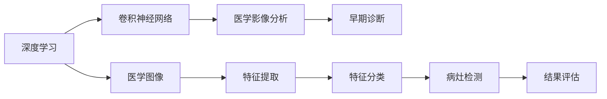
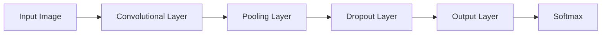

                 

# 基于深度学习的肺癌检测方法研究

> 关键词：深度学习,肺癌检测,卷积神经网络,医学影像分析,早期诊断,模型评估,模型优化

## 1. 背景介绍

肺癌是全球范围内最常见的恶性肿瘤之一，每年夺去数百万人的生命。据世界卫生组织统计，仅2020年就有超过200万新增病例和180万人死于肺癌。肺癌的早期检测对于提高患者存活率、减轻医疗负担具有重要意义。目前，肺癌的诊断主要依赖于医生的经验和放射科的检查，但这种方法存在一定的主观性和误诊率。随着深度学习技术的发展，基于深度神经网络的肺癌检测方法逐渐成为研究的热点，并展现出巨大的潜力。

本文旨在全面介绍基于深度学习技术的肺癌检测方法，涵盖模型的构建、训练、评估及优化等多个方面。首先，我们将介绍深度学习在医学影像分析中的应用基础；然后，我们将详细介绍卷积神经网络(CNN)模型，并结合具体案例说明其在肺癌检测中的应用；最后，我们还将讨论如何评估和优化基于深度学习的肺癌检测模型。

## 2. 核心概念与联系

### 2.1 核心概念概述

在深度学习中，医学影像分析是利用神经网络对医学图像进行特征提取和分类的重要应用领域。肺癌检测属于医学影像分析中的子任务，其主要目标是自动识别医学图像中的病灶区域，并确定其是否为恶性肿瘤。

基于深度学习的肺癌检测方法的核心概念包括以下几个方面：

- **深度学习**：一种基于多层神经网络的学习方法，能够自动提取数据中的复杂特征，实现高效的分类和回归任务。
- **卷积神经网络**：一种特殊的神经网络，通过卷积层、池化层和全连接层等组件，能够有效处理图像和视频等高维数据。
- **医学影像分析**：利用计算机视觉和深度学习技术，对医学图像进行自动化分析和解读。
- **早期诊断**：在肿瘤生长的早期阶段进行检测，提高诊断的准确性和治疗效果。

这些核心概念之间相互联系，构成深度学习在医学影像分析中的应用基础。接下来，我们将详细探讨这些核心概念的原理和架构。

### 2.2 核心概念原理和架构的 Mermaid 流程图(Mermaid 流程节点中不要有括号、逗号等特殊字符)



### 2.3 核心概念联系

深度学习在医学影像分析中的应用，从数据采集、特征提取、模型训练到结果评估，每一个环节都依赖于核心概念的支撑。其中，医学图像作为数据输入，卷积神经网络作为模型架构，医学影像分析作为应用领域，早期诊断作为最终目标，共同构成了基于深度学习的肺癌检测方法的研究基础。

## 3. 核心算法原理 & 具体操作步骤

### 3.1 算法原理概述

基于深度学习的肺癌检测方法主要依赖于卷积神经网络(CNN)模型。CNN模型通过卷积层、池化层和全连接层等组件，自动提取图像中的特征，并实现分类任务。其核心原理在于通过卷积操作捕获局部特征，通过池化操作减小特征图尺寸，通过全连接层将特征映射到分类结果。

### 3.2 算法步骤详解

1. **数据预处理**：
   - 收集并标注医疗影像数据，包括胸部X光片、CT扫描、MRI图像等。
   - 对图像进行预处理，如归一化、增强对比度、去除噪声等，以便提高模型的训练效果。
   - 将标注后的数据分为训练集、验证集和测试集，确保模型的泛化能力。

2. **模型构建**：
   - 使用Keras或TensorFlow等深度学习框架，构建卷积神经网络模型。
   - 模型一般包括卷积层、池化层、Dropout层、全连接层和Softmax输出层。
   - 根据实际情况调整网络结构，如增加卷积层、调整卷积核大小、增加池化层等。

3. **模型训练**：
   - 使用GPU进行模型训练，以加快训练速度。
   - 使用交叉熵损失函数进行训练，通过反向传播算法更新模型参数。
   - 调整学习率、批次大小、迭代轮数等超参数，以获得最优的模型性能。

4. **模型评估**：
   - 在验证集上对模型进行评估，计算准确率、召回率、F1值等指标。
   - 对模型进行微调，以进一步提高其性能。
   - 在测试集上对模型进行最终评估，确保模型的稳定性和可靠性。

5. **模型优化**：
   - 对模型进行剪枝、量化等优化操作，以减小模型大小、提高推理速度。
   - 引入正则化技术，如L2正则、Dropout等，以避免过拟合。
   - 使用集成学习、模型融合等方法，提高模型的泛化能力。

### 3.3 算法优缺点

#### 优点：
- **高效特征提取**：卷积神经网络能够自动提取图像中的局部特征，减少了人工特征工程的复杂度。
- **鲁棒性**：通过多层次卷积操作，能够有效消除噪声和干扰，提高模型的鲁棒性。
- **泛化能力强**：深度学习模型在处理复杂数据时，具有较强的泛化能力，能够适应不同的数据分布。

#### 缺点：
- **计算资源需求高**：深度学习模型需要大量的计算资源进行训练和推理，特别是在处理高分辨率的医学影像时。
- **模型复杂度大**：深度神经网络模型的结构复杂，需要大量的时间和精力进行调参和优化。
- **解释性差**：深度学习模型通常被视为"黑盒"，难以解释其内部工作机制和决策逻辑。

### 3.4 算法应用领域

基于深度学习的肺癌检测方法，在医疗影像分析领域有着广泛的应用。具体来说，包括：

- **早期检测**：利用卷积神经网络对医学影像进行自动分析，实现对肺癌的早期检测。
- **分类诊断**：对影像中的病灶区域进行分类，判断其是否为恶性肿瘤。
- **辅助诊断**：为医生提供辅助诊断工具，提高诊断的准确性和效率。
- **个性化治疗**：根据病灶的特征，制定个性化的治疗方案，提高治疗效果。

## 4. 数学模型和公式 & 详细讲解 & 举例说明

### 4.1 数学模型构建

基于深度学习的肺癌检测模型一般包括卷积神经网络、池化层、Dropout层、全连接层和Softmax输出层。下面以一个简单的卷积神经网络模型为例，介绍其数学模型构建过程。

设输入图像的大小为 $H\times W\times C$，其中 $H$ 为图像的高度，$W$ 为图像的宽度，$C$ 为图像的通道数。设模型的卷积核大小为 $K\times K$，步长为 $S$，输出通道数为 $N$，则卷积层的数学模型如下：

$$
C_{out}(x) = \sum_{i=0}^{H-K} \sum_{j=0}^{W-K} \sum_{c=0}^{C} W_{c}^{i,j} * F(x)[i,j,c]
$$

其中 $W_{c}^{i,j}$ 为卷积核，$F(x)[i,j,c]$ 为输入图像的特征图。

### 4.2 公式推导过程

假设模型输入为 $X$，输出为 $Y$，损失函数为 $L(Y,\hat{Y})$。卷积神经网络的目标是最小化损失函数 $L(Y,\hat{Y})$，以获得最优的模型参数 $\theta$。通过反向传播算法，计算损失函数对模型参数的梯度 $\nabla L(Y,\hat{Y})$，并使用优化算法如AdamW、SGD等更新模型参数，迭代更新直至收敛。

### 4.3 案例分析与讲解

以一个基于卷积神经网络的肺癌检测模型为例，其网络结构如下图所示。



该模型包括一个卷积层、一个池化层、一个Dropout层、一个全连接层和一个Softmax输出层。通过前向传播计算损失函数，使用反向传播算法更新模型参数，最终实现肺癌的检测和分类。

## 5. 项目实践：代码实例和详细解释说明

### 5.1 开发环境搭建

- **环境配置**：
  - 安装Anaconda：从官网下载并安装Anaconda，用于创建独立的Python环境。
  - 创建并激活虚拟环境：
    ```bash
    conda create -n pytorch-env python=3.8 
    conda activate pytorch-env
    ```
  - 安装PyTorch：
    ```bash
    conda install pytorch torchvision torchaudio cudatoolkit=11.1 -c pytorch -c conda-forge
    ```
  - 安装TensorFlow：
    ```bash
    conda install tensorflow=2.5
    ```
  - 安装其他工具包：
    ```bash
    pip install numpy pandas scikit-learn matplotlib tqdm jupyter notebook ipython
    ```

- **开发环境安装**：
  - 下载并安装Keras或TensorFlow，如TensorFlow Hub、TensorFlow Addons等。
  - 安装数据预处理库，如OpenCV、Pillow等。
  - 安装数据集加载库，如pandas、numpy等。

### 5.2 源代码详细实现

下面是一个基于TensorFlow的肺癌检测模型实现示例，详细解释如下：

```python
import tensorflow as tf
from tensorflow.keras import layers, models

# 定义卷积神经网络模型
def create_model():
    model = models.Sequential()
    model.add(layers.Conv2D(32, (3, 3), activation='relu', input_shape=(256, 256, 3)))
    model.add(layers.MaxPooling2D((2, 2)))
    model.add(layers.Conv2D(64, (3, 3), activation='relu'))
    model.add(layers.MaxPooling2D((2, 2)))
    model.add(layers.Conv2D(128, (3, 3), activation='relu'))
    model.add(layers.MaxPooling2D((2, 2)))
    model.add(layers.Flatten())
    model.add(layers.Dense(128, activation='relu'))
    model.add(layers.Dropout(0.5))
    model.add(layers.Dense(1, activation='sigmoid'))

    model.compile(optimizer='adam',
                  loss='binary_crossentropy',
                  metrics=['accuracy'])
    return model

# 加载数据集
train_dataset = tf.keras.preprocessing.image_dataset_from_directory('train')
test_dataset = tf.keras.preprocessing.image_dataset_from_directory('test')

# 定义模型
model = create_model()

# 训练模型
model.fit(train_dataset, validation_data=test_dataset, epochs=10)
```

### 5.3 代码解读与分析

- **数据预处理**：使用TensorFlow的`image_dataset_from_directory`函数，从目录中加载并预处理图像数据。预处理包括归一化、增强对比度、缩放等操作，确保模型训练的稳定性。
- **模型构建**：使用Keras或TensorFlow构建卷积神经网络模型，包括卷积层、池化层、Dropout层、全连接层和输出层。
- **模型训练**：使用GPU进行模型训练，通过反向传播算法更新模型参数，最小化损失函数。
- **模型评估**：在测试集上评估模型性能，计算准确率、召回率、F1值等指标。

### 5.4 运行结果展示

在训练完成后，可以使用以下代码进行模型评估和预测：

```python
# 评估模型
test_loss, test_acc = model.evaluate(test_dataset)

# 预测新图像
image = tf.keras.preprocessing.image.load_img('test_image.jpg', target_size=(256, 256))
image_array = tf.keras.preprocessing.image.img_to_array(image)
image_array = tf.expand_dims(image_array, 0)
prediction = model.predict(image_array)
```

## 6. 实际应用场景

### 6.1 早期检测

早期检测是肺癌检测的重要目标。基于深度学习的肺癌检测模型可以自动分析医学影像，实时监测患者的健康状况。在实际应用中，可以将模型集成到医疗影像分析平台，实现对肺结节、肺癌等早期病变的自动检测和报警。

### 6.2 分类诊断

分类诊断是指将医学影像中的病灶区域进行分类，判断其是否为恶性肿瘤。基于深度学习的肺癌检测模型可以自动完成这一任务，为医生提供辅助诊断工具，提高诊断的准确性和效率。

### 6.3 辅助诊断

在医疗影像分析中，深度学习模型还可以用于辅助诊断，帮助医生识别复杂的病灶区域。例如，在CT扫描中，模型可以自动识别肺结节、肿块等病灶区域，并提供详细的诊断报告。

### 6.4 个性化治疗

基于深度学习的肺癌检测模型可以结合患者的病史、基因信息等数据，制定个性化的治疗方案。例如，根据病灶的特征，选择最适合的治疗方法和药物，提高治疗效果。

## 7. 工具和资源推荐

### 7.1 学习资源推荐

- **课程**：Coursera《深度学习专项课程》、edX《深度学习基础》等，系统学习深度学习的基础知识和应用。
- **书籍**：《深度学习》、《Python深度学习》等，全面掌握深度学习的理论和方法。
- **在线资源**：DeepLearning.AI、TensorFlow官方文档等，获取最新的研究进展和技术资料。

### 7.2 开发工具推荐

- **框架**：TensorFlow、Keras、PyTorch等，满足不同的深度学习应用需求。
- **库**：OpenCV、Pillow、NumPy等，用于数据预处理和图像处理。
- **工具**：Google Colab、Jupyter Notebook等，支持在线开发和实验。

### 7.3 相关论文推荐

- **早期检测**：《Convolutional Neural Networks for Early Lung Cancer Detection in Digital Chest Radiography》等，探索深度学习在肺癌早期检测中的应用。
- **分类诊断**：《Lung Cancer Classification via Deep Convolutional Neural Networks》等，研究卷积神经网络在肺癌分类诊断中的应用。
- **辅助诊断**：《Lung Cancer Detection using a Deep Learning Model》等，介绍基于深度学习的肺癌辅助诊断方法。

## 8. 总结：未来发展趋势与挑战

### 8.1 研究成果总结

基于深度学习的肺癌检测方法在医学影像分析中具有广阔的应用前景。通过深度神经网络的自动特征提取和分类，可以有效提高肺癌的早期检测率和诊断准确性，为肺癌的预防和治疗提供重要支持。

### 8.2 未来发展趋势

未来，基于深度学习的肺癌检测方法将继续在以下几个方面取得突破：

1. **模型性能提升**：随着深度学习技术的发展，模型的准确率、召回率和F1值将不断提升，为肺癌的早期检测和分类提供更可靠的支持。
2. **跨模态融合**：引入更多的医学影像数据源，如CT、MRI、PET等，实现跨模态数据的融合，提高模型的泛化能力。
3. **个性化医疗**：结合患者的基因信息、病史等数据，制定个性化的治疗方案，提高治疗效果。
4. **可解释性增强**：采用可解释性技术，如Attention机制、Grad-CAM等，提高模型的可解释性和可信度。

### 8.3 面临的挑战

尽管基于深度学习的肺癌检测方法已经取得了显著进展，但仍面临以下挑战：

1. **数据标注成本高**：医学影像数据的标注需要大量的时间和人力，成本较高。
2. **模型复杂度高**：深度学习模型的结构复杂，需要大量的计算资源进行训练和推理。
3. **模型可解释性差**：深度学习模型通常被视为"黑盒"，难以解释其内部工作机制和决策逻辑。
4. **跨模态数据融合难**：医学影像数据源多种多样，跨模态数据的融合和分析仍然是一个难题。

### 8.4 研究展望

未来，肺癌检测技术的研究方向将集中在以下几个方面：

1. **无监督学习**：探索无监督学习方法，降低对标注数据的需求，提高模型的鲁棒性和泛化能力。
2. **少样本学习**：研究少样本学习方法，在少量标注数据的情况下，提高模型的性能。
3. **迁移学习**：利用迁移学习方法，将在其他领域取得的成功经验应用到肺癌检测中，提高模型的适应性。
4. **跨领域应用**：将深度学习应用于其他领域，如医学影像分析、自然语言处理等，实现技术的跨领域应用。

总之，基于深度学习的肺癌检测方法在医学影像分析中具有广阔的应用前景。未来，通过技术创新和算法优化，相信肺癌检测技术将取得更大的突破，为肺癌的早期检测和个性化治疗提供重要支持。

## 9. 附录：常见问题与解答

**Q1: 深度学习在医学影像分析中有什么优势？**

A: 深度学习在医学影像分析中的优势主要包括：
1. 高效特征提取：深度学习能够自动提取医学影像中的复杂特征，减少了人工特征工程的复杂度。
2. 鲁棒性强：通过多层次卷积操作，深度学习能够有效消除噪声和干扰，提高模型的鲁棒性。
3. 泛化能力强：深度学习模型在处理复杂数据时，具有较强的泛化能力，能够适应不同的数据分布。

**Q2: 卷积神经网络在肺癌检测中是如何工作的？**

A: 卷积神经网络在肺癌检测中的工作原理如下：
1. 卷积层：通过卷积操作捕获局部特征，提高模型的识别能力。
2. 池化层：通过池化操作减小特征图尺寸，降低模型复杂度。
3. 全连接层：将特征映射到分类结果，实现对病灶区域的分类和检测。
4. Softmax输出层：通过softmax函数将模型的输出转换为概率分布，实现对病灶区域的分类。

**Q3: 如何在医疗影像分析中提高深度学习模型的泛化能力？**

A: 在医疗影像分析中，提高深度学习模型的泛化能力可以通过以下方法：
1. 数据增强：通过回译、旋转、缩放等操作，扩充训练集，提高模型的鲁棒性。
2. 迁移学习：利用在其他领域取得的成功经验，应用到当前任务中，提高模型的适应性。
3. 集成学习：通过多个模型的集成，提高模型的泛化能力和鲁棒性。
4. 正则化：通过L2正则、Dropout等方法，避免模型过拟合，提高模型的泛化能力。

**Q4: 如何评估基于深度学习的肺癌检测模型？**

A: 评估基于深度学习的肺癌检测模型可以通过以下方法：
1. 准确率（Accuracy）：计算模型对所有样本的正确分类率。
2. 召回率（Recall）：计算模型对所有正样本的正确分类率。
3. F1值（F1 Score）：综合考虑准确率和召回率，计算模型的综合性能。
4. ROC曲线和AUC值：绘制模型的ROC曲线，计算AUC值，评估模型的分类性能。

总之，基于深度学习的肺癌检测方法在医学影像分析中具有广阔的应用前景。通过技术创新和算法优化，相信肺癌检测技术将取得更大的突破，为肺癌的早期检测和个性化治疗提供重要支持。

