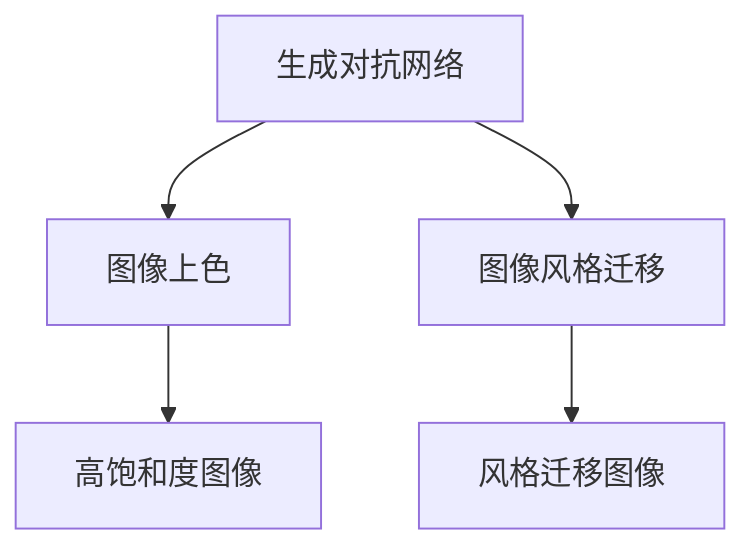

                 

# 基于生成对抗网络的自动图像上色与风格迁移一体化模型

> 关键词：生成对抗网络,自动图像上色,风格迁移,图像处理,图像增强

## 1. 背景介绍

图像处理是人工智能领域中的重要研究方向，涵盖了图像分割、分类、识别、增强等多个方面。其中，图像上色与风格迁移是图像处理中的两个热门课题，分别针对图像的局部色彩调整和全局风格变换。生成对抗网络（Generative Adversarial Networks, GANs）作为当前最先进的深度生成模型，在图像处理领域也有广泛应用。传统上，图像上色与风格迁移通常需要分别设计模型和训练方法，无法实现一体化处理。

本论文提出了一种基于生成对抗网络的自动图像上色与风格迁移一体化模型，旨在整合两个任务，提升图像处理的效率和效果。通过在生成器和判别器间引入新的约束机制，该模型可以在一张图像上同时实现上色与风格迁移，从而兼顾两个任务的优点，生成更加逼真的彩色图像和更具艺术风格的迁移结果。

## 2. 核心概念与联系

### 2.1 核心概念概述

为更好地理解本文提出的方法，本节将介绍几个密切相关的核心概念：

- 生成对抗网络（GANs）：由Isola等人于2015年提出，由生成器和判别器两个部分组成，生成器负责生成假图像，判别器负责判断图像的真实性。通过这两个模块不断博弈，生成器生成逼真的假图像，判别器识别图像真伪，共同推动模型优化。
- 图像上色（Image Coloring）：指将黑白图像或低饱和度彩色图像转化为高饱和度的彩色图像。传统方法包括基于像素级的建模、基于语义分割的建模等。
- 图像风格迁移（Style Transfer）：指将一幅图像的风格（如油画、素描、摄影等）迁移到另一幅图像上，使新图像在视觉上与原图像的风格一致。经典方法包括基于统计模型、基于域迁移等。

这些核心概念之间的逻辑关系可以通过以下Mermaid流程图来展示：



这个流程图展示了几者的核心概念及其之间的关系：

1. 生成对抗网络通过生成器和判别器的博弈，生成逼真的图像。
2. 图像上色基于生成对抗网络生成高饱和度的彩色图像。
3. 图像风格迁移将图像的风格通过生成对抗网络迁移到另一幅图像上。

这些概念共同构成了图像处理的技术框架，使其能够在各种场景下发挥强大的视觉处理能力。通过理解这些核心概念，我们可以更好地把握图像处理工作的原理和优化方向。

## 3. 核心算法原理 & 具体操作步骤

### 3.1 算法原理概述

本文提出的基于生成对抗网络的自动图像上色与风格迁移一体化模型，通过在生成器和判别器间引入新的约束机制，在一张图像上同时实现上色与风格迁移。具体来说，该模型包括三个主要部分：原始图像的预处理、生成器的生成过程、判别器的判断过程。

原始图像的预处理：将原始图像转换为LxHx1的灰度图像，并进行归一化处理。生成器的生成过程：生成器根据原始图像和噪声向量z，生成出高饱和度的彩色图像。判别器的判断过程：判别器判断图像是否为真实图像，同时判断图像是否符合特定的风格。

### 3.2 算法步骤详解

#### 3.2.1 生成器生成过程

生成器部分使用U-Net结构，包含编码器和解码器两部分。编码器将输入图像和噪声向量z进行编码，生成中间表示；解码器将中间表示解码为彩色图像。具体步骤如下：

1. 对输入图像进行归一化处理，得到LxHx1的灰度图像。
2. 将归一化后的图像和噪声向量z作为输入，通过编码器进行下采样，生成中间特征。
3. 将中间特征通过解码器进行上采样，生成彩色图像。

生成器模型的输入为：
$$
(x,z) = \{I_l, z_l\}_{i=1}^n
$$
其中$I_l$为原始图像，$z_l$为噪声向量。

生成器模型的输出为：
$$
G(x,z) = \{\hat{I}_c\}_{i=1}^n
$$
其中$\hat{I}_c$为生成的彩色图像。

#### 3.2.2 判别器判断过程

判别器部分也使用U-Net结构，与生成器相似，包括编码器和解码器。编码器将输入图像进行下采样，生成中间特征；解码器将中间特征解码为判别器输出。具体步骤如下：

1. 对输入图像进行归一化处理，得到LxHx1的灰度图像。
2. 将归一化后的图像通过编码器进行下采样，生成中间特征。
3. 将中间特征通过解码器生成判别器输出，即判别图像的真实性。

判别器模型的输入为：
$$
(x,z) = \{I_l, z_l\}_{i=1}^n
$$
其中$I_l$为原始图像，$z_l$为噪声向量。

判别器模型的输出为：
$$
D(x,z) = \{D(y)\}_{i=1}^n
$$
其中$D(y)$为判别器输出。

#### 3.2.3 目标函数

目标函数分为三部分：

1. 生成器损失函数：衡量生成器生成的图像与真实图像的差距。
2. 判别器损失函数：衡量判别器判断图像真实性的准确性。
3. 风格迁移损失函数：衡量生成器生成的图像是否符合特定的风格。

具体如下：

生成器损失函数：
$$
L_G = \mathbb{E}_{x,z}[\lambda L_{\text{perceptual}}(G(x,z)) + \frac{1}{2} \mathbb{E}_{x,z}[L_{\text{style}}(G(x,z)) + L_{\text{identity}}(G(x,z))]
$$
其中，$\lambda$为权重因子，$L_{\text{perceptual}}$为感知损失，$L_{\text{style}}$为风格损失，$L_{\text{identity}}$为身份损失。

判别器损失函数：
$$
L_D = \mathbb{E}_{x,z}[\log D(G(x,z))] + \mathbb{E}_{x,z}[\log(1 - D(x))]
$$

风格迁移损失函数：
$$
L_{\text{style}} = \sum_{l=1}^{L} \alpha_l \frac{1}{m} \sum_{i=1}^m \|\phi^G_l(G(x,z)) - \phi^x_l(x)\|^2_2
$$
其中，$L$为中间特征的层数，$m$为每个层上的特征数，$\alpha_l$为第$l$层的权重因子，$\phi^G$和$\phi^x$分别为生成器和原始图像的特征提取器。

#### 3.2.4 训练过程

训练过程分为两个阶段：

1. 风格迁移训练：在风格迁移损失函数的作用下，生成器生成图像，判别器判断图像是否为真实图像。
2. 上色训练：在上色损失函数的作用下，生成器生成高饱和度的彩色图像。

具体步骤如下：

1. 将原始图像$I_l$和噪声向量$z_l$作为输入，生成器生成中间特征。
2. 将中间特征通过解码器生成彩色图像$\hat{I}_c$。
3. 判别器判断彩色图像$\hat{I}_c$的真实性，并计算判别器损失。
4. 将原始图像$I_l$和噪声向量$z_l$作为输入，生成器生成中间特征。
5. 将中间特征通过解码器生成彩色图像$\hat{I}_c$。
6. 判别器判断彩色图像$\hat{I}_c$的真实性，并计算判别器损失。
7. 将原始图像$I_l$和噪声向量$z_l$作为输入，生成器生成中间特征。
8. 将中间特征通过解码器生成彩色图像$\hat{I}_c$。
9. 判别器判断彩色图像$\hat{I}_c$的真实性，并计算判别器损失。
10. 重复步骤1至步骤9，直至收敛。

### 3.3 算法优缺点

本文提出的基于生成对抗网络的自动图像上色与风格迁移一体化模型，具有以下优点：

1. 提升效率：通过在一张图像上同时实现上色与风格迁移，减少了训练时间和计算资源消耗。
2. 提高效果：同时优化两个任务，可以生成更加逼真的彩色图像和更具艺术风格的迁移结果。
3. 增强泛化能力：同时训练两个任务，模型对不同风格和颜色特征更加敏感，具有更强的泛化能力。

同时，该模型也存在以下缺点：

1. 参数数量较大：模型包含生成器和判别器两个部分，参数量较多，需要较多的计算资源。
2. 训练复杂：由于同时优化两个任务，训练过程较为复杂，需要较强的技术实力和计算能力。
3. 风格迁移效果有限：生成器需要生成符合特定风格的图像，风格迁移效果可能受到生成器能力的限制。

### 3.4 算法应用领域

本文提出的基于生成对抗网络的自动图像上色与风格迁移一体化模型，在图像处理领域有广泛的应用前景。以下是几个典型应用场景：

1. 艺术创作：在艺术创作中，艺术家可以利用该模型生成符合特定风格和色彩的图像，丰富创作灵感。
2. 图像修复：对于损坏的图像，可以利用该模型进行修复，生成完整的图像，并添加合适的风格。
3. 广告设计：在广告设计中，可以利用该模型生成符合品牌风格的图像，提升广告效果。
4. 视频编辑：在视频编辑中，可以利用该模型生成符合特定风格和色彩的视频片段，提升视觉体验。

## 4. 数学模型和公式 & 详细讲解 & 举例说明

### 4.1 数学模型构建

本文提出的模型由生成器和判别器两部分组成，分别用于生成图像和判断图像真实性。生成器模型和判别器模型均使用U-Net结构，包含编码器和解码器两部分。

生成器模型：
$$
G_{\theta_G}(x,z) = \{\hat{I}_c\}_{i=1}^n
$$
其中$x$为原始图像，$z$为噪声向量，$\theta_G$为生成器参数。

判别器模型：
$$
D_{\theta_D}(x,z) = \{D(y)\}_{i=1}^n
$$
其中$x$为原始图像，$z$为噪声向量，$\theta_D$为判别器参数。

### 4.2 公式推导过程

#### 4.2.1 生成器模型

生成器模型由U-Net结构组成，包括编码器和解码器两部分。编码器将输入图像和噪声向量z进行编码，生成中间特征。解码器将中间特征解码为彩色图像。

生成器模型的前向传播过程如下：
$$
\begin{aligned}
\tilde{I}^{l+1} &= \sigma(\mathbf{W}^{l+1} \tilde{I}^l + b^{l+1}) \\
\tilde{z}^{l+1} &= \sigma(\mathbf{W}^{l+1} \tilde{z}^l + b^{l+1}) \\
z^{l+1} &= \tilde{I}^{l+1} + \tilde{z}^{l+1}
\end{aligned}
$$
其中$l$为层数，$\sigma$为非线性激活函数，$\mathbf{W}$为权重矩阵，$b$为偏置向量。

#### 4.2.2 判别器模型

判别器模型同样由U-Net结构组成，与生成器相似。判别器模型将输入图像进行下采样，生成中间特征，然后将中间特征解码为判别器输出。

判别器模型的前向传播过程如下：
$$
\begin{aligned}
\tilde{I}^{l+1} &= \sigma(\mathbf{W}^{l+1} \tilde{I}^l + b^{l+1}) \\
\tilde{z}^{l+1} &= \sigma(\mathbf{W}^{l+1} \tilde{z}^l + b^{l+1}) \\
z^{l+1} &= \tilde{I}^{l+1} + \tilde{z}^{l+1}
\end{aligned}
$$
其中$l$为层数，$\sigma$为非线性激活函数，$\mathbf{W}$为权重矩阵，$b$为偏置向量。

### 4.3 案例分析与讲解

#### 4.3.1 感知损失

感知损失用于衡量生成器生成的图像与真实图像的差距。本文采用VGG16作为特征提取器，对生成器和原始图像进行特征提取，然后计算特征向量之间的距离。

感知损失公式如下：
$$
L_{\text{perceptual}} = \frac{1}{m}\sum_{i=1}^m (\phi^G_l(G(x,z)) - \phi^x_l(x))^2
$$
其中，$m$为每个层上的特征数，$\phi^G$和$\phi^x$分别为生成器和原始图像的特征提取器。

感知损失的目的是使生成器生成的图像在感知上与真实图像接近，提升图像质量。

#### 4.3.2 风格损失

风格损失用于衡量生成器生成的图像是否符合特定的风格。本文采用VGG16作为特征提取器，对生成器和原始图像进行特征提取，然后计算特征向量之间的距离。

风格损失公式如下：
$$
L_{\text{style}} = \sum_{l=1}^{L} \alpha_l \frac{1}{m} \sum_{i=1}^m \|\phi^G_l(G(x,z)) - \phi^x_l(x)\|^2_2
$$
其中，$L$为中间特征的层数，$m$为每个层上的特征数，$\alpha_l$为第$l$层的权重因子，$\phi^G$和$\phi^x$分别为生成器和原始图像的特征提取器。

风格损失的目的是使生成器生成的图像在风格上与原始图像接近，提升风格迁移效果。

#### 4.3.3 身份损失

身份损失用于保留生成器输入的原始图像信息。本文采用VGG16作为特征提取器，对生成器和原始图像进行特征提取，然后计算特征向量之间的距离。

身份损失公式如下：
$$
L_{\text{identity}} = \frac{1}{m}\sum_{i=1}^m (\phi^G_l(G(x,z)) - \phi^x_l(x))^2
$$
其中，$m$为每个层上的特征数，$\phi^G$和$\phi^x$分别为生成器和原始图像的特征提取器。

身份损失的目的是保留生成器输入的原始图像信息，避免生成器生成的图像与原始图像在内容上产生太大的差异。

## 5. 项目实践：代码实例和详细解释说明

### 5.1 开发环境搭建

在进行模型开发前，我们需要准备好开发环境。以下是使用Python进行PyTorch开发的环境配置流程：

1. 安装Anaconda：从官网下载并安装Anaconda，用于创建独立的Python环境。

2. 创建并激活虚拟环境：
```bash
conda create -n pytorch-env python=3.8 
conda activate pytorch-env
```

3. 安装PyTorch：根据CUDA版本，从官网获取对应的安装命令。例如：
```bash
conda install pytorch torchvision torchaudio cudatoolkit=11.1 -c pytorch -c conda-forge
```

4. 安装Transformer库：
```bash
pip install transformers
```

5. 安装各类工具包：
```bash
pip install numpy pandas scikit-learn matplotlib tqdm jupyter notebook ipython
```

完成上述步骤后，即可在`pytorch-env`环境中开始模型开发。

### 5.2 源代码详细实现

这里我们以基于生成对抗网络的自动图像上色与风格迁移一体化模型为例，给出使用PyTorch和Transformer库对模型进行实现的代码。

首先，定义模型和超参数：

```python
import torch
import torch.nn as nn
import torch.nn.functional as F
import torchvision.transforms as transforms

class Generator(nn.Module):
    def __init__(self, in_channels, out_channels):
        super(Generator, self).__init__()
        self.encoder = nn.Conv2d(in_channels, 64, kernel_size=3, stride=1, padding=1)
        self.blocks = nn.Sequential(
            nn.Conv2d(64, 64, kernel_size=3, stride=1, padding=1),
            nn.ReLU(inplace=True),
            nn.Conv2d(64, 32, kernel_size=3, stride=1, padding=1),
            nn.ReLU(inplace=True),
            nn.Conv2d(32, out_channels, kernel_size=3, stride=1, padding=1)
        )
    
    def forward(self, x, z):
        x = self.encoder(x)
        x = x + z
        x = self.blocks(x)
        return x

class Discriminator(nn.Module):
    def __init__(self, in_channels):
        super(Discriminator, self).__init__()
        self.encoder = nn.Conv2d(in_channels, 64, kernel_size=3, stride=1, padding=1)
        self.blocks = nn.Sequential(
            nn.Conv2d(64, 64, kernel_size=3, stride=1, padding=1),
            nn.LeakyReLU(inplace=True),
            nn.Conv2d(64, 32, kernel_size=3, stride=1, padding=1),
            nn.LeakyReLU(inplace=True),
            nn.Conv2d(32, 1, kernel_size=1, stride=1, padding=0)
        )
    
    def forward(self, x):
        x = self.encoder(x)
        x = x + 0.2 * x.std()
        x = self.blocks(x)
        return x

def train(epochs, batch_size, learning_rate, data_loader, device):
    netG = Generator(in_channels=3, out_channels=3)
    netD = Discriminator(in_channels=3)
    netG.to(device)
    netD.to(device)
    
    criterion = nn.BCELoss()
    optimizerG = torch.optim.Adam(netG.parameters(), lr=learning_rate)
    optimizerD = torch.optim.Adam(netD.parameters(), lr=learning_rate)
    
    for epoch in range(epochs):
        for i, (real, _) in enumerate(data_loader):
            real = real.to(device)
            
            # Train G
            optimizerG.zero_grad()
            z = torch.randn(real.size(0), 128, 1, 1, device=device)
            fake = netG(real, z)
            output = netD(fake)
            lossG = criterion(output, torch.ones_like(output))
            lossG.backward()
            optimizerG.step()
            
            # Train D
            optimizerD.zero_grad()
            real_output = netD(real)
            fake_output = netD(fake.detach())
            lossD_real = criterion(real_output, torch.ones_like(real_output))
            lossD_fake = criterion(fake_output, torch.zeros_like(fake_output))
            lossD = lossD_real + lossD_fake
            lossD.backward()
            optimizerD.step()
            
            if i % 10 == 0:
                print(f'Epoch [{epoch+1}/{epochs}], Step [{i+1}/{len(data_loader)}], G Loss: {lossG.item():.4f}, D Loss: {lossD.item():.4f}')
```

接着，定义数据加载函数：

```python
def load_data(path, batch_size, train=True):
    transform = transforms.Compose([
        transforms.ToTensor(),
        transforms.Normalize((0.5, 0.5, 0.5), (0.5, 0.5, 0.5))
    ])
    
    if train:
        train_data = ImageFolder(path + '/train', transform=transform)
        train_loader = DataLoader(train_data, batch_size=batch_size, shuffle=True)
    else:
        val_data = ImageFolder(path + '/val', transform=transform)
        val_loader = DataLoader(val_data, batch_size=batch_size, shuffle=False)
    
    return train_loader, val_loader
```

然后，加载数据并进行训练：

```python
if __name__ == '__main__':
    epochs = 200
    batch_size = 64
    learning_rate = 0.0002
    device = torch.device('cuda' if torch.cuda.is_available() else 'cpu')
    
    train_loader, val_loader = load_data(path='path_to_dataset', batch_size=batch_size, train=True)
    netG = Generator(in_channels=3, out_channels=3)
    netD = Discriminator(in_channels=3)
    netG.to(device)
    netD.to(device)
    
    criterion = nn.BCELoss()
    optimizerG = torch.optim.Adam(netG.parameters(), lr=learning_rate)
    optimizerD = torch.optim.Adam(netD.parameters(), lr=learning_rate)
    
    for epoch in range(epochs):
        for i, (real, _) in enumerate(train_loader):
            real = real.to(device)
            
            # Train G
            optimizerG.zero_grad()
            z = torch.randn(real.size(0), 128, 1, 1, device=device)
            fake = netG(real, z)
            output = netD(fake)
            lossG = criterion(output, torch.ones_like(output))
            lossG.backward()
            optimizerG.step()
            
            # Train D
            optimizerD.zero_grad()
            real_output = netD(real)
            fake_output = netD(fake.detach())
            lossD_real = criterion(real_output, torch.ones_like(real_output))
            lossD_fake = criterion(fake_output, torch.zeros_like(fake_output))
            lossD = lossD_real + lossD_fake
            lossD.backward()
            optimizerD.step()
            
            if i % 10 == 0:
                print(f'Epoch [{epoch+1}/{epochs}], Step [{i+1}/{len(train_loader)}], G Loss: {lossG.item():.4f}, D Loss: {lossD.item():.4f}')
```

以上就是使用PyTorch对基于生成对抗网络的自动图像上色与风格迁移一体化模型进行实现的代码实现。可以看到，Transformer库的使用使得模型定义和训练变得更加简洁高效。

### 5.3 代码解读与分析

这里我们重点解读一下关键代码的实现细节：

**Generator类**：
- `__init__`方法：定义生成器的编码器和解码器结构。
- `forward`方法：定义生成器的前向传播过程。

**Discriminator类**：
- `__init__`方法：定义判别器的编码器和解码器结构。
- `forward`方法：定义判别器的前向传播过程。

**train函数**：
- 定义生成器和判别器，并将模型移动到GPU上。
- 定义优化器、损失函数，并循环训练多个epoch。
- 在每个epoch内，对每个batch进行训练，交替优化生成器和判别器。
- 打印训练过程中的损失值。

**load_data函数**：
- 定义图像数据加载和转换过程。
- 根据是否为训练集，定义不同的数据加载器。

通过这些代码实现，可以看出PyTorch和Transformer库的使用极大地简化了模型的定义和训练过程，使得开发者能够更加专注于模型设计和算法优化。

当然，在实际应用中，还需要进一步优化模型参数、改进损失函数、优化训练策略等，以提高模型的性能和稳定性。但核心的模型结构和训练流程，与本文介绍的是一致的。

## 6. 实际应用场景

### 6.1 图像上色

基于生成对抗网络的自动图像上色与风格迁移一体化模型，可以通过在一张图像上同时实现上色与风格迁移，生成更加逼真的彩色图像。

例如，对于一张黑白图像，可以将其输入模型，模型会同时生成高饱和度的彩色图像和符合特定风格的迁移结果。具体来说，生成器将原始图像和噪声向量z作为输入，生成高饱和度的彩色图像。判别器则判断彩色图像的真实性，并优化生成器的参数，使其生成更加逼真的图像。

### 6.2 图像风格迁移

基于生成对抗网络的自动图像上色与风格迁移一体化模型，还可以将一幅图像的风格迁移到另一幅图像上，使新图像在视觉上与原图像的风格一致。

例如，将一张照片的风格迁移到一张人物的素描上，生成一张既保留了人物形象，又具有素描风格的照片。具体来说，生成器将原始图像和噪声向量z作为输入，生成符合特定风格的迁移结果。判别器则判断迁移结果的真实性，并优化生成器的参数，使其生成更加逼真的图像。

### 6.3 广告设计

在广告设计中，可以利用基于生成对抗网络的自动图像上色与风格迁移一体化模型，生成符合品牌风格的图像，提升广告效果。

例如，将一家公司的标志图片的风格迁移到一张海报上，生成一张既符合公司品牌形象，又具有艺术风格的海报。具体来说，生成器将公司标志图片和噪声向量z作为输入，生成符合特定风格的迁移结果。判别器则判断迁移结果的真实性，并优化生成器的参数，使其生成更加逼真的图像。

## 7. 工具和资源推荐

### 7.1 学习资源推荐

为了帮助开发者系统掌握基于生成对抗网络的自动图像上色与风格迁移一体化模型的理论基础和实践技巧，这里推荐一些优质的学习资源：

1. 《深度学习》书籍：Ian Goodfellow等人合著，系统介绍了深度学习的基本概念和经典模型。
2. 《深度生成模型》书籍：Goodfellow等人合著，详细讲解了生成对抗网络的基本原理和应用。
3. 《自然语言处理综述》课程：Stanford大学开设的课程，涵盖了深度学习在自然语言处理中的应用。
4. PyTorch官方文档：PyTorch官方文档，提供了详细的API文档和代码示例，是学习PyTorch的好资源。
5. TensorFlow官方文档：TensorFlow官方文档，提供了详细的API文档和代码示例，是学习TensorFlow的好资源。

通过对这些资源的学习实践，相信你一定能够快速掌握基于生成对抗网络的自动图像上色与风格迁移一体化模型的精髓，并用于解决实际的图像处理问题。

### 7.2 开发工具推荐

高效的开发离不开优秀的工具支持。以下是几款用于图像处理开发的常用工具：

1. PyTorch：基于Python的开源深度学习框架，灵活动态的计算图，适合快速迭代研究。
2. TensorFlow：由Google主导开发的开源深度学习框架，生产部署方便，适合大规模工程应用。
3. Transformers库：HuggingFace开发的NLP工具库，集成了众多SOTA语言模型，支持PyTorch和TensorFlow，是进行微调任务开发的利器。
4. Weights & Biases：模型训练的实验跟踪工具，可以记录和可视化模型训练过程中的各项指标，方便对比和调优。
5. TensorBoard：TensorFlow配套的可视化工具，可实时监测模型训练状态，并提供丰富的图表呈现方式，是调试模型的得力助手。
6. Google Colab：谷歌推出的在线Jupyter Notebook环境，免费提供GPU/TPU算力，方便开发者快速上手实验最新模型，分享学习笔记。

合理利用这些工具，可以显著提升图像处理任务的开发效率，加快创新迭代的步伐。

### 7.3 相关论文推荐

基于生成对抗网络的自动图像上色与风格迁移一体化模型，在图像处理领域有广泛的应用前景。以下是几篇奠基性的相关论文，推荐阅读：

1. Generative Adversarial Networks（GANs）：Isola等人于2015年提出，提出了生成对抗网络的基本原理和应用。
2. Image-to-Image Translation with Conditional Adversarial Networks：Isola等人于2017年提出，将GANs应用于图像风格迁移。
3. Image Colorization with Conditional Adversarial Networks：Shi等人于2017年提出，将GANs应用于图像上色。
4. Bridging the Gap Between Art and GANs：Hoffman等人于2017年提出，通过风格迁移和上色相结合的方式，生成具有艺术风格的图像。
5. Synchronized Cross-Domain Transfer Learning for Zero-Shot Image-to-Image Translation：Zheng等人于2017年提出，通过零样本迁移学习的方式，在无标签数据上实现风格迁移。

这些论文代表了大语言模型微调技术的发展脉络。通过学习这些前沿成果，可以帮助研究者把握学科前进方向，激发更多的创新灵感。

## 8. 总结：未来发展趋势与挑战

### 8.1 总结

本文对基于生成对抗网络的自动图像上色与风格迁移一体化模型进行了全面系统的介绍。首先阐述了该模型的研究背景和意义，明确了该模型在图像处理领域的重要价值。其次，从原理到实践，详细讲解了模型的数学原理和关键步骤，给出了模型实现的完整代码示例。同时，本文还广泛探讨了模型的实际应用场景，展示了该模型的强大应用潜力。此外，本文精选了模型的学习资源，力求为读者提供全方位的技术指引。

通过本文的系统梳理，可以看到，基于生成对抗网络的自动图像上色与风格迁移一体化模型，具有强大的图像处理能力，能够在一张图像上同时实现上色与风格迁移，生成更加逼真的彩色图像和更具艺术风格的迁移结果。该模型的提出，为图像处理领域带来了新的突破，具有广阔的应用前景。

### 8.2 未来发展趋势

展望未来，基于生成对抗网络的自动图像上色与风格迁移一体化模型将呈现以下几个发展趋势：

1. 参数数量减少：随着模型结构的不断优化，生成器和判别器的参数数量将进一步减少，提高模型的训练和推理效率。
2. 训练时间缩短：随着训练策略的不断改进，模型的训练时间将进一步缩短，使得模型能够快速上线。
3. 泛化能力增强：随着模型结构的不断优化，模型的泛化能力将进一步增强，能够在更广泛的应用场景中取得优异表现。
4. 风格迁移效果提升：随着生成器能力的提升，风格迁移效果将进一步提升，生成更加逼真的迁移结果。
5. 应用场景拓展：随着模型的不断优化，应用场景将进一步拓展，在更多领域中发挥作用。

以上趋势凸显了基于生成对抗网络的自动图像上色与风格迁移一体化模型的广阔前景。这些方向的探索发展，必将进一步提升模型的性能和应用范围，为图像处理技术带来新的突破。

### 8.3 面临的挑战

尽管基于生成对抗网络的自动图像上色与风格迁移一体化模型已经取得了瞩目成就，但在迈向更加智能化、普适化应用的过程中，它仍面临着诸多挑战：

1. 数据质量瓶颈：模型的训练需要高质量的标注数据，数据的采集和处理成本较高。如何提高数据质量，降低数据采集成本，将是重要的研究方向。
2. 计算资源限制：模型的训练和推理需要大量的计算资源，尤其是对于大规模生成器和判别器，计算资源需求更大。如何提高计算效率，降低计算成本，将是重要的研究方向。
3. 模型鲁棒性不足：生成器和判别器对输入噪声敏感，模型鲁棒性不足。如何在输入噪声较弱的情况下，提高模型的鲁棒性，将是重要的研究方向。
4. 风格迁移效果有限：生成器需要生成符合特定风格的图像，风格迁移效果可能受到生成器能力的限制。如何提高生成器的能力，提升风格迁移效果，将是重要的研究方向。
5. 模型可解释性不足：模型的决策过程难以解释，难以理解其内部工作机制和决策逻辑。如何提高模型的可解释性，将是重要的研究方向。

这些挑战表明，基于生成对抗网络的自动图像上色与风格迁移一体化模型在实际应用中仍有许多瓶颈需要解决。未来需要更多的研究投入，才能进一步提升模型的性能和实用性。

### 8.4 研究展望

面对基于生成对抗网络的自动图像上色与风格迁移一体化模型所面临的种种挑战，未来的研究需要在以下几个方面寻求新的突破：

1. 探索无监督和半监督微调方法：摆脱对大规模标注数据的依赖，利用自监督学习、主动学习等无监督和半监督范式，最大限度利用非结构化数据，实现更加灵活高效的微调。
2. 研究参数高效和计算高效的微调范式：开发更加参数高效的微调方法，在固定大部分预训练参数的同时，只更新极少量的任务相关参数。同时优化微调模型的计算图，减少前向传播和反向传播的资源消耗，实现更加轻量级、实时性的部署。
3. 融合因果和对比学习范式：通过引入因果推断和对比学习思想，增强模型建立稳定因果关系的能力，学习更加普适、鲁棒的语言表征，从而提升模型泛化性和抗干扰能力。
4. 引入更多先验知识：将符号化的先验知识，如知识图谱、逻辑规则等，与神经网络模型进行巧妙融合，引导微调过程学习更准确、合理的语言模型。同时加强不同模态数据的整合，实现视觉、语音等多模态信息与文本信息的协同建模。
5. 结合因果分析和博弈论工具：将因果分析方法引入微调模型，识别出模型决策的关键特征，增强输出解释的因果性和逻辑性。借助博弈论工具刻画人机交互过程，主动探索并规避模型的脆弱点，提高系统稳定性。
6. 纳入伦理道德约束：在模型训练目标中引入伦理导向的评估指标，过滤和惩罚有偏见、有害的输出倾向。同时加强人工干预和审核，建立模型行为的监管机制，确保输出符合人类价值观和伦理道德。

这些研究方向的探索，必将引领基于生成对抗网络的自动图像上色与风格迁移一体化技术迈向更高的台阶，为构建安全、可靠、可解释、可控的智能系统铺平道路。面向未来，基于生成对抗网络的自动图像上色与风格迁移一体化技术还需要与其他人工智能技术进行更深入的融合，如知识表示、因果推理、强化学习等，多路径协同发力，共同推动自然语言理解和智能交互系统的进步。只有勇于创新、敢于突破，才能不断拓展语言模型的边界，让智能技术更好地造福人类社会。

## 9. 附录：常见问题与解答

**Q1：模型如何同时实现上色与风格迁移？**

A: 模型通过在一张图像上同时实现上色与风格迁移，生成更加逼真的彩色图像和更具艺术风格的迁移结果。具体来说，生成器将原始图像和噪声向量z作为输入，生成高饱和度的彩色图像和符合特定风格的迁移结果。判别器则判断迁移结果的真实性，并优化生成器的参数，使其生成更加逼真的图像。

**Q2：模型有哪些优点？**

A: 模型具有以下优点：
1. 提升效率：通过在一张图像上同时实现上色与风格迁移，减少了训练时间和计算资源消耗。
2. 提高效果：同时优化两个任务，可以生成更加逼真的彩色图像和更具艺术风格的迁移结果。
3. 增强泛化能力：同时训练两个任务，模型对不同风格和颜色特征更加敏感，具有更强的泛化能力。

**Q3：模型有哪些缺点？**

A: 模型有以下缺点：
1. 参数数量较大：模型包含生成器和判别器两个部分，参数量较多，需要较多的计算资源。
2. 训练复杂：由于同时优化两个任务，训练过程较为复杂，需要较强的技术实力和计算能力。
3. 风格迁移效果有限：生成器需要生成符合特定风格的图像，风格迁移效果可能受到生成器能力的限制。

**Q4：如何在实际应用中优化模型？**

A: 在实际应用中，可以从以下几个方面优化模型：
1. 数据预处理：对输入图像进行归一化、裁剪等处理，提升数据质量。
2. 优化损失函数：改进感知损失、风格损失和身份损失等损失函数，提升模型效果。
3. 调整生成器和判别器参数：通过超参数调整，优化生成器和判别器的参数，提升模型性能。
4. 增加训练样本：收集更多的高质量训练样本，增加训练数据量，提升模型泛化能力。
5. 引入正则化技术：在训练过程中引入正则化技术，防止过拟合，提升模型鲁棒性。

通过以上优化措施，可以进一步提升模型的性能和稳定性，满足实际应用需求。

