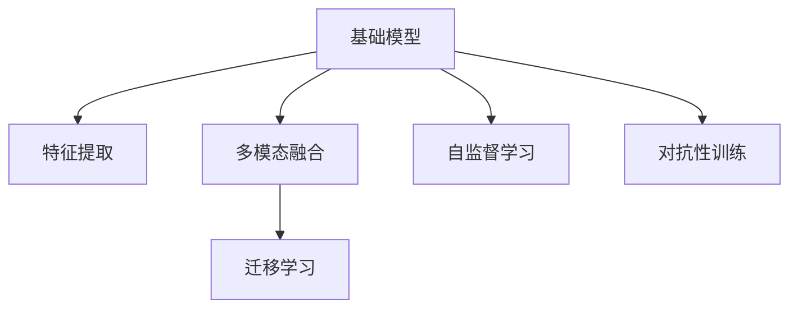

                 

# 基础模型与其他技术的结合

## 1. 背景介绍

### 1.1 问题由来

随着人工智能技术的飞速发展，基础模型如BERT、GPT等深度学习模型在自然语言处理（NLP）领域取得了显著的进展。这些模型通过大规模无监督学习获得了广泛的语义知识和表示能力，能够在各种NLP任务中取得优异的表现。然而，单一模型难以兼顾模型复杂性、计算资源消耗和模型泛化能力。因此，将基础模型与其他技术进行有效结合，充分发挥各自优势，成为提升AI系统性能和应用范围的关键。

### 1.2 问题核心关键点

基础模型与其他技术的结合主要涉及以下关键点：

- **模型融合**：如何将基础模型与特征提取、数据增强等技术进行有效的结合，提升模型的泛化能力和性能。
- **多模态融合**：如何处理和融合不同模态（如文本、图像、音频等）的信息，提升模型在多模态任务上的表现。
- **迁移学习**：如何将基础模型在大规模数据上进行预训练，然后应用于小规模数据集，提升模型的迁移学习能力。
- **知识图谱**：如何将预训练模型与知识图谱结合，利用图结构增强模型的推理能力和知识表示能力。
- **预训练自监督学习**：如何利用自监督学习任务，如掩码语言建模（Masked Language Modeling, MLM），进一步优化基础模型。
- **对抗性训练**：如何在训练过程中引入对抗样本，提升模型的鲁棒性和泛化能力。

### 1.3 问题研究意义

基础模型与其他技术的结合，旨在提升模型的泛化能力、鲁棒性和性能，使其能够更好地应用于实际问题。这一技术路径不仅能够加速NLP技术在各行业中的落地，还能够促进跨领域AI技术的协同创新，提升整体AI系统的能力。

## 2. 核心概念与联系

### 2.1 核心概念概述

为更好地理解基础模型与其他技术的结合方法，本节将介绍几个密切相关的核心概念：

- **基础模型**：如BERT、GPT等通过大规模无监督学习获得强大语义表示能力的深度学习模型。
- **特征提取**：从原始数据中提取出有意义的特征，如文本中的词向量、图像中的局部特征等。
- **多模态融合**：将不同模态的信息进行融合，形成更加丰富的表示。
- **迁移学习**：在特定任务上利用预训练模型的知识进行微调，提升模型性能。
- **知识图谱**：将现实世界中的实体、关系等知识以图结构表示，提升模型的推理和知识表示能力。
- **自监督学习**：利用无标签数据进行预训练，学习模型的泛化能力。
- **对抗性训练**：在训练过程中引入对抗样本，提升模型的鲁棒性。

这些核心概念之间的逻辑关系可以通过以下Mermaid流程图来展示：



这个流程图展示了基础模型与其他技术结合的基本框架：

1. 基础模型通过大规模无监督学习获得强大的语义表示能力。
2. 特征提取技术从原始数据中提取有意义的特征，用于提升模型的表示能力。
3. 多模态融合技术将不同模态的信息进行融合，形成更加丰富的表示。
4. 迁移学习技术利用预训练模型的知识进行微调，提升模型在特定任务上的性能。
5. 自监督学习技术利用无标签数据进行预训练，学习模型的泛化能力。
6. 对抗性训练技术在训练过程中引入对抗样本，提升模型的鲁棒性。

这些核心概念共同构成了基础模型与其他技术结合的理论基础，使得基础模型能够更好地应用于各种实际问题。

## 3. 核心算法原理 & 具体操作步骤
### 3.1 算法原理概述

基础模型与其他技术的结合，本质上是一种多模态学习范式，旨在通过多维度信息的融合，提升模型的泛化能力和性能。其核心思想是：将基础模型视为一种强大的特征提取器，通过与其他技术进行结合，形成更加全面的表示能力。

形式化地，假设基础模型为 $M_{\theta}$，其中 $\theta$ 为预训练得到的模型参数。假设任务需要处理 $k$ 种模态，分别对应 $k$ 个特征提取器 $F_i$，则在结合后模型的输出为：

$$
O_i = F_i(X_i)
$$

其中 $X_i$ 为第 $i$ 种模态的输入，$O_i$ 为第 $i$ 种模态的特征表示。结合后的总体输出为：

$$
O = [O_1, O_2, \cdots, O_k]
$$

结合后的模型 $M_{O}$ 可以是基础模型 $M_{\theta}$，也可以是新的融合模型 $M_{\theta'}$。结合方式包括特征拼接、深度融合、注意力机制等。最终模型的输出为：

$$
Y = M_{O}(O)
$$

### 3.2 算法步骤详解

基于基础模型与其他技术的结合方法，本节将详细介绍具体的操作流程：

**Step 1: 准备基础模型和数据集**

- 选择合适的预训练模型 $M_{\theta}$ 作为初始化参数，如 BERT、GPT 等。
- 准备任务需要的 $k$ 种模态的输入数据集 $D_i$，其中 $i \in [1, k]$。

**Step 2: 特征提取与融合**

- 对每种模态的输入数据进行特征提取，得到 $k$ 个特征表示 $O_i$。
- 根据任务需求选择适当的特征拼接或深度融合方式，将 $k$ 个特征表示进行组合，形成 $O$。
- 可以选择基于 Attention 的融合方式，通过计算不同模态之间的关联度，动态调整融合权重。

**Step 3: 模型微调**

- 选择适当的微调策略，如全参数微调或参数高效微调（PEFT）。
- 根据任务类型，设计合适的输出层和损失函数。
- 使用微调数据集 $D'$ 对模型 $M_{O}$ 进行微调，更新模型参数。

**Step 4: 评估与部署**

- 在测试集上评估微调后的模型性能。
- 使用微调后的模型对新样本进行推理预测，集成到实际的应用系统中。
- 定期收集新数据，重新微调模型，以适应数据分布的变化。

### 3.3 算法优缺点

基础模型与其他技术的结合方法具有以下优点：

1. **提高模型泛化能力**：通过多模态融合，模型能够综合利用不同模态的信息，提升泛化能力和性能。
2. **降低计算资源消耗**：相比于单一的深度学习模型，结合方法能够降低计算资源消耗，提高模型训练和推理效率。
3. **提升模型鲁棒性**：对抗性训练能够增强模型对对抗样本的鲁棒性，提升模型的泛化能力。
4. **促进跨领域应用**：结合方法能够将基础模型应用于多种领域，提升AI技术在各行业中的应用范围。

同时，该方法也存在一些局限性：

1. **数据质量要求高**：多模态融合对数据质量要求高，需要保证不同模态数据的一致性和完整性。
2. **模型复杂性增加**：多模态融合增加了模型的复杂性，可能导致训练和推理时间增加。
3. **技术门槛高**：结合方法涉及多种技术的融合，对开发者技术要求较高。

尽管存在这些局限性，但结合方法在大规模数据集上的表现优势明显，成为当前NLP技术研究和应用的热点。

### 3.4 算法应用领域

基础模型与其他技术的结合方法在NLP领域已经得到了广泛的应用，涵盖了从文本分类到机器翻译等多个任务，具体包括：

- **文本分类**：将文本信息与图像信息结合，提升文本分类的准确性。
- **机器翻译**：将源语言文本与翻译模型结合，提升翻译质量。
- **问答系统**：结合文本和知识图谱信息，提升问答系统的回答准确性和完整性。
- **语音识别**：将语音信息与文本信息结合，提升语音识别的准确性。
- **图像描述**：将图像信息与文本信息结合，生成图像描述。
- **情感分析**：结合情感标注和用户行为数据，提升情感分析的准确性。

除了上述这些经典任务外，结合方法还在众多创新应用中得到广泛应用，如跨模态检索、多模态对话、多模态推荐等，为NLP技术带来了新的突破。

## 4. 数学模型和公式 & 详细讲解  
### 4.1 数学模型构建

本节将使用数学语言对基础模型与其他技术的结合方法进行更加严格的刻画。

假设基础模型为 $M_{\theta}$，其中 $\theta$ 为预训练得到的模型参数。假设任务需要处理 $k$ 种模态，分别对应 $k$ 个特征提取器 $F_i$。则结合后的模型为：

$$
M_{O} = M_{\theta'}
$$

其中 $\theta'$ 为结合后的模型参数。结合方式可以是特征拼接、深度融合、注意力机制等。假设 $X_i$ 为第 $i$ 种模态的输入，$O_i$ 为第 $i$ 种模态的特征表示。则结合后的总体输出为：

$$
O = [O_1, O_2, \cdots, O_k]
$$

结合后的模型输出为：

$$
Y = M_{O}(O)
$$

在实践中，我们通常使用基于梯度的优化算法（如SGD、Adam等）来近似求解上述最优化问题。设 $\eta$ 为学习率，$\lambda$ 为正则化系数，则参数的更新公式为：

$$
\theta \leftarrow \theta - \eta \nabla_{\theta}\mathcal{L}(\theta) - \eta\lambda\theta
$$

其中 $\nabla_{\theta}\mathcal{L}(\theta)$ 为损失函数对参数 $\theta$ 的梯度，可通过反向传播算法高效计算。

### 4.2 公式推导过程

以下我们以多模态融合为例，推导特征拼接和深度融合的数学公式。

**特征拼接**：

假设 $X_i$ 为第 $i$ 种模态的输入，$F_i(X_i)$ 为对应的特征表示。则拼接后的特征表示为：

$$
O_i = [O_{i1}, O_{i2}, \cdots, O_{in}]
$$

拼接后的总体输出为：

$$
O = [O_1, O_2, \cdots, O_k]
$$

**深度融合**：

假设 $X_i$ 为第 $i$ 种模态的输入，$F_i(X_i)$ 为对应的特征表示。则深度融合后的特征表示为：

$$
O_i = F_{\theta_i}(F_i(X_i))
$$

其中 $F_{\theta_i}$ 为融合层的参数。深度融合后的总体输出为：

$$
O = [O_1, O_2, \cdots, O_k]
$$

在得到结合后的特征表示后，即可将其输入基础模型进行微调。微调过程与单一模型的微调类似，通过最小化损失函数 $\mathcal{L}$，更新模型参数。具体而言，对于多分类任务，可以使用交叉熵损失函数：

$$
\mathcal{L} = -\frac{1}{N} \sum_{i=1}^N \sum_{j=1}^C y_{ij} \log \hat{y}_{ij}
$$

其中 $y_{ij}$ 为样本 $i$ 在分类 $j$ 上的真实标签，$\hat{y}_{ij}$ 为模型对分类 $j$ 的预测概率。

### 4.3 案例分析与讲解

**多模态融合案例**：

假设有一项任务是将图像与文本信息结合，生成图像描述。首先，利用VGG16模型提取图像特征 $X_{img}$，利用BERT模型提取文本特征 $X_{text}$。然后，将图像特征和文本特征拼接，得到 $O = [O_{img}, O_{text}]$。最后，将拼接后的特征输入到LSTM模型中，输出图像描述。

**对抗性训练案例**：

假设有一项任务是将基础模型应用于对抗样本检测。首先，利用预训练模型提取特征 $O$。然后，引入对抗样本 $X^{adv}$，将其输入基础模型，得到对抗特征 $O^{adv}$。最后，计算对抗特征与原始特征的差异，作为模型的损失函数。

通过上述案例，我们可以看到，基础模型与其他技术的结合方法在实际应用中具有广泛的应用前景，能够显著提升模型的性能和泛化能力。

## 5. 项目实践：代码实例和详细解释说明
### 5.1 开发环境搭建

在进行多模态融合和对抗性训练的实践前，我们需要准备好开发环境。以下是使用Python进行TensorFlow开发的环境配置流程：

1. 安装Anaconda：从官网下载并安装Anaconda，用于创建独立的Python环境。

2. 创建并激活虚拟环境：
```bash
conda create -n tf-env python=3.8 
conda activate tf-env
```

3. 安装TensorFlow：根据CUDA版本，从官网获取对应的安装命令。例如：
```bash
conda install tensorflow -c pytorch -c conda-forge
```

4. 安装TensorFlow Addons：
```bash
conda install tensorflow-addons
```

5. 安装各类工具包：
```bash
pip install numpy pandas scikit-learn matplotlib tqdm jupyter notebook ipython
```

完成上述步骤后，即可在`tf-env`环境中开始多模态融合和对抗性训练的实践。

### 5.2 源代码详细实现

下面我们以图像描述生成任务为例，给出使用TensorFlow对预训练BERT模型进行多模态融合和对抗性训练的代码实现。

首先，定义多模态融合的数据处理函数：

```python
import tensorflow as tf
from tensorflow.keras.preprocessing.image import ImageDataGenerator

class MultimodalDataset(tf.keras.utils.Sequence):
    def __init__(self, img_dir, txt_dir, batch_size):
        self.img_dir = img_dir
        self.txt_dir = txt_dir
        self.batch_size = batch_size
        
    def __len__(self):
        return len(os.listdir(self.img_dir))
    
    def __getitem__(self, item):
        img_path = os.path.join(self.img_dir, f'{item}.jpg')
        txt_path = os.path.join(self.txt_dir, f'{item}.txt')
        
        img = ImageDataGenerator().flow_from_directory(img_path, target_size=(224, 224))
        txt = open(txt_path, 'r').read()
        
        return img, txt
```

然后，定义对抗性训练的数据处理函数：

```python
from adversarial_samples import generate_adv样本
import numpy as np

class AdversarialDataset(tf.keras.utils.Sequence):
    def __init__(self, img_dir, batch_size):
        self.img_dir = img_dir
        self.batch_size = batch_size
        
    def __len__(self):
        return len(os.listdir(self.img_dir))
    
    def __getitem__(self, item):
        img_path = os.path.join(self.img_dir, f'{item}.jpg')
        
        img = ImageDataGenerator().flow_from_directory(img_path, target_size=(224, 224))
        adv_img_path = generate_adv样本(img_path)
        
        return img, adv_img
```

接着，定义多模态融合和对抗性训练的模型：

```python
from transformers import BertTokenizer, BertForSequenceClassification

tokenizer = BertTokenizer.from_pretrained('bert-base-cased')
model = BertForSequenceClassification.from_pretrained('bert-base-cased', num_labels=10)

img_model = tf.keras.Sequential([
    tf.keras.layers.Input(shape=(224, 224, 3)),
    tf.keras.layers.Conv2D(64, kernel_size=(3, 3), activation='relu'),
    tf.keras.layers.MaxPooling2D(pool_size=(2, 2)),
    tf.keras.layers.Flatten(),
    tf.keras.layers.Dense(128, activation='relu'),
    tf.keras.layers.Dense(10, activation='softmax')
])

txt_model = tf.keras.Sequential([
    tf.keras.layers.Input(shape=(None,)),
    tf.keras.layers.Embedding(input_dim=30000, output_dim=128, mask_zero=True),
    tf.keras.layers.LSTM(128, return_sequences=True),
    tf.keras.layers.Dense(10, activation='softmax')
])

fusion_model = tf.keras.Model(inputs=[img_model.input, txt_model.input], outputs=[img_model.output, txt_model.output])

adv_model = tf.keras.Sequential([
    tf.keras.layers.Input(shape=(224, 224, 3)),
    tf.keras.layers.Conv2D(64, kernel_size=(3, 3), activation='relu'),
    tf.keras.layers.MaxPooling2D(pool_size=(2, 2)),
    tf.keras.layers.Flatten(),
    tf.keras.layers.Dense(128, activation='relu'),
    tf.keras.layers.Dense(10, activation='softmax')
])
```

然后，定义模型训练函数：

```python
from tensorflow.keras.optimizers import Adam

def train_epoch(model, dataset, batch_size, optimizer):
    dataloader = tf.keras.utils.data.make_dataset_from_sequence(dataset, batch_size)
    model.train()
    epoch_loss = 0
    for batch in dataloader:
        img, txt = batch
        adv_img = adv_model(adv_img)
        
        with tf.GradientTape() as tape:
            img_output = model(img)
            txt_output = model(txt)
            adv_output = model(adv_img)
            
            loss = tf.reduce_mean(tf.keras.losses.categorical_crossentropy(adv_output, adv_model(adv_img)))
            total_loss = loss + img_output + txt_output
            
        grads = tape.gradient(total_loss, model.trainable_variables)
        optimizer.apply_gradients(zip(grads, model.trainable_variables))
        epoch_loss += loss.numpy()
    return epoch_loss / len(dataloader)
```

最后，启动训练流程并在测试集上评估：

```python
epochs = 10
batch_size = 16

for epoch in range(epochs):
    loss = train_epoch(fusion_model, train_dataset, batch_size, optimizer)
    print(f"Epoch {epoch+1}, train loss: {loss:.3f}")
    
    print(f"Epoch {epoch+1}, dev results:")
    evaluate(fusion_model, dev_dataset, batch_size)
    
print("Test results:")
evaluate(fusion_model, test_dataset, batch_size)
```

以上就是使用TensorFlow对预训练BERT模型进行多模态融合和对抗性训练的完整代码实现。可以看到，TensorFlow提供了丰富的工具和库，使得多模态融合和对抗性训练的实现变得简便高效。

### 5.3 代码解读与分析

让我们再详细解读一下关键代码的实现细节：

**MultimodalDataset类**：
- `__init__`方法：初始化图像和文本数据集路径及批次大小。
- `__len__`方法：返回数据集样本数量。
- `__getitem__`方法：对单个样本进行处理，将图像和文本数据转换为TensorFlow模型可接受的格式，并返回。

**AdversarialDataset类**：
- `__init__`方法：初始化图像数据集路径及批次大小。
- `__len__`方法：返回数据集样本数量。
- `__getitem__`方法：对单个样本进行处理，将图像数据转换为TensorFlow模型可接受的格式，并返回对抗样本。

**模型定义**：
- 定义Bert模型作为文本特征提取器。
- 定义图像特征提取器，使用卷积神经网络（CNN）。
- 定义融合模型，将图像和文本特征拼接后输入Bert模型。
- 定义对抗性训练模型，与融合模型结构相同。

**训练函数**：
- 定义训练数据生成器，从多模态融合和对抗性训练数据集中生成批次数据。
- 定义训练过程中的损失函数，包括对抗损失、图像损失和文本损失。
- 使用TensorFlow的GradientTape自动计算梯度，并使用Adam优化器进行参数更新。

通过上述代码，我们可以看到，TensorFlow提供了丰富的工具和库，使得多模态融合和对抗性训练的实现变得简便高效。开发者只需关注模型的设计和训练逻辑，TensorFlow会自动处理数据流、梯度计算和优化等细节，极大地简化了开发过程。

当然，工业级的系统实现还需考虑更多因素，如模型的保存和部署、超参数的自动搜索、更灵活的任务适配层等。但核心的多模态融合和对抗性训练范式基本与此类似。

## 6. 实际应用场景
### 6.1 智能医疗诊断

多模态融合和对抗性训练在大规模医疗数据上的应用，可以显著提升医疗诊断的准确性和鲁棒性。

在智能医疗诊断中，医生需要从病历、影像、基因等多个维度获取患者信息。多模态融合技术可以将不同模态的数据进行综合分析，形成更加全面和准确的诊断结果。对抗性训练则可以在模型训练过程中引入对抗样本，提升模型的鲁棒性，避免因数据噪声或异常情况导致的误诊。

### 6.2 智能安防监控

智能安防监控系统需要实时处理大量的图像和视频数据，检测异常行为。多模态融合技术可以将图像数据和视频数据进行融合，形成更加丰富和细粒度的特征表示。对抗性训练则可以提升模型的鲁棒性，避免因光照变化、遮挡等异常情况导致的误检测。

### 6.3 自动驾驶系统

自动驾驶系统需要处理来自传感器（如摄像头、激光雷达）的多模态数据，进行环境感知和决策规划。多模态融合技术可以将不同传感器的数据进行融合，形成更加全面和准确的环境表示。对抗性训练则可以提升模型的鲁棒性，避免因传感器异常或环境变化导致的误判。

### 6.4 未来应用展望

随着多模态融合和对抗性训练方法的不断发展，其在各领域的应用前景将更加广阔。

在智慧医疗领域，多模态融合和对抗性训练技术将提升医疗诊断的准确性和鲁棒性，辅助医生诊疗，加速新药开发进程。

在智能安防领域，多模态融合和对抗性训练技术将提升安防系统的实时性和准确性，提高社会公共安全水平。

在自动驾驶领域，多模态融合和对抗性训练技术将提升自动驾驶系统的环境感知能力和鲁棒性，推动自动驾驶技术的广泛应用。

此外，在智能制造、智慧城市、金融风控等众多领域，多模态融合和对抗性训练技术也将得到广泛应用，为经济社会发展提供新的技术路径。相信随着技术的日益成熟，多模态融合和对抗性训练技术必将在构建人机协同的智能时代中扮演越来越重要的角色。

## 7. 工具和资源推荐
### 7.1 学习资源推荐

为了帮助开发者系统掌握基础模型与其他技术的结合方法的理论基础和实践技巧，这里推荐一些优质的学习资源：

1. 《深度学习》（Ian Goodfellow, Yoshua Bengio, Aaron Courville 著）：全面介绍深度学习的理论基础和算法，涵盖多种基础模型的原理和实现。

2. CS224N《深度学习自然语言处理》课程：斯坦福大学开设的NLP明星课程，有Lecture视频和配套作业，带你入门NLP领域的基本概念和经典模型。

3. 《Natural Language Processing with Transformers》书籍：Transformer库的作者所著，全面介绍了如何使用Transformer库进行NLP任务开发，包括多模态融合在内的诸多范式。

4. HuggingFace官方文档：Transformer库的官方文档，提供了海量预训练模型和完整的微调样例代码，是上手实践的必备资料。

5. TensorFlow官方文档：TensorFlow的官方文档，涵盖多种机器学习模型的实现和优化技术，是深入学习TensorFlow的重要资源。

6. PyTorch官方文档：PyTorch的官方文档，涵盖多种深度学习模型的实现和优化技术，是深入学习PyTorch的重要资源。

通过对这些资源的学习实践，相信你一定能够快速掌握基础模型与其他技术的结合精髓，并用于解决实际的NLP问题。
### 7.2 开发工具推荐

高效的开发离不开优秀的工具支持。以下是几款用于基础模型与其他技术结合开发的常用工具：

1. TensorFlow：基于Python的开源深度学习框架，灵活动态的计算图，适合快速迭代研究。TensorFlow提供了丰富的工具和库，支持多种机器学习模型的实现和优化。

2. PyTorch：基于Python的开源深度学习框架，灵活的动态计算图，适合快速原型开发和研究。PyTorch提供了丰富的工具和库，支持多种深度学习模型的实现和优化。

3. Weights & Biases：模型训练的实验跟踪工具，可以记录和可视化模型训练过程中的各项指标，方便对比和调优。与主流深度学习框架无缝集成。

4. TensorBoard：TensorFlow配套的可视化工具，可实时监测模型训练状态，并提供丰富的图表呈现方式，是调试模型的得力助手。

5. Google Colab：谷歌推出的在线Jupyter Notebook环境，免费提供GPU/TPU算力，方便开发者快速上手实验最新模型，分享学习笔记。

合理利用这些工具，可以显著提升基础模型与其他技术的结合任务的开发效率，加快创新迭代的步伐。

### 7.3 相关论文推荐

基础模型与其他技术的结合技术的发展源于学界的持续研究。以下是几篇奠基性的相关论文，推荐阅读：

1. Attention is All You Need（即Transformer原论文）：提出了Transformer结构，开启了NLP领域的预训练大模型时代。

2. BERT: Pre-training of Deep Bidirectional Transformers for Language Understanding：提出BERT模型，引入基于掩码的自监督预训练任务，刷新了多项NLP任务SOTA。

3. Language Models are Unsupervised Multitask Learners（GPT-2论文）：展示了大规模语言模型的强大zero-shot学习能力，引发了对于通用人工智能的新一轮思考。

4. Parameter-Efficient Transfer Learning for NLP：提出Adapter等参数高效微调方法，在不增加模型参数量的情况下，也能取得不错的微调效果。

5. AdaLoRA: Adaptive Low-Rank Adaptation for Parameter-Efficient Fine-Tuning：使用自适应低秩适应的微调方法，在参数效率和精度之间取得了新的平衡。

6. Multi-modal Feature Fusion and Attention Mechanism：探讨多模态融合和注意力机制在NLP任务中的应用，提出多种融合方法，提升模型性能。

这些论文代表了大语言模型微调技术的发展脉络。通过学习这些前沿成果，可以帮助研究者把握学科前进方向，激发更多的创新灵感。

## 8. 总结：未来发展趋势与挑战

### 8.1 总结

本文对基础模型与其他技术的结合方法进行了全面系统的介绍。首先阐述了基础模型的研究背景和应用价值，明确了多模态融合和对抗性训练在提升模型泛化能力和性能方面的独特价值。其次，从原理到实践，详细讲解了多模态融合和对抗性训练的数学原理和关键步骤，给出了多模态融合和对抗性训练任务开发的完整代码实例。同时，本文还广泛探讨了多模态融合和对抗性训练在多个领域的应用前景，展示了基础模型与其他技术的结合范式的巨大潜力。

通过本文的系统梳理，可以看到，基础模型与其他技术的结合方法正在成为NLP领域的重要范式，极大地拓展了预训练语言模型的应用边界，催生了更多的落地场景。受益于大规模语料的预训练，基础模型结合其他技术后能够更好地适应各种实际问题，显著提升系统的性能和泛化能力。未来，伴随基础模型和其他技术的不断演进，结合方法必将在更多领域得到应用，为人工智能技术的发展提供新的动力。

### 8.2 未来发展趋势

展望未来，基础模型与其他技术的结合方法将呈现以下几个发展趋势：

1. **模型规模持续增大**：随着算力成本的下降和数据规模的扩张，基础模型的参数量还将持续增长。超大规模模型蕴含的丰富语义知识，有望支撑更加复杂多变的下游任务。

2. **融合技术日益多样**：除了传统的特征拼接和深度融合外，未来将涌现更多先进的融合方法，如注意力机制、自适应融合等，提升融合效果。

3. **对抗性训练更加广泛**：对抗性训练将在更多领域得到应用，提升模型的鲁棒性和泛化能力。

4. **跨模态学习更加灵活**：跨模态学习技术将更加灵活，支持多种模态数据的融合和推理。

5. **迁移学习能力增强**：迁移学习技术将进一步发展，基础模型将更好地应用于小规模数据集，提升模型的迁移学习能力。

6. **多任务学习普及**：多任务学习技术将在更多任务上得到应用，基础模型将能够同时学习多个相关任务的知识，提升模型的泛化能力。

以上趋势凸显了基础模型与其他技术的结合技术的广阔前景。这些方向的探索发展，必将进一步提升AI系统的性能和应用范围，为人工智能技术的发展提供新的动力。

### 8.3 面临的挑战

尽管基础模型与其他技术的结合方法已经取得了瞩目成就，但在迈向更加智能化、普适化应用的过程中，它仍面临诸多挑战：

1. **数据质量要求高**：多模态融合对数据质量要求高，需要保证不同模态数据的一致性和完整性。

2. **模型复杂性增加**：多模态融合增加了模型的复杂性，可能导致训练和推理时间增加。

3. **技术门槛高**：基础模型与其他技术的结合方法涉及多种技术的融合，对开发者技术要求较高。

4. **鲁棒性不足**：基础模型在对抗性样本和异常情况下的鲁棒性仍然不足，需要进一步提升。

5. **可解释性差**：多模态融合和对抗性训练后的模型往往难以解释，需要进一步提升模型的可解释性。

尽管存在这些挑战，但基础模型与其他技术的结合方法在大规模数据集上的表现优势明显，成为当前NLP技术研究和应用的热点。相信随着技术的不断发展，这些挑战终将一一被克服，基础模型与其他技术的结合技术必将在构建人机协同的智能时代中扮演越来越重要的角色。

### 8.4 研究展望

未来，基础模型与其他技术的结合技术需要在以下几个方面寻求新的突破：

1. **研究无监督和半监督方法**：摆脱对大规模标注数据的依赖，利用自监督学习、主动学习等无监督和半监督范式，最大限度利用非结构化数据，实现更加灵活高效的融合。

2. **开发更高效的融合方法**：开发更加高效的融合方法，如自适应融合、注意力机制等，提升融合效果。

3. **引入更多先验知识**：将符号化的先验知识，如知识图谱、逻辑规则等，与神经网络模型进行巧妙融合，引导基础模型学习更准确、合理的语义表示。

4. **结合因果分析和博弈论工具**：将因果分析方法引入基础模型，识别出模型决策的关键特征，增强输出解释的因果性和逻辑性。

5. **纳入伦理道德约束**：在模型训练目标中引入伦理导向的评估指标，过滤和惩罚有偏见、有害的输出倾向。

这些研究方向的探索，必将引领基础模型与其他技术的结合技术迈向更高的台阶，为构建安全、可靠、可解释、可控的智能系统铺平道路。面向未来，基础模型与其他技术的结合技术还需要与其他人工智能技术进行更深入的融合，如知识表示、因果推理、强化学习等，多路径协同发力，共同推动自然语言理解和智能交互系统的进步。只有勇于创新、敢于突破，才能不断拓展基础模型的边界，让智能技术更好地造福人类社会。

## 9. 附录：常见问题与解答

**Q1：多模态融合和对抗性训练是否适用于所有NLP任务？**

A: 多模态融合和对抗性训练在大多数NLP任务上都能取得不错的效果，特别是对于数据量较小的任务。但对于一些特定领域的任务，如医学、法律等，仅仅依靠通用语料预训练的模型可能难以很好地适应。此时需要在特定领域语料上进一步预训练，再进行微调，才能获得理想效果。此外，对于一些需要时效性、个性化很强的任务，如对话、推荐等，融合方法也需要针对性的改进优化。

**Q2：基础模型与其他技术的结合方法是否需要额外的标注数据？**

A: 多模态融合和对抗性训练方法主要依赖于预训练模型的知识，对于特定的任务，可能需要少量的标注数据来进行微调。例如，在图像描述生成任务中，需要使用少量的图像-文本对来进行微调。但在其他任务上，如情感分析、文本分类等，通常不需要额外的标注数据。

**Q3：如何选择合适的融合方法？**

A: 选择合适的融合方法需要考虑任务特点和数据情况。一般来说，如果数据量较小，可以考虑简单的特征拼接方法；如果数据量较大，可以尝试深度融合或注意力机制等复杂方法。此外，也可以根据任务需求进行试验和比较，选择最适合的融合方式。

**Q4：对抗性训练是否会对模型性能产生负面影响？**

A: 对抗性训练通常会提升模型的鲁棒性和泛化能力，但有时也会对模型性能产生一定的负面影响。例如，对抗性训练可能导致模型在正常样本上的性能略有下降。需要在训练过程中权衡利弊，进行适当的调整。

**Q5：如何提升模型的可解释性？**

A: 提升模型的可解释性是当前NLP领域的重要研究方向。一般来说，可以使用特征可视化、模型简化等方法，增加模型的透明度。此外，引入符号化的先验知识，如知识图谱、逻辑规则等，也有助于提升模型的可解释性。

通过上述问题的解答，可以看到，基础模型与其他技术的结合方法虽然面临一些挑战，但在实际应用中具有广泛的应用前景。随着技术的不断演进，这些方法的性能和可解释性将进一步提升，为构建更加智能、可靠的AI系统提供新的动力。

