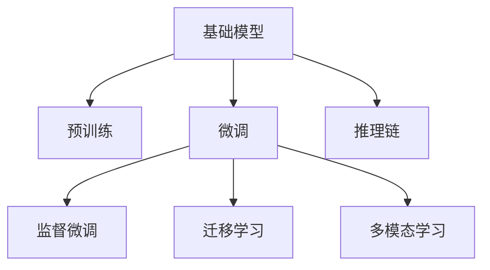

                 

# 基础模型在法律、医疗、教育中的应用

## 1. 背景介绍

### 1.1 问题由来

随着人工智能技术的快速发展，基础模型（Foundation Model）已经在大规模应用场景中展现出了其强大的潜力。这些模型通常基于自监督或监督学习的预训练技术，通过大规模无标签或标签数据训练，具备了良好的泛化能力和迁移学习能力。它们可以用于各类任务，从文本分类到生成式任务，从推理到对话，展现了惊人的多样性和实用性。

在法律、医疗、教育等垂直领域，基础模型同样有着广泛的应用。法律行业需要对文本进行分类、归档和分析，以支持律师和法官的工作；医疗行业需要处理患者信息、诊断报告和病历数据；教育行业则需要对学生成绩、学习内容和互动进行分析和优化。这些领域对信息的精确性和可靠性要求非常高，而基础模型的应用能够显著提高效率，降低人工成本，同时保障数据的准确性和保密性。

### 1.2 问题核心关键点

基础模型在这些垂直领域的应用，主要集中在以下几个方面：

- **数据处理与分析**：对海量文本数据进行高效处理，识别关键信息，提供结构化的分析结果。
- **智能辅助决策**：提供辅助决策支持，通过理解和解释文本内容，帮助专业人士做出更准确的判断。
- **个性化服务**：根据用户需求和偏好，提供定制化的信息和服务。
- **跨领域知识融合**：结合不同领域的专业知识，提升模型的综合推理能力。

本文将重点探讨基础模型在法律、医疗、教育中的具体应用，阐述其核心概念、算法原理及操作步骤，并分析其优缺点及未来发展方向。

## 2. 核心概念与联系

### 2.1 核心概念概述

为了更好地理解基础模型在法律、医疗、教育中的应用，本节将介绍几个关键概念及其相互关系：

- **基础模型（Foundation Model）**：基于大规模预训练的无监督或监督学习模型，具备了强大的语义理解能力和泛化能力。
- **预训练（Pre-training）**：在大规模无标签文本数据上进行的自监督学习，通过自回归或掩码语言模型等任务训练，学习语言的通用表示。
- **微调（Fine-tuning）**：在有标签数据上进行的监督学习，通过调整模型参数，使其能够适应特定任务。
- **迁移学习（Transfer Learning）**：将预训练模型的知识迁移到新任务上，通过微调或迁移学习范式，提升模型在新领域的性能。
- **多模态学习（Multimodal Learning）**：结合不同类型的数据，如图像、声音和文本，提升模型的综合推理能力。
- **推理链（Inference Chain）**：涉及多步骤推理的任务，通过模型链的形式，逐步推导最终结果。

这些概念之间的逻辑关系可以通过以下Mermaid流程图来展示：



这个流程图展示了大模型从预训练到微调的整个流程，以及其在多模态推理中的应用。

## 3. 核心算法原理 & 具体操作步骤

### 3.1 算法原理概述

基础模型在法律、医疗、教育中的应用，主要依赖于其强大的语义理解能力和泛化能力。这些模型通过大规模预训练，学习到了通用的语言表示，然后通过微调和迁移学习，适配到具体的垂直领域任务中。

以法律领域的案例为例，基础模型可以被用于文本分类、合同分析、法律咨询等领域。在文本分类任务中，模型会根据训练集的标注数据，学习如何将不同类别的法律文本区分开来。在合同分析任务中，模型能够识别合同中的关键条款和条件，帮助律师快速定位合同内容。在法律咨询任务中，模型能够理解用户的法律问题，提供相关法律法规的解释和建议。

在医疗领域，基础模型可以用于病历分析、诊断辅助、健康监测等领域。在病历分析任务中，模型能够分析患者的病历数据，提取关键症状和病史信息，辅助医生进行诊断。在诊断辅助任务中，模型能够根据患者的症状描述，提供可能的诊断结果和治疗方案。在健康监测任务中，模型能够分析用户的健康数据，提供个性化的健康建议。

在教育领域，基础模型可以用于自动评分、学习分析、智能辅导等领域。在自动评分任务中，模型能够根据学生的答案和标准答案，自动评估学生的作业成绩。在学习分析任务中，模型能够分析学生的学习行为和成绩，提供个性化的学习建议。在智能辅导任务中，模型能够根据学生的学习情况，提供个性化的学习内容和建议。

### 3.2 算法步骤详解

基础模型在法律、医疗、教育中的应用，通常包括以下几个关键步骤：

**Step 1: 准备数据集**

- **法律领域**：准备法律文本数据，如判决书、合同、法规等，并进行数据清洗和标注。
- **医疗领域**：准备医疗数据，如病历、诊断报告、健康监测数据等，并进行数据清洗和标注。
- **教育领域**：准备教育数据，如作业、考试、学习行为记录等，并进行数据清洗和标注。

**Step 2: 数据预处理**

- **法律领域**：将法律文本数据进行分词、去除停用词、词性标注等预处理。
- **医疗领域**：将医疗数据进行清洗、归一化、特征提取等预处理。
- **教育领域**：将教育数据进行清洗、特征提取、数据增强等预处理。

**Step 3: 模型选择与预训练**

- **法律领域**：选择适合的预训练模型，如BERT、RoBERTa、GPT等，进行预训练。
- **医疗领域**：选择适合的预训练模型，如MED-SAT、ClinicalBERT等，进行预训练。
- **教育领域**：选择适合的预训练模型，如SCAMT、e-DUCM等，进行预训练。

**Step 4: 模型微调**

- **法律领域**：在有标签的法律数据上进行微调，调整模型参数以适应特定的法律任务。
- **医疗领域**：在有标签的医疗数据上进行微调，调整模型参数以适应特定的医疗任务。
- **教育领域**：在有标签的教育数据上进行微调，调整模型参数以适应特定的教育任务。

**Step 5: 模型评估与优化**

- **法律领域**：在验证集上评估模型性能，调整模型参数以提高模型的准确率和召回率。
- **医疗领域**：在验证集上评估模型性能，调整模型参数以提高模型的精确度和召回率。
- **教育领域**：在验证集上评估模型性能，调整模型参数以提高模型的准确率和F1分数。

**Step 6: 模型部署与监控**

- **法律领域**：将训练好的模型部署到生产环境，进行实时推理和评估。
- **医疗领域**：将训练好的模型部署到生产环境，进行实时推理和评估。
- **教育领域**：将训练好的模型部署到生产环境，进行实时推理和评估。

### 3.3 算法优缺点

基础模型在法律、医疗、教育中的应用，具有以下优点：

- **高效性**：基础模型能够处理大规模的数据集，快速完成文本分析、诊断和评估任务。
- **准确性**：基础模型通过大规模预训练，具备了较高的准确率和泛化能力，能够提供可靠的分析结果。
- **灵活性**：基础模型能够适配到多种垂直领域任务中，具有较强的跨领域迁移能力。
- **可扩展性**：基础模型可以通过微调和迁移学习，不断提升其性能和适用范围。

同时，这些模型也存在以下缺点：

- **数据依赖**：模型的性能依赖于标注数据的质量和数量，数据标注成本较高。
- **隐私问题**：在处理敏感数据时，需要考虑数据的隐私保护问题。
- **模型复杂性**：模型结构复杂，训练和推理过程较慢，对计算资源要求较高。
- **可解释性不足**：基础模型的内部机制复杂，难以解释其推理过程和决策逻辑。

## 4. 数学模型和公式 & 详细讲解

### 4.1 数学模型构建

在法律、医疗、教育领域，基础模型通常采用监督学习和迁移学习的范式。以法律领域的文本分类任务为例，我们定义模型 $M_{\theta}$，其中 $\theta$ 为模型参数，输入 $x$ 为法律文本，输出 $y$ 为分类标签。模型通过预训练和微调，学习从输入 $x$ 到输出 $y$ 的映射关系。

### 4.2 公式推导过程

以法律领域的文本分类任务为例，模型的损失函数可以定义为：

$$
\mathcal{L}(\theta) = -\frac{1}{N}\sum_{i=1}^N [y_i \log p(y_i|x_i)]
$$

其中 $p(y_i|x_i)$ 表示模型在输入 $x_i$ 下的预测概率分布。通过最小化损失函数，模型能够学习到输入和输出之间的映射关系。

在微调过程中，模型的参数更新公式为：

$$
\theta \leftarrow \theta - \eta \nabla_{\theta}\mathcal{L}(\theta)
$$

其中 $\eta$ 为学习率，$\nabla_{\theta}\mathcal{L}(\theta)$ 为损失函数对模型参数的梯度。

### 4.3 案例分析与讲解

以法律领域的合同分析任务为例，模型需要识别合同中的关键条款和条件，帮助律师快速定位合同内容。模型的输入为合同文本，输出为合同中的关键条款和条件。通过预训练和微调，模型能够学习到合同中的关键术语和结构，从而准确地定位和提取合同内容。

## 5. 项目实践：代码实例和详细解释说明

### 5.1 开发环境搭建

在法律、医疗、教育领域，基础模型的应用需要搭建相应的开发环境。以下是一些常用的开发工具和环境配置：

- **法律领域**：可以使用Python和PyTorch进行开发，结合BERT、RoBERTa等预训练模型进行微调。
- **医疗领域**：可以使用Python和TensorFlow进行开发，结合MED-SAT、ClinicalBERT等预训练模型进行微调。
- **教育领域**：可以使用Python和Transformers进行开发，结合SCAMT、e-DUCM等预训练模型进行微调。

### 5.2 源代码详细实现

以法律领域的合同分析任务为例，以下是使用PyTorch和BERT进行微调的Python代码实现：

```python
import torch
import torch.nn as nn
import torch.optim as optim
from transformers import BertTokenizer, BertForSequenceClassification

# 准备数据集
train_dataset = ...
val_dataset = ...
test_dataset = ...

# 准备模型和优化器
model = BertForSequenceClassification.from_pretrained('bert-base-cased', num_labels=10)
optimizer = optim.Adam(model.parameters(), lr=2e-5)

# 定义损失函数
def compute_loss(model, inputs, labels):
    outputs = model(**inputs)
    loss_fct = nn.CrossEntropyLoss()
    loss = loss_fct(outputs.logits, labels)
    return loss

# 定义微调过程
def fine_tune(model, train_dataset, val_dataset, num_epochs, batch_size):
    model.train()
    for epoch in range(num_epochs):
        total_loss = 0
        for batch in train_dataset:
            inputs = {key: torch.tensor(val).to(device) for key, val in batch.items()}
            labels = torch.tensor(batch['labels']).to(device)
            loss = compute_loss(model, inputs, labels)
            optimizer.zero_grad()
            loss.backward()
            optimizer.step()
            total_loss += loss.item()

        model.eval()
        with torch.no_grad():
            total_loss_val = 0
            for batch in val_dataset:
                inputs = {key: torch.tensor(val).to(device) for key, val in batch.items()}
                labels = torch.tensor(batch['labels']).to(device)
                loss = compute_loss(model, inputs, labels)
                total_loss_val += loss.item()

        print(f'Epoch {epoch+1}, train loss: {total_loss/len(train_dataset)}')
        print(f'Epoch {epoch+1}, val loss: {total_loss_val/len(val_dataset)}')
```

### 5.3 代码解读与分析

在上述代码中，我们使用了BertForSequenceClassification模型进行合同分析任务的微调。通过定义损失函数和优化器，模型在训练集上不断更新参数，在验证集上评估性能。通过反复迭代，模型能够逐步提高对合同文本的分类准确率。

## 6. 实际应用场景

### 6.1 法律领域

在法律领域，基础模型可以应用于以下场景：

- **文本分类**：将法律文本分为不同的类别，如民事、刑事、行政等。
- **合同分析**：识别合同中的关键条款和条件，提供合同摘要和分析报告。
- **法律咨询**：根据用户的法律问题，提供相关的法律法规和解释。

### 6.2 医疗领域

在医疗领域，基础模型可以应用于以下场景：

- **病历分析**：提取患者的病历信息，分析病情和治疗效果。
- **诊断辅助**：根据患者的症状描述，提供可能的诊断结果和治疗方案。
- **健康监测**：分析用户的健康数据，提供个性化的健康建议。

### 6.3 教育领域

在教育领域，基础模型可以应用于以下场景：

- **自动评分**：根据学生的答案和标准答案，自动评估学生的作业成绩。
- **学习分析**：分析学生的学习行为和成绩，提供个性化的学习建议。
- **智能辅导**：根据学生的学习情况，提供个性化的学习内容和建议。

## 7. 工具和资源推荐

### 7.1 学习资源推荐

为了帮助开发者系统掌握基础模型在法律、医疗、教育中的应用，这里推荐一些优质的学习资源：

- **法律领域**：推荐阅读《法律人工智能：基于Python和TensorFlow的法律应用》一书，了解法律领域中基础模型的应用。
- **医疗领域**：推荐阅读《人工智能在医疗中的应用：深度学习和计算机视觉》一书，了解医疗领域中基础模型的应用。
- **教育领域**：推荐阅读《教育大数据：基于Python和Scikit-Learn的机器学习应用》一书，了解教育领域中基础模型的应用。

### 7.2 开发工具推荐

在法律、医疗、教育领域，基础模型的应用通常使用以下工具：

- **法律领域**：可以使用Python和PyTorch进行开发，结合BERT、RoBERTa等预训练模型进行微调。
- **医疗领域**：可以使用Python和TensorFlow进行开发，结合MED-SAT、ClinicalBERT等预训练模型进行微调。
- **教育领域**：可以使用Python和Transformers进行开发，结合SCAMT、e-DUCM等预训练模型进行微调。

### 7.3 相关论文推荐

为了深入了解基础模型在法律、医疗、教育中的应用，可以阅读以下论文：

- **法律领域**：《法律大数据分析：基于深度学习和自然语言处理的技术》一文。
- **医疗领域**：《基于深度学习的医疗数据处理和分析》一文。
- **教育领域**：《基于深度学习的教育数据分析与个性化推荐》一文。

## 8. 总结：未来发展趋势与挑战

### 8.1 总结

本文对基础模型在法律、医疗、教育中的应用进行了全面系统的介绍。首先阐述了基础模型的核心概念和算法原理，详细讲解了微调的数学模型和操作步骤。其次，通过代码实例和详细解释，展示了基础模型在实际应用中的具体实现。最后，分析了基础模型在这些垂直领域的应用前景，并指出了其面临的挑战和未来发展的方向。

通过本文的系统梳理，可以看到，基础模型在法律、医疗、教育中的应用具有广阔的前景。这些模型不仅能够提高工作效率，降低人工成本，还能够提供更加精准、可靠的分析结果，辅助专业人士做出更准确的判断。然而，在实际应用中，还需要解决数据标注成本高、模型复杂性高、隐私保护问题等挑战，进一步推动基础模型的发展和应用。

### 8.2 未来发展趋势

展望未来，基础模型在法律、医疗、教育领域的应用将呈现以下几个发展趋势：

- **模型规模持续增大**：随着算力成本的下降和数据规模的扩张，基础模型的参数量还将持续增长。超大模型可以更好地处理大规模数据集，提供更准确的分析和预测结果。
- **多模态融合**：基础模型可以结合图像、声音和文本等多模态数据，提升其综合推理能力。在法律领域，结合司法审判视频和法庭记录，可以提供更全面的案件分析；在医疗领域，结合患者的健康数据和医学影像，可以提供更准确的诊断和治疗方案；在教育领域，结合学生的成绩数据和行为记录，可以提供更个性化的学习建议。
- **实时推理和交互**：基础模型可以部署到实时推理和交互环境中，提供实时分析和决策支持。例如，在法律领域，可以通过即时聊天机器人提供法律咨询；在医疗领域，可以通过在线诊断系统提供实时诊断结果；在教育领域，可以通过智能辅导系统提供个性化学习建议。
- **跨领域迁移能力**：基础模型可以具备跨领域的迁移能力，通过微调和迁移学习，适应不同领域的应用场景。例如，在法律领域微调的模型可以应用于医疗领域进行病历分析和诊断辅助；在医疗领域微调的模型可以应用于教育领域进行学生行为分析和心理辅导。

### 8.3 面临的挑战

尽管基础模型在法律、医疗、教育领域的应用取得了显著成果，但在迈向更加智能化、普适化应用的过程中，仍面临以下挑战：

- **数据依赖**：基础模型的性能依赖于标注数据的质量和数量，数据标注成本较高。如何降低数据标注成本，提高数据质量，是亟需解决的问题。
- **隐私保护**：在处理敏感数据时，需要考虑数据的隐私保护问题。如何在保护隐私的同时，提供高质量的分析结果，是重要的研究方向。
- **模型复杂性**：基础模型结构复杂，训练和推理过程较慢，对计算资源要求较高。如何优化模型结构和计算图，提高推理速度，是重要的优化方向。
- **可解释性不足**：基础模型的内部机制复杂，难以解释其推理过程和决策逻辑。如何提高模型的可解释性，增强用户信任，是重要的研究方向。
- **跨领域迁移能力不足**：基础模型在不同领域之间的迁移能力有限，难以直接应用到其他领域。如何增强模型的跨领域迁移能力，拓展应用范围，是重要的研究方向。

### 8.4 研究展望

面对基础模型在法律、医疗、教育领域面临的挑战，未来的研究需要在以下几个方面寻求新的突破：

- **无监督和半监督学习**：探索无监督和半监督学习范式，减少对标注数据的依赖，利用非结构化数据进行模型训练和优化。
- **多模态融合技术**：结合图像、声音和文本等多模态数据，提升基础模型的综合推理能力，解决单一模态数据带来的局限性。
- **实时推理和交互系统**：开发实时推理和交互系统，提供高效的实时分析和决策支持，提升用户交互体验。
- **隐私保护技术**：研究隐私保护技术，如差分隐私、联邦学习等，保护用户的隐私安全，同时提供高质量的分析结果。
- **模型压缩和优化**：研究模型压缩和优化技术，如知识蒸馏、剪枝等，提高模型的推理速度和计算效率，降低计算资源需求。
- **跨领域迁移学习**：研究跨领域迁移学习技术，增强基础模型在不同领域之间的迁移能力，拓展应用范围。

这些研究方向将进一步推动基础模型在法律、医疗、教育领域的深度应用，解决现实问题，提升用户体验，为社会进步做出更大贡献。

## 9. 附录：常见问题与解答

**Q1: 如何选择合适的预训练模型？**

A: 选择合适的预训练模型需要考虑任务的复杂度、数据的特点以及模型的规模。对于法律领域，BERT和RoBERTa是比较常用的预训练模型，可以处理复杂的法律文本分析任务；对于医疗领域，MED-SAT和ClinicalBERT是比较常用的预训练模型，可以处理复杂的医疗数据处理任务；对于教育领域，SCAMT和e-DUCM是比较常用的预训练模型，可以处理复杂的教育数据分析任务。

**Q2: 如何处理数据隐私问题？**

A: 处理数据隐私问题需要采用差分隐私、联邦学习等技术。差分隐私可以在不泄露个体信息的情况下，提供统计分析结果；联邦学习可以在不集中数据的情况下，通过分布式训练提升模型性能。

**Q3: 如何提高模型的可解释性？**

A: 提高模型的可解释性需要采用可解释性技术，如LIME、SHAP等。这些技术可以解释模型的决策过程和推理逻辑，帮助用户理解和信任模型。

**Q4: 如何优化模型的计算效率？**

A: 优化模型的计算效率需要采用模型压缩和优化技术，如知识蒸馏、剪枝等。这些技术可以减小模型的规模，提高推理速度和计算效率。

通过回答这些常见问题，可以帮助开发者更好地理解和应用基础模型，解决实际问题，提升工作效率。

