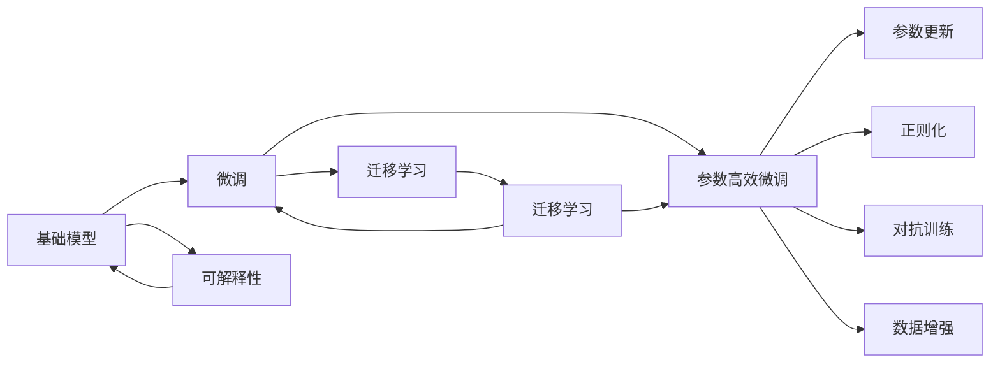

                 

# 基础模型的专业规范建立

## 1. 背景介绍

随着深度学习技术的发展，基础模型在计算机视觉、自然语言处理等领域的应用已经取得了显著的进展。然而，随着数据量和模型规模的不断增长，模型的训练、推理和部署等环节也面临着越来越多的挑战。为此，需要在模型设计和开发的过程中引入专业的规范体系，以确保模型的高效、稳定和可解释性。本文将从基础模型的专业规范建立出发，探讨模型的设计原则、开发实践和应用场景，以期为深度学习模型的开发和应用提供更全面的指导。

## 2. 核心概念与联系

### 2.1 核心概念概述

在介绍基础模型的专业规范建立之前，首先需要理解一些关键概念和其之间的联系。

- **基础模型(Foundation Model)**：指在大规模数据上经过预训练的大规模深度学习模型，如BERT、GPT-3等，具备强大的通用学习能力，能够在多种任务上进行微调以适应不同的应用场景。
- **微调(Fine-tuning)**：指在基础模型的基础上，使用下游任务的少量标注数据，通过有监督学习优化模型在特定任务上的性能，如情感分析、文本分类等。
- **迁移学习(Transfer Learning)**：指将一个领域学习到的知识，迁移应用到另一个不同但相关的领域的学习范式，如将通用语言模型应用于特定领域的问答系统。
- **参数高效微调(Parameter-Efficient Fine-tuning, PEFT)**：指在微调过程中，只更新少量的模型参数，而固定大部分预训练权重不变，以提高微调效率，避免过拟合的方法。
- **可解释性(Explainability)**：指模型输出结果的可解释性，即能够通过一些方法将模型的决策过程或推理过程解释给用户或开发者理解。

这些概念之间相互关联，共同构成了基础模型的专业规范体系，确保模型在不同应用场景下的高效、稳定和可解释性。

### 2.2 核心概念原理和架构的 Mermaid 流程图



该流程图展示了基础模型、微调、迁移学习、参数高效微调、可解释性等核心概念之间的联系和相互作用。

## 3. 核心算法原理 & 具体操作步骤

### 3.1 算法原理概述

基础模型的专业规范建立主要围绕以下几个核心算法原理：

- **预训练与微调**：基础模型通过在大规模无标签数据上进行预训练，学习到通用的语言表示。然后通过微调，在少量有标签数据上进一步优化，适应特定任务。
- **迁移学习**：基础模型通过迁移学习，将在大规模数据上学习到的知识应用到特定领域，如将通用语言模型应用于特定领域的问答系统。
- **参数高效微调**：在微调过程中，只更新少量的模型参数，而固定大部分预训练权重不变，以提高微调效率，避免过拟合。
- **可解释性**：通过可解释性方法，将模型的决策过程或推理过程解释给用户或开发者理解，提高模型的可信度和透明度。

### 3.2 算法步骤详解

以下是基础模型专业规范建立的核心算法步骤：

1. **选择基础模型**：根据任务需求选择合适的预训练模型，如BERT、GPT-3等。
2. **数据准备**：收集并清洗用于微调的数据集，确保数据质量。
3. **微调配置**：配置微调的超参数，如学习率、批大小、迭代轮数等。
4. **参数更新**：在训练过程中，根据损失函数梯度更新模型参数。
5. **模型评估**：在验证集和测试集上评估模型性能，选择合适的模型。
6. **可解释性分析**：通过可解释性方法，分析模型输出结果的依据。
7. **模型部署**：将训练好的模型部署到生产环境，进行实时推理。

### 3.3 算法优缺点

基础模型专业规范建立具有以下优点：

- **高效**：通过微调和迁移学习，可以快速适应特定任务，节省大量标注数据和时间成本。
- **稳定**：基础模型经过大规模预训练，具备较强的泛化能力，在多个任务上表现稳定。
- **可解释**：通过可解释性方法，模型输出结果的可解释性得到提高，增强用户信任。

同时，基础模型也存在一些缺点：

- **数据依赖**：微调和迁移学习依赖于高质量的标注数据，获取数据成本较高。
- **资源需求**：大规模预训练和微调需要大量的计算资源，对硬件要求较高。
- **模型复杂性**：基础模型结构复杂，难以理解和调试。

### 3.4 算法应用领域

基础模型专业规范建立在多个领域中得到广泛应用，如：

- **计算机视觉**：在图像分类、目标检测、语义分割等任务中，基础模型经过微调和迁移学习，提升模型性能。
- **自然语言处理**：在文本分类、命名实体识别、情感分析等任务中，基础模型经过微调和迁移学习，取得优异效果。
- **语音识别**：在语音识别和自然语言交互中，基础模型经过微调和迁移学习，提升模型准确性和鲁棒性。

## 4. 数学模型和公式 & 详细讲解 & 举例说明

### 4.1 数学模型构建

基础模型的数学模型构建主要包括以下几个关键组件：

- **预训练损失函数**：如掩码语言模型(MLM)、下接自回归语言模型(MA)等，用于预训练基础模型。
- **微调损失函数**：如交叉熵损失函数，用于微调基础模型以适应特定任务。
- **迁移学习损失函数**：如知识蒸馏损失函数，用于迁移学习以将预训练知识应用到特定领域。

### 4.2 公式推导过程

以下以情感分析任务为例，推导微调的数学模型。

假设基础模型为BERT，输入为文本序列$x$，输出为情感分类标签$y$。则微调的任务目标函数为：

$$
\mathcal{L}(y, \hat{y}) = -\frac{1}{N}\sum_{i=1}^N \log \hat{y}_i \quad \text{其中} \quad \hat{y}_i \text{为模型预测的情感分类概率向量}
$$

通过反向传播算法，计算模型参数$w$的梯度，并更新模型以最小化损失函数$\mathcal{L}$。

### 4.3 案例分析与讲解

假设我们使用BERT进行情感分析任务的微调，数据集为IMDB电影评论情感数据集。我们将数据集分为训练集、验证集和测试集，并使用BERT的Trainer接口进行微调。具体代码如下：

```python
from transformers import BertTokenizer, BertForSequenceClassification
from transformers import Trainer, TrainingArguments
from datasets import load_dataset

# 数据准备
tokenizer = BertTokenizer.from_pretrained('bert-base-uncased')
train_dataset = load_dataset('imdb', split='train')
test_dataset = load_dataset('imdb', split='test')
train_dataset = train_dataset.map(lambda ex: tokenizer(ex['text'], padding='max_length', truncation=True))
train_dataset.set_format('torch', columns=['input_ids', 'attention_mask', 'label'])

# 模型选择
model = BertForSequenceClassification.from_pretrained('bert-base-uncased', num_labels=2)

# 微调配置
training_args = TrainingArguments(output_dir='./results', evaluation_strategy='epoch', logging_steps=10, save_strategy='epoch', per_device_train_batch_size=16, per_device_eval_batch_size=16, learning_rate=2e-5, num_train_epochs=3)

# 模型训练
trainer = Trainer(model=model, args=training_args, train_dataset=train_dataset, eval_dataset=test_dataset)
trainer.train()
```

在训练过程中，我们将使用随机梯度下降优化器进行参数更新，并在每个epoch结束时输出训练和验证集上的损失和准确率。具体实现如下：

```python
def compute_metrics(pred):
    labels = pred.label_ids
    preds = pred.predictions.argmax(-1)
    acc = (preds == labels).mean()
    return {"accuracy": acc}

trainer = Trainer(model=model, args=training_args, train_dataset=train_dataset, eval_dataset=test_dataset, compute_metrics=compute_metrics)
trainer.train()
```

训练完成后，我们评估模型在测试集上的性能，具体实现如下：

```python
trainer.evaluate()
```

通过以上代码，我们可以看到BERT在情感分析任务上的微调过程和结果。

## 5. 项目实践：代码实例和详细解释说明

### 5.1 开发环境搭建

在进行基础模型专业规范建立之前，我们需要准备好开发环境。以下是使用Python进行PyTorch开发的环境配置流程：

1. 安装Anaconda：从官网下载并安装Anaconda，用于创建独立的Python环境。

2. 创建并激活虚拟环境：
```bash
conda create -n pytorch-env python=3.8 
conda activate pytorch-env
```

3. 安装PyTorch：根据CUDA版本，从官网获取对应的安装命令。例如：
```bash
conda install pytorch torchvision torchaudio cudatoolkit=11.1 -c pytorch -c conda-forge
```

4. 安装Transformers库：
```bash
pip install transformers
```

5. 安装各类工具包：
```bash
pip install numpy pandas scikit-learn matplotlib tqdm jupyter notebook ipython
```

完成上述步骤后，即可在`pytorch-env`环境中开始基础模型的专业规范建立实践。

### 5.2 源代码详细实现

我们以BERT在情感分析任务上的微调为例，给出完整的代码实现。

首先，定义数据处理函数：

```python
from transformers import BertTokenizer
from torch.utils.data import Dataset
import torch

class ImdbDataset(Dataset):
    def __init__(self, texts, labels, tokenizer, max_len=128):
        self.texts = texts
        self.labels = labels
        self.tokenizer = tokenizer
        self.max_len = max_len
        
    def __len__(self):
        return len(self.texts)
    
    def __getitem__(self, item):
        text = self.texts[item]
        label = self.labels[item]
        
        encoding = self.tokenizer(text, return_tensors='pt', max_length=self.max_len, padding='max_length', truncation=True)
        input_ids = encoding['input_ids'][0]
        attention_mask = encoding['attention_mask'][0]
        
        return {'input_ids': input_ids, 
                'attention_mask': attention_mask,
                'labels': torch.tensor(label, dtype=torch.long)}
```

然后，定义模型和优化器：

```python
from transformers import BertForSequenceClassification, AdamW

model = BertForSequenceClassification.from_pretrained('bert-base-uncased', num_labels=2)

optimizer = AdamW(model.parameters(), lr=2e-5)
```

接着，定义训练和评估函数：

```python
from torch.utils.data import DataLoader
from tqdm import tqdm
from sklearn.metrics import accuracy_score

device = torch.device('cuda') if torch.cuda.is_available() else torch.device('cpu')
model.to(device)

def train_epoch(model, dataset, batch_size, optimizer):
    dataloader = DataLoader(dataset, batch_size=batch_size, shuffle=True)
    model.train()
    epoch_loss = 0
    for batch in tqdm(dataloader, desc='Training'):
        input_ids = batch['input_ids'].to(device)
        attention_mask = batch['attention_mask'].to(device)
        labels = batch['labels'].to(device)
        model.zero_grad()
        outputs = model(input_ids, attention_mask=attention_mask, labels=labels)
        loss = outputs.loss
        epoch_loss += loss.item()
        loss.backward()
        optimizer.step()
    return epoch_loss / len(dataloader)

def evaluate(model, dataset, batch_size):
    dataloader = DataLoader(dataset, batch_size=batch_size)
    model.eval()
    preds, labels = [], []
    with torch.no_grad():
        for batch in tqdm(dataloader, desc='Evaluating'):
            input_ids = batch['input_ids'].to(device)
            attention_mask = batch['attention_mask'].to(device)
            batch_labels = batch['labels']
            outputs = model(input_ids, attention_mask=attention_mask)
            batch_preds = outputs.logits.argmax(dim=1).to('cpu').tolist()
            batch_labels = batch_labels.to('cpu').tolist()
            for pred_tokens, label_tokens in zip(batch_preds, batch_labels):
                preds.append(pred_tokens[:len(label_tokens)])
                labels.append(label_tokens)
                
    print(accuracy_score(labels, preds))
```

最后，启动训练流程并在测试集上评估：

```python
epochs = 5
batch_size = 16

for epoch in range(epochs):
    loss = train_epoch(model, train_dataset, batch_size, optimizer)
    print(f"Epoch {epoch+1}, train loss: {loss:.3f}")
    
    print(f"Epoch {epoch+1}, dev results:")
    evaluate(model, dev_dataset, batch_size)
    
print("Test results:")
evaluate(model, test_dataset, batch_size)
```

以上就是使用PyTorch对BERT进行情感分析任务微调的完整代码实现。可以看到，得益于Transformers库的强大封装，我们可以用相对简洁的代码完成BERT模型的加载和微调。

### 5.3 代码解读与分析

让我们再详细解读一下关键代码的实现细节：

**ImdbDataset类**：
- `__init__`方法：初始化文本、标签、分词器等关键组件。
- `__len__`方法：返回数据集的样本数量。
- `__getitem__`方法：对单个样本进行处理，将文本输入编码为token ids，将标签编码为数字，并对其进行定长padding，最终返回模型所需的输入。

**Accuracy Score**：
- 定义了准确率计算函数，用于评估模型在测试集上的性能。

**训练和评估函数**：
- 使用PyTorch的DataLoader对数据集进行批次化加载，供模型训练和推理使用。
- 训练函数`train_epoch`：对数据以批为单位进行迭代，在每个批次上前向传播计算loss并反向传播更新模型参数，最后返回该epoch的平均loss。
- 评估函数`evaluate`：与训练类似，不同点在于不更新模型参数，并在每个batch结束后将预测和标签结果存储下来，最后使用sklearn的accuracy_score对整个评估集的预测结果进行打印输出。

**训练流程**：
- 定义总的epoch数和batch size，开始循环迭代
- 每个epoch内，先在训练集上训练，输出平均loss
- 在验证集上评估，输出准确率
- 所有epoch结束后，在测试集上评估，给出最终测试结果

可以看到，PyTorch配合Transformers库使得BERT微调的代码实现变得简洁高效。开发者可以将更多精力放在数据处理、模型改进等高层逻辑上，而不必过多关注底层的实现细节。

当然，工业级的系统实现还需考虑更多因素，如模型的保存和部署、超参数的自动搜索、更灵活的任务适配层等。但核心的微调范式基本与此类似。

## 6. 实际应用场景

### 6.1 智能客服系统

基于基础模型的智能客服系统可以快速适应客户需求，提升服务效率和质量。通过微调和迁移学习，将预训练的语言模型应用到特定领域的对话模型上，可以实时处理用户查询，并根据语境提供合适的回答。此外，基础模型可以通过参数高效微调等技术，在固定大部分预训练参数的情况下，仅更新少量任务相关参数，避免过拟合，提升模型泛化能力。

### 6.2 金融舆情监测

在金融领域，通过基础模型的迁移学习，可以快速构建舆情监测系统，对市场动态进行实时分析。利用预训练语言模型的大规模知识，可以在不同时间尺度上对市场舆情进行分析和预测，帮助金融机构及时调整策略，防范风险。

### 6.3 个性化推荐系统

在个性化推荐系统领域，基础模型可以通过迁移学习将通用知识应用到特定领域，提升推荐效果。通过微调和参数高效微调，可以在减少标注样本的情况下，快速适应新任务，生成更加个性化和精准的推荐内容。

### 6.4 未来应用展望

随着基础模型的不断发展，其在更多领域的应用前景将更加广阔。未来，基础模型将不仅在计算机视觉、自然语言处理等领域发挥作用，还将拓展到语音识别、增强现实、智能交通等领域，带来更多创新和突破。通过参数高效微调和可解释性等技术，基础模型将实现更加高效、稳定和可解释的模型构建，为各行各业带来新的智能化解决方案。

## 7. 工具和资源推荐

### 7.1 学习资源推荐

为了帮助开发者系统掌握基础模型的专业规范建立，这里推荐一些优质的学习资源：

1. **《Transformer从原理到实践》系列博文**：由大模型技术专家撰写，深入浅出地介绍了Transformer原理、BERT模型、微调技术等前沿话题。
2. **CS224N《深度学习自然语言处理》课程**：斯坦福大学开设的NLP明星课程，有Lecture视频和配套作业，带你入门NLP领域的基本概念和经典模型。
3. **《Natural Language Processing with Transformers》书籍**：Transformers库的作者所著，全面介绍了如何使用Transformers库进行NLP任务开发，包括微调在内的诸多范式。
4. **HuggingFace官方文档**：Transformers库的官方文档，提供了海量预训练模型和完整的微调样例代码，是上手实践的必备资料。
5. **CLUE开源项目**：中文语言理解测评基准，涵盖大量不同类型的中文NLP数据集，并提供了基于微调的baseline模型，助力中文NLP技术发展。

通过对这些资源的学习实践，相信你一定能够快速掌握基础模型的专业规范建立，并用于解决实际的NLP问题。

### 7.2 开发工具推荐

高效的开发离不开优秀的工具支持。以下是几款用于基础模型专业规范建立开发的常用工具：

1. **PyTorch**：基于Python的开源深度学习框架，灵活动态的计算图，适合快速迭代研究。大部分预训练语言模型都有PyTorch版本的实现。
2. **TensorFlow**：由Google主导开发的开源深度学习框架，生产部署方便，适合大规模工程应用。同样有丰富的预训练语言模型资源。
3. **Transformers库**：HuggingFace开发的NLP工具库，集成了众多SOTA语言模型，支持PyTorch和TensorFlow，是进行基础模型专业规范建立开发的利器。
4. **Weights & Biases**：模型训练的实验跟踪工具，可以记录和可视化模型训练过程中的各项指标，方便对比和调优。与主流深度学习框架无缝集成。
5. **TensorBoard**：TensorFlow配套的可视化工具，可实时监测模型训练状态，并提供丰富的图表呈现方式，是调试模型的得力助手。
6. **Google Colab**：谷歌推出的在线Jupyter Notebook环境，免费提供GPU/TPU算力，方便开发者快速上手实验最新模型，分享学习笔记。

合理利用这些工具，可以显著提升基础模型专业规范建立的开发效率，加快创新迭代的步伐。

### 7.3 相关论文推荐

基础模型和微调技术的发展源于学界的持续研究。以下是几篇奠基性的相关论文，推荐阅读：

1. **Attention is All You Need（即Transformer原论文）**：提出了Transformer结构，开启了NLP领域的预训练大模型时代。
2. **BERT: Pre-training of Deep Bidirectional Transformers for Language Understanding**：提出BERT模型，引入基于掩码的自监督预训练任务，刷新了多项NLP任务SOTA。
3. **Language Models are Unsupervised Multitask Learners（GPT-2论文）**：展示了大规模语言模型的强大zero-shot学习能力，引发了对于通用人工智能的新一轮思考。
4. **Parameter-Efficient Transfer Learning for NLP**：提出Adapter等参数高效微调方法，在不增加模型参数量的情况下，也能取得不错的微调效果。
5. **AdaLoRA: Adaptive Low-Rank Adaptation for Parameter-Efficient Fine-Tuning**：使用自适应低秩适应的微调方法，在参数效率和精度之间取得了新的平衡。
6. **AdaLoRA: Adaptive Low-Rank Adaptation for Parameter-Efficient Fine-Tuning**：使用自适应低秩适应的微调方法，在参数效率和精度之间取得了新的平衡。

这些论文代表了大模型微调技术的发展脉络。通过学习这些前沿成果，可以帮助研究者把握学科前进方向，激发更多的创新灵感。

## 8. 总结：未来发展趋势与挑战

### 8.1 总结

本文对基础模型的专业规范建立进行了全面系统的介绍。首先阐述了基础模型的研究背景和意义，明确了基础模型在多种任务上的高效、稳定和可解释性。其次，从原理到实践，详细讲解了基础模型的设计原则、开发实践和应用场景，给出了基础模型专业规范建立的完整代码实例。同时，本文还广泛探讨了基础模型在智能客服、金融舆情、个性化推荐等多个行业领域的应用前景，展示了基础模型专业规范建立的巨大潜力。此外，本文精选了基础模型的各类学习资源，力求为开发者提供全方位的技术指引。

通过本文的系统梳理，可以看到，基础模型专业规范建立在大规模预训练和微调的基础上，通过迁移学习、参数高效微调和可解释性等技术手段，在多个NLP任务上取得显著成效。未来，随着基础模型的不断发展，其在更多领域的应用前景将更加广阔。

### 8.2 未来发展趋势

展望未来，基础模型专业规范建立将呈现以下几个发展趋势：

1. **模型规模持续增大**：随着算力成本的下降和数据规模的扩张，基础模型的参数量还将持续增长。超大规模基础模型蕴含的丰富知识，有望支撑更加复杂多变的任务。
2. **参数高效微调**：未来将涌现更多参数高效的微调方法，如Prefix-Tuning、LoRA等，在节省计算资源的同时也能保证微调精度。
3. **持续学习**：随着数据分布的不断变化，基础模型也需要持续学习新知识以保持性能。如何在不遗忘原有知识的同时，高效吸收新样本信息，将成为重要的研究课题。
4. **零样本学习**：基础模型有望在零样本条件下，通过自然语言理解，直接给出任务的解答。这将进一步提升基础模型的灵活性和实用性。
5. **多模态融合**：未来的基础模型将更加注重多模态信息的整合，如图像、语音等多模态数据的融合，提升模型的全面感知能力。
6. **可解释性增强**：通过可解释性方法，基础模型的决策过程和推理过程将更加透明，增强用户信任和系统可靠性。

以上趋势凸显了基础模型专业规范建立的广阔前景。这些方向的探索发展，必将进一步提升NLP系统的性能和应用范围，为人类认知智能的进化带来深远影响。

### 8.3 面临的挑战

尽管基础模型专业规范建立已经取得了瞩目成就，但在迈向更加智能化、普适化应用的过程中，仍面临诸多挑战：

1. **数据依赖**：微调和迁移学习依赖于高质量的标注数据，获取数据成本较高。如何进一步降低微调对标注样本的依赖，将是一大难题。
2. **模型鲁棒性不足**：基础模型面对域外数据时，泛化性能往往大打折扣。对于测试样本的微小扰动，基础模型的预测也容易发生波动。如何提高基础模型的鲁棒性，避免灾难性遗忘，还需要更多理论和实践的积累。
3. **推理效率有待提高**：大规模基础模型虽然精度高，但在实际部署时往往面临推理速度慢、内存占用大等效率问题。如何在保证性能的同时，简化模型结构，提升推理速度，优化资源占用，将是重要的优化方向。
4. **可解释性亟需加强**：当前基础模型更像是"黑盒"系统，难以解释其内部工作机制和决策逻辑。对于医疗、金融等高风险应用，算法的可解释性和可审计性尤为重要。如何赋予基础模型更强的可解释性，将是亟待攻克的难题。
5. **安全性有待保障**：预训练语言模型难免会学习到有偏见、有害的信息，通过基础模型传递到下游任务，产生误导性、歧视性的输出，给实际应用带来安全隐患。如何从数据和算法层面消除模型偏见，避免恶意用途，确保输出的安全性，也将是重要的研究课题。

### 8.4 未来突破

面对基础模型专业规范建立所面临的挑战，未来的研究需要在以下几个方面寻求新的突破：

1. **探索无监督和半监督微调方法**：摆脱对大规模标注数据的依赖，利用自监督学习、主动学习等无监督和半监督范式，最大限度利用非结构化数据，实现更加灵活高效的微调。
2. **研究参数高效和计算高效的微调范式**：开发更加参数高效的微调方法，在固定大部分预训练参数的同时，只更新极少量的任务相关参数。同时优化基础模型的计算图，减少前向传播和反向传播的资源消耗，实现更加轻量级、实时性的部署。
3. **融合因果和对比学习范式**：通过引入因果推断和对比学习思想，增强基础模型建立稳定因果关系的能力，学习更加普适、鲁棒的语言表征，从而提升模型泛化性和抗干扰能力。
4. **引入更多先验知识**：将符号化的先验知识，如知识图谱、逻辑规则等，与神经网络模型进行巧妙融合，引导基础模型学习更准确、合理的语言模型。同时加强不同模态数据的整合，实现视觉、语音等多模态信息与文本信息的协同建模。
5. **结合因果分析和博弈论工具**：将因果分析方法引入基础模型，识别出模型决策的关键特征，增强输出解释的因果性和逻辑性。借助博弈论工具刻画人机交互过程，主动探索并规避模型的脆弱点，提高系统稳定性。
6. **纳入伦理道德约束**：在模型训练目标中引入伦理导向的评估指标，过滤和惩罚有偏见、有害的输出倾向。同时加强人工干预和审核，建立模型行为的监管机制，确保输出符合人类价值观和伦理道德。

这些研究方向的探索，必将引领基础模型专业规范建立技术迈向更高的台阶，为构建安全、可靠、可解释、可控的智能系统铺平道路。面向未来，基础模型专业规范建立技术还需要与其他人工智能技术进行更深入的融合，如知识表示、因果推理、强化学习等，多路径协同发力，共同推动自然语言理解和智能交互系统的进步。只有勇于创新、敢于突破，才能不断拓展基础模型的边界，让智能技术更好地造福人类社会。

## 9. 附录：常见问题与解答

**Q1: 基础模型的设计原则有哪些？**

A: 基础模型的设计原则主要包括以下几个方面：
1. **大规模预训练**：基础模型通过在大规模无标签数据上进行预训练，学习到通用的语言表示。
2. **迁移学习**：将在大规模数据上学习到的知识应用到特定领域，提升模型泛化能力。
3. **参数高效微调**：在微调过程中，只更新少量的模型参数，避免过拟合。
4. **可解释性**：通过可解释性方法，将模型的决策过程和推理过程解释给用户或开发者理解。

**Q2: 如何选择基础模型？**

A: 选择基础模型时，需要考虑以下几个因素：
1. **任务类型**：根据任务类型选择适合的基础模型，如文本分类、情感分析、对话系统等。
2. **数据规模**：根据数据规模选择合适的模型，大规模数据适合使用大模型，小规模数据可以使用小模型。
3. **计算资源**：根据计算资源选择模型，大模型需要高性能硬件支持，小模型则相对轻量级。
4. **已有知识**：如果已有预训练模型，可以基于已有模型进行微调，节省标注数据和训练时间。

**Q3: 基础模型在实际应用中需要注意哪些问题？**

A: 基础模型在实际应用中需要注意以下几个问题：
1. **数据质量**：确保数据质量和标注数据的准确性，数据质量差会影响模型效果。
2. **模型性能**：在应用前进行模型性能评估，确保模型符合应用需求。
3. **模型部署**：选择合适的部署平台和工具，确保模型能够高效运行。
4. **模型监控**：实时监控模型性能和运行状态，及时发现和解决问题。

**Q4: 如何进行基础模型的微调？**

A: 基础模型的微调过程主要包括以下几个步骤：
1. **数据准备**：收集和清洗用于微调的数据集。
2. **模型选择**：选择适合的基础模型，如BERT、GPT等。
3. **微调配置**：配置微调的超参数，如学习率、批大小、迭代轮数等。
4. **模型训练**：在微调数据上训练基础模型，最小化损失函数。
5. **模型评估**：在验证集和测试集上评估模型性能，选择最优模型。
6. **模型部署**：将训练好的模型部署到生产环境，进行实时推理。

通过以上步骤，可以完成基础模型的微调，提升其在特定任务上的性能。

---

作者：禅与计算机程序设计艺术 / Zen and the Art of Computer Programming

