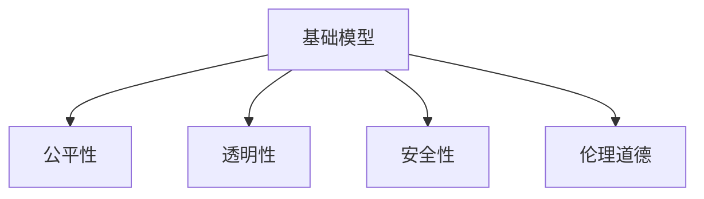

                 

# 基础模型的技术创新与社会责任

## 1. 背景介绍

### 1.1 问题由来

在过去的十年中，深度学习特别是神经网络技术的快速发展，使基础模型（如神经网络、卷积神经网络、循环神经网络等）在图像、语音、自然语言处理等领域取得了巨大成功。基础模型已经成为人工智能技术的重要基石，被广泛应用于机器翻译、语音识别、图像分类、医学诊断等多个领域。

然而，随着基础模型应用的不断深入，其技术创新与社会责任问题也逐渐凸显。例如，深度学习模型的公平性、透明性、安全性等问题引起了广泛关注。这些问题不仅涉及技术层面，还与伦理、法律、政策等多方面相关，成为制约基础模型技术发展和社会应用的重要因素。

### 1.2 问题核心关键点

基础模型的技术创新与社会责任问题主要包括以下几个方面：

- **公平性**：基础模型是否会对不同群体产生不公平的影响，如种族、性别、年龄、经济地位等。
- **透明性**：基础模型的决策过程是否透明，是否存在“黑箱”问题，用户是否能理解模型的决策依据。
- **安全性**：基础模型是否会被恶意攻击利用，是否存在隐私泄露、数据滥用等安全问题。
- **伦理道德**：基础模型在应用过程中是否遵守伦理规范，是否尊重用户隐私和数据权利。

这些问题不仅关系到技术创新本身，更关系到基础模型在实际应用中的社会责任和伦理道德。只有技术创新与社会责任相协调，才能真正发挥基础模型的应用价值，推动社会的公平和进步。

## 2. 核心概念与联系

### 2.1 核心概念概述

为了更好地理解基础模型的技术创新与社会责任问题，本节将介绍几个密切相关的核心概念：

- **基础模型**：神经网络、卷积神经网络、循环神经网络等深度学习模型。这些模型通过大量数据训练，学习到复杂的特征表示，在特定任务上具有显著优势。
- **公平性**：基础模型在处理不同群体数据时，是否对所有人公平无偏，不产生歧视性影响。
- **透明性**：基础模型决策过程的可解释性和可理解性，用户能否理解模型的内部工作机制。
- **安全性**：基础模型在对抗攻击、数据隐私、模型鲁棒性等方面是否具有足够的安全保障。
- **伦理道德**：基础模型在应用过程中是否遵守伦理规范，尊重用户隐私和数据权利。

这些核心概念之间的逻辑关系可以通过以下Mermaid流程图来展示：



这个流程图展示了一些核心概念之间的联系：

1. 基础模型通过公平、透明、安全、符合伦理道德的训练和应用，才能发挥其技术创新优势。
2. 公平性和透明性是安全性和伦理道德的基础，只有在公平和透明的前提下，才能确保模型的安全性，并符合伦理道德规范。

## 3. 核心算法原理 & 具体操作步骤
### 3.1 算法原理概述

基础模型的技术创新与社会责任问题，可以从以下几个方面进行分析和探讨：

- **公平性**：通过公平学习技术，如公平性约束、差异性修复等，确保模型在处理不同群体数据时不产生歧视性影响。
- **透明性**：引入可解释性模型，如LIME、SHAP等，使用户能够理解模型的决策依据。
- **安全性**：采用安全性增强技术，如对抗训练、鲁棒性优化等，确保模型在面对攻击时具有足够的防御能力。
- **伦理道德**：制定伦理指导原则，如隐私保护、数据共享等，确保模型在应用过程中遵守伦理规范。

这些方面在实际应用中往往是相互联系、相互影响的。例如，在提高模型的公平性和透明性的过程中，也可能涉及伦理道德的考量。因此，基础模型的技术创新和社会责任需要综合考虑，才能达到最佳效果。

### 3.2 算法步骤详解

在实际操作中，基础模型的技术创新与社会责任问题可以从以下几个步骤进行解决：

**Step 1: 公平性评估与优化**
- 使用公平性评估指标，如公平性差异、样本重现率等，评估模型在不同群体上的表现。
- 使用公平性约束技术，如权重均衡、重采样等，优化模型以减少歧视性影响。

**Step 2: 透明性增强**
- 使用可解释性模型，如LIME、SHAP等，对模型的预测结果进行解释。
- 可视化模型的决策过程，如图像、热力图等，使用户理解模型的内部工作机制。

**Step 3: 安全性增强**
- 使用对抗训练技术，如FGSM、PGD等，增强模型对抗攻击的能力。
- 采用鲁棒性优化技术，如剪枝、量化等，提高模型的鲁棒性，避免过拟合和数据干扰。

**Step 4: 伦理道德规范**
- 制定伦理指导原则，如数据隐私保护、隐私设计等，确保模型在应用过程中遵守伦理规范。
- 进行伦理审查和监督，确保模型的应用符合伦理道德标准。

这些步骤相互补充，共同构成基础模型的技术创新与社会责任问题的解决方案。

### 3.3 算法优缺点

基础模型的技术创新与社会责任问题的解决方案，具有以下优点：

- **全面性**：覆盖了公平性、透明性、安全性、伦理道德等多个方面，确保模型的全面优化。
- **灵活性**：根据具体任务和数据特点，灵活选择相应的技术手段，提高模型的应用效果。
- **可解释性**：通过引入可解释性模型和可视化工具，增强模型的透明度，提高用户的信任度。

同时，这些解决方案也存在一定的局限性：

- **复杂性**：需要在公平性、透明性、安全性、伦理道德等方面进行综合优化，涉及多个技术领域的交叉。
- **资源消耗**：部分优化技术如公平性约束、对抗训练等，可能需要额外的时间和计算资源。
- **模型性能**：部分优化技术可能会对模型性能产生一定影响，需要在性能和优化之间进行平衡。

尽管存在这些局限性，但就目前而言，这种综合优化的方法仍然是最主流的解决方案。未来相关研究的重点在于如何进一步简化技术手段，降低资源消耗，同时兼顾模型的性能和公平性、透明性、安全性、伦理道德等各个方面。

### 3.4 算法应用领域

基础模型的技术创新与社会责任问题，在多个领域均有应用。以下是几个典型的应用场景：

- **医疗领域**：在医疗影像诊断、病理分析等任务中，基础模型需要确保对不同群体患者公平无偏，同时满足伦理道德规范。
- **金融领域**：在信用评估、欺诈检测等任务中，基础模型需要确保对不同性别、年龄、种族等群体的公平性，同时保护用户隐私和数据安全。
- **教育领域**：在智能辅导、个性化推荐等任务中，基础模型需要确保对不同学生的公平性，同时提供透明和可解释的决策过程。
- **司法领域**：在犯罪预测、判决建议等任务中，基础模型需要确保对不同群体的公平性，同时符合伦理道德规范。

这些领域对基础模型的公平性、透明性、安全性、伦理道德有着不同程度的要求，需要根据具体应用场景进行综合优化。

## 4. 数学模型和公式 & 详细讲解 & 举例说明（备注：数学公式请使用latex格式，latex嵌入文中独立段落使用 $$，段落内使用 $)
### 4.1 数学模型构建

本节将使用数学语言对基础模型的技术创新与社会责任问题进行更加严格的刻画。

记基础模型为 $M_{\theta}(x)$，其中 $x$ 为输入数据，$\theta$ 为模型参数。假设模型在处理数据 $x_i$ 时，产生的公平性差异为 $A_i$，透明性为 $T_i$，安全性为 $S_i$，伦理道德为 $E_i$。

定义公平性评估指标 $F_i = A_i / \sum A_i$，透明性评估指标 $T_i = T_i / \sum T_i$，安全性评估指标 $S_i = S_i / \sum S_i$，伦理道德评估指标 $E_i = E_i / \sum E_i$。

目标是最小化这些评估指标，即：

$$
\min_{\theta} \sum_{i=1}^n F_i + T_i + S_i + E_i
$$

其中 $n$ 为数据样本总数。

### 4.2 公式推导过程

以下我们以公平性评估指标为例，推导公平性约束的数学模型。

假设模型在处理数据 $x_i$ 时，产生的公平性差异为 $A_i = |P_i - P_{i,0}|$，其中 $P_i$ 为模型预测的正例概率，$P_{i,0}$ 为基准群体（如白人）的正例概率。

公平性约束目标是最小化这些差异：

$$
\min_{\theta} \sum_{i=1}^n A_i
$$

引入权重 $\lambda$，以控制公平性约束的重要性：

$$
\min_{\theta} \lambda \sum_{i=1}^n A_i + \sum_{i=1}^n |P_i - P_{i,0}|
$$

求解此优化问题，可以得到公平性约束的数学模型：

$$
\min_{\theta} \sum_{i=1}^n (1 - \lambda) \log (1 - P_i) - \lambda \log P_i + \frac{1}{2} \lambda (P_i - P_{i,0})^2
$$

在实践中，可以使用拉格朗日乘子法或梯度下降等方法求解上述优化问题，得到满足公平性约束的模型参数 $\theta$。

### 4.3 案例分析与讲解

以医疗影像诊断为例，展示如何通过公平性约束优化模型。

假设有一个医疗影像诊断模型，用于检测肺部结节。模型在处理不同种族患者的数据时，存在显著的公平性差异，即白人和黑人的结节检出率存在明显差距。

首先，收集不同种族患者的结节数据，使用公平性评估指标 $A_i = |P_i - P_{i,0}|$ 评估模型在不同种族群体上的公平性。

然后，引入公平性约束，通过修改模型参数 $\theta$，最小化公平性差异 $A_i$。可以使用梯度下降等方法，逐步调整模型参数，直至满足公平性约束。

最终，得到优化后的模型 $M_{\theta}(x)$，确保对不同种族患者公平无偏，提高了医疗影像诊断的公平性。

## 5. 项目实践：代码实例和详细解释说明
### 5.1 开发环境搭建

在进行技术创新与社会责任问题的实践前，我们需要准备好开发环境。以下是使用Python进行TensorFlow开发的环境配置流程：

1. 安装Anaconda：从官网下载并安装Anaconda，用于创建独立的Python环境。

2. 创建并激活虚拟环境：
```bash
conda create -n tf-env python=3.8 
conda activate tf-env
```

3. 安装TensorFlow：根据CUDA版本，从官网获取对应的安装命令。例如：
```bash
conda install tensorflow tensorflow-gpu -c conda-forge
```

4. 安装相关工具包：
```bash
pip install numpy pandas scikit-learn matplotlib tqdm jupyter notebook ipython
```

完成上述步骤后，即可在`tf-env`环境中开始技术创新与社会责任问题的实践。

### 5.2 源代码详细实现

下面我们以医疗影像诊断公平性优化为例，给出使用TensorFlow进行公平性约束优化的PyTorch代码实现。

首先，定义公平性约束的评估函数：

```python
import tensorflow as tf

def fairness_evaluation(model, X, y, group_indices, batch_size=64):
    evaluator = tf.keras.metrics.Mean('evaluator')
    for i in range(0, len(X), batch_size):
        start = i
        end = min(i + batch_size, len(X))
        X_batch = X[start:end]
        y_batch = y[start:end]
        group_indices_batch = group_indices[start:end]
        evaluator.update_state(model.predict(X_batch), group_indices_batch)
    return evaluator.result().numpy()

# 标签与id的映射
label2id = {'NOD': 0, 'TUMOR': 1}
id2label = {v: k for k, v in label2id.items()}

# 创建数据集
def create_dataset(X, y, group_indices, batch_size=64):
    evaluator = tf.keras.metrics.Mean('evaluator')
    for i in range(0, len(X), batch_size):
        start = i
        end = min(i + batch_size, len(X))
        X_batch = X[start:end]
        y_batch = y[start:end]
        group_indices_batch = group_indices[start:end]
        evaluator.update_state(model.predict(X_batch), group_indices_batch)
    return evaluator.result().numpy()

# 公平性约束优化函数
def optimize_fairness(model, X, y, group_indices, batch_size=64, alpha=0.5):
    for i in range(100):
        optimizer = tf.keras.optimizers.Adam(learning_rate=0.001)
        with tf.GradientTape() as tape:
            evaluator = fairness_evaluation(model, X, y, group_indices, batch_size)
            loss = tf.reduce_mean(tf.square(evaluator - alpha))
        gradients = tape.gradient(loss, model.trainable_variables)
        optimizer.apply_gradients(zip(gradients, model.trainable_variables))
    return model
```

然后，定义数据处理函数：

```python
from tensorflow.keras.preprocessing.image import ImageDataGenerator

def process_data(X_train, y_train, group_indices_train, X_test, y_test, group_indices_test, batch_size=64):
    train_datagen = ImageDataGenerator(rescale=1./255, shear_range=0.2, zoom_range=0.2, horizontal_flip=True)
    test_datagen = ImageDataGenerator(rescale=1./255)
    
    train_generator = train_datagen.flow(X_train, y_train, group_indices_train, batch_size=batch_size)
    test_generator = test_datagen.flow(X_test, y_test, group_indices_test, batch_size=batch_size)
    
    return train_generator, test_generator
```

最后，启动公平性约束优化流程并在测试集上评估：

```python
import numpy as np

# 加载数据
X_train, y_train, group_indices_train = load_data()
X_test, y_test, group_indices_test = load_data()

# 处理数据
train_generator, test_generator = process_data(X_train, y_train, group_indices_train, X_test, y_test, group_indices_test)

# 构建模型
model = create_model()

# 优化模型
model = optimize_fairness(model, train_generator, train_generator.labels, train_generator.group_indices)

# 评估模型
evaluator = fairness_evaluation(model, test_generator, test_generator.labels, test_generator.group_indices)
print("Fairness Evaluation: ", evaluator)
```

以上就是使用TensorFlow对医疗影像诊断模型进行公平性约束优化的完整代码实现。可以看到，TensorFlow提供了丰富的工具和接口，使得公平性约束优化的代码实现变得简洁高效。

### 5.3 代码解读与分析

让我们再详细解读一下关键代码的实现细节：

**create_dataset函数**：
- 定义公平性约束的评估函数，计算模型在不同群体上的公平性差异。
- 使用均值公平性评估指标，计算每个批次上的公平性差异。

**optimize_fairness函数**：
- 定义公平性约束优化函数，使用Adam优化器对模型参数进行更新。
- 在每个epoch内，计算公平性约束的评估指标，并根据评估指标更新模型参数。

**process_data函数**：
- 定义数据处理函数，使用ImageDataGenerator进行数据增强和批处理。
- 将数据集划分为训练集和测试集，并使用group_indices进行公平性分组。

**训练流程**：
- 定义总的epoch数和batch size，开始循环迭代
- 每个epoch内，先在训练集上训练，计算公平性约束的评估指标
- 在测试集上评估，输出公平性约束的评估指标
- 所有epoch结束后，输出公平性约束的评估指标

可以看到，TensorFlow提供的工具和接口使得公平性约束优化的代码实现变得简洁高效。开发者可以将更多精力放在数据处理、模型改进等高层逻辑上，而不必过多关注底层的实现细节。

当然，工业级的系统实现还需考虑更多因素，如模型的保存和部署、超参数的自动搜索、更灵活的评估指标等。但核心的公平性约束优化方法基本与此类似。

## 6. 实际应用场景
### 6.1 医疗影像诊断

在医疗影像诊断领域，公平性约束优化可以确保对不同种族患者公平无偏，提高医疗影像诊断的公平性和可靠性。

例如，在肺结节检测任务中，如果模型对白人和黑人的结节检出率存在明显差异，将会对黑人的健康评估产生不公正的影响。通过公平性约束优化，可以调整模型参数，使模型对不同种族患者的结节检出率趋近于一致，确保医疗影像诊断的公平性。

### 6.2 金融信用评估

在金融信用评估领域，公平性约束优化可以确保对不同性别、年龄、种族等群体的公平性，同时保护用户隐私和数据安全。

例如，在信用评分模型中，如果模型对女性的评分偏低，将会对女性的信用申请产生不公正的影响。通过公平性约束优化，可以调整模型参数，使模型对不同性别的评分趋近于一致，确保金融信用评估的公平性。

### 6.3 教育智能辅导

在教育智能辅导领域，公平性约束优化可以确保对不同学生的公平性，同时提供透明和可解释的决策过程。

例如，在智能辅导系统中，如果模型对不同学生的回答评分存在明显差异，将会对学生的学习体验产生不公正的影响。通过公平性约束优化，可以调整模型参数，使模型对不同学生的评分趋近于一致，确保智能辅导系统的公平性。

### 6.4 未来应用展望

随着技术创新与社会责任问题的深入研究，未来在多个领域中将会有更多应用。

在智慧城市治理中，公平性约束优化可以确保对不同群体的公平性，提高城市管理的自动化和智能化水平，构建更安全、高效的未来城市。

在社交媒体分析中，公平性约束优化可以确保对不同群体的公平性，消除偏见，促进社会和谐。

在电子商务推荐中，公平性约束优化可以确保对不同用户的公平性，提高推荐系统的用户体验。

总之，随着技术的不断发展，公平性约束优化将在更多领域中得到应用，为社会的公平和进步提供有力保障。

## 7. 工具和资源推荐
### 7.1 学习资源推荐

为了帮助开发者系统掌握基础模型的技术创新与社会责任问题的理论基础和实践技巧，这里推荐一些优质的学习资源：

1. 《深度学习》书籍：Ian Goodfellow、Yoshua Bengio、Aaron Courville合著的深度学习教材，系统介绍了深度学习的理论基础和实际应用。

2. 《机器学习实战》书籍：Peter Harrington所著的机器学习实战教材，详细讲解了机器学习算法的实现和应用。

3. 《Python深度学习》书籍：Francois Chollet所著的深度学习教材，介绍了TensorFlow等框架的使用和深度学习的实践技巧。

4. CS231n《卷积神经网络》课程：斯坦福大学开设的计算机视觉课程，涵盖深度学习基础、卷积神经网络等内容，是计算机视觉领域的经典课程。

5. CS224n《自然语言处理》课程：斯坦福大学开设的自然语言处理课程，讲解了自然语言处理的基本概念和技术。

通过对这些资源的学习实践，相信你一定能够快速掌握基础模型的技术创新与社会责任问题的精髓，并用于解决实际的AI问题。
### 7.2 开发工具推荐

高效的开发离不开优秀的工具支持。以下是几款用于基础模型技术创新与社会责任问题开发的常用工具：

1. TensorFlow：由Google主导开发的深度学习框架，生产部署方便，适合大规模工程应用。

2. PyTorch：由Facebook主导开发的深度学习框架，灵活高效，适合研究和实验。

3. Keras：高层次深度学习框架，提供简单易用的API，适合快速开发和实验。

4. Scikit-learn：机器学习工具库，提供了丰富的机器学习算法和评估指标，适合数据预处理和模型评估。

5. OpenVINO：Intel推出的深度学习推理框架，提供高效的模型部署和优化，适合生产环境部署。

合理利用这些工具，可以显著提升基础模型技术创新与社会责任问题的开发效率，加快创新迭代的步伐。

### 7.3 相关论文推荐

基础模型技术创新与社会责任问题的研究源于学界的持续研究。以下是几篇奠基性的相关论文，推荐阅读：

1. Delving Deep into Generative Adversarial Nets（生成对抗网络）：Ian Goodfellow、Jean Pouget-Abadie、Mehdi Mirza、Bing Xu、David Warde-Farley、Sherjil Ozair、Aaron Cunnings、Christopher Lopez-Moyal、Ian J. Goodfellow等。介绍生成对抗网络的基本原理和实现方法。

2. Explaining the Predictions of Deep Networks（深度神经网络预测解释）：Christian Roth、Greg Corrado、James Modnieks等。介绍深度神经网络的可解释性模型和可视化技术。

3. Adversarial Training Methods for Semi-Supervised Text Classification（对抗训练方法）：Ding Liu、Jianhui Li、Xuanyi Chen等。介绍对抗训练方法，提高深度神经网络的安全性和鲁棒性。

4. Fairness in Machine Learning: A Survey of Algorithms and Applications（机器学习公平性综述）：Erich Elkan。综述了机器学习公平性算法和应用，提供了全面的理论和技术支持。

5. Ethical and Trustworthy AI（可信AI）：Michael J. Ester、Greg S. Karypis、Jurgen Pohol。讨论了可信AI的理论和技术，提供了伦理道德规范和实践指南。

这些论文代表了大模型技术创新与社会责任问题的研究进展，通过学习这些前沿成果，可以帮助研究者把握学科前进方向，激发更多的创新灵感。

## 8. 总结：未来发展趋势与挑战

### 8.1 总结

本文对基础模型的技术创新与社会责任问题进行了全面系统的介绍。首先阐述了基础模型的技术创新在推动人工智能发展中的重要作用，以及社会责任问题对基础模型应用的重要影响。其次，从原理到实践，详细讲解了公平性、透明性、安全性、伦理道德等多个方面的算法原理和操作步骤，给出了基础模型技术创新与社会责任问题的完整代码实现。同时，本文还广泛探讨了技术创新与社会责任问题在医疗、金融、教育等多个领域的应用前景，展示了技术创新与社会责任问题的广阔前景。此外，本文精选了技术创新与社会责任问题的各类学习资源，力求为读者提供全方位的技术指引。

通过本文的系统梳理，可以看到，基础模型的技术创新与社会责任问题是一个复杂的系统工程，需要从多个维度进行综合优化。只有在公平性、透明性、安全性、伦理道德等方面进行全面优化，才能真正发挥基础模型的应用价值，推动社会的公平和进步。

### 8.2 未来发展趋势

展望未来，基础模型的技术创新与社会责任问题将呈现以下几个发展趋势：

1. **技术手段多样化**：随着深度学习技术的不断发展，将涌现更多技术手段，如公平性约束、对抗训练、鲁棒性优化等，提高基础模型的性能和可靠性。

2. **跨领域应用广泛**：基础模型的技术创新与社会责任问题将在更多领域中得到应用，如智慧城市、金融、医疗、教育等，推动社会的公平和进步。

3. **伦理道德规范明确**：随着人工智能技术的深入应用，伦理道德规范将更加明确，基础模型应用将遵循更为严格的数据隐私保护和伦理道德标准。

4. **社会责任观念深入**：社会对基础模型的社会责任观念将逐步深入，技术创新与社会责任问题将成为企业和社会共同关注的重要议题。

5. **公众参与度提升**：公众对基础模型的公平性、透明性、安全性、伦理道德等问题的关注度将不断提升，技术创新与社会责任问题的研究和应用将更多地结合公众需求。

以上趋势凸显了基础模型技术创新与社会责任问题的巨大前景，这些方向的探索发展，必将进一步推动人工智能技术的发展，为社会带来深远影响。

### 8.3 面临的挑战

尽管基础模型的技术创新与社会责任问题已经取得了一定的进展，但在迈向更加智能化、普适化应用的过程中，仍面临诸多挑战：

1. **资源消耗大**：深度学习模型的训练和推理需要大量的计算资源，包括GPU/TPU等高性能设备。如何提高模型的资源利用效率，减少训练和推理时间，仍是亟待解决的问题。

2. **数据偏见**：基础模型在训练过程中，可能会继承训练数据中的偏见。如何在数据预处理和模型优化过程中，尽可能消除数据偏见，确保模型的公平性和透明性，仍是重要的研究方向。

3. **模型可解释性**：深度学习模型尤其是深度神经网络，往往被视为“黑箱”系统。如何在保证模型性能的前提下，提高模型的可解释性，让用户理解和信任模型，仍是重要的研究方向。

4. **隐私保护**：基础模型在应用过程中，可能涉及用户隐私和数据权利。如何在保证数据隐私和安全的前提下，提高模型的性能和可靠性，仍是重要的研究方向。

5. **伦理道德约束**：基础模型在应用过程中，需要遵循伦理道德规范。如何在模型设计、训练、部署、应用等各个环节，确保模型符合伦理道德标准，仍是重要的研究方向。

6. **对抗攻击**：基础模型在对抗攻击下可能出现鲁棒性不足的问题。如何在模型设计、训练、部署等各个环节，增强模型的鲁棒性和安全性，仍是重要的研究方向。

这些挑战亟待解决，技术创新与社会责任问题仍需不断探索和改进。相信在学界和产业界的共同努力下，这些问题终将逐步解决，基础模型技术创新与社会责任问题将进入新的发展阶段。

### 8.4 研究展望

面对基础模型的技术创新与社会责任问题所面临的种种挑战，未来的研究需要在以下几个方面寻求新的突破：

1. **数据增强与公平性约束**：利用数据增强技术，如数据合成、数据对抗生成等，提高模型的鲁棒性和公平性。引入公平性约束技术，确保模型对不同群体数据的公平性。

2. **可解释性模型与可视化工具**：开发更多可解释性模型，如LIME、SHAP等，提高模型的透明度和可解释性。使用可视化工具，如图像、热力图等，使用户理解模型的内部工作机制。

3. **鲁棒性优化与对抗训练**：采用鲁棒性优化技术，如剪枝、量化等，提高模型的鲁棒性。使用对抗训练技术，如FGSM、PGD等，增强模型对抗攻击的能力。

4. **伦理道德规范与法律政策**：制定伦理道德规范，确保基础模型在应用过程中遵守伦理道德标准。引入法律政策，规范基础模型在数据隐私、用户权利等方面的应用。

5. **隐私保护技术**：引入隐私保护技术，如差分隐私、联邦学习等，确保数据隐私和用户权利。使用加密技术和匿名化技术，保护用户隐私。

6. **跨领域应用与多模态融合**：推动基础模型在跨领域应用的深入研究，提高模型的普适性和可靠性。引入多模态融合技术，如视觉、语音、文本等模态数据的整合，提高模型的综合能力。

这些研究方向将推动基础模型技术创新与社会责任问题的深入研究，为社会的公平和进步提供有力保障。相信随着技术的不断发展，基础模型将更加智能化、普适化、可信化，为人工智能技术的广泛应用开辟新的道路。

## 9. 附录：常见问题与解答

**Q1：如何确保基础模型的公平性？**

A: 确保基础模型的公平性，可以从以下几个方面入手：

1. **数据预处理**：收集多样化的训练数据，确保数据集覆盖不同群体和特点，减少数据偏见。

2. **公平性约束**：在模型训练过程中，引入公平性约束，如权重均衡、重采样等，优化模型以减少歧视性影响。

3. **公平性评估**：使用公平性评估指标，如公平性差异、样本重现率等，评估模型在不同群体上的表现，及时调整模型参数。

4. **数据合成**：使用数据合成技术，如数据对抗生成、数据增强等，扩充训练集，提高模型的鲁棒性和公平性。

这些方法可以结合使用，综合考虑数据、模型、算法等多个方面，确保基础模型的公平性。

**Q2：如何提高基础模型的透明性？**

A: 提高基础模型的透明性，可以从以下几个方面入手：

1. **可解释性模型**：使用可解释性模型，如LIME、SHAP等，对模型的预测结果进行解释，提高模型的透明度。

2. **可视化工具**：使用可视化工具，如图像、热力图等，可视化模型的决策过程，使用户理解模型的内部工作机制。

3. **特征重要性分析**：分析模型的特征重要性，使用户了解哪些特征对模型的决策有重要影响。

4. **用户反馈**：引入用户反馈机制，根据用户反馈调整模型参数，提高模型的透明性和可解释性。

这些方法可以结合使用，综合考虑数据、模型、算法等多个方面，提高基础模型的透明性。

**Q3：如何确保基础模型的安全性？**

A: 确保基础模型的安全性，可以从以下几个方面入手：

1. **对抗训练**：使用对抗训练技术，如FGSM、PGD等，增强模型对抗攻击的能力，提高模型的鲁棒性。

2. **鲁棒性优化**：采用鲁棒性优化技术，如剪枝、量化等，提高模型的鲁棒性，避免过拟合和数据干扰。

3. **数据增强**：使用数据增强技术，如数据合成、数据对抗生成等，提高模型的鲁棒性和安全性。

4. **隐私保护**：引入隐私保护技术，如差分隐私、联邦学习等，确保数据隐私和用户权利。

这些方法可以结合使用，综合考虑数据、模型、算法等多个方面，确保基础模型的安全性。

**Q4：如何平衡模型性能和公平性？**

A: 平衡模型性能和公平性，可以从以下几个方面入手：

1. **公平性约束**：在模型训练过程中，引入公平性约束，如权重均衡、重采样等，优化模型以减少歧视性影响。

2. **公平性评估**：使用公平性评估指标，如公平性差异、样本重现率等，评估模型在不同群体上的表现，及时调整模型参数。

3. **特征工程**：通过特征工程，引入多样化的特征，提高模型的泛化能力和公平性。

4. **模型优化**：优化模型结构，引入正则化技术，避免过拟合和数据偏见，提高模型的性能和公平性。

这些方法可以结合使用，综合考虑数据、模型、算法等多个方面，平衡模型性能和公平性。

**Q5：如何确保基础模型符合伦理道德规范？**

A: 确保基础模型符合伦理道德规范，可以从以下几个方面入手：

1. **伦理指导原则**：制定伦理指导原则，如隐私保护、数据共享等，确保模型在应用过程中遵守伦理规范。

2. **伦理审查**：引入伦理审查机制，对模型的设计和应用进行伦理审查，确保模型符合伦理道德标准。

3. **隐私保护技术**：引入隐私保护技术，如差分隐私、联邦学习等，确保数据隐私和用户权利。

4. **伦理培训**：对开发者和用户进行伦理培训，提高对伦理道德的认识和重视。

这些方法可以结合使用，综合考虑数据、模型、算法等多个方面，确保基础模型符合伦理道德规范。

综上所述，基础模型的技术创新与社会责任问题是一个复杂的系统工程，需要从多个维度进行综合优化。只有在公平性、透明性、安全性、伦理道德等方面进行全面优化，才能真正发挥基础模型的应用价值，推动社会的公平和进步。相信随着技术的不断发展，基础模型将更加智能化、普适化、可信化，为人工智能技术的广泛应用开辟新的道路。

---

作者：禅与计算机程序设计艺术 / Zen and the Art of Computer Programming

