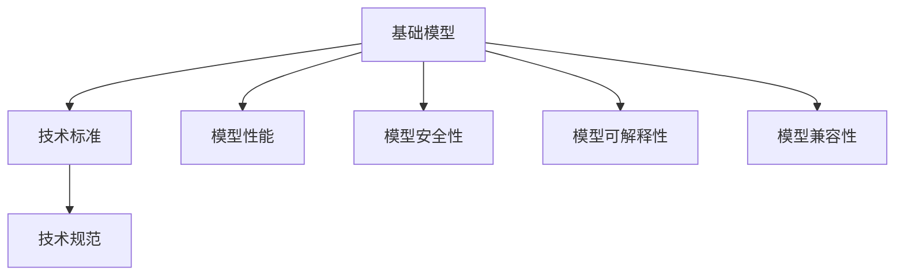

                 

# 基础模型的技术标准与规范

## 1. 背景介绍

在人工智能技术飞速发展的今天，基础模型的设计和使用标准成为了推动该领域进步的重要组成部分。它们不仅是确保模型性能和可靠性的一个保障，也是促进技术普及和产业应用的关键。本文旨在探讨基础模型（如深度学习模型、计算机视觉模型等）的技术标准与规范，以便构建更高效、更可靠、更安全的人工智能系统。

## 2. 核心概念与联系

### 2.1 核心概念概述

**基础模型**：指的是用于特定人工智能任务的高效、可复用、具有明确设计目的的模型，如深度神经网络、卷积神经网络(CNN)、循环神经网络(RNN)、Transformer等。

**技术标准**：一系列定义和协议，用于指导基础模型的设计、开发和应用，确保模型的性能、安全性和可重复性。

**技术规范**：具体详细的技术指导，用于实际操作中的模型开发和部署，如模型架构、训练流程、数据处理等。

**模型性能**：模型的预测准确率、运行速度、内存占用、模型复杂度等关键指标。

**模型安全性**：模型对抗攻击的鲁棒性、模型输出的公正性、隐私保护等。

**模型可解释性**：模型的决策过程是否可被理解和解释，以利于人类理解和接受模型的输出。

**模型兼容性**：模型与其他系统或模型的相互操作和交互能力。

这些核心概念之间相互联系，共同构成了基础模型设计和使用的基础框架。

### 2.2 核心概念原理和架构的 Mermaid 流程图



## 3. 核心算法原理 & 具体操作步骤

### 3.1 算法原理概述

基础模型的设计原则包括但不限于：

- **模块化**：将复杂模型分解为若干模块，每个模块完成特定功能，便于模型维护和升级。
- **参数共享**：通过参数共享减少模型参数数量，提高模型训练效率和泛化能力。
- **数据增强**：通过对训练数据进行扩充和变形，提高模型对数据变化的适应能力。
- **正则化**：通过添加正则化项，防止过拟合，提高模型的泛化能力。
- **迁移学习**：将一个领域学到的知识迁移到另一个领域，提升模型在新领域的适应性。
- **对抗训练**：在训练过程中加入对抗样本，提升模型对抗攻击的鲁棒性。
- **零样本学习**：模型无需看到特定标签数据，仅通过任务描述就能生成预测结果。

### 3.2 算法步骤详解

#### 3.2.1 数据准备

- **数据集划分**：将数据集划分为训练集、验证集和测试集，保证数据分布一致，避免过拟合。
- **数据预处理**：包括数据清洗、数据归一化、特征提取等，准备模型输入数据。

#### 3.2.2 模型设计

- **选择架构**：根据任务特点选择合适的模型架构，如CNN用于图像识别，RNN用于序列处理，Transformer用于自然语言处理。
- **设置超参数**：包括学习率、批大小、迭代轮数、正则化系数等，影响模型训练效率和效果。
- **构建模型**：将选择好的架构、超参数和数据输入构建模型。

#### 3.2.3 模型训练

- **初始化模型**：将模型初始化为一个小的随机值。
- **前向传播**：将输入数据输入模型，计算模型的输出。
- **计算损失**：计算模型输出与真实标签之间的差异，得到损失函数值。
- **反向传播**：根据损失函数值，反向传播计算梯度，更新模型参数。
- **迭代更新**：重复前向传播、计算损失、反向传播、参数更新，直至模型收敛。

#### 3.2.4 模型评估

- **验证集评估**：在验证集上评估模型性能，调整超参数，防止过拟合。
- **测试集评估**：在测试集上评估模型泛化能力，确保模型效果。

### 3.3 算法优缺点

**优点**：

- **模块化和可复用性**：模块化设计便于模型维护和升级，提高模型开发效率。
- **参数共享**：减少模型参数数量，提高训练效率和泛化能力。
- **数据增强**：提高模型对数据变化的适应能力，增强模型鲁棒性。
- **正则化**：防止过拟合，提高模型泛化能力。
- **迁移学习**：提升模型在新领域的适应性，减少从头开始训练的资源消耗。
- **对抗训练**：提升模型对抗攻击的鲁棒性，提高模型安全性。
- **零样本学习**：减少对标注数据的依赖，提高模型应用的灵活性。

**缺点**：

- **模型复杂度高**：一些高级模型如Transformer复杂度高，计算资源需求大。
- **训练时间长**：训练大规模模型耗时较长，需要高性能硬件支持。
- **对抗攻击脆弱**：部分模型对抗攻击脆弱，易受攻击影响。
- **可解释性差**：部分模型如深度学习模型输出结果难以解释，缺乏透明性。
- **数据依赖性强**：模型的性能依赖于数据质量，数据偏差可能导致模型偏见。

### 3.4 算法应用领域

基础模型广泛应用于计算机视觉、自然语言处理、语音识别等多个领域。以下是几个典型应用场景：

- **计算机视觉**：如物体检测、图像分类、人脸识别等。
- **自然语言处理**：如文本分类、机器翻译、问答系统等。
- **语音识别**：如自动语音识别、语音合成、语音翻译等。
- **强化学习**：如游戏智能、机器人控制、推荐系统等。
- **生物信息学**：如蛋白质结构预测、基因序列分析等。

## 4. 数学模型和公式 & 详细讲解

### 4.1 数学模型构建

基础模型的数学模型通常由输入数据 $x$、模型参数 $\theta$ 和输出 $y$ 组成。模型的目标是最小化损失函数 $L(y, \hat{y})$，其中 $\hat{y}$ 为模型预测结果。

例如，对于一个简单的线性回归模型 $y = \theta_0 + \theta_1 x_1 + \theta_2 x_2$，最小化均方误差损失函数：

$$
L(y, \hat{y}) = \frac{1}{N} \sum_{i=1}^{N} (y_i - \hat{y}_i)^2
$$

### 4.2 公式推导过程

对于常见的基础模型，如线性回归、逻辑回归、卷积神经网络等，其数学推导过程如下：

#### 4.2.1 线性回归

设样本数据集为 $\{(x_i, y_i)\}_{i=1}^{N}$，模型参数为 $\theta_0, \theta_1, \theta_2$，损失函数为均方误差：

$$
L(\theta) = \frac{1}{N} \sum_{i=1}^{N} (y_i - \theta_0 - \theta_1 x_{1,i} - \theta_2 x_{2,i})^2
$$

最小化损失函数得到模型参数估计：

$$
\hat{\theta} = (X^T X)^{-1} X^T y
$$

其中 $X = \begin{bmatrix} 1 & x_{1,i} & x_{2,i} \end{bmatrix}$，$y = \begin{bmatrix} y_i \end{bmatrix}$。

#### 4.2.2 逻辑回归

设样本数据集为 $\{(x_i, y_i)\}_{i=1}^{N}$，模型参数为 $\theta_0, \theta_1, \theta_2$，损失函数为交叉熵：

$$
L(\theta) = -\frac{1}{N} \sum_{i=1}^{N} \left[ y_i \log(\hat{y}_i) + (1 - y_i) \log(1 - \hat{y}_i) \right]
$$

最小化损失函数得到模型参数估计：

$$
\hat{\theta} = (X^T X)^{-1} X^T y
$$

其中 $X = \begin{bmatrix} 1 & x_{1,i} & x_{2,i} \end{bmatrix}$，$y = \begin{bmatrix} y_i \end{bmatrix}$。

#### 4.2.3 卷积神经网络

卷积神经网络是一种多层次的非线性模型，通过卷积层、池化层、全连接层等组成。以LeNet为例，其数学模型如下：

$$
y = \sigma(\text{FC}(\text{Pool}(\text{Conv}(x))))
$$

其中 $\sigma$ 为激活函数，$\text{FC}$ 为全连接层，$\text{Conv}$ 为卷积层，$\text{Pool}$ 为池化层。

### 4.3 案例分析与讲解

以图像分类为例，使用卷积神经网络进行模型设计：

#### 4.3.1 数据准备

将图像数据集划分为训练集、验证集和测试集，并进行数据预处理，如归一化、标准化、数据增强等。

#### 4.3.2 模型设计

使用LeNet架构，设置超参数，如学习率、批大小、迭代轮数等。

#### 4.3.3 模型训练

将数据输入模型进行前向传播和计算损失，反向传播计算梯度，更新模型参数。

#### 4.3.4 模型评估

在验证集和测试集上评估模型性能，调整超参数，确保模型效果。

## 5. 项目实践：代码实例和详细解释说明

### 5.1 开发环境搭建

使用Python和PyTorch框架进行项目开发，搭建开发环境如下：

```bash
pip install torch torchvision numpy pandas scikit-learn matplotlib tqdm jupyter notebook ipython
```

### 5.2 源代码详细实现

以图像分类为例，使用卷积神经网络进行模型训练：

```python
import torch
import torch.nn as nn
import torch.optim as optim
from torchvision import datasets, transforms

# 定义模型
class LeNet(nn.Module):
    def __init__(self):
        super(LeNet, self).__init__()
        self.conv1 = nn.Conv2d(1, 6, 5)
        self.pool = nn.MaxPool2d(2, 2)
        self.conv2 = nn.Conv2d(6, 16, 5)
        self.fc1 = nn.Linear(16 * 5 * 5, 120)
        self.fc2 = nn.Linear(120, 84)
        self.fc3 = nn.Linear(84, 10)

    def forward(self, x):
        x = self.pool(nn.functional.relu(self.conv1(x)))
        x = self.pool(nn.functional.relu(self.conv2(x)))
        x = x.view(-1, 16 * 5 * 5)
        x = nn.functional.relu(self.fc1(x))
        x = nn.functional.relu(self.fc2(x))
        x = self.fc3(x)
        return x

# 加载数据
train_dataset = datasets.CIFAR10(root='./data', train=True, download=True, transform=transforms.Compose([
    transforms.ToTensor(),
    transforms.Normalize((0.5, 0.5, 0.5), (0.5, 0.5, 0.5))
]))
test_dataset = datasets.CIFAR10(root='./data', train=False, download=True, transform=transforms.Compose([
    transforms.ToTensor(),
    transforms.Normalize((0.5, 0.5, 0.5), (0.5, 0.5, 0.5))
]))

# 定义超参数
batch_size = 100
learning_rate = 0.01
num_epochs = 10

# 训练模型
model = LeNet()
optimizer = optim.SGD(model.parameters(), lr=learning_rate, momentum=0.9)
criterion = nn.CrossEntropyLoss()

for epoch in range(num_epochs):
    for i, (images, labels) in enumerate(zip(train_loader, train_dataset)):
        images, labels = images.to(device), labels.to(device)
        optimizer.zero_grad()
        outputs = model(images)
        loss = criterion(outputs, labels)
        loss.backward()
        optimizer.step()

    # 验证集评估
    with torch.no_grad():
        correct = 0
        total = 0
        for images, labels in test_loader:
            images, labels = images.to(device), labels.to(device)
            outputs = model(images)
            _, predicted = torch.max(outputs.data, 1)
            total += labels.size(0)
            correct += (predicted == labels).sum().item()

    print('Epoch [%d/%d], Loss: %.4f, Accuracy: %.2f%%' % (epoch+1, num_epochs, loss.item(), 100 * correct / total))
```

### 5.3 代码解读与分析

代码中使用了卷积神经网络LeNet，对CIFAR-10数据集进行了分类任务。具体步骤如下：

1. 定义模型架构。
2. 加载训练和测试数据集。
3. 设置超参数，如批大小、学习率等。
4. 训练模型，在每个epoch中，对训练数据进行前向传播、计算损失、反向传播和参数更新。
5. 在验证集上评估模型性能。

## 6. 实际应用场景

### 6.1 图像识别

图像识别是基础模型在计算机视觉领域的典型应用之一。例如，在医疗领域，通过卷积神经网络模型可以对医学图像进行病变检测，辅助医生诊断。

### 6.2 自然语言处理

自然语言处理中的文本分类、情感分析、问答系统等任务，也可以使用基础模型进行实现。例如，通过BERT模型，可以对新闻进行情感分类，辅助舆情分析。

### 6.3 语音识别

语音识别技术可以用于智能语音助手、语音输入、智能客服等场景。例如，使用卷积神经网络和循环神经网络结合的模型，可以对语音信号进行识别，转化为文本。

### 6.4 未来应用展望

未来，基础模型将在更多领域得到应用，推动人工智能技术的发展：

- **自动驾驶**：通过计算机视觉和自然语言处理，实现智能驾驶。
- **智慧城市**：通过图像识别和物联网技术，实现城市管理的智能化。
- **金融科技**：通过图像识别和自然语言处理，提升金融风险控制能力。
- **医疗健康**：通过图像识别和自然语言处理，提升医疗诊断和治疗的精准度。
- **智能家居**：通过语音识别和自然语言处理，实现智能家居控制。

## 7. 工具和资源推荐

### 7.1 学习资源推荐

- **深度学习课程**：Coursera上的《深度学习专项课程》，涵盖了深度学习的基本概念和实践技巧。
- **开源框架**：PyTorch、TensorFlow等，提供了丰富的模型库和工具支持。
- **文档和教程**：各基础模型官方文档和GitHub上的示例代码，可以快速上手模型开发。

### 7.2 开发工具推荐

- **版本控制**：Git，方便代码管理和版本控制。
- **代码编辑器**：Visual Studio Code、PyCharm等，提供高效的代码编辑和调试功能。
- **协作工具**：Jupyter Notebook、GitHub等，方便团队协作和代码共享。

### 7.3 相关论文推荐

- **深度学习基础**：《Deep Learning》，Ian Goodfellow等著。
- **计算机视觉基础**：《计算机视觉：算法与应用》，Richard Szeliski著。
- **自然语言处理基础**：《自然语言处理综论》，Daniel Jurafsky、James H. Martin著。

## 8. 总结：未来发展趋势与挑战

### 8.1 研究成果总结

基础模型在过去十年中取得了显著进展，广泛应用于计算机视觉、自然语言处理、语音识别等多个领域。研究者们在模型设计、训练优化、应用部署等方面进行了大量探索，推动了人工智能技术的普及和应用。

### 8.2 未来发展趋势

未来，基础模型将在以下几个方面发展：

- **模型可解释性**：提高模型的可解释性，帮助用户理解和接受模型的决策过程。
- **跨模态融合**：融合视觉、语音、文本等多种模态信息，实现多模态智能系统。
- **自动化设计**：通过自动化模型设计工具，提高模型开发效率。
- **鲁棒性和安全性**：提高模型对对抗攻击的鲁棒性，确保模型安全可靠。
- **联邦学习**：在分布式环境中，实现模型训练和推理的联邦化，提高数据隐私保护。
- **大规模预训练**：通过大规模预训练模型，提升模型的通用性和适应性。

### 8.3 面临的挑战

基础模型面临的挑战包括：

- **数据依赖性强**：模型的性能依赖于数据质量，数据偏差可能导致模型偏见。
- **计算资源需求大**：大规模模型的训练和推理需要高性能硬件支持。
- **模型复杂度高**：部分高级模型如Transformer复杂度高，计算资源需求大。
- **对抗攻击脆弱**：部分模型对抗攻击脆弱，易受攻击影响。
- **可解释性差**：部分模型如深度学习模型输出结果难以解释，缺乏透明性。

### 8.4 研究展望

未来研究应集中在以下几个方面：

- **数据增强**：开发更多有效的数据增强技术，提高模型泛化能力。
- **正则化**：研究新的正则化技术，防止模型过拟合。
- **模型压缩**：开发模型压缩技术，提高模型的运行效率。
- **对抗训练**：研究新的对抗训练方法，提升模型鲁棒性。
- **自适应学习**：开发自适应学习算法，提升模型对数据变化的适应能力。

## 9. 附录：常见问题与解答

**Q1: 基础模型开发需要哪些工具和资源？**

A: 基础模型开发需要以下工具和资源：
- Python编程语言
- PyTorch、TensorFlow等深度学习框架
- 高性能硬件如GPU、TPU
- 数据集和数据增强工具
- 模型压缩和优化工具

**Q2: 如何设计高效的模型架构？**

A: 设计高效的模型架构需要考虑以下几点：
- 模块化设计：将复杂模型分解为若干模块，每个模块完成特定功能
- 参数共享：通过参数共享减少模型参数数量，提高模型训练效率和泛化能力
- 数据增强：通过对训练数据进行扩充和变形，提高模型对数据变化的适应能力
- 正则化：通过添加正则化项，防止过拟合，提高模型泛化能力

**Q3: 基础模型如何对抗攻击？**

A: 基础模型对抗攻击的策略包括：
- 对抗训练：在训练过程中加入对抗样本，提升模型对抗攻击的鲁棒性
- 对抗样本检测：使用检测算法识别对抗样本，保护模型输出安全
- 对抗样本生成：使用生成算法生成对抗样本，提升模型的鲁棒性

**Q4: 基础模型如何实现跨模态融合？**

A: 实现跨模态融合需要考虑以下几点：
- 多模态数据预处理：对不同模态的数据进行标准化和归一化
- 融合模型设计：设计融合模型，将不同模态的数据信息进行融合
- 多模态任务建模：根据任务特点，设计多模态任务的建模方法

**Q5: 基础模型如何实现自动化设计？**

A: 基础模型自动化设计的策略包括：
- 自动化模型设计工具：使用自动化设计工具，提高模型设计效率
- 模型自动优化：使用自动优化算法，提升模型性能和效率
- 自动化超参数搜索：使用超参数搜索算法，优化模型超参数配置

这些问题的回答将帮助开发者更好地理解基础模型的设计和应用，推动人工智能技术的发展。

---

作者：禅与计算机程序设计艺术 / Zen and the Art of Computer Programming

