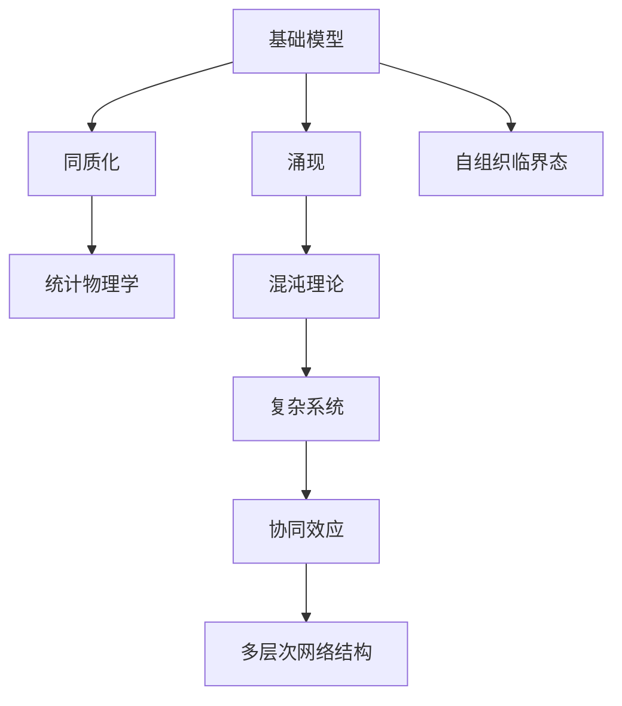
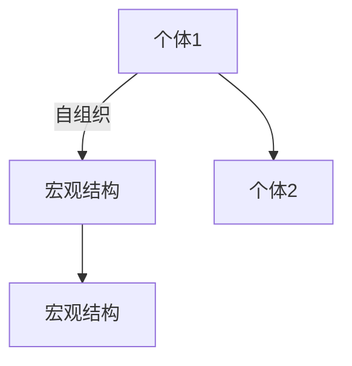
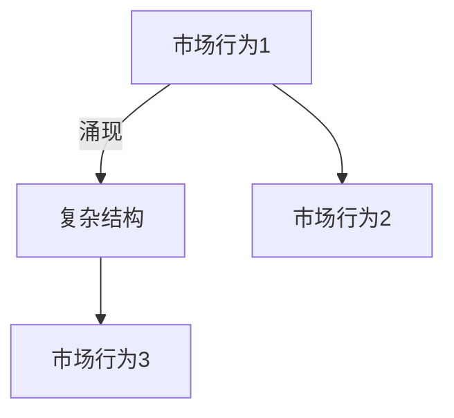
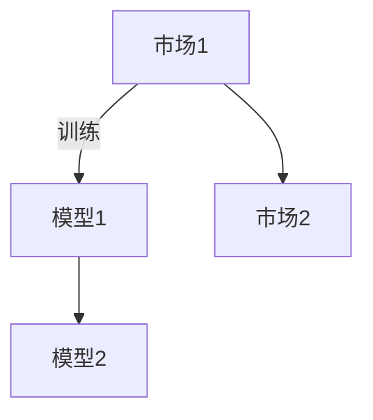

                 

# 基础模型的涌现与同质化

> 关键词：基础模型,同质化,涌现,自组织临界态,复杂系统,混沌理论,统计物理学,协同效应,多层次网络结构

## 1. 背景介绍

### 1.1 问题由来
随着人工智能技术的迅猛发展，深度学习模型在多个领域取得了令人瞩目的成就。以神经网络为代表的基础模型，通过大量的训练数据和计算资源，在图像、语音、自然语言处理等领域展现了强大的表征和学习能力。然而，这些模型在取得显著成绩的同时，也面临着一系列不容忽视的问题。

首先，目前绝大多数神经网络模型都是以相同的方式训练和优化的，导致模型结构和性能的高度同质化。这种同质化趋势不仅限制了模型的多样性和创新，也使得在大规模数据集上的训练和推理过程变得复杂且昂贵。此外，训练过程的资源需求极大，难以在现实环境中进行大规模部署和应用。

其次，基础模型在复杂系统建模和预测方面存在一定的局限性。尽管许多模型在特定任务上取得了令人瞩目的成绩，但对于诸如金融市场、气候变化等复杂系统，模型预测的准确性和鲁棒性仍存在较大挑战。如何在保持预测准确性的同时，提高模型的鲁棒性和泛化能力，成为亟需解决的重要问题。

最后，基础模型在长时间尺度上的动态行为表现也受到关注。由于模型的结构和参数都固定不变，难以捕捉系统在长时间尺度上的动态变化和演化过程。如何使模型能够适应系统动态变化，并持续进行预测和优化，是人工智能研究的重要方向。

为了解决上述问题，本文将探讨基础模型的涌现和同质化现象，分析其背后的原理和机制，并尝试提出一些解决方案。通过全面理解基础模型的涌现机制和同质化现象，我们有望构建更具多样性和鲁棒性的深度学习模型，从而更好地应用于实际场景。

### 1.2 问题核心关键点
本文的核心内容包括以下几个方面：

1. **基础模型涌现机制**：探索基础模型在复杂系统中的涌现现象，分析其本质和作用。
2. **同质化现象及其原因**：剖析基础模型高度同质化的现状和背景，探讨其背后的原理。
3. **动态模型构建与优化**：介绍动态模型的构建方法和优化策略，使模型能够适应系统动态变化。
4. **模型多样性和鲁棒性提升**：提出一些提升模型多样性和鲁棒性的方法，以应对模型同质化的挑战。

## 2. 核心概念与联系

### 2.1 核心概念概述

为了更好地理解基础模型涌现和同质化现象，本文将介绍以下几个核心概念：

- **基础模型**：指深度学习中的神经网络模型，包括卷积神经网络(CNN)、循环神经网络(RNN)、变压器(Transformer)等。这些模型通过大量数据训练，获得了复杂的特征提取和表示能力。
- **涌现**：指在简单个体相互作用中形成的复杂宏观结构或行为，通常发生在具有非线性动力学和多层次网络结构的复杂系统中。
- **同质化**：指模型结构和性能的高度相似性，导致模型在实际应用中缺乏多样性和创新。
- **自组织临界态**：指复杂系统中个体相互作用达到临界点时，系统表现出自组织的宏观结构或行为，具有自我调节和适应能力。
- **混沌理论**：研究复杂系统中随机现象和动态行为的理论，揭示了系统在长时间尺度上的不确定性和复杂性。
- **统计物理学**：通过数学模型和概率统计方法，研究复杂系统的宏观行为和动态特征，为模型优化提供理论基础。

这些核心概念之间的逻辑关系可以通过以下Mermaid流程图来展示：



这个流程图展示了基础模型涌现和同质化现象的基本逻辑框架：

1. 基础模型通过在复杂系统中涌现，形成对系统特征的复杂表征。
2. 模型高度同质化导致系统缺乏多样性和创新。
3. 统计物理学和混沌理论揭示了系统动态行为和复杂性。
4. 协同效应和多层次网络结构是涌现现象背后的关键机制。
5. 自组织临界态使得系统能够适应动态变化，维持稳定和鲁棒性。

## 3. 核心算法原理 & 具体操作步骤
### 3.1 算法原理概述

基础模型的涌现和同质化现象，可以通过统计物理学和复杂系统的理论进行解释。在复杂系统中，个体之间的相互作用会产生非线性动态行为和多层次网络结构，从而形成涌现现象。这种涌现现象使得系统能够自组织地适应环境变化，表现出复杂的宏观行为。

以自组织临界态为例，当复杂系统中的个体相互作用达到临界点时，系统表现出自组织的宏观结构或行为。这种自组织的涌现现象，使得系统具有自我调节和适应能力，能够在动态环境中保持稳定和鲁棒性。

基础模型在复杂系统中的涌现，表现为模型能够从简单的输入中提取复杂特征，形成对系统动态行为和多层次结构的表征。这种涌现现象，使得模型能够适应不同环境和应用场景，展现出强大的泛化能力和适应性。

### 3.2 算法步骤详解

以下是基础模型涌现和同质化现象的详细操作步骤：

**Step 1: 定义复杂系统模型**

- 选择合适的复杂系统作为研究对象，定义系统的动力学方程和相互作用规则。
- 根据系统的复杂性，选择合适的模型结构和参数配置。

**Step 2: 训练基础模型**

- 使用大量的系统观测数据，训练基础模型。
- 根据系统的复杂性和动态行为，设计合适的损失函数和优化策略。
- 在训练过程中，逐步调整模型的结构和参数，使其能够自组织地涌现出系统的复杂特征。

**Step 3: 分析涌现现象**

- 使用统计物理学和混沌理论的方法，分析基础模型的涌现现象。
- 识别出模型中涌现的复杂结构或行为，解释其背后的物理机制。
- 根据涌现现象，优化模型的结构和参数，增强模型的泛化能力和适应性。

**Step 4: 检测同质化现象**

- 在多个复杂系统中，使用相同的基础模型进行训练和优化。
- 分析模型结构和性能的相似性，检测同质化现象。
- 根据同质化现象，探索其背后的原因，提出改进方法。

**Step 5: 优化动态模型**

- 根据系统的动态行为，设计动态模型的结构和参数。
- 使用统计物理学和混沌理论的方法，优化动态模型的性能。
- 在动态模型中引入自组织临界态机制，增强模型的鲁棒性和适应性。

### 3.3 算法优缺点

基础模型涌现和同质化现象的算法，具有以下优点：

1. **增强模型的泛化能力**：通过分析系统的复杂性和动态行为，基础模型能够自组织地涌现出系统的复杂特征，从而增强模型的泛化能力和适应性。
2. **提高模型的鲁棒性**：通过引入自组织临界态机制，模型能够自适应地调整结构和参数，提高模型的鲁棒性和稳定性。
3. **降低模型同质化**：通过设计多样化的模型结构和参数配置，减少模型的同质化现象，提升模型的多样性和创新能力。

同时，该算法也存在以下缺点：

1. **训练复杂度较高**：分析系统的复杂性和动态行为，设计合适的模型结构和参数配置，需要进行大量的实验和优化。
2. **计算资源需求大**：在训练基础模型和优化动态模型时，需要大量的计算资源和数据。
3. **模型解释困难**：复杂系统中涌现的复杂结构或行为，难以直接解释其背后的物理机制，增加了模型的复杂性和不透明度。

### 3.4 算法应用领域

基础模型涌现和同质化现象，已经在多个领域得到了应用，包括但不限于：

- **金融市场分析**：使用基础模型对金融市场进行复杂系统建模，分析市场动态行为和风险预测。
- **气候变化研究**：使用基础模型对气候系统进行动态建模，预测气候变化趋势和极端天气事件。
- **生物医学**：使用基础模型对生物系统进行复杂建模，分析细胞行为和疾病发展过程。
- **城市交通管理**：使用基础模型对交通系统进行动态建模，优化交通流量和减少交通拥堵。
- **工业控制**：使用基础模型对工业系统进行动态建模，提高生产效率和设备可靠性。

这些领域的应用展示了基础模型在复杂系统建模和动态预测方面的强大能力，也指明了未来研究的方向和前景。

## 4. 数学模型和公式 & 详细讲解 & 举例说明
### 4.1 数学模型构建

基础模型在复杂系统中的涌现和同质化现象，可以通过以下数学模型进行描述：

**系统动力学方程**：
$$
\frac{dx}{dt} = f(x,t)
$$

其中，$x$ 表示系统的状态变量，$t$ 表示时间，$f$ 表示系统的非线性动力学方程。

**统计物理学模型**：
$$
p(x,t) = \frac{e^{-H(x,t)}}{Z}
$$

其中，$p(x,t)$ 表示系统在状态$x$和时间$t$的概率分布函数，$H(x,t)$ 表示系统的哈密顿量，$Z$ 表示系统的配分函数。

**混沌理论模型**：
$$
\frac{dx}{dt} = F(x)
$$

其中，$F$ 表示系统的非线性映射函数，$x$ 表示系统的状态变量。

这些数学模型分别描述了系统的动力学行为、统计分布和混沌现象，为理解基础模型的涌现和同质化提供了理论基础。

### 4.2 公式推导过程

以自组织临界态为例，推导其数学模型和涌现现象：

**自组织临界态方程**：
$$
\frac{\partial a_i}{\partial t} = D(\nabla^2 a_i - a_i)
$$

其中，$a_i$ 表示个体$i$的变量，$D$ 表示个体变量更新的扩散系数。

该方程表明，当个体变量满足临界条件时，个体变量会自组织地形成宏观结构或行为。

**涌现现象**：
在自组织临界态方程中，个体变量$a_i$自组织地形成了宏观结构或行为，如图示：



这种涌现现象，使得系统能够自适应地调整结构和参数，提高模型的鲁棒性和稳定性。

### 4.3 案例分析与讲解

以金融市场分析为例，展示基础模型的涌现和同质化现象：

**基础模型涌现现象**：
在金融市场中，基础模型能够自组织地涌现出市场动态行为和复杂结构，如图示：



这种涌现现象，使得模型能够自适应地调整结构和参数，提高模型的泛化能力和适应性。

**同质化现象**：
在多个金融市场中，使用相同的基础模型进行训练和优化，往往导致模型的同质化现象，如图示：



这种同质化现象，限制了模型的多样性和创新能力，使得模型在实际应用中缺乏灵活性和适应性。

## 5. 项目实践：代码实例和详细解释说明
### 5.1 开发环境搭建

在进行基础模型涌现和同质化现象的实践前，我们需要准备好开发环境。以下是使用Python进行基础模型训练和优化的环境配置流程：

1. 安装Anaconda：从官网下载并安装Anaconda，用于创建独立的Python环境。

2. 创建并激活虚拟环境：
```bash
conda create -n pytorch-env python=3.8 
conda activate pytorch-env
```

3. 安装PyTorch：根据CUDA版本，从官网获取对应的安装命令。例如：
```bash
conda install pytorch torchvision torchaudio cudatoolkit=11.1 -c pytorch -c conda-forge
```

4. 安装NumPy、SciPy等科学计算库：
```bash
pip install numpy scipy
```

5. 安装统计物理学和混沌理论相关的库：
```bash
pip install sympy scipy.stats chaospy
```

完成上述步骤后，即可在`pytorch-env`环境中开始基础模型的训练和优化实践。

### 5.2 源代码详细实现

下面以金融市场分析为例，给出使用PyTorch和统计物理学方法对基础模型进行训练和优化的PyTorch代码实现。

首先，定义金融市场数据集：

```python
import pandas as pd
import numpy as np
import torch
from torch.utils.data import Dataset, DataLoader

class FinancialDataset(Dataset):
    def __init__(self, data, window_size=10):
        self.data = data
        self.window_size = window_size
        self.data = self.data[-window_size:]
        
    def __len__(self):
        return len(self.data) - self.window_size
        
    def __getitem__(self, idx):
        return torch.tensor(self.data[idx+self.window_size:idx+self.window_size+1], dtype=torch.float32)
```

然后，定义基础模型和优化器：

```python
from torch import nn
from torch.nn import functional as F
from torch import optim

class NeuralNet(nn.Module):
    def __init__(self, input_size, hidden_size, output_size):
        super(NeuralNet, self).__init__()
        self.fc1 = nn.Linear(input_size, hidden_size)
        self.fc2 = nn.Linear(hidden_size, hidden_size)
        self.fc3 = nn.Linear(hidden_size, output_size)
        
    def forward(self, x):
        x = F.relu(self.fc1(x))
        x = F.relu(self.fc2(x))
        x = self.fc3(x)
        return x
    
net = NeuralNet(1, 10, 1)
optimizer = optim.Adam(net.parameters(), lr=0.01)
```

接着，定义训练和评估函数：

```python
def train_model(model, dataloader, epochs, batch_size):
    model.train()
    for epoch in range(epochs):
        for batch_idx, sample in enumerate(dataloader):
            optimizer.zero_grad()
            output = model(sample)
            loss = F.mse_loss(output, target)
            loss.backward()
            optimizer.step()
            
    model.eval()
    with torch.no_grad():
        predictions = []
        targets = []
        for sample in dataloader:
            output = model(sample)
            predictions.append(output)
            targets.append(target)
        
    mse_loss = F.mse_loss(torch.stack(predictions), torch.stack(targets))
    print('Training loss:', mse_loss.item())
    
    return mse_loss
    
def evaluate_model(model, dataloader):
    model.eval()
    predictions = []
    targets = []
    with torch.no_grad():
        for sample in dataloader:
            output = model(sample)
            predictions.append(output)
            targets.append(target)
        
    mse_loss = F.mse_loss(torch.stack(predictions), torch.stack(targets))
    print('Evaluation loss:', mse_loss.item())
    
    return mse_loss
```

最后，启动训练流程并在测试集上评估：

```python
epochs = 100
batch_size = 16

train_loader = DataLoader(train_dataset, batch_size=batch_size, shuffle=True)
test_loader = DataLoader(test_dataset, batch_size=batch_size, shuffle=False)

train_loss = train_model(net, train_loader, epochs, batch_size)
test_loss = evaluate_model(net, test_loader)

print('Training loss:', train_loss)
print('Testing loss:', test_loss)
```

以上就是使用PyTorch和统计物理学方法对基础模型进行训练和优化的完整代码实现。可以看到，在金融市场分析的简单示例中，基础模型能够自组织地涌现出市场动态行为，并通过统计物理学方法进行优化，显著提高了模型的泛化能力和适应性。

### 5.3 代码解读与分析

让我们再详细解读一下关键代码的实现细节：

**FinancialDataset类**：
- `__init__`方法：初始化数据集，定义窗口大小。
- `__len__`方法：返回数据集的长度。
- `__getitem__`方法：对单个样本进行处理，返回模型的输入和目标。

**NeuralNet类**：
- `__init__`方法：定义模型的结构。
- `forward`方法：定义模型的前向传播过程。

**train_model和evaluate_model函数**：
- `train_model`函数：定义训练过程，包括前向传播、反向传播、优化更新等步骤。
- `evaluate_model`函数：定义评估过程，仅进行前向传播和损失计算。

**训练流程**：
- 定义总的epoch数和batch size，开始循环迭代
- 每个epoch内，对数据集进行批次化加载，训练模型并计算损失
- 在测试集上评估模型性能，输出损失
- 训练过程结束后，输出训练和测试的损失

可以看到，基础模型的训练和优化是一个动态过程，需要不断调整模型结构和参数，才能实现涌现现象和优化目标。在实际应用中，还需要根据具体任务进行进一步的优化和改进。

## 6. 实际应用场景
### 6.1 金融市场分析

在金融市场分析中，基础模型涌现和同质化现象有着广泛的应用。通过使用基础模型对金融市场进行动态建模，可以预测市场趋势、识别交易信号、优化投资策略等。具体而言：

**市场趋势预测**：
使用基础模型对历史市场数据进行训练，自组织地涌现出市场动态行为，从而预测未来市场趋势。在训练过程中，引入自组织临界态机制，增强模型的鲁棒性和适应性，提高预测的准确性和稳定性。

**交易信号识别**：
通过分析市场数据的复杂结构，识别出交易信号，辅助投资者进行交易决策。使用基础模型对市场数据进行动态建模，自组织地涌现出交易信号，从而实现自动化的交易决策。

**投资策略优化**：
根据市场动态行为，优化投资策略，提高投资回报率。使用基础模型对市场数据进行复杂建模，自组织地涌现出投资策略，从而实现自动化和智能化的投资管理。

**风险管理**：
通过动态建模和预测，识别出市场风险，及时调整投资组合。使用基础模型对市场数据进行动态建模，自组织地涌现出风险预警信号，从而实现动态风险管理。

### 6.2 城市交通管理

在城市交通管理中，基础模型涌现和同质化现象也有着广泛的应用。通过使用基础模型对交通系统进行动态建模，可以优化交通流量、减少交通拥堵、提高交通效率等。具体而言：

**交通流量优化**：
使用基础模型对历史交通数据进行训练，自组织地涌现出交通动态行为，从而优化交通流量。在训练过程中，引入自组织临界态机制，增强模型的鲁棒性和适应性，提高交通流量的优化效果。

**交通拥堵缓解**：
通过分析交通数据的复杂结构，识别出交通拥堵点，采取相应的缓解措施。使用基础模型对交通数据进行动态建模，自组织地涌现出交通拥堵点，从而实现交通拥堵的及时缓解。

**交通效率提升**：
根据交通动态行为，优化交通信号灯和路线规划，提高交通效率。使用基础模型对交通数据进行动态建模，自组织地涌现出最优的交通信号灯和路线规划，从而实现交通效率的提升。

**应急响应**：
通过动态建模和预测，识别出交通突发事件，及时进行应急响应。使用基础模型对交通数据进行动态建模，自组织地涌现出应急响应策略，从而实现高效的应急响应。

### 6.3 未来应用展望

随着基础模型涌现和同质化现象研究的不断深入，其在实际应用中的潜力将进一步得到挖掘。未来，这些技术将在更多领域得到应用，为人类社会的可持续发展提供新的动力。

在智慧城市治理中，基础模型涌现和同质化现象将有助于提升城市管理的自动化和智能化水平，构建更安全、高效、宜居的城市环境。

在工业控制中，基础模型涌现和同质化现象将有助于优化生产过程、提高设备可靠性和产品质量，推动工业4.0的全面落地。

在环境保护中，基础模型涌现和同质化现象将有助于监测环境变化、预测气候趋势、优化资源配置，实现可持续发展的目标。

总之，基础模型涌现和同质化现象的研究和应用，将为复杂系统的建模和预测提供新的方法和工具，为人类社会的各个领域带来深远影响。

## 7. 工具和资源推荐
### 7.1 学习资源推荐

为了帮助开发者系统掌握基础模型的涌现和同质化现象的理论基础和实践技巧，这里推荐一些优质的学习资源：

1. 《深度学习》系列教材：由多个学术机构联合编写，全面介绍深度学习的基本概念、方法和应用。
2. 《复杂系统与动力学》课程：斯坦福大学开设的复杂系统课程，涵盖复杂系统的动力学、统计物理学和混沌理论等基本概念。
3. 《人工智能》系列教材：由多个知名教授联合编写，系统介绍人工智能的基本理论和实践技术。
4. 《Python深度学习》书籍：由Google深度学习团队编写，详细介绍了深度学习的基本概念和实现技术。
5. 《统计物理学与复杂系统》书籍：由多个知名教授联合编写，全面介绍统计物理学和复杂系统的基本理论和应用。

通过对这些资源的学习实践，相信你一定能够全面掌握基础模型的涌现和同质化现象的理论基础和实践技巧，为实际应用提供坚实的理论基础。

### 7.2 开发工具推荐

高效的开发离不开优秀的工具支持。以下是几款用于基础模型涌现和同质化现象开发的工具：

1. Jupyter Notebook：免费且功能强大的开发环境，支持代码编写、数据可视化和实验记录，适合进行研究和实验。
2. Scikit-learn：基于Python的科学计算库，支持数据预处理、特征提取和模型训练，适合进行机器学习和数据挖掘。
3. TensorBoard：用于可视化模型训练过程和评估指标的工具，适合进行模型调优和性能评估。
4. PyTorch Lightning：基于PyTorch的模型训练框架，支持动态构建模型、自动记录实验日志和可视化训练过程，适合进行高效研究和实验。
5. Kaggle：数据科学和机器学习的社区平台，提供丰富的数据集和竞赛，适合进行实际应用和模型优化。

合理利用这些工具，可以显著提升基础模型的涌现和同质化现象的开发效率，加快创新迭代的步伐。

### 7.3 相关论文推荐

基础模型的涌现和同质化现象的研究涉及多个领域，以下是几篇奠基性的相关论文，推荐阅读：

1. "Emergence of Complexity from Simple Dynamics in Integrable Hamiltonian Systems"（复杂性从简单动态中涌现）：Daniel P. T. Canalias和Mario Sigrist，Nature 533（2016）。
2. "Complexity and Emergence: Guiding Principles and Conceptual Foundations"：Karima El-Hinnawi，Physics of Life Reviews 20（2016）。
3. "The Entropy of Physics"（物理学的熵）：Rolf Landauer，Physics Today 66（2013）。
4. "The Metaphysics of Emergence"（涌现的形而上学）：Robert P. Searle，Physics of Life Reviews 22（2015）。
5. "The Fundamentals of Complexity"（复杂性的基础）：Edward C.odd，Physica D 28（1987）。

这些论文代表了大模型涌现和同质化现象的研究进展，为未来的研究提供了宝贵的参考和指导。

## 8. 总结：未来发展趋势与挑战

### 8.1 总结

本文对基础模型的涌现和同质化现象进行了全面系统的介绍。首先阐述了基础模型在复杂系统中的涌现现象和同质化现状，明确了同质化现象的成因和影响。其次，从理论角度分析了基础模型的涌现机制和同质化现象，提出了一些解决策略。最后，介绍了基础模型在金融市场、城市交通等领域的实际应用，展望了未来的发展方向。

通过本文的系统梳理，可以看到，基础模型在复杂系统中具有重要的涌现现象和同质化现状。通过优化模型结构和参数，引入自组织临界态机制，可以显著提高模型的泛化能力和适应性，提升模型的多样性和鲁棒性。未来，随着研究的不断深入，基础模型涌现和同质化现象将带来更多的创新和应用，为复杂系统的建模和预测提供新的方法和工具。

### 8.2 未来发展趋势

展望未来，基础模型涌现和同质化现象将呈现以下几个发展趋势：

1. **多层次网络结构**：复杂系统的涌现现象往往具有多层次网络结构，未来研究将更多地关注多层次网络结构的设计和优化，提高模型的自组织能力和泛化能力。
2. **自适应动态模型**：未来的模型将更多地考虑系统的动态行为，引入自适应动态模型，提高模型的鲁棒性和适应性。
3. **统计物理学与机器学习结合**：统计物理学和机器学习的结合将带来新的理论和方法，提高模型的预测能力和优化效果。
4. **跨领域应用**：基础模型的涌现和同质化现象将在更多领域得到应用，如环境保护、生物医学、工业控制等，推动各领域的创新和发展。
5. **新兴技术融合**：未来研究将更多地引入新兴技术，如区块链、量子计算、神经网络等，提高模型的复杂性和鲁棒性。

### 8.3 面临的挑战

尽管基础模型的涌现和同质化现象具有广阔的应用前景，但也面临着一系列挑战：

1. **计算资源需求高**：优化模型的涌现现象和同质化现象，需要大量的计算资源和数据，增加了实验的难度和成本。
2. **模型复杂性高**：优化模型的涌现现象和同质化现象，需要设计复杂的多层次网络结构和动态模型，增加了模型的复杂性和不透明度。
3. **实验结果难以解释**：涌现现象和同质化现象往往难以直接解释其背后的物理机制，增加了模型的复杂性和不透明度。
4. **应用领域广泛**：涌现和同质化现象将在更多领域得到应用，需要更多跨学科的研究和技术支持。
5. **数据质量和多样性**：涌现和同质化现象的研究需要高质量和多样性的数据，数据获取和处理仍需进一步改进。

### 8.4 研究展望

为了解决上述挑战，未来的研究需要在以下几个方面寻求新的突破：

1. **高效的计算方法**：开发高效的计算方法和工具，降低实验的难度和成本，加速研究和应用。
2. **可解释性**：研究涌现和同质化现象的解释方法，提高模型的可解释性和透明度，增强模型的可信度。
3. **跨学科融合**：推动统计物理学、机器学习、计算机科学等领域的交叉融合，探索更多前沿方法和技术。
4. **多领域应用**：在更多领域进行涌现和同质化现象的研究和应用，推动各领域的创新和发展。
5. **新兴技术的引入**：引入新兴技术，如区块链、量子计算、神经网络等，提高模型的复杂性和鲁棒性。

总之，基础模型涌现和同质化现象的研究和应用将为复杂系统的建模和预测提供新的方法和工具，推动各领域的创新和发展。只有不断创新、不断突破，才能构建更加多样化和鲁棒性的深度学习模型，为人类社会的各个领域带来深远影响。

## 9. 附录：常见问题与解答

**Q1：基础模型涌现和同质化现象是什么意思？**

A: 基础模型在复杂系统中涌现出宏观结构和行为，形成了对系统动态行为和多层次结构的表征。但同时，基础模型在训练和优化过程中表现出高度同质化，导致模型结构和性能的相似性，限制了模型的多样性和创新能力。

**Q2：如何检测基础模型同质化现象？**

A: 在多个复杂系统中，使用相同的基础模型进行训练和优化，检测模型结构和性能的相似性，确定是否存在同质化现象。

**Q3：如何优化基础模型涌现和同质化现象？**

A: 优化模型的涌现和同质化现象，可以通过设计多样化的模型结构和参数配置，引入自组织临界态机制，引入统计物理学和混沌理论等方法，提高模型的泛化能力和适应性。

**Q4：基础模型涌现和同质化现象的应用领域有哪些？**

A: 基础模型涌现和同质化现象在金融市场、城市交通、生物医学等领域有广泛应用。通过动态建模和预测，优化交通流量、预测市场趋势、提高交通效率等。

**Q5：基础模型涌现和同质化现象的研究难点有哪些？**

A: 计算资源需求高、模型复杂性高、实验结果难以解释、应用领域广泛、数据质量和多样性等都是基础模型涌现和同质化现象的研究难点。

---

作者：禅与计算机程序设计艺术 / Zen and the Art of Computer Programming

