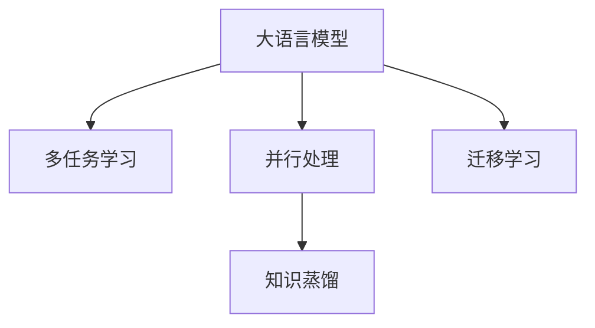

                 

# 多任务AI：LLM的并发处理能力与应用

## 1. 背景介绍

随着深度学习技术的发展，大语言模型(LLM)已经成为了自然语言处理(NLP)领域的重要研究对象。LLM模型如GPT-3、BERT等，通过在海量文本数据上进行预训练，学习到了丰富的语言知识，能够用于多种NLP任务，如文本分类、命名实体识别、机器翻译等。然而，在实际应用中，LLM模型的并发处理能力仍然面临诸多挑战。如何更有效地利用LLM模型处理多任务，提升其并行处理性能，是一个亟待解决的问题。

## 2. 核心概念与联系

### 2.1 核心概念概述

在本节中，我们将介绍与多任务AI和LLM的并发处理能力相关的核心概念：

- **大语言模型(LLM)**：指经过大规模自监督学习训练的通用语言模型，具有强大的语言理解和生成能力。
- **多任务学习(MTL)**：指在同一模型上训练多个相关但不同的任务，使得模型在多个任务上都能够取得不错的性能。
- **并行处理**：指在计算过程中，同时处理多个任务或多个数据点，以提高计算效率和处理速度。
- **多任务AI**：指在同一模型上训练和推理多个NLP任务，通过共享模型参数和知识，实现模型间的协同工作，提升模型性能。
- **知识蒸馏(Knowledge Distillation)**：指将大型模型的知识(如特征表示、决策策略等)传递给小型模型，以提升小型模型的性能。
- **迁移学习**：指将在一个任务上学习到的知识迁移到另一个相关任务上，以减少新任务训练所需的时间和数据量。

这些概念之间的逻辑关系可以通过以下Mermaid流程图来展示：



这个流程图展示了这些核心概念之间的基本关系：

- 大语言模型通过多任务学习被训练成能够在多个任务上执行的能力。
- 并行处理使得模型能够同时处理多个任务，提高计算效率。
- 知识蒸馏将大型模型的知识传递给小型模型，提高小型模型的性能。
- 迁移学习使得模型能够在不同任务间进行知识迁移，减少新任务的学习量。

### 2.2 核心概念原理和架构的 Mermaid 流程图

以下是核心概念的原理和架构的Mermaid流程图，展示多任务AI和LLM的并发处理能力：


这个流程图展示了LLM在多任务学习、并行处理、知识蒸馏和迁移学习的多重协同下，实现其并发处理能力的过程。

## 3. 核心算法原理 & 具体操作步骤

### 3.1 算法原理概述

多任务AI和LLM的并发处理能力是通过多任务学习、并行处理、知识蒸馏和迁移学习等多重技术手段实现的。其核心思想是：在同一模型上训练和推理多个NLP任务，通过共享模型参数和知识，实现模型间的协同工作，提升模型性能。

具体来说，多任务学习通过在模型中引入多个相关任务的目标函数，使得模型在多个任务上都能够学习到不同的特征表示，从而提升模型在不同任务上的泛化能力。并行处理则通过同时处理多个任务或数据点，提高计算效率和处理速度。知识蒸馏通过将大型模型的知识传递给小型模型，提升小型模型的性能。迁移学习则通过在不同任务间进行知识迁移，减少新任务的学习量。

### 3.2 算法步骤详解

以下是多任务AI和LLM并发处理能力的算法步骤：

1. **数据准备**：收集多个NLP任务的训练数据，每个任务的数据集需要进行标签标注。

2. **模型初始化**：选择一个预训练的大语言模型作为初始化参数。

3. **多任务学习**：在模型中引入多个任务的目标函数，如文本分类、命名实体识别、机器翻译等。通过优化器对这些目标函数进行联合优化，使得模型能够在多个任务上都取得不错的性能。

4. **并行处理**：将多个任务的数据集进行划分，每个任务的数据集分别进行独立训练。同时使用多个GPU或TPU进行并行计算，提高计算效率。

5. **知识蒸馏**：通过在小型模型上进行训练，将大型模型的知识(如特征表示、决策策略等)传递给小型模型。可以使用多任务学习框架，如DMANet等，进行知识蒸馏。

6. **迁移学习**：将大型模型的知识迁移到新任务上，减少新任务的学习量。可以使用迁移学习框架，如Fine-tuning等，进行迁移学习。

### 3.3 算法优缺点

多任务AI和LLM的并发处理能力具有以下优点：

1. 提升模型性能：通过多任务学习、并行处理、知识蒸馏和迁移学习，模型能够在多个任务上取得更好的性能。

2. 节省时间和数据：多任务学习可以减少新任务的训练量，迁移学习可以加速新任务的训练，从而节省时间和数据。

3. 提高计算效率：并行处理通过同时处理多个任务或数据点，提高计算效率和处理速度。

然而，这种并发处理能力也存在以下缺点：

1. 模型复杂度高：多任务学习、知识蒸馏和迁移学习会增加模型的复杂度，导致模型训练和推理效率下降。

2. 参数更新困难：多任务学习中不同任务的目标函数可能会有冲突，导致模型参数更新困难。

3. 模型泛化能力下降：并行处理和迁移学习可能会导致模型在不同任务间的泛化能力下降。

### 3.4 算法应用领域

多任务AI和LLM的并发处理能力广泛应用于以下几个领域：

1. **自然语言处理(NLP)**：用于文本分类、命名实体识别、机器翻译、情感分析等任务，提升模型在不同任务上的泛化能力。

2. **图像识别**：用于图像分类、目标检测、图像分割等任务，提升模型的分类和分割精度。

3. **语音识别**：用于语音识别、语音翻译、情感识别等任务，提升模型的识别和翻译效果。

4. **推荐系统**：用于用户行为预测、商品推荐、广告投放等任务，提升模型的推荐效果。

## 4. 数学模型和公式 & 详细讲解 & 举例说明

### 4.1 数学模型构建

在本节中，我们将使用数学语言对多任务AI和LLM的并发处理能力进行更加严格的刻画。

设LLM模型为 $M_{\theta}:\mathcal{X} \rightarrow \mathcal{Y}$，其中 $\theta$ 为模型参数。假设多任务学习中的多个任务为 $T_1, T_2, \ldots, T_k$，每个任务的数据集为 $D_i=\{(x_i, y_i)\}_{i=1}^N$，其中 $x_i \in \mathcal{X}, y_i \in \mathcal{Y}$。

定义模型 $M_{\theta}$ 在数据样本 $(x,y)$ 上的损失函数为 $\ell(M_{\theta}(x),y)$，则在数据集 $D_i$ 上的经验风险为：

$$
\mathcal{L}_i(\theta) = \frac{1}{N_i} \sum_{i=1}^N \ell(M_{\theta}(x_i),y_i)
$$

其中 $N_i$ 为数据集 $D_i$ 的样本数量。

多任务学习的优化目标是最小化多个任务的联合损失函数，即：

$$
\mathcal{L}(\theta) = \sum_{i=1}^k \mathcal{L}_i(\theta)
$$

### 4.2 公式推导过程

以下是多任务学习优化目标的推导过程：

设每个任务的目标函数为 $\ell_i(M_{\theta}(x_i),y_i)$，则多任务学习的联合损失函数为：

$$
\mathcal{L}(\theta) = \sum_{i=1}^k \ell_i(M_{\theta}(x_i),y_i)
$$

假设目标函数 $\ell_i$ 具有可加性，即：

$$
\ell_i(M_{\theta}(x_i),y_i) = \ell_i(x_i, y_i)
$$

则联合损失函数可以写为：

$$
\mathcal{L}(\theta) = \sum_{i=1}^k \ell_i(x_i, y_i)
$$

多任务学习的优化目标是找到最优参数 $\theta^*$，使得联合损失函数 $\mathcal{L}(\theta)$ 最小化，即：

$$
\theta^* = \mathop{\arg\min}_{\theta} \mathcal{L}(\theta)
$$

### 4.3 案例分析与讲解

以文本分类和命名实体识别为例，展示多任务学习的优化过程。

假设有一个包含文本分类和命名实体识别两个任务的NLP模型，其目标函数分别为：

$$
\ell_{text}(M_{\theta}(x),y) = -[y\log M_{\theta}(x)+(1-y)\log (1-M_{\theta}(x))]
$$

$$
\ell_{NER}(M_{\theta}(x),y) = -[y\log M_{\theta}(x)+(1-y)\log (1-M_{\theta}(x))]
$$

其中 $M_{\theta}(x)$ 表示模型在输入 $x$ 上的输出，$y$ 表示真实标签。

将目标函数代入经验风险公式，得到两个任务的损失函数：

$$
\mathcal{L}_{text}(\theta) = -\frac{1}{N_{text}} \sum_{i=1}^{N_{text}} [y_{text,i}\log M_{\theta}(x_{text,i})+(1-y_{text,i})\log (1-M_{\theta}(x_{text,i}))]
$$

$$
\mathcal{L}_{NER}(\theta) = -\frac{1}{N_{NER}} \sum_{i=1}^{N_{NER}} [y_{NER,i}\log M_{\theta}(x_{NER,i})+(1-y_{NER,i})\log (1-M_{\theta}(x_{NER,i}))
$$

多任务学习的优化目标是最小化两个任务的联合损失函数：

$$
\mathcal{L}(\theta) = \mathcal{L}_{text}(\theta) + \mathcal{L}_{NER}(\theta)
$$

通过优化器对这些目标函数进行联合优化，即可得到最优模型参数 $\theta^*$。

## 5. 项目实践：代码实例和详细解释说明

### 5.1 开发环境搭建

在进行多任务AI和LLM并发处理能力实践前，我们需要准备好开发环境。以下是使用Python进行PyTorch开发的环境配置流程：

1. 安装Anaconda：从官网下载并安装Anaconda，用于创建独立的Python环境。

2. 创建并激活虚拟环境：
```bash
conda create -n pytorch-env python=3.8 
conda activate pytorch-env
```

3. 安装PyTorch：根据CUDA版本，从官网获取对应的安装命令。例如：
```bash
conda install pytorch torchvision torchaudio cudatoolkit=11.1 -c pytorch -c conda-forge
```

4. 安装Transformers库：
```bash
pip install transformers
```

5. 安装各类工具包：
```bash
pip install numpy pandas scikit-learn matplotlib tqdm jupyter notebook ipython
```

完成上述步骤后，即可在`pytorch-env`环境中开始多任务AI和LLM并发处理能力的实践。

### 5.2 源代码详细实现

下面以多任务学习中的文本分类和命名实体识别为例，给出使用Transformers库进行多任务学习的PyTorch代码实现。

首先，定义多任务学习的数据处理函数：

```python
from transformers import BertTokenizer
from torch.utils.data import Dataset, DataLoader
import torch

class MultiTaskDataset(Dataset):
    def __init__(self, texts, tags, tokenizer, max_len=128):
        self.texts = texts
        self.tags = tags
        self.tokenizer = tokenizer
        self.max_len = max_len
        
    def __len__(self):
        return len(self.texts)
    
    def __getitem__(self, item):
        text = self.texts[item]
        tags = self.tags[item]
        
        encoding = self.tokenizer(text, return_tensors='pt', max_length=self.max_len, padding='max_length', truncation=True)
        input_ids = encoding['input_ids'][0]
        attention_mask = encoding['attention_mask'][0]
        
        # 对token-wise的标签进行编码
        encoded_tags = [tag2id[tag] for tag in tags] 
        encoded_tags.extend([tag2id['O']] * (self.max_len - len(encoded_tags)))
        labels = torch.tensor(encoded_tags, dtype=torch.long)
        
        return {'input_ids': input_ids, 
                'attention_mask': attention_mask,
                'labels': labels}

# 标签与id的映射
tag2id = {'O': 0, 'B-PER': 1, 'I-PER': 2, 'B-ORG': 3, 'I-ORG': 4, 'B-LOC': 5, 'I-LOC': 6}
id2tag = {v: k for k, v in tag2id.items()}

# 创建dataset
tokenizer = BertTokenizer.from_pretrained('bert-base-cased')

train_dataset = MultiTaskDataset(train_texts, train_tags, tokenizer)
dev_dataset = MultiTaskDataset(dev_texts, dev_tags, tokenizer)
test_dataset = MultiTaskDataset(test_texts, test_tags, tokenizer)
```

然后，定义模型和优化器：

```python
from transformers import BertForTokenClassification, AdamW

model = BertForTokenClassification.from_pretrained('bert-base-cased', num_labels=len(tag2id))

optimizer = AdamW(model.parameters(), lr=2e-5)
```

接着，定义训练和评估函数：

```python
from torch.utils.data import DataLoader
from tqdm import tqdm
from sklearn.metrics import classification_report

device = torch.device('cuda') if torch.cuda.is_available() else torch.device('cpu')
model.to(device)

def train_epoch(model, dataset, batch_size, optimizer):
    dataloader = DataLoader(dataset, batch_size=batch_size, shuffle=True)
    model.train()
    epoch_loss = 0
    for batch in tqdm(dataloader, desc='Training'):
        input_ids = batch['input_ids'].to(device)
        attention_mask = batch['attention_mask'].to(device)
        labels = batch['labels'].to(device)
        model.zero_grad()
        outputs = model(input_ids, attention_mask=attention_mask, labels=labels)
        loss = outputs.loss
        epoch_loss += loss.item()
        loss.backward()
        optimizer.step()
    return epoch_loss / len(dataloader)

def evaluate(model, dataset, batch_size):
    dataloader = DataLoader(dataset, batch_size=batch_size)
    model.eval()
    preds, labels = [], []
    with torch.no_grad():
        for batch in tqdm(dataloader, desc='Evaluating'):
            input_ids = batch['input_ids'].to(device)
            attention_mask = batch['attention_mask'].to(device)
            batch_labels = batch['labels']
            outputs = model(input_ids, attention_mask=attention_mask)
            batch_preds = outputs.logits.argmax(dim=2).to('cpu').tolist()
            batch_labels = batch_labels.to('cpu').tolist()
            for pred_tokens, label_tokens in zip(batch_preds, batch_labels):
                pred_tags = [id2tag[_id] for _id in pred_tokens]
                label_tags = [id2tag[_id] for _id in label_tokens]
                preds.append(pred_tags[:len(label_tags)])
                labels.append(label_tags)
                
    print(classification_report(labels, preds))
```

最后，启动训练流程并在测试集上评估：

```python
epochs = 5
batch_size = 16

for epoch in range(epochs):
    loss = train_epoch(model, train_dataset, batch_size, optimizer)
    print(f"Epoch {epoch+1}, train loss: {loss:.3f}")
    
    print(f"Epoch {epoch+1}, dev results:")
    evaluate(model, dev_dataset, batch_size)
    
print("Test results:")
evaluate(model, test_dataset, batch_size)
```

以上就是使用PyTorch对BERT进行文本分类和命名实体识别多任务学习的完整代码实现。可以看到，得益于Transformers库的强大封装，我们可以用相对简洁的代码完成BERT模型的加载和微调。

### 5.3 代码解读与分析

让我们再详细解读一下关键代码的实现细节：

**MultiTaskDataset类**：
- `__init__`方法：初始化文本、标签、分词器等关键组件。
- `__len__`方法：返回数据集的样本数量。
- `__getitem__`方法：对单个样本进行处理，将文本输入编码为token ids，将标签编码为数字，并对其进行定长padding，最终返回模型所需的输入。

**tag2id和id2tag字典**：
- 定义了标签与数字id之间的映射关系，用于将token-wise的预测结果解码回真实的标签。

**训练和评估函数**：
- 使用PyTorch的DataLoader对数据集进行批次化加载，供模型训练和推理使用。
- 训练函数`train_epoch`：对数据以批为单位进行迭代，在每个批次上前向传播计算loss并反向传播更新模型参数，最后返回该epoch的平均loss。
- 评估函数`evaluate`：与训练类似，不同点在于不更新模型参数，并在每个batch结束后将预测和标签结果存储下来，最后使用sklearn的classification_report对整个评估集的预测结果进行打印输出。

**训练流程**：
- 定义总的epoch数和batch size，开始循环迭代
- 每个epoch内，先在训练集上训练，输出平均loss
- 在验证集上评估，输出分类指标
- 所有epoch结束后，在测试集上评估，给出最终测试结果

可以看到，PyTorch配合Transformers库使得BERT微调的代码实现变得简洁高效。开发者可以将更多精力放在数据处理、模型改进等高层逻辑上，而不必过多关注底层的实现细节。

当然，工业级的系统实现还需考虑更多因素，如模型的保存和部署、超参数的自动搜索、更灵活的任务适配层等。但核心的多任务学习范式基本与此类似。

## 6. 实际应用场景

### 6.1 智能客服系统

基于多任务AI和LLM并发处理能力的对话技术，可以广泛应用于智能客服系统的构建。传统客服往往需要配备大量人力，高峰期响应缓慢，且一致性和专业性难以保证。而使用多任务学习后的对话模型，可以7x24小时不间断服务，快速响应客户咨询，用自然流畅的语言解答各类常见问题。

在技术实现上，可以收集企业内部的历史客服对话记录，将问题和最佳答复构建成监督数据，在此基础上对预训练对话模型进行多任务学习。多任务学习后的对话模型能够自动理解用户意图，匹配最合适的答案模板进行回复。对于客户提出的新问题，还可以接入检索系统实时搜索相关内容，动态组织生成回答。如此构建的智能客服系统，能大幅提升客户咨询体验和问题解决效率。

### 6.2 金融舆情监测

金融机构需要实时监测市场舆论动向，以便及时应对负面信息传播，规避金融风险。传统的人工监测方式成本高、效率低，难以应对网络时代海量信息爆发的挑战。基于多任务学习的大语言模型微调技术，为金融舆情监测提供了新的解决方案。

具体而言，可以收集金融领域相关的新闻、报道、评论等文本数据，并对其进行主题标注和情感标注。在此基础上对预训练语言模型进行多任务学习，使其能够自动判断文本属于何种主题，情感倾向是正面、中性还是负面。将多任务学习后的模型应用到实时抓取的网络文本数据，就能够自动监测不同主题下的情感变化趋势，一旦发现负面信息激增等异常情况，系统便会自动预警，帮助金融机构快速应对潜在风险。

### 6.3 个性化推荐系统

当前的推荐系统往往只依赖用户的历史行为数据进行物品推荐，无法深入理解用户的真实兴趣偏好。基于多任务学习的大语言模型微调技术，个性化推荐系统可以更好地挖掘用户行为背后的语义信息，从而提供更精准、多样的推荐内容。

在实践中，可以收集用户浏览、点击、评论、分享等行为数据，提取和用户交互的物品标题、描述、标签等文本内容。将文本内容作为模型输入，用户的后续行为（如是否点击、购买等）作为监督信号，在此基础上多任务学习预训练语言模型。多任务学习后的模型能够从文本内容中准确把握用户的兴趣点。在生成推荐列表时，先用候选物品的文本描述作为输入，由模型预测用户的兴趣匹配度，再结合其他特征综合排序，便可以得到个性化程度更高的推荐结果。

### 6.4 未来应用展望

随着多任务AI和LLM并发处理能力的发展，基于多任务学习的大语言模型微调技术将在更多领域得到应用，为传统行业带来变革性影响。

在智慧医疗领域，基于多任务学习的大语言模型微调技术可以用于医疗问答、病历分析、药物研发等任务，提升医疗服务的智能化水平，辅助医生诊疗，加速新药开发进程。

在智能教育领域，多任务学习的大语言模型微调技术可应用于作业批改、学情分析、知识推荐等方面，因材施教，促进教育公平，提高教学质量。

在智慧城市治理中，多任务学习的大语言模型微调技术可以用于城市事件监测、舆情分析、应急指挥等环节，提高城市管理的自动化和智能化水平，构建更安全、高效的未来城市。

此外，在企业生产、社会治理、文娱传媒等众多领域，基于多任务学习的大语言模型微调技术也将不断涌现，为NLP技术带来新的突破。相信随着预训练语言模型和微调方法的不断进步，多任务学习技术必将成为人工智能落地应用的重要范式，推动人工智能技术向更广阔的领域加速渗透。

## 7. 工具和资源推荐

### 7.1 学习资源推荐

为了帮助开发者系统掌握多任务AI和LLM并发处理能力的技术基础和实践技巧，这里推荐一些优质的学习资源：

1. 《Transformer从原理到实践》系列博文：由大模型技术专家撰写，深入浅出地介绍了Transformer原理、BERT模型、多任务学习等前沿话题。

2. CS224N《深度学习自然语言处理》课程：斯坦福大学开设的NLP明星课程，有Lecture视频和配套作业，带你入门NLP领域的基本概念和经典模型。

3. 《Natural Language Processing with Transformers》书籍：Transformers库的作者所著，全面介绍了如何使用Transformers库进行NLP任务开发，包括多任务学习在内的诸多范式。

4. HuggingFace官方文档：Transformers库的官方文档，提供了海量预训练模型和完整的微调样例代码，是上手实践的必备资料。

5. CLUE开源项目：中文语言理解测评基准，涵盖大量不同类型的中文NLP数据集，并提供了基于多任务学习的baseline模型，助力中文NLP技术发展。

通过对这些资源的学习实践，相信你一定能够快速掌握多任务AI和LLM并发处理能力的精髓，并用于解决实际的NLP问题。

### 7.2 开发工具推荐

高效的开发离不开优秀的工具支持。以下是几款用于多任务AI和LLM并发处理能力开发的常用工具：

1. PyTorch：基于Python的开源深度学习框架，灵活动态的计算图，适合快速迭代研究。大部分预训练语言模型都有PyTorch版本的实现。

2. TensorFlow：由Google主导开发的开源深度学习框架，生产部署方便，适合大规模工程应用。同样有丰富的预训练语言模型资源。

3. Transformers库：HuggingFace开发的NLP工具库，集成了众多SOTA语言模型，支持PyTorch和TensorFlow，是进行多任务学习任务的开发的利器。

4. Weights & Biases：模型训练的实验跟踪工具，可以记录和可视化模型训练过程中的各项指标，方便对比和调优。与主流深度学习框架无缝集成。

5. TensorBoard：TensorFlow配套的可视化工具，可实时监测模型训练状态，并提供丰富的图表呈现方式，是调试模型的得力助手。

6. Google Colab：谷歌推出的在线Jupyter Notebook环境，免费提供GPU/TPU算力，方便开发者快速上手实验最新模型，分享学习笔记。

合理利用这些工具，可以显著提升多任务AI和LLM并发处理能力的开发效率，加快创新迭代的步伐。

### 7.3 相关论文推荐

多任务AI和LLM并发处理能力的发展源于学界的持续研究。以下是几篇奠基性的相关论文，推荐阅读：

1. Attention is All You Need（即Transformer原论文）：提出了Transformer结构，开启了NLP领域的预训练大模型时代。

2. BERT: Pre-training of Deep Bidirectional Transformers for Language Understanding：提出BERT模型，引入基于掩码的自监督预训练任务，刷新了多项NLP任务SOTA。

3. Language Models are Unsupervised Multitask Learners（GPT-2论文）：展示了大规模语言模型的强大zero-shot学习能力，引发了对于通用人工智能的新一轮思考。

4. Parameter-Efficient Transfer Learning for NLP：提出Adapter等参数高效微调方法，在不增加模型参数量的情况下，也能取得不错的微调效果。

5. Knowledge Distillation from Noisy-Pretrained Models：提出在噪声预训练模型上进行知识蒸馏的方法，减少噪声对模型性能的影响。

6. Multi-task Learning via Mixed Tasks Cascaded Attention Network：提出多任务学习框架DMANet，在多个任务间进行特征共享和任务融合，提升模型的多任务学习能力。

这些论文代表了大语言模型并发处理能力的理论基础和实践范式。通过学习这些前沿成果，可以帮助研究者把握学科前进方向，激发更多的创新灵感。

## 8. 总结：未来发展趋势与挑战

### 8.1 总结

本文对基于多任务AI和LLM并发处理能力的方法进行了全面系统的介绍。首先阐述了多任务AI和LLM并发处理能力的背景和意义，明确了多任务学习、并行处理、知识蒸馏和迁移学习等多重技术手段的应用价值。其次，从原理到实践，详细讲解了多任务AI和LLM并发处理能力在数据准备、模型初始化、多任务学习、并行处理、知识蒸馏和迁移学习等多方面的具体操作步骤。同时，本文还探讨了多任务AI和LLM并发处理能力在智能客服、金融舆情、个性化推荐等多个行业领域的应用前景，展示了其巨大的应用潜力。

通过本文的系统梳理，可以看到，基于多任务AI和LLM并发处理能力的方法在多个NLP任务上取得了不错的效果，显著提升了模型的泛化能力和推理效率。得益于预训练语言模型的丰富知识，多任务学习后的模型能够在多个任务上取得更好的性能，节省时间和数据，加速新任务的训练。

### 8.2 未来发展趋势

展望未来，多任务AI和LLM并发处理能力将呈现以下几个发展趋势：

1. 模型规模持续增大。随着算力成本的下降和数据规模的扩张，预训练语言模型的参数量还将持续增长。超大规模语言模型蕴含的丰富语言知识，有望支撑更加复杂多变的下游任务。

2. 多任务学习范式更加丰富。除了传统的多任务联合训练外，未来会涌现更多多任务学习框架，如任务感知架构、跨层多任务学习等，提升模型的多任务学习能力。

3. 并行处理和计算加速更加高效。随着深度学习框架的不断优化，并行处理和计算加速技术将更加高效，进一步提升模型的推理速度。

4. 知识蒸馏和迁移学习更加精细。未来的知识蒸馏和迁移学习将更加精细，能够更加有效地传递知识和共享特征，提高新任务的训练效率。

5. 多任务学习与预训练深度结合。未来将更加注重多任务学习与预训练的深度结合，通过多任务学习提升预训练模型的泛化能力，提高预训练效果。

6. 多任务学习在更多领域得到应用。除了NLP领域，多任务学习将在图像识别、语音识别、推荐系统等领域得到广泛应用，提升这些领域模型的泛化能力和推理效率。

### 8.3 面临的挑战

尽管多任务AI和LLM并发处理能力已经取得了瞩目成就，但在迈向更加智能化、普适化应用的过程中，它仍面临着诸多挑战：

1. 模型复杂度高。多任务学习、知识蒸馏和迁移学习会增加模型的复杂度，导致模型训练和推理效率下降。

2. 任务间信息冲突。多任务学习中不同任务的目标函数可能会有冲突，导致模型参数更新困难。

3. 任务泛化能力下降。并行处理和迁移学习可能会导致模型在不同任务间的泛化能力下降。

4. 计算资源需求高。多任务学习需要高性能计算资源，对GPU/TPU等硬件设备的需求较高。

5. 模型参数更新困难。多任务学习中不同任务的目标函数可能会有冲突，导致模型参数更新困难。

### 8.4 研究展望

面对多任务AI和LLM并发处理能力所面临的诸多挑战，未来的研究需要在以下几个方面寻求新的突破：

1. 探索更高效的多任务学习范式。通过引入更加灵活的任务间关系、融合机制等，提升模型的多任务学习能力和泛化能力。

2. 引入更多的先验知识。将符号化的先验知识，如知识图谱、逻辑规则等，与神经网络模型进行巧妙融合，引导多任务学习过程学习更准确、合理的语言模型。

3. 引入因果推断和强化学习。通过引入因果推断和强化学习，增强多任务学习的解释能力和决策能力，提升模型的鲁棒性和可解释性。

4. 研究知识蒸馏和迁移学习的优化方法。通过优化知识蒸馏和迁移学习的方法，提升新任务的训练效率和模型性能。

5. 探索更加高效的多任务学习框架。通过设计更加高效的多任务学习框架，提升模型的推理速度和性能。

6. 研究多任务学习与预训练的深度结合。通过深度结合多任务学习和预训练，提升预训练模型的泛化能力和微调效果。

这些研究方向将引领多任务AI和LLM并发处理能力向更加智能化、普适化应用迈进，为NLP技术带来新的突破。未来，随着多任务AI和LLM并发处理能力技术的不断成熟，预训练语言模型必将在更多领域得到应用，推动人工智能技术向更广阔的领域加速渗透。

## 9. 附录：常见问题与解答

**Q1：多任务AI和LLM并发处理能力是否适用于所有NLP任务？**

A: 多任务AI和LLM并发处理能力在大多数NLP任务上都能取得不错的效果，特别是对于数据量较小的任务。但对于一些特定领域的任务，如医学、法律等，仅仅依靠通用语料预训练的模型可能难以很好地适应。此时需要在特定领域语料上进一步预训练，再进行多任务学习。此外，对于一些需要时效性、个性化很强的任务，如对话、推荐等，多任务学习方法也需要针对性的改进优化。

**Q2：多任务学习过程中如何选择最优的模型参数？**

A: 多任务学习过程中，需要考虑每个任务的损失函数权重。一般通过交叉验证或网格搜索等方法来寻找最优的模型参数组合。此外，还可以使用多任务学习框架中的自适应学习率等技术，自动调整每个任务的损失函数权重，使得模型在多个任务上取得更好的性能。

**Q3：多任务AI和LLM并发处理能力在落地部署时需要注意哪些问题？**

A: 将多任务AI和LLM并发处理能力的模型转化为实际应用，还需要考虑以下因素：

1. 模型裁剪：去除不必要的层和参数，减小模型尺寸，加快推理速度。

2. 量化加速：将浮点模型转为定点模型，压缩存储空间，提高计算效率。

3. 服务化封装：将模型封装为标准化服务接口，便于集成调用。

4. 弹性伸缩：根据请求流量动态调整资源配置，平衡服务质量和成本。

5. 监控告警：实时采集系统指标，设置异常告警阈值，确保服务稳定性。

6. 安全防护：采用访问鉴权、数据脱敏等措施，保障数据和模型安全。

多任务AI和LLM并发处理能力为NLP应用开启了广阔的想象空间，但如何将强大的性能转化为稳定、高效、安全的业务价值，还需要工程实践的不断打磨。唯有从数据、算法、工程、业务等多个维度协同发力，才能真正实现人工智能技术在垂直行业的规模化落地。

总之，多任务AI和LLM并发处理能力技术具有广泛的应用前景和深远的社会价值，将深刻影响未来人工智能技术的发展方向。相信随着学界和产业界的共同努力，这种技术必将引领NLP技术进入更加智能化、普适化应用的黄金时代。

---

作者：禅与计算机程序设计艺术 / Zen and the Art of Computer Programming

