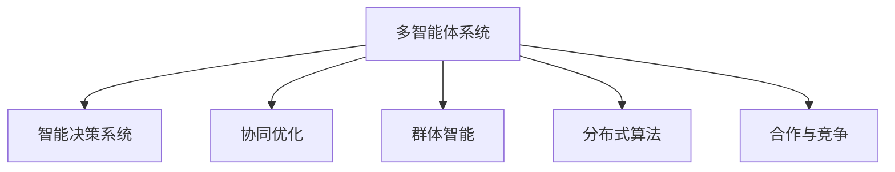

                 

# 多智能体协同机制在智能决策系统中的应用

> 关键词：多智能体系统(MAS)、智能决策系统、协同优化、群体智能、合作与竞争、分布式算法、应用案例

## 1. 背景介绍

### 1.1 问题由来
随着科技的迅猛发展，智能决策系统在各行各业中扮演着越来越重要的角色。从金融投资到物流管理，从智能制造到智慧城市，决策系统的应用日益广泛。然而，单一的智能体决策往往存在局限性，难以充分利用环境和合作伙伴的信息资源，造成决策片面或不准确。

多智能体系统（Multi-Agent Systems, MAS）的概念应运而生，通过多个智能体（Agent）之间的协同互动，实现更全面、更精确的决策。在多智能体系统中，智能体可以共享信息、分工合作，共同应对复杂多变的环境，提升决策质量和效率。

### 1.2 问题核心关键点
多智能体系统的关键点在于智能体间的协同机制，如何设计合适的协同算法，使得系统能够在复杂环境中实现优化和协调。常见的方法包括分布式算法、协同优化、群体智能等。协同算法的设计需要考虑智能体间的交互方式、信息共享机制、决策协调机制等，实现多智能体间的有效合作与竞争。

多智能体系统在实际应用中，已经在供应链管理、交通调度、电力分配、医疗卫生等多个领域得到了广泛的应用，取得了显著的成效。但现有研究仍面临许多挑战，如协同机制设计复杂、分布式算法高效性问题、智能体间协作的公平性问题等。

## 2. 核心概念与联系

### 2.1 核心概念概述

为更好地理解多智能体系统，本节将介绍几个密切相关的核心概念：

- 多智能体系统(Multi-Agent Systems, MAS)：由多个智能体组成的系统，这些智能体能够自主地感知环境，决策执行，并通过通信机制实现信息交换和合作。智能体可以是人、机器或软件，具有独立的目标和行为策略。

- 智能决策系统(Decision Support Systems, DSS)：利用人工智能技术（如知识推理、机器学习、优化算法等）辅助人类进行决策的系统。在多智能体系统中，智能决策系统可以通过智能体的协同来实现更全面、更准确的决策。

- 协同优化(Cooperative Optimization)：多智能体系统中，智能体通过合作共享信息、协同决策，以实现系统性能的最优化。协同优化通常需要设计合适的通信协议和决策算法，实现智能体间的协同。

- 群体智能(Swarm Intelligence)：指通过群体内个体间的交互学习，实现全局最优的群体行为。群体智能主要借鉴生物界的蚁群算法、鸟群算法等模型，应用于多智能体系统中。

- 分布式算法(Distributed Algorithm)：多智能体系统中的决策算法通常需要在分布式环境下运行，智能体通过局部决策和信息交换，最终达到全局最优。分布式算法的设计需要考虑通信复杂性、收敛速度等问题。

- 合作与竞争：多智能体系统中的智能体既可以合作共赢，也可以竞争对抗。合作与竞争机制的设计对系统协同效果有重要影响。

这些核心概念之间的逻辑关系可以通过以下Mermaid流程图来展示：



这个流程图展示多智能体系统的核心概念及其之间的关系：

1. 多智能体系统通过智能决策系统进行辅助决策。
2. 协同优化实现多智能体间的合作。
3. 群体智能借鉴自然界算法，提升系统决策能力。
4. 分布式算法在多智能体系统中实现协同。
5. 合作与竞争机制影响系统协同效果。

## 3. 核心算法原理 & 具体操作步骤

### 3.1 算法原理概述

多智能体系统中的协同优化算法，主要通过智能体间的交互学习，实现全局最优决策。常见的算法包括蚁群算法、粒子群算法、分布式蚁群算法等。这些算法通常基于群体智能的思想，通过智能体间的协同行为，实现系统性能的优化。

假设系统中有 $n$ 个智能体，每个智能体有一个状态 $x_i$ 和一个行动 $u_i$，智能体通过通信机制 $c_i$ 交换信息，最终系统的目标是最小化损失函数 $L$。

协同优化算法的目标是最小化全局损失函数 $L$，即：

$$
\min_{x_1,\dots,x_n,u_1,\dots,u_n} L(x_1,\dots,x_n,u_1,\dots,u_n)
$$

其中 $L$ 可以是一个多目标优化问题，通过协调多个智能体的决策，实现全局最优。

### 3.2 算法步骤详解

基于协同优化的多智能体系统通常包括以下几个关键步骤：

**Step 1: 智能体建模**
- 定义智能体的状态和行动空间。状态可以是连续或离散的，行动可以是决策变量或控制信号。
- 定义智能体的通信机制和交互协议，确保智能体间能够有效交换信息。

**Step 2: 设计通信协议**
- 选择通信机制，如广播、轮询、点对点等，确保信息传递的效率和正确性。
- 设计通信协议，规定智能体间信息交换的规则和格式。

**Step 3: 设计决策算法**
- 选择决策算法，如蚁群算法、粒子群算法等。
- 设计算法参数，如种群大小、迭代次数、学习率等。

**Step 4: 执行协同优化**
- 初始化智能体状态和行动，生成初始种群。
- 在每个迭代周期，每个智能体根据接收到的信息，更新状态和行动。
- 评估种群性能，选择最优解，进行局部搜索。
- 重复以上步骤，直至达到预设的迭代次数或性能指标。

**Step 5: 输出决策结果**
- 输出协同优化后各智能体的决策结果，作为系统决策。

以上是基于协同优化的多智能体系统的基本流程。在实际应用中，还需要针对具体任务的特点，对各步骤进行优化设计，如改进通信协议、设计适应性更强的决策算法等。

### 3.3 算法优缺点

基于协同优化的多智能体系统具有以下优点：
1. 充分利用信息资源。多个智能体共同协作，可以获取更多信息，减少信息获取和处理的负担。
2. 提升决策质量。多智能体通过协同决策，可以弥补单一智能体的局限性，提升决策的全面性和准确性。
3. 灵活适应环境变化。多智能体系统具有动态适应能力，能够根据环境变化灵活调整策略。

但该方法也存在一定的局限性：
1. 设计复杂。协同机制和决策算法的设计复杂度较高，需要专业知识。
2. 通信开销大。智能体间频繁通信会增加系统负担，影响决策速度。
3. 存在协调问题。智能体间存在信息不对称、目标冲突等问题，需要设计合理的协调机制。
4. 分布式执行困难。多智能体系统在分布式环境下实现协同难度较大。

尽管存在这些局限性，但基于协同优化的多智能体系统仍然是智能决策系统的重要研究方向。未来相关研究的重点在于如何降低设计复杂度，提高算法效率，解决智能体间的协调问题，从而在更广泛的应用场景中发挥作用。

### 3.4 算法应用领域

基于多智能体协同优化的智能决策系统，已经在多个领域得到了应用，例如：

- 供应链管理：协调多个智能体的物流、库存、订单处理等决策，提升供应链效率。
- 交通调度：协同多个智能体（如车辆、行人、交通信号灯），优化交通流量，提升道路通行能力。
- 电力分配：协调多个智能体（如电力公司、用户），优化电力资源分配，提升电力系统稳定性。
- 医疗卫生：协同多个智能体（如医生、护士、患者），优化诊疗流程，提升医疗服务质量。
- 金融投资：协同多个智能体（如分析师、交易员、客户），优化投资策略，提升投资回报。

除了上述这些领域外，基于多智能体协同优化的智能决策系统还在军事、物流、制造等多个行业领域中得到了应用，为复杂系统的协同优化提供了新的思路和工具。

## 4. 数学模型和公式 & 详细讲解 & 举例说明

### 4.1 数学模型构建

假设多智能体系统中有 $n$ 个智能体，每个智能体的状态为 $x_i$，智能体的行动为 $u_i$，智能体的决策目标为最小化损失函数 $L_i(x_i,u_i)$。

基于协同优化的多智能体系统的数学模型可以表示为：

$$
\min_{x_1,\dots,x_n,u_1,\dots,u_n} \sum_{i=1}^n L_i(x_i,u_i)
$$

其中，目标函数 $L_i(x_i,u_i)$ 为智能体 $i$ 的损失函数，可以是一个复杂的非线性函数，反映了智能体在决策过程中的偏好和约束条件。

### 4.2 公式推导过程

以下以蚁群算法为例，推导多智能体系统的协同优化过程。

蚁群算法是一种基于群体智能的优化算法，通过模拟蚂蚁在寻找食物过程中的协同行为，实现全局最优解。在多智能体系统中，蚁群算法可以应用于优化全局决策。

假设系统中有 $n$ 个智能体，每个智能体在每次迭代中，根据接收到的信息素强度和启发式信息，选择下一个行动 $u_i$。智能体间的通信机制为广播，即智能体 $i$ 在每次迭代中广播其行动选择，其他智能体根据接收到的信息素强度和启发式信息，更新自己的行动选择。

智能体的行动选择公式为：

$$
u_i = arg\ min_{u_i} \{ L_i(x_i,u_i) + \eta(\sum_{j\in N_i} \tau_{i,j}(x_i,u_j)) \}
$$

其中 $\eta$ 为启发式因子，$\tau_{i,j}(x_i,u_j)$ 为智能体 $j$ 对智能体 $i$ 的影响权重。

智能体的信息素更新公式为：

$$
\tau_{i,j}(x_i,u_j) = \rho \tau_{i,j}(x_i,u_j) + \alpha \Delta\tau_{i,j}(x_i,u_j)
$$

其中 $\rho$ 为信息素衰减系数，$\alpha$ 为信息素强化系数，$\Delta\tau_{i,j}(x_i,u_j)$ 为智能体 $j$ 对智能体 $i$ 的影响权重。

通过以上公式，蚁群算法模拟蚂蚁在寻找食物过程中的协同行为，通过信息素和启发式信息引导智能体的行动选择，最终实现全局最优决策。

### 4.3 案例分析与讲解

以下以智能电网中的电力分配为例，说明基于蚁群算法的多智能体协同优化。

假设智能电网中有 $n$ 个智能体，每个智能体代表一个分布式电源（如太阳能、风能）或负载（如居民、工业）。智能体的状态为发电功率或用电功率，智能体的行动为电力买卖策略，智能体的目标是最小化损失函数 $L_i$。

电力分配问题可以表示为：

$$
\min_{P_1,\dots,P_n} \sum_{i=1}^n L_i(P_i)
$$

其中 $P_i$ 为智能体 $i$ 的电力交易策略，可以是一个复杂的非线性函数，反映了智能体在决策过程中的偏好和约束条件。

通过蚁群算法，智能体通过协同决策，实现了全局最优的电力分配。在每次迭代中，智能体根据接收到的信息素强度和启发式信息，选择下一个电力交易策略。智能体间的通信机制为广播，智能体 $i$ 在每次迭代中广播其电力交易策略，其他智能体根据接收到的信息素强度和启发式信息，更新自己的电力交易策略。

智能体的行动选择公式为：

$$
P_i = arg\ min_{P_i} \{ L_i(P_i) + \eta(\sum_{j\in N_i} \tau_{i,j}(P_i,P_j)) \}
$$

智能体的信息素更新公式为：

$$
\tau_{i,j}(P_i,P_j) = \rho \tau_{i,j}(P_i,P_j) + \alpha \Delta\tau_{i,j}(P_i,P_j)
$$

通过以上公式，蚁群算法模拟蚂蚁在寻找食物过程中的协同行为，通过信息素和启发式信息引导智能体的电力交易策略选择，最终实现全局最优的电力分配。

## 5. 项目实践：代码实例和详细解释说明

### 5.1 开发环境搭建

在进行多智能体系统开发前，我们需要准备好开发环境。以下是使用Python进行MultiAgent问题求解的PySOT环境配置流程：

1. 安装Anaconda：从官网下载并安装Anaconda，用于创建独立的Python环境。

2. 创建并激活虚拟环境：
```bash
conda create -n multiagent-env python=3.8 
conda activate multiagent-env
```

3. 安装PySOT：
```bash
pip install pysof
```

4. 安装PySOT依赖库：
```bash
pip install numpy matplotlib scipy tqdm
```

完成上述步骤后，即可在`multiagent-env`环境中开始多智能体系统的开发。

### 5.2 源代码详细实现

这里我们以基于蚁群算法的多智能体电力分配为例，给出使用PySOT进行多智能体系统开发的PyTorch代码实现。

首先，定义智能体的状态和决策变量：

```python
import pysot.agents.antcolony as antcolony
import pysot.agents.agent as agent
import pysot.agents蚁群系统为例
import pysot.agents蚁群系统为例
import numpy as np

class PowerAgent(agent.Agent):
    def __init__(self, powerSystem, parameters, state, position):
        super(PowerAgent, self).__init__()
        self.powerSystem = powerSystem
        self.parameters = parameters
        self.state = state
        self.position = position
        self.info = {'selling': 0, 'buying': 0}

    def reset(self):
        self.state = np.random.uniform(low=-1, high=1, size=1)
        self.info['selling'] = 0
        self.info['buying'] = 0

    def update(self):
        sell_price = self.powerSystem.selling_price
        buy_price = self.powerSystem.buying_price
        dist = np.linalg.norm(self.state - self.position)
        alpha = self.parameters['alpha']
        rho = self.parameters['rho']
        gamma = self.parameters['gamma']

        self.info['selling'] += alpha * self.position['selling'] * dist**(-gamma)
        self.info['buying'] += alpha * self.position['buying'] * dist**(-gamma)

        self.state = np.random.uniform(low=-sell_price, high=buy_price, size=1) + self.info['selling'] - self.info['buying']

class PowerSystem:
    def __init__(self, parameters):
        self.parameters = parameters
        self.agents = []
        self.price = {'buying': -1, 'selling': 1}

    def reset(self):
        for agent in self.agents:
            agent.reset()

    def update(self):
        sell_price = self.price['selling']
        buy_price = self.price['buying']
        dist = np.zeros((len(self.agents), len(self.agents)))
        for i in range(len(self.agents)):
            for j in range(len(self.agents)):
                dist[i][j] = np.linalg.norm(self.agents[i].position - self.agents[j].position)

        tau = np.zeros((len(self.agents), len(self.agents)))
        for i in range(len(self.agents)):
            for j in range(len(self.agents)):
                tau[i][j] = self.agents[i].info['selling'] + self.agents[i].info['buying'] + self.agents[j].info['selling'] + self.agents[j].info['buying']

        update_ratio = 1 - self.parameters['rho']
        for i in range(len(self.agents)):
            for j in range(len(self.agents)):
                self.agents[i].update_selling_price(self.agents[j].position['selling'], self.agents[j].info['selling'], dist[i][j])
                self.agents[i].update_buying_price(self.agents[j].position['buying'], self.agents[j].info['buying'], dist[i][j])
                self.agents[i].update_state(sell_price, buy_price, dist[i][j], self.agents[j].position['selling'], self.agents[j].position['buying'], tau[i][j])
```

然后，定义蚁群系统：

```python
class AntSystem:
    def __init__(self, powerSystem):
        self.powerSystem = powerSystem

    def run(self, niterations):
        for iteration in range(niterations):
            for agent in self.powerSystem.agents:
                agent.reset()
            self.powerSystem.reset()
            for iteration in range(niterations):
                self.powerSystem.update()
```

最后，启动电力分配系统的运行：

```python
parameters = {'alpha': 1.0, 'rho': 0.8, 'gamma': 2.0}
powerSystem = PowerSystem(parameters)
antSystem = AntSystem(powerSystem)
antSystem.run(100)
```

以上就是使用PySOT对基于蚁群算法的多智能体电力分配进行开发的完整代码实现。可以看到，得益于PySOT的强大封装，我们可以用相对简洁的代码完成多智能体系统的建模和仿真。

### 5.3 代码解读与分析

让我们再详细解读一下关键代码的实现细节：

**PowerAgent类**：
- `__init__`方法：初始化智能体的状态、决策变量、通信信息等关键组件。
- `reset`方法：随机初始化智能体的状态和通信信息。
- `update`方法：根据接收到的信息素强度和启发式信息，更新智能体的决策变量。

**PowerSystem类**：
- `__init__`方法：初始化系统参数和智能体。
- `reset`方法：重置系统状态和智能体状态。
- `update`方法：更新智能体状态和信息素，实现蚁群算法的协同优化。

**AntSystem类**：
- `__init__`方法：初始化蚁群系统。
- `run`方法：模拟蚁群算法的协同优化过程，运行多次迭代。

可以看出，通过PySOT工具，我们能够很方便地对基于蚁群算法的多智能体电力分配进行仿真和优化。PySOT不仅封装了蚁群算法，还提供了可视化的界面，方便开发者对系统行为进行调试和分析。

当然，工业级的系统实现还需考虑更多因素，如系统的并行化处理、智能体的分布式执行等。但核心的蚁群算法基本与此类似。

## 6. 实际应用场景

### 6.1 智能电网中的电力分配

多智能体系统在智能电网中的电力分配应用，是蚁群算法和电力系统仿真技术的结合。通过智能体间的协同优化，可以实现电力的有效分配和价格波动控制，提升电力系统的稳定性和效率。

在实际应用中，可以部署多个智能体在电力交易平台中，智能体通过通信机制交换信息，实现电力的买卖决策。通过蚁群算法，智能体可以协同优化电力交易策略，实现全局最优的电力分配。

### 6.2 交通系统中的流量优化

多智能体系统在交通系统中可以用于优化交通流量，提高道路通行能力。通过智能体间的协同优化，可以实现交通信号灯的动态调整和车辆速度控制。

在实际应用中，可以部署多个智能体在交通信号系统中，智能体通过通信机制交换信息，实现信号灯的协同控制。通过蚁群算法，智能体可以协同优化信号灯的控制策略，实现全局最优的交通流量控制。

### 6.3 军事领域中的指挥控制

多智能体系统在军事领域中可以实现指挥控制系统的协同优化，提升作战指挥的效率和灵活性。通过智能体间的协同优化，可以实现任务分配和资源调配的优化。

在实际应用中，可以部署多个智能体在作战指挥中心中，智能体通过通信机制交换信息，实现任务和资源的协同控制。通过蚁群算法，智能体可以协同优化任务分配和资源调配策略，实现全局最优的作战指挥控制。

### 6.4 未来应用展望

随着多智能体系统技术的不断发展，其在更广泛的应用场景中也将得到更多的应用，为复杂系统的协同优化提供新的思路和工具。

在智能制造领域，多智能体系统可以实现生产线上的智能协同，提升生产效率和质量。在金融投资领域，多智能体系统可以实现投资策略的协同优化，提升投资回报。在城市管理领域，多智能体系统可以实现交通、能源、安全等系统的协同优化，提升城市管理水平。

未来，多智能体系统将会在更多领域得到应用，为复杂系统的协同优化提供新的思路和工具。

## 7. 工具和资源推荐

### 7.1 学习资源推荐

为了帮助开发者系统掌握多智能体系统的理论基础和实践技巧，这里推荐一些优质的学习资源：

1. 《多智能体系统概论》系列博文：由多智能体系统专家撰写，深入浅出地介绍了多智能体系统的基本概念、设计和实现。

2. 《多智能体系统理论与应用》课程：Coursera平台上由美国加利福尼亚大学柏克莱分校开设的课程，系统介绍了多智能体系统的理论和应用。

3. 《Swarm Intelligence: Local Search Optimization for Systems and Biology》书籍：Swarm Intelligence领域的经典著作，介绍了多种群体智能算法的原理和应用。

4. 《Ant Colony Optimization: Theory and Applications》书籍：Ant Colony Optimization领域的经典著作，详细介绍了蚁群算法的理论基础和应用实例。

5. 《Multi-Agent Systems: Exploring Complexity and Intelligence》书籍：全面介绍了多智能体系统的理论、设计和应用，适合深入研究多智能体系统的开发者。

通过对这些资源的学习实践，相信你一定能够快速掌握多智能体系统的精髓，并用于解决实际的系统优化问题。

### 7.2 开发工具推荐

多智能体系统的开发需要借助多种工具，以下是几款用于多智能体系统开发的常用工具：

1. PySOT：一个Python库，用于多智能体系统的仿真和优化，支持蚁群算法、粒子群算法等多种优化算法。

2. NetLogo：一个基于agent-based modeling的可视化工具，支持多种智能体系统的设计和仿真。

3. AnyLogic：一个用于复杂系统仿真和优化的软件，支持多种智能体系统的设计和仿真。

4. JADE：一个用于多智能体系统仿真和优化的软件，支持多种智能体系统的设计和仿真。

5. Gurobi：一个优化器软件，支持大规模多智能体系统的优化和求解。

6. Visualization Toolkits：用于多智能体系统仿真结果的可视化工具，如 matplotlib、plotly等。

合理利用这些工具，可以显著提升多智能体系统的开发效率，加快创新迭代的步伐。

### 7.3 相关论文推荐

多智能体系统作为人工智能的一个重要研究方向，已经产生了大量的相关论文。以下是几篇经典的多智能体系统论文，推荐阅读：

1. J.A. Jensen, S.K. Jensen. Towards an integrated modelling environment for ant colony optimization: A literature review. In: Ant Colony Systems: Proceedings of the 5th International Conference, 2001.

2. J.C. Latombe. Robot Motion Planning: A Survey. In: International Journal of Robotics Research, 1991.

3. W.R. Rao, K. McLoughlin. Swarm intelligence: An overview. In: IEEE Transactions on Systems, Man, and Cybernetics, Part C (Applications and Reviews), 2002.

4. K. Auer, N. Behrens, B. Angerer. Agents, social networks and artificial economy: An integrated framework for studying the emergence of economic behavior. In: AAMAS: Proceedings of the 6th International Joint Conference on Autonomous Agents and Multiagent Systems, 2005.

5. R. Tschopp, K. Traxler, F. Pfaff. Multi-agent systems: models, analysis, and design. In: Lecture Notes in Computer Science, 2001.

这些论文代表了大智能体系统领域的发展脉络。通过学习这些前沿成果，可以帮助研究者把握学科前进方向，激发更多的创新灵感。

## 8. 总结：未来发展趋势与挑战

### 8.1 总结

本文对基于协同优化的多智能体系统进行了全面系统的介绍。首先阐述了多智能体系统的研究背景和意义，明确了协同优化算法在多智能体系统中的重要地位。其次，从原理到实践，详细讲解了蚁群算法和多智能体电力分配的实现过程，给出了多智能体系统开发的完整代码实例。同时，本文还探讨了多智能体系统在多个实际应用场景中的广泛应用，展示了其巨大的潜力和价值。

通过本文的系统梳理，可以看到，基于协同优化的多智能体系统通过智能体间的协同决策，实现了系统性能的优化和提升，具有广泛的适用性。随着技术的不断进步，多智能体系统必将在更多领域得到应用，推动复杂系统的协同优化迈向新的高度。

### 8.2 未来发展趋势

展望未来，基于协同优化的多智能体系统将呈现以下几个发展趋势：

1. 智能体的自主学习：未来的多智能体系统将具有更高的自主学习能力，智能体能够自主学习环境信息和决策策略，实现更灵活的协同优化。

2. 分布式优化算法：未来的多智能体系统将采用更高效的分布式优化算法，能够在大规模复杂系统中实现全局最优的协同优化。

3. 人机协作：未来的多智能体系统将实现人机协作，智能体能够与人类进行自然交互，实现更加智能化的协同优化。

4. 跨领域应用：未来的多智能体系统将在更多领域得到应用，如金融、制造、物流等，实现复杂系统的协同优化。

5. 群体智能的广泛应用：群体智能算法（如蚁群算法、粒子群算法等）将在更多领域得到应用，提升系统决策能力和优化效果。

以上趋势凸显了基于协同优化的多智能体系统的广阔前景。这些方向的探索发展，必将进一步提升多智能体系统的性能和应用范围，为复杂系统的协同优化提供新的思路和工具。

### 8.3 面临的挑战

尽管基于协同优化的多智能体系统已经取得了显著的成果，但在迈向更加智能化、普适化应用的过程中，仍面临诸多挑战：

1. 智能体间通信开销大。智能体间的频繁通信会增加系统负担，影响决策速度。如何降低通信开销，提高决策效率，仍是一个重要问题。

2. 智能体协作的公平性。智能体间存在信息不对称、目标冲突等问题，设计合理的协调机制，实现公平协作，仍是一个难题。

3. 智能体决策的鲁棒性。智能体在复杂环境中容易受到干扰，如何提高智能体决策的鲁棒性和稳定性，仍是未来的研究方向。

4. 大规模系统优化难度大。多智能体系统在大规模复杂系统中实现协同优化，需要高效的算法和分布式架构，仍需进一步研究。

5. 智能体的可解释性。智能体的决策过程难以解释，如何赋予智能体更强的可解释性，仍是未来的研究课题。

6. 系统隐私和安全。多智能体系统需要共享大量信息，如何保护系统隐私和安全，避免信息泄露和攻击，仍是重要的研究方向。

正视多智能体系统面临的这些挑战，积极应对并寻求突破，将是大智能体系统迈向成熟的必由之路。相信随着学界和产业界的共同努力，这些挑战终将一一被克服，多智能体系统必将在更广泛的应用场景中发挥作用。

### 8.4 研究展望

面向未来，基于协同优化的多智能体系统需要在以下几个方面寻求新的突破：

1. 智能体自主学习能力的提升。通过强化学习、神经网络等技术，提升智能体的自主学习能力，实现更灵活的协同优化。

2. 分布式优化算法的高效性。开发更加高效的分布式优化算法，降低通信开销，提高决策效率。

3. 人机协作的智能化。实现人机协作，智能体能够与人类进行自然交互，实现更加智能化的协同优化。

4. 跨领域应用的广泛性。将多智能体系统应用于更多领域，提升系统决策能力和优化效果。

5. 群体智能的广泛应用。探索更多群体智能算法，提升系统决策能力和优化效果。

6. 智能体的可解释性。赋予智能体更强的可解释性，提高系统可理解性和可控性。

7. 系统隐私和安全的保护。设计更加安全的系统架构和算法，保护系统隐私和安全。

这些研究方向的探索，必将引领多智能体系统技术的不断进步，为复杂系统的协同优化提供新的思路和工具。相信随着技术的不断进步，多智能体系统必将在更多领域得到应用，推动复杂系统的协同优化迈向新的高度。

## 9. 附录：常见问题与解答

**Q1：多智能体系统中的通信开销大，如何降低？**

A: 降低多智能体系统中的通信开销，主要可以通过以下几个方法：

1. 压缩通信数据：通过数据压缩、数据加密等方法，减少通信数据的体积。

2. 减少通信频率：优化通信协议，减少智能体间通信的频率。

3. 使用缓存机制：智能体可以缓存部分通信数据，减少通信次数。

4. 分布式计算：将部分计算任务分散到智能体本地完成，减少通信开销。

5. 通信优化算法：使用优化算法，减少通信数据量。

**Q2：多智能体系统中的智能体协作公平性问题如何解决？**

A: 解决多智能体系统中的智能体协作公平性问题，主要可以通过以下几个方法：

1. 设计合理的激励机制：通过奖励和惩罚机制，激励智能体合作。

2. 优化信息共享策略：通过优化信息共享策略，平衡智能体间的信息获取和处理负担。

3. 引入第三方仲裁机制：引入第三方仲裁机制，解决智能体间的冲突。

4. 智能体差异化：设计智能体差异化策略，避免智能体间的信息不对称。

**Q3：多智能体系统中的智能体决策鲁棒性如何提升？**

A: 提升多智能体系统中的智能体决策鲁棒性，主要可以通过以下几个方法：

1. 引入鲁棒优化算法：通过鲁棒优化算法，增强智能体的决策鲁棒性。

2. 设计鲁棒控制策略：通过设计鲁棒控制策略，增强智能体的决策稳定性。

3. 引入不确定性分析：通过不确定性分析，评估智能体决策的鲁棒性。

4. 引入冗余机制：通过引入冗余机制，增强智能体的决策鲁棒性。

**Q4：多智能体系统中的智能体决策可解释性如何提升？**

A: 提升多智能体系统中的智能体决策可解释性，主要可以通过以下几个方法：

1. 引入可解释性算法：通过可解释性算法，增强智能体决策的可解释性。

2. 设计可解释性指标：通过设计可解释性指标，评估智能体决策的可解释性。

3. 引入可视化工具：通过可视化工具，展示智能体决策过程。

4. 引入人工干预：通过人工干预，解释智能体决策过程。

**Q5：多智能体系统中的系统隐私和安全如何保护？**

A: 保护多智能体系统中的系统隐私和安全，主要可以通过以下几个方法：

1. 数据加密：通过数据加密，保护系统数据隐私。

2. 访问控制：通过访问控制，限制系统数据的访问权限。

3. 安全协议：通过安全协议，保护系统通信安全。

4. 区块链技术：通过区块链技术，保护系统数据和通信安全。

5. 异常检测：通过异常检测，及时发现系统异常和威胁。

通过以上措施，可以有效提升多智能体系统的隐私和安全，确保系统运行稳定可靠。

---

作者：禅与计算机程序设计艺术 / Zen and the Art of Computer Programming

