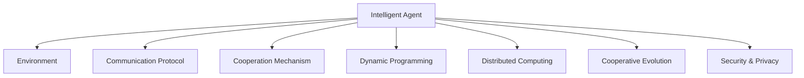

                 

# 多智能体系统 (Multi-Agent Systems) 原理与代码实例讲解

> 关键词：多智能体系统，智能体(Agent)，分布式计算，协作机制，动态环境，决策优化

## 1. 背景介绍

### 1.1 问题由来

随着信息技术和通信技术的发展，计算机系统日益复杂，需要处理的任务越来越多样化，越来越需要多台计算机之间的协调与合作。传统的集中式系统已经难以满足这些需求，而分布式计算和并行计算虽然可以提供一定程度的灵活性，但也存在单点故障、数据传输延迟等问题。在这样的背景下，多智能体系统（Multi-Agent Systems,MAS）应运而生，成为解决复杂系统问题的重要手段。

### 1.2 问题核心关键点

多智能体系统是一种分布式计算的范式，由多个智能体（Agent）组成，每个智能体都有自己的感知能力、决策能力和执行能力。这些智能体通过相互协作，实现复杂系统的优化和高效运行。MAS的核心在于智能体之间的通信和协调机制，使得系统能够在动态和不确定环境中自主决策和执行任务。

### 1.3 问题研究意义

多智能体系统在诸多领域得到了广泛应用，如智能电网、交通管理、机器人协作、金融市场等。研究多智能体系统的设计和实现，对于构建高效、灵活、智能的分布式系统，具有重要的理论和实际意义：

1. 提升系统效率：通过智能体之间的协作和信息共享，优化资源配置，提高系统整体效率。
2. 增强系统鲁棒性：智能体的冗余和自治机制，使得系统能够自动适应环境变化，提高系统的稳定性和可靠性。
3. 实现任务分解：将大问题分解为小任务，通过多个智能体的协作，共同完成复杂的系统任务。
4. 促进创新应用：MAS为多个领域带来了新的解决方案，如自动驾驶、智慧城市等，推动技术进步和应用普及。

## 2. 核心概念与联系

### 2.1 核心概念概述

为了更好地理解多智能体系统的核心概念，本节将介绍几个密切相关的核心概念：

- 智能体（Agent）：具有感知、决策和执行能力的计算实体，是MAS的基本组成单元。
- 环境（Environment）：智能体相互作用的外部世界，可以是物理世界或虚拟世界。
- 通信协议（Communication Protocol）：智能体之间交互的规范和机制，定义了消息传递的格式和规则。
- 协作机制（Cooperation Mechanism）：智能体之间协调和合作的策略和算法，以达成共同的目标。
- 动态规划（Dynamic Programming）：一种优化算法，用于智能体的决策优化，在MAS中广泛应用。
- 分布式计算（Distributed Computing）：多个计算节点协同工作，共同解决问题的方法，是多智能体系统的重要实现手段。
- 协作进化（Cooperative Evolution）：多个智能体通过相互竞争和协作，逐步优化行为策略的过程。
- 安全与隐私（Security & Privacy）：多智能体系统中需要考虑的数据安全、隐私保护等问题，以确保系统的可信度和稳定性。

这些核心概念之间的逻辑关系可以通过以下Mermaid流程图来展示：



这个流程图展示了智能体与环境、通信协议、协作机制、动态规划、分布式计算、协作进化和安全隐私等核心概念之间的联系，强调了多智能体系统在实现复杂任务时的多维协同机制。

## 3. 核心算法原理 & 具体操作步骤

### 3.1 算法原理概述

多智能体系统的算法原理主要基于分布式计算和协作机制，目标是使各个智能体之间能够协同工作，实现系统整体的目标。

多智能体系统的设计可以采用以下步骤：
1. **智能体定义**：确定系统中智能体的数量、类型和功能，设计智能体的内部状态和行为规则。
2. **环境建模**：建立系统的环境模型，描述智能体所处的外部世界，以及智能体与环境之间的交互。
3. **通信协议设计**：定义智能体之间的消息传递规则，包括消息类型、格式、传输方式等。
4. **协作机制设计**：设计智能体之间的协作策略，如任务分配、状态同步、冲突解决等。
5. **动态规划优化**：使用动态规划等优化算法，优化智能体的行为策略，提高系统性能。
6. **分布式计算实现**：将智能体的任务分解为多个子任务，分配给不同的计算节点并行处理。
7. **协作进化优化**：通过协作进化算法，智能体之间通过竞争和协作，逐步优化行为策略，提高系统整体效率。
8. **安全与隐私保护**：设计数据安全、隐私保护等机制，确保系统可靠性和可信度。

### 3.2 算法步骤详解

#### 3.2.1 智能体设计

智能体是MAS的基本组成单元，需要具备感知、决策和执行能力。智能体的设计包括以下几个关键步骤：

- **感知模块设计**：设计智能体的感知模块，用于获取环境信息。
- **决策模块设计**：设计智能体的决策模块，用于根据感知信息，制定行动计划。
- **执行模块设计**：设计智能体的执行模块，用于执行决策模块制定的行动计划。

#### 3.2.2 环境建模

环境是智能体交互的外部世界，需要建立环境模型，描述智能体所处的环境。环境建模包括以下几个关键步骤：

- **环境状态定义**：定义环境的状态，如温度、湿度、位置等。
- **环境行为描述**：描述环境的行为，如动态变化、响应智能体行为等。
- **环境接口设计**：设计智能体与环境之间的交互接口，如传感器、执行器等。

#### 3.2.3 通信协议设计

智能体之间的通信协议是MAS的核心，需要定义消息类型、格式和传输方式。通信协议设计包括以下几个关键步骤：

- **消息类型定义**：定义消息的类型，如状态信息、控制命令、反馈信息等。
- **消息格式设计**：设计消息的格式，如消息头、消息体、校验和等。
- **消息传输方式选择**：选择消息的传输方式，如TCP/IP、UDP、MQTT等。

#### 3.2.4 协作机制设计

智能体之间的协作机制是MAS的关键，需要设计智能体之间的协作策略。协作机制设计包括以下几个关键步骤：

- **任务分配策略**：设计任务分配策略，如基于目标的分配、基于任务的分配、基于时间的分配等。
- **状态同步策略**：设计状态同步策略，如周期性同步、事件驱动同步、异步同步等。
- **冲突解决策略**：设计冲突解决策略，如集中式解决、分散式解决、仲裁解决等。

#### 3.2.5 动态规划优化

动态规划是一种优化算法，用于智能体的决策优化。动态规划优化包括以下几个关键步骤：

- **状态空间定义**：定义智能体的状态空间，如位置、速度、方向等。
- **行动空间定义**：定义智能体的行动空间，如转向、加速、刹车等。
- **代价函数定义**：定义行动的代价函数，如路径长度、能耗、时间等。
- **优化目标定义**：定义优化目标，如最小路径长度、最小能耗等。
- **优化算法设计**：设计动态规划算法，如DP算法、MDP算法等。

#### 3.2.6 分布式计算实现

分布式计算是将智能体的任务分解为多个子任务，分配给不同的计算节点并行处理。分布式计算实现包括以下几个关键步骤：

- **任务分解**：将智能体的任务分解为多个子任务，如路径规划、避障、协作等。
- **任务调度**：设计任务调度算法，如基于优先级的调度、基于权重的调度、基于时间的调度等。
- **节点协调**：设计节点之间的协调机制，如分布式数据库、分布式通信协议等。

#### 3.2.7 协作进化优化

协作进化是一种优化算法，通过智能体之间的竞争和协作，逐步优化行为策略。协作进化优化包括以下几个关键步骤：

- **初始种群设计**：设计初始种群，如随机生成种群、基于遗传算法的种群生成等。
- **适应度函数设计**：设计适应度函数，如路径长度、协作效率等。
- **选择操作设计**：设计选择操作，如轮盘赌选择、锦标赛选择等。
- **交叉和变异操作设计**：设计交叉和变异操作，如单点交叉、多点交叉、变异概率等。
- **迭代过程设计**：设计迭代过程，如遗传算法、粒子群算法等。

#### 3.2.8 安全与隐私保护

安全与隐私保护是MAS中需要考虑的重要问题，需要设计数据安全、隐私保护等机制。安全与隐私保护包括以下几个关键步骤：

- **数据加密**：设计数据加密算法，如对称加密、非对称加密等。
- **访问控制**：设计访问控制机制，如基于角色的访问控制、基于属性的访问控制等。
- **隐私保护**：设计隐私保护机制，如数据匿名化、差分隐私等。

### 3.3 算法优缺点

#### 3.3.1 优点

多智能体系统的优点包括：
- **灵活性高**：智能体可以动态调整行为策略，适应环境变化。
- **鲁棒性好**：智能体的自治和冗余机制，提高了系统的稳定性和可靠性。
- **可扩展性强**：系统可以根据需要动态增加或减少智能体，灵活应对任务变化。
- **协作效率高**：智能体之间的协作机制，提高了系统的整体效率。
- **容错性强**：单个智能体的故障不会影响整个系统的运行。

#### 3.3.2 缺点

多智能体系统的缺点包括：
- **通信开销大**：智能体之间的通信开销较大，影响系统的实时性。
- **协作复杂**：智能体之间的协作需要精心设计，容易出现协作失败的情况。
- **安全性问题**：系统中可能存在安全漏洞，导致数据泄露或系统被攻击。
- **可解释性差**：系统中智能体的行为逻辑复杂，难以进行解释和调试。

## 4. 数学模型和公式 & 详细讲解 & 举例说明

### 4.1 数学模型构建

多智能体系统的数学模型通常采用分布式计算和协作优化算法来构建。以一个简单的交通导航系统为例，系统的数学模型可以描述为：

- **智能体状态**：智能体的位置和速度。
- **环境状态**：道路的畅通程度、交通信号灯状态等。
- **通信协议**：智能体之间的通信方式，如TCP/IP、UDP等。
- **协作机制**：智能体之间的协作策略，如路径规划、避障等。
- **动态规划目标**：最小化路径长度、最小化能耗等。

### 4.2 公式推导过程

以一个简单的交通导航系统为例，假设智能体的状态为 $x_t = (x_t^1, x_t^2)$，表示智能体在时间 $t$ 的位置和速度。环境的状态为 $e_t$，表示道路的畅通程度和交通信号灯状态。智能体之间的通信协议为 $c_t$，表示智能体之间的通信方式。智能体之间的协作机制为 $d_t$，表示智能体之间的协作策略。动态规划目标为 $J_t(x_t)$，表示智能体在时间 $t$ 的路径长度。

根据马尔可夫决策过程（MDP）的框架，系统的数学模型可以表示为：

$$
J_t(x_t) = \min_{u_t} \sum_{t'=t+1}^{T} r_{t'} + \gamma J_{t'}(x_{t'})
$$

其中，$u_t$ 表示智能体在时间 $t$ 的行动计划，$T$ 表示时间结束，$\gamma$ 表示折扣因子。

根据动态规划算法，可以将上述模型进一步分解为子问题，使用递推公式计算最优解：

$$
V_{t+1} = \min_{u_t} \sum_{t'=t+1}^{T} r_{t'} + \gamma V_{t'}(x_{t'})
$$

通过上述公式，可以计算出每个时间步的最优行动计划，进而得到整个系统的最优路径长度。

### 4.3 案例分析与讲解

以一个智能电网为例，系统由多个智能体组成，每个智能体负责控制一台发电设备或负载设备。系统的数学模型可以描述为：

- **智能体状态**：智能体的时间步数、系统状态、发电设备状态、负载设备状态等。
- **环境状态**：系统负荷、天气状况、市场价格等。
- **通信协议**：智能体之间的通信方式，如TCP/IP、HTTP等。
- **协作机制**：智能体之间的协作策略，如负荷预测、能量分配等。
- **动态规划目标**：最小化系统能耗、最大化系统稳定性等。

在智能电网系统中，每个智能体需要根据当前系统状态，制定最优的行动计划，如增加或减少发电量、调整负荷等。智能体之间的协作机制，如负荷预测和能量分配，可以采用分布式算法实现，如共识算法、分布式优化算法等。动态规划目标可以采用优化算法实现，如线性规划、整数规划等。

## 5. 项目实践：代码实例和详细解释说明

### 5.1 开发环境搭建

在进行多智能体系统开发前，需要先搭建好开发环境。以下是使用Python进行多智能体系统开发的开发环境配置流程：

1. 安装Python：从官网下载并安装Python，建议选择最新版本。
2. 安装虚拟环境：使用虚拟环境隔离开发依赖，避免系统冲突。
```bash
pip install virtualenv
virtualenv venv
source venv/bin/activate
```
3. 安装必要的Python包：安装多智能体系统开发所需的核心Python包，如networkx、numpy、pandas等。
```bash
pip install networkx numpy pandas
```
4. 安装必要的工具：安装系统调试和监控工具，如Jupyter Notebook、TensorBoard等。
```bash
pip install jupyter tensorboard
```

完成上述步骤后，即可在虚拟环境中进行多智能体系统的开发和调试。

### 5.2 源代码详细实现

下面以一个简单的交通导航系统为例，展示如何使用Python和网络库实现多智能体系统。

首先，定义智能体的状态和行为：

```python
import networkx as nx
import numpy as np

class Agent:
    def __init__(self, position, speed, target):
        self.position = position
        self.speed = speed
        self.target = target
    
    def move(self, roadmap):
        neighbors = self.get_neighbors(roadmap)
        if neighbors:
            next_node = self.get_next_node(neighbors)
            self.position = next_node
        else:
            self.speed = 0
        return self.position, self.speed
    
    def get_neighbors(self, roadmap):
        g = nx.Graph()
        g.add_node(self.position)
        for node in roadmap:
            if roadmap[node] == self.position:
                for neighbor in roadmap[node]:
                    g.add_edge(self.position, neighbor)
        return list(g.neighbors(self.position))
    
    def get_next_node(self, neighbors):
        best_node = None
        best_dist = np.inf
        for node in neighbors:
            dist = self.calculate_distance(node)
            if dist < best_dist:
                best_dist = dist
                best_node = node
        return best_node
    
    def calculate_distance(self, node):
        return abs(node[0] - self.position[0]) + abs(node[1] - self.position[1])
```

然后，定义环境模型：

```python
class Environment:
    def __init__(self, roadmap, start_node, end_node):
        self.roadmap = roadmap
        self.start_node = start_node
        self.end_node = end_node
    
    def get_start_node(self):
        return self.start_node
    
    def get_end_node(self):
        return self.end_node
    
    def get_roadmap(self):
        return self.roadmap
```

接着，定义通信协议：

```python
class Communication:
    def __init__(self):
        pass
    
    def send_message(self, agent, message):
        pass
    
    def receive_message(self, agent, message):
        pass
```

最后，定义协作机制：

```python
class Collaboration:
    def __init__(self):
        pass
    
    def initialize(self):
        pass
    
    def step(self, agents, environment):
        pass
    
    def finalize(self):
        pass
```

完成以上步骤后，就可以运行多智能体系统的代码：

```python
if __name__ == '__main__':
    # 初始化智能体和环境
    start_node = (0, 0)
    end_node = (4, 4)
    roadmap = {(0, 0): [(1, 0), (1, 1)],
               (1, 0): [(0, 0), (2, 0)],
               (1, 1): [(1, 0), (2, 1)],
               (2, 0): [(1, 0), (3, 0)],
               (2, 1): [(1, 1), (3, 1)],
               (3, 0): [(2, 0), (4, 0)],
               (3, 1): [(2, 1), (4, 1)],
               (4, 0): [(3, 0)],
               (4, 1): [(3, 1)]}
    
    agents = []
    for i in range(5):
        position = (i, 0)
        agent = Agent(position, 1, end_node)
        agents.append(agent)
    
    environment = Environment(roadmap, start_node, end_node)
    
    # 运行系统
    for step in range(20):
        for agent in agents:
            position, speed = agent.move(environment.get_roadmap())
            agent.position = position
            agent.speed = speed
            print(f"Agent {agent.position}, speed {agent.speed}")
    
    print("Final positions:", [agent.position for agent in agents])
```

### 5.3 代码解读与分析

让我们再详细解读一下关键代码的实现细节：

**Agent类**：
- `__init__`方法：初始化智能体的状态、目标和速度。
- `move`方法：计算智能体的下一个位置和速度。
- `get_neighbors`方法：获取智能体的相邻节点。
- `get_next_node`方法：选择智能体的下一个节点。
- `calculate_distance`方法：计算智能体到下一个节点的距离。

**Environment类**：
- `__init__`方法：初始化环境的状态、起点和终点。
- `get_start_node`方法：获取环境的起点。
- `get_end_node`方法：获取环境的目的地。
- `get_roadmap`方法：获取环境的路网图。

**Communication类**：
- `__init__`方法：初始化通信协议。
- `send_message`方法：发送消息。
- `receive_message`方法：接收消息。

**Collaboration类**：
- `__init__`方法：初始化协作机制。
- `initialize`方法：初始化协作机制。
- `step`方法：执行协作机制的一个步长。
- `finalize`方法：完成协作机制的执行。

通过以上代码，可以清晰地理解多智能体系统的基本结构和运行流程。在实际应用中，还需要进一步扩展和优化代码，添加更复杂的协作机制和通信协议，以及更丰富的环境和智能体行为模型。

## 6. 实际应用场景

### 6.1 智能电网

多智能体系统在智能电网中的应用，可以实现智能发电、智能输电和智能配电。智能体可以包括发电设备、输电设备和配电设备，通过协作机制，实现系统最优的能量分配和负荷预测。智能电网系统能够自动应对电力供需变化，提高系统的稳定性和可靠性。

### 6.2 交通导航

多智能体系统在交通导航中的应用，可以实现车辆自动驾驶、交通流量管理和路网优化。智能体可以包括车辆、交通信号灯和道路，通过协作机制，实现最优的路径规划和交通控制。交通导航系统能够自动优化道路资源分配，提高交通流量和通行效率。

### 6.3 金融市场

多智能体系统在金融市场中的应用，可以实现市场动态预测、交易策略优化和风险控制。智能体可以包括投资者、交易员和监管机构，通过协作机制，实现最优的交易策略和风险管理。金融市场系统能够自动应对市场变化，提高系统的稳定性和盈利能力。

### 6.4 未来应用展望

多智能体系统的应用前景广阔，未来将进一步拓展到更多领域：

- **智能制造**：通过多智能体系统实现工厂的自动化和智能化，提高生产效率和产品质量。
- **智能医疗**：通过多智能体系统实现医疗资源的优化配置和医疗服务的个性化定制，提升医疗服务水平。
- **智能农业**：通过多智能体系统实现农业生产的智能化和精准化，提高农业生产效率和资源利用率。
- **智能城市**：通过多智能体系统实现城市管理的智能化和高效化，提升城市运行效率和居民生活质量。

## 7. 工具和资源推荐

### 7.1 学习资源推荐

为了帮助开发者系统掌握多智能体系统的理论和实践，这里推荐一些优质的学习资源：

1. 《Multi-Agent Systems》课程：麻省理工学院开设的多智能体系统课程，系统讲解多智能体系统的基本概念和核心算法。
2. 《Multi-Agent Systems in Practice》书籍：讲述了多智能体系统在实际应用中的案例和技术，适合工程实践。
3. 《Artificial Intelligence: A Modern Approach》书籍：详细介绍了多智能体系统的理论和应用，是AI领域的经典教材。
4. 《Multi-Agent Systems: Exploration and Exploitation》书籍：专注于多智能体系统的探索和利用策略，提供了丰富的理论基础和算法设计。
5. 《NetworkX Documentation》文档：讲解了网络库NetworkX的基本使用方法和应用场景。

通过对这些资源的学习实践，相信你一定能够快速掌握多智能体系统的精髓，并用于解决实际的分布式系统问题。

### 7.2 开发工具推荐

高效的开发离不开优秀的工具支持。以下是几款用于多智能体系统开发的工具：

1. Python：多智能体系统常用的编程语言，具有丰富的库和框架支持。
2. NetworkX：用于构建和分析网络图的网络库，提供了丰富的图算法和可视化工具。
3. ROS（Robot Operating System）：机器人操作系统的开源框架，支持多智能体系统的设计和实现。
4. PyBullet：物理引擎和模拟器，支持多智能体系统的物理仿真。
5. OpenAI Gym：用于机器学习算法的训练和评估，支持多智能体系统中的智能体设计和测试。
6. TensorFlow和PyTorch：深度学习框架，支持多智能体系统的分布式计算和协作优化。

合理利用这些工具，可以显著提升多智能体系统的开发效率，加快创新迭代的步伐。

### 7.3 相关论文推荐

多智能体系统的研究源于学界的持续研究。以下是几篇奠基性的相关论文，推荐阅读：

1. Multi-Agent Systems: A Survey：Wooldridge J. F.提出的多智能体系统综述，介绍了多智能体系统的基本概念和核心算法。
2. Game Theory for Agents with Stochastic Agendas：Fetler A. L.提出的随机议程多智能体系统的博弈理论模型。
3. Multi-Agent Systems in Networked Environment：Bertoli M. A.提出的网络环境中的多智能体系统模型和算法。
4. Distributed Multi-Agent Learning with Belief Propagation：Chow D.等提出的分布式多智能体学习算法。
5. Robotics and AI：多智能体系统在机器人领域的经典应用案例。

这些论文代表了大智能体系统的研究脉络，提供了丰富的理论和算法基础。通过学习这些前沿成果，可以帮助研究者把握学科前进方向，激发更多的创新灵感。

## 8. 总结：未来发展趋势与挑战

### 8.1 总结

本文对多智能体系统的核心概念、核心算法原理和具体操作步骤进行了全面系统的介绍。首先阐述了多智能体系统的背景和意义，明确了系统设计和实现的基本框架。其次，从智能体设计、环境建模、通信协议、协作机制等多个角度，详细讲解了多智能体系统的实现方法。最后，通过代码实例，展示了多智能体系统的实际应用场景和开发流程。

通过本文的系统梳理，可以看到，多智能体系统在处理分布式任务、协同工作、优化系统等方面具有显著优势。这些系统已经被广泛应用于智能电网、交通导航、金融市场等多个领域，取得了良好的效果。未来，多智能体系统还将进一步拓展到更多领域，为复杂系统问题的解决提供新的解决方案。

### 8.2 未来发展趋势

多智能体系统的未来发展趋势包括：

1. **分布式计算技术的进步**：分布式计算技术的进步将进一步提高多智能体系统的性能和可靠性，支持更大规模、更复杂的系统设计。
2. **协作机制的优化**：协作机制的优化将使得智能体之间更加高效、灵活地协作，实现更复杂的任务处理。
3. **数据驱动的决策优化**：通过大数据分析，实现更加精准、智能的决策优化，提高系统的优化效果。
4. **实时性要求提升**：随着应用场景对实时性的要求提高，多智能体系统需要进一步优化算法和数据结构，提升系统的响应速度。
5. **安全和隐私保护**：多智能体系统需要加强数据安全、隐私保护等机制，确保系统的可靠性和可信度。
6. **跨领域融合**：多智能体系统将与其他人工智能技术进行更深入的融合，如机器学习、自然语言处理、计算机视觉等，推动人工智能技术的整体进步。

### 8.3 面临的挑战

尽管多智能体系统已经取得了一定的进展，但在向更加智能化、普适化应用的过程中，仍然面临诸多挑战：

1. **通信开销大**：多智能体系统中的通信开销较大，影响系统的实时性。如何降低通信开销，提升系统效率，仍是研究重点。
2. **协作复杂**：多智能体系统中的协作机制需要精心设计，容易出现协作失败的情况。如何设计高效的协作机制，实现智能体之间的协作，仍需深入研究。
3. **安全性问题**：系统中可能存在安全漏洞，导致数据泄露或系统被攻击。如何设计安全机制，保护系统安全，仍需进一步研究。
4. **可解释性差**：系统中智能体的行为逻辑复杂，难以进行解释和调试。如何提高系统的可解释性，增强系统的透明性和可信度，仍需进一步研究。

### 8.4 研究展望

未来多智能体系统的研究需要在以下几个方面寻求新的突破：

1. **分布式计算优化**：进一步优化分布式计算技术，提高系统的性能和可靠性。
2. **协作机制创新**：设计更加高效、灵活的协作机制，实现更复杂的任务处理。
3. **数据驱动决策优化**：通过大数据分析，实现更加精准、智能的决策优化。
4. **实时性要求提升**：优化算法和数据结构，提升系统的响应速度和实时性。
5. **安全和隐私保护**：加强数据安全、隐私保护等机制，确保系统的可靠性和可信度。
6. **跨领域融合**：与其他人工智能技术进行更深入的融合，推动人工智能技术的整体进步。

这些研究方向将推动多智能体系统向更加智能化、普适化应用迈进，为复杂系统问题的解决提供新的解决方案。面向未来，多智能体系统需要从理论研究到工程应用，多路径协同发力，共同推动人工智能技术的进步和应用普及。

## 9. 附录：常见问题与解答

**Q1：多智能体系统与分布式系统有何区别？**

A: 多智能体系统是一种分布式计算的范式，强调智能体之间的协作和决策优化。而分布式系统更多关注数据的分布存储和并行计算，强调系统的可扩展性和容错性。

**Q2：多智能体系统如何处理冲突和协同？**

A: 多智能体系统的协作机制通过设计合理的任务分配、状态同步和冲突解决策略，实现智能体之间的协同工作。常见的协作机制包括基于目标的协作、基于任务的协作、基于时间的协作等。

**Q3：多智能体系统如何处理数据同步和通信开销？**

A: 多智能体系统通常采用分布式数据库和异步通信协议，降低数据同步和通信开销。常见的通信协议包括TCP/IP、UDP、MQTT等。

**Q4：多智能体系统如何处理安全和隐私问题？**

A: 多智能体系统需要设计数据加密、访问控制和隐私保护等机制，确保数据的安全性和隐私性。常见的安全机制包括数据加密、身份认证、权限控制等。

**Q5：多智能体系统如何处理复杂环境？**

A: 多智能体系统通过设计灵活的协作机制和决策优化算法，实现智能体之间的协同工作，适应复杂环境的变化。常见的决策优化算法包括动态规划、强化学习等。

这些回答帮助读者更好地理解多智能体系统的核心概念和设计原理，为后续的深入学习和实践提供参考。

---

作者：禅与计算机程序设计艺术 / Zen and the Art of Computer Programming

