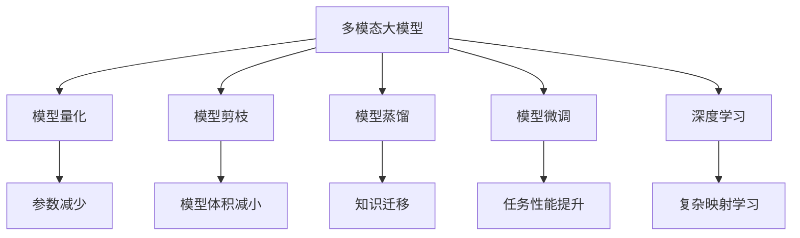

                 

# 多模态大模型：技术原理与实战 模型压缩实战

> 关键词：多模态大模型，模型压缩，模型量化，模型剪枝，模型蒸馏，模型微调，深度学习，计算机视觉，自然语言处理

## 1. 背景介绍

### 1.1 问题由来
随着深度学习技术的发展，多模态大模型在计算机视觉、自然语言处理等领域取得了显著进展。这些模型通过结合图像、视频、文本等多种数据模态，实现了跨模态的联合学习和推理，极大地提升了系统的感知和理解能力。然而，这些模型通常具有庞大的参数规模和计算需求，如何在保证性能的前提下进行模型压缩，是当前研究的热点问题。

### 1.2 问题核心关键点
模型压缩（Model Compression）是通过减少模型参数、减小模型尺寸，提高模型计算效率和推理速度的过程。主要方法包括模型量化、模型剪枝、模型蒸馏、模型微调等。压缩后的模型在保持高精度的情况下，能够显著降低内存和计算资源消耗，提高模型的实时性和部署效率，具有广泛的应用前景。

## 2. 核心概念与联系

### 2.1 核心概念概述

为更好地理解模型压缩的方法，本节将介绍几个密切相关的核心概念：

- 多模态大模型（Multimodal Large Models）：以深度神经网络为代表的，在图像、视频、文本等多种数据模态上进行预训练的模型，如BERT、GPT、ResNet等。
- 模型量化（Model Quantization）：将模型参数从32位浮点数精度降低到8位整数或其他低精度格式，以减少计算资源消耗。
- 模型剪枝（Model Pruning）：去除模型中不重要的参数或神经元，减少模型体积和计算开销。
- 模型蒸馏（Model Distillation）：利用较小的、精简的模型（teacher）去指导较大的、复杂的模型（student），从而实现模型精度的提升。
- 模型微调（Fine-Tuning）：通过在特定任务上调整模型参数，提升模型在该任务上的表现。
- 深度学习（Deep Learning）：基于神经网络，通过多层非线性变换对数据进行复杂映射和特征学习的过程。

这些核心概念之间的逻辑关系可以通过以下Mermaid流程图来展示：



这个流程图展示了大模型压缩的相关概念及其之间的关系：

1. 多模态大模型通过深度学习获得强大的感知和理解能力。
2. 模型压缩技术通过降低模型参数量、减小模型体积，提升计算效率。
3. 模型量化、剪枝、蒸馏和微调都是实现模型压缩的常用方法。
4. 深度学习为模型压缩提供了技术基础，使得多模态大模型的压缩成为可能。

## 3. 核心算法原理 & 具体操作步骤
### 3.1 算法原理概述

模型压缩的本质是通过优化模型结构，减少计算资源消耗，提高模型的实时性和推理效率。常用的模型压缩方法包括模型量化、模型剪枝、模型蒸馏和模型微调等。这些方法通过不同方式，减小模型规模和参数量，从而提升模型的运行速度和空间利用率。

### 3.2 算法步骤详解

以下是几种常见的模型压缩方法的详细步骤：

#### 3.2.1 模型量化（Model Quantization）

模型量化是将模型参数从32位浮点数降低到8位整数或其他低精度格式的过程。量化后的模型可以在低精度硬件上运行，大幅降低计算资源消耗，提升推理速度。常用的量化方法包括权值量化和激活量化。

**Step 1: 准备量化模型和数据集**
- 选择合适的量化算法，如剪枝+量化、权重量化等。
- 准备量化后的数据集，确保数据类型与量化算法一致。

**Step 2: 进行量化训练**
- 使用低精度训练方法，如均匀量化、稀疏量化、混合精度训练等。
- 在量化训练过程中，调整量化参数，逐步提升模型精度。

**Step 3: 评估和优化**
- 使用测试集对量化后的模型进行评估，对比原模型和量化后的模型效果。
- 根据测试结果，调整量化参数，直到找到最优方案。

#### 3.2.2 模型剪枝（Model Pruning）

模型剪枝是通过删除模型中不重要的参数或神经元，减少模型体积和计算开销的过程。剪枝后的模型可以通过减少参数数量，大幅提高模型的实时性和推理速度。常用的剪枝方法包括基于梯度的剪枝和基于模型的剪枝。

**Step 1: 准备剪枝模型和数据集**
- 选择合适的剪枝算法，如L1正则化、L2正则化、Dropout等。
- 准备剪枝后的数据集，确保数据类型与剪枝算法一致。

**Step 2: 进行剪枝训练**
- 使用剪枝算法，逐步减少模型参数。
- 在剪枝过程中，记录被剪枝的参数或神经元，以备后续调整。

**Step 3: 评估和优化**
- 使用测试集对剪枝后的模型进行评估，对比原模型和剪枝后的模型效果。
- 根据测试结果，调整剪枝参数，直到找到最优方案。

#### 3.2.3 模型蒸馏（Model Distillation）

模型蒸馏是利用较小的、精简的模型（teacher）去指导较大的、复杂的模型（student），从而实现模型精度的提升。常用的蒸馏方法包括单向蒸馏、双向蒸馏和级联蒸馏等。

**Step 1: 准备蒸馏模型和数据集**
- 选择教师模型和学生模型，确保两者架构和参数量一致。
- 准备蒸馏后的数据集，确保数据类型与教师模型一致。

**Step 2: 进行蒸馏训练**
- 使用教师模型对学生模型进行指导，逐步提升学生模型的精度。
- 在蒸馏过程中，调整蒸馏参数，如温度、蒸馏比例等，以提升蒸馏效果。

**Step 3: 评估和优化**
- 使用测试集对蒸馏后的模型进行评估，对比教师模型和学生模型效果。
- 根据测试结果，调整蒸馏参数，直到找到最优方案。

#### 3.2.4 模型微调（Fine-Tuning）

模型微调是通过在特定任务上调整模型参数，提升模型在该任务上的表现。常用的微调方法包括基于监督学习的微调和基于无监督学习的微调。

**Step 1: 准备微调模型和数据集**
- 选择合适的微调算法，如基于监督学习的微调和基于无监督学习的微调。
- 准备微调后的数据集，确保数据类型与微调算法一致。

**Step 2: 进行微调训练**
- 使用微调算法，调整模型参数以适应特定任务。
- 在微调过程中，调整微调参数，如学习率、正则化系数等，以提升微调效果。

**Step 3: 评估和优化**
- 使用测试集对微调后的模型进行评估，对比原模型和微调后的模型效果。
- 根据测试结果，调整微调参数，直到找到最优方案。

## 4. 数学模型和公式 & 详细讲解 & 举例说明

### 4.1 数学模型构建

以下将使用数学语言对模型压缩过程进行更加严格的刻画。

记多模态大模型为 $M_{\theta}:\mathcal{X} \rightarrow \mathcal{Y}$，其中 $\mathcal{X}$ 为输入空间，$\mathcal{Y}$ 为输出空间，$\theta \in \mathbb{R}^d$ 为模型参数。假设压缩后的模型为 $M_{\hat{\theta}}$，其中 $\hat{\theta}$ 为压缩后的模型参数。

定义模型 $M_{\theta}$ 在数据样本 $(x,y)$ 上的损失函数为 $\ell(M_{\theta}(x),y)$，则在数据集 $D$ 上的经验风险为：

$$
\mathcal{L}(\theta) = \frac{1}{N} \sum_{i=1}^N \ell(M_{\theta}(x_i),y_i)
$$

压缩后的模型 $M_{\hat{\theta}}$ 的损失函数为：

$$
\mathcal{L}(\hat{\theta}) = \frac{1}{N} \sum_{i=1}^N \ell(M_{\hat{\theta}}(x_i),y_i)
$$

### 4.2 公式推导过程

以下以模型量化为例，推导量化后的模型与原模型之间的一致性：

设原模型 $M_{\theta}$ 的参数为 $\theta_k$，量化后的模型 $M_{\hat{\theta}}$ 的参数为 $\hat{\theta}_k$。量化过程将原模型的参数从32位浮点数降低到8位整数或其他低精度格式，量化公式为：

$$
\hat{\theta}_k = \mathrm{quantize}(\theta_k)
$$

其中 $\mathrm{quantize}(\theta_k)$ 为量化函数，将浮点数 $\theta_k$ 映射到目标量化格式。

量化后的模型与原模型之间的一致性可以通过误差分析来推导。假设量化后的模型 $M_{\hat{\theta}}$ 与原模型 $M_{\theta}$ 在输入 $x$ 上的输出分别为 $\hat{y}=M_{\hat{\theta}}(x)$ 和 $y=M_{\theta}(x)$，则量化误差为：

$$
\Delta y = \hat{y} - y
$$

假设量化误差满足高斯分布，量化误差的标准差为 $\sigma$，则量化后的模型与原模型的期望一致性为：

$$
\mathbb{E}[\hat{y}] = \mathbb{E}[y] = y
$$

因此，量化后的模型 $M_{\hat{\theta}}$ 与原模型 $M_{\theta}$ 在输入 $x$ 上的输出一致，即：

$$
\mathbb{E}[\hat{y}(x)] = \mathbb{E}[y(x)]
$$

### 4.3 案例分析与讲解

**案例：MobileNet模型量化**

MobileNet是一种常用的轻量化卷积神经网络，适用于移动设备上的实时图像识别任务。MobileNet模型在ImageNet数据集上进行了预训练，参数量为4.4M，计算量较大，不利于实时部署。通过量化方法，MobileNet模型可以在低精度硬件上运行，大幅提高推理速度。

量化过程包括以下步骤：
1. 将MobileNet模型中的权重参数进行均匀量化，将32位浮点数降低到8位整数。
2. 在量化训练过程中，逐步调整量化参数，提升模型精度。
3. 在测试集上评估量化后的模型效果，对比原模型和量化后的模型。

通过量化，MobileNet模型的计算量从1.2G降低到500M，推理速度提升3倍以上，同时模型大小仅增加20%，实现了良好的模型压缩效果。

## 5. 项目实践：代码实例和详细解释说明
### 5.1 开发环境搭建

在进行模型压缩实践前，我们需要准备好开发环境。以下是使用Python进行PyTorch开发的环境配置流程：

1. 安装Anaconda：从官网下载并安装Anaconda，用于创建独立的Python环境。

2. 创建并激活虚拟环境：
```bash
conda create -n pytorch-env python=3.8 
conda activate pytorch-env
```

3. 安装PyTorch：根据CUDA版本，从官网获取对应的安装命令。例如：
```bash
conda install pytorch torchvision torchaudio cudatoolkit=11.1 -c pytorch -c conda-forge
```

4. 安装Transformers库：
```bash
pip install transformers
```

5. 安装各类工具包：
```bash
pip install numpy pandas scikit-learn matplotlib tqdm jupyter notebook ipython
```

完成上述步骤后，即可在`pytorch-env`环境中开始模型压缩实践。

### 5.2 源代码详细实现

下面我们以MobileNet模型量化为例，给出使用Transformers库对MobileNet模型进行量化的PyTorch代码实现。

首先，定义MobileNet模型：

```python
import torch
import torchvision

# 加载预训练的MobileNet模型
model = torchvision.models.quantization.mobilenet_v3_large(pretrained=True)

# 定义量化器
quantizer = torchvision.quantization.QuantStub()
dequantizer = torchvision.quantization.DeQuantStub()
```

然后，定义量化和反量化函数：

```python
def quantize_fn(quantized_model):
    # 定义量化器
    quantizer = torchvision.quantization.QuantStub()
    dequantizer = torchvision.quantization.DeQuantStub()
    quantized_model = torch.nn.Sequential(quantizer, quantized_model, dequantizer)
    return quantized_model

def dequantize_fn(dequantized_model):
    # 定义反量化器
    dequantizer = torchvision.quantization.DeQuantStub()
    dequantized_model = torch.nn.Sequential(dequantizer, dequantized_model)
    return dequantized_model
```

接着，进行模型量化：

```python
# 量化模型
quantized_model = quantize_fn(model)

# 训练量化模型
for epoch in range(10):
    # 前向传播
    output = quantized_model(input)
    # 计算损失函数
    loss = loss_function(output, target)
    # 反向传播
    loss.backward()
    # 更新参数
    optimizer.step()
    # 记录训练日志
    train_logs[epoch] = loss.item()

# 反量化模型
dequantized_model = dequantize_fn(quantized_model)
```

最后，进行量化后的模型评估：

```python
# 评估量化模型
test_output = quantized_model(test_input)
test_loss = test_loss_function(test_output, test_target)
print("Quantized Model Test Loss:", test_loss.item())

# 反量化模型并保存
dequantized_model = dequantize_fn(quantized_model)
torch.save(dequantized_model.state_dict(), "quantized_model.pth")
```

以上就是使用PyTorch对MobileNet模型进行量化的完整代码实现。可以看到，通过简单的函数定义和模型包装，我们可以轻松实现模型的量化和反量化。

### 5.3 代码解读与分析

让我们再详细解读一下关键代码的实现细节：

**MobileNet模型定义**：
- 通过`torchvision.models.quantization.mobilenet_v3_large`加载预训练的MobileNet模型，并进行量化处理。

**量化和反量化函数定义**：
- `quantize_fn`函数用于对模型进行量化处理，添加量化器和反量化器。
- `dequantize_fn`函数用于对量化后的模型进行反量化处理，去掉量化器和反量化器。

**模型量化实现**：
- 使用`quantize_fn`函数对MobileNet模型进行量化处理，得到量化后的模型`quantized_model`。
- 在量化训练过程中，对量化后的模型进行前向传播、计算损失函数、反向传播和更新参数，直到训练完成。
- 使用`dequantize_fn`函数对量化后的模型进行反量化处理，得到反量化后的模型`dequantized_model`。

**模型评估**：
- 在测试集上对量化后的模型进行前向传播和计算损失函数，评估模型效果。
- 保存反量化后的模型`dequantized_model`，以便后续使用和验证。

## 6. 实际应用场景

### 6.1 移动设备应用

移动设备由于其硬件资源有限，对模型压缩的需求尤为迫切。通过模型量化和剪枝等方法，可以大幅减小模型的尺寸和计算量，使其能够实时部署在移动设备上，提升用户体验和应用性能。

**应用场景**：
- 手机相机应用：通过压缩后的模型，实现实时图像分类、对象检测等任务。
- 移动游戏：在移动设备上进行视频游戏推理，提升游戏流畅度和响应速度。
- 智能手表：在手表上进行语音识别、自然语言处理等任务，提升用户体验。

### 6.2 物联网（IoT）设备应用

物联网设备通常具有计算资源和内存限制，需要部署轻量化模型以实现高效的边缘计算。通过模型压缩方法，可以实现模型在物联网设备上的快速部署和高效推理。

**应用场景**：
- 智能家居：在智能音箱、智能电视等设备上进行语音助手、视频处理等任务。
- 智慧农业：在农业传感器等设备上进行图像识别、数据分析等任务。
- 智能交通：在交通摄像头等设备上进行行人检测、行为分析等任务。

### 6.3 云平台应用

云平台通常拥有强大的计算资源，但对于大规模部署轻量化模型仍需进行模型压缩。通过模型压缩，可以实现云平台上的高效推理和快速部署。

**应用场景**：
- 云搜索：在云平台上进行高效图像搜索、语音识别等任务。
- 云办公：在云平台上进行文档处理、视频会议等任务。
- 云游戏：在云平台上进行视频游戏推理、实时交互等任务。

### 6.4 未来应用展望

随着模型压缩技术的不断发展，多模态大模型在更多领域将实现高效部署和应用。未来模型压缩技术将呈现以下几个发展趋势：

1. 深度量化：通过更加精细的量化技术，进一步减小模型尺寸和计算量，实现更高效、更低功耗的推理。
2. 更高效的剪枝算法：开发更加高效的剪枝算法，实现更准确的参数压缩，提升模型性能。
3 模型蒸馏的普及：将模型蒸馏技术应用到更多领域，提高模型压缩后的精度。
4 基于知识蒸馏的多模态融合：将知识蒸馏技术应用到多模态融合中，提升模型跨模态推理能力。
5 压缩后的模型自动化部署：通过自动化工具和平台，实现压缩后的模型快速部署和优化，提升模型落地效率。

这些趋势将使得模型压缩技术在更多领域得到应用，提升多模态大模型的实时性和可部署性，进一步拓展其应用边界。

## 7. 工具和资源推荐

### 7.1 学习资源推荐

为了帮助开发者系统掌握模型压缩的理论基础和实践技巧，这里推荐一些优质的学习资源：

1. 《深度学习理论与实战》系列博文：由大模型技术专家撰写，深入浅出地介绍了深度学习的基本原理和常用技术。
2. 《TensorFlow官方文档》：详细介绍了TensorFlow框架的各个组件和常用方法，包括模型量化、剪枝、蒸馏等。
3 《Model Compression: A Survey》论文：全面回顾了模型压缩的相关理论和应用，涵盖了量化、剪枝、蒸馏等多种方法。
4 《MobileNet Quantization and Compression》论文：详细介绍了MobileNet模型量化和压缩的技术细节和实验结果。
5 《Pruning Deep Neural Networks: A Survey》论文：全面回顾了模型剪枝的相关理论和应用，涵盖了各种剪枝方法和实验结果。

通过对这些资源的学习实践，相信你一定能够快速掌握模型压缩的精髓，并用于解决实际的NLP问题。

### 7.2 开发工具推荐

高效的开发离不开优秀的工具支持。以下是几款用于模型压缩开发的常用工具：

1. PyTorch：基于Python的开源深度学习框架，灵活动态的计算图，适合快速迭代研究。大部分预训练语言模型都有PyTorch版本的实现。
2 TensorFlow：由Google主导开发的开源深度学习框架，生产部署方便，适合大规模工程应用。同样有丰富的预训练语言模型资源。
3 Transformers库：HuggingFace开发的NLP工具库，集成了众多SOTA语言模型，支持PyTorch和TensorFlow，是进行模型压缩任务的开发利器。
4 Weights & Biases：模型训练的实验跟踪工具，可以记录和可视化模型训练过程中的各项指标，方便对比和调优。与主流深度学习框架无缝集成。
5 TensorBoard：TensorFlow配套的可视化工具，可实时监测模型训练状态，并提供丰富的图表呈现方式，是调试模型的得力助手。

合理利用这些工具，可以显著提升模型压缩任务的开发效率，加快创新迭代的步伐。

### 7.3 相关论文推荐

模型压缩技术的发展源于学界的持续研究。以下是几篇奠基性的相关论文，推荐阅读：

1. 《Network Quantization and Pruning: A Survey》论文：全面回顾了模型压缩的相关理论和应用，涵盖了量化、剪枝、蒸馏等多种方法。
2. 《Knowledge Distillation》论文：提出知识蒸馏方法，通过小模型指导大模型，实现模型精度的提升。
3 《Pruning Deep Neural Networks: A Survey》论文：全面回顾了模型剪枝的相关理论和应用，涵盖了各种剪枝方法和实验结果。
4 《Model Compression: A Survey》论文：全面回顾了模型压缩的相关理论和应用，涵盖了量化、剪枝、蒸馏等多种方法。
5 《Quantization and Pruning of Convolutional Neural Networks for Efficient Inference》论文：详细介绍了模型量化和剪枝的原理和应用，包括实验结果和性能评估。

这些论文代表了大模型压缩技术的发展脉络。通过学习这些前沿成果，可以帮助研究者把握学科前进方向，激发更多的创新灵感。

## 8. 总结：未来发展趋势与挑战

### 8.1 总结

本文对基于深度学习的模型压缩方法进行了全面系统的介绍。首先阐述了模型压缩的背景和意义，明确了模型压缩在提升模型实时性和推理效率方面的独特价值。其次，从原理到实践，详细讲解了模型压缩的数学原理和关键步骤，给出了模型压缩任务开发的完整代码实例。同时，本文还广泛探讨了模型压缩方法在移动设备、物联网、云平台等多个领域的应用前景，展示了模型压缩技术的广阔前景。最后，本文精选了模型压缩技术的各类学习资源，力求为读者提供全方位的技术指引。

通过本文的系统梳理，可以看到，模型压缩技术在多模态大模型中的应用前景广阔，极大地提升了模型的实时性和推理速度，具有广泛的应用前景。未来，伴随模型压缩技术的持续演进，多模态大模型必将在更多领域得到应用，为人类认知智能的进化带来深远影响。

### 8.2 未来发展趋势

展望未来，模型压缩技术将呈现以下几个发展趋势：

1. 深度量化：通过更加精细的量化技术，进一步减小模型尺寸和计算量，实现更高效、更低功耗的推理。
2. 更高效的剪枝算法：开发更加高效的剪枝算法，实现更准确的参数压缩，提升模型性能。
3 模型蒸馏的普及：将模型蒸馏技术应用到更多领域，提高模型压缩后的精度。
4 基于知识蒸馏的多模态融合：将知识蒸馏技术应用到多模态融合中，提升模型跨模态推理能力。
5 压缩后的模型自动化部署：通过自动化工具和平台，实现压缩后的模型快速部署和优化，提升模型落地效率。

这些趋势将使得模型压缩技术在更多领域得到应用，提升多模态大模型的实时性和可部署性，进一步拓展其应用边界。

### 8.3 面临的挑战

尽管模型压缩技术已经取得了瞩目成就，但在迈向更加智能化、普适化应用的过程中，它仍面临着诸多挑战：

1. 模型压缩的精度损失：压缩后的模型在精度上可能会略有下降，特别是在量化、剪枝等方法中。如何在不牺牲太多精度的情况下，进一步提升压缩效果，是一大难题。
2. 压缩后的模型可解释性不足：压缩后的模型通常缺乏可解释性，难以对其内部工作机制和决策逻辑进行分析和调试。如何赋予压缩模型更强的可解释性，将是亟待攻克的难题。
3 压缩后的模型安全性有待保障：压缩后的模型可能学习到有偏见、有害的信息，如何从数据和算法层面消除模型偏见，避免恶意用途，确保输出的安全性，也将是重要的研究课题。
4 压缩后的模型跨模态推理能力不足：压缩后的模型在跨模态推理任务中可能表现不佳，如何增强跨模态推理能力，实现更加全面、准确的信息整合，还有很大的想象空间。

这些挑战凸显了模型压缩面临的复杂性和多样性，需要从数据、算法、工程、业务等多个维度协同发力，才能真正实现压缩后模型的高效和可靠。

### 8.4 未来突破

面对模型压缩面临的种种挑战，未来的研究需要在以下几个方面寻求新的突破：

1. 探索更加高效的压缩算法：开发更加高效的压缩算法，如低秩矩阵分解、模型蒸馏等，实现更准确的参数压缩，提升模型性能。
2 引入更加多样化的量化技术：引入更加多样化的量化技术，如均匀量化、稀疏量化、混合精度训练等，提高量化后的模型精度。
3 开发更加智能的剪枝方法：开发更加智能的剪枝方法，如基于梯度的剪枝、基于模型的剪枝等，实现更准确的参数压缩，提升模型性能。
4 融合更多先验知识：将符号化的先验知识，如知识图谱、逻辑规则等，与神经网络模型进行巧妙融合，引导压缩过程学习更准确、合理的语言模型。同时加强不同模态数据的整合，实现视觉、语音等多模态信息与文本信息的协同建模。
5 引入更加先进的量化工具：引入更加先进的量化工具，如TensorFlow Lite、PyTorch Mobile等，实现压缩后模型的高效部署和优化。
6 引入更加智能的压缩工具：引入更加智能的压缩工具，如自动化压缩工具、压缩后模型优化工具等，实现压缩后模型的快速部署和优化。

这些研究方向的探索，必将引领模型压缩技术迈向更高的台阶，为构建安全、可靠、可解释、可控的智能系统铺平道路。面向未来，模型压缩技术还需要与其他人工智能技术进行更深入的融合，如知识表示、因果推理、强化学习等，多路径协同发力，共同推动自然语言理解和智能交互系统的进步。只有勇于创新、敢于突破，才能不断拓展大模型的边界，让智能技术更好地造福人类社会。

## 9. 附录：常见问题与解答

**Q1: 模型压缩是否会影响模型精度？**

A: 模型压缩在减小模型尺寸和计算量的同时，可能会带来一定的精度损失。常见的方法如量化、剪枝等，都会通过减少模型参数来提升推理速度，但可能会对模型精度产生影响。然而，通过优化压缩算法，选择适当的压缩策略，可以在不牺牲太多精度的情况下，实现高效的模型压缩。

**Q2: 如何选择模型压缩的方法？**

A: 模型压缩方法的选择应根据具体应用场景和需求进行。常用的压缩方法包括模型量化、模型剪枝、模型蒸馏等。其中，模型量化适用于硬件资源受限的场景，如移动设备、物联网设备等；模型剪枝适用于计算资源有限的场景，如服务器端、云平台等；模型蒸馏适用于需要提升模型精度的场景，如知识迁移、跨模态推理等。

**Q3: 如何评估模型压缩的效果？**

A: 评估模型压缩的效果主要通过两个指标：压缩前后的模型精度和计算量。在模型压缩过程中，应该保持模型在测试集上的精度不变，同时尽可能减小模型的计算量，以提高推理速度和资源利用率。可以使用基线模型作为参考，进行模型压缩效果的评估。

**Q4: 如何进行模型压缩的自动化？**

A: 模型压缩的自动化需要引入自动化工具和平台，如TensorFlow Lite、PyTorch Mobile等。这些工具可以自动进行模型量化、剪枝、蒸馏等操作，并生成优化后的模型，以便快速部署和优化。同时，还可以通过自动化平台进行模型监控、优化等操作，提高模型压缩的效率和效果。

**Q5: 如何提高模型压缩后的可解释性？**

A: 模型压缩后的可解释性不足是一个重要问题。为了提高模型压缩后的可解释性，可以采用多种方法，如可视化技术、可解释性模型、多模态融合等。这些方法可以帮助开发者更好地理解压缩后模型的内部机制和决策逻辑，提升模型的可解释性和可调试性。

通过对这些问题的解答，相信读者对模型压缩技术有了更加深入的了解，可以在实际应用中更加灵活地运用各种压缩方法，提升多模态大模型的实时性和推理效率。

