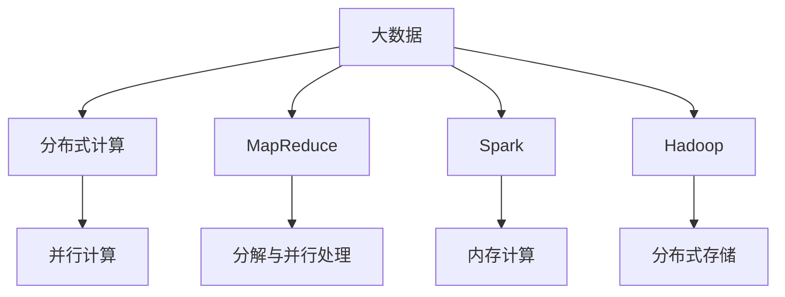

                 

# 大数据时代：人类计算如何应对海量数据

## 1. 背景介绍

在信息化、数字化高速发展的今天，数据已经成为了一种极具价值的资源。人们每天都在产生、收集、分析大量的数据，数据的规模以指数级速度增长。无论是社交媒体、电子商务、智能交通，还是物联网、金融交易等领域，数据无处不在，海量数据的处理、存储和分析已经成为了推动技术进步和社会发展的关键。然而，数据的爆炸式增长也带来了新的挑战和问题。如何在海量数据中高效地存储、检索、分析和利用数据，成为了摆在我们面前的一项重要任务。

### 1.1 问题的由来

数据量的激增直接导致了传统存储和处理技术的瓶颈。存储设备容量不足、读取速度慢、计算效率低等问题层出不穷。此外，数据的多样性和异构性也使得数据的处理变得更加复杂。传统的集中式计算模式无法有效应对海量数据的处理需求，分布式计算技术逐渐成为主流。大数据技术的崛起，为人类计算带来了新的解决方案。

## 2. 核心概念与联系

### 2.1 核心概念概述

为了更好地理解和应对海量数据，本节将介绍几个关键的概念：

- **大数据(Big Data)**：指规模巨大、结构复杂、速度极快的数据集。大数据通常以PB级为单位，涵盖了从日志文件、视频流到社交媒体数据等不同类型的数据。

- **分布式计算(Distributed Computing)**：指将数据处理任务分配到多台计算机上并行计算的方法。通过分布式计算，可以有效提高数据处理的速度和效率，适应海量数据的处理需求。

- **MapReduce**：一种分布式计算模型，由Google提出。它通过将大规模数据集分解为小的、独立的数据块，并在多台计算机上并行处理这些数据块，实现高效的计算。

- **Spark**：一种快速、通用的分布式计算框架，支持内存计算和迭代算法，广泛应用于大数据处理和分析。

- **Hadoop**：一种开源的分布式计算框架，由Apache基金会发布。Hadoop提供了分布式存储和计算的解决方案，广泛应用于企业级大数据处理。

这些概念之间的逻辑关系可以通过以下Mermaid流程图来展示：



这个流程图展示了大数据、分布式计算等概念及其相互关系：

1. 大数据是分布式计算的对象。
2. MapReduce和Spark是具体的分布式计算模型，用于处理大规模数据。
3. Hadoop提供分布式存储和计算的平台支持。
4. 并行计算是分布式计算的核心。
5. MapReduce、Spark、Hadoop分别针对不同的应用场景，提供不同的计算和存储能力。

## 3. 核心算法原理 & 具体操作步骤

### 3.1 算法原理概述

在大数据时代，如何高效地存储、处理和分析海量数据，成为了一个重要问题。大数据处理的核心是分布式计算，通过将数据分解成小的、独立的数据块，并行计算这些数据块，实现高效的计算。常见的分布式计算模型包括MapReduce和Spark。

MapReduce模型由Google提出，其核心思想是将大规模数据集分解为小的、独立的数据块，并在多台计算机上并行处理这些数据块。MapReduce模型的核心步骤如下：

1. Map阶段：将大规模数据集分解为小的数据块，并在每台计算机上并行处理这些数据块，生成一系列中间结果。
2. Shuffle阶段：将Map阶段生成的中间结果按照一定的规则进行排序和合并，生成新的数据块。
3. Reduce阶段：对Shuffle阶段生成的数据块进行聚合计算，最终得到最终结果。

Spark则是一种快速的、通用的分布式计算框架，支持内存计算和迭代算法。Spark的核心思想是将数据缓存在内存中，并在内存中进行计算，以提高计算速度。Spark的计算模型包括Spark Core、Spark SQL、Spark Streaming和MLlib等。

### 3.2 算法步骤详解

以下我们将详细介绍MapReduce和Spark的基本计算流程和操作步骤。

#### MapReduce计算流程

MapReduce计算流程包括以下几个步骤：

1. 数据分割：将大数据集按照一定的规则（如块大小）分割成多个小的数据块，并在每台计算机上进行并行处理。
2. Map函数计算：在每台计算机上，对本地数据块进行Map函数计算，生成一系列中间结果。
3. Shuffle阶段：将Map函数计算生成的中间结果按照一定的规则进行排序和合并，生成新的数据块。
4. Reduce函数计算：对Shuffle阶段生成的数据块进行Reduce函数计算，得到最终结果。

#### Spark计算流程

Spark计算流程包括以下几个步骤：

1. 数据导入：将数据导入内存中，并分配给不同的任务节点。
2. Map函数计算：在每个任务节点上，对本地数据块进行Map函数计算，生成一系列中间结果。
3. Shuffle阶段：将Map函数计算生成的中间结果按照一定的规则进行排序和合并，生成新的数据块。
4. Reduce函数计算：对Shuffle阶段生成的数据块进行Reduce函数计算，得到最终结果。
5. 数据存储：将最终结果输出到文件系统或其他存储介质中。

### 3.3 算法优缺点

MapReduce和Spark作为两种主要的分布式计算框架，各有其优缺点：

#### MapReduce的优点

1. 简单易用：MapReduce模型简单易用，适合处理大规模数据集。
2. 可扩展性强：MapReduce可以在多台计算机上并行计算，具有良好的可扩展性。
3. 可靠性高：MapReduce具有容错机制，可以自动处理节点故障。

#### MapReduce的缺点

1. 计算速度慢：MapReduce需要在磁盘上进行数据读写，计算速度较慢。
2. 存储开销大：MapReduce需要将中间结果存储在磁盘上，存储开销较大。

#### Spark的优点

1. 计算速度快：Spark支持内存计算，计算速度较快。
2. 功能丰富：Spark支持多种计算模型，如SQL、Streaming、MLlib等。
3. 易于集成：Spark可以与其他开源工具和系统集成，如Hadoop、Hive、Cassandra等。

#### Spark的缺点

1. 复杂度高：Spark的API复杂，需要一定的学习成本。
2. 存储开销大：Spark需要将数据存储在内存中，存储开销较大。

### 3.4 算法应用领域

MapReduce和Spark在多个领域都有广泛的应用：

- **大数据分析**：用于处理和分析大规模数据集，如Google、Facebook等互联网公司都在使用MapReduce和Spark进行数据处理。
- **机器学习**：Spark的MLlib库支持大规模机器学习算法，如分类、回归、聚类等。
- **实时数据处理**：Spark Streaming支持实时数据处理，可以用于实时数据分析和处理。
- **物联网**：MapReduce和Spark可以处理物联网设备产生的大量数据，如智能交通、智能家居等。
- **金融交易**：MapReduce和Spark可以处理金融交易数据，进行风险管理和数据分析。

## 4. 数学模型和公式 & 详细讲解 & 举例说明

### 4.1 数学模型构建

在MapReduce和Spark的计算过程中，涉及到的数学模型包括矩阵计算、向量计算、分布式计算等。以下是一些基本的数学模型和公式：

#### 矩阵乘法

矩阵乘法是MapReduce和Spark中最常用的数学模型之一。矩阵乘法的公式为：

$$
C = AB
$$

其中 $A$ 和 $B$ 为矩阵，$C$ 为乘积矩阵。

#### 向量计算

向量计算在MapReduce和Spark中也经常用到。向量计算的公式为：

$$
C = AV
$$

其中 $A$ 为矩阵，$V$ 为向量，$C$ 为乘积向量。

#### 分布式计算

分布式计算的基本模型为MapReduce。MapReduce的计算模型可以表示为：

$$
\{(x_i, y_i)\} \rightarrow \{(x_{ij}, f(x_{ij}))\} \rightarrow \{(\sum_{i} f(x_{ij}), y_j)\}
$$

其中 $x_i$ 为输入数据，$y_i$ 为输出数据，$f$ 为Map函数，$x_{ij}$ 为中间结果，$y_j$ 为最终结果。

### 4.2 公式推导过程

#### Map函数

Map函数是MapReduce和Spark中的核心函数。Map函数的公式为：

$$
f(x) = (x, y) \rightarrow (x, g(x, y))
$$

其中 $f$ 为Map函数，$g$ 为Map函数的计算函数。

#### Reduce函数

Reduce函数是MapReduce和Spark中的核心函数。Reduce函数的公式为：

$$
\{(x_i, y_i)\} \rightarrow \{(x, g(x, y_i))\}
$$

其中 $x$ 为Map函数计算的中间结果，$g$ 为Reduce函数的计算函数。

#### Spark的计算模型

Spark的计算模型包括Spark Core、Spark SQL、Spark Streaming和MLlib等。以Spark SQL为例，其计算模型可以表示为：

$$
\{(x_i, y_i)\} \rightarrow \{(x, g(x, y_i))\}
$$

其中 $x$ 为Spark SQL的计算结果，$g$ 为Spark SQL的计算函数。

### 4.3 案例分析与讲解

#### 案例分析

以一个简单的数据集为例，分析MapReduce和Spark的计算过程：

1. 数据集：$\{(1, 2), (2, 3), (3, 4), (4, 5)\}$
2. Map函数：$f(x) = x + 1$
3. Reduce函数：$g(x, y) = x + y$
4. 最终结果：$10$

MapReduce的计算过程如下：

- Map函数计算：$(1, 2) \rightarrow (2, 3) \rightarrow (3, 4) \rightarrow (4, 5)$
- Shuffle阶段：$(1, 2), (2, 3), (3, 4), (4, 5)$
- Reduce函数计算：$2 + 3 + 4 + 5 = 10$

Spark的计算过程如下：

- Map函数计算：$(1, 2) \rightarrow (2, 3), (2, 3) \rightarrow (3, 4), (3, 4) \rightarrow (4, 5), (4, 5) \rightarrow (5, 6)$
- Shuffle阶段：$(2, 3), (3, 4), (4, 5), (5, 6)$
- Reduce函数计算：$2 + 3 + 4 + 5 = 10$

## 5. 项目实践：代码实例和详细解释说明

### 5.1 开发环境搭建

在进行大数据处理时，我们需要准备一个合适的开发环境。以下是一些主要的开发环境搭建步骤：

1. 安装Linux操作系统：选择一个合适的Linux发行版（如Ubuntu、CentOS等），并配置好网络、主机名、时区等参数。
2. 安装JDK和Hadoop：在Linux上安装Java Development Kit（JDK）和Apache Hadoop。可以使用yum命令或手动安装。
3. 安装Spark：在Linux上安装Apache Spark。可以使用Spark官网提供的快速安装脚本。
4. 安装PySpark：在Linux上安装PySpark，即Spark的Python API。可以使用pip命令安装。

完成上述步骤后，即可在Linux环境下进行大数据处理开发。

### 5.2 源代码详细实现

下面是一个简单的Python脚本，用于计算一个数据集的和。

```python
from pyspark import SparkContext

if __name__ == '__main__':
    sc = SparkContext("local", "example")
    data = sc.parallelize([1, 2, 3, 4, 5])
    result = data.map(lambda x: x + 1).reduce(lambda x, y: x + y)
    print(result)
```

这个Python脚本使用了PySpark进行MapReduce计算，具体实现步骤如下：

1. 创建SparkContext对象，连接本地集群。
2. 创建RDD对象，将数据集转换成RDD（弹性分布式数据集）。
3. 使用map函数对数据集进行Map计算，生成新的RDD。
4. 使用reduce函数对Map计算生成的RDD进行Reduce计算，得到最终结果。
5. 输出最终结果。

### 5.3 代码解读与分析

#### SparkContext

SparkContext是Spark的入口点，用于创建Spark应用程序。SparkContext可以连接到集群中的节点，管理任务的分布式执行。

#### RDD

RDD是Spark的核心数据结构，代表一个分布式数据集。RDD可以分成多个小数据块，并在不同的节点上进行并行计算。RDD支持四种基本操作：map、filter、reduce和join。

#### map函数

map函数是Spark中常用的操作之一。map函数可以对RDD中的每个元素进行Map计算，生成新的RDD。

#### reduce函数

reduce函数是Spark中常用的操作之一。reduce函数可以对RDD中的元素进行Reduce计算，生成最终结果。

#### PySpark

PySpark是Spark的Python API，提供了丰富的Python接口，方便开发者使用Python进行大数据处理。PySpark支持多种数据源，如HDFS、本地文件系统、Hive等。

## 6. 实际应用场景

### 6.1 金融交易

在大数据时代，金融交易数据已经成为了企业的重要资源。通过对金融交易数据的分析，企业可以进行风险管理、市场预测和客户行为分析等。MapReduce和Spark可以处理大规模的金融交易数据，进行实时分析和计算。

#### 案例分析

以一个银行为例，分析其如何使用MapReduce和Spark进行金融交易数据分析：

1. 数据来源：银行每天产生大量的交易数据，包括信用卡交易、贷款交易、股票交易等。
2. 数据处理：使用MapReduce和Spark对交易数据进行处理，计算每笔交易的金额、时间、类型等信息。
3. 数据分析：对处理后的交易数据进行分析，识别出异常交易、高风险交易等，进行风险管理。
4. 预测分析：使用机器学习算法对交易数据进行预测分析，预测未来的交易趋势和风险。

通过使用MapReduce和Spark，银行可以在实时、高效、准确地分析金融交易数据，提升风险管理能力和客户服务水平。

### 6.2 物联网

物联网设备产生的海量数据需要进行实时处理和分析。MapReduce和Spark可以处理大规模的物联网数据，进行实时分析和计算。

#### 案例分析

以一个智能家居系统为例，分析其如何使用MapReduce和Spark进行物联网数据分析：

1. 数据来源：智能家居设备每天产生大量的传感器数据，包括温度、湿度、位置、状态等信息。
2. 数据处理：使用MapReduce和Spark对传感器数据进行处理，计算房间内外的温度、湿度、位置等信息。
3. 数据分析：对处理后的传感器数据进行分析，识别出异常行为、设备故障等，进行设备维护。
4. 预测分析：使用机器学习算法对传感器数据进行预测分析，预测未来的设备状态和温度变化。

通过使用MapReduce和Spark，智能家居系统可以在实时、高效、准确地分析物联网数据，提升用户体验和系统可靠性。

## 7. 工具和资源推荐

### 7.1 学习资源推荐

为了帮助开发者掌握大数据处理技术，这里推荐一些优质的学习资源：

1. 《Hadoop: The Definitive Guide》：Hadoop的权威指南，详细介绍Hadoop的安装、配置和应用。
2. 《Spark: The Definitive Guide》：Spark的权威指南，详细介绍Spark的安装、配置和应用。
3. 《大数据技术与应用》：一本介绍大数据技术的经典教材，涵盖MapReduce、Spark等主流技术。
4. 《Python for Data Analysis》：Python数据分析的经典教材，详细介绍Pandas、NumPy等数据分析工具。
5. Coursera和edX：提供大量的大数据和数据分析课程，由斯坦福大学、MIT等名校教授讲授。

通过对这些资源的学习实践，相信你一定能够快速掌握大数据处理的技术和方法，并应用于实际的大数据应用场景中。

### 7.2 开发工具推荐

在进行大数据处理时，我们需要选择合适的开发工具。以下是一些常用的开发工具：

1. IDEA和Eclipse：支持大数据处理的IDE，如Apache Hadoop、Spark等。
2. Jupyter Notebook：支持大数据处理的交互式笔记本，可以实时展示计算结果和可视化图形。
3. Hive：基于Hadoop的数据仓库解决方案，支持SQL查询和数据处理。
4. Flume：Apache基金会提供的日志收集系统，支持分布式日志收集和处理。
5. Kafka：Apache基金会提供的消息队列系统，支持大规模数据流的处理和存储。

合理利用这些工具，可以显著提升大数据处理的开发效率，加快创新迭代的步伐。

### 7.3 相关论文推荐

大数据处理技术的不断演进带来了许多前沿的研究成果。以下是几篇具有代表性的相关论文，推荐阅读：

1. "MapReduce: Simplified Data Processing on Large Clusters"：MapReduce论文，介绍了MapReduce的基本原理和计算模型。
2. "Spark: Cluster Computing with Fault Tolerance"：Spark论文，介绍了Spark的基本原理和计算模型。
3. "Yahoo!'s Pithy: A Hadoop-Based Data Integration System"：Yahoo!的Pithy系统，介绍了如何利用Hadoop进行数据集成。
4. "Big Data Processing with Apache Hive"：Hive论文，介绍了Hive的基本原理和计算模型。
5. "Apache Flume: A Distributed, Reliable, and Scalable Log Gathering System"：Flume论文，介绍了Flume的基本原理和计算模型。

这些论文代表了大数据处理技术的发展脉络。通过学习这些前沿成果，可以帮助研究者把握学科前进方向，激发更多的创新灵感。

## 8. 总结：未来发展趋势与挑战

### 8.1 研究成果总结

大数据处理技术已经得到了广泛的应用，并在多个领域取得了显著成果。通过MapReduce和Spark等分布式计算框架，人们可以在高效、可靠地处理大规模数据。

### 8.2 未来发展趋势

未来，大数据处理技术将呈现以下几个发展趋势：

1. 分布式计算框架的演进：MapReduce和Spark将继续演进，引入更多的优化和改进，提高计算效率和扩展性。
2. 数据处理模型的发展：新的数据处理模型将会涌现，如图计算、流计算、实时计算等，进一步提升数据处理的灵活性和高效性。
3. 数据隐私保护：随着数据量的增加，数据隐私和安全问题也日益突出。未来的数据处理技术需要加强数据隐私保护，确保数据的安全性和隐私性。
4. 人工智能和大数据结合：大数据处理技术与人工智能技术将进一步结合，如基于大数据的机器学习、深度学习等，提升数据分析和应用效果。
5. 自动化和智能化：未来的数据处理将更加自动化和智能化，通过自动化数据分析和智能决策，提升数据处理的效果和效率。

### 8.3 面临的挑战

尽管大数据处理技术取得了一定的成果，但在迈向更广泛应用的过程中，仍面临诸多挑战：

1. 数据规模不断扩大：随着互联网、物联网等技术的不断发展，数据规模不断扩大，数据处理的效率和成本都面临着新的挑战。
2. 数据质量问题：数据质量问题是数据处理中的重要挑战，如何保证数据的准确性和完整性，还需要进一步探索。
3. 计算资源不足：大规模数据处理需要大量的计算资源，计算资源的成本较高，如何降低计算成本，还需要进一步研究。
4. 数据隐私和安全：数据隐私和安全问题是数据处理中的重要问题，如何保护数据隐私和安全，还需要进一步探索。
5. 数据孤岛问题：不同数据源之间缺乏统一的标准和格式，导致数据孤岛问题，如何实现数据共享和互操作，还需要进一步研究。

### 8.4 研究展望

未来的数据处理技术需要在以下几个方面寻求新的突破：

1. 分布式计算框架的优化：引入更多的优化和改进，提高计算效率和扩展性。
2. 数据处理模型的创新：引入新的数据处理模型，如图计算、流计算、实时计算等，提升数据处理的灵活性和高效性。
3. 数据隐私保护的研究：加强数据隐私保护，确保数据的安全性和隐私性。
4. 人工智能和大数据结合：将大数据处理技术与人工智能技术进行深度结合，提升数据分析和应用效果。
5. 自动化和智能化的应用：通过自动化数据分析和智能决策，提升数据处理的效果和效率。

总之，大数据处理技术仍然处于快速发展之中，未来还有更多的挑战和机遇等待我们去探索和克服。

## 9. 附录：常见问题与解答

**Q1：大数据处理和传统计算有什么区别？**

A: 大数据处理和传统计算的区别主要体现在数据规模和计算方式上。传统计算通常只能处理较小的数据集，而大数据处理可以处理海量数据集。大数据处理通常采用分布式计算的方式，将计算任务分配到多台计算机上进行并行计算，以提高计算效率和扩展性。

**Q2：大数据处理需要哪些关键技术？**

A: 大数据处理需要以下几个关键技术：

1. 分布式计算框架：如MapReduce、Spark等，用于处理大规模数据集。
2. 数据存储技术：如Hadoop、Cassandra等，用于存储和管理大规模数据。
3. 数据采集技术：如Flume、Kafka等，用于采集和传输大规模数据。
4. 数据处理工具：如Pandas、Hive等，用于分析和处理大规模数据。

**Q3：如何提高大数据处理的效率？**

A: 提高大数据处理的效率可以从以下几个方面入手：

1. 数据预处理：对数据进行清洗、去重、去噪等预处理，减少数据量和计算复杂度。
2. 数据并行化：将数据并行化处理，提高计算效率和扩展性。
3. 优化计算模型：优化MapReduce和Spark等计算模型的算法和数据结构，提高计算效率。
4. 使用分布式存储：使用分布式存储技术，如Hadoop、Cassandra等，提高数据读取和写入速度。

**Q4：大数据处理中需要注意哪些安全问题？**

A: 大数据处理中需要注意以下几个安全问题：

1. 数据隐私保护：保护数据的隐私性，防止数据泄露。
2. 数据完整性：保证数据的完整性，防止数据篡改和损坏。
3. 数据访问控制：控制数据的访问权限，防止未授权访问。
4. 数据传输安全：保证数据传输的安全性，防止数据被拦截和窃听。

总之，大数据处理技术在未来的发展中，仍有许多挑战需要克服，需要不断地进行技术创新和优化，以适应数据规模和应用场景的变化。

---

作者：禅与计算机程序设计艺术 / Zen and the Art of Computer Programming

