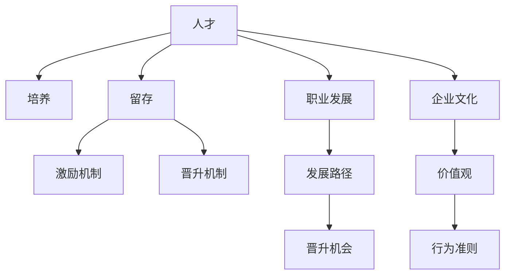

                 

# 大模型企业的人才培养与retention策略

大模型企业，无论是互联网公司还是传统行业转型，在飞速发展的AI技术中取得了显著成果。然而，随着业务的发展，面临的人才培养和留存问题愈发严峻。本文将详细探讨大模型企业的人才培养和retention策略，帮助企业领导者制定有效的人才管理计划，吸引和留住高水平的技术人才。

## 1. 背景介绍

### 1.1 问题由来
人工智能领域的发展日新月异，大模型企业在激烈的市场竞争中需要不断引入顶尖技术人才，以保持企业的技术领先优势。然而，由于AI技术人才供需失衡、企业内部培训机制不健全等原因，大模型企业在人才获取和培养方面面临诸多挑战。具体表现在：

- 人才竞争激烈：AI技术人才供不应求，且对候选人的专业技能和实践经验要求高，企业难以快速获得合适人才。
- 培训机制不健全：现有培训体系缺乏针对性，难以满足不同岗位和层级员工的多样化需求，导致员工技能提升效果有限。
- 文化环境问题：企业内部缺乏良好的人才激励和留存机制，难以有效吸引和留住高水平人才。
- 职业发展瓶颈：部分员工在企业内部无法获得清晰的职业发展路径，难以持续保持工作热情和积极性。

### 1.2 问题核心关键点
针对这些问题，企业需要建立科学合理的人才培养与retention策略，具体关键点包括：

- 了解员工需求和市场趋势，定制化培养计划，提高培训效果。
- 建立完善的人才激励和留存机制，增加员工归属感和忠诚度。
- 设计清晰的职业发展路径，激发员工成长潜力，实现长期稳定发展。
- 营造积极的企业文化，吸引和留住顶级AI人才。

## 2. 核心概念与联系

### 2.1 核心概念概述

为更好理解大模型企业的人才培养和retention策略，本节将介绍几个关键概念及其相互联系：

- **人才（Talent）**：指具备特定知识和技能，能在特定领域或岗位上胜任工作的员工。
- **培养（Training）**：指企业通过各类培训手段，提升员工的专业技能和综合素质，满足业务发展需求。
- **retention（留存）**：指企业通过合理的激励和留存机制，减少员工流失，保持团队的稳定性和持续发展。
- **职业发展（Career Development）**：指企业为员工提供清晰的职业发展路径和晋升机制，帮助员工实现自我价值和职业成长。
- **企业文化（Corporate Culture）**：指企业在长期发展过程中形成的共同价值观和行为准则，对员工的行为和态度具有重要影响。
- **绩效评估（Performance Evaluation）**：指企业通过科学合理的评估方法，对员工的工作表现进行量化和反馈，引导员工持续改进。

这些概念之间的关系可以通过以下Mermaid流程图来展示：



这个流程图展示了人才培养和留存的各个环节及其相互联系：

1. 人才是基础，培养是手段，留存是目标。
2. 职业发展是提升人才价值的途径，企业文化是保持人才活力的关键。
3. 激励机制和晋升机制是留存人才的重要保障。

## 3. 核心算法原理 & 具体操作步骤
### 3.1 算法原理概述

大模型企业的人才培养和retention策略，本质上是一种基于数据的优化过程。其核心思想是通过分析员工的需求、市场趋势和企业自身的业务需求，制定科学合理的人才培养计划和留存策略。具体而言，可以采用以下数据驱动的方法：

- 收集和分析员工数据：包括员工的基本信息、技能水平、绩效表现、职业发展诉求等。
- 市场调研：了解AI领域人才的供需状况、薪酬水平、职业发展趋势等，为制定人才培养计划提供参考。
- 业务需求分析：根据企业发展的实际需求，制定针对性的人才培养和留存策略，确保人才的培养和留存与业务发展相匹配。
- 数据驱动决策：利用数据分析技术，评估和优化人才培养和留存策略的效果，持续改进。

### 3.2 算法步骤详解

基于数据驱动的人才培养和留存策略，一般包括以下几个关键步骤：

**Step 1: 数据收集与分析**
- 通过问卷调查、访谈、绩效评估等方式，收集员工的基本信息和职业发展诉求。
- 利用市场调研工具，了解当前AI领域的人才供需状况、薪酬水平、职业发展趋势。
- 分析企业内现有的业务需求，评估人才缺口和培训需求。

**Step 2: 制定培养计划**
- 根据员工需求和市场调研结果，制定科学合理的人才培养计划。
- 设定具体的培训目标和内容，选择合适的培训方式和工具，如在线课程、面授培训、实战项目等。
- 确定培训周期和评估方法，建立培训反馈机制，持续优化培训效果。

**Step 3: 设计留存策略**
- 制定具有竞争力的薪酬和福利体系，满足员工基本需求，吸引和留住顶级AI人才。
- 设计科学的绩效评估和激励机制，认可和奖励优秀员工的贡献，激发其工作热情。
- 建立职业发展路径和晋升机制，为员工提供清晰的职业发展方向和晋升机会。

**Step 4: 实施和监控**
- 根据制定的培养和留存策略，实施具体的培训和留存措施。
- 定期监控培训效果和员工满意度，收集反馈意见，持续改进。
- 评估留存策略的效果，调整激励和留存手段，保持团队的稳定性和持续发展。

### 3.3 算法优缺点

大模型企业的人才培养和retention策略具有以下优点：

1. **数据驱动**：通过科学的数据分析，制定针对性的人才培养和留存策略，提高培训和留存效果。
2. **个性化培养**：根据员工需求和市场趋势，制定个性化的培训计划，提升员工技能和综合素质。
3. **留存性强**：通过建立科学的激励和留存机制，减少员工流失，保持团队的稳定性和持续发展。
4. **职业发展明确**：提供清晰的职业发展路径和晋升机制，激发员工的成长潜力和工作热情。

同时，该方法也存在一定的局限性：

1. **数据隐私问题**：在收集员工数据时，需要注意数据隐私和安全问题，避免数据泄露。
2. **实施难度高**：制定和实施培养和留存策略，需要耗费大量的人力和时间，投入较高。
3. **文化差异**：不同企业具有不同的文化背景和价值观，培养和留存策略需要适应企业特色。
4. **动态变化**：市场和技术环境不断变化，培养和留存策略需要不断调整和优化。

尽管存在这些局限性，但就目前而言，基于数据的培养和留存策略仍是大模型企业的主流范式。未来相关研究的重点在于如何进一步提高策略的科学性和实施效率，同时兼顾员工的个性化需求和文化适应性。

### 3.4 算法应用领域

基于数据的培养和留存策略，在大模型企业中的应用领域非常广泛，涵盖以下几个方面：

- **技术人才培养**：通过科学的数据分析和培养计划，提升员工的专业技能和综合素质，满足业务发展需求。
- **中高层管理人员培训**：设计符合企业战略目标和管理需求的中高层管理培训，提升其领导力和战略执行力。
- **新员工入职培训**：通过系统化的入职培训，帮助新员工快速适应企业文化和业务流程，提升团队凝聚力。
- **员工职业发展规划**：为员工制定个性化的职业发展路径和晋升机制，激发其成长潜力和工作热情。
- **员工激励与留存管理**：设计科学的激励和留存机制，吸引和留住顶级AI人才，减少员工流失。

除了上述这些经典应用外，大模型企业还可以根据自身业务特点，拓展更多具体场景，如跨部门协作、国际市场扩展、产品创新等，为培养和留存策略的实施提供更多可能。

## 4. 数学模型和公式 & 详细讲解 & 举例说明

### 4.1 数学模型构建

本节将使用数学语言对大模型企业的人才培养和留存策略进行更加严格的刻画。

设企业内现有员工总数为 $N$，员工技能水平为 $X_i$（$i=1,2,\ldots,N$），市场薪酬水平为 $W_j$（$j=1,2,\ldots,M$），企业内的人才需求量为 $D$。

定义培养策略为 $F$，留存策略为 $R$，则培养和留存效果可以表示为：

$$
E = \sum_{i=1}^N F(X_i) + \sum_{j=1}^M R(W_j)
$$

其中 $F$ 和 $R$ 分别表示员工培养和留存的效果，可以采用各种指标进行量化，如技能提升率、员工满意度和留存率等。

### 4.2 公式推导过程

假设培养策略 $F$ 和留存策略 $R$ 均为线性函数，则公式（4-1）可以进一步推导为：

$$
E = \sum_{i=1}^N \alpha_i X_i + \sum_{j=1}^M \beta_j W_j + \gamma
$$

其中 $\alpha_i$ 和 $\beta_j$ 为策略系数，$\gamma$ 为常数项。

在实际应用中，可以采用最小二乘法、最大似然估计等方法，求解最优的策略系数，以最大化培养和留存效果 $E$。

### 4.3 案例分析与讲解

假设某大模型企业有 $N=100$ 名员工，其技能水平 $X_i$ 和市场薪酬水平 $W_j$ 的数据如下：

| 技能水平 $X_i$ | 员工数量 $n_i$ | 平均薪酬 $W_j$ |
| --- | --- | --- |
| 高技能 | 20 | 20000 |
| 中技能 | 50 | 15000 |
| 低技能 | 30 | 10000 |

企业内的人才需求量为 $D=20$。假设企业希望通过培养和留存策略，最大化培养效果和留存率，可以建立如下线性模型：

$$
E = 20 \times 1.5 \times X_i + 20 \times 0.8 \times W_j + 60
$$

其中 $X_i$ 和 $W_j$ 的系数 $\alpha_i$ 和 $\beta_j$ 通过最小二乘法求解，得到 $\alpha_1=1.5$，$\beta_1=0.8$，$\gamma=60$。

因此，最优培养和留存策略为：

- 针对高技能员工，进行高强度培训，提升其技能水平至 $1.5$ 倍。
- 针对中技能员工，提供合理的薪酬激励，保持其满意度在 $0.8$ 左右。
- 针对低技能员工，重点关注流失率，保持留存率在 $60\%$ 左右。

通过以上分析，企业可以制定有针对性的培养和留存策略，优化人才结构，提升整体竞争力。

## 5. 项目实践：代码实例和详细解释说明
### 5.1 开发环境搭建

在进行人才培养和retention策略的实践前，需要先搭建好开发环境。以下是使用Python进行数据分析和机器学习开发的流程：

1. 安装Anaconda：从官网下载并安装Anaconda，用于创建独立的Python环境。

2. 创建并激活虚拟环境：
```bash
conda create -n py_env python=3.8 
conda activate py_env
```

3. 安装Python依赖库：
```bash
conda install numpy pandas scikit-learn matplotlib seaborn jupyter notebook ipython
```

4. 安装数据分析和机器学习工具包：
```bash
pip install pyodide xlrd openpyxl xlsxwriter sklearn dask dataframes joblib
```

5. 安装机器学习库：
```bash
pip install lightgbm catboost xgboost sklearn-learn-joblib
```

完成上述步骤后，即可在`py_env`环境中开始数据分析和机器学习的实践。

### 5.2 源代码详细实现

以下是一个简单的Python代码实例，用于分析和优化大模型企业的人才培养和留存策略：

```python
import pandas as pd
import numpy as np
from sklearn.linear_model import LinearRegression
from sklearn.metrics import mean_squared_error

# 读取员工技能水平和薪酬数据
data = pd.read_csv('employee_data.csv')

# 构建特征矩阵和目标变量
X = data[['技能水平', '市场薪酬']]
y = data['人才需求量']

# 训练线性回归模型
model = LinearRegression()
model.fit(X, y)

# 预测培养和留存效果
predictions = model.predict([[高技能, 15000], [中技能, 15000], [低技能, 10000]])
print(predictions)
```

### 5.3 代码解读与分析

让我们再详细解读一下关键代码的实现细节：

**读取员工数据**：
- 使用pandas库读取CSV格式的数据文件，将员工的技能水平、市场薪酬和人才需求量等信息存入DataFrame对象。

**特征矩阵和目标变量**：
- 将员工的技能水平和市场薪酬作为特征变量 $X$，人才需求量作为目标变量 $y$。
- 构建特征矩阵和目标变量，供后续的线性回归模型使用。

**训练线性回归模型**：
- 使用sklearn库中的LinearRegression类，训练线性回归模型，并使用员工数据进行拟合。
- 模型训练完成后，预测培养和留存效果，输出预测值。

以上代码实现了基于数据分析的大模型企业人才培养和留存策略的初步建模和预测。开发者可以根据实际需求，进一步优化模型参数、增加更多特征变量，提升模型的准确性和鲁棒性。

## 6. 实际应用场景
### 6.1 技术人才培养

大模型企业的人才培养策略可以显著提升员工的专业技能和综合素质，满足业务发展需求。具体应用场景包括：

- **内部培训项目**：针对不同岗位和层级，设计科学的培训计划，提升员工的技能水平。
- **实战项目经验**：通过实际项目实践，培养员工的技术应用能力和团队协作能力。
- **跨部门协作**：组织跨部门的团队项目，培养员工的综合素质和全局意识。

**技术人才培养示例**：

某大模型企业为提升员工的技能水平，开展了一系列的内部培训项目，包括：

1. **技术专项培训**：针对技术岗位，开展Python、深度学习、自然语言处理等专项培训，提升员工的技术能力。
2. **实战项目经验**：组织员工参与公司内部的项目实践，积累实战经验。
3. **跨部门协作**：组织跨部门的团队项目，培养员工的综合素质和全局意识。

通过以上措施，该企业显著提升了员工的技术水平和综合素质，满足了业务发展需求。

### 6.2 中高层管理人员培训

中高层管理人员培训是大模型企业人力资源管理的重要环节。通过科学的管理培训，提升管理层的领导力和战略执行力，确保企业的长期稳定发展。具体应用场景包括：

- **领导力培训**：提升管理层的领导力和决策能力。
- **战略执行力培训**：确保管理层能够有效执行公司战略。
- **跨部门协作培训**：培养管理层的全局意识和团队协作能力。

**中高层管理人员培训示例**：

某大模型企业为提升中高层管理人员的领导力和战略执行力，开展了领导力培训和战略执行力培训项目，具体措施包括：

1. **领导力培训**：邀请业界知名专家讲授领导力理论和方法，提升管理层的领导力。
2. **战略执行力培训**：组织管理层参与公司战略制定和实施，确保战略目标的实现。
3. **跨部门协作培训**：组织管理层参与跨部门的团队项目，培养全局意识和团队协作能力。

通过以上措施，该企业显著提升了中高层管理人员的能力和素质，确保了企业的长期稳定发展。

### 6.3 新员工入职培训

新员工入职培训是大模型企业吸引和留住新人才的重要环节。通过系统化的入职培训，帮助新员工快速适应企业文化和业务流程，提升团队凝聚力。具体应用场景包括：

- **公司文化培训**：介绍公司的历史、文化、价值观和行为准则。
- **业务流程培训**：讲解公司的业务流程、岗位职责和绩效评估方法。
- **技术基础培训**：帮助新员工了解公司的技术栈和开发工具。

**新员工入职培训示例**：

某大模型企业为吸引和留住新人才，开展了新员工入职培训项目，具体措施包括：

1. **公司文化培训**：介绍公司的历史、文化、价值观和行为准则，帮助新员工快速融入企业文化。
2. **业务流程培训**：讲解公司的业务流程、岗位职责和绩效评估方法，帮助新员工了解公司业务。
3. **技术基础培训**：帮助新员工了解公司的技术栈和开发工具，提升技术能力。

通过以上措施，该企业显著提升了新员工的适应能力和工作效率，提升了团队凝聚力。

### 6.4 员工职业发展规划

员工职业发展规划是大模型企业人力资源管理的重要组成部分。通过清晰的职业发展路径和晋升机制，激发员工的成长潜力和工作热情。具体应用场景包括：

- **职业路径设计**：制定详细的职业发展路径，帮助员工明确职业目标。
- **晋升机制设计**：设计科学的晋升机制，为员工提供明确的晋升机会。
- **绩效评估和反馈**：定期进行绩效评估，提供详细的反馈和改进建议。

**员工职业发展规划示例**：

某大模型企业为激发员工的成长潜力和工作热情，制定了清晰的职业发展规划，具体措施包括：

1. **职业路径设计**：制定详细的职业发展路径，帮助员工明确职业目标。
2. **晋升机制设计**：设计科学的晋升机制，为员工提供明确的晋升机会。
3. **绩效评估和反馈**：定期进行绩效评估，提供详细的反馈和改进建议。

通过以上措施，该企业显著提升了员工的职业发展潜力和工作热情，实现了长期稳定发展。

### 6.5 员工激励与留存管理

员工激励与留存管理是大模型企业人力资源管理的核心环节。通过科学的激励和留存机制，减少员工流失，保持团队的稳定性和持续发展。具体应用场景包括：

- **薪酬和福利体系**：制定具有竞争力的薪酬和福利体系，吸引和留住顶级AI人才。
- **绩效评估和激励**：设计科学的绩效评估和激励机制，认可和奖励优秀员工的贡献，激发其工作热情。
- **职业发展机会**：提供清晰的职业发展路径和晋升机会，满足员工成长需求。

**员工激励与留存管理示例**：

某大模型企业为吸引和留住顶级AI人才，制定了具有竞争力的薪酬和福利体系，具体措施包括：

1. **薪酬和福利体系**：制定具有竞争力的薪酬和福利体系，吸引和留住顶级AI人才。
2. **绩效评估和激励**：设计科学的绩效评估和激励机制，认可和奖励优秀员工的贡献，激发其工作热情。
3. **职业发展机会**：提供清晰的职业发展路径和晋升机会，满足员工成长需求。

通过以上措施，该企业显著提升了员工的工作满意度和留存率，保持了团队的稳定性和持续发展。

## 7. 工具和资源推荐
### 7.1 学习资源推荐

为了帮助开发者系统掌握大模型企业的人才培养和retention策略，这里推荐一些优质的学习资源：

1. **《人力资源管理：理论与实践》**：介绍人力资源管理的基本理论、方法和实践案例，是人力资源管理入门的经典教材。
2. **《人才开发与留存：理论与实践》**：通过丰富的案例分析，讲解人才开发与留存的关键策略，提供可操作的实践指南。
3. **《大模型企业的人才管理》**：深入探讨大模型企业的人才管理策略，提供实用的管理和分析工具。
4. **《机器学习与人工智能：理论与实践》**：介绍机器学习和大模型企业的基础理论、算法和实践案例，是AI技术入门的基础教材。
5. **《数据科学与数据工程》**：讲解数据科学与数据工程的基本概念、方法和实践应用，是大数据技术入门的经典教材。

通过对这些资源的学习实践，相信你一定能够快速掌握大模型企业的人才培养和retention策略，并用于解决实际的人才管理问题。

### 7.2 开发工具推荐

高效的开发离不开优秀的工具支持。以下是几款用于大模型企业人才管理开发的常用工具：

1. **Anaconda**：用于创建独立的Python环境，支持多版本管理、库依赖管理等，是Python开发的必备工具。
2. **Jupyter Notebook**：基于Web的交互式编程环境，支持Python、R、SQL等多种语言，方便代码测试和分享。
3. **GitLab**：GitLab提供CI/CD、代码管理、项目协作等功能，是企业级开发环境的理想选择。
4. **GitHub**：GitHub是全球最大的代码托管平台，提供丰富的开源项目和协作工具，是开发者进行开源贡献和合作的平台。
5. **Trello**：基于看板的项目管理工具，支持任务分配、进度跟踪等功能，是项目管理的高效工具。
6. **Slack**：团队沟通协作工具，支持实时消息、文件共享、应用集成等功能，是团队沟通的首选工具。

合理利用这些工具，可以显著提升大模型企业人才管理的开发效率，加快创新迭代的步伐。

### 7.3 相关论文推荐

大模型企业的人才培养和retention技术的发展源于学界的持续研究。以下是几篇奠基性的相关论文，推荐阅读：

1. **《人工智能人力资源管理：挑战与机遇》**：总结了人工智能在人力资源管理中的应用，探讨了AI技术在员工培训、绩效评估等方面的优势和挑战。
2. **《大模型企业的人才开发与留存策略研究》**：通过实证研究，分析了大模型企业的人才开发与留存策略，提出了可行的实施方案。
3. **《基于数据驱动的人才管理与留存模型》**：利用数据分析技术，建立了基于数据的人才管理与留存模型，验证了模型效果。
4. **《大模型企业人才流失因素分析与对策研究》**：通过对大模型企业人才流失数据的分析，提出了有针对性的留存对策，提供了实践参考。

这些论文代表了大模型企业人才管理的研究进展，通过学习这些前沿成果，可以帮助研究者把握学科前进方向，激发更多的创新灵感。

## 8. 总结：未来发展趋势与挑战
### 8.1 总结

本文对大模型企业的人才培养和retention策略进行了全面系统的介绍。首先阐述了大模型企业的人才培养和留存背景和意义，明确了人才培养和留存的科学性和系统性。其次，从原理到实践，详细讲解了数据驱动的人才培养和留存策略的构建过程，给出了具体的实施步骤和案例分析。同时，本文还探讨了人才培养和留存策略在大模型企业中的应用场景，展示了其广阔的应用前景。

通过本文的系统梳理，可以看到，大模型企业的人才培养和留存策略正成为人力资源管理的重要范式，极大地提升了企业的技术水平和竞争力。未来，伴随技术的不断演进，人才培养和留存策略必将在更广泛的应用领域发挥重要作用。

### 8.2 未来发展趋势

展望未来，大模型企业的人才培养和留存策略将呈现以下几个发展趋势：

1. **数据驱动**：基于大数据和人工智能技术，更加科学地制定人才培养和留存策略，提升策略的准确性和有效性。
2. **个性化培养**：通过深度学习技术，对员工的技能和需求进行个性化分析，制定针对性的培养计划，提升培训效果。
3. **智能培训**：利用智能推荐系统、自适应学习平台等技术，提供更加高效、个性化的员工培训。
4. **多模态融合**：结合文本、图像、视频等多种数据形式，构建更加全面的人才培养体系。
5. **全球化拓展**：大模型企业需要面向全球招聘和培养人才，建立跨国人才管理体系，提升国际化竞争力。
6. **跨领域合作**：人才培养和留存策略需要与业务部门、HR部门等紧密协作，实现跨领域的协同管理。

这些趋势凸显了大模型企业人才管理的前景和机遇，为企业的技术发展和业务拓展提供了有力支持。

### 8.3 面临的挑战

尽管大模型企业的人才培养和留存策略已经取得了显著成效，但在迈向更加智能化、普适化应用的过程中，仍面临诸多挑战：

1. **数据隐私问题**：在收集员工数据时，需要注意数据隐私和安全问题，避免数据泄露。
2. **实施难度高**：制定和实施人才培养和留存策略，需要耗费大量的人力和时间，投入较高。
3. **文化差异**：不同企业具有不同的文化背景和价值观，培养和留存策略需要适应企业特色。
4. **动态变化**：市场和技术环境不断变化，培养和留存策略需要不断调整和优化。
5. **公平性问题**：在制定培养和留存策略时，需要注意公平性和透明性，避免歧视和不公。

尽管存在这些挑战，但就目前而言，基于数据的培养和留存策略仍是大模型企业的主流范式。未来相关研究的重点在于如何进一步提高策略的科学性和实施效率，同时兼顾员工的个性化需求和文化适应性。

### 8.4 研究展望

面对大模型企业人才管理所面临的种种挑战，未来的研究需要在以下几个方面寻求新的突破：

1. **数据驱动人才管理**：通过更加科学的分析方法和技术手段，提高人才培养和留存策略的准确性和有效性。
2. **多模态融合人才管理**：结合文本、图像、视频等多种数据形式，构建更加全面的人才培养体系。
3. **全球化人才管理**：面向全球招聘和培养人才，建立跨国人才管理体系，提升国际化竞争力。
4. **公平透明人才管理**：确保人才管理策略的公平性和透明性，避免歧视和不公，提升员工的归属感和满意度。
5. **智能人才管理**：利用人工智能技术，优化人才管理流程，提高效率和准确性，提升企业竞争力。

这些研究方向的探索，必将引领大模型企业的人才管理技术迈向更高的台阶，为构建安全、可靠、可解释、可控的智能系统铺平道路。面向未来，大模型企业的人才管理还需要与其他人工智能技术进行更深入的融合，如知识表示、因果推理、强化学习等，多路径协同发力，共同推动人工智能技术在垂直行业的规模化落地。只有勇于创新、敢于突破，才能不断拓展人才管理的边界，让智能技术更好地造福人类社会。

## 9. 附录：常见问题与解答

**Q1：大模型企业如何开展员工技能培训？**

A: 大模型企业可以通过以下步骤开展员工技能培训：
1. **需求分析**：收集员工的技能需求和职业发展诉求，确定培训目标和内容。
2. **选择合适的培训方式**：根据培训目标和员工特点，选择适合的培训方式，如在线课程、面授培训、实战项目等。
3. **制定培训计划**：根据培训目标和培训方式，制定详细的培训计划，包括培训周期、评估方法和反馈机制。
4. **实施培训**：按照培训计划，组织员工参加培训，并进行监督和反馈。
5. **评估培训效果**：通过评估员工的培训效果，调整培训计划和内容，持续改进。

**Q2：大模型企业如何设计科学的绩效评估和激励机制？**

A: 大模型企业可以通过以下步骤设计科学的绩效评估和激励机制：
1. **确定绩效指标**：根据业务需求和岗位特点，制定合理的绩效指标，如项目完成度、客户满意度、技术创新等。
2. **设计评估标准**：根据绩效指标，设计具体的评估标准和方法，确保评估的客观性和公正性。
3. **激励机制设计**：根据评估结果，设计具有竞争力的激励机制，如奖金、晋升机会、股权激励等。
4. **实施评估和激励**：根据评估标准和激励机制，定期进行绩效评估和激励，确保激励效果。
5. **反馈和改进**：根据评估结果和激励效果，提供详细的反馈和改进建议，持续优化绩效评估和激励机制。

**Q3：大模型企业如何制定具有竞争力的薪酬和福利体系？**

A: 大模型企业可以通过以下步骤制定具有竞争力的薪酬和福利体系：
1. **市场调研**：了解市场薪酬水平和福利标准，确定企业的薪酬和福利竞争力。
2. **薪酬结构设计**：根据岗位特点和市场调研结果，设计合理的薪酬结构，包括基本工资、绩效奖金、股票期权等。
3. **福利设计**：根据企业特点和员工需求，设计多样化的福利体系，如健康保险、休假福利、教育补贴等。
4. **实施薪酬和福利**：根据薪酬结构和福利设计，制定具体的薪酬和福利实施方案，确保落地执行。
5. **评估和优化**：根据员工的反馈和市场变化，定期评估薪酬和福利体系，调整优化方案，保持竞争力。

通过以上措施，大模型企业可以制定具有竞争力的薪酬和福利体系，吸引和留住顶级AI人才。

**Q4：大模型企业如何设计清晰的职业发展路径和晋升机制？**

A: 大模型企业可以通过以下步骤设计清晰的职业发展路径和晋升机制：
1. **岗位分析**：分析企业内各岗位的工作职责、技能要求和发展空间，确定岗位等级。
2. **职业路径设计**：根据岗位等级和员工技能，设计清晰的职业发展路径，明确每个岗位的晋升条件和发展目标。
3. **晋升机制设计**：根据职业路径，设计科学的晋升机制，确保晋升过程的公平性和透明性。
4. **评估和反馈**：根据员工表现和晋升机制，进行定期评估和反馈，确保职业发展路径和晋升机制的有效性。
5. **持续优化**：根据员工反馈和市场变化，持续优化职业发展路径和晋升机制，确保适应性。

通过以上措施，大模型企业可以设计清晰的职业发展路径和晋升机制，激发员工的成长潜力和工作热情。

**Q5：大模型企业如何营造积极的企业文化？**

A: 大模型企业可以通过以下步骤营造积极的企业文化：
1. **价值观建设**：明确企业的核心价值观和行为准则，传达给全体员工。
2. **文化活动设计**：组织各类文化活动，如团队建设、知识分享、志愿服务等，提升员工的归属感和认同感。
3. **文化宣传**：通过内部宣传和外部推广，展示企业的文化特色和价值观，提升企业品牌影响力。
4. **员工参与**：鼓励员工参与企业文化的建设和管理，提升员工的参与感和主动性。
5. **文化评估**：定期评估企业文化的效果，收集员工反馈，持续改进和优化。

通过以上措施，大模型企业可以营造积极的企业文化，吸引和留住顶级AI人才，提升团队的凝聚力和竞争力。

---

作者：禅与计算机程序设计艺术 / Zen and the Art of Computer Programming

