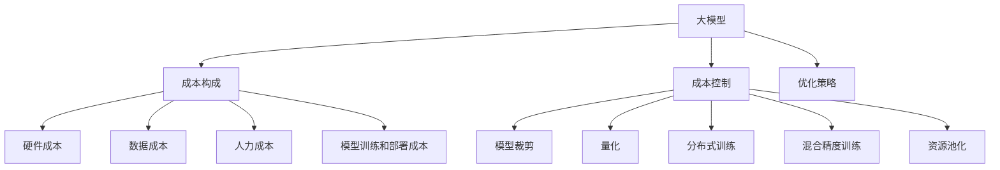

                 

# 大模型企业的成本控制策略

> 关键词：大模型,成本控制,人工智能,企业运营,优化策略

## 1. 背景介绍

### 1.1 问题由来
随着人工智能(AI)技术的迅猛发展，特别是大模型的应用，企业面临着如何有效控制成本的问题。大模型，尤其是基于深度学习的大模型，具有强大的处理能力，但同时也需要高昂的硬件成本、数据成本和人力成本。企业在使用大模型的过程中，如何既保证模型的精度和效果，又控制成本，成为当前AI企业必须面对的挑战。

### 1.2 问题核心关键点
- 成本构成：包括硬件成本、数据成本、人力成本、模型训练和部署成本等。
- 成本优化目标：在保证模型性能的前提下，最大限度地降低各项成本。
- 优化手段：包括模型裁剪、量化、分布式训练、混合精度训练、资源池化等。

### 1.3 问题研究意义
研究大模型企业的成本控制策略，对于提升AI技术的落地应用，降低企业运营成本，促进AI技术的广泛普及具有重要意义：

1. 提高AI技术的经济可行性。通过成本控制策略，使大模型的应用变得更加经济实惠，推动更多企业采用AI技术。
2. 提升AI系统的效率。优化后的模型可以提升处理速度，减少计算资源消耗，提高企业的运营效率。
3. 降低对初始资本的需求。通过优化策略，可以避免大量的初始硬件和人力资源投入，降低企业进入AI领域的门槛。
4. 增强市场竞争力。高效利用资源，缩短开发周期，使企业在竞争中获得优势。

## 2. 核心概念与联系

### 2.1 核心概念概述

为更好地理解大模型企业的成本控制策略，本节将介绍几个密切相关的核心概念：

- 大模型（Large Models）：指基于深度学习，特别是神经网络构建的超大规模模型。这些模型具有强大的处理能力和表示能力，但通常需要大量计算资源和数据支持。
- 成本控制（Cost Control）：指通过一系列策略和技术手段，最大限度地降低企业使用大模型时的各项成本。
- 优化策略（Optimization Strategies）：包括模型裁剪、量化、分布式训练、混合精度训练、资源池化等。
- 硬件成本（Hardware Cost）：包括GPU/TPU等计算硬件的采购和维护成本。
- 数据成本（Data Cost）：指获取、存储和处理大模型训练所需的数据集所需的成本。
- 人力成本（Human Cost）：指构建和维护大模型所需的工程师、数据标注人员等人员的成本。
- 模型训练和部署成本（Training & Deployment Cost）：指模型训练和部署所需的计算资源、网络带宽等成本。

这些概念之间的逻辑关系可以通过以下Mermaid流程图来展示：



这个流程图展示了大模型的成本构成及其优化策略之间的关系：

1. 大模型通过一系列优化策略，能够有效降低成本。
2. 优化策略可以通过模型裁剪、量化、分布式训练等方式，来提升模型效率，降低硬件、数据和人力成本。
3. 成本控制策略需要在硬件、数据、人力等多个层面进行综合优化，才能实现成本的最小化。

## 3. 核心算法原理 & 具体操作步骤
### 3.1 算法原理概述

大模型企业的成本控制策略，本质上是通过一系列优化手段，最大限度地降低大模型的使用成本。其核心思想是：在大模型的构建、训练、部署和维护过程中，通过技术手段降低硬件成本、数据成本、人力成本等，以更经济的方式实现模型的高效应用。

形式化地，假设一个基于深度学习的大模型训练和使用所需的各种成本分别为 $C_{hardware}$、$C_{data}$、$C_{human}$ 和 $C_{train&deploy}$，则成本控制的目标是找到最优策略 $\sigma$，使得：

$$
\sigma^* = \mathop{\arg\min}_{\sigma} C_{hardware}(\sigma) + C_{data}(\sigma) + C_{human}(\sigma) + C_{train&deploy}(\sigma)
$$

其中 $\sigma$ 包含模型裁剪、量化、分布式训练、混合精度训练等优化策略，不同的策略会对成本产生不同的影响。

### 3.2 算法步骤详解

大模型企业的成本控制策略一般包括以下几个关键步骤：

**Step 1: 选择合适的优化策略**
- 根据模型大小和应用场景，选择适合成本控制策略。如模型裁剪、量化等。

**Step 2: 实施优化策略**
- 针对硬件成本，可以通过模型裁剪、量化等手段减小模型尺寸，降低计算需求。
- 针对数据成本，可以优化数据采集、存储和预处理流程，减少数据处理开销。
- 针对人力成本，可以采用自动化工具，提高模型开发和训练效率。
- 针对训练和部署成本，可以使用分布式训练、混合精度训练等优化算法，提升训练速度。

**Step 3: 评估效果和调整策略**
- 在应用成本控制策略后，评估模型性能和成本变化情况。
- 根据评估结果，调整优化策略，达到成本和性能的平衡。

**Step 4: 定期优化**
- 随着模型和技术的进步，定期评估和更新成本控制策略，确保最优成本控制。

### 3.3 算法优缺点

大模型企业的成本控制策略具有以下优点：
1. 降低成本。通过优化策略，可以在保证模型性能的前提下，显著降低各项成本。
2. 提升效率。优化后的模型可以更快地训练和推理，提高企业的运营效率。
3. 增强灵活性。可以根据不同的应用场景，灵活选择和调整优化策略，满足不同的需求。

同时，该策略也存在一定的局限性：
1. 技术复杂。实施成本控制策略需要一定的技术储备，可能增加企业的技术门槛。
2. 效果受限。某些优化策略可能对特定模型效果有限，需要综合评估和选择。
3. 资源需求。优化策略的实施需要额外的硬件和软件资源，短期内可能增加成本。

尽管存在这些局限性，但就目前而言，成本控制策略是大模型应用中最主流和最有效的成本优化手段。未来相关研究的重点在于如何进一步降低成本控制的技术门槛，提高策略的通用性和效果。

### 3.4 算法应用领域

大模型企业的成本控制策略在以下几个领域得到了广泛应用：

- 医疗领域：大模型用于疾病诊断和治疗方案生成，通过优化策略降低诊断成本，提升医疗服务的可及性和效率。
- 金融领域：大模型用于风险评估和投资策略生成，通过成本控制策略，提高模型的精准度和应用效率。
- 智能制造：大模型用于生产过程的优化和故障预测，通过降低硬件和数据成本，提升生产效率和降低维护成本。
- 零售领域：大模型用于个性化推荐和客户服务，通过优化策略，提高用户体验和运营效益。
- 物流领域：大模型用于路线规划和库存管理，通过成本控制策略，降低物流成本，提升配送效率。

除了上述这些典型应用外，大模型企业的成本控制策略还被创新性地应用到更多场景中，如城市治理、环保监测等，为各行各业带来了成本优化和效率提升的机遇。

## 4. 数学模型和公式 & 详细讲解  
### 4.1 数学模型构建

本节将使用数学语言对大模型企业的成本控制策略进行更加严格的刻画。

假设企业使用的大模型为 $M$，其训练和部署所需的各种成本分别为 $C_{hardware} = C_{hardware}(M)$、$C_{data} = C_{data}(M)$、$C_{human} = C_{human}(M)$、$C_{train&deploy} = C_{train&deploy}(M)$。

定义优化策略为 $\sigma$，其中包含模型裁剪、量化、分布式训练、混合精度训练等优化手段。通过实施 $\sigma$ 后，新的成本函数为 $C_{\sigma} = C_{\sigma}(M)$。

优化目标是最小化成本函数：

$$
\sigma^* = \mathop{\arg\min}_{\sigma} C_{\sigma}(M)
$$

在实践中，我们通常使用成本效益分析（Cost-Benefit Analysis, CBA）框架，将成本优化目标具体化：

1. 目标函数：最小化总成本 $C_{\sigma} = C_{hardware} + C_{data} + C_{human} + C_{train&deploy}$。
2. 约束条件：满足模型性能指标 $P(M)$。

### 4.2 公式推导过程

以下我们以模型裁剪（Model Pruning）为例，推导其对成本函数的影响。

假设模型 $M$ 包含 $n$ 个参数，裁剪比例为 $\alpha$，则裁剪后的模型参数数量为 $n \times (1-\alpha)$。通过模型裁剪，可以减小模型的计算需求，降低硬件成本 $C_{hardware}$ 和模型训练和部署成本 $C_{train&deploy}$。

设裁剪前后的硬件成本分别为 $C_{hardware}^{old}$ 和 $C_{hardware}^{new}$，则有：

$$
C_{hardware}^{new} = C_{hardware}^{old} \times (1-\alpha)^{d_{\text{GPU}}}
$$

其中 $d_{\text{GPU}}$ 为模型的计算复杂度，可以通过FLOPs等指标衡量。

同理，模型的计算复杂度也会相应减小，从而降低模型训练和部署的成本：

$$
C_{train&deploy}^{new} = C_{train&deploy}^{old} \times (1-\alpha)^{d_{\text{GPU}}}
$$

量化和分布式训练等优化手段同理，通过降低模型的计算需求和资源消耗，进一步减小了成本。

通过将模型裁剪、量化、分布式训练等优化手段综合应用，可以显著降低大模型企业的成本。

## 5. 项目实践：代码实例和详细解释说明
### 5.1 开发环境搭建

在进行成本控制策略实践前，我们需要准备好开发环境。以下是使用Python进行PyTorch开发的环境配置流程：

1. 安装Anaconda：从官网下载并安装Anaconda，用于创建独立的Python环境。

2. 创建并激活虚拟环境：
```bash
conda create -n pytorch-env python=3.8 
conda activate pytorch-env
```

3. 安装PyTorch：根据CUDA版本，从官网获取对应的安装命令。例如：
```bash
conda install pytorch torchvision torchaudio cudatoolkit=11.1 -c pytorch -c conda-forge
```

4. 安装相关库：
```bash
pip install torch torchvision torchaudio
```

5. 安装TensorBoard：用于可视化模型训练和推理过程中的各项指标。
```bash
pip install tensorboard
```

完成上述步骤后，即可在`pytorch-env`环境中开始成本控制策略的实践。

### 5.2 源代码详细实现

下面我们以模型裁剪（Model Pruning）为例，给出使用PyTorch实现的具体代码。

首先，定义模型的裁剪函数：

```python
import torch.nn as nn
import torch.nn.functional as F
import torch

class PruneModel(nn.Module):
    def __init__(self, model, threshold):
        super(PruneModel, self).__init__()
        self.model = model
        self.threshold = threshold
        self.prune_weights = None
        self.prune_mask = None
        
    def prune(self):
        self.prune_weights = nn.utils.prune.l1_unstructured(self.model, amount=self.threshold, dim=1)
        self.prune_mask = self.prune_weights.weight_mask
        
    def forward(self, x):
        x = self.prune_mask(self.model(x))
        return x
```

然后，定义模型训练和评估函数：

```python
from torch.utils.data import DataLoader
import torch.optim as optim

def train(model, train_loader, device, optimizer):
    model.train()
    train_loss = 0
    for batch_idx, (data, target) in enumerate(train_loader):
        data, target = data.to(device), target.to(device)
        optimizer.zero_grad()
        output = model(data)
        loss = F.cross_entropy(output, target)
        loss.backward()
        optimizer.step()
        train_loss += loss.item()
    return train_loss / len(train_loader)

def evaluate(model, test_loader, device):
    model.eval()
    test_loss = 0
    with torch.no_grad():
        for batch_idx, (data, target) in enumerate(test_loader):
            data, target = data.to(device), target.to(device)
            output = model(data)
            loss = F.cross_entropy(output, target)
            test_loss += loss.item()
    return test_loss / len(test_loader)
```

最后，启动训练流程并在测试集上评估：

```python
threshold = 0.3
model = PruneModel(model, threshold)
prune_model.prune()

device = torch.device("cuda" if torch.cuda.is_available() else "cpu")
model.to(device)

train_loader = ...
test_loader = ...

optimizer = optim.SGD(model.parameters(), lr=0.01)
epochs = 10

for epoch in range(epochs):
    train_loss = train(model, train_loader, device, optimizer)
    test_loss = evaluate(model, test_loader, device)
    print(f"Epoch {epoch+1}, train loss: {train_loss:.4f}, test loss: {test_loss:.4f}")
```

以上就是使用PyTorch实现模型裁剪的完整代码。可以看到，通过定义一个PruneModel类，并使用nn.utils.prune.l1_unstructured函数对模型进行裁剪，即可实现模型的裁剪功能。

### 5.3 代码解读与分析

让我们再详细解读一下关键代码的实现细节：

**PruneModel类**：
- `__init__`方法：初始化模型和裁剪阈值。
- `prune`方法：使用nn.utils.prune.l1_unstructured函数进行权重裁剪，返回权重和掩码。
- `forward`方法：在每次前向传播时，应用权重掩码进行裁剪。

**模型训练和评估函数**：
- 使用PyTorch的DataLoader对数据集进行批次化加载，供模型训练和推理使用。
- 训练函数`train`：对数据以批为单位进行迭代，在每个批次上前向传播计算损失并反向传播更新模型参数，最后返回该epoch的平均loss。
- 评估函数`evaluate`：与训练类似，不同点在于不更新模型参数，并在每个batch结束后将预测和标签结果存储下来，最后使用eval函数对整个评估集的预测结果进行打印输出。

**训练流程**：
- 定义总的epoch数，开始循环迭代
- 每个epoch内，先在训练集上训练，输出平均loss
- 在测试集上评估，输出测试loss

可以看到，PyTorch配合nn.utils.prune等工具，使得模型裁剪的代码实现变得简洁高效。开发者可以将更多精力放在数据处理、模型改进等高层逻辑上，而不必过多关注底层的实现细节。

当然，工业级的系统实现还需考虑更多因素，如模型的保存和部署、超参数的自动搜索、更灵活的任务适配层等。但核心的成本控制策略基本与此类似。

## 6. 实际应用场景
### 6.1 智能制造

在智能制造领域，大模型企业的成本控制策略可以显著提升生产效率和降低维护成本。通过优化模型，可以更准确地预测设备故障，优化生产流程，减少不必要的停机时间，降低维护成本。

在技术实现上，可以收集历史生产数据，构建基于时间序列的预测模型。通过模型裁剪、量化等优化手段，降低模型的计算需求，从而降低硬件和能耗成本。同时，采用分布式训练等策略，提高训练速度，减少训练时间和人力成本。

### 6.2 智能推荐

在智能推荐领域，大模型企业的成本控制策略可以提升个性化推荐的效果，降低数据处理和存储成本。通过优化模型，可以更准确地捕捉用户兴趣，减少对用户行为数据的采集和存储需求，从而降低数据成本。

在技术实现上，可以采用模型裁剪、量化等手段，减小模型的计算需求。同时，引入分布式训练等策略，提高训练速度，减少训练时间和人力成本。通过优化策略，可以在保证推荐效果的前提下，显著降低推荐系统的成本。

### 6.3 医疗诊断

在医疗诊断领域，大模型企业的成本控制策略可以提升疾病诊断的准确性和效率，降低医疗成本。通过优化模型，可以更准确地诊断疾病，减少误诊和过度诊断，降低医疗费用。

在技术实现上，可以构建基于大模型的疾病诊断模型，并通过模型裁剪、量化等优化手段，降低模型计算需求和硬件成本。同时，引入分布式训练等策略，提高训练速度，减少训练时间和人力成本。通过优化策略，可以在保证诊断准确性的前提下，显著降低医疗系统的成本。

### 6.4 未来应用展望

随着大模型和成本控制技术的不断发展，未来的成本控制策略将呈现出以下几个趋势：

1. 模型规模持续增大。得益于算力成本的下降和数据规模的扩张，大模型的参数量将持续增长。超大规模语言模型蕴含的丰富知识，有望支撑更加复杂多变的应用场景。

2. 成本控制手段日趋多样化。除了传统的模型裁剪、量化等手段，未来还将涌现更多成本控制方法，如预训练优化、多模型集成等，在降低成本的同时，保持模型的精度和效果。

3. 硬件和软件优化相结合。未来将结合硬件优化和软件优化手段，如GPU/TPU加速、自动化压缩等，进一步提升模型效率，降低成本。

4. 智能化成本控制。通过引入AI技术，对成本控制过程进行优化，自动调整模型和算法参数，提升成本控制的效率和效果。

5. 跨领域应用推广。成本控制策略将不仅应用于人工智能领域，还将推广到更多行业，如智能制造、医疗、金融等，为各行各业带来成本优化和效率提升的机遇。

这些趋势将推动大模型企业的成本控制策略向更高层次演进，使AI技术在更多场景中实现规模化应用，加速AI技术的产业化进程。

## 7. 工具和资源推荐
### 7.1 学习资源推荐

为了帮助开发者系统掌握大模型企业的成本控制策略，这里推荐一些优质的学习资源：

1. 《深度学习中的优化技术》系列博文：由深度学习专家撰写，详细讲解了模型裁剪、量化、分布式训练等优化技术，适合入门和进阶学习。

2. 《TensorFlow和PyTorch的优化技巧》课程：由深度学习框架开发者主讲，涵盖模型裁剪、量化、混合精度训练等优化手段，适合实战练习。

3. 《AI模型压缩与加速》书籍：全面介绍模型压缩、量化、剪枝等优化技术，适合深入学习。

4. 《TensorBoard官方文档》：介绍如何使用TensorBoard进行模型训练和推理的可视化，适合调试和优化。

5. 《PyTorch官方文档》：提供PyTorch框架的详细文档和示例代码，适合系统学习。

通过对这些资源的学习实践，相信你一定能够快速掌握大模型企业的成本控制策略，并用于优化你的AI应用。

### 7.2 开发工具推荐

高效的开发离不开优秀的工具支持。以下是几款用于大模型企业成本控制开发的常用工具：

1. PyTorch：基于Python的开源深度学习框架，灵活动态的计算图，适合快速迭代研究。大部分大模型都有PyTorch版本的实现。

2. TensorFlow：由Google主导开发的开源深度学习框架，生产部署方便，适合大规模工程应用。同样有丰富的预训练语言模型资源。

3. Weights & Biases：模型训练的实验跟踪工具，可以记录和可视化模型训练过程中的各项指标，方便对比和调优。与主流深度学习框架无缝集成。

4. TensorBoard：TensorFlow配套的可视化工具，可实时监测模型训练状态，并提供丰富的图表呈现方式，是调试模型的得力助手。

5. NVIDIA DGX系列：由NVIDIA推出的高性能GPU集群，适合大模型训练和推理，支持模型裁剪、量化等优化手段。

6. AWS EC2和Google Cloud：云平台提供的GPU/TPU资源，支持分布式训练和自动扩展，适合大规模AI应用。

合理利用这些工具，可以显著提升大模型企业成本控制任务的开发效率，加快创新迭代的步伐。

### 7.3 相关论文推荐

大模型企业成本控制技术的发展源于学界的持续研究。以下是几篇奠基性的相关论文，推荐阅读：

1. Model Pruning: A Survey and New Perspectives (ICML 2019)：全面回顾了模型裁剪技术的发展历程和未来方向，适合深入研究。

2. Weight Quantization in Neural Networks (IJCAI 2016)：介绍量化技术的基本原理和实现方法，适合了解量化技术。

3. Gradient Quantization for Deep Neural Networks (ICML 2015)：介绍梯度量化技术的优化效果和实践经验，适合深入学习。

4. Learning to Prune（ICML 2020）：提出基于深度学习的模型裁剪方法，适合了解前沿技术。

5. Scalable Models with Automatic Mixed Precision Training (NeurIPS 2018)：介绍混合精度训练技术的基本原理和实现方法，适合了解混合精度训练。

这些论文代表了大模型企业成本控制技术的发展脉络。通过学习这些前沿成果，可以帮助研究者把握学科前进方向，激发更多的创新灵感。

## 8. 总结：未来发展趋势与挑战

### 8.1 总结

本文对大模型企业的成本控制策略进行了全面系统的介绍。首先阐述了大模型企业的成本构成和优化目标，明确了成本控制策略在大模型应用中的重要性。其次，从原理到实践，详细讲解了大模型企业成本控制策略的数学模型和关键步骤，给出了成本控制策略的完整代码实例。同时，本文还广泛探讨了大模型企业在智能制造、智能推荐、医疗诊断等多个领域的应用前景，展示了成本控制策略的广泛潜力。此外，本文精选了成本控制技术的各类学习资源，力求为读者提供全方位的技术指引。

通过本文的系统梳理，可以看到，大模型企业成本控制策略在大模型应用中扮演着重要角色，既能提升AI技术的经济可行性，又能提高模型的效率和灵活性，为AI技术的广泛应用提供了有力保障。未来，伴随成本控制技术的不断进步，相信大模型企业将能够更好地控制成本，推动AI技术的规模化落地。

### 8.2 未来发展趋势

展望未来，大模型企业成本控制策略将呈现以下几个发展趋势：

1. 成本控制手段将更加多样化。除了传统的模型裁剪、量化等手段，未来还将涌现更多成本控制方法，如预训练优化、多模型集成等，在降低成本的同时，保持模型的精度和效果。

2. 硬件和软件优化相结合。未来将结合硬件优化和软件优化手段，如GPU/TPU加速、自动化压缩等，进一步提升模型效率，降低成本。

3. 智能化成本控制。通过引入AI技术，对成本控制过程进行优化，自动调整模型和算法参数，提升成本控制的效率和效果。

4. 跨领域应用推广。成本控制策略将不仅应用于人工智能领域，还将推广到更多行业，如智能制造、医疗、金融等，为各行各业带来成本优化和效率提升的机遇。

5. 模型规模持续增大。得益于算力成本的下降和数据规模的扩张，大模型的参数量将持续增长。超大规模语言模型蕴含的丰富知识，有望支撑更加复杂多变的应用场景。

这些趋势将推动大模型企业的成本控制策略向更高层次演进，使AI技术在更多场景中实现规模化应用，加速AI技术的产业化进程。

### 8.3 面临的挑战

尽管大模型企业成本控制策略已经取得了显著成就，但在迈向更加智能化、普适化应用的过程中，它仍面临着诸多挑战：

1. 技术复杂。实施成本控制策略需要一定的技术储备，可能增加企业的技术门槛。
2. 效果受限。某些优化策略可能对特定模型效果有限，需要综合评估和选择。
3. 资源需求。优化策略的实施需要额外的硬件和软件资源，短期内可能增加成本。
4. 数据处理成本。优化策略可能增加数据预处理和存储成本，需要有效管理。

尽管存在这些挑战，但就目前而言，成本控制策略是大模型应用中最主流和最有效的成本优化手段。未来相关研究的重点在于如何进一步降低成本控制的技术门槛，提高策略的通用性和效果。

### 8.4 研究展望

面对大模型企业成本控制所面临的种种挑战，未来的研究需要在以下几个方面寻求新的突破：

1. 探索无监督和半监督成本控制方法。摆脱对大规模标注数据的依赖，利用自监督学习、主动学习等无监督和半监督范式，最大限度利用非结构化数据，实现更加灵活高效的成本控制。

2. 研究参数高效和计算高效的成本控制范式。开发更加参数高效的成本控制方法，在固定大部分预训练参数的同时，只更新极少量的任务相关参数。同时优化成本控制模型的计算图，减少前向传播和反向传播的资源消耗，实现更加轻量级、实时性的部署。

3. 引入因果和对比学习范式。通过引入因果推断和对比学习思想，增强成本控制模型建立稳定因果关系的能力，学习更加普适、鲁棒的语言表征，从而提升模型泛化性和抗干扰能力。

4. 结合因果分析和博弈论工具。将因果分析方法引入成本控制模型，识别出模型决策的关键特征，增强输出解释的因果性和逻辑性。借助博弈论工具刻画人机交互过程，主动探索并规避模型的脆弱点，提高系统稳定性。

5. 纳入伦理道德约束。在成本控制目标中引入伦理导向的评估指标，过滤和惩罚有害的输出倾向。同时加强人工干预和审核，建立模型行为的监管机制，确保输出符合人类价值观和伦理道德。

这些研究方向的探索，必将引领大模型企业成本控制技术迈向更高的台阶，为构建安全、可靠、可解释、可控的智能系统铺平道路。面向未来，大模型企业成本控制技术还需要与其他人工智能技术进行更深入的融合，如知识表示、因果推理、强化学习等，多路径协同发力，共同推动自然语言理解和智能交互系统的进步。只有勇于创新、敢于突破，才能不断拓展语言模型的边界，让智能技术更好地造福人类社会。

## 9. 附录：常见问题与解答

**Q1：如何评估成本控制策略的效果？**

A: 成本控制策略的效果评估可以通过以下几个指标进行：
1. 模型性能：使用准确率、召回率、F1-score等指标，评估模型在特定任务上的表现。
2. 训练时间：记录模型从初始化到训练完成的总时间，评估训练速度。
3. 推理时间：记录模型对新样本进行推理预测的总时间，评估推理速度。
4. 硬件成本：记录训练和推理所需的硬件成本，包括GPU/TPU等计算硬件的采购和维护成本。
5. 数据成本：记录数据采集、存储和处理所需的成本。
6. 人力成本：记录模型开发、训练、部署和维护所需的工程师、数据标注人员等人员的成本。
7. 资源利用率：记录硬件资源的使用率，评估成本控制的资源利用效率。

通过对这些指标的综合评估，可以全面了解成本控制策略的效果，及时调整和优化策略。

**Q2：模型裁剪和量化对模型性能有什么影响？**

A: 模型裁剪和量化都是常用的成本控制策略，可以在不牺牲模型精度的情况下，显著降低计算需求和硬件成本。具体影响如下：
1. 模型裁剪：通过裁剪模型中的部分参数，减少模型的计算量和内存消耗，从而降低硬件成本。裁剪后的模型通常会丢失一部分信息，但可以通过精细调整来控制裁剪比例，尽量保持模型性能。
2. 量化：将浮点数参数转换为定点数参数，减小模型的计算量，降低内存占用和计算时间。量化后的模型通常会降低精度，但可以通过调整量化位数来平衡精度和计算效率。

在实际应用中，需要根据具体的模型和任务需求，选择合适的裁剪和量化策略，以达到最佳的成本控制效果。

**Q3：分布式训练和混合精度训练对模型性能和成本有什么影响？**

A: 分布式训练和混合精度训练都是常用的优化手段，可以在不增加模型大小的情况下，提高模型的训练速度和效率，从而降低成本。具体影响如下：
1. 分布式训练：通过将模型并行分配到多个GPU/TPU上，实现并行计算，加快训练速度。分布式训练可以显著提高模型训练效率，但需要额外的通信开销和网络带宽。
2. 混合精度训练：将模型的某些部分用低精度数（如FP16）进行训练，降低计算量和内存消耗。混合精度训练可以显著提高训练速度，但可能降低模型的精度。

在实际应用中，需要根据具体的模型和任务需求，选择合适的分布式训练和混合精度训练策略，以达到最佳的性能和成本优化效果。

**Q4：大模型企业的成本控制策略有哪些成功案例？**

A: 大模型企业在多个领域都成功应用了成本控制策略，以下是几个典型案例：
1. 智能制造：某智能制造企业通过优化大模型，实现了设备故障预测和生产流程优化，降低了维护成本和生产时间。
2. 金融领域：某金融公司通过优化大模型，提升了风险评估和投资策略生成的准确性，降低了模型的计算需求和硬件成本。
3. 智能推荐：某电商公司通过优化大模型，提升了个性化推荐的精准度，减少了数据采集和存储成本。
4. 医疗诊断：某医院通过优化大模型，实现了疾病诊断和治疗方案生成的准确性，降低了诊断费用和治疗时间。

这些成功案例展示了成本控制策略在大模型企业中的应用效果，为其他企业提供了宝贵的借鉴经验。

**Q5：成本控制策略在实际应用中需要注意哪些问题？**

A: 成本控制策略在实际应用中需要注意以下几个问题：
1. 模型选择：选择合适的模型和优化策略，确保成本控制的效果和模型的性能。
2. 数据质量：保证数据的质量和标注的准确性，避免数据偏差和噪音对模型性能的影响。
3. 技术支持：确保企业具备实施成本控制策略的技术储备和支持，避免技术门槛过高。
4. 成本效益分析：在实施成本控制策略前，进行全面的成本效益分析，确保策略的经济可行性。
5. 自动化和监控：引入自动化工具和监控系统，实时监测成本控制的效果，及时调整策略。

通过注意这些问题，可以有效提升成本控制策略的效果和可靠性，确保大模型企业能够在经济可行的情况下，充分利用AI技术带来的价值。

---

作者：禅与计算机程序设计艺术 / Zen and the Art of Computer Programming

