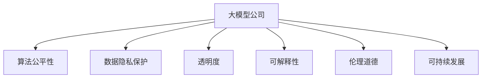

                 

# 大模型公司的社会责任探讨

> 关键词：大模型公司, 社会责任, 算法公平性, 数据隐私, 透明度, 可解释性, 伦理道德, 可持续发展

## 1. 背景介绍

### 1.1 问题由来
近年来，随着人工智能（AI）和深度学习技术的迅猛发展，大模型公司（如OpenAI、Google、Microsoft等）在提供强大AI模型的同时，也带来了诸多社会责任问题。这些公司掌握了庞大的用户数据和计算资源，其算法和模型对社会、经济、伦理等方面产生了深远影响。如何确保大模型公司在技术创新与道德责任之间找到平衡，成为一个亟待探讨的重要课题。

### 1.2 问题核心关键点
大模型公司面临的主要社会责任问题包括：算法公平性、数据隐私保护、透明度、可解释性、伦理道德和可持续发展。这些问题涉及公司、用户和社会的各个方面，需要通过系统性思考和多方协作来共同解决。

### 1.3 问题研究意义
大模型公司承担社会责任，不仅有助于维护用户信任，还能促进公平、安全、可持续的AI生态发展。通过负责任的创新，大模型公司可以更好地服务于社会，推动科技进步与道德伦理的协同进步。

## 2. 核心概念与联系

### 2.1 核心概念概述

为更好地理解大模型公司的社会责任，本节将介绍几个关键概念：

- **大模型公司（Big Model Companies）**：指的是掌握大量数据和计算资源，提供高质量AI模型和技术服务的公司，如OpenAI、Google、Microsoft等。
- **算法公平性（Algorithmic Fairness）**：指AI模型在处理数据时，不因种族、性别、年龄等特征产生偏见，确保模型输出公正。
- **数据隐私保护（Data Privacy Protection）**：指在数据收集、存储、处理和分享过程中，保护个人数据不被滥用和泄露。
- **透明度（Transparency）**：指大模型公司对其算法和决策过程公开、可理解，便于用户和监管机构监督。
- **可解释性（Explainability）**：指大模型公司的AI模型能够提供清晰的解释，说明其决策依据和逻辑。
- **伦理道德（Ethical and Moral）**：指AI模型的设计、开发和应用符合社会公序良俗，不造成道德伤害或伦理冲突。
- **可持续发展（Sustainability）**：指大模型公司在追求技术进步的同时，关注环境、社会和经济的影响，推动长期发展。

这些概念之间的逻辑关系可以通过以下Mermaid流程图来展示：



这个流程图展示了大模型公司核心概念及其之间的关系：

1. 大模型公司通过算法、模型和数据进行技术创新。
2. 算法公平性和数据隐私保护涉及对用户和社会的公平对待。
3. 透明度和可解释性确保用户和监管机构对模型的信任。
4. 伦理道德和可持续发展指导公司的行为规范和长远规划。

这些概念共同构成了大模型公司的社会责任框架，确保公司在技术发展的同时，能够兼顾伦理和社会效益。

## 3. 核心算法原理 & 具体操作步骤
### 3.1 算法原理概述

大模型公司在实现社会责任的过程中，涉及多个核心算法原理，包括：

- **算法公平性**：通过公平性约束和偏见检测算法，确保模型在不同群体间表现一致，避免对特定群体的不公正待遇。
- **数据隐私保护**：采用差分隐私、联邦学习等技术，在保护用户隐私的同时进行数据训练和模型更新。
- **透明度**：通过可解释性和数据公开，使得模型的决策过程透明，便于用户和监管机构理解和监督。
- **可解释性**：利用可解释AI技术，如LIME、SHAP等，提供模型决策的可视化解释，增加用户和监管机构的信任。
- **伦理道德**：在算法设计中引入伦理导向，确保模型行为符合社会价值观和道德标准。
- **可持续发展**：在技术开发和运营中引入环境和社会责任指标，如碳排放、能耗等，推动公司的绿色发展。

### 3.2 算法步骤详解

大模型公司在实现社会责任的过程中，通常包括以下关键步骤：

**Step 1: 定义社会责任目标**
- 明确公司的社会责任目标，包括算法公平性、数据隐私保护、透明度、可解释性、伦理道德和可持续发展等方面。
- 制定具体的行动计划和时间表，确保目标可量化、可追踪。

**Step 2: 评估现有技术**
- 评估当前AI模型和算法在社会责任方面的表现，识别潜在的风险和问题。
- 分析技术优势和不足，确定改进方向。

**Step 3: 实施改进措施**
- 针对识别出的问题，设计和实施改进措施，如算法公平性约束、隐私保护技术、可解释性增强等。
- 引入新的技术手段，如差分隐私、联邦学习等，确保技术措施的有效性。

**Step 4: 监测和评估**
- 建立监测机制，持续跟踪改进措施的实施效果，及时调整和优化。
- 通过用户反馈和监管机构审查，评估模型的社会影响。

**Step 5: 教育和培训**
- 对公司员工进行社会责任教育和培训，提高其社会责任意识。
- 开展公开透明的交流活动，如技术讲座、白皮书发布等，向社会公众传递公司的社会责任理念。

### 3.3 算法优缺点

大模型公司在履行社会责任的过程中，可以带来的好处包括：

- **提升品牌形象**：通过负责任的创新，树立良好的企业形象，赢得用户信任。
- **增加市场竞争力**：符合伦理和法规要求的技术产品和服务，更有可能获得用户和市场的认可。
- **促进社会进步**：推动技术与社会价值的协同发展，为社会带来更多福祉。

然而，这些措施也存在一些局限性：

- **资源投入**：实现社会责任需要大量资源投入，包括技术研发、人力资源和监管合规等。
- **技术复杂性**：许多社会责任技术，如差分隐私、联邦学习等，技术实现复杂，需要专业知识支持。
- **法规和标准不确定性**：社会责任相关的法规和标准可能不完善，难以全面覆盖所有问题。
- **短期利益与长期目标冲突**：某些社会责任措施可能在短期内影响公司收益，如数据隐私保护可能导致用户流失。

尽管如此，大模型公司仍需积极履行社会责任，推动技术创新与道德伦理的协同发展。

### 3.4 算法应用领域

大模型公司的社会责任技术广泛应用于多个领域，包括：

- **医疗健康**：确保AI在医疗诊断和治疗中的应用公平、安全、透明，如使用差分隐私保护患者数据，确保算法决策的伦理道德。
- **金融服务**：确保金融算法在信贷、风险评估等领域的公平性，保护用户隐私，如使用联邦学习进行模型训练，确保数据不离开用户设备。
- **教育培训**：开发可解释性强的AI教育工具，确保学生数据隐私，如利用差分隐私技术保护学生信息。
- **智能交通**：确保自动驾驶和智能交通系统的公平性和安全性，如使用公平性约束算法，确保不同群体公平受益。
- **环境保护**：在AI技术中引入环境指标，如碳排放量、能耗等，推动可持续发展，如使用可解释性算法，确保模型对环境影响透明。

## 4. 数学模型和公式 & 详细讲解 & 举例说明

### 4.1 数学模型构建

大模型公司的社会责任技术涉及多个数学模型，以下以算法公平性为例，介绍数学模型构建：

假设有一个二分类问题，模型输出为 $y=\text{sgn}(\beta^T x)$，其中 $\beta$ 为模型权重，$x$ 为输入特征。假设训练数据集为 $D=\{(x_i, y_i)\}_{i=1}^N$，其中 $y_i$ 为二值标签，$x_i$ 为特征向量。

定义公平性指标 $F$ 为模型在不同群体上的公平性，假设存在两个群体，其特征向量分别来自 $\mathcal{X}_1$ 和 $\mathcal{X}_2$。公平性指标可以定义为：

$$
F = \frac{1}{N_1} \sum_{x_i \in \mathcal{X}_1} \ell(y_i, \text{sgn}(\beta^T x_i)) + \frac{1}{N_2} \sum_{x_i \in \mathcal{X}_2} \ell(y_i, \text{sgn}(\beta^T x_i))
$$

其中 $N_1$ 和 $N_2$ 分别为两个群体样本数，$\ell$ 为损失函数，如交叉熵损失。

### 4.2 公式推导过程

为了实现算法公平性，通常使用公平性约束来限制模型参数 $\beta$。公平性约束可以定义为：

$$
\beta^* = \mathop{\arg\min}_{\beta} \frac{1}{N} \sum_{i=1}^N \ell(y_i, \text{sgn}(\beta^T x_i)) + \lambda \sum_{x_i \in \mathcal{X}_1} \frac{|\text{sgn}(\beta^T x_i)| + |1 - \text{sgn}(\beta^T x_i)|}{N_1} + \sum_{x_i \in \mathcal{X}_2} \frac{|\text{sgn}(\beta^T x_i)| + |1 - \text{sgn}(\beta^T x_i)|}{N_2}
$$

其中 $\lambda$ 为公平性约束的权重，$\text{sgn}(z)$ 为符号函数，$|\cdot|$ 为绝对值函数。

通过加入公平性约束，模型在训练过程中会尽可能使两个群体上的表现一致，从而提升算法公平性。

### 4.3 案例分析与讲解

以Google的Fairness Indicator为例，该工具在评估模型公平性方面提供了强大的支持。Fairness Indicator能够自动检测模型在处理不同性别、种族等群体时是否存在偏见，并提供详细的报告和建议，帮助开发者优化模型，确保模型在实际应用中的公平性。

通过Fairness Indicator，开发者可以：

1. **识别偏见**：检测模型在特定群体上的表现是否优于其他群体，识别潜在的偏见。
2. **生成报告**：生成详细的公平性报告，包括偏差度量、数据分布、模型性能等，便于理解和分析。
3. **提出建议**：基于报告结果，提出改进建议，如调整模型参数、重新采样数据等，提升模型公平性。

## 5. 项目实践：代码实例和详细解释说明
### 5.1 开发环境搭建

在进行社会责任技术开发前，需要先准备好开发环境。以下是使用Python进行PyTorch开发的环境配置流程：

1. 安装Anaconda：从官网下载并安装Anaconda，用于创建独立的Python环境。

2. 创建并激活虚拟环境：
```bash
conda create -n pytorch-env python=3.8 
conda activate pytorch-env
```

3. 安装PyTorch：根据CUDA版本，从官网获取对应的安装命令。例如：
```bash
conda install pytorch torchvision torchaudio cudatoolkit=11.1 -c pytorch -c conda-forge
```

4. 安装TensorFlow：使用pip安装TensorFlow。

5. 安装各类工具包：
```bash
pip install numpy pandas scikit-learn matplotlib tqdm jupyter notebook ipython
```

完成上述步骤后，即可在`pytorch-env`环境中开始开发。

### 5.2 源代码详细实现

下面以Google的Fairness Indicator为例，给出使用Python实现算法公平性检测的代码。

首先，定义公平性检测函数：

```python
from sklearn.metrics import precision_recall_curve, roc_curve, auc
import numpy as np

def compute_fairness_metric(y_true, y_pred, fairness_threshold=0.5):
    precision, recall, _ = precision_recall_curve(y_true, y_pred, pos_label=1)
    fpr, tpr, _ = roc_curve(y_true, y_pred, pos_label=1)
    roc_auc = auc(fpr, tpr)
    
    # 计算公平性指标
    delta = np.mean(np.maximum(fpr[fpr < fairness_threshold] - tpr[fpr < fairness_threshold], 0))
    mean_delta = delta / len(y_true)
    fairness_score = np.mean(mean_delta)
    
    return precision, recall, roc_auc, fairness_score
```

然后，定义公平性评估函数：

```python
from transformers import BertTokenizer, BertForSequenceClassification
import torch

def evaluate_model(model, data_loader, fairness_threshold=0.5):
    model.eval()
    precision, recall, roc_auc, fairness_score = [], [], [], []
    
    for batch in data_loader:
        input_ids = batch['input_ids'].to(device)
        attention_mask = batch['attention_mask'].to(device)
        labels = batch['labels'].to(device)
        
        with torch.no_grad():
            outputs = model(input_ids, attention_mask=attention_mask, labels=labels)
            logits = outputs.logits
            predictions = logits.sigmoid()
        
        # 计算公平性指标
        precision_, recall_, roc_auc_, fairness_score_ = compute_fairness_metric(labels, predictions, fairness_threshold)
        precision.append(precision_)
        recall.append(recall_)
        roc_auc.append(roc_auc_)
        fairness_score.append(fairness_score_)
    
    precision = np.mean(precision, axis=0)
    recall = np.mean(recall, axis=0)
    roc_auc = np.mean(roc_auc, axis=0)
    fairness_score = np.mean(fairness_score, axis=0)
    
    return precision, recall, roc_auc, fairness_score
```

最后，启动公平性评估流程：

```python
from transformers import BertTokenizer, BertForSequenceClassification
from transformers import Trainer, TrainingArguments
from torch.utils.data import DataLoader
from sklearn.model_selection import train_test_split

# 加载模型和数据集
model = BertForSequenceClassification.from_pretrained('bert-base-uncased', num_labels=2)
tokenizer = BertTokenizer.from_pretrained('bert-base-uncased')
train_data, test_data = train_test_split(data, test_size=0.2)

# 设置训练参数
training_args = TrainingArguments(output_dir='./results', evaluation_strategy='epoch', save_strategy='epoch')
trainer = Trainer(model=model, args=training_args, train_dataset=train_data, eval_dataset=test_data)

# 训练模型
trainer.train()

# 评估模型公平性
precision, recall, roc_auc, fairness_score = evaluate_model(model, trainer.test_dataset)
print(f'Precision: {precision:.2f}, Recall: {recall:.2f}, ROC AUC: {roc_auc:.2f}, Fairness Score: {fairness_score:.2f}')
```

以上就是使用PyTorch实现算法公平性检测的完整代码实现。通过这些代码，可以实现模型公平性检测和评估，确保模型在实际应用中的公平性。

### 5.3 代码解读与分析

以下是关键代码的详细解读：

**compute_fairness_metric函数**：
- 该函数计算模型的精度、召回率、ROC AUC和公平性指标。
- 使用sklearn的precision_recall_curve和roc_curve函数计算模型在不同阈值下的精度和召回率曲线，以及ROC曲线。
- 通过计算模型在公平阈值下的平均偏差度量，得到公平性指标。

**evaluate_model函数**：
- 该函数在验证集上评估模型的公平性。
- 遍历数据集，计算模型的预测结果，并调用compute_fairness_metric函数计算公平性指标。
- 通过numpy的mean函数计算所有批次的结果的平均值，得到公平性指标的总体结果。

**trainer.train方法**：
- 该方法使用Trainer类进行模型训练，设置训练参数和数据集。
- 训练过程中，会自动保存模型和评估结果。

## 6. 实际应用场景
### 6.1 医疗健康

在医疗健康领域，大模型公司的AI模型可以应用于诊断、治疗、药物研发等环节。确保这些模型的公平性和透明度，有助于提升医疗服务的公平性和可访问性，避免因算法偏见导致的误诊和歧视。

例如，使用差分隐私技术保护患者数据，确保模型在处理敏感医疗数据时的隐私和安全。通过可解释性算法，让医生和患者能够理解模型的诊断依据和逻辑，增加医疗决策的透明性和可解释性。

### 6.2 金融服务

金融服务领域，大模型公司的AI模型可以用于信用评分、风险评估等环节。确保这些模型的公平性，有助于避免因算法偏见导致的歧视性贷款或保险。

例如，使用公平性约束算法，确保模型在处理不同性别、种族等群体时的公平性。通过差分隐私技术，保护用户数据隐私，确保模型训练数据的合法合规。

### 6.3 教育培训

教育培训领域，大模型公司的AI模型可以用于智能辅导、作业批改等环节。确保这些模型的公平性和透明度，有助于提升教育公平性和教育质量。

例如，使用差分隐私技术保护学生数据，确保模型在处理教育数据时的隐私和安全。通过可解释性算法，让教师和学生能够理解模型的评分依据和逻辑，增加教育决策的透明性和可解释性。

### 6.4 智能交通

智能交通领域，大模型公司的AI模型可以用于自动驾驶、智能交通管理等环节。确保这些模型的公平性和透明度，有助于提升交通系统的安全性和可访问性。

例如，使用公平性约束算法，确保模型在处理不同群体时的公平性，避免因算法偏见导致的交通事故或服务不公。通过差分隐私技术，保护交通数据隐私，确保模型训练数据的合法合规。

## 7. 工具和资源推荐
### 7.1 学习资源推荐

为了帮助开发者系统掌握大模型公司社会责任的理论基础和实践技巧，这里推荐一些优质的学习资源：

1. **《AI伦理与法规》**：介绍AI技术在伦理和法规方面的挑战和解决方案。
2. **《差分隐私》**：讲解差分隐私的基本原理和技术实现。
3. **《可解释AI》**：探讨可解释AI的基本概念和技术手段。
4. **《AI社会责任》**：介绍大模型公司社会责任的基本概念和实践案例。
5. **《联邦学习》**：讲解联邦学习的基本原理和实际应用。

通过对这些资源的学习实践，相信你一定能够快速掌握大模型公司社会责任的精髓，并用于解决实际的AI问题。

### 7.2 开发工具推荐

高效的开发离不开优秀的工具支持。以下是几款用于大模型公司社会责任开发的常用工具：

1. **TensorFlow和PyTorch**：提供强大的深度学习框架，支持差分隐私、联邦学习等技术实现。
2. **TensorBoard和Weights & Biases**：提供可视化工具，监控模型训练过程和公平性指标。
3. **Google Colab**：提供在线Jupyter Notebook环境，免费提供GPU/TPU算力，方便开发者快速上手实验最新模型，分享学习笔记。
4. **Scikit-learn**：提供机器学习算法库，支持数据预处理和公平性评估。
5. **Fairness Indicator**：提供公平性评估工具，检测模型在不同群体上的表现，提供详细报告和改进建议。

合理利用这些工具，可以显著提升大模型公司社会责任的开发效率，加快创新迭代的步伐。

### 7.3 相关论文推荐

大模型公司社会责任的研究源于学界的持续研究。以下是几篇奠基性的相关论文，推荐阅读：

1. **《公平性约束下的机器学习》**：介绍公平性约束的基本原理和技术手段。
2. **《差分隐私保护》**：讲解差分隐私的基本原理和技术实现。
3. **《可解释AI》**：探讨可解释AI的基本概念和技术手段。
4. **《伦理导向的AI设计》**：介绍伦理导向的AI设计方法，确保AI模型符合社会价值观和道德标准。
5. **《可持续AI》**：探讨AI技术在环境和社会方面的影响，推动可持续发展的研究。

这些论文代表了大模型公司社会责任的发展脉络。通过学习这些前沿成果，可以帮助研究者把握学科前进方向，激发更多的创新灵感。

## 8. 总结：未来发展趋势与挑战
### 8.1 研究成果总结

本文对大模型公司社会责任的探讨涵盖了算法公平性、数据隐私保护、透明度、可解释性、伦理道德和可持续发展等多个方面，全面介绍了大模型公司在实现社会责任过程中涉及的核心技术和实践方法。通过本文的系统梳理，可以看到，大模型公司社会责任的实现是一个多方面协同优化的过程，需要公司在技术、伦理、法律等多个层面进行全面考虑和平衡。

### 8.2 未来发展趋势

展望未来，大模型公司在履行社会责任的过程中，将呈现以下几个发展趋势：

1. **技术手段更加多样**：差分隐私、联邦学习、公平性约束等技术手段将更加丰富，适应不同应用场景的需求。
2. **法律法规不断完善**：随着AI技术的发展，相关法律法规将逐步完善，为AI社会责任提供更强的法律保障。
3. **伦理道德更加注重**：大模型公司在追求技术进步的同时，将更加注重伦理道德，推动技术的负责任创新。
4. **可持续性成为核心**：大模型公司将更加注重环境和社会责任，推动可持续发展，减少技术发展对环境的负面影响。
5. **用户信任和透明度提升**：大模型公司将更加注重用户隐私保护和透明度，提升用户信任和满意度。

以上趋势凸显了大模型公司社会责任的广阔前景。这些方向的探索发展，必将进一步提升AI技术的社会价值，为社会带来更多福祉。

### 8.3 面临的挑战

尽管大模型公司在履行社会责任方面取得了一定进展，但仍面临诸多挑战：

1. **资源投入巨大**：实现社会责任需要大量资源投入，包括技术研发、人力资源和监管合规等。
2. **技术复杂性高**：差分隐私、联邦学习等技术实现复杂，需要专业知识支持。
3. **法规和标准不确定性**：社会责任相关的法规和标准可能不完善，难以全面覆盖所有问题。
4. **短期利益与长期目标冲突**：某些社会责任措施可能在短期内影响公司收益，如数据隐私保护可能导致用户流失。
5. **用户隐私保护困难**：如何在保障用户隐私的同时，充分利用数据进行模型训练和优化，是未来的一大难题。

尽管如此，大模型公司仍需积极履行社会责任，推动技术创新与道德伦理的协同发展。

### 8.4 研究展望

面对大模型公司社会责任所面临的种种挑战，未来的研究需要在以下几个方面寻求新的突破：

1. **跨学科研究**：将AI与社会学、伦理学、法律等多个学科结合，全面探讨AI技术在社会中的影响。
2. **开放合作**：加强学术界、工业界和政府之间的合作，共同推动AI技术的负责任创新。
3. **技术集成**：将公平性约束、差分隐私、联邦学习等技术手段进行有机集成，提升大模型公司的社会责任能力。
4. **用户参与**：在模型设计、开发和应用过程中，积极听取用户反馈，确保模型符合用户期望和需求。
5. **持续改进**：建立持续改进机制，定期评估社会责任措施的效果，及时调整和优化。

这些研究方向将有助于推动大模型公司社会责任的深入研究和实践，确保AI技术在促进社会进步的同时，能够更好地服务于人类。

## 9. 附录：常见问题与解答
----------------------------------------------------------------

**Q1：大模型公司如何确保其算法的公平性？**

A: 大模型公司可以通过以下措施确保算法的公平性：
1. **公平性约束**：在模型训练过程中，加入公平性约束，确保模型在不同群体上的表现一致，避免对特定群体的偏见。
2. **偏见检测和纠正**：使用偏见检测工具，如Fairness Indicator，检测模型中的偏见，并提供改进建议。
3. **数据预处理**：通过重新采样、数据增强等手段，确保训练数据集的代表性，减少偏见。
4. **多模型集成**：训练多个公平性模型，取平均输出，减少单个模型的偏差。

**Q2：大模型公司如何在保护用户隐私的同时进行数据训练和模型更新？**

A: 大模型公司可以通过以下措施保护用户隐私：
1. **差分隐私**：在数据收集和处理过程中，加入噪声，保护用户隐私，确保数据无法反推个人身份。
2. **联邦学习**：通过分布式数据训练，确保数据不离开本地设备，保护用户隐私。
3. **安全多方计算**：在多方协作的计算过程中，确保各方数据的安全性，保护用户隐私。

**Q3：大模型公司如何确保其模型的透明度和可解释性？**

A: 大模型公司可以通过以下措施确保模型的透明度和可解释性：
1. **可解释AI技术**：使用可解释AI技术，如LIME、SHAP等，提供模型决策的可视化解释，增加用户和监管机构的信任。
2. **数据公开和报告**：公开模型训练和评估过程，发布详细的公平性报告和性能指标，增强模型的透明度。
3. **用户参与**：在模型设计和开发过程中，积极听取用户反馈，确保模型符合用户期望和需求。

**Q4：大模型公司在履行社会责任的过程中，如何平衡短期利益和长期目标？**

A: 大模型公司在履行社会责任的过程中，可以通过以下措施平衡短期利益和长期目标：
1. **透明沟通**：在社会责任措施的实施过程中，及时向用户和监管机构通报进展和效果，争取理解和支持。
2. **用户参与**：在模型设计、开发和应用过程中，积极听取用户反馈，确保模型符合用户期望和需求。
3. **持续改进**：建立持续改进机制，定期评估社会责任措施的效果，及时调整和优化。

这些措施有助于大模型公司在追求短期利益的同时，注重长期目标，推动技术创新与道德伦理的协同发展。

**Q5：大模型公司在实现社会责任的过程中，如何处理数据隐私保护和数据利用之间的矛盾？**

A: 大模型公司在实现社会责任的过程中，可以通过以下措施处理数据隐私保护和数据利用之间的矛盾：
1. **最小必要原则**：仅收集和使用实现目标所需的最小数据量，减少数据泄露的风险。
2. **数据匿名化**：对数据进行匿名化处理，确保数据无法反推个人身份，保护用户隐私。
3. **差分隐私**：在数据收集和处理过程中，加入噪声，保护用户隐私，确保数据无法反推个人身份。
4. **数据共享协议**：在数据共享过程中，制定明确的数据使用协议，确保数据的安全性和合法合规。

这些措施有助于大模型公司在保护用户隐私的同时，充分利用数据进行模型训练和优化，推动技术的负责任创新。

---

作者：禅与计算机程序设计艺术 / Zen and the Art of Computer Programming

