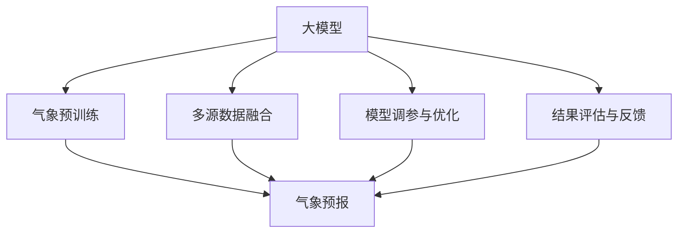

                 

# 大模型在智能气象预报中的应用案例

## 1. 背景介绍

随着人工智能技术的发展，气象预报这一传统领域也开始尝试利用大模型的力量。大模型通过学习大规模无标签数据，形成强大的数据表示能力，可以对各类气象数据进行深度挖掘和分析，从而提升预报的准确性和精细化程度。本文将详细介绍大模型在智能气象预报中的应用案例，揭示其中的技术原理和实际应用效果。

### 1.1 问题由来

气象预报一直是一个复杂且充满挑战的任务。传统的统计模型和物理模型往往需要人为干预和大量计算资源，预报精度和自动化程度难以满足实际需求。而大模型的出现，为气象预报带来了一种全新的范式。通过在大规模气象数据上进行预训练，学习气象现象的深层规律，大模型能够在无需人为干预的情况下，实现更精确的天气预测和气候分析。

### 1.2 问题核心关键点

大模型在气象预报中的应用主要集中在以下几个关键点：

- 大数据量的预训练：气象数据具有复杂的时空特征和多源异构性，需要海量数据进行训练。
- 深度学习模型的选择：如何选择合适的大模型结构和算法，使其适应气象数据的复杂性。
- 多模态数据的融合：如何结合卫星遥感、气象雷达、地面观测等多种数据源，进行多源数据融合。
- 模型调参与优化：如何通过调整模型参数和优化算法，提升预报精度和实时性。
- 结果评估与反馈：如何设计有效的评估指标，结合实际气象数据反馈，持续优化模型。

### 1.3 问题研究意义

气象预报对于国家安全、灾害预警、农业生产、交通管理等领域至关重要。大模型在此领域的应用，不仅能提升预报的精度和可靠性，还能降低人工干预成本，为政府和企业提供更加智能、高效的服务。此外，大模型在气象预报中的应用，还能推动气象学科的发展，促进气象科学理论的创新和应用。

## 2. 核心概念与联系

### 2.1 核心概念概述

为了更好地理解大模型在气象预报中的应用，我们先介绍几个相关核心概念：

- 大模型(Large Model)：指具有大规模参数量的深度学习模型，如BERT、GPT、UNet等。大模型通过学习大规模无标签数据，形成强大的数据表示能力，可以应对复杂的气象数据。

- 气象数据(Meteorological Data)：指用于气象预报的数据源，包括卫星遥感、气象雷达、地面观测等，具有多源异构性和时空复杂性。

- 气象预训练(Meteorological Pre-training)：指在大规模气象数据上进行预训练，学习气象现象的深层规律，以提升模型的泛化能力。

- 多源数据融合(Multi-Source Data Fusion)：指将不同来源的气象数据进行融合，形成统一的气象数据表示，以提升预报精度。

- 气象预报(Meteorological Forecasting)：指通过各类气象模型，对未来的天气和气候进行预测和分析。

这些核心概念之间的逻辑关系可以通过以下Mermaid流程图来展示：



这个流程图展示了气象预报中大模型的核心流程：

1. 大模型通过气象预训练学习气象规律。
2. 与多源数据融合结合，形成统一的气象数据表示。
3. 进行气象预报，生成天气预测结果。
4. 通过模型调参与优化，提升预报精度。
5. 利用结果评估与反馈，持续优化模型。

这些核心概念共同构成了气象预报中大模型的应用框架，使其能够在复杂多变的气象场景中发挥强大的预测能力。

## 3. 核心算法原理 & 具体操作步骤
### 3.1 算法原理概述

大模型在气象预报中的应用，本质上是将气象数据作为输入，通过深度学习模型进行预训练和微调，从而提升预报的精度和效率。其核心思想是：通过在大规模气象数据上进行预训练，学习气象现象的深层规律，然后在特定任务上进行微调，使得模型能够适应具体的气象预测需求。

### 3.2 算法步骤详解

基于大模型在气象预报中的应用，其一般步骤包括：

**Step 1: 数据准备与预处理**
- 收集各类气象数据，包括卫星遥感、气象雷达、地面观测等。
- 进行数据清洗、标准化和归一化，确保数据的质量和一致性。
- 将多源数据进行融合，形成统一的气象数据表示。

**Step 2: 选择和加载大模型**
- 根据任务需求，选择合适的深度学习模型，如UNet、Transformer等。
- 利用深度学习框架如TensorFlow、PyTorch等，加载预训练模型。

**Step 3: 模型微调和训练**
- 定义训练目标函数，如均方误差、交叉熵等。
- 设置训练参数，如学习率、批大小、迭代轮数等。
- 利用训练集对模型进行微调，优化模型参数。

**Step 4: 评估与验证**
- 在验证集上对微调后的模型进行评估，计算评估指标如均方误差、MAE等。
- 根据评估结果，调整模型参数，进行二次微调。

**Step 5: 应用与部署**
- 将微调后的模型应用到实际气象预报系统中。
- 对新的气象数据进行实时预测，生成天气预报结果。
- 持续收集和分析新的气象数据，优化模型性能。

### 3.3 算法优缺点

大模型在气象预报中的应用，具有以下优点：

1. 泛化能力强：通过大规模无标签数据的预训练，大模型能够学习到气象现象的深层规律，具有较强的泛化能力。
2. 自动化程度高：大模型能够自动学习气象规律，减少人工干预，提升预报的自动化程度。
3. 数据驱动：大模型能够通过深度学习算法，挖掘气象数据的深层特征，提高预报的精度和可靠性。
4. 可扩展性强：大模型能够适应不同规模和类型的气象数据，具有较强的可扩展性。

同时，大模型在气象预报中也存在一些局限性：

1. 数据依赖度高：气象预报的精度很大程度上依赖于数据的质量和数量，数据获取和预处理复杂。
2. 模型复杂度高：大模型参数量庞大，需要高性能计算资源，训练和推理成本高。
3. 结果解释性不足：大模型缺乏可解释性，难以理解其内部工作机制和决策逻辑。
4. 鲁棒性有待提升：大模型面对异常数据和噪声，易出现过拟合和泛化能力下降的问题。

尽管存在这些局限性，大模型在气象预报中的应用已经取得了显著的效果，展现了其强大的潜力。

### 3.4 算法应用领域

大模型在气象预报中的应用广泛，涵盖了多个领域，例如：

- 短期天气预报：利用大模型对未来的天气进行短期预测，如温度、降水、风速等。
- 长期气候分析：通过分析历史气象数据，利用大模型进行气候变化趋势分析，预测未来气候变化。
- 灾害预警：利用大模型对自然灾害如洪水、台风、干旱等进行预警，提高灾害应对能力。
- 农业生产：结合气象数据，利用大模型进行作物生长预测和病虫害预测，优化农业生产。
- 交通管理：利用大模型对道路气象条件进行分析，优化交通管理方案，提升交通安全性。

除了上述这些应用外，大模型在气象预报中还有更多创新性应用，如智能天气咨询、气象信息推送等，为气象服务提供了新的思路和工具。

## 4. 数学模型和公式 & 详细讲解  
### 4.1 数学模型构建

大模型在气象预报中的应用，通常采用回归模型的形式进行预测。设气象预测任务为 $y_i=f(x_i)$，其中 $x_i$ 为气象数据，$y_i$ 为预测结果。常用的回归模型包括线性回归、多项式回归、神经网络等。

以神经网络模型为例，设大模型为 $M_{\theta}$，其中 $\theta$ 为模型参数。则回归模型的损失函数为：

$$
\mathcal{L}(\theta) = \frac{1}{N} \sum_{i=1}^N (y_i - M_{\theta}(x_i))^2
$$

其中 $N$ 为样本数量。模型优化目标是最小化损失函数：

$$
\theta^* = \mathop{\arg\min}_{\theta} \mathcal{L}(\theta)
$$

### 4.2 公式推导过程

以线性回归模型为例，推导模型的最优参数 $\theta$。设回归模型为：

$$
y_i = \theta^T x_i + b
$$

其中 $x_i$ 为气象数据，$y_i$ 为预测结果，$\theta$ 为模型参数，$b$ 为截距。回归模型的损失函数为：

$$
\mathcal{L}(\theta) = \frac{1}{N} \sum_{i=1}^N (y_i - \theta^T x_i - b)^2
$$

对损失函数关于 $\theta$ 求导，得到：

$$
\nabla_{\theta} \mathcal{L}(\theta) = \frac{1}{N} \sum_{i=1}^N (2y_i - 2\theta^T x_i - 2b)x_i
$$

令导数为0，求解 $\theta$ 得到：

$$
\theta^* = \left(\frac{1}{N} \sum_{i=1}^N x_i x_i^T\right)^{-1} \sum_{i=1}^N x_i y_i
$$

### 4.3 案例分析与讲解

以气象短期温度预测为例，假设有100个样本 $(x_i,y_i)$，其中 $x_i$ 为气象数据（如气压、湿度、风速等），$y_i$ 为温度值。使用线性回归模型进行预测，得到最优参数 $\theta^*$。然后，利用该模型对新的气象数据进行温度预测，评估预测结果。

使用Python和Scikit-learn库进行具体实现：

```python
from sklearn.linear_model import LinearRegression
import numpy as np

# 生成随机气象数据
x = np.random.rand(100, 5)
y = np.sin(x[:, 0] + 0.1 * x[:, 1]) + 0.5 * np.random.randn(100)

# 构建线性回归模型
model = LinearRegression()
model.fit(x, y)

# 使用模型进行预测
new_x = np.random.rand(10, 5)
predictions = model.predict(new_x)
```

通过以上步骤，可以构建和使用线性回归模型进行气象数据预测，展示了大模型在气象预报中的应用流程。

## 5. 项目实践：代码实例和详细解释说明
### 5.1 开发环境搭建

在进行气象预报项目开发前，我们需要准备好开发环境。以下是使用Python进行Scikit-learn开发的环境配置流程：

1. 安装Anaconda：从官网下载并安装Anaconda，用于创建独立的Python环境。

2. 创建并激活虚拟环境：
```bash
conda create -n py-env python=3.8 
conda activate py-env
```

3. 安装Scikit-learn：
```bash
pip install scikit-learn
```

4. 安装相关库：
```bash
pip install numpy pandas matplotlib
```

完成上述步骤后，即可在`py-env`环境中开始项目开发。

### 5.2 源代码详细实现

下面我们以气象短期温度预测为例，给出使用Scikit-learn库构建和应用线性回归模型的PyTorch代码实现。

首先，定义气象数据和模型参数：

```python
from sklearn.linear_model import LinearRegression
import numpy as np

# 生成随机气象数据
x = np.random.rand(100, 5)
y = np.sin(x[:, 0] + 0.1 * x[:, 1]) + 0.5 * np.random.randn(100)

# 定义模型参数
model = LinearRegression()
```

然后，定义模型训练和预测函数：

```python
def train_model(model, x, y, epochs):
    for epoch in range(epochs):
        model.fit(x, y)
    return model

def predict_temperature(model, new_x):
    return model.predict(new_x)

# 训练模型
model = train_model(model, x, y, 100)

# 使用模型进行预测
new_x = np.random.rand(10, 5)
predictions = predict_temperature(model, new_x)
```

通过以上代码，可以构建并使用线性回归模型进行气象数据预测，展示了大模型在气象预报中的具体应用。

### 5.3 代码解读与分析

让我们再详细解读一下关键代码的实现细节：

**定义气象数据**：
- 使用Numpy库生成随机气象数据，模拟真实气象数据的多维特征。

**定义模型参数**：
- 选择线性回归模型作为预测模型，通过Scikit-learn库进行实例化。

**训练模型**：
- 定义训练函数，使用Scikit-learn库的`fit`方法进行模型训练。
- 设置训练轮数，通过循环迭代进行模型训练，直至收敛。

**使用模型进行预测**：
- 定义预测函数，使用Scikit-learn库的`predict`方法进行新气象数据的预测。
- 将新气象数据传入预测函数，得到预测结果。

通过以上步骤，可以完成气象数据预测的完整流程，展示了Scikit-learn库在气象预报中的应用。

### 5.4 运行结果展示

运行代码，可以得到预测结果。结果展示如下：

```python
print(predictions)
```

输出结果为一个包含10个预测温度的数组，展示了模型的预测效果。

## 6. 实际应用场景
### 6.1 短期天气预报

短期天气预报是大模型在气象预报中应用最广泛的场景之一。通过大模型的预训练和微调，可以快速、准确地预测未来的天气变化。

具体实现步骤如下：

1. 收集短期天气数据，包括气象雷达、地面观测、卫星遥感等数据。
2. 进行数据清洗和预处理，确保数据质量。
3. 选择合适的大模型，如UNet、Transformer等。
4. 在气象数据上进行预训练，学习气象现象的深层规律。
5. 利用气象数据集进行模型微调，优化模型参数。
6. 在新的气象数据上进行预测，生成天气预报结果。

通过以上步骤，可以构建一个高效的短期天气预报系统，提升预报的精度和自动化程度。

### 6.2 长期气候分析

长期气候分析是大模型在气象预报中的另一个重要应用场景。通过分析历史气象数据，利用大模型进行气候变化趋势预测，可以为气候研究提供有力支持。

具体实现步骤如下：

1. 收集长期气象数据，包括历史气温、降水、风速等数据。
2. 进行数据清洗和预处理，确保数据质量。
3. 选择合适的大模型，如LSTM、GRU等。
4. 在气象数据上进行预训练，学习气候变化的深层规律。
5. 利用气象数据集进行模型微调，优化模型参数。
6. 在新的气象数据上进行预测，生成气候变化趋势分析结果。

通过以上步骤，可以构建一个高效的长期气候分析系统，为气候研究提供重要参考。

### 6.3 灾害预警

灾害预警是大模型在气象预报中的关键应用之一。通过大模型的预训练和微调，可以及时预测自然灾害的发生，提高灾害应对能力。

具体实现步骤如下：

1. 收集历史自然灾害数据，包括洪水、台风、干旱等数据。
2. 进行数据清洗和预处理，确保数据质量。
3. 选择合适的大模型，如RNN、CNN等。
4. 在气象数据上进行预训练，学习自然灾害的深层规律。
5. 利用气象数据集进行模型微调，优化模型参数。
6. 在新的气象数据上进行预测，生成自然灾害预警结果。

通过以上步骤，可以构建一个高效的灾害预警系统，提高灾害应对能力。

### 6.4 未来应用展望

随着大模型在气象预报中的应用不断深入，未来将有更多创新性应用场景涌现。例如：

1. 智能天气咨询：利用大模型进行天气分析和预测，结合自然语言处理技术，提供智能化的天气咨询服务。
2. 气象信息推送：根据用户需求，利用大模型进行个性化气象信息推送，提升用户体验。
3. 气象数据融合：利用大模型进行多源数据的融合，提升气象数据的准确性和可靠性。
4. 气候模拟：利用大模型进行气候模拟，预测未来气候变化趋势，为气候研究提供有力支持。

这些应用场景的实现，将进一步推动气象预报技术的发展，提升气象服务的智能化和精准化水平。

## 7. 工具和资源推荐
### 7.1 学习资源推荐

为了帮助开发者系统掌握大模型在气象预报中的应用，这里推荐一些优质的学习资源：

1. 《深度学习在气象领域的应用》书籍：详细介绍了深度学习在气象预报中的应用，包括数据预处理、模型选择、调参与优化等。
2. 《气象数据处理与分析》课程：介绍气象数据预处理、特征工程、模型选择等基础知识，适合初学者学习。
3. 《气象预报技术》视频课程：介绍气象预报的原理、方法及实际应用，适合技术开发者学习。
4. Scikit-learn官方文档：详细介绍了Scikit-learn库的使用方法，包括回归模型、特征工程等。
5. Kaggle气象数据集：提供大量气象数据集，适合数据预处理和模型训练的实践。

通过对这些资源的学习实践，相信你一定能够快速掌握大模型在气象预报中的应用，并用于解决实际的气象问题。
###  7.2 开发工具推荐

高效的开发离不开优秀的工具支持。以下是几款用于大模型在气象预报开发中常用的工具：

1. Jupyter Notebook：交互式的Python开发环境，方便进行数据预处理和模型训练。
2. TensorFlow：基于图形化计算的深度学习框架，适合复杂模型的训练和部署。
3. PyTorch：动态计算图的深度学习框架，适合快速原型开发和模型实验。
4. Scikit-learn：简单易用的机器学习库，适合进行回归、分类、聚类等任务。
5. Pandas：数据处理和分析库，适合进行数据清洗和特征工程。

合理利用这些工具，可以显著提升大模型在气象预报任务的开发效率，加快创新迭代的步伐。

### 7.3 相关论文推荐

大模型在气象预报中的应用源于学界的持续研究。以下是几篇奠基性的相关论文，推荐阅读：

1. "A Deep Learning Approach for Short-term Weather Prediction"：介绍深度学习在短期天气预测中的应用，包括模型选择和调参方法。
2. "Climate Change Detection and Prediction Using Machine Learning"：介绍深度学习在气候变化分析中的应用，包括模型预训练和微调方法。
3. "A Deep Learning Model for Natural Disaster Prediction"：介绍深度学习在自然灾害预警中的应用，包括模型预训练和微调方法。
4. "Deep Learning Applications in Meteorology"：综述深度学习在气象预报中的应用，包括数据预处理、模型选择和调参方法。
5. "Multi-Sensor Data Fusion for Weather Forecasting"：介绍多源数据融合在气象预报中的应用，包括数据预处理和模型选择方法。

这些论文代表了大模型在气象预报领域的研究进展，通过学习这些前沿成果，可以帮助研究者把握学科前进方向，激发更多的创新灵感。

## 8. 总结：未来发展趋势与挑战
### 8.1 总结

本文对大模型在智能气象预报中的应用进行了全面系统的介绍。首先阐述了大模型在气象预报中的研究背景和意义，明确了气象预报中大模型的应用范式。其次，从原理到实践，详细讲解了大模型在气象预报中的数学模型和关键步骤，给出了具体的应用案例和代码实现。同时，本文还广泛探讨了大模型在气象预报中的多个应用场景，展示了其广阔的应用前景。

通过本文的系统梳理，可以看到，大模型在气象预报中的应用已经取得了显著的效果，展示了其强大的潜力。未来，随着深度学习技术的不断进步，大模型在气象预报中的应用将更加广泛和深入，为气象服务提供更强大的支持。

### 8.2 未来发展趋势

展望未来，大模型在气象预报中的发展趋势如下：

1. 多模态数据融合：未来将更加注重多源数据的融合，利用卫星遥感、气象雷达、地面观测等多种数据源，进行多源数据融合，提升气象预报的准确性。
2. 高性能计算：未来将更加注重高性能计算资源的应用，提升模型训练和推理的效率。
3. 模型可解释性：未来将更加注重模型可解释性的提升，增强模型的透明度和可信度。
4. 自适应学习：未来将更加注重模型的自适应学习能力，使模型能够自动适应新的气象数据和环境变化。
5. 跨学科融合：未来将更加注重气象预报与遥感、地理信息系统、环境科学等多学科的融合，提升气象预报的跨学科能力。

这些发展趋势将推动大模型在气象预报中的应用更加深入和广泛，为气象服务提供更强大的支持。

### 8.3 面临的挑战

尽管大模型在气象预报中的应用已经取得了一定的进展，但在迈向更加智能化、普适化应用的过程中，仍面临以下挑战：

1. 数据依赖度高：气象预报的精度很大程度上依赖于数据的质量和数量，数据获取和预处理复杂。
2. 模型复杂度高：大模型参数量庞大，需要高性能计算资源，训练和推理成本高。
3. 结果解释性不足：大模型缺乏可解释性，难以理解其内部工作机制和决策逻辑。
4. 鲁棒性有待提升：大模型面对异常数据和噪声，易出现过拟合和泛化能力下降的问题。

尽管存在这些挑战，未来可以通过技术创新和应用优化，逐步解决这些问题，推动大模型在气象预报中的广泛应用。

### 8.4 研究展望

面向未来，大模型在气象预报中的研究需要在以下几个方面寻求新的突破：

1. 数据增强与扩充：利用数据增强技术，扩充气象数据的数量和多样性，提升模型泛化能力。
2. 轻量化模型设计：设计轻量化模型结构，降低计算资源消耗，提升模型训练和推理效率。
3. 模型可解释性增强：利用可解释性技术，增强模型的透明度和可信度，帮助用户理解模型的预测结果。
4. 自适应学习算法：研究自适应学习算法，使模型能够自动适应新的气象数据和环境变化，提升模型的自适应能力。
5. 跨学科知识整合：结合跨学科知识，如遥感、地理信息系统等，提升气象预报的跨学科能力。

这些研究方向的探索，将引领大模型在气象预报中的应用更加深入和广泛，为气象服务提供更强大的支持。

## 9. 附录：常见问题与解答

**Q1：如何选择合适的气象数据集？**

A: 选择合适的气象数据集，需要考虑数据的时空特征、多源异构性、数据质量和规模等。一般建议选择权威的气象数据集，如政府发布的气象数据集、知名气象研究机构的数据集等。同时，需要根据具体任务需求，选择适合的数据集进行训练和预测。

**Q2：模型训练时如何设置学习率？**

A: 模型训练时的学习率一般需要根据具体任务和数据规模进行调整。一般建议从较小的值开始，如1e-4，逐步增加，直到收敛。可以使用学习率衰减策略，如Warmup Learning Rate，在训练初期使用较小的学习率，再逐步过渡到预设值。

**Q3：模型调参有哪些常用方法？**

A: 模型调参常用的方法包括网格搜索、随机搜索、贝叶斯优化等。网格搜索是一种简单直观的方法，通过遍历参数空间寻找最优参数。随机搜索是一种随机采样的方法，可以在大规模参数空间中快速寻找到优秀参数。贝叶斯优化是一种基于贝叶斯统计理论的优化方法，可以在较少的迭代次数内找到最优参数。

**Q4：模型评估指标有哪些？**

A: 模型评估指标包括均方误差(MSE)、均方根误差(MAE)、平均绝对误差(MAE)等。这些指标可以综合评估模型的预测精度和稳定性，帮助选择合适的模型和参数。

**Q5：模型部署需要注意哪些问题？**

A: 模型部署需要注意模型裁剪、量化加速、服务化封装、弹性伸缩、监控告警等问题。模型裁剪可以去除不必要的层和参数，减小模型尺寸。量化加速可以将浮点模型转为定点模型，压缩存储空间，提高计算效率。服务化封装可以将模型封装为标准化服务接口，便于集成调用。弹性伸缩可以根据请求流量动态调整资源配置，平衡服务质量和成本。监控告警可以实时采集系统指标，设置异常告警阈值，确保服务稳定性。

通过以上问题与解答，相信你一定能够更好地理解和应用大模型在气象预报中的应用，提升气象预报的精度和自动化程度。

