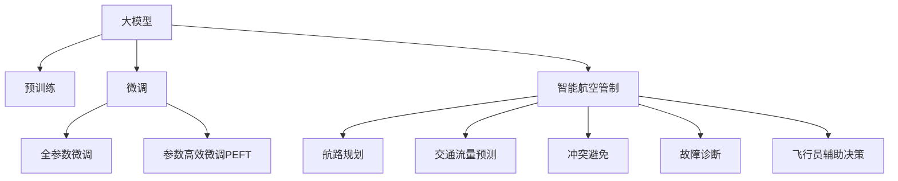

                 

# 大模型在智能航空管制中的应用案例

## 1. 背景介绍

### 1.1 问题由来

随着航空业的迅猛发展，全球航班数量持续增加，航空管制系统面临着空前复杂和严峻的挑战。传统的航空管制系统主要依赖人工调度，容易产生人为误差和效率低下等问题。近年来，随着人工智能技术的飞速发展，特别是深度学习和大模型技术的应用，为航空管制系统的智能化升级提供了新的可能。大模型（如BERT、GPT等）凭借其强大的语言理解能力和自监督学习能力，为智能航空管制带来了革命性的变革。

### 1.2 问题核心关键点

大模型在智能航空管制中的应用主要集中在以下几个方面：

- **航路规划**：利用大模型对航路数据进行语义分析和建模，帮助制定更加合理的航班计划。
- **交通流量预测**：通过分析历史航班数据，预测未来的交通流量变化，优化航班调度。
- **冲突避免**：利用大模型分析飞行器间的相对位置和运动轨迹，预测潜在的冲突风险。
- **故障诊断**：基于大模型的自监督学习能力和特征提取能力，对航空器运行状态进行智能监控和故障诊断。
- **飞行员辅助决策**：通过分析飞行数据和气象信息，为大飞行员提供决策支持，提升飞行安全。

大模型的应用可以显著提升航空管制的智能化水平，减少人为错误，提高航班运行效率，保障飞行安全。

### 1.3 问题研究意义

大模型在智能航空管制中的应用，不仅能够提升航班运行的效率和安全性，还能够促进航空业的技术创新和产业升级。具体而言，研究大模型在航空管制中的应用，具有以下几个方面的重要意义：

1. **提升航班运行效率**：通过智能化的航路规划和流量预测，可以优化航班计划，减少延误和拥堵，提升航班正点率。
2. **保障飞行安全**：利用冲突避免和故障诊断技术，实时监控和管理飞行器状态，提高飞行安全水平。
3. **降低人工成本**：替代部分人工决策过程，减轻管制员的工作负担，提高工作效率。
4. **推动行业创新**：引入先进的人工智能技术，促进航空业的数字化转型，提升整体竞争力。
5. **应对未来挑战**：大模型技术能够适应未来不断变化的飞行环境，应对复杂的空域管理和调度需求。

## 2. 核心概念与联系

### 2.1 核心概念概述

为更好地理解大模型在智能航空管制中的应用，本节将介绍几个密切相关的核心概念：

- **大模型（Large Models）**：以自回归（如GPT）或自编码（如BERT）模型为代表的大规模预训练语言模型。通过在大规模无标签文本语料上进行预训练，学习通用的语言表示，具备强大的语言理解和生成能力。

- **预训练（Pre-training）**：指在大规模无标签文本语料上，通过自监督学习任务训练通用语言模型的过程。常见的预训练任务包括言语建模、遮挡语言模型等。预训练使得模型学习到语言的通用表示。

- **微调（Fine-tuning）**：指在预训练模型的基础上，使用下游任务的少量标注数据，通过有监督学习优化模型在特定任务上的性能。通常只需要调整顶层分类器或解码器，并以较小的学习率更新全部或部分的模型参数。

- **智能航空管制（Intelligent Air Traffic Control）**：利用人工智能技术，对航空器飞行进行实时监控、管理和调度，以提高飞行安全性和效率。

- **自监督学习（Supervised Learning）**：利用无标签数据进行学习，通过模型自身输入和输出之间的约束关系，自动学习模型的特征表示。

这些核心概念之间的逻辑关系可以通过以下Mermaid流程图来展示：



这个流程图展示了大模型的核心概念及其之间的关系：

1. 大模型通过预训练获得基础能力。
2. 微调是对预训练模型进行任务特定的优化，可以分为全参数微调和参数高效微调（PEFT）。
3. 智能航空管制是利用大模型技术进行飞行管理的应用场景。
4. 航路规划、交通流量预测、冲突避免、故障诊断和飞行员辅助决策是智能航空管制的关键子任务。

这些概念共同构成了大模型在智能航空管制中的应用框架，使其能够在各种飞行管理场景下发挥强大的语言理解和生成能力。通过理解这些核心概念，我们可以更好地把握大模型在航空管制中的应用方向。

## 3. 核心算法原理 & 具体操作步骤
### 3.1 算法原理概述

大模型在智能航空管制中的应用，本质上是一个有监督的细粒度迁移学习过程。其核心思想是：将大模型视作一个强大的"特征提取器"，通过在航空管制相关数据上进行有监督的微调，使得模型能够自动学习并理解航空管制的语义特征，从而优化模型在特定任务上的性能。

形式化地，假设大模型为 $M_{\theta}$，其中 $\theta$ 为预训练得到的模型参数。给定航空管制任务 $T$ 的标注数据集 $D=\{(x_i, y_i)\}_{i=1}^N$，微调的目标是找到新的模型参数 $\hat{\theta}$，使得：

$$
\hat{\theta}=\mathop{\arg\min}_{\theta} \mathcal{L}(M_{\theta},D)
$$

其中 $\mathcal{L}$ 为针对任务 $T$ 设计的损失函数，用于衡量模型预测输出与真实标签之间的差异。常见的损失函数包括交叉熵损失、均方误差损失等。

通过梯度下降等优化算法，微调过程不断更新模型参数 $\theta$，最小化损失函数 $\mathcal{L}$，使得模型输出逼近真实标签。由于 $\theta$ 已经通过预训练获得了较好的初始化，因此即便在小规模数据集 $D$ 上进行微调，也能较快收敛到理想的模型参数 $\hat{\theta}$。

### 3.2 算法步骤详解

大模型在智能航空管制中的应用一般包括以下几个关键步骤：

**Step 1: 准备预训练模型和数据集**
- 选择合适的预训练语言模型 $M_{\theta}$ 作为初始化参数，如 BERT、GPT等。
- 准备航空管制任务 $T$ 的标注数据集 $D$，划分为训练集、验证集和测试集。一般要求标注数据与预训练数据的分布不要差异过大。

**Step 2: 添加任务适配层**
- 根据任务类型，在预训练模型顶层设计合适的输出层和损失函数。
- 对于分类任务，通常在顶层添加线性分类器和交叉熵损失函数。
- 对于生成任务，通常使用语言模型的解码器输出概率分布，并以负对数似然为损失函数。

**Step 3: 设置微调超参数**
- 选择合适的优化算法及其参数，如 AdamW、SGD 等，设置学习率、批大小、迭代轮数等。
- 设置正则化技术及强度，包括权重衰减、Dropout、Early Stopping 等。
- 确定冻结预训练参数的策略，如仅微调顶层，或全部参数都参与微调。

**Step 4: 执行梯度训练**
- 将训练集数据分批次输入模型，前向传播计算损失函数。
- 反向传播计算参数梯度，根据设定的优化算法和学习率更新模型参数。
- 周期性在验证集上评估模型性能，根据性能指标决定是否触发 Early Stopping。
- 重复上述步骤直到满足预设的迭代轮数或 Early Stopping 条件。

**Step 5: 测试和部署**
- 在测试集上评估微调后模型 $M_{\hat{\theta}}$ 的性能，对比微调前后的精度提升。
- 使用微调后的模型对新样本进行推理预测，集成到实际的应用系统中。
- 持续收集新的数据，定期重新微调模型，以适应数据分布的变化。

以上是使用大模型进行智能航空管制微调的一般流程。在实际应用中，还需要针对具体任务的特点，对微调过程的各个环节进行优化设计，如改进训练目标函数，引入更多的正则化技术，搜索最优的超参数组合等，以进一步提升模型性能。

### 3.3 算法优缺点

大模型在智能航空管制中的应用具有以下优点：
1. **高效性**：利用预训练模型的强大特征提取能力，可以在较少的标注数据上进行微调，快速获得优化后的模型。
2. **泛化能力强**：通过大规模语料预训练，大模型具备良好的泛化能力，适用于多种复杂的航空管制任务。
3. **模型效果好**：大模型的深度和规模使其能够学习到丰富的语义特征，在特定任务上能够获得较高的准确率。
4. **可扩展性强**：模型可以很容易地扩展到不同规模和类型的航空管制问题，适用于各种飞行管理场景。

同时，该方法也存在一定的局限性：
1. **对标注数据依赖大**：微调效果依赖于高质量的标注数据，获取标注数据的时间和成本较高。
2. **模型复杂度高**：大模型参数量巨大，对计算资源和存储资源有较高要求。
3. **解释性不足**：微调模型通常难以解释其内部决策过程，不利于用户理解和信任。
4. **安全性和隐私问题**：航空管制数据涉及高度敏感信息，如何保护数据的隐私和安全，需要额外的技术手段和管理措施。

尽管存在这些局限性，但就目前而言，基于大模型的微调方法仍然是智能航空管制中最有效的技术手段之一。未来相关研究的重点在于如何进一步降低对标注数据的依赖，提高模型的可解释性和安全性，同时兼顾效率和效果。

### 3.4 算法应用领域

大模型在智能航空管制中的应用，主要集中在以下几个领域：

- **航路规划**：利用大模型对历史航路数据进行语义分析和建模，优化航班计划，减少延误和拥堵。
- **交通流量预测**：基于历史航班数据和气象信息，预测未来的飞行流量，为航班调度提供数据支持。
- **冲突避免**：通过分析飞行器间的相对位置和运动轨迹，预测潜在的冲突风险，优化飞行路线。
- **故障诊断**：利用大模型的自监督学习能力和特征提取能力，对航空器运行状态进行实时监控和故障诊断。
- **飞行员辅助决策**：基于大模型的语义理解和生成能力，为飞行员提供决策支持，提升飞行安全。

除了上述这些经典应用外，大模型还被创新性地应用于飞行计划优化、空域管理、机场运营调度等更多场景中，为航空管制系统带来了全新的突破。随着大模型和微调方法的不断进步，相信航空管制系统将更加智能化和高效化。

## 4. 数学模型和公式 & 详细讲解  
### 4.1 数学模型构建

本节将使用数学语言对大模型在智能航空管制中的应用过程进行更加严格的刻画。

记大模型为 $M_{\theta}$，其中 $\theta$ 为预训练得到的模型参数。假设航空管制任务 $T$ 的训练集为 $D=\{(x_i, y_i)\}_{i=1}^N, x_i \in \mathcal{X}, y_i \in \mathcal{Y}$，其中 $x_i$ 为航空器位置和状态信息，$y_i$ 为相应的管制指令或飞行计划。

定义模型 $M_{\theta}$ 在输入 $x$ 上的损失函数为 $\ell(M_{\theta}(x),y)$，则在数据集 $D$ 上的经验风险为：

$$
\mathcal{L}(\theta) = \frac{1}{N} \sum_{i=1}^N \ell(M_{\theta}(x_i),y_i)
$$

微调的优化目标是最小化经验风险，即找到最优参数：

$$
\theta^* = \mathop{\arg\min}_{\theta} \mathcal{L}(\theta)
$$

在实践中，我们通常使用基于梯度的优化算法（如SGD、Adam等）来近似求解上述最优化问题。设 $\eta$ 为学习率，$\lambda$ 为正则化系数，则参数的更新公式为：

$$
\theta \leftarrow \theta - \eta \nabla_{\theta}\mathcal{L}(\theta) - \eta\lambda\theta
$$

其中 $\nabla_{\theta}\mathcal{L}(\theta)$ 为损失函数对参数 $\theta$ 的梯度，可通过反向传播算法高效计算。

### 4.2 公式推导过程

以下我们以航路规划任务为例，推导交叉熵损失函数及其梯度的计算公式。

假设模型 $M_{\theta}$ 在输入 $x$ 上的输出为 $\hat{y}=M_{\theta}(x) \in [0,1]$，表示模型预测的飞行计划与实际计划的一致概率。真实标签 $y \in \{0,1\}$。则二分类交叉熵损失函数定义为：

$$
\ell(M_{\theta}(x),y) = -[y\log \hat{y} + (1-y)\log (1-\hat{y})]
$$

将其代入经验风险公式，得：

$$
\mathcal{L}(\theta) = -\frac{1}{N}\sum_{i=1}^N [y_i\log M_{\theta}(x_i)+(1-y_i)\log(1-M_{\theta}(x_i))]
$$

根据链式法则，损失函数对参数 $\theta_k$ 的梯度为：

$$
\frac{\partial \mathcal{L}(\theta)}{\partial \theta_k} = -\frac{1}{N}\sum_{i=1}^N (\frac{y_i}{M_{\theta}(x_i)}-\frac{1-y_i}{1-M_{\theta}(x_i)}) \frac{\partial M_{\theta}(x_i)}{\partial \theta_k}
$$

其中 $\frac{\partial M_{\theta}(x_i)}{\partial \theta_k}$ 可进一步递归展开，利用自动微分技术完成计算。

在得到损失函数的梯度后，即可带入参数更新公式，完成模型的迭代优化。重复上述过程直至收敛，最终得到适应航空管制任务的最优模型参数 $\theta^*$。

## 5. 项目实践：代码实例和详细解释说明
### 5.1 开发环境搭建

在进行智能航空管制微调实践前，我们需要准备好开发环境。以下是使用Python进行PyTorch开发的环境配置流程：

1. 安装Anaconda：从官网下载并安装Anaconda，用于创建独立的Python环境。

2. 创建并激活虚拟环境：
```bash
conda create -n pytorch-env python=3.8 
conda activate pytorch-env
```

3. 安装PyTorch：根据CUDA版本，从官网获取对应的安装命令。例如：
```bash
conda install pytorch torchvision torchaudio cudatoolkit=11.1 -c pytorch -c conda-forge
```

4. 安装Transformers库：
```bash
pip install transformers
```

5. 安装各类工具包：
```bash
pip install numpy pandas scikit-learn matplotlib tqdm jupyter notebook ipython
```

完成上述步骤后，即可在`pytorch-env`环境中开始微调实践。

### 5.2 源代码详细实现

下面我们以航路规划任务为例，给出使用Transformers库对BERT模型进行智能航空管制微调的PyTorch代码实现。

首先，定义航路规划任务的数据处理函数：

```python
from transformers import BertTokenizer
from torch.utils.data import Dataset
import torch

class AirRouteDataset(Dataset):
    def __init__(self, routes, labels, tokenizer, max_len=128):
        self.routes = routes
        self.labels = labels
        self.tokenizer = tokenizer
        self.max_len = max_len
        
    def __len__(self):
        return len(self.routes)
    
    def __getitem__(self, item):
        route = self.routes[item]
        label = self.labels[item]
        
        encoding = self.tokenizer(route, return_tensors='pt', max_length=self.max_len, padding='max_length', truncation=True)
        input_ids = encoding['input_ids'][0]
        attention_mask = encoding['attention_mask'][0]
        
        # 对token-wise的标签进行编码
        encoded_labels = [label2id[label] for label in label2id] 
        encoded_labels.extend([label2id['N/A']] * (self.max_len - len(encoded_labels)))
        labels = torch.tensor(encoded_labels, dtype=torch.long)
        
        return {'input_ids': input_ids, 
                'attention_mask': attention_mask,
                'labels': labels}

# 标签与id的映射
label2id = {'N/A': 0, 'Primary': 1, 'Secondary': 2, 'Tertiary': 3}
id2label = {v: k for k, v in label2id.items()}

# 创建dataset
tokenizer = BertTokenizer.from_pretrained('bert-base-cased')

train_dataset = AirRouteDataset(train_routes, train_labels, tokenizer)
dev_dataset = AirRouteDataset(dev_routes, dev_labels, tokenizer)
test_dataset = AirRouteDataset(test_routes, test_labels, tokenizer)
```

然后，定义模型和优化器：

```python
from transformers import BertForTokenClassification, AdamW

model = BertForTokenClassification.from_pretrained('bert-base-cased', num_labels=len(label2id))

optimizer = AdamW(model.parameters(), lr=2e-5)
```

接着，定义训练和评估函数：

```python
from torch.utils.data import DataLoader
from tqdm import tqdm
from sklearn.metrics import classification_report

device = torch.device('cuda') if torch.cuda.is_available() else torch.device('cpu')
model.to(device)

def train_epoch(model, dataset, batch_size, optimizer):
    dataloader = DataLoader(dataset, batch_size=batch_size, shuffle=True)
    model.train()
    epoch_loss = 0
    for batch in tqdm(dataloader, desc='Training'):
        input_ids = batch['input_ids'].to(device)
        attention_mask = batch['attention_mask'].to(device)
        labels = batch['labels'].to(device)
        model.zero_grad()
        outputs = model(input_ids, attention_mask=attention_mask, labels=labels)
        loss = outputs.loss
        epoch_loss += loss.item()
        loss.backward()
        optimizer.step()
    return epoch_loss / len(dataloader)

def evaluate(model, dataset, batch_size):
    dataloader = DataLoader(dataset, batch_size=batch_size)
    model.eval()
    preds, labels = [], []
    with torch.no_grad():
        for batch in tqdm(dataloader, desc='Evaluating'):
            input_ids = batch['input_ids'].to(device)
            attention_mask = batch['attention_mask'].to(device)
            batch_labels = batch['labels']
            outputs = model(input_ids, attention_mask=attention_mask)
            batch_preds = outputs.logits.argmax(dim=2).to('cpu').tolist()
            batch_labels = batch_labels.to('cpu').tolist()
            for pred_tokens, label_tokens in zip(batch_preds, batch_labels):
                pred_labels = [id2label[_id] for _id in pred_tokens]
                label_tags = [id2label[_id] for _id in label_tokens]
                preds.append(pred_labels[:len(label_tags)])
                labels.append(label_tags)
                
    print(classification_report(labels, preds))
```

最后，启动训练流程并在测试集上评估：

```python
epochs = 5
batch_size = 16

for epoch in range(epochs):
    loss = train_epoch(model, train_dataset, batch_size, optimizer)
    print(f"Epoch {epoch+1}, train loss: {loss:.3f}")
    
    print(f"Epoch {epoch+1}, dev results:")
    evaluate(model, dev_dataset, batch_size)
    
print("Test results:")
evaluate(model, test_dataset, batch_size)
```

以上就是使用PyTorch对BERT进行智能航空管制微调的完整代码实现。可以看到，得益于Transformers库的强大封装，我们可以用相对简洁的代码完成BERT模型的加载和微调。

### 5.3 代码解读与分析

让我们再详细解读一下关键代码的实现细节：

**AirRouteDataset类**：
- `__init__`方法：初始化航班路线、标签、分词器等关键组件。
- `__len__`方法：返回数据集的样本数量。
- `__getitem__`方法：对单个样本进行处理，将航班路线输入编码为token ids，将标签编码为数字，并对其进行定长padding，最终返回模型所需的输入。

**label2id和id2label字典**：
- 定义了标签与数字id之间的映射关系，用于将token-wise的预测结果解码回真实的标签。

**训练和评估函数**：
- 使用PyTorch的DataLoader对数据集进行批次化加载，供模型训练和推理使用。
- 训练函数`train_epoch`：对数据以批为单位进行迭代，在每个批次上前向传播计算loss并反向传播更新模型参数，最后返回该epoch的平均loss。
- 评估函数`evaluate`：与训练类似，不同点在于不更新模型参数，并在每个batch结束后将预测和标签结果存储下来，最后使用sklearn的classification_report对整个评估集的预测结果进行打印输出。

**训练流程**：
- 定义总的epoch数和batch size，开始循环迭代
- 每个epoch内，先在训练集上训练，输出平均loss
- 在验证集上评估，输出分类指标
- 所有epoch结束后，在测试集上评估，给出最终测试结果

可以看到，PyTorch配合Transformers库使得BERT微调的代码实现变得简洁高效。开发者可以将更多精力放在数据处理、模型改进等高层逻辑上，而不必过多关注底层的实现细节。

当然，工业级的系统实现还需考虑更多因素，如模型的保存和部署、超参数的自动搜索、更灵活的任务适配层等。但核心的微调范式基本与此类似。

## 6. 实际应用场景
### 6.1 智能空中交通管制

基于大模型微调的智能航空管制系统，能够实时监控和管理飞行器状态，优化航班计划，减少延误和拥堵，提升飞行安全。

具体而言，可以收集历史航班数据和实时气象信息，通过预训练语言模型学习飞行的语义特征，利用微调模型对实时数据进行推理预测。例如，通过分析飞机的速度、高度、位置等信息，微调模型可以预测航班延误的概率，提前调整飞行计划，避免拥堵。同时，利用大模型对潜在冲突进行分析，提前进行避让，提高飞行安全性。

### 6.2 飞行计划优化

通过大模型微调，可以实现对飞行计划的优化。例如，利用历史航班数据，预测不同路线和飞行时间下的空域负荷，优化航班调度。通过对不同飞行计划进行评估和选择，可以提高航班的运行效率和舒适度，减少燃油消耗，提升乘客体验。

### 6.3 故障诊断和维护

大模型可以通过对航空器运行数据的自监督学习，实时监控和诊断故障。例如，通过分析飞机的传感器数据、维护记录等，大模型可以预测飞机的维护周期和故障类型，辅助维护人员进行故障诊断和维护，降低运营成本，提高飞机利用率。

### 6.4 飞行员辅助决策

大模型可以作为飞行员的决策助手，通过分析飞行数据和气象信息，为大飞行员提供决策支持。例如，在复杂气象条件下，大模型可以预测飞机的最优飞行路径，辅助飞行员进行安全降落。通过语音交互，大模型还可以为飞行员提供导航指令，减少人为错误。

### 6.5 未来应用展望

随着大模型和微调方法的不断进步，智能航空管制技术将不断成熟，迎来更广阔的应用前景。

- **自适应航班调度**：利用大模型学习空域的动态特性，实现自适应航班调度，优化资源分配，提升飞行效率。
- **自动化运行管理**：通过大模型的自主学习和决策，实现自动化的空中交通管理，降低人为干预的频率和错误。
- **智能维修管理**：利用大模型的故障诊断能力，实现智能化的航空器维修管理，提高维修效率和质量。
- **安全监控与预警**：通过大模型对飞行数据的实时分析，实现安全监控和预警，提高飞行安全性。
- **跨部门协同**：利用大模型的语义理解能力，实现跨部门的信息共享和协同，提升整体运行效率。

未来，大模型在智能航空管制中的应用将更加广泛和深入，推动航空业的数字化和智能化转型，为全球航空运输业带来新的变革。

## 7. 工具和资源推荐
### 7.1 学习资源推荐

为了帮助开发者系统掌握大模型在智能航空管制中的应用，这里推荐一些优质的学习资源：

1. 《深度学习理论与实践》系列博文：由人工智能专家撰写，系统介绍了深度学习的基本原理和应用案例，涵盖大模型、微调技术等内容。

2. 《航空电子系统设计》课程：多所大学开设的航空专业课程，介绍了航空电子系统的基本设计原理和应用技术。

3. 《Python数据科学手册》书籍：全面介绍了Python在数据科学和机器学习中的应用，包括TensorFlow、PyTorch等深度学习框架。

4. 《Air Traffic Control Systems》教材：系统介绍了航空管制系统的基本概念和设计原理，涵盖航路规划、流量控制等内容。

5. 《自然语言处理综述》论文：综述了自然语言处理领域的前沿研究和技术进展，提供丰富的学习资源。

通过对这些资源的学习实践，相信你一定能够快速掌握大模型在智能航空管制中的应用精髓，并用于解决实际的航空管制问题。
###  7.2 开发工具推荐

高效的开发离不开优秀的工具支持。以下是几款用于智能航空管制微调开发的常用工具：

1. PyTorch：基于Python的开源深度学习框架，灵活动态的计算图，适合快速迭代研究。大部分预训练语言模型都有PyTorch版本的实现。

2. TensorFlow：由Google主导开发的开源深度学习框架，生产部署方便，适合大规模工程应用。同样有丰富的预训练语言模型资源。

3. Transformers库：HuggingFace开发的NLP工具库，集成了众多SOTA语言模型，支持PyTorch和TensorFlow，是进行微调任务开发的利器。

4. Weights & Biases：模型训练的实验跟踪工具，可以记录和可视化模型训练过程中的各项指标，方便对比和调优。与主流深度学习框架无缝集成。

5. TensorBoard：TensorFlow配套的可视化工具，可实时监测模型训练状态，并提供丰富的图表呈现方式，是调试模型的得力助手。

6. Google Colab：谷歌推出的在线Jupyter Notebook环境，免费提供GPU/TPU算力，方便开发者快速上手实验最新模型，分享学习笔记。

合理利用这些工具，可以显著提升智能航空管制微调任务的开发效率，加快创新迭代的步伐。

### 7.3 相关论文推荐

大模型在智能航空管制中的应用源于学界的持续研究。以下是几篇奠基性的相关论文，推荐阅读：

1. Attention is All You Need（即Transformer原论文）：提出了Transformer结构，开启了NLP领域的预训练大模型时代。

2. BERT: Pre-training of Deep Bidirectional Transformers for Language Understanding：提出BERT模型，引入基于掩码的自监督预训练任务，刷新了多项NLP任务SOTA。

3. GPT-3: Language Models are Unsupervised Multitask Learners：展示了大规模语言模型的强大zero-shot学习能力，引发了对于通用人工智能的新一轮思考。

4. 《Air Traffic Management Systems: Concepts, Technologies and Applications》书籍：系统介绍了航空管制系统的基本概念和应用技术，为智能航空管制提供了理论基础。

5. 《AI for Aviation: Future Directions》报告：分析了人工智能在航空业的应用现状和未来趋势，为智能航空管制提供了实践指导。

这些论文代表了大模型在智能航空管制中的应用发展脉络。通过学习这些前沿成果，可以帮助研究者把握学科前进方向，激发更多的创新灵感。

## 8. 总结：未来发展趋势与挑战

### 8.1 总结

本文对大模型在智能航空管制中的应用进行了全面系统的介绍。首先阐述了大模型和微调技术在航空管制领域的研究背景和意义，明确了微调在提升航班运行效率、保障飞行安全和降低人工成本方面的独特价值。其次，从原理到实践，详细讲解了监督微调的数学原理和关键步骤，给出了智能航空管制微调任务的完整代码实例。同时，本文还广泛探讨了大模型在智能航空管制中的应用场景，展示了微调范式的广泛应用。此外，本文精选了微调技术的各类学习资源，力求为读者提供全方位的技术指引。

通过本文的系统梳理，可以看到，大模型在智能航空管制中的应用正在逐渐成为现实，其强大的语言理解和生成能力为航空管制系统的智能化升级提供了新的可能。未来，随着大模型和微调方法的不断进步，智能航空管制系统将更加高效、安全、可靠，为全球航空运输业带来新的变革。

### 8.2 未来发展趋势

展望未来，大模型在智能航空管制中的应用将呈现以下几个发展趋势：

1. **智能化程度提升**：随着大模型和微调技术的不断进步，智能航空管制系统的智能化水平将显著提升，能够实现更复杂、更灵活的任务。

2. **自适应性增强**：利用大模型的自适应学习能力，智能航空管制系统能够实时应对各种飞行场景和突发事件，提升系统的应变能力和鲁棒性。

3. **多模态融合**：通过融合多种传感器数据和多模态信息，智能航空管制系统能够更全面、更准确地感知飞行环境和运行状态，提升决策的准确性。

4. **跨领域应用**：大模型技术不仅应用于航空管制，还将在空域管理、机场运营、维修管理等多个领域得到应用，推动航空业的全面数字化转型。

5. **协同优化**：利用大模型技术实现跨部门、跨系统的协同优化，提升整体运行效率和服务质量。

6. **国际标准化**：随着大模型和微调技术的普及，智能航空管制技术将成为国际标准，推动全球航空业的智能化发展。

以上趋势凸显了大模型在智能航空管制中的应用前景。这些方向的探索发展，必将进一步提升航空管制系统的性能和应用范围，为全球航空运输业带来新的突破。

### 8.3 面临的挑战

尽管大模型在智能航空管制中的应用前景广阔，但在迈向更加智能化、普适化应用的过程中，它仍面临着诸多挑战：

1. **数据隐私和安全问题**：航空管制数据涉及高度敏感信息，如何保护数据的隐私和安全，需要额外的技术手段和管理措施。

2. **模型鲁棒性不足**：大模型在复杂多变的环境下，泛化性能和鲁棒性有待提升，需要进一步优化模型结构和训练方法。

3. **计算资源消耗大**：大模型参数量巨大，对计算资源和存储资源有较高要求，需要高效的资源优化技术。

4. **解释性不足**：大模型通常难以解释其内部决策过程，不利于用户理解和信任，需要改进模型的可解释性和透明性。

5. **标准化和兼容性问题**：大模型在不同系统间的兼容性和标准化程度有待提升，需要建立统一的行业标准。

6. **法律法规和伦理问题**：航空管制技术的应用需要遵守相关法律法规，确保伦理和道德合规性，需要建立完善的监管体系。

尽管存在这些挑战，但随着技术的不断进步和产业的共同努力，这些难题将逐步得到解决。大模型在智能航空管制中的应用将迎来更加广泛和深入的推广。

### 8.4 研究展望

未来，大模型在智能航空管制领域的研究将在以下几个方面继续推进：

1. **参数高效微调**：开发更加参数高效的微调方法，在固定大部分预训练参数的情况下，只更新极少量的任务相关参数，提高微调效率。

2. **模型压缩与加速**：利用模型压缩、稀疏化存储等技术，优化大模型的计算图和推理过程，提高模型在实际部署中的性能。

3. **知识增强与融合**：引入外部知识库和规则库，增强大模型的常识推理和知识融合能力，提升系统的智能化水平。

4. **多模态融合与协同优化**：融合视觉、声音、传感器等多模态数据，实现多模态信息的协同建模和优化，提高决策的全面性和准确性。

5. **自适应学习和跨领域迁移**：利用大模型的自适应学习能力，实现跨领域和跨场景的迁移应用，提升系统的通用性和泛化能力。

6. **可解释性与透明性**：研究模型的可解释性，提高系统的透明性和可信度，增强用户对系统的理解和信任。

7. **标准化与互操作性**：建立统一的大模型标准和互操作机制，推动大模型在各系统间的协同应用，提升系统的标准化程度。

通过在这些领域的持续研究，大模型在智能航空管制中的应用将更加成熟和高效，为全球航空运输业带来更广阔的发展前景。

## 9. 附录：常见问题与解答

**Q1：大模型在智能航空管制中的应用前景如何？**

A: 大模型在智能航空管制中的应用前景非常广阔。其强大的语言理解能力和自监督学习能力，使其能够处理复杂的航班计划、流量预测、故障诊断等任务，提升航班运行的效率和安全性。同时，大模型还能够在飞行员辅助决策、空域管理等方面发挥重要作用，推动航空管制的智能化和数字化转型。未来，随着技术进步和应用场景的拓展，大模型在智能航空管制中的应用将更加深入和广泛。

**Q2：大模型在智能航空管制中面临的主要挑战是什么？**

A: 大模型在智能航空管制中面临的主要挑战包括：
1. 数据隐私和安全问题：航空管制数据涉及高度敏感信息，需要采取严格的数据保护措施。
2. 模型鲁棒性不足：大模型在复杂多变的环境下，泛化性能和鲁棒性有待提升。
3. 计算资源消耗大：大模型参数量巨大，对计算资源和存储资源有较高要求，需要高效的资源优化技术。
4. 解释性不足：大模型通常难以解释其内部决策过程，需要改进模型的可解释性和透明性。
5. 标准化和兼容性问题：大模型在不同系统间的兼容性和标准化程度有待提升。
6. 法律法规和伦理问题：航空管制技术的应用需要遵守相关法律法规，确保伦理和道德合规性。

**Q3：如何提高大模型在智能航空管制中的可解释性？**

A: 提高大模型在智能航空管制中的可解释性，需要从多个方面入手：
1. 模型压缩与稀疏化：通过模型压缩和稀疏化技术，减小模型规模，提高模型的可解释性。
2. 模型解释方法：引入模型解释方法，如特征重要性分析、局部解释、因果分析等，帮助用户理解模型的决策过程。
3. 知识融合与规则引入：将外部知识库和规则库与大模型结合，增强模型的常识推理和知识融合能力，提高模型的透明性和可信度。
4. 用户友好的界面设计：设计用户友好的界面，展示模型的决策依据和结果解释，帮助用户理解和信任模型。

**Q4：大模型在智能航空管制中的应用对数据的要求有哪些？**

A: 大模型在智能航空管制中的应用对数据的要求主要包括以下几个方面：
1. 数据质量：需要高质量、标注准确、多样化的航空管制数据，以确保模型的训练效果。
2. 数据规模：需要大规模的数据集，以覆盖各种飞行场景和突发事件，提升模型的泛化能力。
3. 数据格式：需要标准化的数据格式，以便于数据的存储、处理和分析。
4. 数据隐私：需要采取严格的数据隐私保护措施，确保数据的机密性和安全性。

**Q5：大模型在智能航空管制中的应用前景如何？**

A: 大模型在智能航空管制中的应用前景非常广阔。其强大的语言理解能力和自监督学习能力，使其能够处理复杂的航班计划、流量预测、故障诊断等任务，提升航班运行的效率和安全性。同时，大模型还能够在飞行员辅助决策、空域管理等方面发挥重要作用，推动航空管制的智能化和数字化转型。未来，随着技术进步和应用场景的拓展，大模型在智能航空管制中的应用将更加深入和广泛。

**Q6：大模型在智能航空管制中的数据隐私和安全问题如何解决？**

A: 解决大模型在智能航空管制中的数据隐私和安全问题，需要采取以下措施：
1. 数据加密：对敏感数据进行加密处理，确保数据在传输和存储过程中的安全性。
2. 访问控制：采用严格的访问控制措施，限制数据访问权限，防止未经授权的访问。
3. 匿名化处理：对数据进行匿名化处理，去除个人敏感信息，保护用户隐私。
4. 数据隔离：对敏感数据进行隔离存储，防止数据泄露和篡改。
5. 合规性管理：遵守相关法律法规，确保数据处理和使用的合规性，保护用户权益。

**Q7：大模型在智能航空管制中的应用有哪些优势？**

A: 大模型在智能航空管制中的应用具有以下优势：
1. 高效性：利用预训练模型的强大特征提取能力，可以在较少的标注数据上进行微调，快速获得优化后的模型。
2. 泛化能力强：通过大规模语料预训练，大模型具备良好的泛化能力，适用于多种复杂的航空管制任务。
3. 模型效果好：大模型的深度和规模使其能够学习到丰富的语义特征，在特定任务上能够获得较高的准确率。
4. 可扩展性强：模型可以很容易地扩展到不同规模和类型的航空管制问题，适用于各种飞行管理场景。

**Q8：大模型在智能航空管制中的训练和评估过程是怎样的？**

A: 大模型在智能航空管制中的训练和评估过程如下：
1. 数据准备：收集历史航班数据和实时气象信息，将其划分为训练集、验证集和测试集，确保数据的分布一致性。
2. 模型初始化：选择合适的预训练语言模型，如BERT、GPT等，将其作为初始化参数。
3. 微调过程：使用下游任务的少量标注数据，通过有监督学习优化模型在特定任务上的性能，最小化损失函数。
4. 训练流程：将训练集数据分批次输入模型，前向传播计算损失函数，反向传播计算参数梯度，根据设定的优化算法和学习率更新模型参数。
5. 评估流程：在验证集和测试集上评估模型性能，使用分类报告等指标评估模型的精度和效果。
6. 部署与优化：将训练好的模型部署到实际应用系统中，根据实时数据进行推理预测，并不断优化模型参数和结构，提升系统性能。

**Q9：大模型在智能航空管制中的模型压缩与加速有哪些方法？**

A: 大模型在智能航空管制中的模型压缩与加速主要包括以下方法：
1. 参数剪枝：通过剪枝技术去除冗余参数，减小模型规模，提高计算效率。
2. 量化优化：将浮点模型转换为定点模型，减少计算量和存储空间。
3. 模型蒸馏：利用小规模模型对大模型进行蒸馏，提高模型的推理速度和效率。
4. 混合精度训练：使用混合精度技术，减少模型训练和推理的计算量，提高计算效率。
5. 模型并行：采用模型并行技术，将大模型分割成多个子模型，并行计算，提高计算速度和效率。

**Q10：大模型在智能航空管制中的模型解释方法有哪些？**

A: 大模型在智能航空管制中的模型解释方法主要包括以下几种：
1. 特征重要性分析：通过特征重要性分析，了解模型在不同特征上的权重，帮助用户理解模型的决策依据。
2. 局部解释：使用局部解释方法，如LIME、SHAP等，分析模型在单个样本上的决策过程，提供详细的结果解释。
3. 因果分析：引入因果分析方法，识别模型的决策因素和影响，提供因果解释。
4. 模型可视化：通过模型可视化工具，展示模型的决策树、热力图等，帮助用户理解模型的内部机制。
5. 解释框架：使用解释框架，如TorchVision、TensorBoard等，提供模型解释的可视化展示。

**Q11：大模型在智能航空管制中的应用对计算资源和存储资源的要求有哪些？**

A: 大模型在智能航空管制中的应用对计算资源和存储资源的要求主要包括以下几个方面：
1. 计算资源：需要高效的计算资源，如GPU、TPU等，支持大规模模型的训练和推理。
2. 存储资源：需要高效的存储资源，如SSD、分布式存储等，支持大规模数据的存储和管理。
3. 计算图优化：需要高效的计算图优化技术，如自动微分、梯度积累等，提高模型训练和推理的效率。
4. 资源优化：需要资源优化技术，如模型压缩、稀疏化存储等，减小模型的计算和存储需求。

**Q12：大模型在智能航空管制中的自适应学习和跨领域迁移是如何实现的？**

A: 大模型在智能航空管制中的自适应学习和跨领域迁移主要通过以下方法实现：
1. 自适应学习：利用大模型的自适应学习能力，根据实时数据进行模型更新和优化，适应不同的飞行场景和环境。
2. 跨领域迁移：通过迁移学习技术，将大模型在特定领域学习

