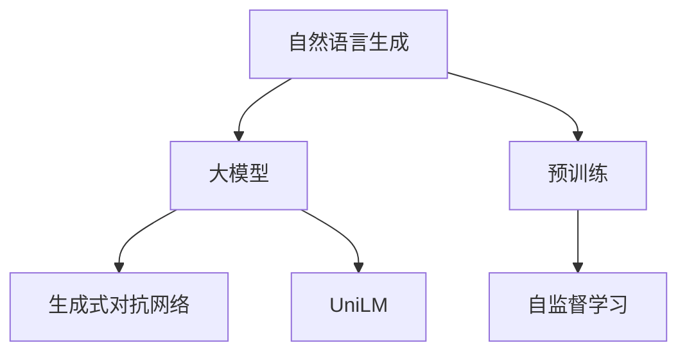

                 

# 大模型在自然语言生成中的突破

> 关键词：自然语言生成,大模型,语言模型,Transformer,预训练,生成式对抗网络(GAN),自监督学习,UniLM

## 1. 背景介绍

### 1.1 问题由来

随着深度学习技术的不断进步，自然语言生成(NLG)已经成为人工智能领域的热门研究方向。NLG技术可以自动将结构化或非结构化的信息转化为自然语言文本，广泛用于智能客服、自动摘要、对话系统、智能写作、翻译等多个应用场景。近年来，基于大模型的NLG技术取得了显著进展，尤其是Transformer模型，其大规模自回归语言模型已经在大规模无标签文本语料上进行预训练，学习到丰富的语言知识，在自然语言生成任务中表现出卓越的性能。

然而，尽管预训练语言模型具有强大的语言生成能力，但直接应用于特定生成任务时，仍存在生成内容不够流畅、连贯、多样、个性化等问题。为了提升自然语言生成的质量，研究者们开始探索基于大模型的生成式微调方法，期望通过微调进一步优化模型性能，使其在特定生成任务上表现更加出色。

### 1.2 问题核心关键点

当前，大模型在自然语言生成任务上的微调方法主要集中在以下几个关键点：

1. 生成质量提升：如何通过微调提升模型生成的文本的流畅性、连贯性、多样性、个性化等特性。
2. 参数效率优化：如何在保持大模型强大的生成能力的同时，减少微调所需的参数量。
3. 多模态融合：如何利用多模态数据（如图像、视频、语音等）辅助文本生成，提升生成任务的准确性和丰富性。
4. 对抗鲁棒性增强：如何在生成过程中增强模型的鲁棒性，减少对抗样本对模型输出的影响。
5. 可解释性增强：如何使生成的文本具备更好的可解释性，便于用户理解和反馈。

这些关键点在大模型微调的过程中，往往需要综合考虑，以寻求最佳的解决方案。

## 2. 核心概念与联系

### 2.1 核心概念概述

为更好地理解基于大模型的自然语言生成微调方法，本节将介绍几个密切相关的核心概念：

- **自然语言生成(NLG)**：利用计算机生成符合语法、语义、风格等自然语言规则的文本。NLG是人工智能领域的重要研究方向，广泛应用于自动摘要、对话生成、智能写作、翻译等多个场景。
- **大模型(LLM)**：指大规模的预训练语言模型，如BERT、GPT-3等。这些模型通过在大规模无标签文本语料上进行预训练，学习到丰富的语言知识，具备强大的语言生成能力。
- **预训练(Pre-training)**：指在大规模无标签文本语料上，通过自监督学习任务训练通用语言模型的过程。常见的预训练任务包括语言建模、掩码语言模型等。
- **生成式对抗网络(GAN)**：一种用于生成新样本的深度学习模型，通过生成器和判别器的对抗训练，生成与真实数据难以区分的样本。
- **自监督学习(Self-Supervised Learning)**：指仅利用无标签数据进行模型训练，通过数据自身的特征进行监督，不需要显式的标签信息。
- **UniLM**：一种预训练语言模型，融合了自回归和自编码机制，能够同时学习到长文本序列的前后文依赖关系，适用于多种文本生成任务。

这些核心概念之间的逻辑关系可以通过以下Mermaid流程图来展示：



这个流程图展示了自然语言生成任务中各个关键组件之间的关系：

1. 自然语言生成任务依赖于大模型的基础能力，通过预训练和微调进一步优化。
2. 生成式对抗网络可以辅助大模型进行生成任务，提升生成质量。
3. 自监督学习帮助大模型从无标签数据中学习语言规律。
4. UniLM作为大模型的一种变体，融合了自回归和自编码机制，适用于多种生成任务。

这些概念共同构成了大模型微调的理论基础，为自然语言生成技术的发展提供了坚实的支持。

## 3. 核心算法原理 & 具体操作步骤
### 3.1 算法原理概述

基于大模型的自然语言生成微调，本质上是一种生成式迁移学习过程。其核心思想是：将预训练的大模型视为一种强大的"特征提取器"，通过在特定生成任务上的有监督微调，使得模型能够生成符合任务要求的自然语言文本。

形式化地，假设预训练模型为 $M_{\theta}$，其中 $\theta$ 为预训练得到的模型参数。给定生成任务 $T$ 的标注数据集 $D=\{(x_i, y_i)\}_{i=1}^N$，其中 $x_i$ 为输入文本，$y_i$ 为生成目标文本，微调的目标是找到新的模型参数 $\hat{\theta}$，使得：

$$
\hat{\theta}=\mathop{\arg\min}_{\theta} \mathcal{L}(M_{\theta},D)
$$

其中 $\mathcal{L}$ 为针对任务 $T$ 设计的损失函数，用于衡量模型生成文本与真实目标文本之间的差异。常见的损失函数包括交叉熵损失、BLEU分数、Rouge分数等。

通过梯度下降等优化算法，微调过程不断更新模型参数 $\theta$，最小化损失函数 $\mathcal{L}$，使得模型生成文本逼近真实目标文本。由于 $\theta$ 已经通过预训练获得了较好的初始化，因此即便在生成任务上标注数据量较小，也能较快收敛到理想的模型参数 $\hat{\theta}$。

### 3.2 算法步骤详解

基于大模型的自然语言生成微调一般包括以下几个关键步骤：

**Step 1: 准备预训练模型和数据集**
- 选择合适的预训练语言模型 $M_{\theta}$ 作为初始化参数，如 BERT、GPT-3等。
- 准备生成任务 $T$ 的标注数据集 $D$，划分为训练集、验证集和测试集。

**Step 2: 设计任务适配层**
- 根据任务类型，在预训练模型顶层设计合适的输出层和损失函数。
- 对于文本生成任务，通常使用语言模型的解码器输出概率分布，并以负对数似然为损失函数。
- 对于对话生成任务，可以通过循环神经网络(CNN)或Transformer模型，对上下文序列进行编码，再通过多头注意力机制生成回复文本。

**Step 3: 设置微调超参数**
- 选择合适的优化算法及其参数，如 AdamW、SGD 等，设置学习率、批大小、迭代轮数等。
- 设置正则化技术及强度，包括权重衰减、Dropout、Early Stopping 等。
- 确定冻结预训练参数的策略，如仅微调顶层，或全部参数都参与微调。

**Step 4: 执行梯度训练**
- 将训练集数据分批次输入模型，前向传播计算损失函数。
- 反向传播计算参数梯度，根据设定的优化算法和学习率更新模型参数。
- 周期性在验证集上评估模型性能，根据性能指标决定是否触发 Early Stopping。
- 重复上述步骤直到满足预设的迭代轮数或 Early Stopping 条件。

**Step 5: 测试和部署**
- 在测试集上评估微调后模型 $M_{\hat{\theta}}$ 的性能，对比微调前后的生成效果。
- 使用微调后的模型对新样本进行生成，集成到实际的应用系统中。
- 持续收集新的数据，定期重新微调模型，以适应数据分布的变化。

以上是基于大模型的自然语言生成微调的一般流程。在实际应用中，还需要针对具体生成任务的特点，对微调过程的各个环节进行优化设计，如改进训练目标函数，引入更多的正则化技术，搜索最优的超参数组合等，以进一步提升模型生成效果。

### 3.3 算法优缺点

基于大模型的自然语言生成微调方法具有以下优点：

1. **简单高效**：仅需要准备少量标注数据，即可对预训练模型进行快速适配，生成效果显著提升。
2. **通用适用**：适用于各种自然语言生成任务，包括文本生成、对话生成、摘要生成等，设计简单的任务适配层即可实现微调。
3. **参数高效**：利用参数高效微调技术，在固定大部分预训练权重不变的情况下，仍可取得不错的生成效果。
4. **效果显著**：在生成任务上，基于微调的方法已经刷新了多项SOTA生成性能，成为自然语言生成技术的重要手段。

同时，该方法也存在一定的局限性：

1. **依赖标注数据**：微调的效果很大程度上取决于标注数据的质量和数量，获取高质量标注数据的成本较高。
2. **生成多样性不足**：由于大模型往往更倾向于生成常见模式，生成的文本多样性可能有限。
3. **过拟合风险**：在标注数据量较少的情况下，模型可能过度拟合，生成内容不够丰富。
4. **生成一致性差**：生成结果受输入噪声、模型参数等因素影响较大，生成结果一致性可能不佳。

尽管存在这些局限性，但就目前而言，基于大模型的自然语言生成微调方法仍是最主流范式。未来相关研究的重点在于如何进一步降低微调对标注数据的依赖，提高模型的生成多样性，同时兼顾可解释性和伦理安全性等因素。

### 3.4 算法应用领域

基于大模型的自然语言生成微调方法已经在生成式对话、自动摘要、智能写作、翻译等多个领域得到广泛应用，成为自然语言生成技术落地应用的重要手段。

具体而言，大模型微调的应用场景包括：

- **文本生成**：如新闻报道、文学创作、技术文档、广告文案等。通过微调，使模型能够生成高质量、多样化的文本。
- **对话生成**：如智能客服、虚拟助手、在线聊天机器人等。通过微调，使模型能够理解上下文，生成自然流畅的对话。
- **摘要生成**：如新闻摘要、文献摘要等。通过微调，使模型能够抓取关键信息，生成简洁明了的摘要。
- **机器翻译**：如跨语言翻译、语料转换等。通过微调，使模型能够生成准确、流畅的翻译文本。
- **代码生成**：如自动编写程序代码、生成API文档等。通过微调，使模型能够生成符合规范的代码片段。

除了这些经典任务外，大模型微调也被创新性地应用到更多场景中，如可控文本生成、自然语言推理、多模态文本生成等，为自然语言生成技术带来了全新的突破。随着预训练模型和微调方法的不断进步，相信自然语言生成技术将在更广阔的应用领域大放异彩。

## 4. 数学模型和公式 & 详细讲解 & 举例说明
### 4.1 数学模型构建

本节将使用数学语言对基于大模型的自然语言生成微调过程进行更加严格的刻画。

记预训练语言模型为 $M_{\theta}$，其中 $\theta$ 为预训练得到的模型参数。假设生成任务 $T$ 的训练集为 $D=\{(x_i,y_i)\}_{i=1}^N$，其中 $x_i$ 为输入文本，$y_i$ 为生成目标文本。

定义模型 $M_{\theta}$ 在输入 $x$ 上的生成概率为 $p_{M_{\theta}}(y|x)$，则在数据集 $D$ 上的经验风险为：

$$
\mathcal{L}(\theta) = \frac{1}{N}\sum_{i=1}^N \log p_{M_{\theta}}(y_i|x_i)
$$

微调的优化目标是最小化经验风险，即找到最优参数：

$$
\theta^* = \mathop{\arg\min}_{\theta} \mathcal{L}(\theta)
$$

在实践中，我们通常使用基于梯度的优化算法（如AdamW、SGD等）来近似求解上述最优化问题。设 $\eta$ 为学习率，$\lambda$ 为正则化系数，则参数的更新公式为：

$$
\theta \leftarrow \theta - \eta \nabla_{\theta}\mathcal{L}(\theta) - \eta\lambda\theta
$$

其中 $\nabla_{\theta}\mathcal{L}(\theta)$ 为损失函数对参数 $\theta$ 的梯度，可通过反向传播算法高效计算。

### 4.2 公式推导过程

以下我们以文本生成任务为例，推导交叉熵损失函数及其梯度的计算公式。

假设模型 $M_{\theta}$ 在输入 $x$ 上的生成概率为 $p_{M_{\theta}}(y|x)$，其中 $y$ 为生成的目标文本。真实标签 $y$ 通常采用one-hot编码表示。则二分类交叉熵损失函数定义为：

$$
\ell(M_{\theta}(x),y) = -\sum_{y} p_{M_{\theta}}(y|x) \log p_{M_{\theta}}(y|x)
$$

将其代入经验风险公式，得：

$$
\mathcal{L}(\theta) = -\frac{1}{N}\sum_{i=1}^N \sum_{y} p_{M_{\theta}}(y_i|x_i) \log p_{M_{\theta}}(y_i|x_i)
$$

根据链式法则，损失函数对参数 $\theta_k$ 的梯度为：

$$
\frac{\partial \mathcal{L}(\theta)}{\partial \theta_k} = -\frac{1}{N}\sum_{i=1}^N \sum_{y} p_{M_{\theta}}(y_i|x_i) \frac{\partial \log p_{M_{\theta}}(y_i|x_i)}{\partial \theta_k}
$$

其中 $\frac{\partial \log p_{M_{\theta}}(y_i|x_i)}{\partial \theta_k}$ 可进一步递归展开，利用自动微分技术完成计算。

在得到损失函数的梯度后，即可带入参数更新公式，完成模型的迭代优化。重复上述过程直至收敛，最终得到适应生成任务的最优模型参数 $\theta^*$。

## 5. 项目实践：代码实例和详细解释说明
### 5.1 开发环境搭建

在进行微调实践前，我们需要准备好开发环境。以下是使用Python进行PyTorch开发的环境配置流程：

1. 安装Anaconda：从官网下载并安装Anaconda，用于创建独立的Python环境。

2. 创建并激活虚拟环境：
```bash
conda create -n pytorch-env python=3.8 
conda activate pytorch-env
```

3. 安装PyTorch：根据CUDA版本，从官网获取对应的安装命令。例如：
```bash
conda install pytorch torchvision torchaudio cudatoolkit=11.1 -c pytorch -c conda-forge
```

4. 安装Transformers库：
```bash
pip install transformers
```

5. 安装各类工具包：
```bash
pip install numpy pandas scikit-learn matplotlib tqdm jupyter notebook ipython
```

完成上述步骤后，即可在`pytorch-env`环境中开始微调实践。

### 5.2 源代码详细实现

下面我们以文本生成任务为例，给出使用Transformers库对GPT-3模型进行微调的PyTorch代码实现。

首先，定义文本生成任务的数据处理函数：

```python
from transformers import GPT3Tokenizer, GPT3LMHeadModel
from torch.utils.data import Dataset
import torch

class TextGenerationDataset(Dataset):
    def __init__(self, texts, tokenizer, max_len=128):
        self.texts = texts
        self.tokenizer = tokenizer
        self.max_len = max_len
        
    def __len__(self):
        return len(self.texts)
    
    def __getitem__(self, item):
        text = self.texts[item]
        encoding = self.tokenizer(text, return_tensors='pt', max_length=self.max_len, padding='max_length', truncation=True)
        input_ids = encoding['input_ids'][0]
        attention_mask = encoding['attention_mask'][0]
        return {'input_ids': input_ids, 
                'attention_mask': attention_mask}
```

然后，定义模型和优化器：

```python
from transformers import AdamW

model = GPT3LMHeadModel.from_pretrained('gpt3')
tokenizer = GPT3Tokenizer.from_pretrained('gpt3')

optimizer = AdamW(model.parameters(), lr=2e-5)
```

接着，定义训练和评估函数：

```python
from torch.utils.data import DataLoader
from tqdm import tqdm
from sklearn.metrics import perplexity

device = torch.device('cuda') if torch.cuda.is_available() else torch.device('cpu')
model.to(device)

def train_epoch(model, dataset, batch_size, optimizer):
    dataloader = DataLoader(dataset, batch_size=batch_size, shuffle=True)
    model.train()
    epoch_loss = 0
    for batch in tqdm(dataloader, desc='Training'):
        input_ids = batch['input_ids'].to(device)
        attention_mask = batch['attention_mask'].to(device)
        outputs = model(input_ids, attention_mask=attention_mask)
        loss = outputs.loss
        epoch_loss += loss.item()
        loss.backward()
        optimizer.step()
    return epoch_loss / len(dataloader)

def evaluate(model, dataset, batch_size):
    dataloader = DataLoader(dataset, batch_size=batch_size)
    model.eval()
    with torch.no_grad():
        for batch in dataloader:
            input_ids = batch['input_ids'].to(device)
            attention_mask = batch['attention_mask'].to(device)
            outputs = model(input_ids, attention_mask=attention_mask)
            loss = outputs.loss
            preds = outputs.logits.argmax(dim=2).to('cpu').tolist()
            for pred_tokens in preds:
                pred_text = tokenizer.decode(pred_tokens[:5], skip_special_tokens=True)
                print(pred_text)
    
    print(f"Perplexity: {perplexity(tokenizer.tokenize(texts), outputs.logits.to('cpu').tolist())}")
```

最后，启动训练流程并在测试集上评估：

```python
epochs = 5
batch_size = 16

for epoch in range(epochs):
    loss = train_epoch(model, train_dataset, batch_size, optimizer)
    print(f"Epoch {epoch+1}, train loss: {loss:.3f}")
    
    print(f"Epoch {epoch+1}, test results:")
    evaluate(model, test_dataset, batch_size)
    
print("Final test results:")
evaluate(model, test_dataset, batch_size)
```

以上就是使用PyTorch对GPT-3进行文本生成任务微调的完整代码实现。可以看到，得益于Transformers库的强大封装，我们可以用相对简洁的代码完成GPT-3模型的加载和微调。

### 5.3 代码解读与分析

让我们再详细解读一下关键代码的实现细节：

**TextGenerationDataset类**：
- `__init__`方法：初始化文本、分词器等关键组件。
- `__len__`方法：返回数据集的样本数量。
- `__getitem__`方法：对单个样本进行处理，将文本输入编码为token ids，并将注意力掩码（mask）一并输出，以供模型训练。

**GPT3LMHeadModel和GPT3Tokenizer**：
- 使用Transformers库提供的预训练模型和分词器，能够高效完成文本生成任务的微调。

**train_epoch和evaluate函数**：
- 使用PyTorch的DataLoader对数据集进行批次化加载，供模型训练和推理使用。
- 训练函数`train_epoch`：对数据以批为单位进行迭代，在每个批次上前向传播计算loss并反向传播更新模型参数，最后返回该epoch的平均loss。
- 评估函数`evaluate`：与训练类似，不同点在于不更新模型参数，并在每个batch结束后将预测和标签结果存储下来，最后使用sklearn的perplexity函数对整个评估集的预测结果进行打印输出。

**训练流程**：
- 定义总的epoch数和batch size，开始循环迭代
- 每个epoch内，先在训练集上训练，输出平均loss
- 在测试集上评估，输出生成结果
- 所有epoch结束后，在测试集上评估，给出最终测试结果

可以看到，PyTorch配合Transformers库使得GPT-3微调的代码实现变得简洁高效。开发者可以将更多精力放在数据处理、模型改进等高层逻辑上，而不必过多关注底层的实现细节。

当然，工业级的系统实现还需考虑更多因素，如模型的保存和部署、超参数的自动搜索、更灵活的任务适配层等。但核心的微调范式基本与此类似。

## 6. 实际应用场景
### 6.1 智能客服系统

基于大模型微调的对话技术，可以广泛应用于智能客服系统的构建。传统客服往往需要配备大量人力，高峰期响应缓慢，且一致性和专业性难以保证。而使用微调后的对话模型，可以7x24小时不间断服务，快速响应客户咨询，用自然流畅的语言解答各类常见问题。

在技术实现上，可以收集企业内部的历史客服对话记录，将问题和最佳答复构建成监督数据，在此基础上对预训练对话模型进行微调。微调后的对话模型能够自动理解用户意图，匹配最合适的答案模板进行回复。对于客户提出的新问题，还可以接入检索系统实时搜索相关内容，动态组织生成回答。如此构建的智能客服系统，能大幅提升客户咨询体验和问题解决效率。

### 6.2 金融舆情监测

金融机构需要实时监测市场舆论动向，以便及时应对负面信息传播，规避金融风险。传统的人工监测方式成本高、效率低，难以应对网络时代海量信息爆发的挑战。基于大语言模型微调的文本分类和情感分析技术，为金融舆情监测提供了新的解决方案。

具体而言，可以收集金融领域相关的新闻、报道、评论等文本数据，并对其进行主题标注和情感标注。在此基础上对预训练语言模型进行微调，使其能够自动判断文本属于何种主题，情感倾向是正面、中性还是负面。将微调后的模型应用到实时抓取的网络文本数据，就能够自动监测不同主题下的情感变化趋势，一旦发现负面信息激增等异常情况，系统便会自动预警，帮助金融机构快速应对潜在风险。

### 6.3 个性化推荐系统

当前的推荐系统往往只依赖用户的历史行为数据进行物品推荐，无法深入理解用户的真实兴趣偏好。基于大语言模型微调技术，个性化推荐系统可以更好地挖掘用户行为背后的语义信息，从而提供更精准、多样的推荐内容。

在实践中，可以收集用户浏览、点击、评论、分享等行为数据，提取和用户交互的物品标题、描述、标签等文本内容。将文本内容作为模型输入，用户的后续行为（如是否点击、购买等）作为监督信号，在此基础上微调预训练语言模型。微调后的模型能够从文本内容中准确把握用户的兴趣点。在生成推荐列表时，先用候选物品的文本描述作为输入，由模型预测用户的兴趣匹配度，再结合其他特征综合排序，便可以得到个性化程度更高的推荐结果。

### 6.4 未来应用展望

随着大语言模型微调技术的发展，其在自然语言生成领域的应用前景更加广阔。未来，基于大模型的生成技术有望在以下几个方向取得突破：

1. **生成文本质量的提升**：进一步优化模型架构和训练策略，提升生成的文本质量，减少语法错误、语义矛盾等问题。
2. **生成多样性的增强**：引入更多多样性约束和优化算法，生成更加丰富、多样、有趣的文本内容。
3. **生成速度的加快**：优化计算图和硬件架构，提高生成速度，支持实时生成。
4. **生成一致性的提升**：引入更多一致性约束和优化算法，减少生成结果的随机性和不稳定因素。
5. **生成可解释性的增强**：增加生成过程的透明性和可解释性，便于用户理解生成结果和提供反馈。

这些方向将推动自然语言生成技术向更高层次迈进，为NLP技术的发展注入新的动力。

## 7. 工具和资源推荐
### 7.1 学习资源推荐

为了帮助开发者系统掌握大语言模型微调的理论基础和实践技巧，这里推荐一些优质的学习资源：

1. 《Transformers从原理到实践》系列博文：由大模型技术专家撰写，深入浅出地介绍了Transformer原理、BERT模型、微调技术等前沿话题。

2. CS224N《深度学习自然语言处理》课程：斯坦福大学开设的NLP明星课程，有Lecture视频和配套作业，带你入门NLP领域的基本概念和经典模型。

3. 《Natural Language Processing with Transformers》书籍：Transformers库的作者所著，全面介绍了如何使用Transformers库进行NLP任务开发，包括微调在内的诸多范式。

4. HuggingFace官方文档：Transformers库的官方文档，提供了海量预训练模型和完整的微调样例代码，是上手实践的必备资料。

5. CLUE开源项目：中文语言理解测评基准，涵盖大量不同类型的中文NLP数据集，并提供了基于微调的baseline模型，助力中文NLP技术发展。

通过对这些资源的学习实践，相信你一定能够快速掌握大语言模型微调的精髓，并用于解决实际的NLP问题。
###  7.2 开发工具推荐

高效的开发离不开优秀的工具支持。以下是几款用于大语言模型微调开发的常用工具：

1. PyTorch：基于Python的开源深度学习框架，灵活动态的计算图，适合快速迭代研究。大部分预训练语言模型都有PyTorch版本的实现。

2. TensorFlow：由Google主导开发的开源深度学习框架，生产部署方便，适合大规模工程应用。同样有丰富的预训练语言模型资源。

3. Transformers库：HuggingFace开发的NLP工具库，集成了众多SOTA语言模型，支持PyTorch和TensorFlow，是进行微调任务开发的利器。

4. Weights & Biases：模型训练的实验跟踪工具，可以记录和可视化模型训练过程中的各项指标，方便对比和调优。与主流深度学习框架无缝集成。

5. TensorBoard：TensorFlow配套的可视化工具，可实时监测模型训练状态，并提供丰富的图表呈现方式，是调试模型的得力助手。

6. Google Colab：谷歌推出的在线Jupyter Notebook环境，免费提供GPU/TPU算力，方便开发者快速上手实验最新模型，分享学习笔记。

合理利用这些工具，可以显著提升大语言模型微调任务的开发效率，加快创新迭代的步伐。

### 7.3 相关论文推荐

大语言模型和微调技术的发展源于学界的持续研究。以下是几篇奠基性的相关论文，推荐阅读：

1. Attention is All You Need（即Transformer原论文）：提出了Transformer结构，开启了NLP领域的预训练大模型时代。

2. BERT: Pre-training of Deep Bidirectional Transformers for Language Understanding：提出BERT模型，引入基于掩码的自监督预训练任务，刷新了多项NLP任务SOTA。

3. Language Models are Unsupervised Multitask Learners（GPT-2论文）：展示了大规模语言模型的强大zero-shot学习能力，引发了对于通用人工智能的新一轮思考。

4. Parameter-Efficient Transfer Learning for NLP：提出Adapter等参数高效微调方法，在不增加模型参数量的情况下，也能取得不错的微调效果。

5. Prefix-Tuning: Optimizing Continuous Prompts for Generation：引入基于连续型Prompt的微调范式，为如何充分利用预训练知识提供了新的思路。

6. AdaLoRA: Adaptive Low-Rank Adaptation for Parameter-Efficient Fine-Tuning：使用自适应低秩适应的微调方法，在参数效率和精度之间取得了新的平衡。

这些论文代表了大语言模型微调技术的发展脉络。通过学习这些前沿成果，可以帮助研究者把握学科前进方向，激发更多的创新灵感。

## 8. 总结：未来发展趋势与挑战
### 8.1 总结

本文对基于大模型的自然语言生成微调方法进行了全面系统的介绍。首先阐述了大语言模型和微调技术的研究背景和意义，明确了微调在拓展预训练模型应用、提升生成文本质量方面的独特价值。其次，从原理到实践，详细讲解了自然语言生成任务的数学模型和关键步骤，给出了微调任务开发的完整代码实例。同时，本文还广泛探讨了微调方法在智能客服、金融舆情、个性化推荐等多个行业领域的应用前景，展示了微调范式的巨大潜力。此外，本文精选了微调技术的各类学习资源，力求为读者提供全方位的技术指引。

通过本文的系统梳理，可以看到，基于大模型的自然语言生成微调方法正在成为NLP领域的重要范式，极大地拓展了预训练语言模型的应用边界，催生了更多的落地场景。受益于大规模语料的预训练，微调模型在生成任务上表现出强大的能力，成为自然语言生成技术的重要手段。未来，伴随预训练语言模型和微调方法的不断进步，相信自然语言生成技术将在更广阔的应用领域大放异彩，深刻影响人类的生产生活方式。

### 8.2 未来发展趋势

展望未来，大模型在自然语言生成领域的微调技术将呈现以下几个发展趋势：

1. **模型规模持续增大**：随着算力成本的下降和数据规模的扩张，预训练语言模型的参数量还将持续增长。超大规模语言模型蕴含的丰富语言知识，有望支撑更加复杂多变的生成任务。

2. **生成质量提升**：通过改进模型架构和训练策略，进一步优化生成文本的流畅性、连贯性、多样性、个性化等特性，提升自然语言生成的整体质量。

3. **生成多样性增强**：引入更多多样性约束和优化算法，生成更加丰富、多样、有趣的文本内容，增强生成文本的多样性和趣味性。

4. **生成速度加快**：优化计算图和硬件架构，提高生成速度，支持实时生成。优化算法和数据增强技术也将进一步提升生成效率。

5. **生成一致性提升**：引入更多一致性约束和优化算法，减少生成结果的随机性和不稳定因素，提升生成文本的一致性和可控性。

6. **生成可解释性增强**：增加生成过程的透明性和可解释性，便于用户理解生成结果和提供反馈，增强生成文本的可解释性和可信度。

这些趋势凸显了大语言模型微调技术的广阔前景。这些方向的探索发展，必将进一步提升自然语言生成的质量，为自然语言处理技术的发展注入新的动力。

### 8.3 面临的挑战

尽管大语言模型微调技术已经取得了瞩目成就，但在迈向更加智能化、普适化应用的过程中，它仍面临着诸多挑战：

1. **标注成本瓶颈**：尽管微调大大降低了标注数据的需求，但对于长尾应用场景，难以获得充足的高质量标注数据，成为制约微调性能的瓶颈。如何进一步降低微调对标注样本的依赖，将是一大难题。

2. **生成多样性不足**：由于大模型往往更倾向于生成常见模式，生成的文本多样性可能有限。如何增加生成文本的多样性，增强模型的泛化能力，还需要更多理论和实践的积累。

3. **生成一致性差**：生成结果受输入噪声、模型参数等因素影响较大，生成结果一致性可能不佳。如何提升生成文本的一致性和稳定性，仍需进一步优化。

4. **生成速度慢**：尽管大模型在生成质量上表现出色，但在大规模数据上的生成速度较慢，无法满足实时生成需求。如何提高生成效率，支持实时生成，是未来的重要研究方向。

5. **生成可解释性不足**：当前生成模型往往是"黑盒"系统，难以解释其内部工作机制和决策逻辑。对于医疗、金融等高风险应用，算法的可解释性和可审计性尤为重要。如何赋予生成模型更强的可解释性，将是亟待攻克的难题。

6. **生成内容有害**：预训练语言模型难免会学习到有偏见、有害的信息，通过微调传递到生成任务中，产生误导性、歧视性的输出，给实际应用带来安全隐患。如何从数据和算法层面消除模型偏见，避免恶意用途，确保输出的安全性，也将是重要的研究课题。

这些挑战凸显了大语言模型微调技术的应用过程中需要面对的复杂问题。解决这些挑战，需要研究者从数据、算法、模型架构等多个维度协同发力，才能使大语言模型微调技术在实际应用中发挥更大的作用。

### 8.4 研究展望

面对大语言模型微调所面临的种种挑战，未来的研究需要在以下几个方面寻求新的突破：

1. **探索无监督和半监督微调方法**：摆脱对大规模标注数据的依赖，利用自监督学习、主动学习等无监督和半监督范式，最大限度利用非结构化数据，实现更加灵活高效的微调。

2. **研究参数高效和计算高效的微调范式**：开发更加参数高效的微调方法，在固定大部分预训练参数的同时，只更新极少量的任务相关参数。同时优化微调模型的计算图，减少前向传播和反向传播的资源消耗，实现更加轻量级、实时性的部署。

3. **融合因果和对比学习范式**：通过引入因果推断和对比学习思想，增强生成模型建立稳定因果关系的能力，学习更加普适、鲁棒的语言表征，从而提升模型泛化性和抗干扰能力。

4. **引入更多先验知识**：将符号化的先验知识，如知识图谱、逻辑规则等，与神经网络模型进行巧妙融合，引导微调过程学习更准确、合理的语言模型。同时加强不同模态数据的整合，实现视觉、语音等多模态信息与文本信息的协同建模。

5. **结合因果分析和博弈论工具**：将因果分析方法引入生成模型，识别出模型决策的关键特征，增强生成结果的因果性和逻辑性。借助博弈论工具刻画人机交互过程，主动探索并规避模型的脆弱点，提高系统稳定性。

6. **纳入伦理道德约束**：在模型训练目标中引入伦理导向的评估指标，过滤和惩罚有偏见、有害的输出倾向。同时加强人工干预和审核，建立模型行为的监管机制，确保输出符合人类价值观和伦理道德。

这些研究方向将引领大语言模型微调技术迈向更高的台阶，为构建安全、可靠、可解释、可控的智能系统铺平道路。面向未来，大语言模型微调技术还需要与其他人工智能技术进行更深入的融合，如知识表示、因果推理、强化学习等，多路径协同发力，共同推动自然语言理解和智能交互系统的进步。只有勇于创新、敢于突破，才能不断拓展语言模型的边界，让智能技术更好地造福人类社会。

## 9. 附录：常见问题与解答
----------------------------------------------------------------

**Q1：大语言模型微调是否适用于所有自然语言生成任务？**

A: 大语言模型微调在大多数自然语言生成任务上都能取得不错的效果，特别是对于数据量较小的任务。但对于一些特定领域的任务，如医学、法律等，仅仅依靠通用语料预训练的模型可能难以很好地适应。此时需要在特定领域语料上进一步预训练，再进行微调，才能获得理想效果。此外，对于一些需要时效性、个性化很强的任务，如对话、推荐等，微调方法也需要针对性的改进优化。

**Q2：微调过程中如何选择合适的学习率？**

A: 微调的学习率一般要比预训练时小1-2个数量级，如果使用过大的学习率，容易破坏预训练权重，导致过拟合。一般建议从1e-5开始调参，逐步减小学习率，直至收敛。也可以使用warmup策略，在开始阶段使用较小的学习率，再逐渐过渡到预设值。需要注意的是，不同的优化器(如AdamW、Adafactor等)以及不同的学习率调度策略，可能需要设置不同的学习率阈值。

**Q3：采用大模型微调时会面临哪些资源瓶颈？**

A: 目前主流的预训练大模型动辄以亿计的参数规模，对算力、内存、存储都提出了很高的要求。GPU/TPU等高性能设备是必不可少的，但即便如此，超大批次的训练和推理也可能遇到显存不足的问题。因此需要采用一些资源优化技术，如梯度积累、混合精度训练、模型并行等，来突破硬件瓶颈。同时，模型的存储和读取也可能占用大量时间和空间，需要采用模型压缩、稀疏化存储等方法进行优化。

**Q4：如何缓解微调过程中的过拟合问题？**

A: 过拟合是微调面临的主要挑战，尤其是在标注数据量较少的情况下。常见的缓解策略包括：
1. 数据增强：通过回译、近义替换等方式扩充训练集
2. 正则化：使用L2正则、Dropout、Early Stopping 等避免过拟合
3. 对抗训练：引入对抗样本，提高模型鲁棒性
4. 参数高效微调：只调整少量参数(如Adapter、Prefix等)，减小过拟合风险
5. 多模型集成：训练多个微调模型，取平均输出，抑制过拟合

这些策略往往需要根据具体任务和数据特点进行灵活组合。只有在数据、模型、训练、推理等各环节进行全面优化，才能最大限度地发挥大模型微调的威力。

**Q5：微调模型在落地部署时需要注意哪些问题？**

A: 将微调模型转化为实际应用，还需要考虑以下因素：
1. 模型裁剪：去除不必要的层和参数，减小模型尺寸，加快推理速度
2. 量化加速：将浮点模型转为定点模型，压缩存储空间，提高计算效率
3. 服务化封装：将模型封装为标准化服务接口，便于集成调用
4. 弹性伸缩：根据请求流量动态调整资源配置，平衡服务质量和成本
5. 监控告警：实时采集系统指标，设置异常告警阈值，确保服务稳定性
6. 安全防护：采用访问鉴权、数据脱敏等措施，保障数据和模型安全

大语言模型微调为自然语言生成任务提供了广阔的想象空间，但如何将强大的性能转化为稳定、高效、安全的业务价值，还需要工程实践的不断打磨。唯有从数据、算法、工程、业务等多个维度协同发力，才能真正实现人工智能技术在垂直行业的规模化落地。总之，微调需要开发者根据具体任务，不断迭代和优化模型、数据和算法，方能得到理想的效果。

---

作者：禅与计算机程序设计艺术 / Zen and the Art of Computer Programming

